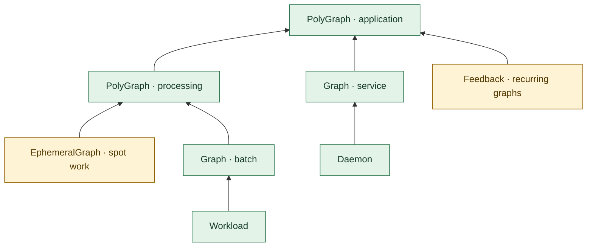
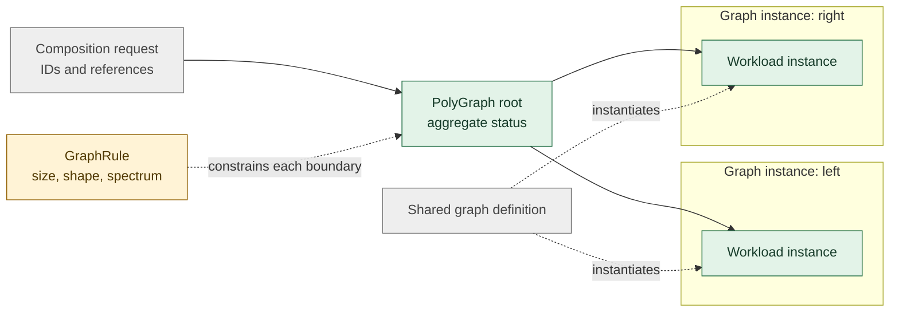
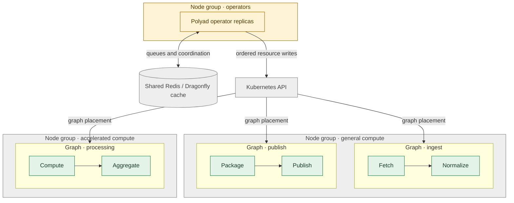
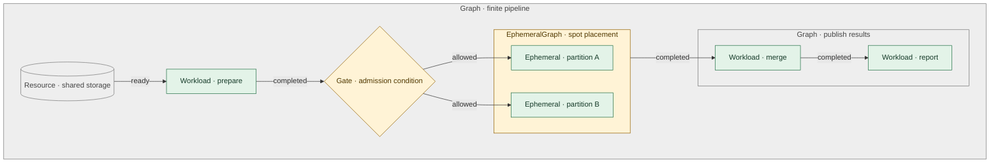
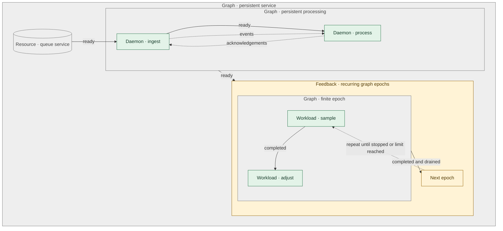

# Polyad

- [Polyad](#polyad)
  - [What Polyad abstracts](#what-polyad-abstracts)
    - [Graphs of graphs](#graphs-of-graphs)
    - [Constrained compositions](#constrained-compositions)
    - [Graphs across node groups](#graphs-across-node-groups)
    - [Finite pipelines](#finite-pipelines)
    - [Persistent services and recurrence](#persistent-services-and-recurrence)
  - [Install](#install)
  - [Python library](#python-library)
  - [Choose an execution model](#choose-an-execution-model)
    - [Quick start: local work](#quick-start-local-work)
    - [Quick start: Kubernetes](#quick-start-kubernetes)
  - [Examples](#examples)
  - [Guides](#guides)
  - [Development](#development)
  - [License](#license)

Polyad is a graph-based workload scheduler for Kubernetes. You describe tasks,
long-running services, and the resources they need as a graph. Polyad's operator
is the controller that turns that description into Kubernetes resources and
tracks their progress.<sup>[\[1\]](docs/operator.md#api-and-python-abstractions)</sup>

The Python library also runs work locally. Workloads must cooperate with pause
and shutdown requests.<sup>[\[2\]](pkg/polyad/balance/README.md#cooperative-execution)</sup><sup>[\[3\]](pkg/polyad/balance/README.md#shutdown-conditions-and-finalizers)</sup>
Restarting with saved state
requires application support and suitable storage; Polyad does not automatically
checkpoint or resume arbitrary containers.<sup>[\[2\]](pkg/polyad/balance/README.md#cooperative-execution)</sup><sup>[\[4\]](docs/operator.md#workload-persistence)</sup>

- Describe finite pipelines, long-running services, and repeated workflows.<sup>[\[5\]](docs/operator.md#daemons-change-the-graphs-contract)</sup>
- Build larger workflows from reusable graphs and view their combined progress.<sup>[\[6\]](docs/operator.md#composing-graph-types-with-polygraph)</sup>
- Choose which groups of Kubernetes machines can run a graph's workloads.<sup>[\[7\]](docs/operator.md#scheduling-a-graph-onto-a-resource-slice)</sup>
- Limit graph size and shape, and trace submitted work to the resources it creates.<sup>[\[8\]](docs/composition-api.md#mathematical-constraints)</sup><sup>[\[9\]](docs/composition-api.md#durability-ordering-and-audit)</sup>

## What Polyad abstracts

A **graph** describes a system as nodes and the relationships between them.
For example, a data pipeline might contain three tasks: fetch records, clean
them, and publish the results. Each task is a node; dependencies describe which
tasks must finish before others can start.

In Polyad, a node can represent:

- A **workload**: a task expected to finish, such as processing a file.<sup>[\[1\]](docs/operator.md#api-and-python-abstractions)</sup>
- A **daemon**: a service expected to keep running, such as an event consumer.<sup>[\[5\]](docs/operator.md#daemons-change-the-graphs-contract)</sup>
- A **resource**: something the work needs, such as configuration or storage.<sup>[\[1\]](docs/operator.md#api-and-python-abstractions)</sup><sup>[\[4\]](docs/operator.md#workload-persistence)</sup>
- Another **graph**: a group of related nodes that forms part of a larger system.<sup>[\[6\]](docs/operator.md#composing-graph-types-with-polygraph)</sup>

These graph nodes describe parts of an application. Kubernetes also uses the
word *node* for a worker machine; those machines provide the capacity on which
the application runs.

Relationships express different things. A **dependency** controls when work can
start: a consumer might wait for a service to become ready, while a report waits
for processing to finish. A **connection** describes data flowing between nodes,
including flows that return to an earlier node.<sup>[\[5\]](docs/operator.md#daemons-change-the-graphs-contract)</sup>
A **gate** adds a
condition or delay before work starts.<sup>[\[1\]](docs/operator.md#api-and-python-abstractions)</sup><sup>[\[10\]](docs/operator.md#delay-gates)</sup>

Grouping nodes into a graph gives you one place to describe where that work
should run and observe its progress. This is the graph's **scheduling boundary**:
its placement rules can cover nested graphs, and its status summarizes the work
inside it.<sup>[\[7\]](docs/operator.md#scheduling-a-graph-onto-a-resource-slice)</sup><sup>[\[11\]](docs/operator.md#graph-instance-status)</sup>
Polyad also tracks the resources it creates
for that graph through their cleanup.<sup>[\[12\]](docs/operator.md#reconciliation-and-shutdown)</sup>

The diagrams use the green, amber and gray palette from Hypothesis Helm's
compiler guides. Green identifies execution and graph summaries, amber marks
constraints or recurrence, and gray identifies resources and containing
boundaries. Labels and shapes carry the meaning independently of color.

### Graphs of graphs

A larger application often contains several smaller workflows. For example,
data preparation and result publication can each be a graph within a processing
application. A graph inside another graph is a **subgraph**; the outermost graph
is the **root**.

`PolyGraph` represents a graph whose nodes are themselves graphs. It can combine
ordinary `Graph` workflows, `EphemeralGraph` workflows for interruptible capacity,
recurring `Feedback` workflows, and other PolyGraphs. A reusable graph definition
acts as a blueprint; each reference creates a separate instance of it.<sup>[\[6\]](docs/operator.md#composing-graph-types-with-polygraph)</sup>

Arrows below show progress summaries passing from each child to its parent,
until the root has a view of the application as a whole.



The root reports its own graph shape and a recursive summary of descendant
work. Missing or stale child observations make that summary explicitly
incomplete.<sup>[\[6\]](docs/operator.md#composing-graph-types-with-polygraph)</sup>

### Constrained compositions

**Composition** means assembling a larger graph from reusable definitions. In
the example below, two nodes use the same graph definition to create separate
instances, each with its own workload. IDs identify both the definitions and
their uses, so a request can be traced to the Kubernetes resources it creates.<sup>[\[9\]](docs/composition-api.md#durability-ordering-and-audit)</sup>

A **GraphRule** describes which graph structures an engineer will allow users to
schedule. Rules can limit size, nesting, or branching, require a shape such as a
tree, or constrain the graph's spectrum—the eigenvalues of a matrix representing
its connections. Namespace-wide rules apply to every graph in that namespace;
graphs can also reference additional rules. Recursive size limits count each
subgraph instance, including repeated uses of the same definition.<sup>[\[8\]](docs/composition-api.md#mathematical-constraints)</sup>



The API's immutable `APIBuilder` configures authenticated composition services<sup>[\[13\]](docs/composition-api.md#enable-the-service)</sup>
and exposes their OpenAPI schema at `/openapi.json`.<sup>[\[14\]](docs/composition-api.md#openapi-schema)</sup>

### Graphs across node groups

A **node group** is a set of Kubernetes worker machines with shared
characteristics, such as general-purpose CPUs or accelerators. **Placement**
describes which machines are suitable for a workload or a whole graph, using
labels and other Kubernetes scheduling constraints.<sup>[\[7\]](docs/operator.md#scheduling-a-graph-onto-a-resource-slice)</sup>

Here, two graphs use general compute and a third uses accelerated compute.
Polyad's operator replicas run on a separate group and coordinate through a
shared cache.<sup>[\[15\]](docs/operator.md#replicas-shared-queues-and-autoscaling)</sup>
Graph placement selects machines for the workloads;
Helm's `nodeSelector` and `tolerations` configure placement for the operator itself.<sup>[\[16\]](charts/polyad/README.md#operator-and-shared-queue-parameters)</sup>



Placement is enforced by default. Set `spec.placement.enforce: false` to let a
more specific workload or subgraph replace those defaults. Enforced ancestors
remain binding. Tolerations are copied into pod templates; they permit matching
taints and do not guarantee capacity or placement by themselves.<sup>[\[7\]](docs/operator.md#scheduling-a-graph-onto-a-resource-slice)</sup>

Workloads using `persistence.enabled: true` must specify `storageClass` and
`claimName`. Schedule these on non-spot capacity. Persistent storage and
StorageClass declarations are invalid under `Ephemeral` and `EphemeralGraph`,
including nested graphs.<sup>[\[4\]](docs/operator.md#workload-persistence)</sup><sup>[\[17\]](docs/operator.md#ephemeral-execution)</sup>

### Finite pipelines

A **finite pipeline** is a workflow with an intended end. This example prepares
data, processes two partitions, then merges and reports the results. Dependencies
express the order, while the two partition tasks can run in parallel.

The partition tasks form an `EphemeralGraph`: a group of work designed to tolerate
interruption and restart on capacity such as spot instances.<sup>[\[17\]](docs/operator.md#ephemeral-execution)</sup>
A separate subgraph
groups the tasks that publish the results.



Solid arrows show what must happen before the next task can start. A completed
finite graph still owns its resources until deletion or a topology change
requires cleanup.<sup>[\[12\]](docs/operator.md#reconciliation-and-shutdown)</sup>
See the [finite example](examples/finite.yaml).

### Persistent services and recurrence

A **persistent graph** describes a system intended to keep operating. Its daemons
are long-running services: an ingestion service and a processing service might
exchange events and acknowledgements continuously. Their readiness tells you
whether the system can serve work; there need not be a completion point.<sup>[\[5\]](docs/operator.md#daemons-change-the-graphs-contract)</sup>

`Feedback` wraps a finite graph so the entire workflow can run repeatedly. Each
execution is an **epoch**. For example, a `sample → adjust` workflow can use new
measurements to update a service's settings on each pass. The application supplies
the decision logic and any state shared between epochs.<sup>[\[18\]](docs/operator.md#feedback-epochs)</sup>

On Kubernetes, epochs run one at a time: the current graph must complete and its
resources finish cleanup before the next starts. `rounds` limits the number of
epochs; omitting it permits indefinite recurrence. `intervalSeconds` sets a
minimum wait after completion, and `suspend: true` drains active work and prevents
another epoch from starting.<sup>[\[18\]](docs/operator.md#feedback-epochs)</sup>

Data can circulate between running services. Startup dependencies must still
allow something to start first, so they cannot form a cycle in which every node
waits for another.<sup>[\[5\]](docs/operator.md#daemons-change-the-graphs-contract)</sup>



Solid arrows show admission or epoch progression; dashed arrows show data flow
or recurrence. On Kubernetes, workloads run as Jobs and daemons as Deployments.<sup>[\[1\]](docs/operator.md#api-and-python-abstractions)</sup>
Deletion waits for owned resources and their finalizers, which keep resources
present while cleanup is pending.<sup>[\[12\]](docs/operator.md#reconciliation-and-shutdown)</sup>

## Install

Requires Python 3.13+. From this checkout, install the Python package with:

```sh
python -m pip install .
```

For local development and the plotting example, install the development group:

```sh
poetry install --with dev
```

Matplotlib is a development dependency. The Kubernetes backend also needs a
cluster, Helm, and an operator image available to that cluster. The
[Helm chart](charts/polyad/README.md) installs CRDs, namespace-scoped RBAC, probes,
operator replicas, and a shared Dragonfly queue with optional HA.<sup>[\[15\]](docs/operator.md#replicas-shared-queues-and-autoscaling)</sup>
Tool versions are pinned in
[`.tool-versions`](.tool-versions).

## Python library

Python applications can define and compose graphs using the library's objects.
Mypy can check their types, and cattrs can convert graph definitions to and from
dictionaries.<sup>[\[19\]](docs/toolchain.md#python-types-and-serialization)</sup>

## Choose an execution model

| Model | Use it for | Execution and observations |
| --- | --- | --- |
| Local Python scheduler | Cooperative workloads with checkpoints, runtime estimates and graph rewrites | Python workers report progress; the scheduler records events and can export diagrams and plots.<sup>[\[20\]](pkg/polyad/balance/README.md#scheduling-and-feedback)</sup><sup>[\[21\]](pkg/polyad/balance/README.md#logs-and-diagrams)</sup> |
| Kubernetes operator | Container workloads, persistent services, spot execution and graphs of graphs | Jobs, Deployments and nested CRs report lifecycle and graph metrics; replicas coordinate ownership and API writes.<sup>[\[11\]](docs/operator.md#graph-instance-status)</sup><sup>[\[15\]](docs/operator.md#replicas-shared-queues-and-autoscaling)</sup> |

The local scheduler supports estimated-duration, FIFO, breadth-first and
depth-first ordering.<sup>[\[20\]](pkg/polyad/balance/README.md#scheduling-and-feedback)</sup><sup>[\[22\]](pkg/polyad/balance/README.md#graph-traversal-ordering)</sup>
Kubernetes admission follows
declared dependencies, gates and per-boundary slot reservations; Kubernetes places
the resulting Pods.<sup>[\[1\]](docs/operator.md#api-and-python-abstractions)</sup><sup>[\[7\]](docs/operator.md#scheduling-a-graph-onto-a-resource-slice)</sup>
Both models keep graph boundaries
responsible for shutdown and cleanup.<sup>[\[3\]](pkg/polyad/balance/README.md#shutdown-conditions-and-finalizers)</sup><sup>[\[12\]](docs/operator.md#reconciliation-and-shutdown)</sup>

### Quick start: local work

```sh
poetry install --with dev
poetry run python examples/heartbeat.py
```

The [heartbeat example](examples/heartbeat.py) reports a one-second heartbeat while the graph grows into a
fork–join pipeline. The command prints the directory containing its plots and
event journal.<sup>[\[21\]](pkg/polyad/balance/README.md#logs-and-diagrams)</sup>

### Quick start: Kubernetes

Build and publish an image to a registry your cluster can pull from. Replace
`YOUR_REGISTRY` in these commands:

```sh
docker build -t YOUR_REGISTRY/polyad:dev .
docker push YOUR_REGISTRY/polyad:dev
helm dependency build charts/polyad
helm upgrade --install polyad charts/polyad --namespace polyad --create-namespace \
  --set image.repository=YOUR_REGISTRY/polyad --set image.tag=dev --wait
kubectl apply -n polyad -f examples/finite.yaml
kubectl get graphs -n polyad -o wide
```

The Python process starts Kopf on its own thread.<sup>[\[12\]](docs/operator.md#reconciliation-and-shutdown)</sup>
Operator replicas
share work notifications through Dragonfly and coordinate graph ownership with
Kubernetes Leases.<sup>[\[15\]](docs/operator.md#replicas-shared-queues-and-autoscaling)</sup>
See [deployment and lifecycle checks](docs/operator.md#build-install-and-exercise).

## Examples

| Example | What it demonstrates |
| --- | --- |
| [Finite pipeline](examples/finite.yaml) | Admit a second Job after the first completes |
| [Resources and gates](examples/resources-and-gates.yaml) | Create configuration, resolve generated names and gate dependent work |
| [Storage and delay](examples/storage-and-delay.yaml) | Require an explicit StorageClass and PVC, then delay workload admission |
| [Persistent service](examples/persistent.yaml) | Run a daemon with startup, readiness and liveness probes |
| [Recurring epochs](examples/feedback.yaml) | Run finite graph instances with a durable round counter |
| [Spot work](examples/ephemeral.yaml) | Apply explicit spot placement to an ephemeral graph |
| [Graph composition](examples/polygraph.yaml) | Compose nested graph types and inspect root status rollups |

Apply examples after installing the operator. Spot examples require node labels
and tolerations that match your cluster; update their placement before applying.<sup>[\[17\]](docs/operator.md#ephemeral-execution)</sup><sup>[\[7\]](docs/operator.md#scheduling-a-graph-onto-a-resource-slice)</sup>

## Guides

| Guide | Contents |
| --- | --- |
| [Operator model](docs/operator.md) | Abstractions, admission, lifecycle, coordination and deployment |
| [Graph status](docs/operator.md#graph-instance-status) | Breadth, depth, lifecycle counters and descendant summaries |
| [Compiler objects](docs/operator.md#resource-compiler-objects) | Attrs resource and status trees, Kubernetes serialization and generated metrics schemas |
| [Health and backlog](docs/operator.md#health) | Pod probes, inbound updates and API write pressure |
| [Local scheduling](pkg/polyad/balance/README.md) | Cooperative work, checkpoints, policies, rewrites and graph images |
| [Python types and serialization](docs/toolchain.md#python-types-and-serialization) | Custom graph references, Mypy checks and cattrs round trips |
| [Helm parameters](charts/polyad/README.md) | Operator, autoscaling and shared queue settings |
| [Development toolchain](docs/toolchain.md) | Pinned tools, editor settings, formatting and generated documentation |

## Development

```sh
poetry install --with dev
poetry run pre-commit install --install-hooks
poetry run pre-commit run --all-files
poetry run pytest
```

Pre-commit checks Python formatting, docstrings, types, shell scripts, Mermaid
diagrams and generated Helm documentation.<sup>[\[23\]](docs/toolchain.md#formatting-and-checks)</sup>
CI also uses
`astrivant/hypothesis-helm` to property-test the chart and runs operator lifecycle
checks in a disposable kind cluster.<sup>[\[24\]](docs/toolchain.md#helm-documentation)</sup>
See the [toolchain setup](docs/toolchain.md#setup).

Polyad was extracted from Hypothesis Helm; its runtime has no Helm dependency.
Cooperative workers respond to cancellation, and finalizers acknowledge cleanup
before their graph boundary is released.<sup>[\[3\]](pkg/polyad/balance/README.md#shutdown-conditions-and-finalizers)</sup>

## License

[GNU General Public License v3.0 only](LICENSE).
