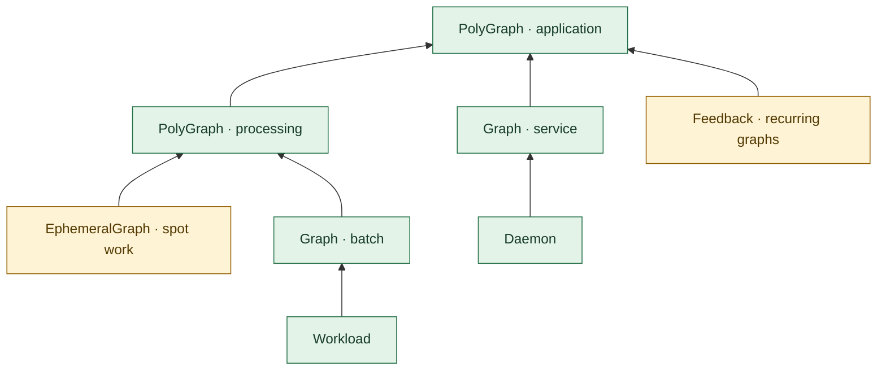
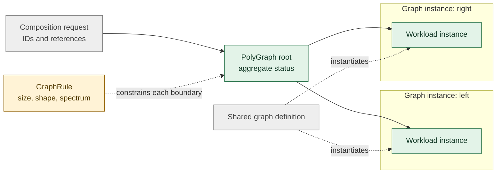
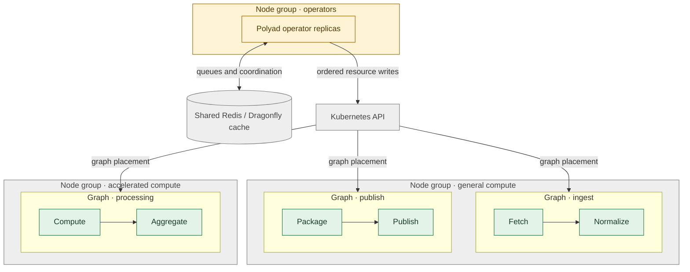
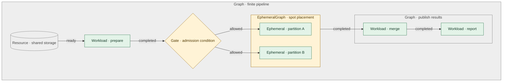
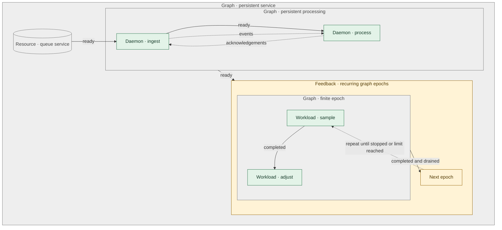

# Polyad

- [Polyad](#polyad)
  - [What Polyad abstracts](#what-polyad-abstracts)
    - [Graphs of graphs](#graphs-of-graphs)
    - [Constrained compositions](#constrained-compositions)
    - [Graphs across node groups](#graphs-across-node-groups)
    - [Finite pipelines](#finite-pipelines)
    - [Persistent services and recurrence](#persistent-services-and-recurrence)
  - [Install](#install)
  - [Python types](#python-types)
  - [Choose an execution model](#choose-an-execution-model)
    - [Quick start: local work](#quick-start-local-work)
    - [Quick start: Kubernetes](#quick-start-kubernetes)
  - [Examples](#examples)
  - [Guides](#guides)
  - [Development](#development)
  - [License](#license)

Polyad is a Kubernetes operator that schedules workloads through graphs.
Compose work, resources, and other graphs into scheduling boundaries.
Graphs describe admission, placement and shutdown; nested instances
report readiness, completion, failure and work counts to their root.

The Python library also supports local cooperative scheduling. Pausing and
restarting with saved state require application support and suitable storage;
Polyad does not automatically checkpoint or resume arbitrary containers.

- Compose finite pipelines, persistent daemon graphs, and recurring graph epochs.
- Group graph types into a `PolyGraph` and observe descendant progress at the root.
- Apply node labels, affinity and tolerations to whole Kubernetes graph boundaries.
- Coordinate operator replicas through Kubernetes Leases and shared Dragonfly queues.
- Schedule cooperative local work by estimates or traversal order.
- Delay admission to a vertex without blocking other ready work.
- Inspect graph breadth, depth, lifecycle counts and cleanup progress.
- Constrain topology and graph spectra with namespace-wide and referenced rules.
- Submit ID-addressed compositions through a Flask API and trace their Kubernetes resources.

## What Polyad abstracts

A graph owns its work until cleanup finishes. Dependencies admit nodes when an
upstream node is started, ready or complete; gates add Boolean conditions.
Placement constraints can apply to a graph and its descendants.

The diagrams use the green, amber and gray palette from Hypothesis Helm's
compiler guides. Green identifies execution and graph summaries, amber marks
constraints or recurrence, and gray identifies resources and containing
boundaries. Labels and shapes carry the meaning independently of color.

### Graphs of graphs

`PolyGraph` composes `Graph`, `EphemeralGraph`, `Feedback`, and other `PolyGraph`
types. Each reference creates an owned instance. Arrows here show status
propagating from children to their parent.



The root reports its own graph shape and a recursive summary of descendant
work. Missing or stale child observations make that summary explicitly
incomplete. See [composition and status rollups](docs/operator.md#composing-graph-types-with-polygraph).

### Constrained compositions

Engineers define structural bounds with `GraphRule`; users compose reusable graph
and workload definitions through IDs. Namespace rules apply at every graph
boundary, and recursive limits account for repeated subgraph instances.



The API's immutable `APIBuilder` configures authenticated composition services
and exposes their OpenAPI schema at `/openapi.json`.
See [structural policies, API setup and auditing](docs/composition-api.md).

### Graphs across node groups

Three graphs can run across two workload node groups, with operator replicas on
a separate group. Graph placement selects the workload groups; Helm's
`nodeSelector` and `tolerations` place the operator independently.



Placement is enforced by default. Set `spec.placement.enforce: false` to let a
more specific workload or subgraph replace those defaults. Enforced ancestors
remain binding. Tolerations are copied into pod templates; they permit matching
taints and do not guarantee capacity or placement by themselves.

Workloads using `persistence.enabled: true` must specify `storageClass` and
`claimName`. Schedule these on non-spot capacity. Persistent storage and
StorageClass declarations are invalid under `Ephemeral` and `EphemeralGraph`,
including nested graphs. See [storage contracts](docs/operator.md#workload-persistence).

### Finite pipelines

A finite graph admits work in dependency order. Nested graphs can group a
parallel stage or apply placement to a resource slice, such as spot capacity.



Solid arrows show the conditions for admitting downstream work. A completed
finite graph still owns its resources until deletion or a topology change
requires cleanup. See the [finite example](examples/finite.yaml) and
[placement guide](docs/operator.md#scheduling-a-graph-onto-a-resource-slice).

### Persistent services and recurrence

Daemons become ready and stop explicitly. Feedback boundaries run successive
finite graph epochs, with an optional round limit. Data-flow connections may
cycle while admission dependencies remain acyclic.



Solid arrows show admission or epoch progression; dashed arrows show data flow
or recurrence. On Kubernetes, workloads run as Jobs and daemons as Deployments.
Deletion waits for owned resources and their finalizers. See
[daemon lifecycle contracts](docs/operator.md#daemons-change-the-graphs-contract).

## Install

Requires Python 3.13+. From this checkout, install the Python package with:

```sh
python -m pip install .
```

For local development and the plotting example, install the development group:

```sh
poetry install --with dev
```

Matplotlib is a development dependency. The Kubernetes backend also needs a
cluster, Helm, and an operator image available to that cluster. The
[Helm chart](charts/polyad/README.md) installs CRDs, namespace-scoped RBAC, probes,
operator replicas, and a shared Dragonfly queue with optional HA. Tool versions are pinned in
[`.tool-versions`](.tool-versions).

## Python types

`PolyGraph[NodeT]` preserves the type of its graph references. `NodeT` must extend
`GraphNode`; it defaults to `GraphNode` for graphs mixing different boundary
kinds. References resolve reusable definitions by name, including definitions
of other PolyGraphs.

```python
from polyad.graph import GraphNode, PolyGraph

graph: PolyGraph[GraphNode] = PolyGraph(
    nodes=(GraphNode(name="batch", kind="Graph", ref="batch-template"),),
)
```

Specialized reference classes retain their types when accessing `graph.nodes`;
see [the checked typing example](examples/typed_graphs.py). The Python package
includes inline types and `py.typed`, so Mypy discovers them when Polyad is
installed. A separate generated stub package is unnecessary. CI checks the
built wheel with both valid and invalid consumer programs.

For cattrs round trips, import `converter` from `polyad.graph.topology` and pass
the same concrete type to both `converter.unstructure(graph, unstructure_as=PolyGraph[YourReference])` and
`converter.structure(document, PolyGraph[YourReference])`. Additional fields on
Python reference subclasses do not extend the Kubernetes CRD schema.

## Choose an execution model

| Model | Use it for | Execution and observations |
| --- | --- | --- |
| Local Python scheduler | Cooperative workloads with checkpoints, runtime estimates and graph rewrites | Python workers report progress; the scheduler records events and can export diagrams and plots |
| Kubernetes operator | Container workloads, persistent services, spot execution and graphs of graphs | Jobs, Deployments and nested CRs report lifecycle and graph metrics; replicas coordinate ownership and API writes |

The local scheduler supports estimated-duration, FIFO, breadth-first and
depth-first ordering. Kubernetes admission follows declared dependencies,
gates and per-boundary slot reservations; Kubernetes places the resulting Pods.
Both models keep graph boundaries responsible for shutdown and cleanup.

### Quick start: local work

```sh
poetry install --with dev
poetry run python examples/heartbeat.py
```

The [heartbeat example](examples/heartbeat.py) reports a one-second heartbeat while the graph grows into a
fork–join pipeline. The command prints the directory containing its plots and
event journal. See the [local scheduler guide](pkg/polyad/balance/README.md).

### Quick start: Kubernetes

Build and publish an image to a registry your cluster can pull from. Replace
`YOUR_REGISTRY` in these commands:

```sh
docker build -t YOUR_REGISTRY/polyad:dev .
docker push YOUR_REGISTRY/polyad:dev
helm dependency build charts/polyad
helm upgrade --install polyad charts/polyad --namespace polyad --create-namespace \
  --set image.repository=YOUR_REGISTRY/polyad --set image.tag=dev --wait
kubectl apply -n polyad -f examples/finite.yaml
kubectl get graphs -n polyad -o wide
```

The Python process starts Kopf on its own thread. Operator replicas share work
notifications through Dragonfly and coordinate graph ownership with Kubernetes
Leases. See [deployment and lifecycle checks](docs/operator.md#build-install-and-exercise)
and [replica coordination](docs/operator.md#replicas-shared-queues-and-autoscaling).

## Examples

| Example | What it demonstrates |
| --- | --- |
| [Finite pipeline](examples/finite.yaml) | Admit a second Job after the first completes |
| [Resources and gates](examples/resources-and-gates.yaml) | Create configuration, resolve generated names and gate dependent work |
| [Storage and delay](examples/storage-and-delay.yaml) | Require an explicit StorageClass and PVC, then delay workload admission |
| [Persistent service](examples/persistent.yaml) | Run a daemon with startup, readiness and liveness probes |
| [Recurring epochs](examples/feedback.yaml) | Run finite graph instances with a durable round counter |
| [Spot work](examples/ephemeral.yaml) | Apply explicit spot placement to an ephemeral graph |
| [Graph composition](examples/polygraph.yaml) | Compose nested graph types and inspect root status rollups |

Apply examples after installing the operator. Spot examples require node labels
and tolerations that match your cluster; update their placement before applying.

## Guides

| Guide | Contents |
| --- | --- |
| [Operator model](docs/operator.md) | Abstractions, admission, lifecycle, coordination and deployment |
| [Graph status](docs/operator.md#graph-instance-status) | Breadth, depth, lifecycle counters and descendant summaries |
| [Compiler objects](docs/operator.md#resource-compiler-objects) | Attrs resource trees and Kubernetes serialization in `polyad.compiler` |
| [Health and backlog](docs/operator.md#health) | Pod probes, inbound updates and API write pressure |
| [Local scheduling](pkg/polyad/balance/README.md) | Cooperative work, checkpoints, policies, rewrites and graph images |
| [Helm parameters](charts/polyad/README.md) | Operator, autoscaling and shared queue settings |
| [Development toolchain](docs/toolchain.md) | Pinned tools, editor settings, formatting and generated documentation |

## Development

```sh
poetry install --with dev
poetry run pre-commit install --install-hooks
poetry run pre-commit run --all-files
poetry run pytest
```

Pre-commit checks Python formatting, docstrings, types, shell scripts, Mermaid
diagrams and generated Helm documentation. CI also uses `astrivant/hypothesis-helm`
to property-test the chart and runs operator lifecycle checks in a disposable
kind cluster. See the [toolchain setup](docs/toolchain.md).

Polyad was extracted from Hypothesis Helm; its runtime has no Helm dependency.
Cooperative workers respond to cancellation, and finalizers acknowledge cleanup
before their graph boundary is released.

## License

[GNU General Public License v3.0 only](LICENSE).
