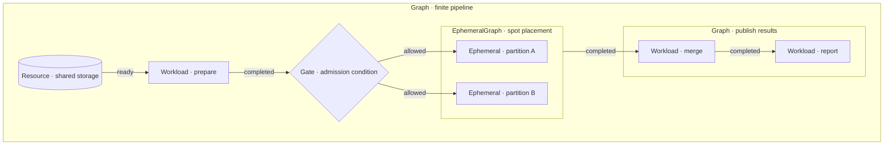
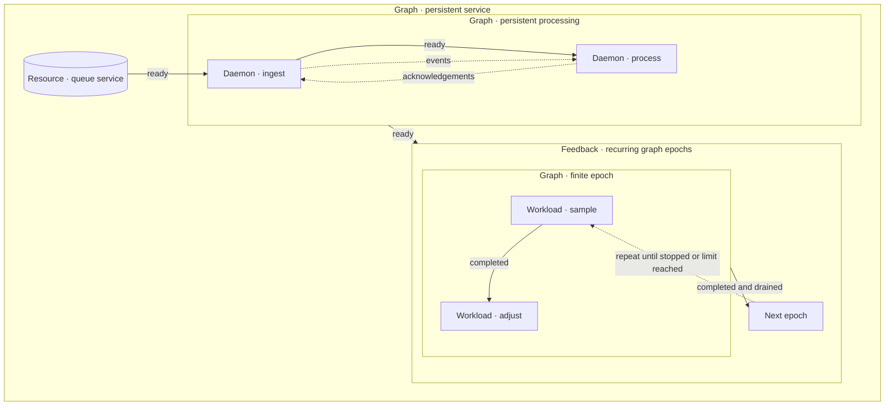

# Polyad

Adaptive graph orchestration with resumable work, graph rewrites, routing gates and explicit lifecycle contracts.

## What Polyad abstracts

A graph groups work, resources, and smaller graphs into a lifecycle boundary.
Dependencies admit work when an upstream node is ready or complete; gates add
conditions. Placement constraints can apply to a whole graph and its descendants.

Persistent graphs stay active. Daemons become ready without completing, while
feedback boundaries run successive finite graph epochs. Cyclic data flow is
separate from the dependencies that admit execution.

Boxes within boxes are nested graph boundaries. Solid arrows show admission or
epoch progression; dashed arrows show data flow or recurrence. On Kubernetes,
workloads run as Jobs, daemons as Deployments, and graph boundaries own their
children through cleanup.

- Compose dependency graphs and bounded feedback cycles.
- Schedule by estimated duration, FIFO, breadth-first or depth-first order.
- Checkpoint cooperative work and finalize cleanup before releasing graph boundaries.
- Route with Boolean observations and export graph revisions as diagrams or PNGs.

## Quick start

~~~bash
poetry install -E plotting
poetry run polyad-example
~~~

Each example unit reports a healthy one-second heartbeat. The running graph grows into a fork–join pipeline.
The command prints the directory containing its plots and event journal.

[Guide, examples and graph images](pkg/polyad/balance/README.md)

## Development

~~~bash
poetry run pytest
poetry run ruff check .
poetry run mypy pkg
~~~

Polyad was extracted from hypothesis-helm. It is a separate project; its runtime has no Helm dependency.
Shutdown remains cooperative: workers must respond to cancellation and finalizers must acknowledge cleanup.

## Kubernetes operator

Run finite Jobs, persistent daemons, recurring graphs, and spot-backed `Ephemeral`
workloads with a Python-owned Kopf operator. Graph CRs define dependencies, readiness
edges, nested boundaries, and resource ownership. The Helm chart ships the CRDs,
namespace-scoped RBAC, pod probes, and a shared Dragonfly queue. Lease-elected
replicas divide graph duties into shards; optional HPA scales the operator pods.

[Operator model, daemon/cycle semantics, deployment and examples](docs/operator.md)
