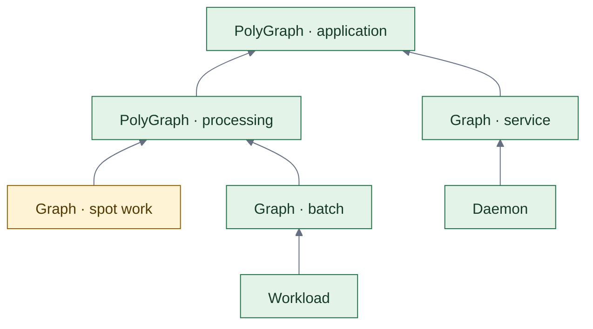
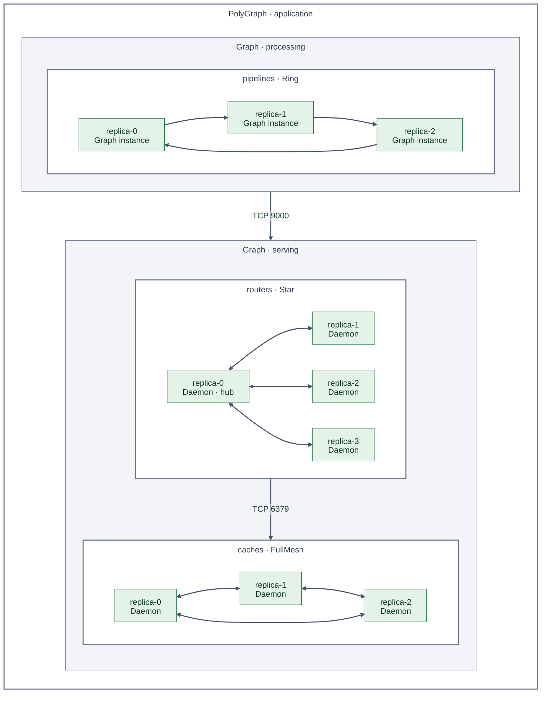
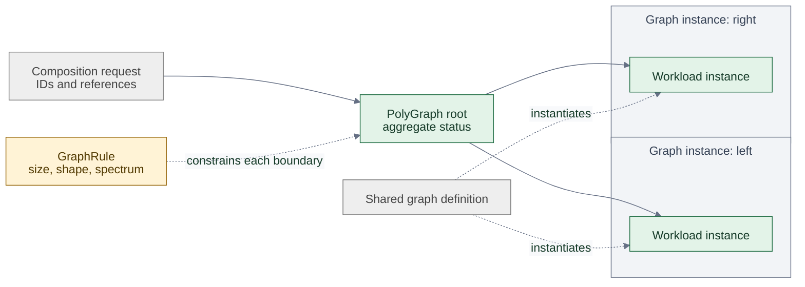
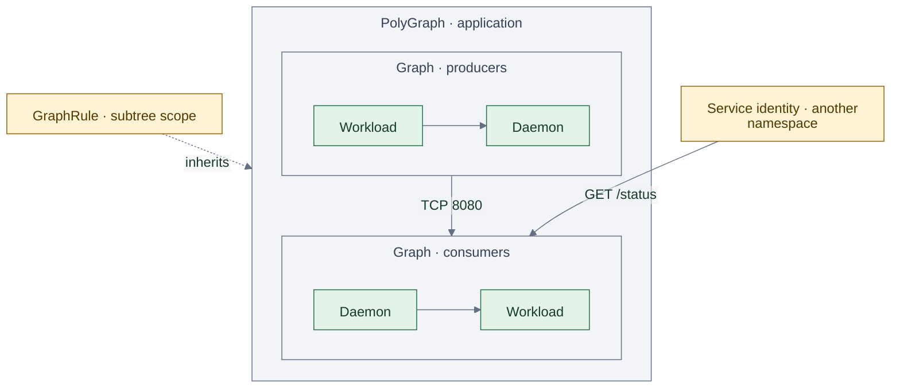
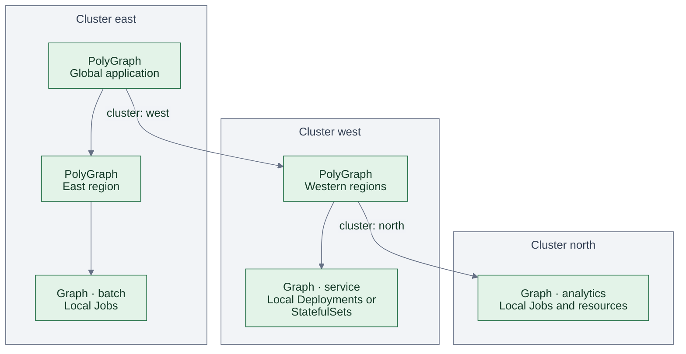
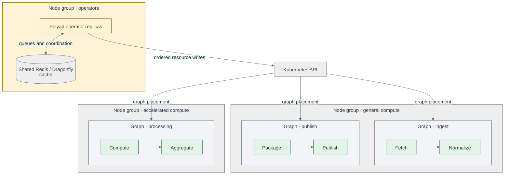
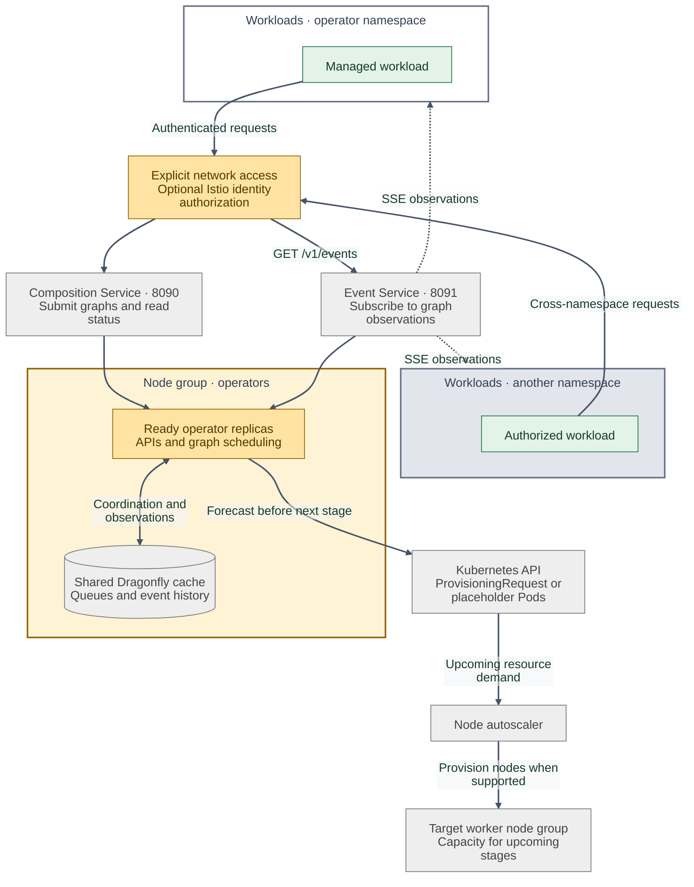
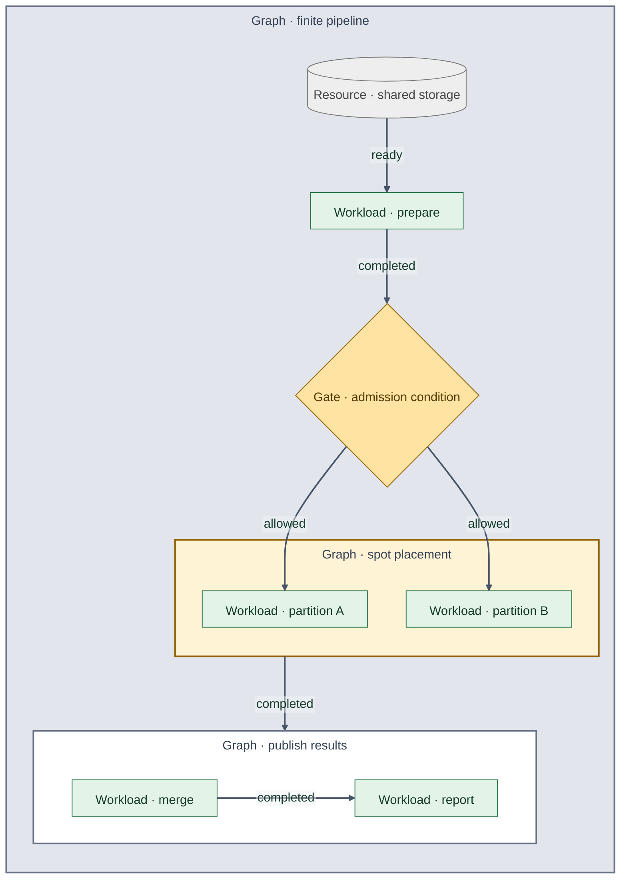
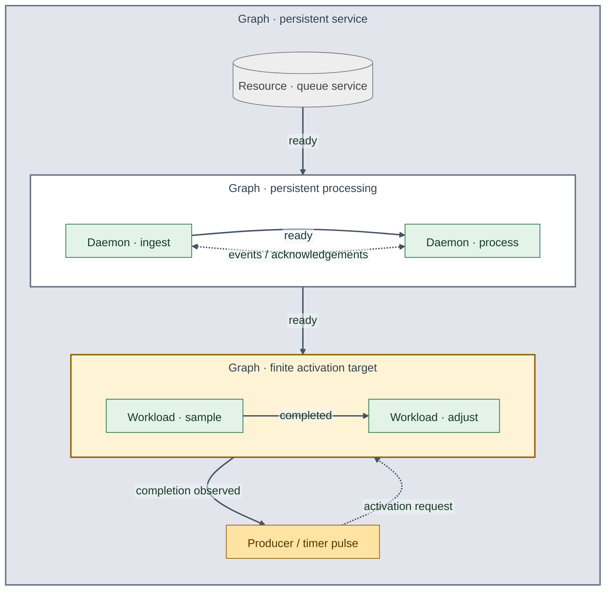
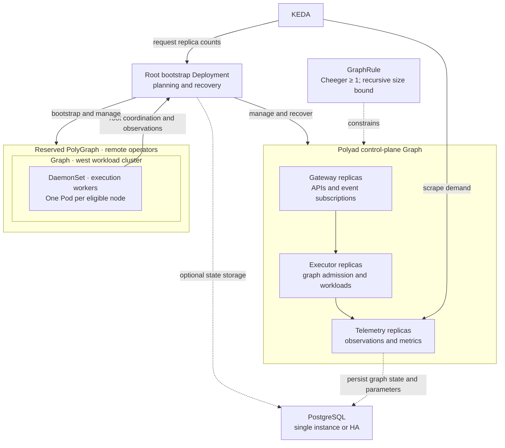

# Polyad

Polyad (named after [*polyads*](https://en.wikipedia.org/wiki/Polyad_%28mathematics%29)) is a Kubernetes operator for deploying, connecting and scaling applications as graphs.
Compose batch jobs, persistent services and supporting resources into reusable
Graphs and PolyGraphs. Define how work starts, how components communicate and
which structural constraints must hold as the application changes—from a workflow
in one cluster to a hierarchy spanning multiple clusters.[\[2\]](docs/deployment/operator.md#api-and-python-abstractions)

**[Get started](docs/introduction/getting-started.md)** · **[Documentation](docs/README.md)** · **[Helm chart](charts/polyad/README.md)**

- **Compose workloads and resources.** Run finite pipelines and persistent services
  using Jobs, Deployments, StatefulSets or DaemonSets, with dependencies, activation policies,
  [storage](docs/workloads/workload-storage.md) and [placement](#graphs-across-node-groups).
- **Scale within graph constraints.** [KEDA and ReplicaGroups](docs/graphs/replication.md)
  scale individual services, whole graphs or nested compositions. Polyad refreshes
  live graph state and enforces [GraphRules](docs/graphs/graph-rules.md), including size,
  shape and structural Cheeger bounds, before applying scaling changes.
  Optional [throughput feedback](docs/graphs/throughput-feedback.md) maps application demand
  to separate Cheeger targets and recommends or applies approved connection layouts.
- **Make connectivity explicit.** Choose replica connection patterns, including
  custom edges, and enforce [network boundaries](docs/deployment/networking.md) with optional
  NetworkPolicy and Istio integration.
- **Let services participate.** Through the [standalone Python client](pkg/client/README.md),
  workloads can submit compositions, activate work, request [TTL-bound connections](docs/apis/temporary-connections.md)
  and discover neighbors through [topology events](docs/workloads/workload-events.md).
  [Shared types](pkg/polyad-types/README.md) are also available separately from the operator.
- **Coordinate across clusters.** A [root operator](docs/deployment/root-control-plane.md) can
  run in a dedicated management cluster, deploy graphs and execution replicas into
  registered workload clusters, and collect their observations centrally.
- **Choose the control-plane layout.** Select a [single-replica or HA Helm profile](docs/deployment/deployment-profiles.md).
  HA can run dense operators or
  [separate gateway, executor and telemetry components](docs/deployment/components.md)
  managed through the operator's own Graph. Optionally persist graph state and
  tracked measurements in [PostgreSQL](docs/deployment/postgresql.md).

## Table of contents

- [Polyad](#polyad)
  - [Table of contents](#table-of-contents)
  - [Get started](#get-started)
  - [What Polyad abstracts](#what-polyad-abstracts)
    - [Motivation](#motivation)
    - [Graphs of graphs](#graphs-of-graphs)
    - [Replica connections](#replica-connections)
    - [Autoscaling the hierarchy](#autoscaling-the-hierarchy)
    - [Constrained compositions](#constrained-compositions)
    - [Network boundaries](#network-boundaries)
    - [Graphs across clusters](#graphs-across-clusters)
    - [Graphs across node groups](#graphs-across-node-groups)
    - [Workloads calling the operator](#workloads-calling-the-operator)
    - [Finite pipelines](#finite-pipelines)
    - [Persistent services and recurrence](#persistent-services-and-recurrence)
    - [The operator as a Graph](#the-operator-as-a-graph)
  - [What Polyad is not](#what-polyad-is-not)
  - [License](#license)
  - [References](#references)

## Get started

Deploy the [Kubernetes operator](docs/introduction/getting-started.md#quick-start-kubernetes)
with the Helm chart, or try the [local Python scheduler](docs/introduction/getting-started.md#quick-start-local-work).
The [examples](docs/introduction/getting-started.md#examples) cover pipelines, services,
spot work, storage and nested graphs.

Applications can install the [Python client](pkg/client/README.md) or just the
[shared types](pkg/polyad-types/README.md) without installing the operator. From a
checkout, use `pip install ./pkg/polyad-types`; the standalone distribution is
named `polyad-types` and exposes `polyad_types`.

Explore [graph concepts](docs/introduction/concepts.md), [graph rules](docs/graphs/graph-rules.md),
[composition requests](docs/apis/composition-requests.md), the [composition API](docs/apis/composition-api.md),
[networking and event subscriptions](docs/deployment/networking.md),
[temporary connections](docs/apis/temporary-connections.md),
[API keys and shared request lanes](docs/operations/api-keys.md), or the
[development guide](docs/development/toolchain.md). See the [documentation index](docs/README.md)
for lifecycle, status, health and configuration references.

## What Polyad abstracts

A **graph** groups related work and describes how its parts depend on each other.
Its **nodes** can be tasks, services, resources or other graphs. A data pipeline
might fetch records, process partitions in parallel, then publish the results;
a service graph might keep consumers and their supporting resources running.[\[3\]](docs/introduction/concepts.md)

### Motivation

Deploying a distributed application means deciding how its services connect,
which work can run together, and how those relationships should change as demand
grows. Polyad makes that topology an explicit, reusable part of the deployment,
with [rules](docs/graphs/graph-rules.md) that constrain its size, structure and permitted
connections across nested graphs.

This lets teams scale individual services, complete pipelines or compositions of
graphs while preserving the application's topology requirements.
[KEDA requests replica counts](docs/graphs/replication.md#connect-keda) through
ReplicaGroups; Polyad recomputes the live graph family's measurements and checks
applicable constraints before creating or retiring copies. A scaling decision
must fit the surrounding application's rules as well as the group's own limits.

For data pipelines, [Cheeger bounds](docs/graphs/graph-rules.md#cheeger-bottleneck-bounds)
provide a structural assurance against bottlenecks: a minimum requires enough
edges across every split relative to the size of its smaller side, at each
configured boundary. This supports throughput goals by rejecting topologies with
overly sparse connections between stages or replicas. Actual throughput still
depends on processing capacity, bandwidth and workload; the Cheeger measurement
counts connections and does not guarantee a data rate.

[Application throughput feedback](docs/graphs/throughput-feedback.md) connects those
structural measurements to workload-specific demand tiers. Keep hard GraphRules
bounds separate from calibrated targets, use Observe mode to inspect recommendations,
and opt into Adapt for bounded changes with stabilization and cooldowns.
See [comparing Cheeger policies](docs/graphs/cheeger-orchestration.md) for diagrams of
their different orchestration decisions and interaction with replica scaling.

Services can also participate in changing their own topology. By installing the
[Python client](pkg/client/README.md), applications can submit
[compositions](docs/apis/composition-requests.md), activate work and request
[temporary connections](docs/apis/temporary-connections.md) with a bounded lifetime
through enabled, authorized APIs. Polyad checks requested changes against the
applicable rules and removes temporary connection grants after expiry.
[Topology events](docs/workloads/workload-events.md) let workloads discover their current
neighbors as connections and replica membership change. This gives applications
room to adapt while keeping deployment constraints under operator control.

### Graphs of graphs

Compose smaller workflows into an application with `PolyGraph`. Each child
reports progress to its parent, giving the root a combined view of the work.[\[4\]](docs/introduction/concepts.md#graphs-of-graphs)

In the diagrams below, green marks work and graph summaries, amber marks
constraints or recurrence, and gray marks resources and containing boundaries.

Example: nested graphs reporting to an application root

Read about [graphs of graphs](docs/introduction/concepts.md#graphs-of-graphs).

### Replica connections

Each ReplicaGroup can choose its own [connection mode](docs/graphs/replication.md#connections-between-copies).
Here, one subgraph connects whole graph replicas in a [Ring](docs/graphs/replication.md#ring);
another combines daemon replicas in a [Star](docs/graphs/replication.md#star) with
[bidirectional connections](docs/graphs/replication.md#bidirectional-connections) and a
[FullMesh](docs/graphs/replication.md#fullmesh). Edges between enclosing graphs and groups
are declared separately at their [network boundaries](docs/deployment/networking.md#isolating-a-subgraph).

Example: three replica layouts and connections across subgraphs

The three inner boxes are ReplicaGroups. Their internal edges use these settings:

| ReplicaGroup | Copies | Connection configuration | Internal ports |
| --- | --- | --- | --- |
| `pipelines` | Graph | [Ring](docs/graphs/replication.md#ring) | TCP 8080 |
| `routers` | Daemon | [Star](docs/graphs/replication.md#star), [`bidirectional: true`](docs/graphs/replication.md#bidirectional-connections) | TCP 9000 |
| `caches` | Daemon | [FullMesh](docs/graphs/replication.md#fullmesh) | TCP 6379 |

Arrows show directed data-flow connections; double arrows declare both directions.
The application boundary connects processing to serving on TCP 9000; the serving
boundary connects routers to caches on TCP 6379. These connections
become transport grants when [graph networking](docs/deployment/networking.md) is enabled,
subject to inherited restrictions. Copies without a configured mode remain
[Independent](docs/graphs/replication.md#independent), with no inter-copy edges. Scaling rebuilds the selected pattern and
notifies workloads through [topology events](docs/workloads/workload-events.md).

This example fits within one cluster. For remote Graph workloads, see the
[east-west gateway diagram](docs/deployment/multicluster.md#istio-across-different-networks)
and [direct Pod routing diagram](docs/deployment/multicluster.md#same-network-clusters).
Remote placement and data-flow edges need separately configured traffic policies.

### Autoscaling the hierarchy

[KEDA can autoscale different levels of the hierarchy](docs/graphs/replication.md#connect-keda)
by targeting a ReplicaGroup's Kubernetes `/scale` subresource. The group's
template determines what each additional replica creates:

- **[Daemon replicas](docs/graphs/replication.md#example-daemon-replicas):** another service instance, backed by its selected Deployment
  or StatefulSet. Set the Daemon's own `replicas: 1` when each group copy should
  represent one desired Pod.
- **[Graph replicas](docs/graphs/replication.md#example-graph-replicas):** another complete workflow or service graph, including its
  workloads, resources and internal connections.
- **[PolyGraph](docs/graphs/replication.md#example-polygraph-replicas) or [nested ReplicaGroup replicas](docs/graphs/replication.md#example-nested-replicagroups):** another composition of graphs or
  replica groups, allowing scaling at multiple levels of the same application.

For example, scale a worker pool inside a processing graph as its queue grows,
and scale copies of the whole processing graph as demand for complete pipelines
grows. Scale one group instance independently, or scale a shared definition to
update every inheriting instance; see [instance and shared scaling](docs/graphs/replication.md#independent-instances-and-all-uses-of-a-definition).

Before creating or retiring copies, Polyad refreshes the owning graph family's
topology and checks replica bounds and applicable GraphRules, including structural
limits and Cheeger constraints. KEDA supplies the requested count;
constraints can block its application. Target the ReplicaGroup to use these
checks: directly autoscaling a generated Deployment or StatefulSet bypasses graph
admission. See [constraints before scaling](docs/graphs/replication.md#constraints-before-scaling).

A ReplicaGroup of PolyGraphs can also scale a complete cross-cluster composition.
Each destination can independently scale its own local groups. The
[multicluster scaling diagram](docs/deployment/multicluster.md#graphrules-cheeger-bounds-and-scaling)
shows where each cluster refreshes live values and enforces its own rules.

### Constrained compositions

Build workflows from reusable definitions and trace each instance to its
Kubernetes resources. `GraphRule` lets engineers constrain what users can
schedule by size, shape, nesting and mathematical properties.[\[5\]](docs/graphs/graph-rules.md#structural-limits)[\[6\]](docs/apis/composition-requests.md#durability-ordering-and-audit)

Example: reusable graph definitions with structural constraints

Read about [composition requests](docs/apis/composition-requests.md) and [GraphRule constraints](docs/graphs/graph-rules.md).

### Network boundaries

Group workloads into subgraphs with explicit network connections. Scoped rules
control traffic across boundaries and namespaces; optional Istio integration
adds HTTP and service-identity authorization.[\[7\]](docs/deployment/networking.md#selection-scope-and-inheritance)[\[8\]](docs/deployment/networking.md#cross-namespace-peers-and-http-authorization)

Example: subgraph connections and cross-namespace authorization

Read about [network scope and inheritance](docs/deployment/networking.md#selection-scope-and-inheritance) and [cross-namespace authorization](docs/deployment/networking.md#cross-namespace-peers-and-http-authorization).
This diagram shows one cluster; [remote traffic rules](docs/deployment/multicluster.md#remote-traffic-rules)
are configured separately at each end of a cross-cluster connection.

### Graphs across clusters

Graphs execute within one cluster. PolyGraphs can optionally place child Graphs
and nested PolyGraphs in registered remote clusters, composing regions and higher
levels. Optional shared observers expose read-only graph snapshots while each
cluster's operator enforces its own rules and executes its workloads. See
[cross-cluster placement, Istio transport and observers](docs/deployment/multicluster.md).

A [root operator control plane](docs/deployment/root-control-plane.md) can manage this entire
hierarchy from a separate management cluster. It installs remote execution replicas,
collects their observations centrally and coordinates KEDA through root-local scale
targets. See the [deployment architecture](docs/deployment/root-control-plane.md#authority-and-execution)
and [complete configuration example](examples/root-control-plane/values.yaml).

Example: nested PolyGraphs composing three clusters

Arrows show declared parent-child ownership; child status rolls back up to the
root. Each Graph's workloads stay inside its cluster. The east operator manages
the western PolyGraph's intent; the west operator manages that PolyGraph's
children, including the Graph in north. Each destination operator executes its
local work. The same hierarchy can be entirely local by omitting `cluster`.

Read about [graphs of graphs](docs/introduction/concepts.md#graphs-of-graphs),
[remote placement and ownership](docs/deployment/multicluster.md#placement-and-ownership),
and the [execution architecture](docs/deployment/multicluster.md#execution-and-observation).
The [two-cluster example](examples/multicluster/application.yaml) demonstrates
local nesting in east with a remote Graph in west; the diagram extends this
pattern with another remote PolyGraph and cluster.

### Graphs across node groups

Place whole graphs on groups of Kubernetes machines, such as general compute
or accelerators. Here, three graphs share two worker groups while coordinated
operator replicas and their shared Dragonfly cache run on a third.[\[9\]](docs/deployment/operator.md#scheduling-a-graph-onto-a-resource-slice)[\[10\]](docs/deployment/operator.md#replicas-shared-queues-and-autoscaling)

Example: three graphs across two worker groups

Read about [graph placement](docs/deployment/operator.md#scheduling-a-graph-onto-a-resource-slice) and [operator replicas and shared queues](docs/deployment/operator.md#replicas-shared-queues-and-autoscaling).

### Workloads calling the operator

Running workloads can submit their next graph, read its status and subscribe to
graph events through the operator's optional APIs. Services route requests to
ready replicas; explicitly authorized callers can connect from other
namespaces.[\[15\]](docs/deployment/networking.md#workload-access-to-operator-apis)

A running service can also pulse downstream workloads or daemon replica groups,
with explicit concurrency and frequency policies.[\[17\]](docs/workloads/activation.md)

With a capacity policy, Polyad forecasts upcoming stages while earlier work
runs, giving a compatible node autoscaler advance notice. Dependencies and gates
still decide when the next stage starts.[\[16\]](docs/graphs/capacity.md)

Example: API access, event streams and advance capacity requests

Read about [workload API access](docs/deployment/networking.md#workload-access-to-operator-apis), [event subscriptions](docs/workloads/workload-events.md), and [advance capacity requests](docs/graphs/capacity.md).

### Finite pipelines

Express a workflow from preparation to publication, with parallel tasks and
gates that wait for a condition or delay. Ordinary Graph placement can select
spot capacity; applications choose how to handle interruption and storage.[\[11\]](docs/introduction/concepts.md#finite-pipelines)[\[12\]](docs/deployment/operator.md#delay-gates)

Example: parallel spot workloads behind an admission gate

Read about [finite pipelines](docs/introduction/concepts.md#finite-pipelines) and [admission and delay gates](docs/deployment/operator.md#delay-gates).

### Persistent services and recurrence

Keep services running with `Daemon`, and repeat finite Graphs with activation
requests. A producer or timer supplies each pulse; the application owns iteration
limits, stop conditions and durable shared state.[\[13\]](docs/deployment/operator.md#repeated-execution)

Example: persistent services with repeated graph activations

Solid arrows show startup or execution progression; dashed arrows show data flow
or a new activation request.

Read about [repeated execution](docs/deployment/operator.md#repeated-execution) and [activation pulses](docs/workloads/activation.md).

The operator can also [request capacity ahead of upcoming stages](docs/graphs/capacity.md),
helping node autoscalers prepare machines while upstream work runs.

Queue pressure and graph hierarchies are available through the optional
[Prometheus and JSON metrics API](docs/operations/metrics.md).

Optional [OpenTelemetry tracing](docs/operations/tracing.md) exports API request,
reconciliation and Kubernetes operation spans to an OTLP/HTTP collector, with
configurable sampling and Secret-backed exporter credentials.
[KEDA can scale services or whole graph compositions](docs/graphs/replication.md) through
`ReplicaGroup`, using workload metrics served by the operator.

[Argo CD](docs/operations/argocd.md) and [Flux health checks](docs/operations/fluxcd.md) report graph and leaf health across nested applications.

### The operator as a Graph

Polyad can run as a compact HA Deployment or manage its own service components
in a Graph. With `architecture.mode: Distributed`, gateway, executor and telemetry
ReplicaGroups scale independently through KEDA and fresh GraphRule checks. A
separate root bootstrap Deployment retains planning and recovery responsibility.

The arrows inside the Graph describe logical stages; actual coordination uses
Kubernetes and Dragonfly. Cheeger constrains topology, while queue backlog and
HTTP demand drive capacity decisions. See the
[component and networking diagrams](docs/deployment/components.md#the-operators-own-graph)
and [deployable example](examples/components/values.yaml).

Optional [DaemonSet worker pools](docs/deployment/root-control-plane.md#reserved-graphs-for-node-workers)
extend the reserved topology with a PolyGraph containing a remote Graph and its
DaemonSet. Deployment pools support KEDA replica scaling; DaemonSet capacity follows
node eligibility. Application event streams exclude these operator trees.

[PostgreSQL is optional](docs/deployment/postgresql.md), disabled by default, and stores
graph observations and tracked parameters when enabled. Its optional
[KEDA configuration](examples/postgresql/keda.yaml) scales CloudNativePG instances
from operator connection counts, still scraped from the operator. Additional
database instances provide standby/read capacity; writes continue through the
primary.

## What Polyad is not

Polyad coordinates application graphs alongside existing cluster components.

- **A general-purpose policy engine such as OPA.** `GraphRule` constrains the
  graphs Polyad admits and the resources it compiles. It does not evaluate Rego,
  replace application authorization, or enforce policy on every Kubernetes API
  request. Cluster-wide admission policy remains a separate concern.[\[18\]](https://www.openpolicyagent.org/docs)[\[19\]](docs/deployment/operator.md#structural-policy-and-composition-api)
- **A replacement for the Kubernetes scheduler or node autoscaler.** Polyad
  controls when graph work is admitted and propagates placement constraints.
  Kubernetes places Pods; the configured autoscaler provisions machines.
  Grouping work does not guarantee that every Pod starts together.[\[9\]](docs/deployment/operator.md#scheduling-a-graph-onto-a-resource-slice)[\[20\]](docs/graphs/capacity.md#scheduling-demand-and-placement)
- **A service mesh or network transport.** Polyad generates network and Istio
  policy resources. The cluster's networking implementation and mesh enforce
  them; drawing a graph connection does not transport application data.[\[21\]](docs/deployment/networking.md#enforcement-and-lifecycle)
- **Automatic process checkpointing or exactly-once execution.** Restarting
  containers with persistent storage requires application recovery logic.
  Workloads must handle retries and duplicate effects; graph ownership and
  ordered API writes do not make application operations transactional.[\[22\]](docs/deployment/operator.md#workload-persistence)[\[10\]](docs/deployment/operator.md#replicas-shared-queues-and-autoscaling)

## License

[GNU General Public License v3.0 only](LICENSE).

## References

Selected background reading for Polyad's architecture and less common design
choices.

- **Infrastructure at scale:** Eduardo Barth, Medium Engineering,
  [Kubernetes Infrastructure At Medium](https://medium.engineering/kubernetes-infrastructure-at-medium-d9e2444932ef)
  (February 14, 2023). A case study covering separate clusters, gradual
  infrastructure rollouts, resource sizing and spare capacity for traffic bursts.
- **Structural bottlenecks:** Shlomo Hoory, Nathan Linial and Avi Wigderson,
  [Expander Graphs and Their Applications](https://www.math.ias.edu/~avi/PUBLICATIONS/MYPAPERS/HLW06/hlw06.pdf#page=14)
  (2006, Section 2.1). The edge-expansion definition used by Polyad's
  [Cheeger bounds](docs/graphs/graph-rules.md#cheeger-bottleneck-bounds), which measure
  graph structure rather than application throughput.
- **Rewriting and composition:** Dimitri Ara et al.,
  [Polygraphs: From Rewriting to Higher Categories](https://arxiv.org/abs/2312.00429).
  Background for the rewriting, confluence and higher-dimensional diagrams in
  the [mutation documentation](docs/development/mutation-diagrams.md).
- **Advance capacity:** The [Cluster Autoscaler ProvisioningRequest FAQ](https://github.com/kubernetes/autoscaler/blob/master/cluster-autoscaler/FAQ.md#how-can-i-use-provisioningrequest-to-run-batch-workloads).
  Reserving capacity before a workload stage becomes runnable; see Polyad's
  [advance-capacity design](docs/graphs/capacity.md).
- **Pending delivery recovery:** Dragonfly's
  [`XAUTOCLAIM`](https://www.dragonflydb.io/docs/command-reference/stream/xautoclaim).
  Recovering unacknowledged stream entries when a queue consumer loses ownership.
- **GitOps health:** [Argo CD custom health checks](https://argo-cd.readthedocs.io/en/stable/operator-manual/health/#custom-health-checks)
  and [Flux health expressions](https://fluxcd.io/flux/components/kustomize/kustomizations/#health-check-expressions).
  Reporting graph and descendant health to deployment controllers.
