# Polyad

<!-- toc:start -->
**Table of contents**

- [Get started](#get-started)
  - [Deploy and configure](#deploy-and-configure)
  - [Develop and run local demos](#develop-and-run-local-demos)
  - [Find detailed guides](#find-detailed-guides)
- [Why Polyad exists](#why-polyad-exists)
  - [Motivation and inspiration](#motivation-and-inspiration)
  - [Problems that grow with the application](#problems-that-grow-with-the-application)
  - [How Polyad addresses these problems](#how-polyad-addresses-these-problems)
- [What Polyad abstracts](#what-polyad-abstracts)
  - [Application composition](#application-composition)
  - [Adaptive microservices](#adaptive-microservices)
  - [Scaling and capacity](#scaling-and-capacity)
  - [Connectivity and placement](#connectivity-and-placement)
  - [Workload lifecycles](#workload-lifecycles)
  - [Control plane and operations](#control-plane-and-operations)
- [What Polyad is not](#what-polyad-is-not)
- [License](#license)
- [References](#references)
<!-- toc:end -->

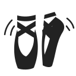

Polyad (named after [*polyads*](https://en.wikipedia.org/wiki/Polyad_%28mathematics%29) in mathematics)
is a Kubernetes operator and Python SDK for writing and orchestrating adaptive microservices. Deploy,
connect and scale applications as graphs within and across clusters, enforce
Cheeger bounds, and adjust topology, traffic and capacity to application demand.
Compose batch jobs, persistent services and supporting resources into reusable
Graphs and PolyGraphs. Define how work starts, how components communicate, how
they respond to application demand and which constraints must hold as the application
changes, from a workflow in one cluster to a hierarchy spanning multiple clusters.[\[2\]](docs/deployment/operator.md#api-and-python-abstractions)
The Kubernetes operator is built on [Kopf](https://docs.kopf.dev/en/stable/),
the Kubernetes Operators Framework for Python.

**[Get started](docs/introduction/getting-started.md)** · **[Documentation](docs/README.md)** · **[Helm chart](charts/polyad/README.md)**

- **Compose workloads and resources.** Run finite pipelines and persistent services
  using Jobs, Deployments, StatefulSets or DaemonSets, with dependencies, activation policies,
  [storage](docs/workloads/workload-storage.md) and [placement](#graphs-across-node-groups).
- **Scale within graph constraints.** [KEDA and ReplicaGroups](docs/graphs/replication.md)
  scale individual services, whole graphs or nested compositions. Polyad refreshes
  live graph state and enforces [GraphRules](docs/graphs/graph-rules.md), including size,
  shape and structural Cheeger bounds, before applying scaling changes.
- **Adapt to administrator-defined demand.** [Soul searching](docs/graphs/soul-searching.md)
  uses offered throughput or a named signal, such as queued jobs, to select approved
  Cheeger targets, connection layouts, traffic splits and capacity lookahead.
  Observe recommendations or allow bounded adaptation, including preparation before
  throughput falls behind. Hard rules and resource ceilings stay fixed.
- **Make connectivity explicit.** Choose replica connection patterns, including
  custom edges, and enforce [network boundaries](docs/deployment/networking.md) with optional
  NetworkPolicy and Istio integration. [Istio percentage routing](docs/graphs/traffic-balancing.md)
  divides requests among workload or graph replicas using fixed splits, demand tiers
  or measured spare capacity.
- **Let services participate.** Through the [standalone Python SDK](pkg/polyad-sdk/README.md),
  workloads can submit compositions, activate work, request [TTL-bound connections](docs/apis/temporary-connections.md)
  and discover permitted services across the [atlas](docs/apis/discovery.md), with filtered
  event hooks and peer-approved connections. This application model is
  [**Service Symbiosis**](docs/workloads/adaptive-microservices.md): services with
  different roles discover compatible peers and adjust their work together.
  [Shared types](pkg/polyad-types/README.md) and [JSON Schemas](pkg/polyad-schemas/README.md)
  are also available separately from the operator.
- **Rebalance event subscriptions.** Subscribe over SSE or WebSocket and opt into
  [paced reconnections](docs/operations/event-rebalancing.md) as operator replicas change.
  Clients resume from their checkpoints through Service/Istio routing or discovered Pod IPs.
- **Coordinate across clusters.** A [root operator](docs/deployment/root-control-plane.md) can
  run in a dedicated management cluster, deploy graphs and execution replicas into
  registered workload clusters, and collect their observations centrally.
- **Choose the control-plane layout.** Select a [single-replica or HA Helm profile](docs/deployment/deployment-profiles.md).
  HA can run dense operators or
  [separate gateway, executor and telemetry components](docs/deployment/components.md)
  managed through the operator's own Graph. Optionally persist graph state and
  tracked measurements in [PostgreSQL](docs/deployment/postgresql.md).
- **Observe and coordinate changes.** Inspect [Prometheus and JSON metrics](docs/operations/metrics.md) and
  [OpenTelemetry traces and decision logs](docs/operations/tracing.md).
  The [write pipeline](docs/development/write-pipeline.md) coalesces duplicate mutations,
  checks dependencies before dispatch and returns stale decisions to reconciliation.

## Get started

### Deploy and configure

Deploy the [Kubernetes operator](docs/introduction/getting-started.md#quick-start-kubernetes)
with the Helm chart, or try the [local Python scheduler](docs/introduction/getting-started.md#quick-start-local-work).
The [examples](docs/introduction/getting-started.md#examples) cover pipelines, services,
spot work, storage and nested graphs.

For application feedback, start with the [approved load-profile example](examples/load-profiles.yaml)
and its [Helm reference values](charts/polyad/references/values-soul-searching.reference.yaml).
The [demand guide](docs/graphs/load-profiles.md#define-demand) explains signal names,
units and thresholds; use `Observe` mode to inspect recommendations before enabling adaptation.

### Develop and run local demos

Applications can install the [Python SDK](pkg/polyad-sdk/README.md) or just the
[shared types](pkg/polyad-types/README.md) without installing the operator. From a
checkout, use `pip install ./pkg/polyad-types`; the standalone distribution is
named `polyad-types` and exposes `polyad_types`.

Use [Service Symbiosis](docs/workloads/adaptive-microservices.md) to write
producers and consumers that cooperate across Graphs and PolyGraphs: discover
compatible peers, react to connection and capacity deltas, propagate backpressure
and report useful completion. Run the standalone [`python demo/soul.py`](demo/soul.py)
[local demonstration](docs/workloads/local-soul-searching.md) to watch three service
processes share queued work over an added TCP connection and roll their child
workers under load. It compares completion time, latency and backlog against a
fixed chain with the same load and worker limits.
Run [`python demo/nature.py`](demo/nature.py) for the [parent Natural Selection demonstration](docs/workloads/local-natural-selection.md):
changing requirements select capabilities and routes, mutate services, preserve
useful survivors and retire excluded processes.

### Find detailed guides

Explore [graph concepts](docs/introduction/concepts.md), [graph rules](docs/graphs/graph-rules.md),
[composition requests](docs/apis/composition-requests.md), the [composition API](docs/apis/composition-api.md),
[networking and event subscriptions](docs/deployment/networking.md),
[temporary connections](docs/apis/temporary-connections.md),
[API keys and shared request lanes](docs/operations/api-keys.md), or the
[development guide](docs/development/toolchain.md). See the [documentation index](docs/README.md)
for lifecycle, status, health and configuration references.

## Why Polyad exists

### Motivation and inspiration

While at Klaviyo, I briefly crossed paths with engineers working on a project converting the company's cloud architecture to a setup where clusters managed other clusters, a concept they'd designed at Medium. That idea helped
motivate Polyad's [root control plane](docs/deployment/root-control-plane.md) and
nested PolyGraphs. Medium's
[Kubernetes Infrastructure At Medium](https://medium.engineering/kubernetes-infrastructure-at-medium-d9e2444932ef)
provides public background on this strategy's multi-cluster infrastructure, gradual rollouts
and capacity planning.

### Problems that grow with the application

#### Coordinating dependent services

Deploying a distributed application means deciding how its services connect,
which work can run together, and how those relationships should change as demand
grows. Those relationships need to remain understandable and enforceable as the
application spans more services, teams and clusters.

A scaling decision that helps one service can leave the rest of its pipeline
overloaded or disconnected. Teams need a way to express what must remain true
for the whole application as its parts grow, shrink or span more clusters.
Polyad aims to make that coordination repeatable, with room for applications to
adapt within boundaries their administrators can trust.

#### Request latency

Growth puts pressure on both **request latency** and **recovery time**, especially
when it adds interconnected dependencies and increases resource utilization.
A request involving more services has more opportunities to wait on a slow
component, and shared resources accumulate queues. Dean and Barroso's
[*The Tail at Scale*](https://research.google/pubs/the-tail-at-scale/) explains
how occasional delays can become a dominant performance problem at larger scales.

#### Recovery and cascading failures

Recovery can also become slower and more involved. An overloaded service can
shift work onto its neighbors, while retries add more demand to struggling
dependencies. Restoring useful capacity may require several services to recover,
new Pods or nodes to become ready, and caches to warm. Google's account of
[cascading failures](https://sre.google/sre-book/addressing-cascading-failures/)
describes how these effects can reinforce one another.

### How Polyad addresses these problems

#### Respond close to the work

Growth also creates opportunities for parallelism and spare capacity. Dividing
work into well-defined boundaries lets individual requests and recovery decisions
remain local as the application expands. Polyad's architectural objective is to
preserve these short reaction paths while coordinating changes that affect
shared dependencies. Available capacity becomes useful when services can reach
it and adapt how they use it.

[Service Symbiosis](docs/workloads/adaptive-microservices.md) brings part of that
response into the microservices themselves. A producer can reduce outstanding
work when a consumer slows down, or send compatible work to an authorized peer
with spare capacity. A consumer can adjust concurrency, switch worker profiles
or drain accepted jobs before replacing workers. The
[Python SDK's adaptive interface](pkg/polyad-sdk/README.md#adaptive-services-and-deltas)
exposes connection, capacity and decision changes to application-defined
[strategies](docs/workloads/adaptation-strategies.md). These local responses let
services use their existing resources while additional infrastructure is being
prepared. Services can also request [temporary connections](docs/apis/temporary-connections.md)
and new compositions within their permissions.

#### Coordinate graph-wide changes

[Graphs and PolyGraphs](docs/introduction/concepts.md) make related workloads and
their connections reusable deployment units. [GraphRules](docs/graphs/graph-rules.md)
express their structural requirements, which Polyad checks against live state
before applying [ReplicaGroup scaling requests](docs/graphs/replication.md#constraints-before-scaling).
A [root control plane](docs/deployment/root-control-plane.md) extends that model
across registered clusters, coordinating deployments and collecting observations.

At those larger boundaries, [Soul searching](docs/graphs/soul-searching.md) uses
observed demand, completed throughput and reported spare capacity to guide
approved connection changes and [traffic balancing](docs/graphs/traffic-balancing.md).
Traffic can shift between individual services, whole graph replicas or PolyGraph
replicas as their measured ability to accept work changes.
[Cheeger bounds](docs/graphs/cheeger-orchestration.md) constrain structural
bottlenecks, while [capacity preparation](docs/graphs/load-profiles.md) gives
upcoming stages and node autoscalers notice of future demand. Application
measurements and load tests establish useful targets for each boundary.

#### Measure the adaptation envelope

The same approach applies to a small producer-consumer pair and an application
spread across clusters: respond close to the work, report what happened, and
coordinate broader changes where dependencies are shared. Immediate admission
and backpressure stay local; graph changes follow configured observation windows,
cooldowns and resource limits. This gives a growing system ways to respond promptly
without every reaction waiting for coordination across the whole application.
Its [adaptation envelope](docs/workloads/adaptive-microservices.md#define-the-adaptation-envelope)
records which changes it can absorb, how quickly it recovers and which constraints
it must preserve.

## What Polyad abstracts

A **graph** groups related work and describes how its parts depend on each other.
Its **nodes** can be tasks, services, resources or other graphs. A data pipeline
might fetch records, process partitions in parallel, then publish the results;
a service graph might keep consumers and their supporting resources running.[\[3\]](docs/introduction/concepts.md)

### Application composition

#### Polygraphs: graphs of graphs

Compose smaller workflows into an application with `PolyGraph`. Each child
reports progress to its parent, giving the root a combined view of the work.[\[4\]](docs/introduction/concepts.md#graphs-of-graphs)

In the diagrams below, green marks work and graph summaries, amber marks
constraints or recurrence, and gray marks resources and containing boundaries.

<strong>Example:</strong> nested graphs reporting to an application root

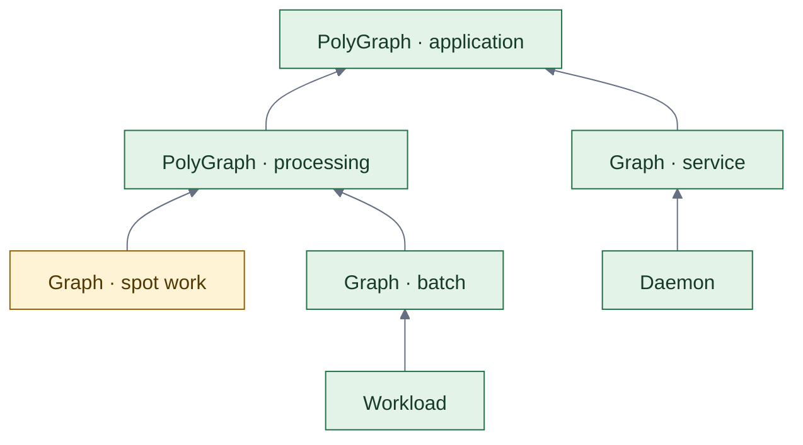

Read about [graphs of graphs](docs/introduction/concepts.md#graphs-of-graphs).

#### Constrained compositions

Build workflows from reusable definitions and trace each instance to its
Kubernetes resources. `GraphRule` lets engineers constrain what users can
schedule by size, shape, nesting and mathematical properties.[\[5\]](docs/graphs/graph-rules.md#structural-limits)[\[6\]](docs/apis/composition-requests.md#durability-ordering-and-audit)

<strong>Example:</strong> reusable graph definitions with structural constraints

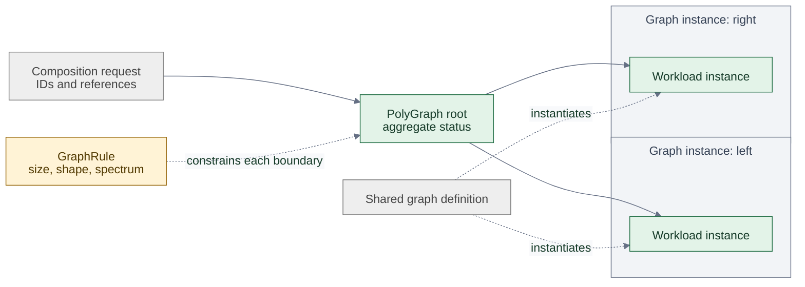

Read about [composition requests](docs/apis/composition-requests.md) and [GraphRule constraints](docs/graphs/graph-rules.md).

### Adaptive microservices

#### Writing Adaptive Microservices for execution in Polygraphs

##### Soul searching: adapt a service's workers

Application code can participate in adaptation, using available capacity while
protecting work it has already accepted. The [Soul study](studies/soul/README.md)
demonstrates this with six real Python service processes, a load generator and a
monitoring parent. Each service uses the SDK's adaptation strategies to respond
to changing demand and controlled disturbances.

[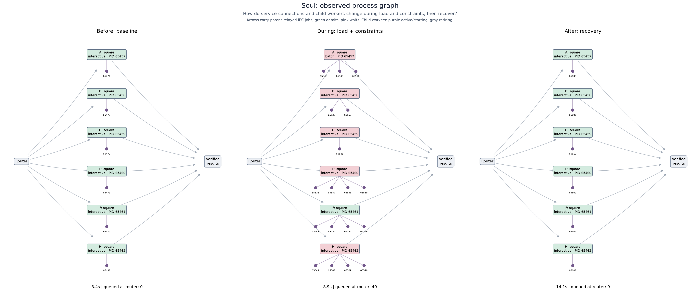](studies/soul/figures/topology.png)

*Build services that put spare capacity to work and release extra workers when
demand falls. These recorded process graphs show services adding batch workers,
switching to compact workers under modeled memory pressure and recovering their
original footprint. Accepted jobs remain tracked through each transition.
Click the figure to inspect the worker identities and connections.*

The parent routes new jobs toward services with room to accept them. Services
pause new assignments when observations become unavailable, peers become
unhealthy or connection permission expires, while draining work already accepted.
The study compares fixed and adaptive trials under the same offered load and
resource ceilings, verifies every completed job, and records queue sizes,
completion latency and process lifecycles.

##### Natural Selection: adapt service compositions

The [Nature study](studies/nature/README.md) adds composition decisions above
those local adaptations. When the required output changes, its Natural Selection
planner chooses which service implementations and connections can deliver it
within the configured process and cost limits.

[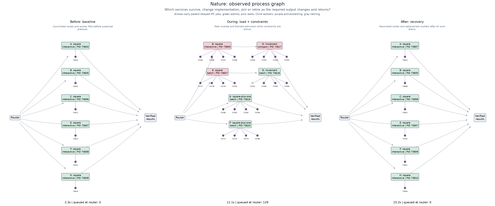](studies/nature/figures/topology.png)

*Let services contribute in different ways as requirements change. A and F switch
to implementations that perform both processing steps; B and E keep running and
connect to new services that supply the second step. C and H retire after draining
their accepted work. When the original requirement returns, the planner restores
the original composition. Each selected service continues adapting its own
workers. Click the figure to follow the process identities and routes.*

##### Application responsibilities

For developers, the reusable pattern is to keep business processing separate from
the policies that decide when to accept work, which worker profile to run and how
to replace it safely. Extend [`AdaptiveService`](pkg/polyad-sdk/README.md#adaptive-services-and-deltas),
choose [strategies for your application's constraints](docs/workloads/adaptation-strategies.md),
and measure whether those adaptations improve useful completion and recovery.
The [study's strategy modules](studies/soul/README.md#strategy-modules) and
[repeatable run instructions](studies/soul/README.md#run) provide a working starting
point with before, during and after measurements.

#### Workloads calling the operator

Running workloads can submit their next graph, read its status and subscribe to
graph events through the operator's optional APIs. Services route requests to
ready replicas; explicitly authorized callers can connect from other
namespaces.[\[15\]](docs/deployment/networking.md#workload-access-to-operator-apis)

A running service can also pulse downstream workloads or daemon replica groups,
with explicit concurrency and frequency policies.[\[17\]](docs/workloads/activation.md)

The [Python SDK](pkg/polyad-sdk/README.md) supports filtered event hooks over SSE
or WebSocket. With optional [connection rebalancing](docs/operations/event-rebalancing.md),
operators send paced reconnect instructions, called **copulses**, when membership
changes or an administrator starts a roll. Clients retain their last completed
checkpoint, refresh ready endpoints and reconnect through Service/Istio routing
or direct client-side round robin. Graceful shutdown gives subscriptions a bounded
window to reconnect. See the [scale-out](docs/operations/event-rebalancing.md#scale-out-and-subscription-migration)
and [scale-down](docs/operations/event-rebalancing.md#scale-down-and-shutdown)
sequence diagrams and [typed Helm reference](charts/polyad/references/values-event-rebalancing.reference.yaml).

With a capacity policy, Polyad forecasts upcoming stages while earlier work
runs, giving a compatible node autoscaler advance notice. Dependencies and gates
still decide when the next stage starts.[\[16\]](docs/graphs/capacity.md)

<strong>Example:</strong> API access, event streams and advance capacity requests

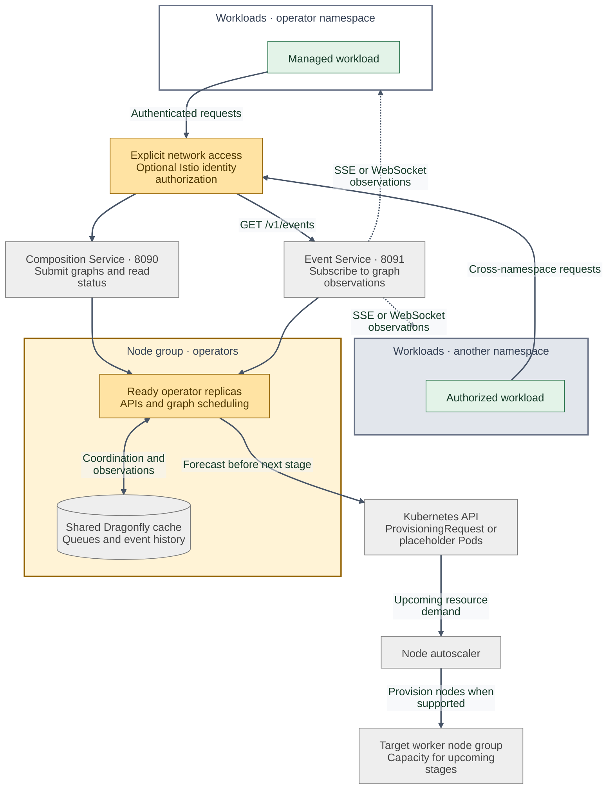

Read about [workload API access](docs/deployment/networking.md#workload-access-to-operator-apis), [event subscriptions](docs/workloads/workload-events.md), and [advance capacity requests](docs/graphs/capacity.md).

### Scaling and capacity

#### Autoscaling the hierarchy

##### Choose the scaling target

[KEDA can autoscale different levels of the hierarchy](docs/graphs/replication.md#connect-keda)
by targeting a ReplicaGroup's Kubernetes `/scale` subresource. The group's
template determines what each additional replica creates:

- **[Daemon replicas](docs/graphs/replication.md#example-daemon-replicas):** another service instance, backed by its selected Deployment
  or StatefulSet. Set the Daemon's own `replicas: 1` when each group copy should
  represent one desired Pod.
- **[Graph replicas](docs/graphs/replication.md#example-graph-replicas):** another complete workflow or service graph, including its
  workloads, resources and internal connections.
- **[PolyGraph](docs/graphs/replication.md#example-polygraph-replicas) or [nested ReplicaGroup replicas](docs/graphs/replication.md#example-nested-replicagroups):** another composition of graphs or
  replica groups, allowing scaling at multiple levels of the same application.

For example, scale a worker pool inside a processing graph as its queue grows,
and scale copies of the whole processing graph as demand for complete pipelines
grows. Scale one group instance independently, or scale a shared definition to
update every inheriting instance; see [instance and shared scaling](docs/graphs/replication.md#independent-instances-and-all-uses-of-a-definition).

##### Check constraints before scale changes

Before creating or retiring copies, Polyad refreshes the owning graph family's
topology and checks replica bounds and applicable GraphRules, including structural
limits and Cheeger constraints. KEDA supplies the requested count;
constraints can block its application. Target the ReplicaGroup to use these
checks: directly autoscaling a generated Deployment or StatefulSet bypasses graph
admission. See [constraints before scaling](docs/graphs/replication.md#constraints-before-scaling).

##### Coordinate routing and remote replicas

When percentage routing is configured, a positive traffic assignment also blocks
removing its destination. Drain its share to zero before scale-in; newly added
copies need explicit routing assignments. See
[traffic balancing and scaling](docs/graphs/traffic-balancing.md#scaling-ownership-and-limitations).

A ReplicaGroup of PolyGraphs can also scale a complete cross-cluster composition.
Each destination can independently scale its own local groups. The
[multicluster scaling diagram](docs/deployment/multicluster.md#graphrules-cheeger-bounds-and-scaling)
shows where each cluster refreshes live values and enforces its own rules.

#### Demand-driven adaptation and preparation

##### Define the demand signal

[Soul searching](docs/graphs/soul-searching.md) lets a Graph or PolyGraph respond
to application demand within administrator-approved profiles. Demand defaults to
offered work per second. Administrators can instead
[select an exact signal name and unit](docs/graphs/load-profiles.md#define-demand) (such
as `queueDepth` in `jobs` or `activeSessions` in `sessions`) and define the thresholds
that select each profile. The [complete resource example](examples/load-profiles.yaml)
includes the Graph, its GraphRule and its Workload/Daemon definitions. An authorized
application reporter supplies the measurements; configuring a signal does not
automatically scrape it.

##### Select approved adaptation profiles

A profile combines a separate application Cheeger target with optional
[traffic percentages](docs/graphs/traffic-balancing.md) and capacity preparation
settings. `Observe` reports recommendations; `Adapt` may apply approved changes.
The default `Shortfall` trigger waits for completed throughput to fall behind.
The optional `Demand` trigger allows preparation while throughput still keeps up,
or while queued work awaits processing.

For example, sustained growth past an approved queue-depth threshold can select
a denser connection layout, rebalance traffic and prepare three dependency stages
ahead instead of one. Fresh samples, stabilization, cooldowns and change budgets
govern those adjustments. Every change must satisfy live GraphRules and the fixed
graph and operator capacity ceilings.

##### Separate control-loop responsibilities

| Control | Responsibility |
| --- | --- |
| Soul searching | Select approved connection, traffic and preparation settings from demand |
| KEDA/HPA | Request replica counts for the configured scaling target |
| Polyad capacity planner | Prepare known upcoming execution nodes and coordinate workload admission |
| Kubernetes and the node autoscaler | Schedule Pods and provision machines for scheduling demand |

Soul searching works independently of KEDA and leaves replica counts to the
existing scaling controller. Lookahead prepares upcoming work already described
by the graph; it does not add spare application replicas to an entirely deployed
service. Actual node provisioning still depends on the configured autoscaler.

See [profile configuration and limits](docs/graphs/load-profiles.md#configure-approved-profiles),
the [preparation sequence diagram](docs/graphs/load-profiles.md#from-incoming-demand-to-prepared-capacity),
and the [runnable example](examples/load-profiles.yaml). For the distinction between
hard structural bounds and application targets, see
[comparing Cheeger controls](docs/graphs/cheeger-orchestration.md).

### Connectivity and placement

#### Replica connections

Each ReplicaGroup can choose its own [connection mode](docs/graphs/replication.md#connections-between-copies).
Here, one subgraph connects whole graph replicas in a [Ring](docs/graphs/replication.md#ring);
another combines daemon replicas in a [Star](docs/graphs/replication.md#star) with
[bidirectional connections](docs/graphs/replication.md#bidirectional-connections) and a
[FullMesh](docs/graphs/replication.md#fullmesh). Edges between enclosing graphs and groups
are declared separately at their [network boundaries](docs/deployment/networking.md#isolating-a-subgraph).

<strong>Example:</strong> three replica layouts and connections across subgraphs

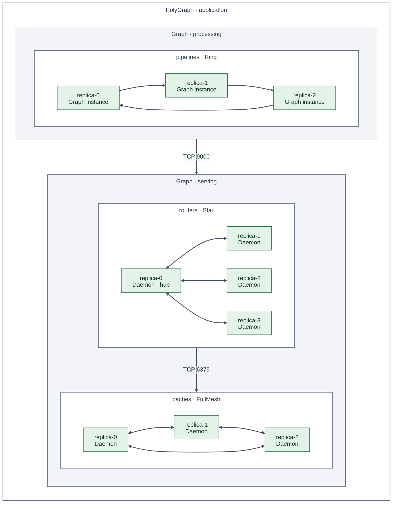

The three inner boxes are ReplicaGroups. Their internal edges use these settings:

| ReplicaGroup | Copies | Connection configuration | Internal ports |
| --- | --- | --- | --- |
| `pipelines` | Graph | [Ring](docs/graphs/replication.md#ring) | TCP 8080 |
| `routers` | Daemon | [Star](docs/graphs/replication.md#star), [`bidirectional: true`](docs/graphs/replication.md#bidirectional-connections) | TCP 9000 |
| `caches` | Daemon | [FullMesh](docs/graphs/replication.md#fullmesh) | TCP 6379 |

Arrows show directed data-flow connections; double arrows declare both directions.
The application boundary connects processing to serving on TCP 9000; the serving
boundary connects routers to caches on TCP 6379. These connections
become transport grants when [graph networking](docs/deployment/networking.md) is enabled,
subject to inherited restrictions. Copies without a configured mode remain
[Independent](docs/graphs/replication.md#independent), with no inter-copy edges. Scaling rebuilds the selected pattern and
notifies workloads through [topology events](docs/workloads/workload-events.md).

This example fits within one cluster. For remote Graph workloads, see the
[east-west gateway diagram](docs/deployment/multicluster.md#istio-across-different-networks)
and [direct Pod routing diagram](docs/deployment/multicluster.md#same-network-clusters).
Remote placement and data-flow edges need separately configured traffic policies.

#### Network boundaries

Group workloads into subgraphs with explicit network connections. Scoped rules
control traffic across boundaries and namespaces; optional Istio integration
adds HTTP and service-identity authorization.[\[7\]](docs/deployment/networking.md#selection-scope-and-inheritance)[\[8\]](docs/deployment/networking.md#cross-namespace-peers-and-http-authorization)

Optional [percentage routing](docs/graphs/traffic-balancing.md) controls how incoming
requests are divided among connected replicas, while network policies control
which traffic is permitted. Polyad generates Istio VirtualServices and
DestinationRules for local sidecar HTTP, HTTP/2 and gRPC Services. A Graph or
PolyGraph copy receives its share through its entrypoint workloads. Try the
[traffic-balancing example](examples/traffic-balancing.yaml), or compare fixed
percentages with the [Tiers and Headroom feedback modes](docs/graphs/traffic-balancing.md#choose-an-automatic-balancing-mode).

<strong>Example:</strong> subgraph connections and cross-namespace authorization

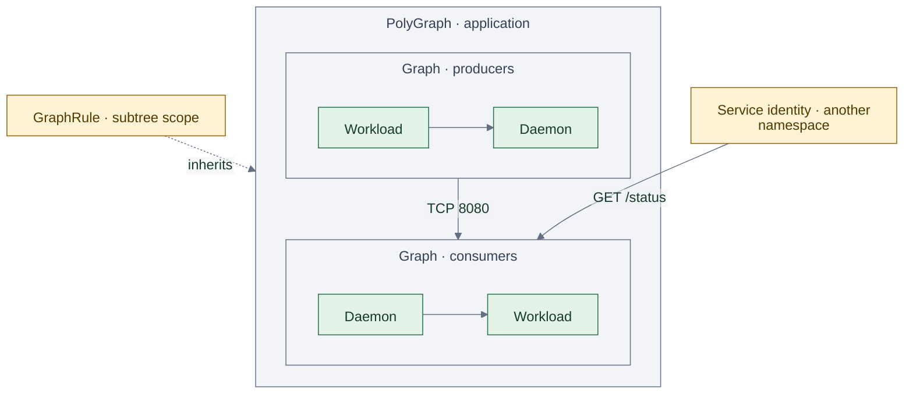

Read about [network scope and inheritance](docs/deployment/networking.md#selection-scope-and-inheritance) and [cross-namespace authorization](docs/deployment/networking.md#cross-namespace-peers-and-http-authorization).
This diagram shows one cluster; [remote traffic rules](docs/deployment/multicluster.md#remote-traffic-rules)
are configured separately at each end of a cross-cluster connection.

#### Graphs across clusters

Graphs execute within one cluster. PolyGraphs can optionally place child Graphs
and nested PolyGraphs in registered remote clusters, composing regions and higher
levels. Optional shared observers expose read-only graph snapshots while each
cluster's operator enforces its own rules and executes its workloads. See
[cross-cluster placement, Istio transport and observers](docs/deployment/multicluster.md).

A [root operator control plane](docs/deployment/root-control-plane.md) can manage this entire
hierarchy from a separate management cluster. It installs remote execution replicas,
collects their observations centrally and coordinates KEDA through root-local scale
targets. See the [deployment architecture](docs/deployment/root-control-plane.md#authority-and-execution)
and [complete configuration example](examples/root-control-plane/values.yaml).

<strong>Example:</strong> nested PolyGraphs composing three clusters

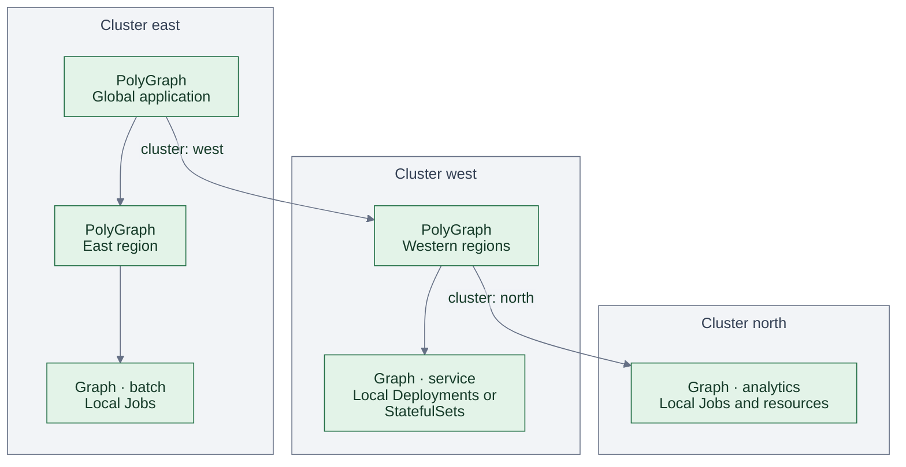

Arrows show declared parent-child ownership; child status rolls back up to the
root. Each Graph's workloads stay inside its cluster. The east operator manages
the western PolyGraph's intent; the west operator manages that PolyGraph's
children, including the Graph in north. Each destination operator executes its
local work. The same hierarchy can be entirely local by omitting `cluster`.

Read about [graphs of graphs](docs/introduction/concepts.md#graphs-of-graphs),
[remote placement and ownership](docs/deployment/multicluster.md#placement-and-ownership),
and the [execution architecture](docs/deployment/multicluster.md#execution-and-observation).
The [two-cluster example](examples/multicluster/application.yaml) demonstrates
local nesting in east with a remote Graph in west; the diagram extends this
pattern with another remote PolyGraph and cluster.

#### Graphs across node groups

Place whole graphs on groups of Kubernetes machines, such as general compute
or accelerators. Here, three graphs share two worker groups while coordinated
operator replicas and their shared Dragonfly cache run on a third.[\[9\]](docs/deployment/operator.md#scheduling-a-graph-onto-a-resource-slice)[\[10\]](docs/deployment/operator.md#replicas-shared-queues-and-autoscaling)

<strong>Example:</strong> three graphs across two worker groups

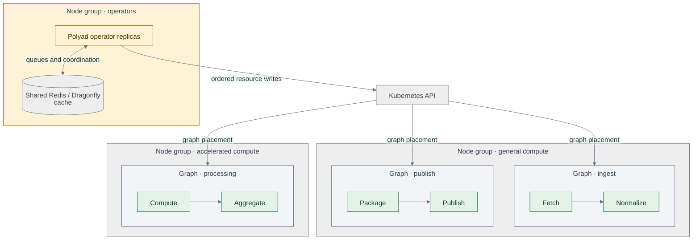

Read about [graph placement](docs/deployment/operator.md#scheduling-a-graph-onto-a-resource-slice) and [operator replicas and shared queues](docs/deployment/operator.md#replicas-shared-queues-and-autoscaling).

### Workload lifecycles

#### Finite pipelines

Express a workflow from preparation to publication, with parallel tasks and
gates that wait for a condition or delay. Ordinary Graph placement can select
spot capacity; applications choose how to handle interruption and storage.[\[11\]](docs/introduction/concepts.md#finite-pipelines)[\[12\]](docs/deployment/operator.md#delay-gates)

<strong>Example:</strong> parallel spot workloads behind an admission gate

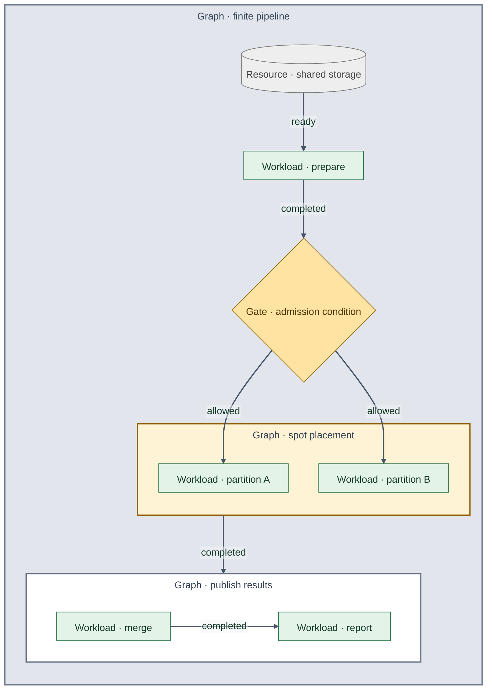

Read about [finite pipelines](docs/introduction/concepts.md#finite-pipelines) and [admission and delay gates](docs/deployment/operator.md#delay-gates).

#### Persistent services and recurrence

Keep services running with `Daemon`, and repeat finite Graphs with activation
requests. A producer or timer supplies each pulse; the application owns iteration
limits, stop conditions and durable shared state.[\[13\]](docs/deployment/operator.md#repeated-execution)

<strong>Example:</strong> persistent services with repeated graph activations

Solid arrows show startup or execution progression; dashed arrows show data flow
or a new activation request.

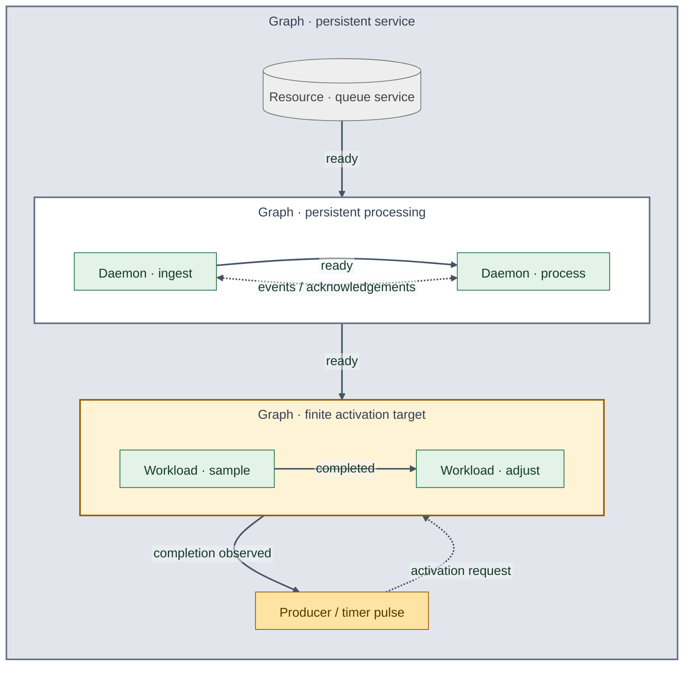

Read about [repeated execution](docs/deployment/operator.md#repeated-execution) and [activation pulses](docs/workloads/activation.md).

The operator can also [request capacity ahead of upcoming stages](docs/graphs/capacity.md),
helping node autoscalers prepare machines while upstream work runs.

### Control plane and operations

#### The operator as a Graph

##### Managed service components

Polyad can run as a compact HA Deployment or manage its own service components
in a Graph. With `architecture.mode: Distributed`, gateway, executor and telemetry
ReplicaGroups scale independently through KEDA and fresh GraphRule checks. A
root bootstrap Deployment retains planning and recovery responsibility. With
root mode enabled, the **atlas**, a reserved root PolyGraph, contains a Graph for each operator
group. The root operator Graph contains the bootstrap, managed component pipeline,
KEDA and all enabled local chart services; remote operator groups join as peers.

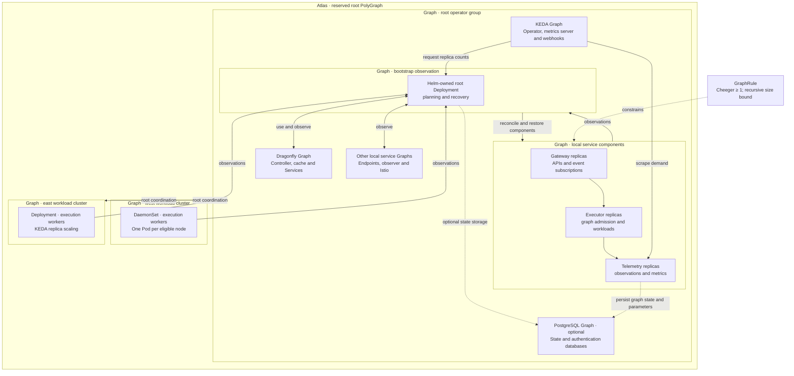

The arrows inside the Graph describe logical stages; actual coordination uses
Kubernetes and Dragonfly. Cheeger constrains topology, while queue backlog and
HTTP demand drive capacity decisions. See the
[component and networking diagrams](docs/deployment/components.md#the-operators-own-graph)
and [deployable example](examples/components/values.yaml).

##### Downstream operators and shared services

Adding an OperatorPool in a registered downstream cluster automatically links its
Graph into the [reserved root PolyGraph](docs/deployment/root-control-plane.md#reserved-operator-hierarchy).
Deployment pools support KEDA replica scaling; DaemonSet capacity follows node
eligibility. The root Graph's bootstrap branch observes its existing Deployment,
preserving Helm ownership and recovery. The nested component Graph retains its
own Cheeger and replica-budget checks. Application event streams exclude this
operator tree.

The [local service inventory](docs/deployment/local-services.md) observes the
chart's enabled infrastructure while Helm and upstream operators retain lifecycle
ownership. Set `keda.install: true` to install the optional pinned KEDA dependency,
or configure references to existing KEDA with the
[typed KEDA values](charts/polyad/references/values-keda.reference.yaml).

Administrators can also [install downstream workers with Helm](docs/deployment/helm-workers.md)
and attach their existing Deployments. Helm retains installation and upgrades;
each attachment explicitly chooses root/KEDA or downstream replica scaling.

##### Optional durable state

[PostgreSQL is optional](docs/deployment/postgresql.md), disabled by default, and stores
graph observations and tracked parameters when enabled. Its optional
[KEDA configuration](examples/postgresql/keda.yaml) scales CloudNativePG instances
from operator connection counts, still scraped from the operator. Additional
database instances provide standby/read capacity; writes continue through the
primary. [Encryption-at-rest settings](docs/deployment/postgresql.md#encryption-at-rest)
select encrypted storage for managed state and authentication databases, using an
administrator-provided StorageClass or GKE disks backed by a Cloud KMS key.
Optional [record encryption](docs/deployment/record-encryption.md) uses an
administrator-provided public key to encrypt JSON payloads inside the operator
before writing them to either managed or external PostgreSQL databases.

##### Benchmarking the control plane

This is also our starting point for load-testing Polyad's own algorithms and
watching how it scales. The [Terraform GKE test environment](terraform/README.md)
installs standalone Argo CD and syncs the self-managed component Graph from this
repository. The operator and KEDA use the `polyad` pool (2–10 Ubuntu nodes),
consumers and monitoring use `fixtures`, and load generators use `copolyad`.
All three share a configurable machine type; GKE services retain their untainted
`default` pool. The [Argo UI](terraform/README.md#inspect-the-benchmark-application)
can inspect both the operator and the manually synced benchmark fixture.

The [load study](studies/load/README.md) installs a separate fixture Graph through
the CRD template chart. Its [`polyad-benchmarks`](pkg/polyad-benchmarks/README.md)
runner measures API acceptance and Job completion under bounded arrivals, with
repeatable input snapshots and retained results. [Client plans](studies/load/README.md#plans-and-replica-counts)
set fixture replicas and run parameters; an optional [monitoring stack](studies/load/README.md#monitoring-and-traces)
provides Prometheus, Grafana dashboards and operator traces for each study window.
[Graph diagnostics](docs/operations/metrics.md#graph-diagnostics-for-benchmarks)
include topology dimensions, spectra, Cheeger inputs/search results and application
targets on each metrics-serving operator replica.
See [all studies](studies/README.md).

#### Metrics, traces and GitOps health

Queue pressure and graph hierarchies are available through the optional
[Prometheus and JSON metrics API](docs/operations/metrics.md).

Optional [OpenTelemetry tracing](docs/operations/tracing.md) exports API request,
reconciliation and Kubernetes operation spans to an OTLP/HTTP collector, with
configurable sampling and Secret-backed exporter credentials.
The Helm chart can add [Grafana Alloy or Prometheus Agent](docs/operations/telemetry-agents.md)
to collect component metrics, with Alloy also forwarding container logs and traces.
[Decision logs](docs/operations/tracing.md#decision-and-conflict-logs) explain
admissions, scaling, topology membership and conflicts, with trace correlation
and independently enabled OTLP log export.
[KEDA can scale services or whole graph compositions](docs/graphs/replication.md) through
`ReplicaGroup`, using workload metrics served by the operator.

[Argo CD](docs/operations/argocd.md) and [Flux health checks](docs/operations/fluxcd.md) report graph and leaf health across nested applications.

## What Polyad is not

Polyad coordinates application graphs alongside existing cluster components.

- **A general-purpose policy engine such as OPA.** `GraphRule` constrains the
  graphs Polyad admits and the resources it compiles. It does not evaluate Rego,
  replace application authorization, or enforce policy on every Kubernetes API
  request. Cluster-wide admission policy remains a separate concern.[\[18\]](https://www.openpolicyagent.org/docs)[\[19\]](docs/deployment/operator.md#structural-policy-and-composition-api)
- **A replacement for the Kubernetes scheduler or node autoscaler.** Polyad
  controls when graph work is admitted and propagates placement constraints.
  Kubernetes places Pods; the configured autoscaler provisions machines.
  Grouping work does not guarantee that every Pod starts together.[\[9\]](docs/deployment/operator.md#scheduling-a-graph-onto-a-resource-slice)[\[20\]](docs/graphs/capacity.md#scheduling-demand-and-placement)
- **A service mesh or network transport.** Polyad generates network and Istio
  authorization and routing resources, including optional percentage splits.
  The cluster's networking implementation and mesh enforce them; drawing a graph
  connection does not transport application data.[\[21\]](docs/deployment/networking.md#enforcement-and-lifecycle)
- **Automatic process checkpointing or exactly-once execution.** Restarting
  containers with persistent storage requires application recovery logic.
  Workloads must handle retries and duplicate effects; graph ownership and
  ordered API writes do not make application operations transactional.[\[22\]](docs/deployment/operator.md#workload-persistence)[\[10\]](docs/deployment/operator.md#replicas-shared-queues-and-autoscaling)

## License

[GNU General Public License v3.0 only](LICENSE).

## References

Selected background reading for Polyad's architecture and less common design
choices.

- **Operator framework:** [Kopf: Kubernetes Operators Framework](https://docs.kopf.dev/en/stable/).
  The Python framework behind Polyad's Kubernetes watches, startup and shutdown
  hooks, and health probes. Polyad builds graph reconciliation and coordinated
  mutations on top of it; see the [operator runtime](docs/deployment/process-hierarchy.md).
- **Infrastructure at scale:** Eduardo Barth, Medium Engineering,
  [Kubernetes Infrastructure At Medium](https://medium.engineering/kubernetes-infrastructure-at-medium-d9e2444932ef)
  (February 14, 2023). A case study covering separate clusters, gradual
  infrastructure rollouts, resource sizing and spare capacity for traffic bursts.
- **Responsiveness at scale:** Jeffrey Dean and Luiz André Barroso,
  [The Tail at Scale](https://research.google/pubs/the-tail-at-scale/), and
  Google SRE's [Addressing Cascading Failures](https://sre.google/sre-book/addressing-cascading-failures/).
  How dependency delays, overload and retries affect request latency and recovery,
  motivating local adaptation and coordination across shared dependencies.
- **Structural bottlenecks:** Shlomo Hoory, Nathan Linial and Avi Wigderson,
  [Expander Graphs and Their Applications](https://www.math.ias.edu/~avi/PUBLICATIONS/MYPAPERS/HLW06/hlw06.pdf#page=14)
  (2006, Section 2.1). The edge-expansion definition used by Polyad's
  [hard Cheeger bounds](docs/graphs/graph-rules.md#cheeger-bottleneck-bounds) and
  [throughput-driven Cheeger targets](docs/graphs/cheeger-orchestration.md).
  Administrator-selected demand signals choose calibrated targets; sustained
  shortfall or the optional [Demand trigger](docs/graphs/load-profiles.md#define-demand)
  can select approved changes within the hard bounds. Optional
  [traffic balancing](docs/graphs/traffic-balancing.md) also uses calibrated splits
  or per-replica throughput and headroom to redistribute requests. Those routing
  weights are separate from the unweighted Cheeger value used by both bounds.
- **Adaptation envelopes and reachability:** [Stanford ASL hj_reachability](https://github.com/StanfordASL/hj_reachability)
  and [Hamilton-Jacobi Reachability: A Brief Overview and Recent Advances](https://arxiv.org/abs/1709.07523).
  Background and numerical backend for the SDK's [queue models, reachability guard
  and local studies](docs/workloads/reachability.md).
- **Rewriting and composition:** Dimitri Ara et al.,
  [Polygraphs: From Rewriting to Higher Categories](https://arxiv.org/abs/2312.00429).
  Background for the rewriting, confluence and higher-dimensional diagrams in
  the [mutation documentation](docs/development/mutation-diagrams.md).
- **Advance capacity:** The [Cluster Autoscaler ProvisioningRequest FAQ](https://github.com/kubernetes/autoscaler/blob/master/cluster-autoscaler/FAQ.md#how-can-i-use-provisioningrequest-to-run-batch-workloads).
  Reserving capacity before a workload stage becomes runnable; see Polyad's
  [advance-capacity design](docs/graphs/capacity.md).
- **Pending delivery recovery:** Dragonfly's
  [`XAUTOCLAIM`](https://www.dragonflydb.io/docs/command-reference/stream/xautoclaim).
  Recovering unacknowledged stream entries when a queue consumer loses ownership.
- **GitOps health:** [Argo CD custom health checks](https://argo-cd.readthedocs.io/en/stable/operator-manual/health/#custom-health-checks)
  and [Flux health expressions](https://fluxcd.io/flux/components/kustomize/kustomizations/#health-check-expressions).
  Reporting graph and descendant health to deployment controllers.
