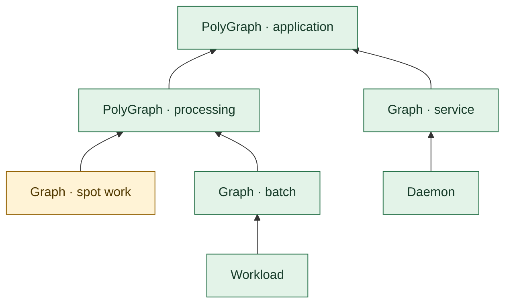
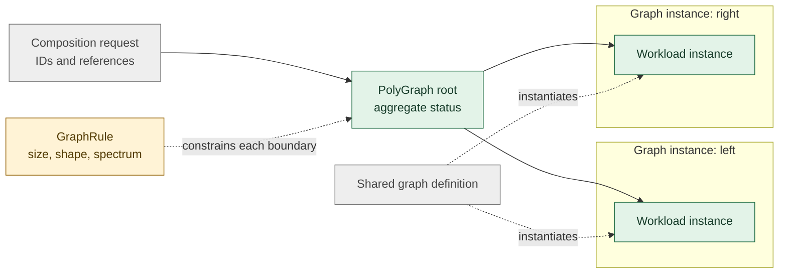
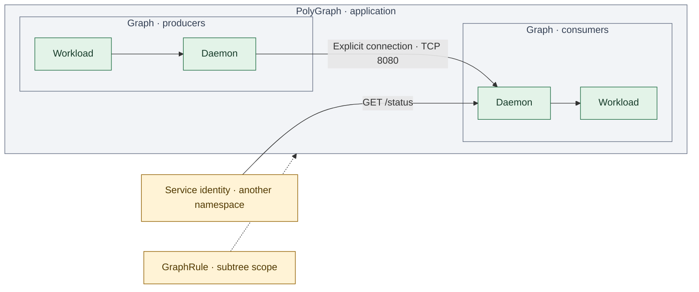
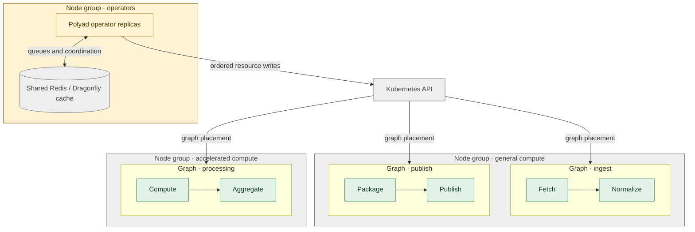
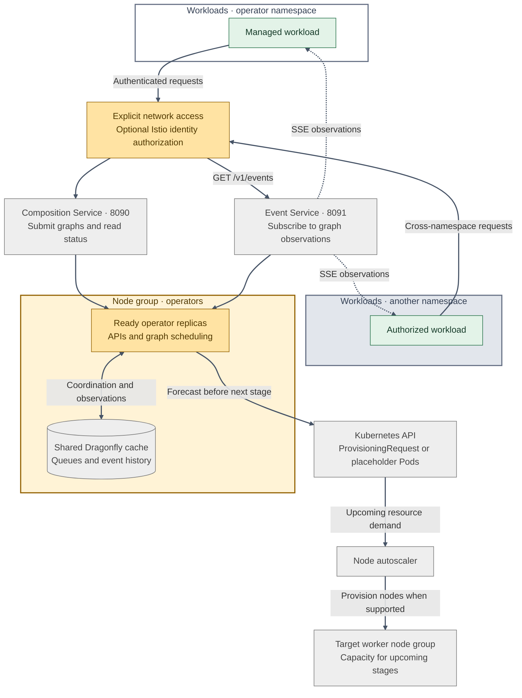
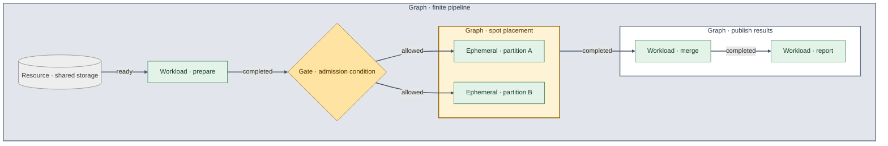
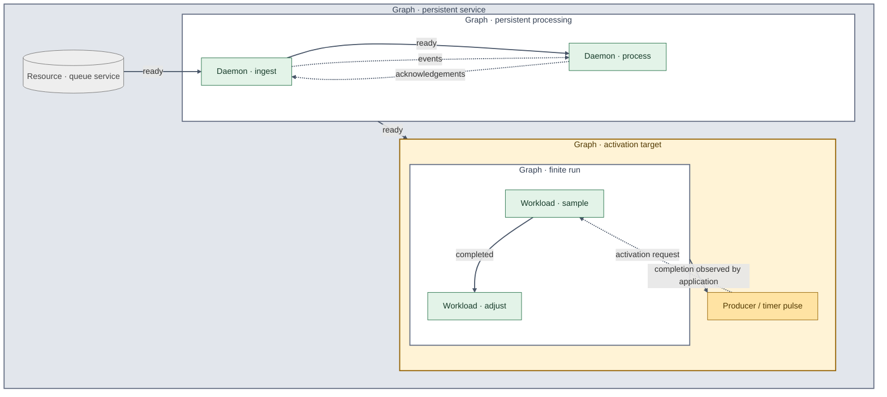

# Polyad

Polyad[\[1\]](https://en.wikipedia.org/wiki/Polyad_%28mathematics%29) is a graph-based workload scheduler for Kubernetes. Describe tasks,
long-running services and resources as composable graphs; the operator schedules
their work and tracks progress across the application and integrations.[\[2\]](docs/operator.md#api-and-python-abstractions)

**[Get started](docs/getting-started.md)** · **[Documentation](docs/README.md)** · **[Helm chart](charts/polyad/README.md)**

## Table of contents

- [Polyad](#polyad)
  - [Table of contents](#table-of-contents)
  - [What Polyad abstracts](#what-polyad-abstracts)
    - [Graphs of graphs](#graphs-of-graphs)
    - [Constrained compositions](#constrained-compositions)
    - [Network boundaries](#network-boundaries)
    - [Graphs across node groups](#graphs-across-node-groups)
    - [Workloads calling the operator](#workloads-calling-the-operator)
    - [Finite pipelines](#finite-pipelines)
    - [Persistent services and recurrence](#persistent-services-and-recurrence)
  - [What Polyad is not](#what-polyad-is-not)
  - [Get started](#get-started)
  - [License](#license)

## What Polyad abstracts

A **graph** groups related work and describes how its parts depend on each other.
Its **nodes** can be tasks, services, resources or other graphs. A data pipeline
might fetch records, process partitions in parallel, then publish the results;
a service graph might keep consumers and their supporting resources running.[\[3\]](docs/concepts.md)

Green marks work and graph summaries, amber marks constraints or recurrence,
and gray marks resources and containing boundaries.

### Graphs of graphs

Compose smaller workflows into an application with `PolyGraph`. Each child
reports progress to its parent, giving the root a combined view of the work.[\[4\]](docs/concepts.md#graphs-of-graphs)

Example: nested graphs reporting to an application root

### Constrained compositions

Build workflows from reusable definitions and trace each instance to its
Kubernetes resources. `GraphRule` lets engineers constrain what users can
schedule by size, shape, nesting and mathematical properties.[\[5\]](docs/graph-rules.md#structural-limits)[\[6\]](docs/composition-requests.md#durability-ordering-and-audit)

Example: reusable graph definitions with structural constraints

### Network boundaries

Group workloads into subgraphs with explicit network connections. Scoped rules
control traffic across boundaries and namespaces; optional Istio integration
adds HTTP and service-identity authorization.[\[7\]](docs/networking.md#selection-scope-and-inheritance)[\[8\]](docs/networking.md#cross-namespace-peers-and-http-authorization)

Example: subgraph connections and cross-namespace authorization

### Graphs across node groups

Place whole graphs on groups of Kubernetes machines, such as general compute
or accelerators. Here, three graphs share two worker groups while coordinated
operator replicas and their shared Dragonfly cache run on a third.[\[9\]](docs/operator.md#scheduling-a-graph-onto-a-resource-slice)[\[10\]](docs/operator.md#replicas-shared-queues-and-autoscaling)

Example: three graphs across two worker groups

### Workloads calling the operator

Running workloads can submit their next graph, read its status and subscribe to
graph events through the operator's optional APIs. Services route requests to
ready replicas; explicitly authorized callers can connect from other
namespaces.[\[15\]](docs/networking.md#workload-access-to-operator-apis)

A running service can also pulse downstream workloads or daemon replica groups,
with explicit concurrency and frequency policies.[\[17\]](docs/activation.md)

With a capacity policy, Polyad forecasts upcoming stages while earlier work
runs, giving a compatible node autoscaler advance notice. Dependencies and gates
still decide when the next stage starts.[\[16\]](docs/capacity.md)

Example: API access, event streams and advance capacity requests

### Finite pipelines

Express a workflow from preparation to publication, with parallel tasks and
gates that wait for a condition or delay. Ordinary Graph placement can select
spot capacity; applications choose how to handle interruption and storage.[\[11\]](docs/concepts.md#finite-pipelines)[\[12\]](docs/operator.md#delay-gates)

Example: parallel spot workloads behind an admission gate

### Persistent services and recurrence

Keep services running with `Daemon`, and repeat finite Graphs with activation
requests. A producer or timer supplies each pulse; the application owns iteration
limits, stop conditions and durable shared state.[\[13\]](docs/operator.md#repeated-execution)

Example: persistent services with repeated graph activations

Solid arrows show startup or execution progression; dashed arrows show data flow
or a new activation request.

The operator can also [request capacity ahead of upcoming stages](docs/capacity.md),
helping node autoscalers prepare machines while upstream work runs.

Queue pressure and graph hierarchies are available through the optional
[Prometheus and JSON metrics API](docs/metrics.md).
[KEDA can scale services or whole graph compositions](docs/replication.md) through
`ReplicaGroup`, using workload metrics served by the operator.

[Argo CD](docs/argocd.md) and [Flux health checks](docs/fluxcd.md) report graph and leaf health across nested applications.

## What Polyad is not

Polyad coordinates application graphs alongside existing cluster components.

- **A general-purpose policy engine such as OPA.** `GraphRule` constrains the
  graphs Polyad admits and the resources it compiles. It does not evaluate Rego,
  replace application authorization, or enforce policy on every Kubernetes API
  request. Cluster-wide admission policy remains a separate concern.[\[18\]](https://www.openpolicyagent.org/docs)[\[19\]](docs/operator.md#structural-policy-and-composition-api)
- **A replacement for the Kubernetes scheduler or node autoscaler.** Polyad
  controls when graph work is admitted and propagates placement constraints.
  Kubernetes places Pods; the configured autoscaler provisions machines.
  Grouping work does not guarantee that every Pod starts together.[\[9\]](docs/operator.md#scheduling-a-graph-onto-a-resource-slice)[\[20\]](docs/capacity.md#scheduling-demand-and-placement)
- **A service mesh or network transport.** Polyad generates network and Istio
  policy resources. The cluster's networking implementation and mesh enforce
  them; drawing a graph connection does not transport application data.[\[21\]](docs/networking.md#enforcement-and-lifecycle)
- **Automatic process checkpointing or exactly-once execution.** Restarting
  containers with persistent storage requires application recovery logic.
  Workloads must handle retries and duplicate effects; graph ownership and
  ordered API writes do not make application operations transactional.[\[22\]](docs/operator.md#workload-persistence)[\[10\]](docs/operator.md#replicas-shared-queues-and-autoscaling)

## Get started

Deploy the [Kubernetes operator](docs/getting-started.md#quick-start-kubernetes)
with the Helm chart, or try the [local Python scheduler](docs/getting-started.md#quick-start-local-work).
The [examples](docs/getting-started.md#examples) cover pipelines, services,
spot work, storage and nested graphs.

Explore [graph concepts](docs/concepts.md), [graph rules](docs/graph-rules.md),
[composition requests](docs/composition-requests.md), the [composition API](docs/composition-api.md),
[networking and event subscriptions](docs/networking.md), or the
[development guide](docs/toolchain.md). See the [documentation index](docs/README.md)
for lifecycle, status, health and configuration references.

## License

[GNU General Public License v3.0 only](LICENSE).
