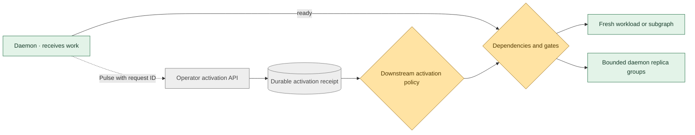

# Workload activation and pulses

A daemon can become ready while continuing to run. Downstream nodes can already
depend on that readiness using `condition: ready`. **Activation adds a separate
application signal:** a service announces that a batch, request or next phase of
work should start. Each pulse has its own durable `Activation` receipt and
execution identity.

Put an `activation` policy on the downstream definition. The containing graph
must be persistent. A node with this policy waits for a pulse, then still checks
its dependencies, gates, slots, placement, storage and capacity requirements.
Definitions without a policy keep their existing automatic admission behavior.



## Policy on the downstream definition

```yaml
apiVersion: polyad.astrivant.com/v1alpha1
kind: Workload
metadata:
  name: process-batch
spec:
  activation:
    mode: Queue
    maxPending: 32
    minIntervalSeconds: 5
    maxIntervalSeconds: 300
    onDeadline: Report
  template:
    spec:
      containers:
        - name: worker
          image: YOUR_REGISTRY/batch-worker:VERSION
```

Reference this definition as a node in a persistent `Graph`, `EphemeralGraph` or
`PolyGraph` (the latter accepts graph definitions). Activation also works on
`Ephemeral`, `Daemon`, and reusable `Graph`, `EphemeralGraph`, `PolyGraph` or
`Feedback` definitions. Resources such as Services and PVCs are not pulse targets.
Use a subgraph for a whole downstream batch that must repeat together. Ordinary
nodes depending on a pulsed node do not automatically repeat themselves.

| Mode | Behavior |
| --- | --- |
| `Queue` | One selected or running execution; retain bounded pending pulses |
| `Reject` | Reject newly observed pulses while the target is occupied |
| `Coalesce` | Keep the newest pending pulse; mark older pending receipts `Superseded` |
| `Parallel` | Select up to `maxConcurrent` independent executions; queue the rest |

Admission decisions are serialized within the owning graph shard. Pending
receipts are ordered by Kubernetes creation timestamp, with receipt name as a
deterministic tie-breaker. Selected executions retain their place across replica
handoffs. Coalescing never replaces running work. Excess pending receipts become
`Rejected`; an HTTP 202 acknowledges receipt, so read its status for the decision.

This serialization is **not a transaction around application side effects**.
Kubernetes Job retries can repeat application work. Applications must provide
their own idempotency or transactional storage where required.

## Parallel daemons and replica bounds

A daemon activation starts its own Deployment and remains active until stopped,
failed or drained with its containing graph. It does not complete when ready.
For example, this policy allows three concurrent groups of two replicas each:

```yaml
activation:
  mode: Parallel
  maxConcurrent: 3
  replicasPerActivation: 2
  maxReplicas: 6
  maxPending: 20
  minIntervalSeconds: 10
```

`replicasPerActivation` replaces the daemon definition's ordinary `replicas` for
each pulse. Separate groups have disjoint Deployment selectors. `maxReplicas`
bounds `maxConcurrent × replicasPerActivation`; it defaults to 1,024. Per-pulse
replica counts apply only to Daemons. Concurrent subgraphs remain subject to their
own workload replica settings and graph rules.

Queue, Reject and Coalesce require `maxConcurrent: 1`. A daemon therefore occupies
that target until an explicit stop or graph cleanup. A stop does not release its
slot until foreground deletion and custom finalizers finish. Node resource slots
also bound parallel activations independently of replica counts.

Names differ between pulses. Use a Service with application labels for network
discovery, rather than `${nodes.NAME.name}` references to an activated vertex.
Each execution retains the logical node's network scope and inherited placement.
Structural rules are also checked against the expanded execution topology.
Boolean gates can continue to reference `NAME.ready`, `NAME.started` and
`NAME.completed`: each is true when every selected execution satisfies it.
`NAME.failed` is true when any selected execution fails. With no execution
selected, these observations are false. A downstream dependency likewise waits
for all selected upstream executions. Activation expansion is limited to 4,096
vertices and 16,384 data-flow connections per boundary.

## Frequency bounds

| Field | Meaning |
| --- | --- |
| `minIntervalSeconds` | Minimum interval between execution admissions, including parallel admissions; default 0 |
| `maxIntervalSeconds` | Optional maximum expected interval between admissions; initially measured from graph creation |
| `onDeadline: Report` | Mark the target overdue and the graph failed while the interval is exceeded |
| `onDeadline: Activate` | Also submit an idempotent timer pulse when a concurrency slot is available and no pulse is pending |

These bounds concern **admission**, not HTTP request arrival or the instant a Pod
starts running. Delayed gates, unavailable capacity and a full concurrency budget
can make a target overdue. A timer pulse obeys those same constraints; it does not
override them. `maxIntervalSeconds` must be at least `minIntervalSeconds`.
Start timestamps persist before workload creation, so retrying an uncertain
creation cannot consume another frequency allowance. Monitor
`status.activations.<node>` for `pending`, `active`, `completed`, `failed`,
`lastAdmissionTime` and `overdue`. Graph event observations include these summaries.

## API and standalone Python client

Enable the existing composition API with `api.enabled=true`; activation uses its
port, bearer authentication, rate limits, and optional Gateway API/Istio routing.
The [standalone client](../clients/python/README.md) requires Python 3.11+ and no
operator dependencies. Install it directly with `pip install ./clients/python`.

```python
import os
from polyad_client import Client

client = Client(
    "http://polyad-polyad-api.orchestration.svc.cluster.local:8090",
    os.environ["POLYAD_API_TOKEN"],
)
client.activate(
    request_id="batch-42",
    graph="processing",
    graph_uid="THE-PERSISTED-GRAPH-UID",
    node="process-batch",
)
print(client.activation("batch-42"))
```

| Operation | Endpoint |
| --- | --- |
| Submit pulse | `POST /v1/activations` |
| Read receipt and execution status | `GET /v1/activations/{requestId}` |
| Stop a queued or running pulse | `POST /v1/activations/{requestId}/stop` |
| API contract | `GET /openapi.json` |

Submission JSON uses `requestId`, `graph`, `graphUid`, `node` and optional `kind`
(default `Graph`). Get graph instance names and UIDs from composition resource
audit or Kubernetes. Stop is idempotent and asynchronous; poll until `Stopped`.
The same endpoints are available to explicitly authorized cross-namespace callers,
as described in [workload access](networking.md#workload-access-to-operator-apis).

## Durability, cleanup and limits

Use the same request ID and content after a timeout or lost acknowledgement.
Receipts live in Kubernetes and follow the graph's root shard through the shared
queue. HTTP threads create receipts and stop signals; leased workers create and
delete execution resources through the ordered API adapter.

Each receipt pins the graph UID/generation and definition UID/generation. Changed
intent invalidates outstanding activations instead of silently switching their
meaning. Completed receipts retain idempotency and audit identities; deleting a
receipt loses that history. Graph deletion removes its receipts and executions.
Suspending or stopping a graph drains executions and retains stopped receipts;
resuming requires new pulse IDs.

The most recent completed execution is retained until another pulse replaces it.
Completed and failed receipt history is retained until the graph is deleted or
an administrator removes receipts. `maxPending` bounds scheduler admission, not
the total number of receipt objects accepted over time; use API rate limits and
namespace resource quotas to bound storage as well.

Activation receipts can be observed with the generated Argo CD and Flux health
checks. Graph metrics use the expanded runtime topology for active pulse runs.
Install or upgrade the chart's CRDs, including `Activation`, before upgrading an
existing operator to this API version.
