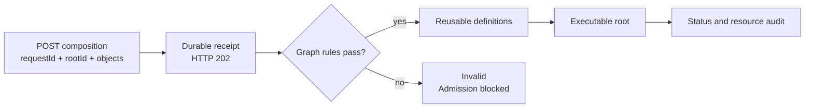

# Composition requests

A composition request describes an executable graph and its reusable definitions
using request-local IDs. The operator records a durable receipt, checks applicable
[graph rules](../graphs/graph-rules.md), and materializes the graph in its namespace.
End-users select existing rules; requests cannot create or modify `GraphRule`
resources. Namespace rules apply even when a request omits `rules`.

For authentication, deployment, routing, rate limits and OpenAPI discovery, see
[Composition API service](composition-api.md). The bearer credential authorizes
workload creation and audit reads in the operator namespace; it does not provide
per-user identities or tenant isolation. Apply workload RBAC, Pod Security and
resource quotas for that namespace.

## Request lifecycle



## Compose by ID

Submit [the nested composition example](../../examples/composition.json):

```sh
curl --fail-with-body http://localhost:8090/v1/compositions \
  -H "Authorization: Bearer $POLYAD_API_TOKEN" \
  -H 'Content-Type: application/json' \
  --data-binary @examples/composition.json
```

A request contains `requestId`, `rootId`, and `objects`. Each object has its own
`id`, supported `kind`, and `spec`. The root must be a Graph, PolyGraph or ReplicaGroup. All definitions must be reachable from the root;
references between definitions cannot recurse.

Inside graph specifications, use:

- `nodes[].id` for an instance vertex and `nodes[].refId` for its definition.
- `requires[].nodeId` for another vertex in the same boundary.
- `connections[].sourceId` and `targetId` for data-flow edges.
- `nodes[].gateId` and `shutdownPolicyId` for supplied reusable definitions.
- `rules` for administrator-defined [GraphRule names](../graphs/graph-rules.md#enforcement) in the operator namespace.

A graph definition can be referenced by several vertices. Each reference gets an
independent execution instance and audit path. Daemon controller selection and
[storage configuration](../workloads/workload-storage.md), including StatefulSet claim
templates, pass through each object's `spec`. Graph placement, delays, persistence
and workload-specific storage restrictions retain their existing meanings. IDs are lowercase DNS
labels of up to 63 characters; requests permit 1–128 definitions and a 1 MiB body.

## Durability, ordering and audit

HTTP `202` means Kubernetes accepted a durable `Composition` receipt, not that its
workloads passed admission or started. Invalid JSON returns `400`, invalid
compositions `422`, missing authentication `401`, and conflicting request ID reuse
`409`. A `503` or lost response has an uncertain outcome: retry the **same requestId
and content**. Reordering the definitions does not change their canonical digest.
Different work requires a new request ID. Idempotency lasts for the receipt's
lifetime; deleting and recreating it starts a new run with a new Kubernetes UID.

ReplicaGroup objects accept the same `spec.connectivity` configuration as YAML
resources: Independent (default), Chain, Ring, Star, FullMesh, or Custom. Custom
edge endpoints use ordinal names such as `replica-0`, not request object IDs.
Only `template.refId` is resolved to a reusable definition; connectivity and
per-edge ports are preserved. See [replica connection modes](../graphs/replication.md#connections-between-copies)
for configuration examples and diagrams.

Receipt writes use a serialized Kubernetes adapter. Concurrent replicas converge
through deterministic names and Kubernetes create-if-absent semantics. Receipts,
their definitions and executable descendants share one family shard. Shared
Dragonfly queues and Kubernetes Leases govern all graph materialization. A worker
preflights rules, creates reusable templates, observes their acknowledgements on a
later pass, and only then creates the executable root. Finalization drains that
root before deleting templates.

The CR stores `spec.requestId` and `spec.document`, canonical JSON text representing
the request. CEL enforces immutability of both fields. This representation is
intentional: Kubernetes cannot inspect arbitrary preserved JSON fields in
[CRD CEL expressions](https://kubernetes.io/docs/tasks/extend-kubernetes/custom-resources/custom-resource-definitions/).
Python `receipt_spec(request)` produces this representation for direct manifest
creation; `request_name(request.requestId)` supplies the required deterministic
metadata name. API clients continue to send ordinary JSON objects.

Read current status and generated resource identities:

```sh
curl --fail-with-body -H "Authorization: Bearer $POLYAD_API_TOKEN" \
  http://localhost:8090/v1/compositions/example-analysis
curl --fail-with-body -H "Authorization: Bearer $POLYAD_API_TOKEN" \
  http://localhost:8090/v1/compositions/example-analysis/resources
```

The resource endpoint returns fresh names, namespaces, UIDs, owner references and
trace annotations. Results are bounded to 200 resources per kind and report
`truncated` when more exist. Request, object and node IDs link intent to manifests;
`composition-uid`, `definition-uid`, `definition-generation` and `node-path`
disambiguate receipt lifetimes, source revisions and repeated graph instances.
Jobs, Deployments and StatefulSets copy provenance into Pod templates, so their Pods are
queryable through the same endpoint. This is live resource lineage, not an
append-only audit log: deleted resources require Kubernetes audit logging or an
external event archive for historical lookup.

Composition and temporary-connection intake share a bound of 32 outstanding
operations per replica. Event reads have a separate bounded admission budget. A timed-out write
retains its slot until acknowledgement; shutdown joins outstanding operations.
The existing Kopf probe includes intake writes in
`backlog.kubernetesWrites.apiIntake`. A failed HTTP thread fails the
operator healthcheck.

The separate [event subscription API](../deployment/networking.md#event-subscriptions) reports
observations with the same Kubernetes identities and audit references.

## Related APIs

The same service supports [durable activation requests](../workloads/activation.md) for workloads,
subgraphs and daemon replica groups. The [standalone Python client](../../pkg/client/README.md)
can submit compositions, inspect audit identities, pulse nodes and subscribe to events.
