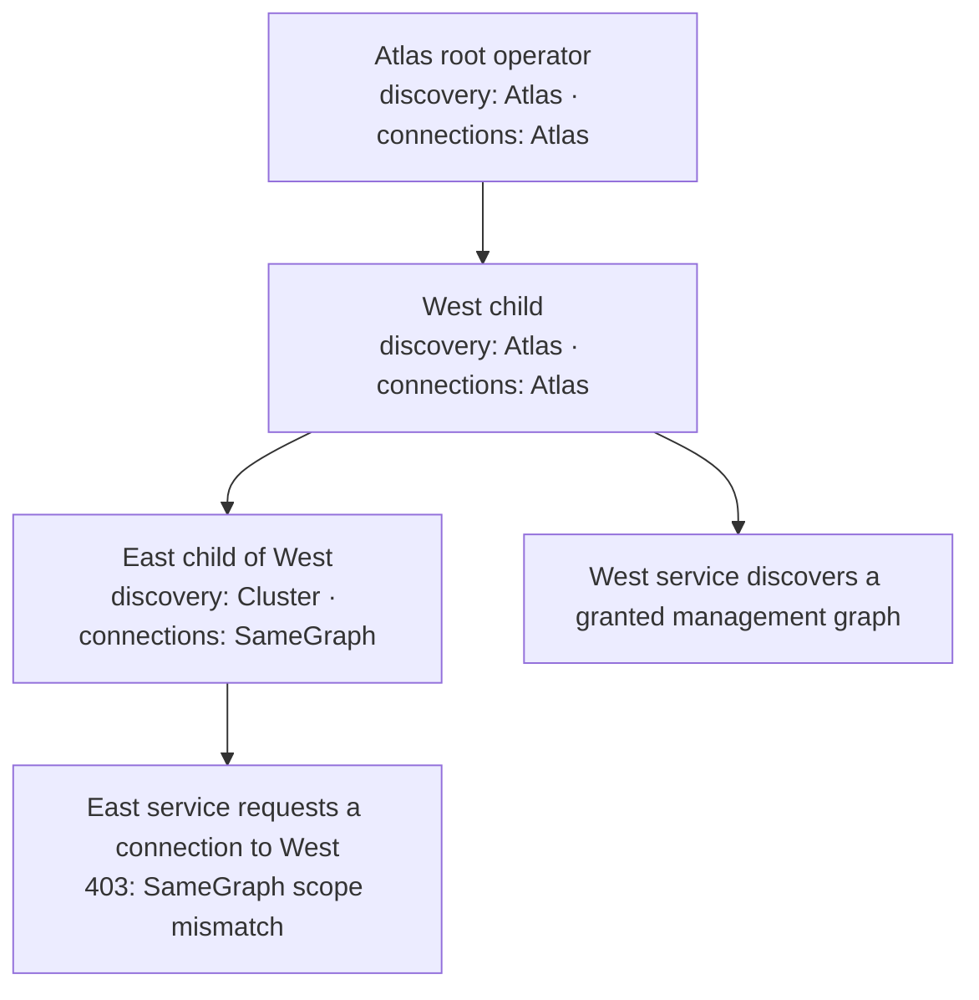
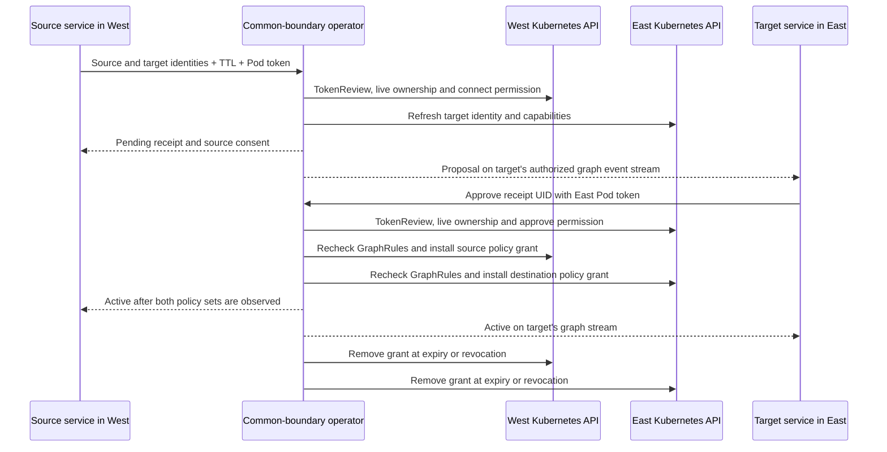

# Atlas discovery and service connections

The **atlas** is the reserved root PolyGraph, named `<root-release>-atlas`. It
contains the root operator Graph and each attached operator group's Graph. That
operator tree manages application graphs in registered clusters. Services can
discover permitted application branches through the root's existing events API.
The atlas's own infrastructure remains hidden from application event streams.

## Table of contents

- [Access modes and inherited ceilings](#access-modes-and-inherited-ceilings)
- [Discover current services](#discover-current-services)
- [Subscribe with filters and hooks](#subscribe-with-filters-and-hooks)
- [Negotiate across graph and cluster boundaries](#negotiate-across-graph-and-cluster-boundaries)
- [Rejection, drift and cleanup](#rejection-drift-and-cleanup)
- [Administrator configuration](#administrator-configuration)

## Access modes and inherited ceilings

`operator.serviceAccess.discovery` and `operator.serviceAccess.connections`
are independent administrator ceilings. Discovery defaults to `GraphTree`;
connections default to `SameGraph`. Enabling a mode does not itself enable an API,
register a cluster, grant credentials or establish mesh connectivity.

| Mode | Maximum scope relative to the service's home graph |
| --- | --- |
| `Disabled` | Reject this capability |
| `SameGraph` | The exact graph incarnation |
| `GraphTree` | Graphs sharing a verified ancestor in the home cluster |
| `Cluster` | Application graphs in the home cluster |
| `Atlas` | Application graphs across registered clusters |

Every child inherits its parent's ceiling and can narrow it. The effective mode
is the most restrictive mode along that operator's parent chain, including the
root. The receiving operator's ceiling also applies. Discovery checks both the
service's home operator and the destination operator; a broad caller grant cannot
override a destination that rejects cross-cluster discovery. A request that exceeds it
is rejected locally; Polyad never forwards it to a more permissive ancestor.
An `Atlas` request therefore fails at a child whose effective mode is `Cluster`.
Invalid modes, unknown parent references and cycles prevent operator startup.

Discovery additionally requires a named API key with a fixed `home` graph,
explicit `graphs` grants and the `discovery` endpoint capability. Named `events`
and `topology` subscribers also need `home`; live ancestry and the same discovery
ceiling filter those observations. A key cannot choose a different home through
query parameters. `descendants: true` follows verified owned descendants,
including registered remote descendants when `Atlas` permits them. Internal
operator graphs and definitions remain excluded even from an `Atlas` grant.
Existing namespace bearer tokens and the unauthenticated demo do not provide the
named graph grants required by the discovery directory. Because they have no
fixed home graph, their event and topology subscriptions require explicit
`Cluster` or `Atlas` discovery mode; `SameGraph` and `GraphTree` reject them.



These modes set the maximum permitted scope. A child rejects operations it
cannot fulfill. A permitted connection also needs a
common application graph boundary owned by the receiving operator, endpoint
consent, current GraphRules and compatible network contracts.

## Discover current services

Enable `events.enabled`; discovery shares the events Service on port `8091`, the
same Flask application, authentication middleware and per-key request lanes.
`GET /v1/discovery` lists the key's granted starting graphs, with `offset`, `limit`
and `nextOffset` pagination. Select a boundary using `graph`, `namespace`, `kind`,
`cluster` and optional `uid` query parameters to read its current services.

```python
import os
from polyad_sdk import Client

client = Client(os.environ["POLYAD_EVENTS_URL"], os.environ["POLYAD_EVENTS_TOKEN"])
for service in client.services(max_graphs=256):
    print(service["endpoint"], service["node"]["executions"])
```

Each record includes a UID-fenced `endpoint`, logical node metadata, observed
execution membership and topology revision. The response also includes child
graph links and `cursors` indexed by cluster. Records describe Workload, Daemon,
Resource and graph vertices; descend into a Graph, PolyGraph or ReplicaGroup to
find its concrete workload endpoints. This is logical service discovery, not a
catalog of arbitrary Kubernetes Services. Use the service entrypoints declared
by your application for actual requests; a discovered identity does not create
DNS, an Istio route or a new workload.

`services()` walks granted branches breadth first, deduplicates graph
incarnations and stops with an error at its configured limit. It skips branches
that disappear or are denied; an unavailable operator propagates an error.
Use individual `discover()` calls when you need response cursors or explicit
per-branch errors. Workload specifications, Secret contents and Pod token claims
are never returned. The directory reads current Kubernetes state; a missing or
replaced UID cannot resolve to a new incarnation silently.

## Subscribe with filters and hooks

Read `discover()` first, then subscribe to each relevant cluster using the
cursor returned for that cluster. Polyad captures the cursor **before** reading
membership, so changes during the read can be replayed. Duplicate observations
are possible; this avoids a read/subscribe gap. Cursors from different cluster
streams are not interchangeable.

```python
from polyad_sdk.filters import event_type, field, graph

snapshot = client.discover(
    graph="application-west", namespace="workloads", cluster="west"
)
subscription = client.subscribe(cluster="west", cursor=snapshot["cursors"]["west"])


def refresh_neighbors(event):
    current = client.discover(
        graph=event.data["name"], namespace=event.data["namespace"],
        kind=event.data["kind"], cluster="west", graph_uid=event.data["uid"],
    )
    print(current["services"])


subscription.on(
    event_type("topology") & graph(cluster="west") & field("name", regex=r"^application-"),
    refresh_neighbors,
)
subscription.run()
```

For operators with WebSocket subscriptions enabled, use
`client.subscribe(transport="websocket", cluster="west")` with the same filters
and hooks. See [transport configuration](../workloads/workload-events.md#websocket-subscriptions);
the permissions and connection-consent workflow are identical for either transport.

| Filter | Matches |
| --- | --- |
| `event_type("topology", "connection")` | Any supplied observation event type |
| `graph(name=..., kind=..., namespace=..., cluster=...)` | All supplied graph identity fields |
| `phase("Pending", "Active")` | Any supplied resource or connection phase |
| `field("status.ready", equals=True)` | Exact typed value; `True` differs from `1` |
| `field("nodes.*.name", regex=r"^worker-")` | Regex search in string values; `*` traverses collections |
| `field("status.message", exists=False)` | Missing field, distinct from an explicit null |
| `connection_pending("receiver")` | Pending proposals awaiting that local endpoint's consent |

Combine filters with `&`, `|` and `~`, or construct `Filter(your_predicate)`.
Regex patterns run in the application process and must be trusted application
configuration; length limits are not regex execution timeouts. Filters select
only already-authorized observations and confer no additional permissions.

Hooks run synchronously on the caller's thread, providing backpressure. Use your
application's thread or task supervisor if needed. A failed callback stops
consumption without advancing the checkpoint. Within its bounded in-memory
history, the subscription skips callbacks that already succeeded on replay.
Persist `subscription.cursor` after successful processing. `reset` and
`unavailable` raise `StreamInterrupted`; rediscover after reset and explicitly
reconnect after an outage. There are no hidden threads, mutation retries or
automatic approvals. `subscription.request_id(event, action)` derives a stable
mutation ID; retries must retain the same request body. Durable idempotency still
belongs to the application and receipt, not the callback cache.

## Negotiate across graph and cluster boundaries

`POST /v1/connections/atlas` accepts `ServiceConnectionRequest`: a request ID,
exact source and target `ServiceEndpoint` records, TTL, ports and optional
bidirectionality. Address the operator owning the narrowest common application
boundary. Unrelated graphs cannot be connected merely because both appear in
the atlas directory. Both endpoint operators' connection ceilings must permit
the relationship; cross-cluster relationships require `Atlas` on both paths.



The source's verified request supplies its consent. The other endpoint must
approve explicitly with its own Pod-bound projected token and `approve` permission
on its **home graph**. Tokens use audience `polyad-connections`. The
`X-Polyad-Cluster` header selects a registered issuer; Polyad authenticates the
token through that cluster's TokenReview API. The header itself establishes no
identity. Namespace, service-account UID, Pod UID, graph UID and ownership are
checked again before admission. Same-named accounts in different clusters are
not interchangeable.

```python
from pathlib import Path
from polyad_types import ConnectionResponse, ServiceConnectionRequest, ServiceEndpoint, from_dict
from polyad_types.network import NetworkPort
from polyad_sdk.filters import connection_pending

connections = Client(
    os.environ["POLYAD_CONNECTIONS_URL"], None,
    identity_cluster="east",
    token_provider=lambda: Path("/var/run/polyad-connections/token").read_text(),
)


def approve_allowed_peer(event):
    receipt = event.data["connection"]
    source = from_dict(receipt["peers"]["source"], ServiceEndpoint)
    # Application policy is explicit; a filter match alone is not consent.
    if source.cluster == "west" and source.graph == "application-west":
        connections.respond_connection(
            receipt["namespace"], receipt["name"],
            ConnectionResponse(receipt["uid"], "Approve"),
        )


# Register before subscription.run(); use the target graph's stream and cursor.
subscription.on(connection_pending("receiver"), approve_allowed_peer)

# At the source, with a West-token connection client and two discovery records:
# request = ServiceConnectionRequest(
#     "join-42", from_dict(source_record["endpoint"], ServiceEndpoint),
#     from_dict(target_record["endpoint"], ServiceEndpoint), 300, (NetworkPort(8080),),
# )
# receipt = source_connections.connect_services(request)
```

Proposal events are projected onto each endpoint's own graph stream. A key with
access to just that graph can receive and handle the proposal; access to the
parent PolyGraph is unnecessary. The event includes the counterpart's public
identity and receipt, but no authentication claims. Use separate credentials for
event discovery and projected-token consent. Rotating token providers are read
before each HTTP call and redirects are refused.

Cross-cluster admission requires root coordination, participant event streams,
explicit mesh-enabled network contracts, TCP ports, registered
`rootControlPlane.meshPeers` and explicit `operator.serviceAccess.trustDomains`.
Istio identity is a service-account identity: give independently authorized
services dedicated service accounts, and align mesh trust domains and aliases
with the configured values. Existing multicluster service routing must already
work; negotiation changes authorization, not cluster transport infrastructure.

The common PolyGraph gets a structural edge for GraphRules and Cheeger checks.
That edge carries no broad transport allowance. Within one cluster, omitting
ports declares only a structural edge and opens no network access; cross-cluster
requests require explicit TCP ports. Each leaf workload instead gets
an expiring network exception, intersected with its local ancestor and GraphRule
policies. Remote ingress also restricts the authenticated mesh principal. Gateway
egress uses the registered tunnel port, while destination ingress uses the
requested application port. Existing restrictive contracts can reject the proposal.

## Rejection, drift and cleanup

| Result | Meaning and caller action |
| --- | --- |
| `403` | Mode, graph grant, namespace, participant or RBAC permission denies the request; changing the request cannot widen administrator policy |
| `409` | Graph incarnation, ownership or idempotency contract changed; refresh discovery and reconsider the intent |
| `503` | This operator lacks the required boundary, registered cluster, event stream, mesh configuration or currently available state; no automatic ancestor forwarding |
| `429` | Shared rate, concurrency or pulse budget is exhausted; respect `Retry-After` when supplied |
| Receipt `Pending` | Durable proposal is waiting for consent or policy acknowledgement within its original TTL |
| Receipt `Rejected` | Reconciliation found a conflicting mode, rule, capability or endpoint; outstanding grants are removed before terminal completion |

Acceptance acknowledges durable intent. Connection activation follows admission
and policy reconciliation. Fresh ownership,
access ceilings and graph rules are checked again before writes. A participant
removal, replacement, explicit refusal or narrowed mode triggers cleanup of both
policy grants. A missing target is never recreated by negotiation. A remote
outage delays acknowledgement and cleanup; finalizers retain the receipt until
cleanup can be observed. TTL includes time awaiting consent and is never renewed
by retries. Actual network enforcement remains asynchronous, as described in
[temporary connections](temporary-connections.md#deadline-retries-and-cleanup).

## Administrator configuration

Start with [typed discovery reference values](../../charts/polyad/values-discovery.reference.yaml)
and [root control-plane values](../../charts/polyad/values-root-control-plane.reference.yaml).
Helm passes `operator.serviceAccess` as `POLYAD_SERVICE_ACCESS` to every operator
component. Root-provisioned execution replicas inherit the root configuration.
Manually installed [operator workers](../deployment/helm-workers.md) must use the
same parent policy tree; they may narrow it for their process. Before acquiring
leases and before each write, remote workers check their policy against the live
root Deployment. A broader worker policy or unavailable root pauses mutations;
existing workloads keep running. Changed root ceilings therefore cannot be
bypassed by an older worker configuration. Workers expose no
public intake endpoint: services address the root's advertised APIs. A separately
installed serving operator enforces its own ceiling and rejects requests it
cannot execute; Helm does not arrange a forwarding fallback.

Graph grants, discovery ceilings, Kubernetes `connect`/`approve` permissions,
[namespace scope](temporary-connections.md#enable-the-endpoint-and-choose-its-scope),
[GraphRules](../graphs/graph-rules.md),
[mesh contracts](../deployment/multicluster.md), per-key lanes and
[pulse cooldowns](temporary-connections.md#administrator-pulse-limits) are separate
controls. Widening any one does not bypass the others.
