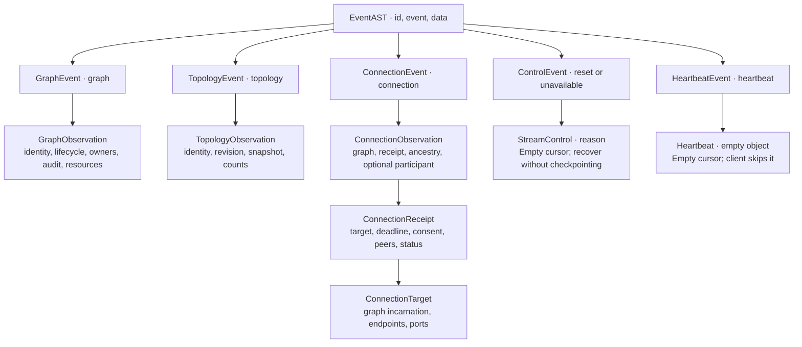

# Event syntax trees, schemas and limits

Polyad publishes a typed contract for the events that workloads consume. The
same event AST applies to SSE and WebSocket subscriptions; the transport changes
the framing, not graph visibility, consent permissions or replay semantics.

## Table of contents

- [Import the contract](#import-the-contract)
- [Supported event trees](#supported-event-trees)
- [Payload shapes](#payload-shapes)
- [Schemas and validation](#schemas-and-validation)
- [Administrator tuning](#administrator-tuning)
- [Client receive limits](#client-receive-limits)
- [Oversized events and recovery](#oversized-events-and-recovery)

## Import the contract

Install `polyad-types` to use event types without installing the operator. The
`polyad-client` package already depends on it:

```python
from polyad_types import EventAST, TopologyEvent, decode_event, event_schema

document = {
    "id": "1750000000000-0",
    "event": "topology",
    "data": {
        "apiVersion": "polyad.astrivant.com/v1alpha1",
        "kind": "Graph", "namespace": "workloads", "name": "pipeline",
        "uid": "graph-uid", "resourceVersion": "42", "generation": 3,
        "type": "topology", "ancestry": [], "revision": "structural-digest",
        "snapshot": "/v1/graphs/Graph/pipeline/topology",
        "valid": True, "nodeCount": 3, "connectionCount": 2,
    },
}
event: EventAST = decode_event(document)
if isinstance(event, TopologyEvent):
    print(event.data.revision, event.data.nodeCount)

schema = event_schema()  # Packaged JSON Schema; no HTTP request or operator import.
```

Client iterators continue returning `Event(id, event, data)` so dictionary-based
filters and hooks remain usable. Call `observation.typed()` to validate and obtain
the corresponding syntax tree. Constructors and types live in
[`polyad_types.event_models`](../../pkg/polyad-types/polyad_types/event_models.py).
`to_dict(ast)` converts the typed tree back into an independent JSON object.

## Supported event trees



| `event` | Imported AST | Meaning of `data` | Cursor |
| --- | --- | --- | --- |
| `graph` | `GraphEvent` | Lifecycle observation or deletion in progress | Durable replay ID |
| `topology` | `TopologyEvent` | Structural revision and a path to refresh neighbors | Durable replay ID |
| `connection` | `ConnectionEvent` | Consent receipt or atlas participant projection | Durable replay ID |
| `reset` | `ControlEvent` | Refresh current topology and its replay cursor | Empty |
| `unavailable` | `ControlEvent` | Reconnect explicitly from the last processed cursor | Empty |
| `heartbeat` | `HeartbeatEvent` | Empty keepalive object, WebSocket only | Empty |

SSE carries `id`, `event` and JSON `data` fields. A WebSocket text frame carries
one JSON object containing those same three properties. SSE comments and its
`retry` preamble are transport metadata, not additional AST variants. There is no
custom event-publishing or custom event-type API in this contract.

## Payload shapes

`EventIdentity` identifies an exact resource using `kind`, `namespace`, `name`
and `uid`, with an optional registered `cluster`. `ObservationIdentity` adds
`apiVersion`, `resourceVersion` and `generation`. These identities are separate
from the envelope's replay cursor and the topology's structural `revision`.

`GraphObservation` adds `type: observation | deleting`, public `owners`, verified
`ancestry`, selected `audit` labels, `status` and `resources`. Its `EventStatus`
models lifecycle flags and retains resource-specific `activations` and
`throughput` objects. Those policy objects and resource metrics are explicitly
extensible JSON dictionaries; they are not arbitrary extensions to the envelope.

`TopologyObservation` adds `type: topology`, verified `ancestry`, `revision`,
`snapshot`, `valid`, `nodeCount` and `connectionCount`. It tells a workload when
to refresh its [neighbor snapshot](../workloads/workload-events.md#read-current-neighbors);
it does not embed a complete graph in every event.

`ConnectionObservation` includes `type: connection`, the visible `graph`, verified
`ancestry` and a `ConnectionReceipt`. A local receipt observation also carries
resource identity and lifecycle fields. An atlas participant projection supplies
`participant: source | target` and may omit those local-receipt fields. The receipt
contains its identity, deadline, exact `ConnectionTarget`, endpoint consent,
optional peer identities and extensible admission-status JSON. Receiving an event
does not approve it; see [service consent](temporary-connections.md#service-consent).

Complete examples of every variant, including local and atlas connection events,
live in the validated [event fixtures](../../pkg/tests/data/events.json). The
[workload events guide](../workloads/workload-events.md) describes visibility,
startup, topology refresh and connection hooks.

## Schemas and validation

The [packaged JSON Schema](../../pkg/polyad-types/polyad_types/schemas/events.schema.json)
uses Draft 2020-12, a discriminated `oneOf`, and named `$defs` for nested nodes.
It is generated from the Python models and field constraints. Pre-commit checks
that the artifact matches its source. Both wheels and source distributions ship it.

On the authenticated events Service:

```text
GET /v1/events/schema    # Installed operator's event schema
GET /v1/events/config    # Its current EventStreamSettings
```

Both routes require the `events` endpoint permission when using named keys.
They reveal no graph identities or credentials. Their paths appear in the events
OpenAPI document and the chart's Istio gateway and authorization rules.

`decode_event(document)` and `Event.typed()` reject unknown event types, missing
required fields, unmodeled fields, invalid cursors and primitive coercions such as
`"true"` in a boolean field. Controls cannot advance a cursor. JSON numbers must
be finite. The publisher validates actual observations before storing or
archiving them. Raw client dictionaries remain available for applications that
choose when to perform typed decoding.

Regenerate the artifact after changing its models:

```sh
poetry run python scripts/schemas/generate-event-schemas.py
```

## Administrator tuning

Use the typed [event reference values](../../charts/polyad/values-events.reference.yaml):

```yaml
events:
  enabled: true
  maxEventBytes: 1048576
  readBatchSize: 64
  pollIntervalSeconds: 1
  retention: 10000
  maxConnections: 16
  websockets:
    enabled: false
```

| Setting | Default | Allowed range | Tradeoff |
| --- | --- | --- | --- |
| `maxEventBytes` | 1,048,576 | 1,024–16,777,216 bytes | Larger public observations cost more publication, delivery and client memory |
| `readBatchSize` | 64 | 1–256 records | Larger batches catch up faster but allocate more data per subscriber read |
| `pollIntervalSeconds` | 1 | 0.05–5 seconds | Shorter empty-stream waits reduce idle latency and increase cache traffic |
| `retention` | 10,000 | 100–100,000 records | More retained history extends the reconnect window and increases storage |
| `maxConnections` | 16 | 1–128 subscriptions per replica | Both transports share this ceiling and occupy HTTP workers |

The byte limit counts the **complete serialized UTF-8 event**, including SSE
field names/newlines or the WebSocket JSON envelope. It is not a character count,
a `data`-only limit, or a limit on topology/discovery HTTP responses. Publication
reserves space for the longest supported replay cursor and verifies that both
transport encodings fit. WebSocket protocol headers and SSE comments are outside
the observation itself; the client's SSE parser also bounds each metadata record.

Helm passes these settings into local publishers, API-serving components and
root-held remote-cluster streams. Separately installed operators use their own
release values. Polling delay is not a strict heartbeat deadline: storage reads,
authorization and backpressure also affect delivery. Keep the client read timeout
comfortably above it.

Tune batch size and event size together: a subscriber may fetch up to
`readBatchSize × maxEventBytes` of serialized observations in a read, with extra
memory for decoded objects. Replay retention and simultaneous subscribers add
their own costs. WebSocket clients buffer one incoming frame by default.

## Client receive limits

Choose a receive limit when constructing the events client; both transports and
callback subscriptions inherit it:

```python
from polyad_client import Client
from polyad_types import ControlEvent

events = Client(
    "http://polyad-polyad-events:8091", token,
    max_event_bytes=2 * 1024 * 1024,
)
settings = events.event_settings()
assert settings.maxEventBytes <= events.max_event_bytes

for observation in events.events(transport="websocket"):
    typed = observation.typed()
    if isinstance(typed, ControlEvent):
        raise RuntimeError(typed.data.reason)  # Refresh/reconnect before resuming.
    handle(typed)
    save_cursor(observation.id)  # After successful handling of an observation.
```

The default is 1 MiB; the client accepts the same 1 KiB–16 MiB range as the operator.
`event_settings()` only reports the server budget. It never increases the client
limit automatically. A smaller local budget deliberately rejects larger events
with `EventTooLarge`, a `ValueError` subclass, and closes the subscription. Raising
Helm's limit therefore requires applications to review their receive budgets too.

## Oversized events and recovery

Oversized publications raise `EventTooLarge` and emit a size-limit warning before
that observation reaches either replay storage or the PostgreSQL archive.
Reconciliation's existing publication-error handling applies. Payloads are never
silently truncated, and a rejected publication is not acknowledged as delivered.

After lowering the server limit, replay may still contain older, larger records.
The dispatcher sends a bounded `reset` control and closes that subscription
without acknowledging the oversized record. Refresh the topology and its current
cursor, or have the administrator raise the limit; retrying the same old cursor
alone cannot resolve that mismatch. Callback subscriptions raise
`StreamInterrupted` on reset and leave their last successful checkpoint intact.

These event budgets do not replace graph access rules, temporary-connection
consent, API-key rate/concurrency lanes or the
[existing replay recovery contract](../workloads/workload-events.md#subscribe-from-a-workload).
