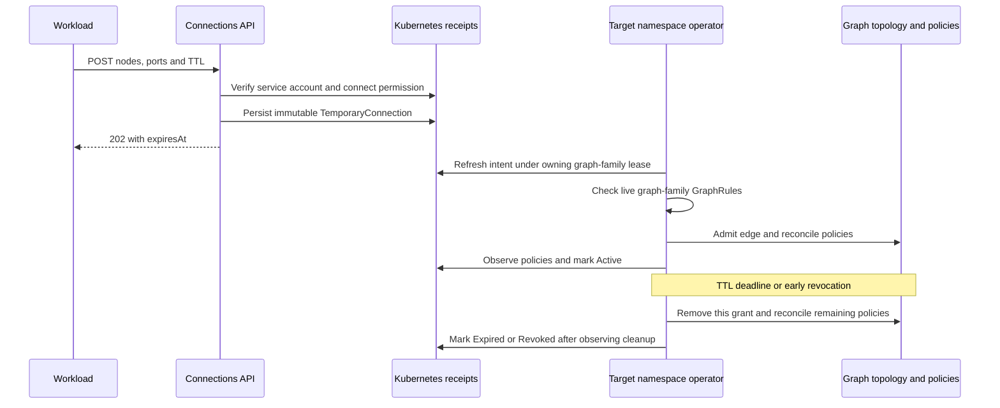

# Temporary connections

Services can request a directed connection between existing nodes of a `Graph`,
`PolyGraph`, or `ReplicaGroup` for a bounded lifetime. Polyad records each request,
checks the live graph family's [GraphRules](../graphs/graph-rules.md), adds admitted edges
to the instance's effective topology, and removes their grants after expiry.
The graph's reusable specification is unchanged.

## Enable the endpoint and choose its scope

The listener is disabled by default. Enable it in Helm:

```yaml
connections:
  enabled: true
  scope: Cluster
  namespace: ''
  maxTtlSeconds: 3600
  retentionSeconds: 3600
```

The internal Service is `<release>-polyad-connections.<operator-namespace>.svc:8093`.
Managed workloads receive its address as `POLYAD_CONNECTIONS_URL`. Outside Helm,
configure `POLYAD_CONNECTIONS_ENABLED`, `POLYAD_CONNECTIONS_SCOPE`,
`POLYAD_CONNECTIONS_NAMESPACE`, `POLYAD_CONNECTIONS_MAX_TTL`, and
`POLYAD_CONNECTIONS_RETENTION`; discovery uses `POLYAD_WORKLOAD_CONNECTIONS_URL`.

| `connections.scope` | Allowed callers **and** target graphs | `connections.namespace` |
| --- | --- | --- |
| `Cluster` (default) | Any namespace in this cluster, subject to graph-specific authorization | Empty |
| `OperatorNamespace` | Only the namespace hosting this operator | Empty |
| `Namespace` | Only the named namespace, even when the API runs elsewhere | Required namespace name |

For example, select `scope: Namespace` and `namespace: analytics` to allow only
service accounts from `analytics` to request connections on graphs in `analytics`.
Both endpoints belong to one target boundary; cluster scope does not introduce
cross-namespace graph edges or arbitrary Kubernetes Service connections.

**Each target namespace needs a running Polyad operator with
`connections.enabled: true`.** Polyad's reconciliation workers remain namespaced.
A cluster-scoped listener can accept requests for those operators, but cannot
reconcile their graphs itself. An absent target operator leaves the receipt
Pending; a disabled target operator rejects new requests. Its scope and TTL
limits also apply. Deploy the CRDs when upgrading before enabling this feature.

When `networkPolicy.enabled` is set, the chart admits port 8093 from namespaces
matching this scope. Caller graph policies must also allow egress to the listener.
With operator mesh authorization enabled, add the exact caller identity to
`mesh.operator.connectionPrincipals`. This listener has no public Gateway route.
See [networking configuration](../deployment/networking.md#optional-chart-networking).

## Authenticate workloads

The API verifies projected Kubernetes service-account tokens with audience
`polyad-connections`. It checks the audience returned by
[TokenReview](https://kubernetes.io/docs/reference/kubernetes-api/definitions/token-review-v1-authentication/)
and uses the verified identity in a
[SubjectAccessReview](https://kubernetes.io/docs/reference/kubernetes-api/definitions/subject-access-review-v1-authorization/).
Composition and events tokens do not authorize connection requests.

Give a caller the `connect` verb on the target graph. This verb is checked by
Polyad; it does not grant permission to patch graphs or create receipts directly.
For a Graph named `pipeline` in namespace `analytics`:

```yaml
apiVersion: v1
kind: ServiceAccount
metadata:
  name: pipeline-worker
  namespace: analytics
---
apiVersion: rbac.authorization.k8s.io/v1
kind: Role
metadata:
  name: connect-pipeline
  namespace: analytics
rules:
  - apiGroups: [polyad.astrivant.com]
    resources: [graphs]
    resourceNames: [pipeline]
    verbs: [connect]
---
apiVersion: rbac.authorization.k8s.io/v1
kind: RoleBinding
metadata:
  name: connect-pipeline
  namespace: analytics
roleRef:
  apiGroup: rbac.authorization.k8s.io
  kind: Role
  name: connect-pipeline
subjects:
  - kind: ServiceAccount
    name: pipeline-worker
    namespace: analytics
```

Use `polygraphs` or `replicagroups` for those boundary types. `resourceNames`
identifies persisted instances, including generated names obtained from
composition audit or [workload identity](../workloads/workload-environment.md). Permission is
for the entire target boundary: authorized callers can select any two nodes in
it, subject to GraphRules. Callers can read or revoke only their own service
account incarnation's requests.

Add this to the workload's Pod template `spec`, mounting the projected token in
each container that calls the API:

```yaml
serviceAccountName: pipeline-worker
containers:
  - name: main
    image: your-registry/worker:1.0
    volumeMounts:
      - name: connection-identity
        mountPath: /var/run/polyad-connections
        readOnly: true
volumes:
  - name: connection-identity
    projected:
      sources:
        - serviceAccountToken:
            path: token
            audience: polyad-connections
            expirationSeconds: 3600
```

Read the file again before subsequent requests so Kubernetes token rotation takes
effect. The connection deadline and the authentication token's lifetime are
independent. The chart grants the operator review privileges and scoped receipt
intake rights; do not grant application service accounts direct write access to
`TemporaryConnection` objects or the operator-owned connection annotation.

## Submit, observe and revoke

Send a request using the **instance** name and UID. For this example, the graph
must already contain nodes `producer` and `consumer`:

```http
POST /v1/connections
Authorization: Bearer <projected-service-account-token>
Content-Type: application/json

{
  "requestId": "handoff-42",
  "namespace": "analytics",
  "kind": "Graph",
  "graph": "pipeline",
  "graphUid": "<persisted-graph-uid>",
  "source": "producer",
  "target": "consumer",
  "ttlSeconds": 300,
  "ports": [{"port": 8080, "protocol": "TCP"}],
  "bidirectional": false
}
```

| Field | Constraint |
| --- | --- |
| `requestId` | 1–128 letters, digits, dots, underscores, colons or hyphens; stable across retries |
| `namespace`, `kind`, `graph`, `graphUid` | Exact persisted boundary incarnation; supported kinds are Graph, PolyGraph and ReplicaGroup |
| `source`, `target` | Distinct existing logical node names in that boundary |
| `ttlSeconds` | Required integer, 1 through the configured maximum; maximum configuration is 86400 seconds |
| `ports` | Optional, at most 32 destination ports from 1–65535; protocol TCP (default), UDP or SCTP |
| `bidirectional` | Optional boolean, default false; true adds the reverse edge with the same port grants |

HTTP 202 acknowledges a durable receipt. Poll
`GET /v1/connections/analytics/handoff-42` for `status.phase`: `Pending`, `Active`,
`Rejected`, `Expired` or `Revoked`. The response includes `expiresAt`, graph identity,
endpoint details, and `revokeRequested`. `Active` means the requested policies
have been observed in Kubernetes; it does not prove application readiness or CNI
convergence. Rejections include `status.message`.

`DELETE /v1/connections/analytics/handoff-42` requests early revocation and returns
202. Poll until `Revoked` or `Expired`; an accepted delete is not synchronous
network teardown. Requests outside caller/target scope or without `connect`
permission return 403. Invalid authentication returns 401; conflicting request
identity returns 409. The authenticated schema is at `/openapi.json`.

The [standalone Python client](../../pkg/client/README.md) supports all three
operations without installing the operator package:

```python
import os
from pathlib import Path
from polyad_client import Client


def connections():
    # Refresh the projected credential on each operation.
    token = Path("/var/run/polyad-connections/token").read_text().strip()
    return Client(os.environ["POLYAD_CONNECTIONS_URL"], token)


namespace = os.environ["POLYAD_GRAPH_NAMESPACE"]
receipt = connections().connect({
    "requestId": "handoff-42",
    "namespace": namespace,
    "kind": os.environ["POLYAD_GRAPH_KIND"],
    "graph": os.environ["POLYAD_GRAPH_NAME"],
    "graphUid": os.environ["POLYAD_GRAPH_UID"],
    "source": os.environ["POLYAD_NODE_NAME"],
    "target": "consumer",
    "ttlSeconds": 300,
    "ports": [{"port": 8080}],
})
status = connections().connection(namespace, "handoff-42")
# When the application no longer needs the connection:
connections().disconnect(namespace, "handoff-42")
```

## Meaning at each graph layer

Temporary edges have the same meaning as declarative
[connections and transport grants](../deployment/networking.md#isolating-a-subgraph):

| Target boundary | Endpoints | Effect |
| --- | --- | --- |
| Graph | Logical workload or nested graph nodes | Connect those vertices; a nested node denotes its subtree |
| PolyGraph | Graph or replica-group nodes | Connect the selected component subtrees at their enclosing boundary |
| ReplicaGroup | `replica-0`, `replica-1`, etc. | Connect copies of its template, whether those copies are daemons, graphs, PolyGraphs or nested replica groups |

The [replication diagrams](../graphs/replication.md#connections-between-copies) show how
replica vertices expand into workloads. These temporary edges supplement the
chosen Independent, Chain, Ring, Star, FullMesh or Custom layout on one instance.
They do not change its `spec.connectivity` or every use of its template.

Ports omitted or empty means a **topology-only** edge. Providing ports grants
matching producer egress and consumer ingress within each applicable network
contract. Existing ancestor/descendant contracts are intersected, so a grant
cannot bypass another layer's restrictions. To rely on expiry for network
isolation, configure an isolating network contract with `allowWithin: false` and
avoid other policies that independently permit the same traffic. A temporary
edge does not create a listener, Service, DNS name or tunnel, nor does it turn an
otherwise unrestricted network into a restricted one.



Admission recomputes live Cheeger constants and the other selected constraints
through the owning hierarchy. Effective edges also enter subsequent graph and
autoscaling admission checks, graph metrics and
[topology events](../workloads/workload-events.md). Creating a Pending request alone does not
add a neighbor. Admission and expiry change topology revisions when they change
effective connections; overlapping identical grants need not change neighbors.

Endpoints are logical nodes, not Pod UIDs. Multiple Pods and activation runs of
the same node share its network identity. A replica ordinal removed by scale-in
has no effective edge; if that ordinal returns before the deadline, its still-live
grant applies again. Replacing the entire target graph cannot transfer a grant to
the replacement because `graphUid` pins the graph incarnation.

## Deadline, retries and cleanup

TTL starts at the API server's receipt creation timestamp, including time spent
Pending. Replaying an identical request from the same service-account UID and
namespace returns the same receipt and deadline. Changing its TTL, graph or edges
under the same request ID returns 409. There is no renewal operation; submit a
new request ID for a new lifetime. Kubernetes receipts survive process restarts
and operator failover; in-memory timers are not the source of truth.

At the deadline, graph calculations exclude the expired edge. The enabled
operator scans connection receipts every five seconds, in addition to watches
and ordinary rescans, and reconciles remaining network/mesh policies. Cleanup
removes only this receipt's contribution: static edges and other live grants
remain. Expiry and revocation proceed even if the resulting graph violates a
minimum Cheeger or connectivity bound; that violation can block subsequent graph
or scaling actions, but cannot extend an expired grant.

**Network enforcement is asynchronous.** Queue backlog, unavailable operators,
Kubernetes API outages and CNI/mesh propagation can delay actual traffic removal.
Existing sessions follow the network implementation's policy-update behavior.
TTL is not a hard real-time socket cutoff. Disabling intake still permits ordinary
reconciliation to clean up existing receipts; keep the operator running until
cleanup completes.

Finalizers keep receipts until policy cleanup is observed. Terminal receipts are
then retained for `retentionSeconds` (default 3600, configurable 0–604800) before
deletion. After deletion the same request ID can create a new receipt; retain IDs
in your application if it needs a longer deduplication window. Intake bodies are
limited to 64 KiB, and a graph admits at most 128 live temporary connections within
a 128 KiB annotation budget. The endpoint uses the chart's shared
`api.rateLimit` settings with its own connection-intake quota.

## Implementation boundaries

The HTTP routes and authenticated receipt store live in `polyad.api.connections`.
Composition, connection, event and metrics blueprints share one Flask application,
one Waitress runtime and one shutdown lifecycle in `polyad.api.server`. Listener
ports retain independent enablement and authentication policies. See the
[HTTP runtime](composition-api.md) for worker reservations and socket-based routing. `polyad.graph.temporary` defines the
request and effective topology overlay. `polyad.operator.connections` performs
admission and expiry under the existing graph-family lease.
