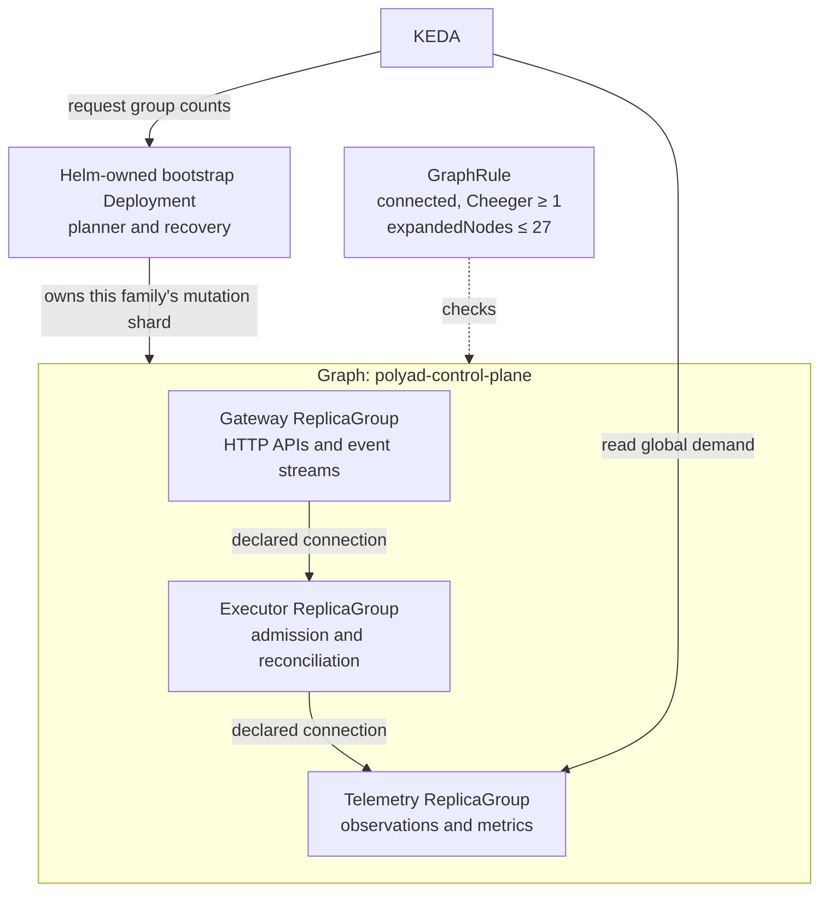
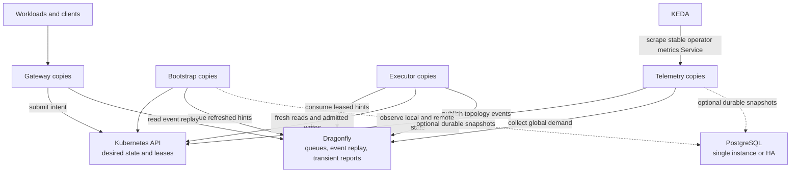

# Dense and distributed operator deployments

The [HA deployment profile](deployment-profiles.md) defaults to
`architecture.mode: Dense`, running coordination, reconciliation and
enabled HTTP services together in each operator Pod. Multiple replicas share
Dragonfly queues and Kubernetes Leases. This remains useful for a compact
installation, including HA on a single cluster.

Within HA, `architecture.mode: Distributed` keeps the bootstrap Deployment and
packages the remaining responsibilities as independent workloads in a persistent
Graph. PostgreSQL is optional in either architecture.

The operator's own Graph and component definitions are internal. Their lifecycle,
replica changes and topology snapshots are excluded from downstream workload event
streams, including replay. Descendant resources inherit the internal marker;
fresh ancestry checks also cover their graph-targeted requests. Component metrics
continue to feed KEDA. See [application stream boundaries](../workloads/workload-events.md#application-stream-boundary).

| Component | Responsibility | Scaling demand |
| --- | --- | --- |
| Bootstrap | Root planner, family leases, recovery and the control-plane Graph's reconciliation | Fixed `operator.replicaCount` or the [operator CPU/memory HPA](../operations/performance.md#autoscaling-response) |
| Gateway | Enabled composition, temporary-connection and event APIs | HTTP arrival rate and concurrent responses, including open event streams |
| Executor | Fresh graph admission, reconciliation and workload mutations | Outstanding reconciliation hints across the local namespace and every root-managed cluster |
| Telemetry | Namespace observations, optional PostgreSQL persistence, global demand aggregation and metrics APIs | HTTP arrival rate and concurrent metrics responses |

Gateway and telemetry processes never acquire mutation shards. Each component
uses the same image with an explicit `POLYAD_COMPONENT` role. Dense deployments
retain all responsibilities. A Daemon definition has `replicas: 1`; each
ReplicaGroup copy becomes a separate one-Pod Deployment, so scaling passes
through graph admission at every copy boundary.

## Install

Install KEDA and prepare the `polyad-api`, `polyad-events` and `polyad-metrics`
token Secrets, or configure ESO to create them. Then:

```bash
helm upgrade --install polyad charts/polyad --namespace polyad --create-namespace \
  --values examples/components/values.yaml
```

The [example values](../../examples/components/values.yaml) enable component
autoscaling, use two initial copies of each role and permit two through eight.
Set `architecture.autoscaling: false` to manage group counts without KEDA.
At least one gateway API and metrics must be enabled for Distributed mode.
Add the [PostgreSQL values](../../examples/postgresql/values.yaml) as another values
file to opt into database storage after installing CloudNativePG.

## The operator's own Graph

For release `polyad`, Helm declares `Graph/polyad-control-plane`, three reusable
ReplicaGroups (`polyad-gateway`, `polyad-executor`, `polyad-telemetry`), their
Daemon definitions and `GraphRule/polyad-control-plane`.



These two port-free connections describe logical stages. Communication between
roles uses Kubernetes and the shared store; the edges do not implement a direct
HTTP forwarding pipeline or claim an inter-process bandwidth guarantee. The
physical control and storage paths are:



Services keep their existing names and ports while selecting the matching role.
NetworkPolicy, Istio authorization and Secret mounts apply to component Pods.
With ESO reloads enabled, generated Daemons also opt into Secret-change restart
annotations. Credential file checks continue to request process replacement.
The managed database, Dragonfly and the bootstrap Deployment stay outside the
Graph they support.

## Scaling and structural bounds

The component graph's simple undirected projection is a three-vertex chain with
Cheeger constant 1. Its referenced GraphRule uses `scope: Boundary`,
`relation: connections`, a connected-shape requirement and a configurable
`architecture.cheegerMinimum` (default 1). `architecture.expandedNodes` bounds
the three group vertices plus their Daemon copies. The default 27 permits all
three groups to reach eight copies; smaller budgets can block a scaling request.
Namespace GraphRules also remain applicable.

Copies within each group use the existing Independent default. The parent
Cheeger bound applies to the three stages, while group min/max replica limits
apply to copies. A parent's Cheeger value does not grow just because a group
gets more replicas. For different copy wiring, use the existing
[ReplicaGroup connectivity configurations](../graphs/replication.md#connections-between-copies)
in a customized component definition and select appropriate local rules.

KEDA targets the reusable ReplicaGroup definitions' `/scale` endpoints.
Generated instances inherit their counts, and the bootstrap controller refreshes
the owning graph, sources, siblings and rules before applying changes. A request
that exceeds the recursive budget or another selected rule stays unapplied.
Directly autoscaling generated Deployments would bypass this path.

The executor signal is total outstanding queue entries across all managed
clusters. Gateway and telemetry signals are sixty-second average HTTP arrival
rates and current open responses. Tune per-copy targets under
`architecture.components`, including `executor.backlog`,
`gateway.requestsPerSecond` and `telemetry.concurrentRequests`. KEDA takes the
largest recommendation when both HTTP signals are configured.

Every process publishes a short-lived report. The metrics service sums process
reports once and serves a global value, so a random HA metrics replica returns
the same scope of demand. Missing process reports temporarily make HTTP demand
unavailable; membership expires after 90 seconds. Stale local or remote queue
samples return HTTP 503. There is no scale-to-zero for the service components.
Downscaling removes at most one copy per minute after five minutes of
stabilization. Metrics remain at `/v1/components/{component}/{metric}` and
`/metrics`, with the existing optional bearer authentication.

Cheeger is a structural bottleneck bound, **not measured throughput**. These
capacity signals support control-plane throughput as downstream graph-management
demand changes. Application throughput still needs its own workload signals and
[KEDA policies](../graphs/replication.md#connect-keda). More telemetry copies add serving
capacity and redundancy; each still performs complete inventory scans, so adding
copies also increases Kubernetes reads. Thirty-two family shards bound useful
executor concurrency, and one graph family remains serialized.

## Recovery and root-managed clusters

The root leader reserves the control-plane Graph's entire shard for bootstrap
replicas. Executors cannot receive it. This prevents a component from being the
only process capable of recreating itself. Other graph families hashing to that
same shard are also handled by bootstrap replicas. If no executors remain, the
bootstrap group temporarily receives ordinary shards as well; existing lease
expiry rules still apply.

The HA chart requires at least two bootstrap replicas. Deleting or
suspending the managed Graph stops its components; bootstrap survives and can
reconcile a restored Graph. It does not override intentional deletion or invalid
GraphRules. Root-managed remote OperatorPools always run the executor role and
report to the same root services. The root planner heartbeat still fences their
mutations during loss of root contact. See [the root architecture](root-control-plane.md).

On an existing pre-alpha installation, the new bootstrap label changes the root
Deployment's immutable selector. Recreate that Deployment once when adopting
this chart revision, allowing existing workloads to continue while leases and
operator processes recover. Normal subsequent component or image changes use
the existing graph reconciliation and Deployment replacement behavior.
