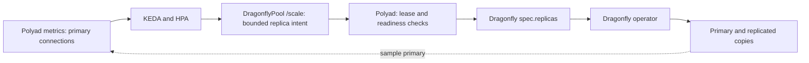

# Dragonfly HA and KEDA

Bundled Dragonfly HA uses KEDA by default. Provide an existing KEDA installation
or enable the [optional chart dependency](local-services.md#install-keda-with-the-chart)
alongside `dragonfly.ha.enabled`. Set `dragonfly.autoscaling.enabled: false` for a fixed
`dragonfly.ha.replicas` count. Single-instance and externally managed caches do
not get a scaler. PostgreSQL remains independent and optional.

The [HA reference values](../../charts/polyad/values-ha.reference.yaml) include:

```yaml
dragonfly:
  enabled: true
  ha:
    enabled: true
    replicas: 2
    topologyKey: kubernetes.io/hostname
  autoscaling:
    enabled: true
    minReplicas: 2
    maxReplicas: 5
    connectionsPerReplica: 50
```

`replicas` is the initial total, including the primary, and must fall inside the
configured bounds. Both bounds accept 2–9 instances. Provide enough eligible
nodes or zones and persistent storage for the maximum; required anti-affinity
can leave extra instances Pending when that capacity is unavailable.

## Table of contents

- [What scales](#what-scales)
- [How requests reach Dragonfly](#how-requests-reach-dragonfly)
- [Access and upgrades](#access-and-upgrades)

## What scales

KEDA reads `/v1/dragonfly/connections` on Polyad's metrics Service. Polyad samples
the primary's `INFO` response in the background and exposes `connected_clients`.
This counts all connected clients on that primary, including other applications
if they share it. Each metrics replica reports the same global observation;
do not sum their values. A failed sample or a connection to a demoted primary
produces an unavailable metric, not zero demand. Metric collection performs no
scrape-time cache or Kubernetes requests; optional [named-key admission](../operations/api-keys.md)
uses the shared cache to enforce each scraper's quota.

The target is approximately `ceil(connections / connectionsPerReplica)`, bounded
by the configured minimum and maximum and subject to HPA tolerance and
stabilization. This is a policy for maintaining additional failover copies as
client demand grows. Dragonfly keeps **one primary**: more instances do not shard
the dataset, increase primary write capacity, or relieve primary memory pressure.
See the upstream [replica and primary Service semantics](https://www.dragonflydb.io/docs/managing-dragonfly/operator/installation).

KEDA allows one additional instance per 120 seconds after a 60-second scale-up
stabilization window. Scale-down uses a 600-second stabilization window and
removes at most one instance per 300 seconds. The minimum preserves a primary
and at least one replica. The two leader-elected **Dragonfly operator** Pods
remain separately configured by `dragonflyOperator.replicaCount`.

## How requests reach Dragonfly

The pinned Dragonfly v1.6.1 CRD has no `/scale` subresource. Polyad supplies an
internal `DragonflyPool` named `<release>-queue` with that interface, and KEDA
targets it. The vendored upstream CRD remains unmodified.



A root-local dense or bootstrap process claims a dedicated Kubernetes Lease.
Before each write it checks ownership and cache availability. It rereads the
pool, Dragonfly and its owned StatefulSet, and waits for current-generation Pod
counts, replication readiness and rollout completion before changing the desired
cache count by one. Resource-version preconditions reject concurrent edits.
Dragonfly's operator owns StatefulSet changes, replication and failover. Pool
status reports observed and ready Pods; it does not equate a requested count
with running capacity. Remote execution replicas do not manage this pool.

Pool resources carry the internal label and do not enter application event
streams or graph composition. The root can use this with dense or split
components; the telemetry component serves metrics in a split installation.

## Access and upgrades

Enabling this scaler automatically enables the Polyad metrics endpoint. To
protect it, enable `metrics.authentication.enabled` and
`keda.authentication.enabled`, using the existing dedicated metrics Secret.
The chart reuses the metrics TriggerAuthentication and includes the route in
the operator mesh policy. Configure the metrics network/mesh caller permissions
for your KEDA installation as described in [metrics](../operations/metrics.md).

Polyad receives get/patch permission only for the release's Dragonfly object,
and read/status permission for its corresponding pool. An external cache URL
Secret cannot override the bundled primary while this scaler is enabled.

For an existing release, install the new CRD before upgrading because Helm does
not add CRDs during upgrades:

```sh
kubectl apply -f charts/polyad-crds/crds/dragonflypools.yaml
```

Exclude `DragonflyPool.spec.replicas` and `Dragonfly.spec.replicas` from continuous
GitOps correction while autoscaling is enabled. Changing initial replica values
in Helm can reset runtime intent during an upgrade. The adapter handles only the
release-configured pool; creating arbitrary pools does not enroll more caches.
