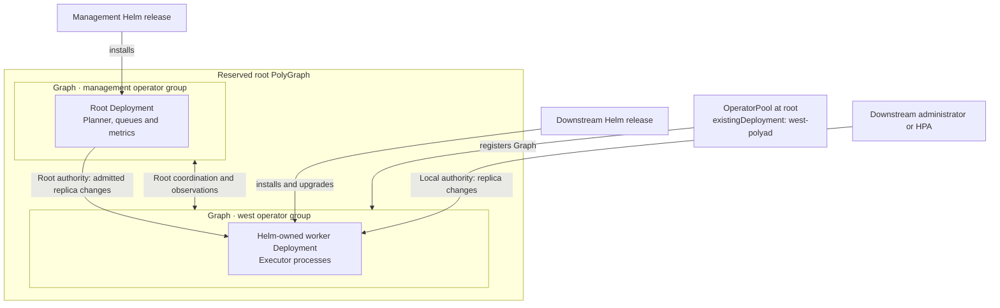

# Helm-installed downstream operators

Cluster administrators can install execution workers with Helm and attach them
to an existing [root control plane](root-control-plane.md). Choose who sets their
replica count: the root and its KEDA scaler, or the downstream administrator.
Helm retains installation, Pod configuration, credentials, upgrades and deletion
in both cases. Workers execute under root coordination; they never elect a root
planner or start another composition, event or metrics server.

[Discovery access ceilings](../apis/discovery.md#administrator-configuration)
also apply to manually installed workers; use the root policy tree and narrow it
as needed. Workers do not forward unsupported requests or expose their own APIs.

## Table of contents

- [Ownership and scaling choices](#ownership-and-scaling-choices)
- [Prepare credentials and configuration](#prepare-credentials-and-configuration)
- [Install and attach](#install-and-attach)
- [Keep scaling local](#keep-scaling-local)
- [Switch authority and upgrade](#switch-authority-and-upgrade)
- [Disconnection and detachment](#disconnection-and-detachment)

## Ownership and scaling choices

| Configuration | Installs, configures and upgrades workers | Sets native replicas | Removes workers |
| --- | --- | --- | --- |
| Ordinary OperatorPool, no `existingDeployment` | Root | Root, optionally driven by KEDA | Root when the pool is deleted |
| Attached Deployment, `scalingAuthority: Root` | Downstream Helm release | Root after fresh rule checks | Downstream administrator |
| Attached Deployment, `scalingAuthority: Local` | Downstream Helm release | Downstream Helm release or local HPA | Downstream administrator |

The downstream `worker.scalingAuthority` and root
`OperatorPool.spec.scalingAuthority` must match. A mismatch blocks attachment and
root scaling. The grant also identifies the root cluster, namespace, Deployment,
reserved PolyGraph and pool name; another root cannot adopt it accidentally.
The root never overwrites an attached Deployment's Pod template or adds a
controller owner reference.

Configure each downstream release's internal worker counts, planner parallelism,
write admission and validation cadence with `operator.writeQueue`. Those settings
remain under the downstream administrator's control for either scaling authority.
See the [configuration flow and example](../development/write-pipeline.md#configuration)
and [typed tuning overlay](../../charts/polyad/values-tuning.reference.yaml).



The two replica-change arrows are alternatives. Both choices join the same
[reserved operator hierarchy](root-control-plane.md#reserved-operator-hierarchy),
whose observations are excluded from application event streams. Local scaling
changes are observed by the root; they do not pass through root admission.
Choose Root when its graph constraints must gate each replica change. Structural
Cheeger bounds describe graph boundaries; adding worker Pods primarily adds
execution capacity, as explained in [Cheeger policies](../graphs/cheeger-orchestration.md).

This attachment path supports native Deployments. For node-based execution,
use a [root-provisioned DaemonSet pool](root-control-plane.md#reserved-graphs-for-node-workers).

## Prepare credentials and configuration

Start with [`values-worker.reference.yaml`](../../charts/polyad/values-worker.reference.yaml).
It is a typed, commented overlay for the same chart, installed in the **downstream**
cluster and namespace. Root settings identify the existing management release:

| Worker value | Example | Meaning |
| --- | --- | --- |
| `worker.rootClusterName` | `management` | Root's `global.multiCluster.clusterName`; coordination identity |
| `worker.rootNamespace` | `polyad` | Root release namespace; queues, leases and OperatorPool live here |
| `worker.rootDeployment` | `polyad-polyad` | Root Deployment's actual Kubernetes name |
| `worker.rootGraph` | `polyad-atlas` | Root's reserved PolyGraph name |
| `worker.poolName` | `west-workers` | Matching OperatorPool name in the root namespace |
| `global.multiCluster.clusterName` | `west` | Physical hosting cluster; also used in telemetry |
| Helm `--namespace` | `workloads` | Worker Deployment and mounted Secrets live here |
| `federation.clusters` | `west` mapped to `workloads` | Same complete destination registry used by the root |

Workers can execute assigned graph families in **any registered cluster**. Their
hosting cluster is not a scheduling restriction. They need the root's complete
registry and credentials, not just credentials for their own cluster.

Prepare the [registered namespaces and bootstrap permissions](root-control-plane.md#install-and-register-clusters).
In the downstream release namespace, provision these Secrets yourself or through
[ESO](../operations/authentication.md):

- `root-access`, key `config`: embedded kubeconfig for the root API, with the
  chart's operator permissions in the root namespace.
- `west-access`, key `config`, plus every other registry entry's referenced
  Secret: credentials for the same destinations and namespaces used by the root.
- `root-cache`, key `url`: the same authenticated Dragonfly endpoint as the root,
  reachable from the worker Pods.

The worker chart does not copy these credentials or create local API permissions.
It disables automatic ServiceAccount token mounting and uses the explicit root
kubeconfig. Configure connectivity to the root cache and all registered Kubernetes
APIs. Match the reachable `rootControlPlane.endpoints` URLs to the root.

Match the root's exact `operator.image` and enabled workload capabilities, including
networking, capacity and credential assignments. Workers running another image
are excluded from new shard assignments. Optional PostgreSQL must use an existing
root database (`postgresql.managed: false`) and the same explicit
`postgresql.scope`; provision its credential Secret in the worker namespace too.
Any enabled authentication store likewise uses the existing root database.
Do not combine the worker overlay with references that install a new cache,
database, root control plane, component Graph or endpoint servers.

Tracing, decision logs, resource limits, scheduling and
[Secret-change restarts](../operations/authentication.md#restart-consumers-after-rotation)
use their ordinary chart settings. Every worker retains its own Tini process,
Python runtime and health listener; see the [process hierarchy](process-hierarchy.md).

## Install and attach

For the example identities above, install the root with an attachment declaration
instead of its usual root-provisioned pool:

```bash
helm upgrade --install polyad charts/polyad \
  --kube-context management --namespace polyad --create-namespace \
  --values examples/root-control-plane/values.yaml \
  --values examples/helm-workers/root-values.yaml
```

The [attachment overlay](../../examples/helm-workers/root-values.yaml) replaces the
pool list with:

```yaml
rootControlPlane:
  pools:
    - name: west-workers
      cluster: west
      existingDeployment: west-polyad
      scalingAuthority: Root
      replicas: 2
```

The root waits until that Deployment exists in the registered `workloads`
namespace. It does not install it. Install the downstream release after preparing
the Secrets above and selecting the same image as the root:

```bash
helm upgrade --install west charts/polyad \
  --kube-context west --namespace workloads --create-namespace \
  --values charts/polyad/values-worker.reference.yaml --wait
```

The root validates the local grant, creates the observation Graph and links it
into its reserved PolyGraph. The worker can then join shard coordination. Readiness
waits for registration; installing a worker alone does not authorize execution.
If installing downstream first, omit `--wait` until the root pool is registered.

With Root authority, the downstream Deployment manifest omits `spec.replicas`,
so later Helm upgrades do not reset the root's desired count. Use
`OperatorPool.spec.replicas` or [root KEDA scaling](root-control-plane.md#keda-from-the-root)
with the existing [OperatorPool ScaledObject example](../../examples/root-control-plane/keda.yaml).
Fresh rules at the reserved PolyGraph and remote Graph are checked before each
root replica change. Concurrent edits to the pool or downstream Deployment
invalidate the pending write and trigger a fresh reconciliation.

On existing installations, update the chart's
[`OperatorPool` CRD](../../charts/polyad/crds/operatorpools.yaml) before using the new
fields. Helm installs CRDs on first installation but does not upgrade them;
administrators also maintain the downstream CRDs for Helm-installed workers.

## Keep scaling local

Set `scalingAuthority: Local` on the root pool, and use the
[local worker overlay](../../examples/helm-workers/local-values.yaml) downstream:

```bash
helm upgrade --install west charts/polyad \
  --kube-context west --namespace workloads --create-namespace \
  --values charts/polyad/values-worker.reference.yaml \
  --values examples/helm-workers/local-values.yaml --wait
```

That overlay sets `worker.scalingAuthority: Local`, `ha: true` and
`operator.replicaCount: 2`. Enable `operator.autoscaling.enabled: true` to let the
downstream HPA own replicas instead. Its optional CPU and memory metrics use the
normal [operator autoscaling settings](../../charts/polyad/README.md#operator-and-shared-queue-parameters).
Use `ha: false` with the default replica count for a single local worker.

The root reports the native Deployment's actual replica count and readiness. The
pool's required `replicas` field is unused for desired capacity in Local mode,
and admission rejects changes to it. Do not target that pool with KEDA. The
administrator controls local scaling; root leases still control which graph
mutations workers may perform.

## Switch authority and upgrade

To change scaling authority, first stop the previous scaler, then change the
downstream Helm grant and the root pool's `scalingAuthority` to the same value.
While they disagree, the root blocks replica writes. For Root authority, disable
the local HPA and return `operator.replicaCount` to `null`; set desired capacity
on the root pool. For Local authority, configure the local count or HPA and stop
any root KEDA scaler targeting that pool. A concurrent local grant change also
invalidates the Deployment resource version used by an in-flight root scale.

Helm owns all worker upgrades, even with Root scaling. Coordinate its image,
CRDs, registry, capability flags and credentials with root changes. Unlike a
root-provisioned pool, root upgrades do not rewrite the attached Pod template or
copy new Secrets downstream. New workers can wait for previous shard leases to
expire before taking over; allow for this during rollout and `--wait` timeouts.

`existingDeployment` and `cluster` are immutable on a pool. Detach and create a
new pool to change those identities. Configure scheduling and resources through
the worker chart; an attached pool rejects Pod configuration overrides.

## Disconnection and detachment

Loss of root coordination pauses mutations while existing workloads keep running.
Deleting the root OperatorPool revokes the attachment, unlinks its reserved Graph
and removes the root-owned observation definitions. The Helm Deployment and its
Secrets remain. Its workers stop acquiring or renewing execution authority;
every guarded write checks that the attachment is still registered.

Remove a Helm-declared pool through its management release values. Keep the
destination registry and credentials until its graph finalizers have drained.
Then uninstall the downstream release separately if desired. Uninstalling it
first leaves the pool pending; the root will not recreate the missing Deployment.

Attachment transitions and grant conflicts emit readable structured decisions,
with optional [OpenTelemetry log export](../operations/tracing.md#decision-and-conflict-logs).
Application event subscribers remain isolated from this reserved operator tree.
