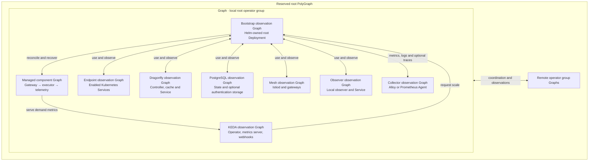

# Local services in the root Graph

With `rootControlPlane.enabled: true`, the root operator Graph represents the
whole local chart installation. KEDA, cache, databases and optional supporting
services belong inside that Graph alongside the bootstrap and managed pipeline.
Remote operator groups remain peers in the enclosing reserved PolyGraph.

## Table of contents

- [What belongs to the root Graph](#what-belongs-to-the-root-graph)
- [Install KEDA with the chart](#install-keda-with-the-chart)
- [Autoscale bundled KEDA in HA mode](#autoscale-bundled-keda-in-ha-mode)
- [Use existing KEDA](#use-existing-keda)
- [Health, ownership and constraints](#health-ownership-and-constraints)
- [Inventory and permissions](#inventory-and-permissions)

## What belongs to the root Graph

Only enabled components create observation branches. The bootstrap and managed
gateway/executor/telemetry pipeline retain their existing branches.

| Branch | Observed services | Lifecycle owner |
| --- | --- | --- |
| `bootstrap` | Root operator Deployment | Helm and the optional operator HPA |
| `components` | Gateway, executor and telemetry ReplicaGroups, in Distributed mode | Polyad, with GraphRule admission and KEDA demand |
| `endpoints` | Enabled composition, events, metrics and temporary-connection Services | Helm |
| `keda` | Operator, metrics server and enabled admission webhook Deployments and Services | Bundled chart and HA component HPAs, or the existing installation |
| `dragonfly` | Bundled Dragonfly operator, its Service, cache instance, StatefulSet and primary Service | Helm and the Dragonfly operator |
| `postgresql` | Managed state and separate authentication Cluster resources and their read/write Services | Helm and CloudNativePG |
| `mesh` | Bundled Istiod and enabled ingress/east-west gateway workloads and Services | Their Helm dependencies |
| `observer` | Optional local observer Deployment and Service | Helm |
| `collectors` | Optional Alloy or Prometheus Agent StatefulSet, OTLP Service and exporter discovery Services | Helm |



Arrows describe operational relationships. The generated root boundary connects
the bootstrap to each local branch in both directions. The component pipeline
keeps its separate three-vertex boundary and
[Cheeger and replica budget](components.md#scaling-and-structural-bounds).

External databases and caches configured only through connection Secrets are
outside this chart's Kubernetes inventory. Independently installed CloudNativePG
and External Secrets controllers remain in their own release inventories. The
database instances this chart declares are included. KEDA has explicit existing
installation references because it drives this operator's scaling.

The [collector configuration](../operations/telemetry-agents.md) discovers enabled
exporters and forwards observations to administrator-supplied monitoring backends.

## Install KEDA with the chart

Set `keda.install: true` to enable the pinned upstream dependency. It installs in
the release namespace. `kedaOperator` passes configuration to the upstream chart;
its actual rendered names and enabled components determine the observation
targets. See the [typed KEDA values reference](../../charts/polyad/values-keda.reference.yaml)
and [upstream chart settings](https://github.com/kedacore/charts/blob/main/keda/values.yaml).

After preparing the root access and cache Secrets from the
[root installation guide](root-control-plane.md#install-and-register-clusters):

```bash
helm dependency build charts/polyad
helm upgrade --install polyad charts/polyad --namespace polyad --create-namespace \
  --values charts/polyad/values-root-control-plane.reference.yaml \
  --values charts/polyad/values-keda.reference.yaml
```

Choose one KEDA installation for the cluster. Existing KEDA installations should
use the next configuration instead of installing overlapping controllers and
cluster-scoped APIs. Downstream worker releases cannot enable `keda.install`;
the root coordinates their scaling.

## Autoscale bundled KEDA in HA mode

Bundled KEDA starts with two Pods per enabled Deployment, including when Polyad
uses its singular profile. With `ha: true` and `keda.install: true`,
`keda.autoscaling.enabled` defaults to `true` and creates native Kubernetes HPAs
for the metrics server and admission webhooks. Each scales independently between
two and five Pods, targeting 70% CPU and 80% memory utilization relative to its
container's resource requests. A five-minute scale-down window limits churn.

These HPAs use the Kubernetes **resource metrics API** (`metrics.k8s.io`), which
must be available in the cluster. Container metrics measure the KEDA process
independently of injected sidecars. KEDA's external-metrics API, Polyad's metrics
endpoint and their authentication settings are separate from this control loop.

The KEDA operator keeps a fixed replica count, defaulting to two for leader
failover. One leader performs reconciliation. For metrics-server replicas to
share API traffic, configure or verify API-server aggregator routing
(`--enable-aggregator-routing=true`). See [KEDA's HA guidance](https://keda.sh/docs/2.20/operate/cluster/#high-availability).

Tune each component under `keda.autoscaling.metricsServer` or
`keda.autoscaling.webhooks`: `minReplicas`, `maxReplicas`, CPU and memory targets,
and `enabled`. Set a memory target to `null` to use CPU alone. Shared
`keda.autoscaling.behavior` configures stabilization windows and optional HPA
rate policies. The [KEDA reference values](../../charts/polyad/values-keda.reference.yaml)
show these controls together. Resource requests come from upstream
`kedaOperator.resources.metricServer` and `kedaOperator.resources.webhooks`;
each selected metric requires a positive request.

Set `keda.autoscaling.enabled: false` to keep upstream replica counts fixed.
Disabling an upstream component also removes its HPA. HA requires at least two
initial Pods for each enabled component and an HPA minimum of two. Custom
Deployment and container names are resolved from the bundled chart.

For GitOps, let the HPA own `/spec/replicas` on these two Deployments. The
[Terraform Argo CD bootstrap](../../terraform/bootstrap/templates/application.yaml)
already preserves counts managed by `kube-controller-manager` for the default
KEDA names; update those targets when overriding names. Helm continues to own
the operator's fixed replicas, images, resource requests and autoscaling bounds.
Existing KEDA installations retain their own scaling configuration and ownership.

## Use existing KEDA

`keda.install` defaults to `false`. In root mode, observation defaults to the
standard three KEDA Deployments and Services in namespace `keda`:

```yaml
keda:
  install: false
  observation:
    enabled: true
    namespace: scaling
    deployments: [keda-operator, keda-operator-metrics-apiserver, keda-admission-webhooks]
    services: [keda-operator, keda-operator-metrics-apiserver, keda-admission-webhooks]
```

Adjust names and remove disabled webhook or metrics-server components to match
the existing installation. Its namespace must already exist. A root that does
not use KEDA can set `keda.observation.enabled: false`. Bundled KEDA always joins
the root Graph, regardless of this existing-installation observation setting.

## Health, ownership and constraints

Each observation Graph refreshes its declared native resources during
reconciliation. Missing resources remain pending vertices instead of disappearing
from the topology. Deployment, StatefulSet and DaemonSet observations use fresh
rollout state; PostgreSQL uses Ready conditions and instance counts. A Service
observation confirms that the Service exists; it does not probe application
traffic. These results roll up into root Graph and PolyGraph readiness.

Suspending or removing an observation Graph never scales, adopts, deletes or
recreates its native services. Installation, upgrades, failover and native
autoscaling stay with their existing owners. GraphRules still constrain the
observed topology and Polyad-managed component changes; observation membership
does not intercept Helm, KEDA or upstream controller writes to infrastructure.

Infrastructure vertices use internal `Resource` observation bindings. Their
references identify existing native objects; they do not create reusable
Polyad Resource definitions or managed copies. All observation Graphs and their
statuses remain excluded from application event streams.

## Inventory and permissions

Helm derives the inventory from this chart's enabled workload and Service
templates, including dependency overrides. The root receives only kind,
namespace and name in `POLYAD_LOCAL_SERVICES`. Pod templates, Secret contents and
database credentials are not copied into that inventory.

The chart creates namespaced observation Roles with `get` permission restricted
to the named resources. Existing KEDA can live in a different namespace in the
same cluster. Installing these Roles requires the administrator's permission in
that namespace; the root's normal graph-mutation permissions remain separate.
Generated observation branches participate in the root's reserved mutation
shard, so downstream workers never become responsible for their recovery.
