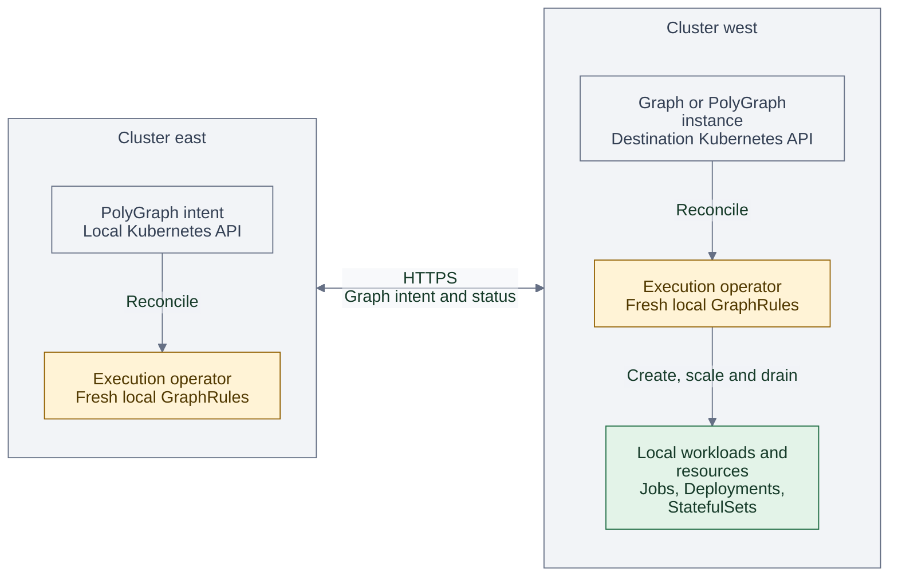
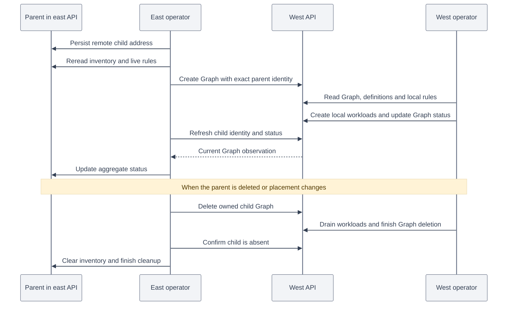
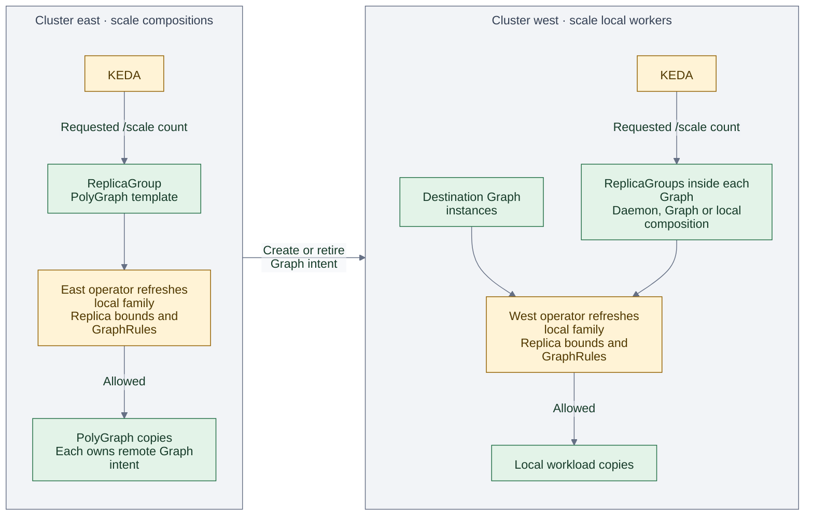
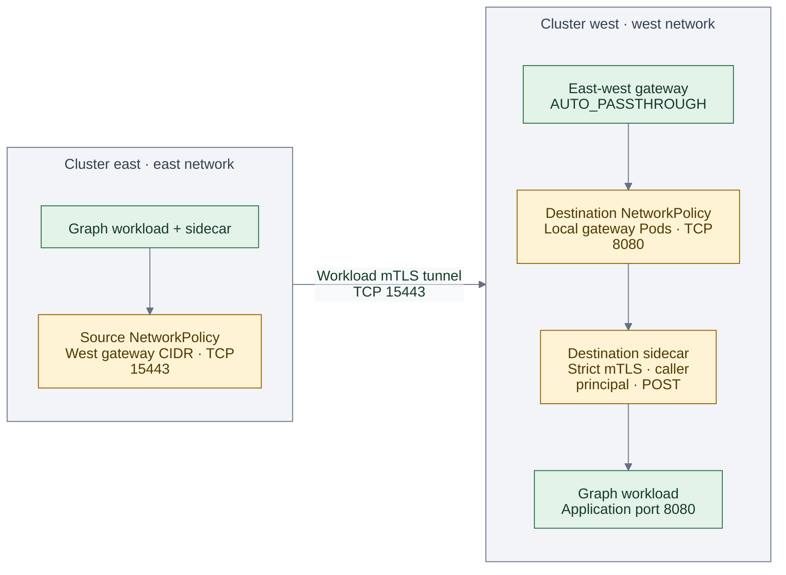
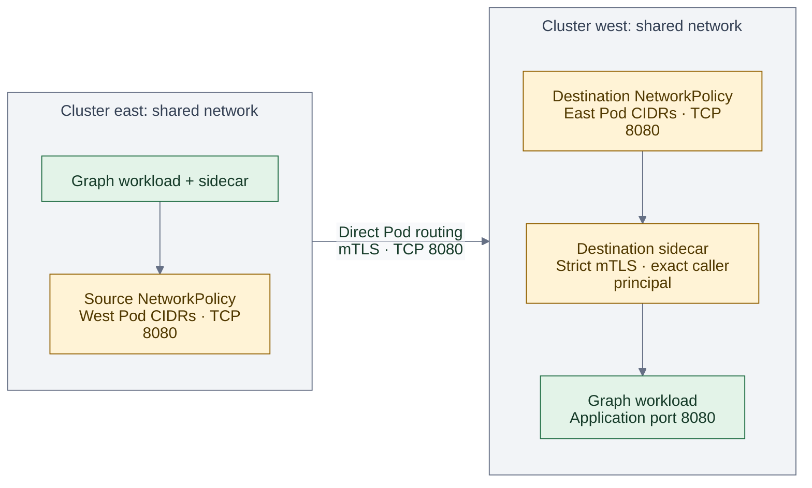
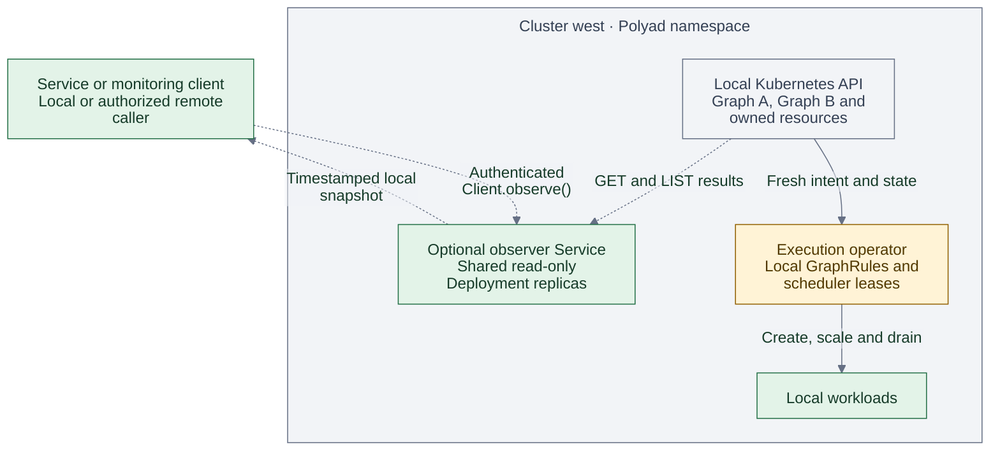

# Cross-cluster composition and optional observers

A `Graph` executes within one Kubernetes cluster. A `PolyGraph` composes Graphs,
ReplicaGroups and other PolyGraphs; its Graph and PolyGraph nodes can select a
registered destination cluster. Nested PolyGraphs describe regions, groups of
clusters and higher levels without introducing another graph kind. A PolyGraph
can still compose children entirely within its own cluster.

All cross-cluster features are optional and disabled by default. The following
Helm settings configure placement, networking and observation:

| Setting | Purpose |
| --- | --- |
| `federation.enabled` | Deploy and manage child Graphs and PolyGraphs in registered clusters. |
| `mesh.multicluster.enabled` | Configure sidecar Istio transport and remote traffic allowances. |
| `observer.enabled` | Run shared, read-only observer replicas in this cluster and namespace. |

Management needs access to remote Kubernetes APIs. Application traffic needs a
working network and, for Polyad's remote traffic policies, Istio. Observers expose
state for services and monitoring; they have no execution authority.

## Table of contents

- [Root-managed execution](#root-managed-execution)
- [Execution and observation](#execution-and-observation)
- [Placement and ownership](#placement-and-ownership)
- [GraphRules, Cheeger bounds and scaling](#graphrules-cheeger-bounds-and-scaling)
- [Istio across different networks](#istio-across-different-networks)
  - [Configurable gateway listener](#configurable-gateway-listener)
  - [Mesh prerequisites](#mesh-prerequisites)
- [Remote traffic rules](#remote-traffic-rules)
- [Same-network clusters](#same-network-clusters)
- [Optional shared observers](#optional-shared-observers)

## Root-managed execution

Use the [root control plane](root-control-plane.md) when one operator Deployment
should manage the entire hierarchy from a dedicated management cluster.
`rootControlPlane.enabled` extends federation with root-managed worker pools,
central shard leases, cluster-qualified reports and root-local KEDA targets.
The [root architecture diagram](root-control-plane.md#authority-and-execution)
and [scaling sequence](root-control-plane.md#keda-from-the-root) describe that mode.
Remote workers add capacity and pause mutations when root authority is unavailable.
Each provisioned operator group joins the same
[reserved PolyGraph as the root group](root-control-plane.md#reserved-operator-hierarchy).
Adding a registered OperatorPool updates that model automatically.

The independent-operator diagrams below describe federation without root mode.
Do not combine independent destination operators with root-managed execution for
the same namespaces and graph families.

## Execution and observation

The [hierarchy overview](../../README.md#graphs-of-graphs) shows which graph owns
each child. This diagram shows the processes that act on those declarations.
The source writes Graph or PolyGraph intent through the destination Kubernetes
API. The destination operator reconciles that intent using its local definitions,
rules and workload controllers.



This management path uses `federation.enabled` and the credentials described in
[placement and ownership](#placement-and-ownership). Each cluster has its own
operator coordination and queue. A remote PolyGraph repeats the same pattern
through its destination operator when it places children in another cluster.
Source operators read remote status directly; the
[optional observer read path](#optional-shared-observers) serves services and
monitoring separately. [Application traffic](#istio-across-different-networks)
flows directly over the configured application network.

## Placement and ownership

Install a namespace-scoped Polyad operator in every execution cluster. Register
destinations on each operator that will manage remote children:

```yaml
global:
  multiCluster:
    clusterName: east
federation:
  enabled: true
  clusters:
    - name: west
      namespace: polyad
      kubeconfigSecret: west-graph-access
```

Each registration has exactly `name`, `namespace` and `kubeconfigSecret`. Names
must be unique DNS labels, distinct from the local cluster name; at most 32
destinations are supported. The Secret must contain `config`, a kubeconfig with
an explicit `current-context`, a reachable HTTPS API server and embedded CA data
when its certificate is not publicly trusted. Authentication supports embedded
bearer tokens or embedded client certificates. Executable credential plugins,
external file references and skipped TLS verification are rejected. Secret
updates are loaded on subsequent requests. The operator mounts these credentials;
its local role does not gain Secret read permissions.

Use [the destination service account and Role](../../examples/multicluster/west-access.yaml)
to grant only graph intent management in the destination namespace. Supply and
rotate credentials using your cluster's credential provisioning mechanism, then
create the source Secret:

```bash
kubectl --context west apply -f examples/multicluster/west-access.yaml
kubectl --context east -n polyad create secret generic west-graph-access \
  --from-file=config=/path/to/west-graph-manager.kubeconfig
```

Select the destination on a PolyGraph node:

```yaml
nodes:
  - name: western-processing
    kind: Graph
    ref: regional-workflow
    cluster: west
```

`ref` resolves a `templateOnly: true` definition **in the registered destination
namespace**. Install that definition and its workload, rule and storage
dependencies there first. The source operator creates an owned execution
instance; the destination operator creates its workloads. Omitting `cluster`
uses the containing PolyGraph's cluster and namespace. A remote PolyGraph can
place its own children in further clusters registered with its local operator.
Cross-cluster lineage is bounded to 32 levels and rejects recursive references.

Remote placement supports `kind: Graph` and `kind: PolyGraph`. Put a remote
ReplicaGroup inside one of these boundaries. Graph descendants remain within
their Graph's cluster, including any intervening local PolyGraph or ReplicaGroup.
Configure repeated activation inside the destination Graph. Composition API
`refId` bundles currently create definitions in one namespace; use installed
destination definitions and PolyGraph manifests for cross-cluster placement.

[The complete example](../../examples/multicluster/application.yaml) nests two
PolyGraphs in east and deploys [a child Graph in west](../../examples/multicluster/west-workflow.yaml):

```bash
kubectl --context west apply -f examples/multicluster/west-workflow.yaml
kubectl --context east apply -f examples/multicluster/application.yaml
```

Before remote creation, the parent persists an address inventory in its
`polyad.astrivant.com/remote-children` annotation. Children carry an exact parent
identity containing cluster, namespace, kind, name, UID and node. Kubernetes
owner references are used within a cluster; remote ownership is handled by
Polyad's inventory and finalizers. Lost creation acknowledgements are retried
without adopting foreign objects. Changing placement drains the old child before
creating its replacement. Parent deletion waits until remote deletion and the
destination's workload cleanup are observed. An unreachable API blocks progress
until the operator can verify the child's state.

Keep destination registrations, credentials and operators available until their
children finish draining. Removing these first blocks cleanup. Graph removal does
not remove the shared execution operator, observer Deployment, or cluster.

The ownership lifecycle below uses the same
[east application](../../examples/multicluster/application.yaml) and
[west Graph definition](../../examples/multicluster/west-workflow.yaml). The parent
journal records remote ownership; remote children do not use cross-cluster
Kubernetes owner references.



## GraphRules, Cheeger bounds and scaling

Rules remain cluster-local. A PolyGraph's local rule evaluation sees each remote
Graph or PolyGraph as one vertex and evaluates its declared connections,
including its Cheeger bound. Recursive `expandedNodes` and `nestingDepth` stop at
the remote boundary. Rule references, namespace rules and inherited network
contracts do not propagate across cluster ownership. The destination's operator
applies its own namespace rules and the selected template's rule references to
the live local family before workload and scaling mutations.

A Cheeger bound describes the declared graph's structural bottlenecks at the
evaluated boundary. It does not measure intercluster bandwidth, latency or
application throughput. A cross-cluster PolyGraph edge also does not create a
remote Service, DNS record or transport policy automatically. Configure the
source and destination graphs' traffic contracts separately.

KEDA can scale a local ReplicaGroup of PolyGraphs, thereby adding or removing
complete cross-cluster compositions. It can also scale a ReplicaGroup inside a
destination Graph. Both paths use the executing cluster's existing admission
checks. Observations and lifecycle dependencies refresh before dispatch; stale
remote readiness cannot satisfy a new dependency. This provides no global
transaction, shared lease or recursively enforced Cheeger constraint spanning
independent clusters. See [replication](../graphs/replication.md) and
[GraphRule scope](../graphs/graph-rules.md#scope).



Each operator checks its own applicable Cheeger and other constraints before
mutation; failed constraints or stale observations block the action. East sees
each remote boundary as one vertex. West measures its local descendants. There
is no combined cross-cluster rule admission step. For concrete template and KEDA
configuration, combine the [PolyGraph replica example](../graphs/replication.md#example-polygraph-replicas)
and [KEDA target](../graphs/replication.md#connect-keda) with
[remote placement](../../examples/multicluster/application.yaml).

## Istio across different networks

Polyad supports its existing **sidecar** integration with a primary Istiod in
each cluster. Existing standard Istio CRDs suffice. Set a shared `global.meshID`,
a distinct `global.multiCluster.clusterName`, and the appropriate `global.network`
on each installation. With `mesh.install: true`, these globals configure the
bundled control plane. With an existing mesh, configure its control planes with
the same identities separately.

The [east values](../../examples/multicluster/east-values.yaml) and
[west values](../../examples/multicluster/west-values.yaml) install a dedicated
east-west gateway independently of the operator's public API ingress gateway:

```yaml
mesh:
  enabled: true
  multicluster:
    enabled: true
    eastWest:
      enabled: true
      hosts: ['*.local']
istioEastWest:
  networkGateway: west-network
```

`istioEastWest.networkGateway` must equal `global.network`. The chart creates a
gateway Deployment and LoadBalancer Service through the pinned upstream chart,
plus an Istio `Gateway` with `AUTO_PASSTHROUGH` on TCP 15443 by default. The upstream
Service also exposes health port 15021 and its standard 15012/15017 ports; Polyad does not
create remote-control-plane routing for those ports. Gateway overrides remain
available under `istioEastWest`, including resources, replicas and Service load
balancer configuration. Preserve its `istio: polyad-eastwest` label. Gateway names
must remain distinct from the API ingress gateway.

### Configurable gateway listener

`protocol: TLS` and `tls.mode: AUTO_PASSTHROUGH` are fixed for this integration:
the gateway uses Istio's SNI routing and passes workload mTLS through to the
destination sidecar. Other TLS modes change that behavior and require a different
routing setup. See [Istio's TLS modes](https://istio.io/latest/docs/reference/config/networking/gateway/#ServerTLSSettings-TLSmode).

Administrators can configure the listener's name, ports and exposed hosts:

| Setting | Default | Purpose |
| --- | --- | --- |
| `mesh.multicluster.eastWest.portName` | `tls` | Istio Gateway port name, a DNS label. |
| `mesh.multicluster.eastWest.hosts` | `['*.local']` | Service SNI hosts admitted by the gateway; set these for your mesh's service domain. |
| `istioEastWest.networkGatewayPorts.tls.port` | `15443` | Service port, also used as the generated Istio Gateway's `port.number`. |
| `istioEastWest.networkGatewayPorts.tls.targetPort` | `15443` | Gateway Pod listener port; Istio resolves the Service port to this target. |
| `istioEastWest.labels[networking.istio.io/gatewayPort]` | Omitted, which Istio treats as `15443` | Discovery port; required to match the Service port when overriding it. |
| `mesh.multicluster.peers[].gatewayPort` | `15443` | Remote gateway destination port allowed by outbound graph policies. |

For example, these overrides expose west's gateway on TCP 16443, forwarding to
its Pod listener on 25443:

```yaml
mesh:
  multicluster:
    eastWest:
      portName: tls-services
      hosts: ['*.local']
istioEastWest:
  labels:
    networking.istio.io/gatewayPort: '16443'
  networkGatewayPorts:
    tls:
      port: 16443
      targetPort: 25443
```

Apply these on top of the [west installation values](../../examples/multicluster/west-values.yaml).
The chart checks the discovery label against the Service port. Istio documents
this override under [gateway port discovery](https://istio.io/latest/docs/reference/config/labels/#NetworkingGatewayPort).
The upstream Service port entry remains named `tls`; `portName` names the Istio
listener independently. Service transport must remain TCP.

On east, set the **west peer's** `gatewayPort: 16443` and permit TCP 16443 in the
source Graph's egress rule. This value describes the remote transport and is
independent of east's own gateway listener. Destination ingress still grants
the application's port, such as 8080. See [remote traffic rules](#remote-traffic-rules).

### Mesh prerequisites

Provision these prerequisites before admitting mesh workloads:

1. A common trust root, with appropriate intermediate certificates and `cacerts`
   Secrets in each control-plane namespace. Keep private keys out of Helm values.
2. Namespace network labels matching each cluster's `global.network`.
3. Reciprocal Istio remote-discovery credentials, distinct from Polyad's graph
   management credentials.
4. API server reachability for discovery and graph management, and reachable
   layer-4 gateway addresses on the configured tunnel ports (default TCP 15443).
   An HTTP load balancer cannot carry the passthrough tunnel.
5. NetworkPolicies and infrastructure firewalls permitting those paths. Use
   `networkPolicy.extraEgress` for the operator's remote API destinations when
   operator isolation is enabled; allow discovery traffic for Istiod separately.

For example, after creating the `polyad` namespaces and provisioning trust:

```bash
kubectl --context east label namespace polyad topology.istio.io/network=east-network --overwrite
kubectl --context west label namespace polyad topology.istio.io/network=west-network --overwrite
helm --kube-context east upgrade --install polyad charts/polyad -n polyad -f examples/multicluster/east-values.yaml
helm --kube-context west upgrade --install polyad charts/polyad -n polyad -f examples/multicluster/west-values.yaml
istioctl --context east --istioNamespace polyad create-remote-secret --name=east --namespace=polyad | kubectl --context west apply -f -
istioctl --context west --istioNamespace polyad create-remote-secret --name=west --namespace=polyad | kubectl --context east apply -f -
```

The sample values enable observers, so create each `graph-observer-token` Secret
first or set `observer.enabled: false`. Replace the documentation gateway IPs
with real reachable addresses. The east sample also needs `west-graph-access`.
For an existing Istio installation, set `mesh.install: false` and use its actual
control-plane namespace and gateway selectors.

Follow Istio's [multicluster prerequisites](https://istio.io/latest/docs/setup/install/multicluster/before-you-begin/)
and [multi-primary, multiple-network installation](https://istio.io/latest/docs/setup/install/multicluster/multi-primary_multi-network/)
for trust and discovery setup. Ordinary Kubernetes Services are discovered by
the configured control planes; no additional ServiceEntry is required for that
case. Ensure the Service's DNS name resolves in the caller's cluster, using a
matching Service where needed. Use DestinationRule subsets and VirtualService
routes to select a specific cluster; see
[Istio's multicluster traffic management](https://istio.io/latest/docs/ops/configuration/traffic-management/multicluster/).



This is the application data path for [Gateway peer rules](#remote-traffic-rules).
The diagram uses the default tunnel port; [listener overrides](#configurable-gateway-listener)
must be reflected in the peer registration and source egress rule.
Amber boxes mark checks along the path, not additional proxy Deployments.
Workload mTLS terminates at the destination sidecar; the east-west gateway passes
the tunnel through. The source contacts the destination gateway directly. The
[east](../../examples/multicluster/east-values.yaml) and
[west](../../examples/multicluster/west-values.yaml) values configure the gateways
and registered peers; endpoint rules below grant the selected traffic.

## Remote traffic rules

Administrators register transports through `mesh.multicluster.peers`:

| Field | Meaning |
| --- | --- |
| `name` | Unique remote cluster name referenced by `peer.cluster`. |
| `mode` | `Direct` for routable remote Pods; `Gateway` for separate networks. |
| `cidrs` | 1–32 remote Pod CIDRs in Direct mode, or remote gateway IP CIDRs in Gateway mode. |
| `gatewayNamespace` | Namespace of the **local** incoming gateway; default `istio-system`. |
| `gatewayLabels` | Exact local gateway Pod labels; default `{istio: polyad-eastwest}`. |
| `gatewayPort` | **Remote** gateway destination port for outbound Gateway-mode traffic, 1–65535; default `15443`. Ignored in Direct mode. |

At most 32 peer registrations are accepted. A remote peer requires `network.mesh`
and explicit TCP ports. It cannot combine `cluster` with the cluster-local
`namespace`, `graph`, `node` or `podLabels` selectors. Remote ingress additionally
requires exact source `principals`.

In the source Graph, allow transport to the registered gateway:

```yaml
network:
  mesh: true
  allowWithin: false
  egress:
    - peer: {cluster: west}
      ports: [{port: 15443}]
```

In the destination Graph, grant the application's real service port to its caller:

```yaml
network:
  mesh: true
  allowWithin: false
  ingress:
    - peer: {cluster: east}
      ports: [{port: 8080}]
      principals: [cluster.local/ns/polyad/sa/east-producer]
      methods: [POST]
      paths: [/ingest]
```

The incoming NetworkPolicy selects the **local** gateway Pods. Istio authorizes
the original workload's mTLS principal. Gateway egress must grant exactly TCP
on the peer's `gatewayPort` (default 15443); it cannot restrict individual services
or their ports inside that tunnel. Enforce service access at destinations. A cluster name is a transport
registration, not proof of workload identity: clusters sharing a trust domain,
namespace and service account can have the same principal. Assign distinct
workload identities when you need to distinguish their access.

All inherited local contracts must allow the remote peer, principal and ports.
`allowWithin` never implicitly grants remote transport. CIDR enforcement depends
on the addresses visible to your CNI after routing/NAT; verify them against the
actual deployment.

## Same-network clusters

When remote Pod networks are directly routable, disable `eastWest.enabled` and
register `mode: Direct` with remote Pod CIDRs. Trust, service discovery and the
destination's identity authorization are still required. Egress uses the actual
service port, independently of any gateway tunnel port.
Use the same `global.network` and matching namespace network label in both clusters.



The path uses the same [endpoint rule fields](#remote-traffic-rules) with
`mode: Direct` peer registrations and application-port egress. Policy boxes show
checks, while the sidecars carry traffic. Both networking diagrams depend on
configured trust, discovery and reachable addresses; declaring a PolyGraph
ownership edge alone does not establish this path.

## Optional shared observers

Observers are a separate stateless Deployment per installation, shared by Graphs
and PolyGraphs in that namespace. They do not become children of an individual
Graph and do not create resources, acquire scheduler leases, write status, accept
scale requests or consume the work queue. Their Role permits only `get` and
`list`; the API adapter also rejects mutation methods.



The observers serve all Graphs, PolyGraphs and ReplicaGroups in their configured
namespace. They are installed alongside the execution operator and remain when
an individual graph is deleted. `observer.enabled` is independent of federation
and Istio multicluster enablement. Dotted arrows show reads and snapshot delivery;
the execution operator continues to refresh Kubernetes state before mutations.
See the [standalone client](../../pkg/client/README.md) for the read API and the
[example values](../../examples/multicluster/west-values.yaml) for enablement.

```yaml
global:
  multiCluster:
    clusterName: west
observer:
  enabled: true
  replicaCount: 2
  existingSecret: graph-observer-token
```

The Secret must contain `token`, a dedicated read credential. The Service is
`<release>-polyad-observer:8094`. Its authenticated GET endpoint is
`/v1/observations/{kind}/{name}`; `{kind}` is `Graph`, `PolyGraph` or `ReplicaGroup`.
The response includes cluster and graph identity, UID, generation,
resourceVersion, `observedAt`, `statusObservedAt`, `statusCurrent`, recomputed
local metrics and a topology snapshot. It excludes workload templates and
credentials. Missing graphs return 404; unavailable or concurrently replaced
graphs return 503. Responses are not cached. A snapshot is observational and
does not represent an atomic read of all Kubernetes resources.

```python
from polyad_client import Client

reader = Client("https://observer.example.com", token="READ_CREDENTIAL")
snapshot = reader.observe("regional-workflow-instance")
print(snapshot["cluster"], snapshot["observedAt"], snapshot["metrics"]["topology"])
```

Use the generated instance name from the parent's inventory or topology events.
Observers recompute their cluster's local inventory; they do not traverse remote
credentials or turn a stale execution-controller heartbeat into a current one.
Each caller can read any graph in the observer's configured namespace. Shared
observers are available to services without enabling federation.

For mesh exposure, enable `observer.mesh`, provide exact `observer.principals`,
and configure remote discovery and Service DNS. For an external URL, supply your
own authenticated TLS ingress. With `networkPolicy.enabled`, set `observer.peers`
to the allowed callers or local east-west gateway Pods; ingress otherwise stays
closed. `observer.resources` controls requests and limits, and
`observer.replicaCount` scales readers independently of execution operators.
Enable [ESO restart annotations](../operations/authentication.md#restart-consumers-after-rotation)
to roll out observers when their ESO-managed read token changes. Otherwise, roll
out observer Pods after rotating the read token.

Read replicas never authorize mutations. Operators continue to use fresh
Kubernetes reads and local GraphRules before actions, regardless of whether an
observer exists or is reachable.
