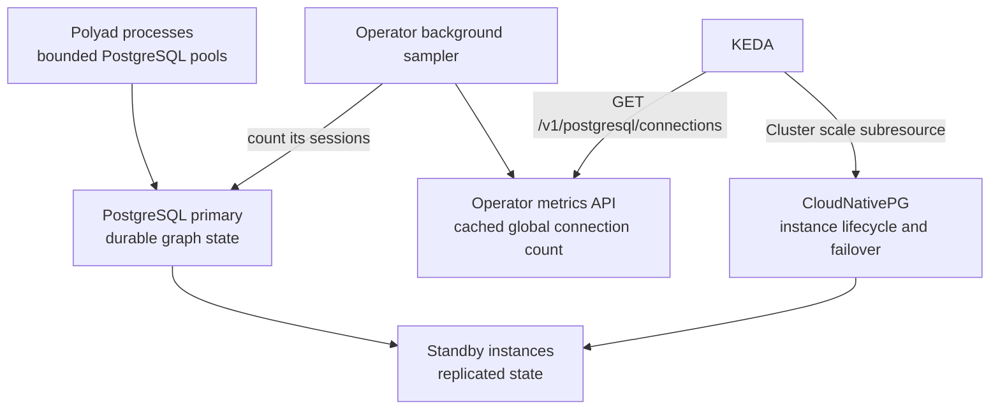

# Optional PostgreSQL state storage

PostgreSQL is **disabled by default**. Dense and distributed deployments both
work without it. Enable `postgresql.enabled` to persist graph state and tracked
parameters in a managed CloudNativePG database or an existing PostgreSQL database.
Dragonfly continues to hold reconciliation queues, event replay, rate limits and
short-lived component observations. KEDA reads the operator's metrics endpoint.

## Table of contents

- [Install the database operator](#install-the-database-operator)
- [Encryption at rest](#encryption-at-rest)
  - [Use an existing encrypted StorageClass](#use-an-existing-encrypted-storageclass)
  - [Provision GKE storage with a KMS key](#provision-gke-storage-with-a-kms-key)
  - [Verify storage and plan migration](#verify-storage-and-plan-migration)
  - [Backups and key lifecycle](#backups-and-key-lifecycle)
- [Encrypt records before writing](#encrypt-records-before-writing)
- [State and tracked parameters](#state-and-tracked-parameters)
- [Shipped SQL artifacts](#shipped-sql-artifacts)
- [Snapshot ordering and recovery](#snapshot-ordering-and-recovery)
- [Scale PostgreSQL with operator connection counts](#scale-postgresql-with-operator-connection-counts)
- [Existing PostgreSQL](#existing-postgresql)
- [Event history and authentication storage](#event-history-and-authentication-storage)

## Install the database operator

Install CloudNativePG before enabling the managed database. Keeping its
infrastructure release separate ensures its CRDs and admission webhooks are ready
before Helm submits a database `Cluster`. It also lets an administrator share an
existing CloudNativePG installation across applications.

```bash
helm repo add cnpg https://cloudnative-pg.github.io/charts
helm upgrade --install cnpg cnpg/cloudnative-pg \
  --version 0.29.0 --namespace cnpg-system --create-namespace \
  --values examples/postgresql/operator-values.yaml --wait
```

The [operator values](../../examples/postgresql/operator-values.yaml) run two
leader-elected database controllers. Database HA is a separate choice:

```yaml
postgresql:
  enabled: true
  ha:
    enabled: false  # one primary; true uses three instances by default
  storage:
    size: 20Gi
metrics:
  enabled: true
```

The Polyad chart creates `<release>-state`, with database and application user
`polyad`, and mounts CloudNativePG's generated `<release>-state-app` Secret.
Its `uri` targets the read/write Service, which follows primary promotion.
Each process uses a bounded pool of at most two connections; disabled storage
opens none. Secret changes trigger the existing credential-replacement health
path so replacement processes load fresh credentials.

With `ha.enabled: true`, the chart configures synchronous replication to one
standby with `dataDurability: required`. Required Pod anti-affinity spreads
instances across distinct values of `ha.topologyKey`, normally worker nodes.
Ensure enough nodes and persistent storage for the maximum configured instance
count. Synchronous commits may wait while no eligible standby is available.
See [CloudNativePG replication](https://cloudnative-pg.io/docs/current/replication/)
and [the official Helm chart](https://cloudnative-pg.io/charts/).

## Encryption at rest

Enable `postgresql.encryptionAtRest` to select encrypted volumes for **all
chart-managed PostgreSQL databases**: graph state and event history, plus the
separately enabled authentication database. Primary and standby instances share
the selection, including instances later added by KEDA. With shared authentication
storage, those records use the state database's volumes.

CloudNativePG delegates at-rest encryption to the storage backend. This chart
keeps data and WAL on each instance's `PGDATA` PVC; selecting an encrypted backend
protects the files on that volume. Database permissions and TLS remain separate
controls. See [CloudNativePG storage encryption](https://cloudnative-pg.io/docs/1.28/storage/#encryption-at-rest).

| Helm field under `postgresql.encryptionAtRest` | Default | Choice |
| --- | --- | --- |
| `enabled` | `false` | Apply one encrypted storage selection to every managed database; existing volumes are not migrated |
| `provider` | `ExistingStorageClass` | Use an administrator-verified encrypted class, or choose `GKE` to create a CSI class with a KMS key reference |
| `storageClass` | Empty | Required existing class name; with GKE, optionally override the generated release-specific name |
| `kmsKeyName` | Empty | GKE symmetric CryptoKey resource name, without a version suffix; empty for an existing class |
| `diskType` | `pd-balanced` | GKE CSI disk type supported by the node machine family and driver |

When enabled, nonempty `postgresql.storage.storageClass` and
`authentication.storage.storageClass` overrides must match the selected class.
A mismatch fails Helm rendering. Leave those overrides empty to use the shared
selection. At least one managed database must be enabled; this setting cannot
provision or verify encryption for a database reached through an external DSN.
In a mixed deployment, only the chart-managed database is affected.

### Use an existing encrypted StorageClass

This works with any compatible CSI backend whose administrator has configured
encryption and key access:

```yaml
postgresql:
  enabled: true
  managed: true
  encryptionAtRest:
    enabled: true
    provider: ExistingStorageClass
    storageClass: encrypted-postgresql
```

The chart references that class; it does not create it, inspect its provider or
certify that its disks are encrypted. Verify the class and backing volumes with
your storage administrator. For distinct classes or keys per database, retain
the ordinary per-database `storageClass` settings and manage both encrypted
classes externally, without enabling the shared selection above.

### Provision GKE storage with a KMS key

Use [values-postgresql-encryption.reference.yaml](../../charts/polyad/values-postgresql-encryption.reference.yaml)
as an overlay on your deployment values. Replace its example key name before
installation. GKE encrypts stored content by default; this option adds control
through a customer-managed key. The regional symmetric KMS key and the
`roles/cloudkms.cryptoKeyEncrypterDecrypter` grant to the cluster project's
**Compute Engine service agent** must already exist. The GKE Persistent Disk CSI
driver must be available, and the key must be in the cluster's region. See
[GKE CMEK prerequisites](https://docs.cloud.google.com/kubernetes-engine/docs/how-to/using-cmek).

```yaml
postgresql:
  enabled: true
  managed: true
  encryptionAtRest:
    enabled: true
    provider: GKE
    storageClass: '' # Generated from the release namespace and name.
    kmsKeyName: projects/key-project/locations/us-central1/keyRings/polyad/cryptoKeys/postgresql
    diskType: pd-balanced
```

The rendered StorageClass uses `pd.csi.storage.gke.io` and the
`disk-encryption-kms-key` parameter. Polyad sets `WaitForFirstConsumer`, permits
volume expansion and uses `reclaimPolicy: Retain`. The class also has
`helm.sh/resource-policy: keep`, matching the database Cluster's retention.
It is not made the cluster default. Its generated name includes the release
namespace to distinguish installations; custom names must be unique cluster-wide.

Only the key's resource identifier appears in the class. The chart does not create
keys, grant cloud IAM, mount key material into operator Pods or put it in Dragonfly.
Helm or Argo CD needs permission to manage a cluster-scoped StorageClass when
`provider: GKE` is selected. The same settings work for an authentication-only
managed database with `postgresql.enabled: false` and
`authentication.storage.enabled: true`, provided named API keys are configured.

### Verify storage and plan migration

After installing release `polyad` in namespace `polyad`, inspect both the Cluster
selection and each actual PVC:

```sh
kubectl -n polyad get clusters.postgresql.cnpg.io \
  -o custom-columns=NAME:.metadata.name,STORAGECLASS:.spec.storage.storageClass
kubectl -n polyad get pvc -l cnpg.io/cluster=polyad-state \
  -o custom-columns=NAME:.metadata.name,STORAGECLASS:.spec.storageClassName,PV:.spec.volumeName
```

Repeat the PVC check for `cnpg.io/cluster=polyad-authentication` when enabled.
For GKE, resolve each PV's `spec.csi.volumeHandle` to its disk and verify the
disk's `diskEncryptionKey.kmsKeyName` with Compute Engine. Verify the existing
volume's actual encryption settings as part of this check.

**Enabling this setting does not encrypt or move existing PVCs.** Plan a
CloudNativePG migration or restore onto newly provisioned encrypted volumes.
Create a new StorageClass for a changed provisioning policy, then migrate or
restore onto volumes provisioned with it. Disabling this chart option
does not decrypt retained disks and may let future instances use other storage.
Check every primary and standby after migration before retiring old volumes.

### Backups and key lifecycle

Backup destinations have their own encryption configuration. Configure and verify
the object-store encryption policy for archived WAL and base backups, and the
snapshot provider's key behavior for volume snapshots. SQL dumps are readable
unless their destination or export process encrypts them. The chart does not
install a backup policy; see [CloudNativePG backup methods](https://cloudnative-pg.io/docs/1.28/backup/).

Retain access to all keys needed for live volumes and retained backups, and test
restores. Key rotation and re-encryption follow the provider's disk/snapshot
lifecycle; changing Helm values or creating a new key version is not proof that
older disks or backups were re-encrypted. See [Compute Engine key rotation](https://docs.cloud.google.com/compute/docs/disks/customer-managed-encryption).

For external PostgreSQL, configure encryption and backups with that database's
provider before supplying its DSN. At-rest encryption does not prevent authorized
database users from reading query results. Kubernetes Secret encryption, node
boot disks, operator logs and application-level record encryption are separate
from the database-volume configuration described here.

## Encrypt records before writing

Enable `postgresql.recordEncryption` to encrypt graph documents, namespace
snapshots, archived event payloads and authentication policies inside the operator
before PostgreSQL receives them. Reference an existing Secret containing an RSA
public key, optionally with its private key. Public-only writers are supported.
This works with managed or external databases, independently of volume encryption.

See [record encryption](record-encryption.md) for the complete configuration,
payload boundaries, decryption examples and rotation procedure, or start with
[the typed reference values](../../charts/polyad/values-postgresql-record-encryption.reference.yaml).

## State and tracked parameters

Every successful complete namespace scan commits these tables in one transaction:

| Table | Stored data |
| --- | --- |
| `polyad_graph_state` | Cluster and namespace identity, kind, name, UID, resource version, graph/group/rule specifications, and observed status including workload signals and structural measurements |
| `polyad_namespace_state` | Complete inventory, hierarchy, workload metrics, replica observations and, for remote scans, queue observations |
| `polyad_state_version` | Schema version used for startup compatibility checks |

`postgresql.scope` separates control planes sharing a database. It defaults to
`<release-namespace>/<release-name>`. Cluster and namespace qualify every row, so
identically named graphs in different clusters remain distinct. Schema creation
is serialized with a PostgreSQL advisory lock. The application user needs DDL
permission in its database to initialize the schema.

## Shipped SQL artifacts

The operator's PostgreSQL code lives in reviewable SQL files shipped in both the
Python wheel and source distribution. Docker images receive the same files when
they install the package; no source checkout or SQL download is needed at runtime.

| Location | Contents |
| --- | --- |
| [`polyad/sql/state`](../../pkg/polyad/sql/state) | State schema, version check, namespace snapshots, graph writes, event retention and connection metrics |
| [`polyad/sql/authentication`](../../pkg/polyad/sql/authentication) | Authentication schema, credential records and lane revocation checks |
| [`polyad/sql/advisory-lock.sql`](../../pkg/polyad/sql/advisory-lock.sql) | Transaction lock used to serialize schema initialization |
| [Chart PostgreSQL files](../../charts/polyad/files/postgresql) | Database and schema access restrictions included in the Helm archive and rendered into CloudNativePG bootstrap settings |

The [SQL resource loader](../../pkg/polyad/sql/__init__.py) reads installed package
resources independently of the working directory. Python binds query values
through psycopg's `%s` parameters; it does not interpolate values into these files.
The chart's `.sql.tpl` artifact substitutes an escaped database identifier at
render time. Initialization still runs automatically when each optional store is
first used, under its existing transaction lock. These files extract the current
schema and queries; they do not introduce a new migration mechanism.

## Snapshot ordering and recovery

Each scan obtains a PostgreSQL timestamp before reading Kubernetes. The
transaction replaces state only if its scan began at least as recently as the
last committed scan. A slower HA replica cannot overwrite a later observation.
Failed or partial scans leave the previous transaction intact. Successful scans
remove rows for resources that no longer exist, including an empty namespace.
The database persists the latest successfully observed **current state**.

For example, inspect persisted graph constraints and workload measurements with:

```sql
SELECT cluster, namespace, kind, name, observed_at,
       document -> 'spec' -> 'rules' AS rules,
       document -> 'status' -> 'structuralRules' AS measurements,
       document -> 'status' -> 'workloads' AS workload_parameters
FROM polyad_graph_state
WHERE scope = 'polyad/polyad' AND kind IN ('Graph', 'PolyGraph', 'ReplicaGroup');
```

Graph intent and tracked status are stored. Embedded Workload, Daemon, Resource
and Composition manifests are not copied into the database because they can
contain credentials or application payloads. Those resources retain their
identity and observed status records. Graph specifications and status fields may
still contain application metadata; database access should match operator access.

Kubernetes remains authoritative for desired resources, admission, ownership and
execution. Database snapshots do not authorize mutations or automatically restore
deleted graphs. Restarting the operator resumes observations from Kubernetes and
updates the existing database. During a database outage, persisted observations
remain at their last successful state, persistence retries, and database scaling
metrics report unavailable. The optional database does not become a prerequisite
for graph execution or bootstrap recovery. Live GraphRules are still recomputed
against Kubernetes before graph scaling actions.

The database Cluster has `helm.sh/resource-policy: keep`: uninstalling Polyad
retains the database. Plan explicit backups and restore procedures using
[CloudNativePG backups](https://cloudnative-pg.io/docs/current/backup/); HA and
PVCs do not provide a historical backup. Keep the database operator running to
manage a retained database.

## Scale PostgreSQL with operator connection counts

Install KEDA, then use [the HA values](../../examples/postgresql/values.yaml):

```bash
helm upgrade --install polyad charts/polyad --namespace polyad --create-namespace \
  --values examples/postgresql/values.yaml
```

Create the referenced `polyad-metrics` bearer-token Secret first, or supply it
through the chart's ESO configuration. The values create a `TriggerAuthentication`
and a `ScaledObject` targeting `postgresql.cnpg.io/v1`, `kind: Cluster`,
`name: polyad-state`. [The standalone manifests](../../examples/postgresql/keda.yaml)
show the concrete configuration if you manage KEDA resources separately; do not
install a second autoscaler for the same Cluster.



The operator tags its PostgreSQL sessions with a scope-specific `application_name`
and periodically counts matching client sessions on the primary. Both active and
idle pooled sessions count, across all Polyad replicas using that state scope.
Administrative and unrelated application sessions are excluded. Counts require
the same application database role for all processes of one control plane.
KEDA never receives database credentials or queries PostgreSQL directly.

`GET /v1/postgresql/connections` returns `{"value": 61, "fresh": true}` for 61
connections. With `connectionsPerInstance: 20` and `metricType: AverageValue`,
the target is approximately `ceil(61 / 20) = 4` instances, subject to HPA
tolerance, stabilization and bounds. The metric is already global: do not sum
copies from multiple operator metrics endpoints. The corresponding Prometheus
series is `polyad_postgresql_connections`, with explicit sample and state
freshness gauges. Disabled, failed or stale samples return HTTP 503.

The minimum is always at least one instance, and at least three when HA is
enabled. Scale-up allows one instance per 120 seconds after a 60-second
stabilization window; scale-down waits 30 minutes and removes at most one per
five minutes. CNPG manages replication and instance removal. The managed Cluster
must expose its scale subresource; the pinned operator chart includes it.
See [CloudNativePG scaling considerations](https://cloudnative-pg.io/docs/1.28/resource_management/)
and [KEDA's Metrics API scaler](https://keda.sh/docs/2.20/scalers/metrics-api/).

**Adding instances adds standby/read capacity, not primary write capacity.**
Polyad's state writer connects to the primary, so increasing replica count does
not relieve a saturated primary or increase its `max_connections`. This optional
policy provisions standby capacity in proportion to operator connection demand.
Tune `maxConnections`, connection pooling and primary CPU/memory for write load;
do not interpret the connection threshold as a write-throughput guarantee.

Helm declares the initial `spec.instances`; KEDA owns subsequent changes through
`/scale`. When using continuously reconciling GitOps, ignore `/spec/instances`
on the database Cluster and `/spec/replicas` on autoscaled ReplicaGroups. An
explicit Helm values change can reassert the configured initial count.

## Existing PostgreSQL

Supply a connection URI or libpq connection string in a Secret:

```yaml
postgresql:
  enabled: true
  managed: false
  existingSecret: polyad-state-access
  secretKey: uri
  scope: management/polyad
```

This creates no database Cluster. Its application role must be able to create
and update Polyad's tables. Configure transport security in the DSN for your
database. With operator NetworkPolicy enabled, supply database egress through
`networkPolicy.extraEgress`. The managed database gets an automatic port-5432
egress allowance.

In root mode, the state store resides with the management deployment. Root
scanners record every registered workload cluster in that same database.
If processes in other clusters need database access, the DSN must use an address
reachable from those clusters; a root-cluster Service DNS name alone is not
cross-cluster routing.

All knobs are listed in the [Helm parameters](../../charts/polyad/README.md), under
“Optional PostgreSQL state storage.” The feature can be combined independently
with [component deployments](components.md) and [root-managed clusters](root-control-plane.md).

## Event history and authentication storage

`postgresql.events.enabled` (default true when state storage is enabled) archives
approved public observation and topology payloads in `polyad_event_history` before
live delivery. Records are deduplicated and retain graph identity, verified ancestry,
tracked status and throughput decisions. Workload manifests and bearer tokens are
excluded. `postgresql.events.retentionDays` defaults to 30; each archive write
prunes up to 1,000 expired rows. Idle databases require administrator retention
maintenance if exact-time deletion is required. The archive retains the public
observations emitted by Polyad. Kubernetes audit logging records API operations;
Dragonfly provides bounded live SSE replay. An unavailable archive defers
publication until reconciliation retries; it does not undo graph mutations.

`postgresql.database` and `postgresql.username` choose the managed state database
and its application owner. Existing deployments should treat bootstrap names as
installation-time choices. PVC sizes and classes are configured under
`postgresql.storage`.

Named API keys may independently enable
[`authentication.storage`](../operations/api-keys.md#optional-authentication-database). By default
this provisions a separate CloudNativePG Cluster, database `polyad-authentication`
and owner `polyad_authentication`. It has its own PVC size and storage class.
Only that application login receives database/schema privileges; PostgreSQL
administrators necessarily retain administrative access. Set
`separateDatabase: false` to share the state database and role, or select an
external authentication DSN Secret with `managed: false`. These databases remain
optional. Separate authentication clusters use the PostgreSQL HA instance settings
but are not targeted by the state database's connection-count ScaledObject.
