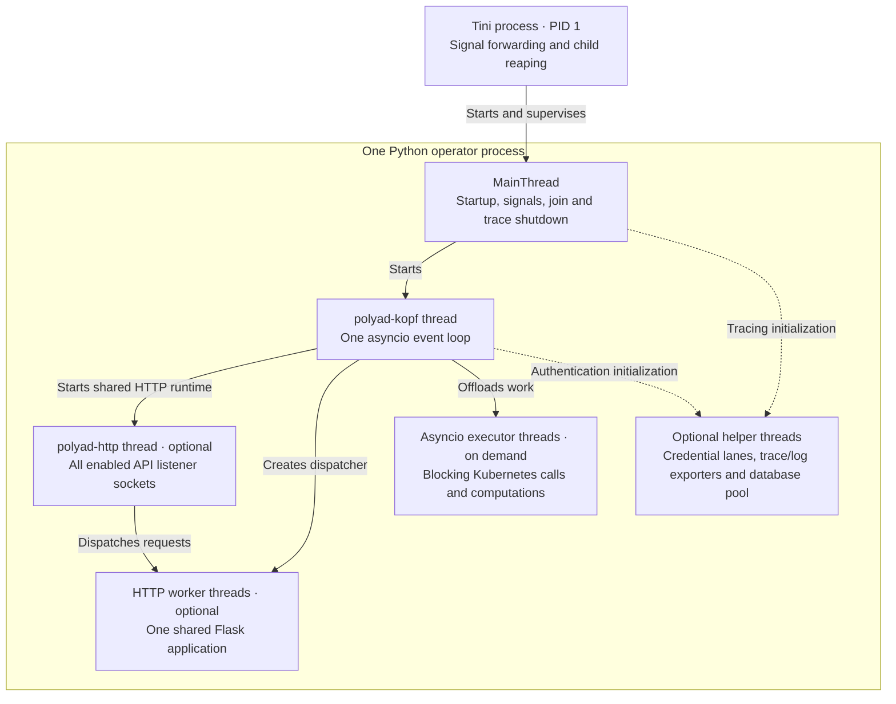
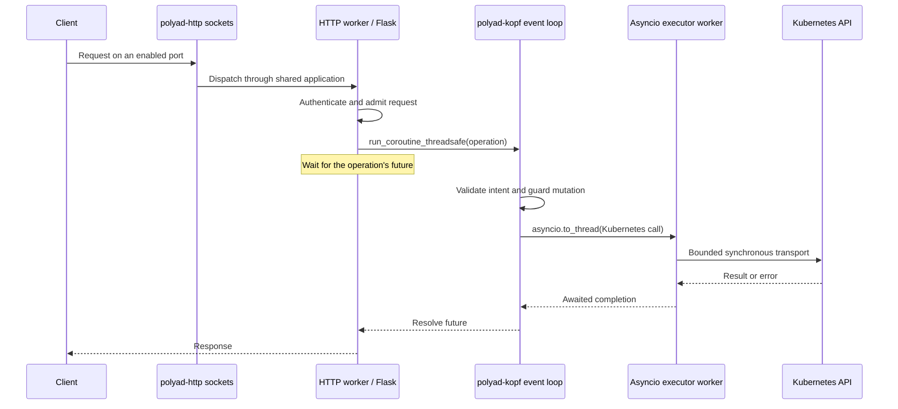
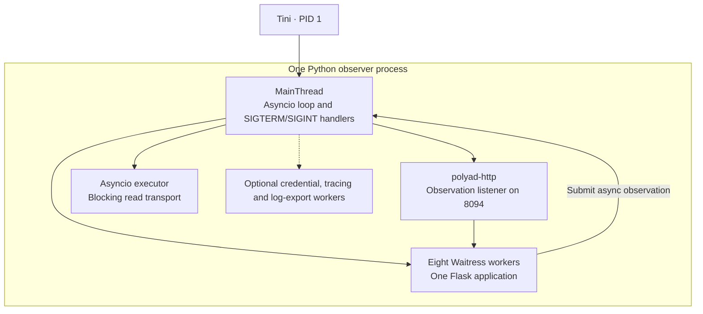

# Operator processes, threads and async tasks

<!-- toc:start -->
**Table of contents**

- [Container and thread hierarchy](#container-and-thread-hierarchy)
- [API module organization](#api-module-organization)
- [Tasks on the operator event loop](#tasks-on-the-operator-event-loop)
- [How an HTTP request reaches Kubernetes](#how-an-http-request-reaches-kubernetes)
- [Deployment roles and remote workers](#deployment-roles-and-remote-workers)
- [Observer process](#observer-process)
- [Signals and shutdown](#signals-and-shutdown)
- [Source map and diagnostics](#source-map-and-diagnostics)
<!-- toc:end -->

Each Polyad operator container runs **Tini as PID 1 and one Python process**.
Within Python, the main thread owns process signals, `polyad-kopf` runs the
operator's asyncio event loop, and optional HTTP workers share one Flask
application. Graphs, shards and Kubernetes workloads do not each get a Python
process or thread inside the operator.

Kopf's health listener binds only to the Pod IP supplied through the Downward API.
The [Pod context guide](pod-context.md) lists node and resource variables and the
short-lived probe command used for readiness and administrator diagnostics.

## Container and thread hierarchy

The standard container command is
`/usr/bin/tini -- python -m polyad.operator.runtime`. Tini and Python both run
as UID/GID `65532`. Tini forwards signals and reaps orphaned processes; Python
owns the operator lifecycle. See [container profiles](containers.md).

The arrows inside Python describe ownership and dispatch, not additional OS
processes. Threads share the Python process's memory.

| Thread or pool | Responsibility and lifetime |
| --- | --- |
| `MainThread` | Parses configuration, initializes logging/tracing, installs signal handlers, starts and joins `OperatorThread` |
| `polyad-kopf` | Non-daemon thread running `asyncio.run(...)` around embedded `kopf.operator`; owns async clients, queues and tasks |
| `polyad-http` | One non-daemon serving thread owning all enabled API listeners; Waitress by default, or a Hypercorn asyncio loop for WebSockets |
| HTTP worker pool | Synchronous Flask request handling, including streaming responses; shared by all API families |
| Asyncio default executor | Workers created on demand by `asyncio.to_thread`, including synchronous Kubernetes transport, graph rule/Cheeger computations, credential-file reads and metrics serialization |
| Kopf callback executor | Framework-managed execution of synchronous callbacks, including Polyad's health probe; async handlers stay on the event loop |
| `polyad-credential-lanes` | Optional daemon thread renewing named API-key concurrency permits; the shared HTTP `Access` runtime owns one renewer |
| OpenTelemetry batch workers | One optional SDK worker per enabled signal (traces and logs), initialized before operator work and drained afterward |
| Authentication database pool workers | Optional library-managed threads for the synchronous PostgreSQL credential store |

The state database uses an async pool; its maintenance work belongs to the event
loop. Dependency libraries can create additional workers, so the table is not a
fixed total thread count. Polyad does not configure a process pool or fork a
worker per request. Executor threads keep blocking work off the event loop;
their presence does not promise parallel execution of all Python computations.

HTTP worker capacity is `S + 8`, where `S` is `events.maxConnections` when event
serving is enabled and zero otherwise. Thus the default event limit of 16 gives
24 HTTP workers; without events there are eight. At most `S` event streams can
occupy these workers, leaving capacity for ordinary requests. All listeners use
this same pool. With `events.websockets.enabled: true`, Hypercorn replaces
Waitress across all listeners in this process. Its transport loop runs inside
`polyad-http` and uses one bounded executor for the existing Flask application;
Kopf retains its own operator loop. SSE and WebSockets share the same `S` slots,
credentials and replay store. There is no second Flask application or additional
events listener. Disabled WebSocket support leaves Hypercorn unloaded.

| Port | Endpoint family |
| --- | --- |
| 8090 | Composition, activation and application throughput intake |
| 8091 | Topology reads and event subscriptions |
| 8092 | Cached metrics and scalar autoscaling observations |
| 8093 | Temporary connections |
| 8094 | Read-only observations, in the separate observer process described below |

Kopf's health listener on 8080 is a separate **aiohttp listener task on the Kopf
event loop**. It does not create another Flask application or Python process.
Optional mesh proxies and database/cache servers run in their own containers;
they are outside this Python hierarchy.

## API module organization

HTTP code lives under [`polyad/api`](../../pkg/polyad/api), grouped by responsibility:

| Subpackage | Responsibility |
| --- | --- |
| `http` | Shared Flask application, blueprint registration, server lifecycle, HTTP/WebSocket transports, errors and request limits |
| `composition` | Composition submission, receipts, audit lookup and the composition API's OpenAPI contract |
| `workloads` | Activation submission/status/stop and application throughput reports; registered on the composition blueprint |
| `connections` | Temporary connection requests, consent, cross-cluster negotiation and connection state |
| `observations` | Read-only graph snapshots served by optional observer processes |
| `events` | Discovery, topology reads and SSE/WebSocket subscription routes |
| `metrics` | Prometheus and scalar autoscaling routes |

The event stores remain in `polyad.events`; measurement collection remains in
`polyad.metrics`. Their HTTP builders register routes on the application passed
by `polyad.api.http.server.APIServer`. Imports for optional endpoint families
stay inside the corresponding runtime setup methods.

Each operator process creates at most **one Flask application and one serving
thread**, regardless of the number of enabled endpoint families. Each observer
process follows the same rule. Separate Kubernetes Services and ports retain
family-specific authentication and network policies; they do not start separate
servers. Startup refuses a second start, and duplicate blueprint registration
fails. Standalone builder calls can still create an application for embedding
or tests; operator startup always supplies its shared application.

Public imports remain available from `polyad.api` (`APIBuilder`, `create_app`,
`RateLimitPolicy`), `polyad.events` (`EventAPIBuilder`, `EventStore`) and
`polyad.metrics` (`MetricsAPIBuilder`). They load HTTP dependencies only when
requested.

## Tasks on the operator event loop

An async task is a coroutine scheduled on the event loop.
Tasks can make progress while other tasks await I/O, but blocking the loop delays
every task on it. Startup registers these tasks according to the process role:

| Task | When active | Purpose |
| --- | --- | --- |
| Kopf framework tasks | Every operator runtime | Kubernetes watches, callback dispatch, startup/cleanup and health serving |
| `RefreshQueue.run` | Every operator runtime; used by executing roles | Supervisor for bounded local reconciliation workers, coalescing waiting keys and deferring same-key follow-ups |
| `ValidationQueue.run` | While a Kubernetes adapter has pending writes | One producer scheduling bounded validation workers over pending candidates; stops and joins reads when drained |
| `coordination_loop` | Every operator runtime | Maintain ownership or observe membership, and check API/cache connectivity |
| `backlog_loop` | Every operator runtime | Sample local shared stream sizes |
| `component_loop` | Every operator runtime | Publish process HTTP demand and, where applicable, worker reports to root storage |
| `watch_credentials` | Every operator runtime | Detect changed mounted credentials and request process replacement |
| `rescan_loop` | Dense, bootstrap and telemetry roles | Refresh local inventory and recover missed notifications |
| `consume_loop` | Dense, bootstrap and executor roles | Read leased streams in bounded batches and await refreshed reconciliation before acknowledgement |
| `metrics_loop` | Metrics-serving roles | Collect observations and publish immutable HTTP snapshots |
| `connection_sweep_loop` | Temporary-connection serving enabled | Rediscover TTL receipts for cleanup through normal reconciliation |
| Remote scan/consume tasks | Root mode, according to role | One scan task and/or one consume task per registered remote cluster |
| Root pool manager | Executing roles in root mode | Reconcile remote execution pools and remote scale requests |
| Dragonfly scaling task | Bundled HA pool configured on a planner-capable process | Reconcile cache scaling under its lease |

There are 32 logical coordination shards, **not 32 worker threads**. By default,
one local worker reconciles at a time. `operator.writeQueue.reconciliationWorkers`
allows separate families to prepare decisions concurrently. Remote consumers use
the same per-cluster limit. Same-key follow-ups and graph-family leases remain
serialized. Increasing replicas distributes eligible duties; it does not split a
single graph family into independent ownership boundaries.

Each API adapter has a bounded dependency graph and `maxInFlight` writer slots.
`operator.writeQueue.plannerParallelism` caps callbacks in each mutation batch;
callers may request a smaller batch, and dependency checks can reduce it further.
Only independent operations approved in the same mutation-planner batch can use
multiple slots; unknown effects retain ordering. `validationWorkers` separately
bounds candidate checks, including checks requested directly by dispatchers.
These are Python runtime controls projected by Helm into environment variables.
See [work-graph configuration](../development/write-pipeline.md#configuration)
for all limits, their scope, and how root-managed and Helm-installed workers
receive them. They bound concurrent async work on the existing event loop.

Before dispatch, each adapter also compares
[pending changes to the same object](../development/mutations.md#queued-kubernetes-write-conflicts).
Identical writes with identical dependency contracts share an entry; conflicting
candidates return for fresh reconciliation. The
[validation producer](../development/write-pipeline.md#validation-producer-and-dispatcher)
checks dependencies and original target fences ahead of dispatch. The dispatcher
can reuse a fresh receipt; watches, relevant writes and expiry invalidate it.
Ownership is always checked before transport. Ordinary reads bypass write admission; these
checks run on the same event loop and add no OS thread or queue service.

Task pauses are described in [performance tuning](../operations/performance.md).
Their settings do not change the number of HTTP workers or asyncio executor
workers. PostgreSQL persistence, topology observations and throughput adaptation
run as parts of these tasks and request operations within the process.

## How an HTTP request reaches Kubernetes

`APIServer.invoke` admits at most 32 retained operations and 128 cancellable
read operations per process. These semaphores are admission budgets, not thread
counts or extra servers. Per-key rate/concurrency limits apply separately. A
request that times out while a write is uncertain can retain its operation and
permit until completion; client timeout does not undo the write. Cancelling a
Kubernetes `to_thread` operation cannot stop the underlying HTTP call, so the
adapter joins that transport before releasing mutation ownership.

Cached `/metrics` and `/v1/metrics` responses read published bytes directly from
the HTTP worker. Measurement collection does not execute on the scrape path;
named-key authentication can still contact its configured shared admission stores.
SSE and WebSocket subscriptions retain an HTTP worker and repeatedly bridge reads into the
async event store. OpenTelemetry context follows the request bridge in-process;
queued background reconciliation starts a separate trace.

Optional [event rebalancing](../operations/event-rebalancing.md) adds one async
membership poller on the existing operator loop. HTTP workers consult a bounded
thread-safe schedule to emit copulses. The chart's preStop command briefly starts
a Python process in the same container to signal draining and wait before
SIGTERM; it starts no HTTP listener. Client subscriptions reconnect on the
application's chosen thread.

## Deployment roles and remote workers

| Deployment | Runtime responsibilities |
| --- | --- |
| Singular / dense | One operator Pod with the full runtime; HTTP families are optional |
| HA / dense | Multiple independent copies of that process/thread hierarchy, coordinated through shared storage and leases |
| Split bootstrap | Operator runtime for planning and recovery of the reserved component graph; no public API families |
| Split executor | Operator runtime for graph reconciliation; no public API families |
| Split gateway | Operator runtime with enabled composition, connection and event APIs; does not execute graph mutation leases |
| Split telemetry | Operator runtime for inventory and metrics serving; does not execute graph mutation leases |
| Root-managed execution pool | Separate remote Pods running the executor role against root coordination; each has its own Tini and Python process |
| Helm-installed downstream worker | The same executor process, gated by its root attachment; health only, with no independent planner or application API servers |

Gateway intake can persist validated requests even though it does not execute
graph reconciliation. All operator roles still use the Python main thread and
Kopf thread; choosing a role enables responsibilities within that runtime.

A root operator maintains one reserved PolyGraph containing its own group Graph
and each remote operator group's Graph. Deployment groups observe their existing
controllers; DaemonSet groups own their controller. Those remote Python processes are **not
OS child processes of the root operator**. Kubernetes ownership and network
coordination connect them. Deployment pools scale by replicas; DaemonSet pools
follow eligible nodes. [Helm-installed workers](helm-workers.md) use the same
runtime while retaining administrator ownership of their Deployment and optional
local replica scaling. See [root control plane](root-control-plane.md) and
[component deployments](components.md).

## Observer process

The observer uses `python -m polyad.operator.observer` under Tini. It does not
import the operator handlers or start Kopf. Its asyncio loop runs on the main
thread instead:

There is no local reconciliation FIFO, shard coordination loop or Kopf health
listener in this process. Requests use the same bounded HTTP bridge and optional
authentication/tracing support. Observer shutdown waits for HTTP work before
closing the Kubernetes client and enabled telemetry exporters.

## Signals and shutdown

For an operator process, Tini forwards SIGTERM/SIGINT to Python's main thread.
The handler marks the process draining and sets the thread-safe Kopf stop event.
Cleanup then runs on the Kopf event loop:

1. Stop new HTTP intake, join the serving thread, and await retained operations.
   Waitress shuts down its dispatcher, or Hypercorn drains its listeners and joins
   its worker pool. Both use a 35-second serving grace period. Remaining work
   follows the shutdown steps below.
2. Close HTTP-owned clients, request-limit storage and credential lanes.
3. Cancel the local FIFO consumer and its waiters. Pending desired state is
   recovered from shared notifications and fresh scans after restart.
4. Cancel and join background tasks, then close remote/event/cache/state clients.
   In-flight Kubernetes transports retain their acknowledgement discipline.
5. Let `asyncio.run` finish loop/executor teardown, join `polyad-kopf` from the main
   thread, and shut down the trace provider. Python exits; Tini exits with its
   child's status.

`SIGHUP` is different: it marks the operator for replacement, makes
health checks fail, and stops accepting new work without immediately setting the
Kopf stop event. Kubernetes then restarts it through the configured probes. A
standalone process needs its supervisor to complete that replacement. The
observer only installs graceful SIGTERM/SIGINT handlers; it does not implement
this operator replacement path.

The Pod's termination grace period is the outer shutdown budget. If it expires,
Kubernetes can forcibly stop unfinished work. Normal process shutdown leaves
deployed workloads running; resource deletion follows graph lifecycle rules.

## Source map and diagnostics

The [operator package layout](../development/operator-layout.md) groups modules
by responsibility and describes their import and feature-enablement boundaries.

| Source | Responsibility |
| --- | --- |
| [runtime.py](../../pkg/polyad/operator/runtime.py) | Main-thread signals and the owned Kopf thread |
| [handlers.py](../../pkg/polyad/operator/lifecycle/handlers.py) | Task startup, health and cleanup |
| [queue.py](../../pkg/polyad/operator/coordination/queue.py) | Local FIFO reconciliation |
| [write_queue.py](../../pkg/polyad/operator/coordination/write_queue.py) | Pending Kubernetes intent conflicts within each API adapter |
| [contracts.py](../../pkg/polyad/operator/coordination/contracts.py) / [validation.py](../../pkg/polyad/operator/coordination/validation.py) | Captured dependency hashes, targeted refresh and bounded validation ahead of dispatch |
| [server.py](../../pkg/polyad/api/http/server.py) | Shared Flask/HTTP lifecycle and thread-to-loop bridge |
| [kubernetes.py](../../pkg/polyad/operator/adapters/kubernetes.py) | Kubernetes transport offloading and write fences |
| [roles.py](../../pkg/polyad/operator/lifecycle/roles.py) / [root.py](../../pkg/polyad/operator/clusters/root.py) | Role selection and remote cluster tasks |
| [observer.py](../../pkg/polyad/operator/observer.py) | Observer's main-thread event loop |
| [lanes.py](../../pkg/polyad/auth/lanes.py) / [tracing.py](../../pkg/polyad/operator/observability/tracing.py) / [logging.py](../../pkg/polyad/operator/observability/logging.py) | Optional renewal, trace-export and log-export workers |

[Debug logging](operator.md#debug-logging) includes thread names. Use
[queue and write metrics](../operations/metrics.md) to distinguish waiting work
from in-flight transport, and [traces](../operations/tracing.md) to inspect request
and reconciliation spans. The health probe checks the queue task, registered
background tasks and shared HTTP thread; a dead required task fails health even
if other threads remain alive.
