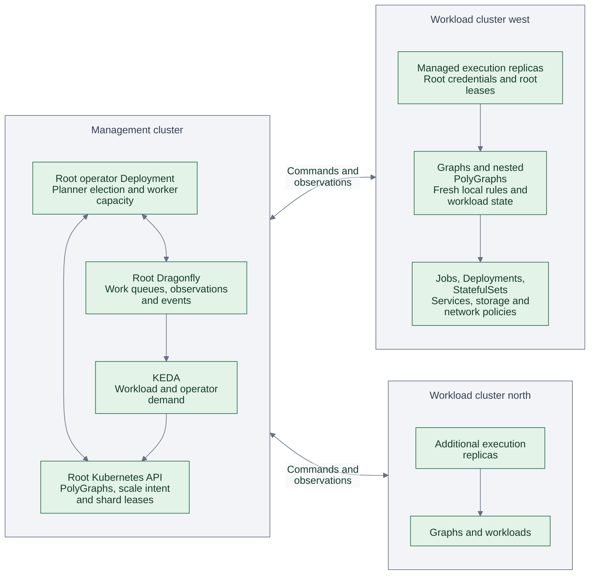
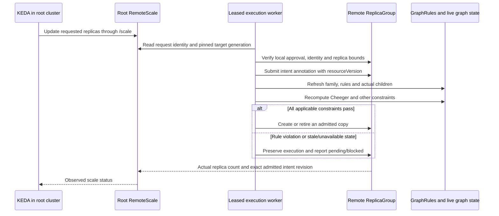
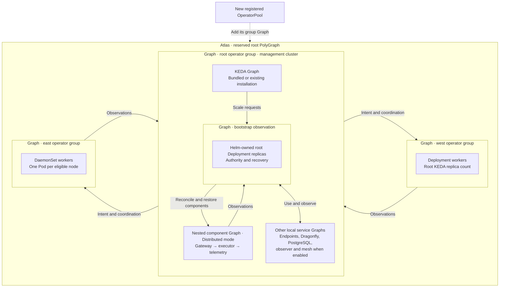
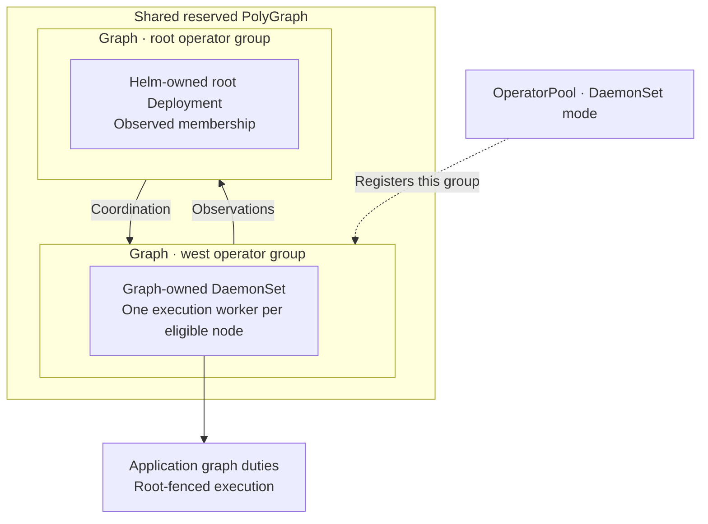

# Root control plane

The root can use the default dense Deployment or the
[distributed component Graph](components.md), keeping bootstrap authority in the
management cluster. [Optional PostgreSQL](postgresql.md) persists observations
from every registered cluster; metrics and KEDA continue to use the root operator
endpoints. Remote OperatorPools run the executor role in either deployment layout.

Select the [HA profile](deployment-profiles.md) and enable
`rootControlPlane.enabled` to run one logical operator across registered
clusters. Its Deployment can live in a dedicated management cluster containing
no application Pods. Remote `OperatorPool` Deployments add execution capacity;
they share the root's queues and leases and cannot elect their own planner.
The root installs and upgrades these workers by default, including their Polyad
CRDs and projected credentials. Administrators can instead
[install workers with Helm](helm-workers.md) and choose root or local scaling
while retaining lifecycle ownership. This is optional; an ordinary single-cluster install
continues to work without remote credentials.

All graph observations, topology events, queue demand and scaling intent converge
at the root. Application payloads travel over the graphs' configured networking;
they do not pass through the operator. Read-only observers remain optional readers,
separate from these execution workers.

The [graph rollout and rotation proposal](../proposals/rotations.md) describes how the root
could coordinate versioned changes in either direction through this hierarchy,
with breadth-first waves or depth-first branches. Ordered rollout requests and
their graph policy bindings are proposed extensions, not current root behavior.

## Table of contents

- [Authority and execution](#authority-and-execution)
- [Install and register clusters](#install-and-register-clusters)
- [Configuration](#configuration)
- [KEDA from the root](#keda-from-the-root)
- [Reports, disconnection and deletion](#reports-disconnection-and-deletion)
- [Reserved operator hierarchy](#reserved-operator-hierarchy)
- [Reserved graphs for node workers](#reserved-graphs-for-node-workers)

## Authority and execution



Workers can reconcile any registered cluster. A pool's `spec.cluster` chooses
where its operator Pods run; it does not assign that cluster's graphs exclusively
to those Pods. The root Deployment also executes duties, so reducing every remote
pool to zero leaves a working controller. There are 32 shared logical shards
across the entire control plane. A graph family remains serialized; extra replicas
help independent families, with useful concurrency capped by shard count and API
capacity. Every replica currently rescans registered namespaces, so monitor API
read load as well as queued writes when choosing replica counts.

Graph intent and native workload state remain authoritative in their destination
Kubernetes API. The root holds the cluster registry, coordination, queues, cached
reports and management intent. It refreshes remote state before acting. Equal
namespace, graph and replica names in different clusters have separate queues,
shard identities and observation streams.

## Install and register clusters

The runnable configuration lives in
[`examples/root-control-plane`](../../examples/root-control-plane/values.yaml):

1. Apply [`access.yaml`](../../examples/root-control-plane/access.yaml) in each
   workload cluster. This establishes the namespace and bootstrap identity.
   Prepare administrator-managed, embedded kubeconfigs with verified HTTPS for
   that identity; use short-lived credentials and your existing rotation process.
2. In the management namespace, create `west-access` with key `config`,
   containing that remote kubeconfig. Create `root-access` with key `config`,
   containing a root kubeconfig with the permissions of the chart's operator Role.
   Its Kubernetes API address must be reachable from remote worker Pods.
3. Provide `root-cache` with key `url`: a credentialed Dragonfly URL reachable
   from the root and every remote worker. Use the same endpoint for all replicas,
   with TLS when crossing untrusted networks. The root chart requires an existing
   Secret containing the shared, reachable cache address.
4. Supply the endpoint credentials named in
   [`values.yaml`](../../examples/root-control-plane/values.yaml), or use the chart's
   existing [ESO configuration](../operations/authentication.md). Replace `polyad.example.com`
   with reachable root API routes. Configure firewalls and NetworkPolicies for
   the root cache and every registered Kubernetes API.
5. Install the chart in the root cluster. The example's `rootControlPlane.pools`
   declares `west-workers` **in the root namespace**; the root installs its
   execution replicas in the registered workload cluster:

```bash
helm upgrade --install polyad charts/polyad \
  --kube-context management --namespace polyad --create-namespace \
  --values examples/root-control-plane/values.yaml
```

Once the pool has installed the remote CRDs, apply the reusable definitions and
then the root application:

```bash
kubectl --context west apply -f examples/root-control-plane/workloads.yaml
kubectl --context management apply -f examples/root-control-plane/application.yaml
```

[`application.yaml`](../../examples/root-control-plane/application.yaml) is a root
PolyGraph that creates a Graph from the remote `services` definition. Its Daemon
replicas run entirely in the workload cluster. The `consumers` definition is the
UID-pinned KEDA target used below.

The root creates the remote worker Deployment, copies its required credential
Secrets and installs/upgrades the image's bundled Polyad CRDs. Remote workers
use an explicit root kubeconfig and do not mount a local ServiceAccount token.
Only root Deployment processes participate in planner election. Workers are
trusted components with control-plane credentials, not workload-facing agents.
Changes to the root image, managed Pod settings or credential Secret versions
roll the workers automatically. Use immutable image tags: planner assignments
exclude workers running an older image, and older workers cannot apply their
CRD bundle over the desired version. Root and remote namespaces must already exist;
namespace ownership stays with administrators.

The root does not install Istio, KEDA, ESO, Reloader, CSI drivers or application
source definitions into workload clusters. Install the optional dependencies
needed by those workloads and place their reusable definitions in each registered
namespace. The root owns execution of the resulting Graph instances. Install KEDA
in the root cluster separately or enable the chart's
[optional KEDA dependency](local-services.md#install-keda-with-the-chart);
do not run independent Polyad operators or
competing local autoscalers for the same managed graph families.

`federation.clusters` remains the bounded cluster registry (up to 32 remote
clusters, one namespace per registration). Keep registrations and credentials
until their remote graphs and operator pools have drained. Nested PolyGraphs use
this same root registry, so every additional destination is registered at the root.

## Configuration

| Field | Meaning |
| --- | --- |
| `rootControlPlane.enabled` | Opt in to central reconciliation, reports and worker management; default `false`. Requires the HA profile, federation and metrics. |
| `rootControlPlane.pools` | Optional Helm-owned OperatorPool declarations with name, cluster, replicas and placement/resource overrides, or `existingDeployment` and `scalingAuthority` for attachments. Empty when pools are managed separately. Requires the HA profile and root mode. |
| `rootControlPlane.kubeconfigSecret` | Root namespace Secret holding root credentials under `config`; required in root mode. |
| `rootControlPlane.endpoints.api` | Reachable root composition URL advertised to workloads. |
| `rootControlPlane.endpoints.events` | Reachable root events URL advertised to workloads. |
| `rootControlPlane.endpoints.metrics` | Reachable root metrics URL advertised to workloads. |
| `rootControlPlane.meshPeers` | Complete registry of workload-cluster mesh peers using the [existing peer fields](multicluster.md#remote-traffic-rules). Each controller excludes its own execution cluster. |
| `OperatorPool.spec.cluster` | Immutable registered cluster in which worker Pods run. |
| `OperatorPool.spec.replicas` | Requested worker count, 0–32; exposed through `/scale`. Unused for desired capacity with Local scaling, which rejects changes to this field. |
| `OperatorPool.spec.existingDeployment` | Optional immutable name of a [Helm-installed worker](helm-workers.md) in the registered namespace; root observes its Graph and never overwrites its template or deletes the Deployment. |
| `OperatorPool.spec.scalingAuthority` | `Root` (default) permits admitted replica changes. `Local` requires `existingDeployment` and leaves replicas to its administrator. Must match the downstream Helm grant. |
| `OperatorPool.spec.resources` | Optional native container requests and limits, overriding the root container's resources. |
| `OperatorPool.spec.nodeSelector` | Optional native node selector, overriding root Pod placement. |
| `OperatorPool.spec.tolerations` | Optional native tolerations, overriding root Pod placement. |
| `RemoteScale.spec.cluster` | Immutable registered destination. |
| `RemoteScale.spec.target` | Immutable ReplicaGroup `{name, uid, generation}` in the destination's registered namespace. Local spec edits invalidate this approval generation. |
| `RemoteScale.spec.replicas` | Requested graph replica count, 0–256; additionally bounded by the target ReplicaGroup. |
| Destination `ReplicaGroup.spec.remoteScaling` | Optional `{root, namespace, name, uid}` identifying the one locally approved RemoteScale. Omit to disable remote scaling. |

Mesh peer registration describes application traffic. Install the
[Istio transport](multicluster.md#mesh-prerequisites) separately in participating
workload clusters. Worker Pods use Kubernetes HTTPS and the root cache; they opt
out of automatic sidecar injection. Workload mesh, capacity and ESO restart
settings currently share the root's configuration, so participating clusters must
supply compatible controllers and namespace-level dependencies.

## KEDA from the root

KEDA can target custom resources that expose Kubernetes `/scale`.
[Official KEDA scaling documentation](https://keda.sh/docs/2.20/concepts/scaling-deployments/)

| What changes | KEDA target in the root cluster | What the root changes |
| --- | --- | --- |
| Root operator capacity | Root Deployment | Native Deployment replicas; the [connection-pressure option](../operations/performance.md#connection-pools-and-keda) combines KEDA, CPU and memory on one HPA. Disable the chart operator HPA for separately supplied KEDA scalers. |
| Remote execution capacity | `OperatorPool` | The pool's remote Deployment, preserving root coordination and draining leases. |
| Remote application topology | `RemoteScale` | An approved intent for a remote ReplicaGroup; the destination's normal rule admission creates or retires copies. Local `spec.replicas` remains the fallback. |
| Root-local graph topology | `ReplicaGroup` | Existing graph-family admission and reconciliation. |

Use [`keda.yaml`](../../examples/root-control-plane/keda.yaml) to scale the example
worker pool from root-held backlog metrics. Install/configure Prometheus scraping
and authentication separately. Shared queue counts must be deduplicated across
root replicas before summing. Keep `ignoreNullValues: "false"`; missing or stale
reports must not become zero demand. Coordinate the pools' maximum counts with
the root's count: more than 32 workers cannot increase shard concurrency.

To scale remote application workloads, create a request pinned to the destination
generation that will contain its approval. Then, as the destination administrator,
approve that exact request UID. Until approval, the request is blocked. This example
assumes the ReplicaGroup already exists and does not inherit another group's count:

```bash
read -r TARGET_UID TARGET_GENERATION TARGET_VERSION <<< "$(kubectl --context west -n workloads get replicagroup consumers -o jsonpath='{.metadata.uid}{" "}{.metadata.generation}{" "}{.metadata.resourceVersion}')"
APPROVED_GENERATION=$((TARGET_GENERATION + 1))
cat <<EOF | kubectl --context management apply -f -
apiVersion: polyad.astrivant.com/v1alpha1
kind: RemoteScale
metadata:
  name: west-consumers
  namespace: polyad
spec:
  cluster: west
  target:
    name: consumers
    uid: ${TARGET_UID}
    generation: ${APPROVED_GENERATION}
  replicas: 2
EOF
REQUEST_UID=$(kubectl --context management -n polyad get remotescale west-consumers -o jsonpath='{.metadata.uid}')
kubectl --context west -n workloads patch replicagroup consumers --type=merge -p "{
  \"metadata\": {\"resourceVersion\": \"${TARGET_VERSION}\"},
  \"spec\": {\"remoteScaling\": {
    \"root\": \"management\", \"namespace\": \"polyad\",
    \"name\": \"west-consumers\", \"uid\": \"${REQUEST_UID}\"
  }}
}"
```

`root` must match the root's configured federation cluster name. The versioned
approval patch fails if the destination changed while the request was being
created; recreate the request against fresh state instead of advancing its pinned
generation automatically. The approval patch itself increments the generation once.

Then use this `scaleTargetRef` in the existing
[workload ScaledObject example](../graphs/replication.md#connect-keda), in namespace `polyad`:

```yaml
scaleTargetRef:
  apiVersion: polyad.astrivant.com/v1alpha1
  kind: RemoteScale
  name: west-consumers
```

For root-provided workload metrics, add `?cluster=west` to the selected root metrics
URL, for example `/v1/workloads/ReplicaGroup/consumers/replicas?cluster=west`.
Choose a demand signal appropriate to the application and track replica count
as the resulting capacity setting. External KEDA scalers can also supply
demand. Remote targets have no root-local Pods, so use external metrics with
`metricType: AverageValue`, not root-cluster CPU or memory Pod metrics. Their
scale status supplies a unique, nonempty root-local selector as required by
[the Kubernetes HPA controller](https://github.com/kubernetes/kubernetes/blob/master/pkg/controller/podautoscaler/horizontal.go);
that selector does not represent remote Pods. Match KEDA's bounds to the remote group's
bounds and avoid attaching another scaler to that group or its native workloads.



The target UID, approved generation and cluster are immutable. RemoteScale never
patches the destination's `spec.replicas` or its approval. The destination resolves
the approved annotation into an effective count and applies its own GraphRules,
Cheeger bounds and execution checks. Reusable groups can distribute that effective
count to their inheriting instances. A generated group must set
`inheritReplicas: false` to receive its own independent remote request.

Competing requests are distinguished by **root cluster, namespace, name and UID**.
Only the exact identity in the local `remoteScaling` grant may submit intent.
Other requests are blocked without blocking the approved request. There is no
arrival-order election or automatic failover between requests; changing the
approved owner is a destination administrator's decision. These identities
supplement Kubernetes credentials and RBAC; they are not authentication tokens.

Any local ReplicaGroup **spec edit**, including a local `/scale` update, advances
its generation and invalidates the old remote intent. The destination resumes
its local declared count, subject to normal admission and graceful retirement.
KEDA updates to the old RemoteScale remain blocked. To resume remote control,
create a new generation-pinned request and explicitly approve its new identity.
Removing `spec.remoteScaling` also revokes approval. Metadata-only edits do not
revoke it, nor does writing a replica value already stored in the local spec:
remove the grant when returning to that unchanged fallback count. RemoteScale cannot target the root's own cluster, reserved operator
graphs, or targets whose ancestry cannot be verified.

Removing a RemoteScale stops forwarding new requests and retains its last
approved intent; it does not delete workloads or force a scale-down on root
connectivity loss. Revoke the destination grant to return to its local count.
Root status and workload metrics stay pending/stale until the destination has
observed the exact current intent revision; a prior successful count cannot
acknowledge a newer request.

Cheeger and other structural rules still apply at their declared graph boundaries.
Central authority does not turn cluster-local rules into a flattened, atomic
cross-cluster rule transaction. Every execution mutation reuses the
[fresh-state admission path](../graphs/replication.md#constraints-before-scaling).
Operator replicas are scheduler capacity, not vertices in application graphs;
scaling a worker pool does not change a graph's Cheeger constant.

## Reports, disconnection and deletion

Root `/v1/metrics` includes `clusters` and `workers` maps. Worker reports carry
shard ownership and API write pressure, with 15-second expiry. Root Prometheus
metrics also expose `polyad_worker_sample_fresh` and `polyad_worker_writes_queued`. Root Prometheus metrics include
`polyad_cluster_inventory_sample_fresh`, `polyad_cluster_inbound_updates` and,
with graph labels enabled, `polyad_cluster_workload_signal`. Names are qualified
by cluster. Incomplete scans and expired reports are unavailable, never zero.
Remote reports expire from the shared cache after at most 15 seconds; workload
signals also retain their existing generation and observation-age checks.

Root events and topology routes accept `?cluster=west`. The Python client exposes
`Client.topology(..., cluster="west")` and `Client.events(cluster="west")`.
Keep cursors per cluster stream. Workloads receive `POLYAD_CLUSTER_NAME` along
with their existing graph identity. Composition intake remains rooted in the
management namespace; submitted PolyGraphs can place children remotely. Temporary
connection caller authentication remains cluster-scoped; remote workload tokens
are not accepted by the root's connection API, and that endpoint is not advertised
to remote workloads.

Before every execution mutation, a worker checks root cache connectivity and
refreshes its root shard lease. Remote workers also require a progressing root
planner heartbeat. An unreachable root API/cache prevents new dispatches; if only
the root Deployment disappears while its API and cache remain reachable, workers
pause when the heartbeat becomes overdue (55 seconds after its last locally
observed revision). Requests already dispatched may finish within the bounded
transport timeout. Lease checks fence new writes using locally observed heartbeat
revisions and the configured lease deadline.

Existing workloads keep running during disconnection. Native Kubernetes
controllers can replace failed Pods to maintain their existing desired count;
Polyad pauses new deployment, graph changes, scaling and cleanup. KEDA may continue
writing desired counts at the root, but workers cannot apply them without root
authority. On reconnect they reread intent, refresh live rules and resume; they
never blindly replay an old admission verdict.

Deleting a root-provisioned `OperatorPool` removes only its owned worker Deployment
and copied Secrets. Deleting a [Helm attachment](helm-workers.md#disconnection-and-detachment)
instead pauses its workers and removes the observation definitions, preserving
the administrator-owned Deployment and Secrets. The pool finalizer waits for
remote deletion observations. Application
workloads, namespaces, storage and shared CRDs remain. An unreachable cluster
keeps cleanup pending until the operator can verify the remaining replicas.

## Reserved operator hierarchy

The reserved root PolyGraph is the **atlas**, named `<root-release>-atlas`.
[Service discovery](../apis/discovery.md) uses its registered operator tree to
serve permitted application graphs while keeping the infrastructure graph private.

Membership changes produce `polyad.operator_topology.membership` decision logs
with the group node, Graph reference and destination cluster. Ownership,
generation and admission conflicts explain why a change was rejected. See
[decision and conflict logs](../operations/tracing.md#decision-and-conflict-logs)
for console examples and optional OpenTelemetry export.

With root mode enabled, one reserved `PolyGraph/<release>-atlas` models the
whole operator deployment. Each operator group has its own Graph: the root group
in the management cluster and one group for each provisioned or attached remote OperatorPool.
The root group's Graph contains a bootstrap observation Graph and, in Distributed
mode, the local gateway/executor/telemetry component Graph. Component management
and recovery therefore belong inside the root operator group. KEDA and all other
enabled local chart services also join through
[service observation Graphs](local-services.md). The root group
exists even before the first remote pool is added.

Register a downstream cluster under `federation.clusters`, then add its operator
deployment under `rootControlPlane.pools` or create an OperatorPool directly.
After provisioning that group's definitions, the root automatically adds its
Graph reference to the existing PolyGraph. Registration alone supplies cluster
access; it does not invent an operator group. Pool removal unlinks that branch
and waits for its Graph to drain before removing its definitions and credentials.
Other groups and the root retain their identities.



The declared connections form a bidirectional star between group boundaries.
They describe control and observation relationships; Kubernetes and the shared
queue provide the actual transport. Graph status rolls up fresh group readiness,
native workload counts and descendant metrics into the PolyGraph.

The component Graph keeps its own three-stage Cheeger bound and replica budget;
the bootstrap observation does not become a fourth pipeline stage. See
[the component topology and scaling rules](components.md#the-operators-own-graph).

Membership and workload ownership are separate. The root group's bootstrap
observation Graph observes the existing Helm-owned Deployment. Deployment pool
Graphs similarly observe their root-provisioned or Helm-owned Deployment;
DaemonSet group Graphs own their native DaemonSet.
Observation bindings never create a second operator Deployment, change its Pod
count, or delete it when the observation Graph is suspended or removed. Helm/HPA
continue to manage root replicas. OperatorPool/KEDA manage remote replicas with
Root authority; [attached pools with Local authority](helm-workers.md#keep-scaling-local)
leave replicas to the downstream administrator. Root planners retain the reserved PolyGraph's mutation shard so remote
workers cannot become responsible for recovering the root hierarchy.

The PolyGraph, group Graphs, definitions and operator workloads carry the internal
marker. Application event streams exclude the entire operator tree regardless
of a caller's graph grants. The existing per-cluster GraphRule boundaries and
root-disconnection fencing still apply.

## Reserved graphs for node workers

An OperatorPool may select `controller: DaemonSet` when remote execution capacity
should follow eligible nodes. Set `replicas: 1` and a node selector; the pool
controller is immutable. Deployment remains the default and supports root-driven
KEDA replica scaling. Do not attach KEDA to a DaemonSet pool: its scale requests
cannot select a number of Pods and changes away from `replicas: 1` are rejected.

```yaml
rootControlPlane:
  pools:
    - name: west-node-workers
      cluster: west
      controller: DaemonSet
      replicas: 1
      nodeSelector:
        polyad-worker: 'true'
```

The root adds this pool to the shared [reserved operator hierarchy](#reserved-operator-hierarchy),
creates a reusable Graph and Daemon definition in the remote namespace, and
places that group's Graph instance there.
The ordinary graph controller owns the DaemonSet. The pool manager provisions
credentials and definitions; it does not also write the graph-owned DaemonSet.
Root replicas can execute this bootstrap before any remote workers exist.



This adds a group to the same PolyGraph as the root and optional local component
Graph. Internal labels propagate through the remote Graph and native workloads.
Application event streams exclude the entire operator tree, regardless of the
caller's graph grants. For application trees, grants to a PolyGraph can include
verified descendants across registered clusters; unrelated trees remain hidden.

Deleting the pool first unlinks and drains its Graph and graph-owned remote workers, then
removes copied credentials and template definitions. Existing application workloads
remain running. Root disconnection continues to pause new execution mutations.
