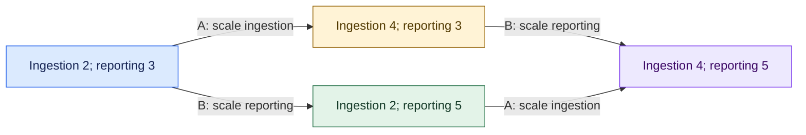
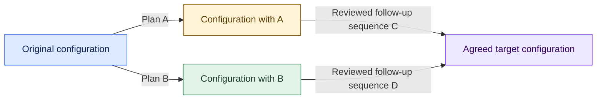
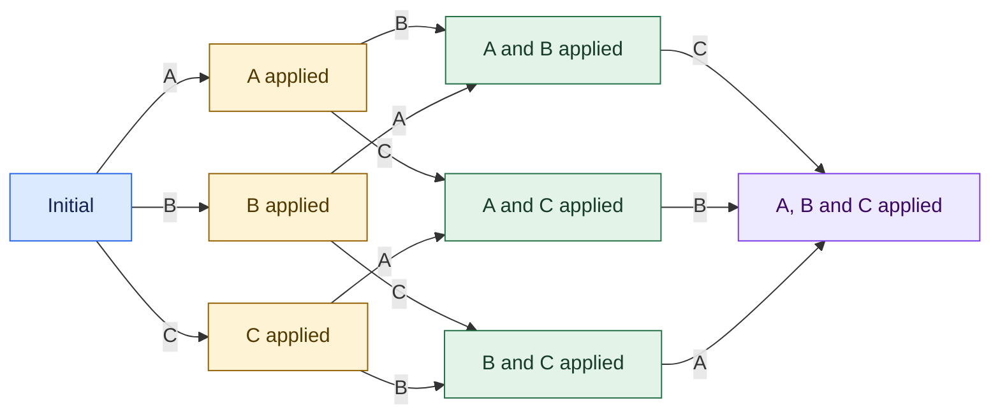
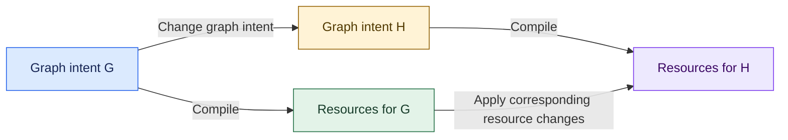

# Mutation diagram patterns

[Documentation](../README.md) · [Mutation plans and execution](mutations.md)

A mutation diagram compares ways of changing an application. Each vertex is a
**configuration**, such as a graph with particular replica counts. Each arrow is
a **mutation** or a sequence of mutations. These vertices are not workload nodes:
one vertex may describe an entire application containing many graphs.

A diagram **commutes** when the compared paths represent the same transformation
under a stated notion of equivalence. Drawing two paths into the same box is a
claim to justify, not evidence by itself. Here, "classes" means diagram patterns;
most are not Python classes or automatically verified relations in Polyad.

## Choose what counts as equivalent

For each diagram, state what is compared:

- **Desired configuration:** the same graph topology, replica targets and policies.
- **Managed state:** the same relevant resources, identities, storage and ownership.
- **Observable behavior:** the same required availability, traffic restrictions and
  application effects during execution as well as at its end.

For example, replacing a Deployment can preserve its desired spec while changing
Pod identities. Two rollouts can finish with identical manifests while only one
avoids downtime. Ignoring timestamps or resource versions may be reasonable for a
configuration comparison; those fields still matter to execution fences.

The patterns below apply to Polyad's declared mutation model. They do not establish
application-level equivalence unless the adapter models and checks those properties.

## Catalog

| Pattern | Question it answers | Current Polyad support |
| --- | --- | --- |
| [Independence square](#independence-square) | Can A and B happen in either order? | Records `Independence` assumptions for pairs in a concurrent batch |
| [Idempotence triangle](#idempotence-triangle) | Does repeating the same intent add no further effect? | Rewrite receipt recovery; other adapters must provide their own retry contract |
| [Refinement triangle](#refinement-triangle) | Does a detailed plan implement one abstract operation? | Explicit ordering can encode the plan; equivalence is adapter-owned |
| [Joinability diamond](#joinability-diamond) | Can different outcomes be brought to a common result? | No automatic joining or confluence checker |
| [Commuting cube](#commuting-cube) | Can three changes be reordered consistently? | Pairwise effect checks and whole-batch budgets; no higher-dimensional proof object |
| [Compiler-preservation square](#compiler-preservation-square) | Does lowering preserve the meaning of a graph change? | A useful compiler test pattern; no general equivalence checker |

## Independence square

Let A scale ingestion from two to four replicas and B scale reporting from three
to five. The two paths should agree on the selected state:
`B(A(S)) = A(B(S))`.

Both orders must be admissible. They need compatible preconditions, disjoint
declared effects, and sufficient shared capacity. Separate subgraph names alone
do not establish those facts.

**In Polyad:** `Mutation.reads`, `writes` and `preconditions` describe the scopes;
`effects_complete=True` asserts that the adapter has included all relevant effects.
The compiler checks overlap, dependency paths and shared budget bounds. If A and B
share a batch, `MutationPlan.independences` records their identities and assumptions.
It does not execute both orders and compare results. Serial plans do not emit these
records merely because operations might be independent.

## Idempotence triangle

An operation R is idempotent in the selected model when `R(R(S)) = R(S)`.
Repeated delivery of the same request should not multiply its intended effect.

The last two boxes denote the same result under the comparison; they are drawn
separately to show the retry step. For Polyad's `Rewrite`, the topology replacement
and receipt annotation are committed together. A retry that still observes that
receipt can publish status without repeating the replacement.

**In Polyad:** this describes the existing receipt-recovery path, not a guarantee
for arbitrary callbacks or an indefinitely retained deduplication history. Setting
a replica target may be idempotent in desired-state terms; adding two replicas or
starting another workload is not inherently idempotent. The mutation executor does
not retry callbacks automatically.

## Refinement triangle

One abstract operation can be implemented by a sequence of smaller operations.
The triangle asserts that the detailed path satisfies the abstract contract.

The direct arrow is a specification, not a Kubernetes command to skip the rollout.
Its contract might require uninterrupted availability and preserved storage. The
detailed plan must establish those properties to count as a valid refinement.

**In Polyad:** `Mutation.after` and refreshed preconditions encode dependencies.
The adapter must wait for the condition it promises; a successful create request
does not imply readiness. There is no `Refinement` AST or automatic proof that a
callback sequence implements the abstract contract.

## Joinability diamond

Different changes can initially produce different states yet allow later paths
to a common state. This is **joinability**. Rewriting theory defines confluence by
requiring such joins for all relevant divergent paths; local confluence concerns
divergence by one step. See section 1.3 of
[Polygraphs: From Rewriting to Higher Categories](https://arxiv.org/abs/2312.00429).

C and D need not be B and A. For example, two conflicting rollout proposals might
need different migration steps to reach a subsequently agreed version. Finding a
join does not establish that the original operations were independent, or that
their execution histories were equivalent. A drawn joinability diamond becomes a
commuting relation only when the compared paths are identified under an explicit
equivalence.

**In Polyad:** a stale precondition stops dispatch so the caller can refresh and
replan. The compiler does not invent these joining sequences. It also does not
enumerate formal *critical branchings*, the minimal overlapping cases used in
some rewriting analyses. Scope conflicts are conservative scheduling evidence.

## Commuting cube

Three independent changes A, B and C produce eight configurations and six orders
in which all three can run. Each square face expresses an independence claim in
the appropriate intermediate state.

This is a flattened cube. Testing each pair only at the initial state is
insufficient. If each change needs one slot and only two slots remain, any pair
fits but the full batch does not.

**In Polyad:** a three-operation batch yields three pairwise `Independence`
records, and budget checks cover the combined batch. General constraints must
still appear in complete effect declarations. The compiler neither enumerates
all six execution histories nor proves coherence between different proofs of
their equivalence. Higher-dimensional relations are a separate mathematical
structure, discussed in the monograph's
[sections 2.5 and 7.3](https://arxiv.org/abs/2312.00429).

## Compiler-preservation square

A compiler can compare changing graph intent before lowering it with changing the
lowered resources. The square asks whether both routes preserve the same meaning.

For example, a placement change should reach the intended descendant Pod specs
whether reviewed at graph level or through its compiled resource changes. Compare
relevant fields after the required reconciliation, with identity and lifecycle
assumptions stated explicitly.

**In Polyad:** this is a test design for compiler adapters. It does not authorize
editing owned resources outside the operator or bypassing inherited policy. There
is no generic graph-to-resource equivalence checker.

## When a commuting diagram does not apply

### Required order

"Wait for replacement readiness, then redirect traffic" may satisfy an availability
contract while the reverse order violates it. Model an `after` dependency and
readiness precondition. A shared final configuration does not justify a square.

### Capacity makes one path inadmissible

At a replica limit of eight with eight in use, releasing two replicas and then
acquiring two can fit. Acquiring first would require ten. The final count agrees,
but one path is forbidden; this is an ordered plan, not an admissible independence
square. Polyad checks the worst increase and decrease within each batch.

### Compensation is not an inverse

Creating a worker and later deleting it may restore the object inventory while
leaving emitted events or modified storage. A compensation can restore selected
business invariants without restoring the original state. Polyad does not infer
rollback callbacks or inverse mutations.

## Map diagrams to the library

| Python model | Role in a diagram |
| --- | --- |
| `Scope` | Identifies the parts of a configuration and shared invariants being modeled |
| `Precondition` | Restricts where an arrow is admissible |
| `Mutation` | Describes an arrow's declared effects and predecessors |
| `Budget`, `BudgetDelta` | Restrict admissible states and transient batch demand |
| `Ordering` | Explains why arrows must form a sequence |
| `Independence` | Records assumptions for swapping two operations in an admitted batch |
| `MutationPlan` | Collects operations, ordering evidence, independence records and batches |

No model currently stores a full configuration diagram or a higher-dimensional
proof. Use these patterns to explain adapter contracts and write focused tests;
use [mutation plans](mutations.md) to enforce the modeled constraints at execution.
