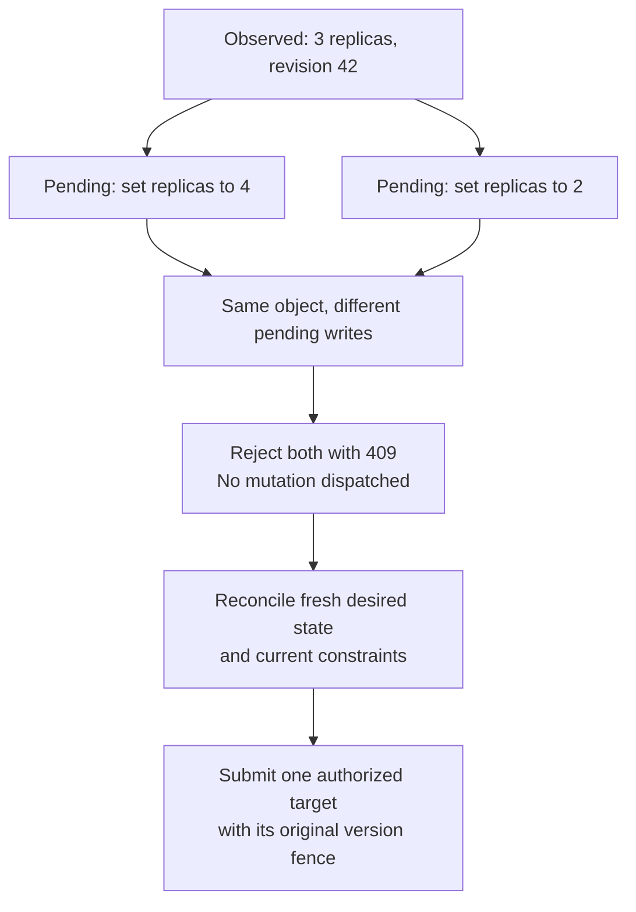

# Mutation plans

<!-- toc:start -->
**Table of contents**

- [Describe effects and shared bounds](#describe-effects-and-shared-bounds)
- [Ordering and evidence](#ordering-and-evidence)
- [Execute a plan](#execute-a-plan)
- [Queued Kubernetes write conflicts](#queued-kubernetes-write-conflicts)
- [Operator integration and limits](#operator-integration-and-limits)
<!-- toc:end -->

A workload graph describes what should run. A mutation plan describes changes to
that graph or its resources, and which changes may execute together. For example,
scaling ingestion and reporting can share a batch when their effects are independent
and their combined demand fits the parent's capacity limit.

The library provides attrs models in `polyad_types.resources.mutations`, a pure
`compiler.passes.mutations.compile_mutations` pass, and an async
`operator.reconciliation.mutations.execute_mutations` executor. These are Python extension APIs;
they do not add a CRD or accept executable callbacks through the composition API.

See [mutation diagram patterns](mutation-diagrams.md) for independence squares,
retry and refinement triangles, joinability diamonds, commuting cubes and compiler
preservation, with their assumptions and current implementation limits.

## Describe effects and shared bounds

```python
from polyad_types.resources.mutations import Budget, BudgetDelta, Mutation, Precondition, Scope
from polyad.compiler.passes.mutations import compile_mutations

ingestion = Scope(("kubernetes", "apps/v1", "Deployment", "production", "ingestion"))
reporting = Scope(("kubernetes", "apps/v1", "Deployment", "production", "reporting"))

changes = (
    Mutation(
        name="scale-ingestion",
        writes=(ingestion,),
        preconditions=(Precondition(Scope((*ingestion.path, "metadata", "resourceVersion")), "42"),),
        deltas=(BudgetDelta("application-replicas", 2),),
        effects_complete=True,
    ),
    Mutation(
        name="scale-reporting",
        writes=(reporting,),
        preconditions=(Precondition(Scope((*reporting.path, "metadata", "resourceVersion")), "19"),),
        deltas=(BudgetDelta("application-replicas", 2),),
        effects_complete=True,
    ),
)

plan = compile_mutations(
    changes,
    budgets=(Budget("application-replicas", current=5, minimum=0, maximum=10),),
    max_parallelism=2,
)
assert plan.batches == (("scale-ingestion", "scale-reporting"),)
assert len(plan.independences) == 1
```

This example describes increasing replicas from 2 to 4 and 3 to 5. The application
ends with nine replicas. Reducing the maximum to eight rejects the plan before any
operation runs, even though either increase would fit on its own.

`effects_complete=True` is a contract supplied by a trusted adapter, not an
inference from node names. The example assumes no additional shared constraints or
service dependencies. Real adapters must include policy versions, readiness
requirements, shared resources, external effects and transport conflicts where
relevant. The default is `False`, which orders the operation against all others.

## Ordering and evidence

- **Scope overlap:** paths use segments, not string prefixes. A write to a whole
  object conflicts with reads or writes anywhere below it. Read/read overlap is safe.
- **Preconditions:** an expected value is also a read dependency. Missing observations
  fail closed; `None` explicitly means the observer established absence.
- **Explicit ordering:** `after=("replacement-ready",)` waits for that operation to
  finish. Its adapter must actually wait for readiness, or a subsequent precondition
  must check readiness. A Kubernetes write acknowledgement alone is insufficient.
- **Unknown effects:** keep deterministic serial order. Explicit dependencies take
  precedence over input order. Cycles and unknown predecessors are rejected.
- **Shared counters:** integer deltas must fit declared bounds for every possible
  completion order within a batch. A concurrent release cannot fund an increase;
  put the release in an earlier batch with an explicit dependency. The planner
  rejects batches whose declared order violates those limits.
- **Audit:** `plan.orderings` explains required sequencing; `plan.independences`
  records assumptions for every concurrent pair. Serialize plans with
  `polyad_types.resources.converter.unstructure(plan)` and restore them with
  `converter.structure(document, MutationPlan)`.

Represent a shared nonnumeric invariant with a common scope in the affected
operations' reads/writes. For Kubernetes updates, include a whole-object write scope
even when changing different fields if they share a resource-version fence.

## Execute a plan

`execute_mutations(changes, observe=..., apply=..., budgets=...,
observe_budgets=..., max_parallelism=2)` compiles the plan and executes its batches.

The adapter supplies:

| Callback | Contract |
| --- | --- |
| `observe(mutation)` | Refresh and return a mapping from each precondition's `Scope` to its string value or explicit `None` |
| `apply(mutation)` | Perform the named operation with server-side preconditions and return only once its declared completion condition holds |
| `observe_budgets()` | Return fresh integer counter values; required whenever budgets are declared |

All preconditions in a batch are checked before any of its operations dispatch.
Counters are refreshed before each batch and must match the projected usage from
previous successful batches. Drift stops execution and requires replanning.
Concurrency uses `operator.writeQueue.plannerParallelism` (default `1`), projected
as `POLYAD_MUTATION_PLANNER_PARALLELISM`. An explicit `max_parallelism` can lower
that administrator ceiling but cannot raise it. The pure `compile_mutations`
function remains independent of deployment configuration; the runtime executor
applies the ceiling when compiling its plan. See [work-graph tuning](write-pipeline.md#choosing-concurrency)
for the separate writer, admission, reconciliation and validation limits.

If a callback fails, other in-flight operations settle before the error is raised;
later batches do not start. Multiple failures are reported as an exception group.
Cancellation also waits for in-flight callbacks, so adapters need bounded transport
timeouts. There is no automatic rollback or retry: refresh state and use durable
receipts to recover partially applied plans.

The caller must retain coordination covering **all shared scopes and counters** for
the execution, reserve any required quota and coordinate competing callers.
Callbacks must use optimistic server-side fences and submit Kubernetes changes
through Polyad's write queue. Observations supply the state used to validate those
changes; the caller's coordination and fences govern execution authority.

## Queued Kubernetes write conflicts

The Kubernetes adapter also examines concrete writes waiting for dispatch. This
applies to all callers using that adapter, including scaling, topology, workload,
status and lifecycle changes, whether or not they came from a mutation plan.
The reconciliation queue coalesces resource keys; this later check compares the
actual changes proposed for each object.

The [Kubernetes write pipeline](write-pipeline.md) describes bounded admission,
dependency contracts, the validation producer, watch invalidation, duplicate
coalescing and targeted reconciliation. Those checks cover queued decisions as
well as their direct target objects.

For example, two decisions observe three replicas at the same resource version.
One proposes four replicas (scale up by one), and another proposes two (scale down
by one). If both requests are still pending, the adapter rejects **both** with a
retryable `409` conflict and sends neither mutation to Kubernetes. Reconciliation
must reread current desired state and constraints to choose the appropriate
target. Polyad does not sum these into a no-op or choose a winner by arrival order:
the requests may express different policies or reflect different demand samples.



The check is conservative at **whole-object scope**: writes to different fields,
including `/status`, still share a resource-version fence. Creates, replacements,
patches and deletes of the same named object therefore conflict when their
requests differ. Identical requests with identical dependency contracts share one
entry and acknowledgement. Different kinds, namespaces or names do not conflict in this
check. It does not infer dependencies between separate objects or replace the
mutation planner's declared effects and shared budgets.

For a write waiting behind another operation, validation checks the original
target fences. The dispatcher can reuse a still-current receipt from the producer:

| Queued request | Required check |
| --- | --- |
| PATCH or PUT | Original `metadata.resourceVersion` must be supplied and still match; supplied UID must also match |
| DELETE | At least one original UID or resource-version precondition must be supplied; every supplied precondition must still match if the target exists |
| Named POST | The target must still be absent |

An absent DELETE target retains idempotent deletion behavior. An absent update
target, a replaced object, a changed revision or a missing required precondition
requires fresh reconciliation. The adapter never substitutes a newer revision
into an old decision. Ownership is checked again after the read, and the original
server-side fences still protect against changes between that read and the write.
Read requests, authentication reviews, dry runs and creates using `generateName`
have no persistent named effect to compare in the pending registry.

A write already dispatched cannot be cancelled by a later opposing request. It
finishes first; the next waiting request then checks the resulting state and
rejects a stale revision. Cancellation retains the write slot until the transport
finishes, including repeated cancellation. There is no rollback of completed
effects and no automatic replay of a rejected payload.

The pending registry belongs to one API adapter and remains in memory. It stores
resource identities, fences and private request digests, not request bodies or
credentials. Across operator replicas and separate adapters, existing shard
leases and Kubernetes preconditions still coordinate writes. Root authority,
local remote-scaling consent and GraphRules continue to apply.

Rejected requests emit the structured
[`polyad.kubernetes.write_deferred` decision log](../operations/tracing.md#decision-and-conflict-logs)
with a stable reason, resource identity and cluster. No request body or digest is
logged. The existing [write backlog gauges](../operations/metrics.md#freshness-and-failures)
release rejected and cancelled requests as they leave the queue.

## Operator integration and limits

The existing `Rewrite` controller now uses the executor for its topology replacement.
It refreshes target UID, generation, resource version and deletion state before
dispatch, then writes through the existing guarded API queue with a resource-version
fence. Atomic rewrite receipt annotations still recover lost acknowledgements.
Whole-topology replacement retains incomplete effects and remains serialized within
its root graph family. The [write pipeline](write-pipeline.md#dependencies-and-ordering)
can overlap explicitly approved independent mutations, and reconciliation workers
can prepare separate graph families concurrently. Neither setting replaces shard
leases or declares existing topology rewrites independent.

Independence records describe the declared state model. They do not establish
equivalent downtime, traffic exposure or application side effects. Adapters must
account for transient capacity within each operation as well as its final delta.
Nested `PolyGraph` composition remains distinct from a mathematical polygraph;
these plans provide explicit mutation relations without claiming general confluence
or higher-category coherence proofs.
