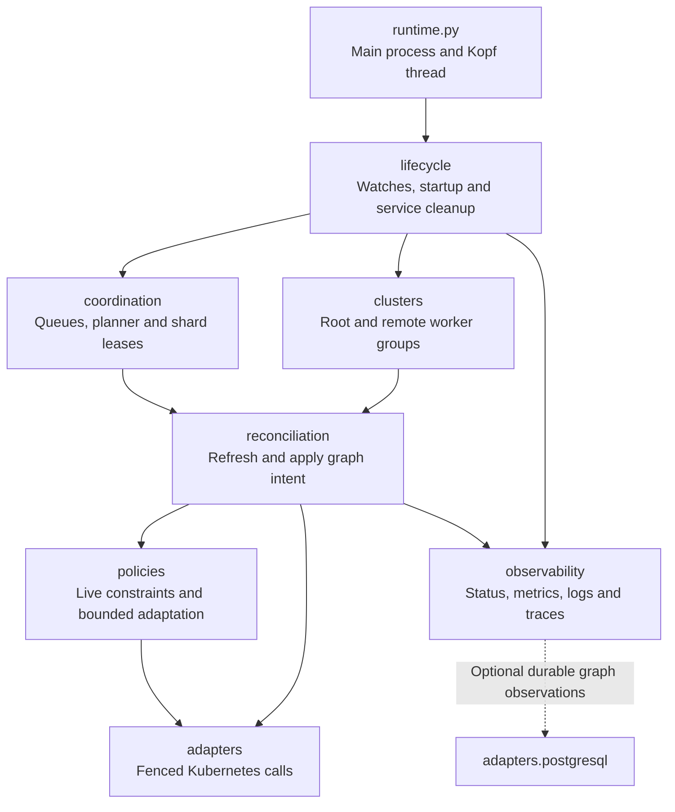
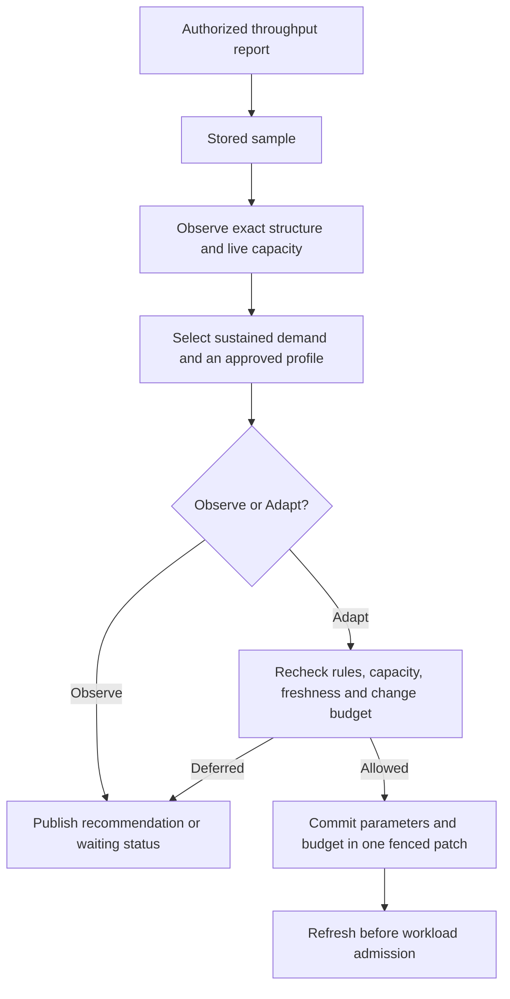

# Operator package layout

`pkg/polyad/operator` groups implementation modules by responsibility. The
`runtime.py` and `observer.py` entrypoints launch their respective processes;
the packages below own startup, reconciliation, policy enforcement and supporting
services. See the [process and thread hierarchy](../deployment/process-hierarchy.md)
for how this code runs in a deployed container.

## Table of contents

- [Responsibilities](#responsibilities)
- [Reconciliation flow](#reconciliation-flow)
- [Soul searching entry point](#soul-searching-entry-point)
- [Imports and optional capabilities](#imports-and-optional-capabilities)
- [Where to make changes](#where-to-make-changes)

## Responsibilities

All paths below are relative to [`pkg/polyad/operator`](../../pkg/polyad/operator).

| Package | Responsibility | Modules |
| --- | --- | --- |
| `lifecycle/` | Kopf startup and shutdown, service ownership, health, roles and polling intervals | `handlers`, `health`, `roles`, `tuning` |
| `reconciliation/` | Translate graph intent into owned workloads, execution instances and ordered mutations | `controller`, `activations`, `compositions`, `replication`, `mutations`, `identity`, `placement` |
| `policies/` | Check live graph families and enforce structural, network, capacity, throughput and traffic decisions | `rules`, `rule_state`, `cheeger`, `soul/`, `traffic`, `capacity`, `network`, `connections` |
| `coordination/` | Planner election, shard leases, local and shared queues, write contracts, validation, dependency dispatch and pending conflicts, and scaling the shared Dragonfly service | `leases`, `queue`, `shared_queue`, `write_queue`, `contracts`, `validation`, `dispatch`, `dragonfly` |
| `clusters/` | Root orchestration, remote graph ownership, worker pools, remote scaling consent and reserved operator membership | `root`, `federation`, `pools`, `remote_scaling`, `reserved` |
| `observability/` | Status trees, descendant summaries, write pressure, component demand, decision logs and traces | `graph_status`, `rollup`, `metrics`, `pressure`, `decisions`, `logging`, `tracing` |
| `adapters/` | Fenced Kubernetes transport and optional PostgreSQL graph-state persistence | `kubernetes`, `postgresql` |

Graph algorithms and topology transformations remain in `polyad.graph`, shared
resource models in `polyad_types`, and HTTP listeners in `polyad.api`. The
operator packages connect those facilities to reconciliation and deployment
lifecycle. The shared Flask application still has one owner in
[`lifecycle/handlers.py`](../../pkg/polyad/operator/lifecycle/handlers.py).

## Reconciliation flow

This diagram describes control flow between the operator's components.
The controller and individual reconcilers cooperate through type-only and local
imports where needed. [Mutation plans](mutations.md) and
[live GraphRules](../graphs/graph-rules.md) continue to govern writes.

## Soul searching entry point

Start with
[`search_soul()`](../../pkg/polyad/operator/policies/soul/controller.py).
It is the high-level implementation of
[Soul searching](../graphs/soul-searching.md) for both Graphs and PolyGraphs.
The graph reconciler invokes it when `spec.throughput` is configured and refreshes
the resource before proceeding with workload admission.

Read the package in decision order:

| Stage | Code | Responsibility |
| --- | --- | --- |
| Observe | [`observations.py`](../../pkg/polyad/operator/policies/soul/observations.py) | Compute current expansion, restore history, detect capacity changes and validate Headroom target identities |
| Recommend | [`planning.py`](../../pkg/polyad/operator/policies/soul/planning.py) | Check sample freshness, select demand tiers, require sustained evidence and combine approved layouts, traffic weights and capacity preparation |
| Admit and commit | [`controller.py`](../../pkg/polyad/operator/policies/soul/controller.py) | Distinguish Observe from Adapt, enforce temporary-connection and cooldown limits, recheck live rules/capacity/sample age and commit parameters with their change budget |
| Stage handoff | [`contracts.py`](../../pkg/polyad/operator/policies/soul/contracts.py) | Define internal `Search` observations, a `Proposal` with its evidence and the existing durable annotation names |

The package owns the adaptation decision. Specialized implementations retain
their own locations: exact cuts in [`polyad.graph.cheeger`](../../pkg/polyad/graph/cheeger.py),
live family constraints in [`rule_state.py`](../../pkg/polyad/operator/policies/rule_state.py),
percentage arithmetic in [`compiler/passes/traffic.py`](../../pkg/polyad/compiler/passes/traffic.py),
and Istio resource reconciliation in [`policies/traffic.py`](../../pkg/polyad/operator/policies/traffic.py).
KEDA/HPA continue to own their configured replica targets; Soul searching proposes
approved parameters and capacity preparation.

The [HTTP intake](../../pkg/polyad/api/workloads/throughput.py) validates and stores
reports using the annotation contract. It does not import or run the adaptation
controller. Observe and Adapt share one planner; only the controller can commit
a proposed specification. Internal handoff types leave the public
`spec.throughput`, status fields and annotation names unchanged.

The regression suites are
[`test_throughput.py`](../../pkg/tests/test_throughput.py),
[`test_load_profiles.py`](../../pkg/tests/test_load_profiles.py) and
[`test_traffic.py`](../../pkg/tests/test_traffic.py). Use these to check stabilization,
hard bounds, atomic profiles, traffic feedback and changes between planning and
the final write.

## Imports and optional capabilities

Package `__init__.py` files contain documentation and no eager service imports.
Import the owning module directly, for example
`polyad.operator.reconciliation.controller.Controller` or
`polyad.operator.adapters.kubernetes.API`.

Feature-specific imports stay at their existing enablement points. Importing
`adapters` does not load PostgreSQL; importing `observability` does not initialize
OpenTelemetry exporters. The observer entrypoint remains independent of Kopf
handler registration and reconciliation. See
[runtime capability selection](../deployment/containers.md) and the isolated
startup probes in [`pkg/tests/test_runtime_capabilities.py`](../../pkg/tests/test_runtime_capabilities.py).

Redis/Dragonfly Lua programs live in [`polyad/lua`](../../pkg/polyad/lua), grouped
into coordination, events and authentication scripts. PostgreSQL statements live
in [`polyad/sql`](../../pkg/polyad/sql). Both are package resources included in
wheels and source distributions, loaded through `importlib.resources` without
depending on the working directory. Keep server-side programs in these artifacts
and pass runtime values through their existing parameters.

## Where to make changes

- Add graph execution behavior in `reconciliation`; check live policy before writes.
- Add admission or adaptation constraints in `policies`; keep pure graph mathematics
  in `polyad.graph` and public configuration types in `polyad_types`.
- Start Soul searching changes in `policies/soul/controller.py`; follow
  its observation and planning stages to the specialized code you need.
- Add ownership and delivery behavior in `coordination`, and remote group behavior
  in `clusters`.
- Add external persistence or transport implementations in `adapters`, preserving
  credential handling and optional feature gates.
- Add startup and cleanup ownership in `lifecycle`; add diagnostics and summaries
  in `observability`.

Module paths in tests, monkeypatch targets, container checks and documentation
should refer directly to these packages. Both executable module commands remain
`python -m polyad.operator.runtime` and `python -m polyad.operator.observer`.
