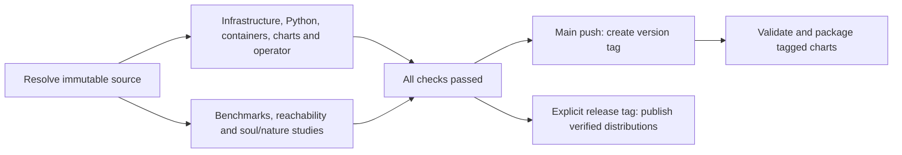

# Development toolchain

<!-- toc:start -->
**Table of contents**

- [Setup](#setup)
- [Develop against local Kubernetes](#develop-against-local-kubernetes)
- [Formatting and checks](#formatting-and-checks)
- [Python types and serialization](#python-types-and-serialization)
- [One pipeline per run](#one-pipeline-per-run)
- [Version tags](#version-tags)
- [Verified package releases](#verified-package-releases)
  - [Manual PyPI publishing](#manual-pypi-publishing)
- [Verified Helm chart builds](#verified-helm-chart-builds)
- [Helm documentation](#helm-documentation)
- [Compose artifact on main](#compose-artifact-on-main)
<!-- toc:end -->

Polyad uses pre-commit checks and four-space indentation for Python and shell
scripts. `.tool-versions` pins the local and CI tools; `.python-version` keeps
the Python 3.13 interpreter selected for development. The operator supports
Python 3.13 and 3.14; the standalone SDK, types and schemas packages support Python
3.11 through 3.14. CI runs operator tests on both supported versions and checks
the standalone wheels on each supported version. `.editorconfig` supplies
editor indentation.

## Setup

Install asdf and Bash 4.4 or newer, then run from the repository root:

```bash
bash scripts/tooling/install-asdf-tools.sh
python -m venv .venv
poetry install
bash scripts/tooling/build-chart-dependencies.sh
poetry run pre-commit install --install-hooks
poetry run pre-commit run --all-files
```

On macOS, put a current Bash on `PATH` ahead of `/bin/bash`. The shell checker
requires the exact ShellCheck and shfmt versions in `.tool-versions`. If you
manage tools without asdf, install those versions using your preferred manager.

The dependency helper registers Istio, KEDA, Stakater, Prometheus Community,
Grafana Community and OpenTelemetry before building both charts from their
committed `Chart.lock` files. Optional dependencies still need their repositories
when disabled. Local `file://` and OCI dependencies do not use `helm repo add`.
Pass `charts/polyad` or `charts/polyad-benchmarks` to build only that chart.
CI validation, integration tests and release packaging use the same helper;
regression tests compare its repository inventory with every chart and lockfile.

To install shfmt with Homebrew, run `brew bundle install` from the repository
root. The [Brewfile](../../Brewfile) installs the current Homebrew release; the shell
checker still enforces the version pinned in `.tool-versions`. It searches `PATH`
for a matching executable, so an older formatter in an activated Python virtual
environment does not shadow the correct Homebrew or asdf installation. If no
matching version is installed on `PATH`, the hook reports the versions it found.

Scripts are [grouped by responsibility](../../scripts/README.md) under `scripts/`.
`scripts/tooling/project-python.sh` uses `.venv/bin/python` when present and otherwise
runs Python through Poetry. Hooks therefore use the project's locked Python
dependencies. Pre-commit installs its pinned docstring and Helm documentation
tools in isolated environments. The Mermaid wrapper runs `npm ci` from its
lockfile when the dependencies or Node version change.

## Develop against local Kubernetes

The [Minikube integration](../../integrations/minikube/README.md) starts three
nodes and installs a single dense operator, one Dragonfly instance, and one
Dragonfly controller. The cluster is intentionally non-HA. Install the guide's
Docker/Buildx and Minikube prerequisites, then run from the checkout root:

```sh
bash integrations/minikube/minikube.sh start
```

After editing operator code, chart templates, or generated CRDs, rebuild and
verify without recreating the profile:

```sh
bash integrations/minikube/minikube.sh enable
bash integrations/minikube/minikube.sh test
```

Images are built from the checkout and loaded directly into the cluster; there
is no registry push or live source mount. The guide documents
[cluster-free integration tests](../../integrations/minikube/README.md#check-the-integration-without-a-running-cluster),
profile-specific values, logs, metrics, and safe cleanup. Use explicit
`--context polyad` for your own kubectl commands because the helper preserves
your existing current context. This workflow does not change CI's Kind tests.

## Formatting and checks

The documentation hook refreshes tables of contents across all repository Markdown
on every commit, even when no Markdown file is staged. Archived runs and third-party
sources are excluded. If the hook updates files, stage them and retry the commit.
Run it manually with `pre-commit run documentation-contents --all-files`; use
`bash scripts/tooling/project-python.sh scripts/documentation/update-contents.py --check`
to check without writing.

```bash
bash scripts/tooling/project-python.sh -m ruff check --fix pkg examples
bash scripts/tooling/project-python.sh -m ruff format pkg examples
git ls-files -z --cached --others --exclude-standard -- '*.sh' '*.bash' | xargs -0 shfmt -w
poetry run pre-commit run --all-files
poetry run pytest
```

Pytest runs in parallel locally and in CI through the `pytest-xdist` development
dependency. The project defaults to automatic CPU-based worker selection, capped
at eight workers. Work stealing redistributes pending tests as workers finish.
The installed-wheel typing checks use the same configuration.

The Python suite and its fixtures live in `pkg/tests/`; pytest discovers them
automatically. Run a specific file with `poetry run pytest pkg/tests/test_operator.py`.

Use `poetry run pytest -n 4` to choose a worker count, or
`poetry run pytest -n 0` for serial debugging. See the
[pytest-xdist execution options](https://pytest-xdist.readthedocs.io/en/latest/distribution.html).
Redis/Dragonfly integration tests use unique namespaces, local socket tests bind
ephemeral ports, and file-writing tests use pytest's isolated temporary directories.

The development dependencies include [DeepDiff](https://pypi.org/project/deepdiff/)
for nested manifest and schema comparisons. Use `assert not DeepDiff(expected, actual)`
to report changed paths when the structures differ. Keep its default order and
type checks for Kubernetes wire contracts; use ordinary assertions for scalar values.

The hooks check Google-style docstrings with pydocstyle and pydoclint, Python
lint and formatting with Ruff, types with mypy, shell scripts with ShellCheck
and shfmt, and Mermaid diagrams in Markdown and standalone diagram files.
All Python docstrings put both opening and closing triple quotes on separate
lines, even for a single sentence. The `docstring-layout` hook enforces this for
modules, classes and functions, including tests and examples. Ruff's `D213` rule
also keeps multiline summaries below the opening quotes; `D200` stays disabled
so tools do not require collapsing short docstrings.

```python
"""
Describe the module, class or function here.
"""
```

Check the layout directly with:

```sh
bash scripts/tooling/project-python.sh scripts/validation/check-docstrings.py pkg examples scripts
```

Ruff requires postponed annotations and separates imports used only by type
checkers behind `if TYPE_CHECKING:`. Attrs field annotations remain importable
at runtime for cattrs serialization; constructors, base classes, decorators and
other runtime expressions also keep their imports. Dataclass annotations and
Kopf callback annotations receive no blanket exemption. Operator syntax and
static checks target the minimum supported Python version, 3.13; the client
and types packages target 3.11.

Mermaid checker regression tests run with:

```bash
bash scripts/validation/check-mermaid.sh
npm test --prefix scripts/validation/mermaid
```

## Python types and serialization

Python documentation examples annotate function parameters and return values,
including nested callbacks and factories. Use `Callable` to show the arguments
and result expected from application callbacks; use a `Protocol` when an example
needs several methods from an application component. Prefer the shared SDK types
(`Change`, `Environment`, `Event`, `ManagedProcess`) and spell out optional values
with `| None`. Use `Mapping[str, Any]` for the SDK's extensible records, and link
to their [field reference](../../pkg/polyad-sdk/README.md#environment-fields).
Application types defined in an example should be identified as such, with units
and missing-value behavior explained. Simple locals can use inferred types.

The shared models live in [`pkg/polyad-types`](../../pkg/polyad-types/README.md), an
independently installable Python 3.11+ distribution. Install it from a checkout
with `pip install ./pkg/polyad-types`, then import `polyad_types`. Its runtime
dependencies are attrs, cattrs and typing-extensions. The operator and client
use these same definitions.

Python applications can specialize the node types accepted by a `PolyGraph`.
`PolyGraph[NodeT]` retains that type when code reads `graph.nodes`, so Mypy can
check custom reference fields and reject incompatible nodes before execution.
`NodeT` must extend `GraphNode`; the default is `GraphNode`, which accepts a
mixture of supported graph boundary kinds. The graph is immutable and its type
parameter is covariant, allowing a specialized graph wherever a more general
graph reference is accepted.

See [the checked typing example](../../examples/typed_graphs.py) for a `BatchGraph`
reference that restricts its kind to `Graph`. The example demonstrates explicit
type parameters, inferred node types and mixed graph references. These types
describe Python objects; they do not add Kubernetes scheduling behavior or
extend CRD schemas. Kubernetes references still resolve reusable definitions
by kind and name.

For cattrs serialization, supply the same concrete graph type when converting
in both directions:

```python
from polyad_types.graphs.topology import GraphNode, PolyGraph
from polyad_types.serialization import converter

graph = PolyGraph(
    nodes=(GraphNode(name="batch", kind="Graph", ref="batch-template"),),
)
graph_type = PolyGraph[GraphNode]
document = converter.unstructure(graph, unstructure_as=graph_type)
restored = converter.structure(document, graph_type)
```

Use `PolyGraph[YourReference]` in both calls when the graph contains custom
reference objects. Supplying the concrete type preserves their fields through
the round trip. Custom fields remain Python-library data unless the Kubernetes
schema and compiler explicitly support them.

The wheel ships inline annotations and the package-root `py.typed` marker. CI
installs that wheel into a consumer environment and checks positive and negative
Mypy contracts, including generic `PolyGraph` references. There is no separate
stub package to keep synchronized.

The separate `polyad-schemas` package ships [importable JSON Schemas](../apis/json-schemas.md) for
shared models, resource manifests, events and Helm values. Regenerate them with
`poetry run python scripts/schemas/generate-all.py` after updating their
[canonical sources](../../schemas/README.md). The `schema-artifacts` hook checks
chart and Python copies for drift; release CI checks the
artifacts in the installed standalone wheel.

## One pipeline per run

The [Polyad pipeline](../../.github/workflows/ci.yml) is the only Actions entry
point for main pushes, pull requests, version-tag pushes and manual runs. Open
that run to see infrastructure checks, Python and container matrices, chart
validation, Cheeger benchmarks, reachability studies, and soul/nature process
studies in one job graph. The component YAML files accept only `workflow_call`;
they do not create independent runs or completion-triggered follow-up pipelines.

Every branch checks out the same resolved commit. The **All checks passed** job
joins every validation branch and rejects failures, cancellations and unexpected
skips before tagging or publishing. Compose is intentionally main-push-only.
Study failures now block releases as well as ordinary CI success.



To rerun checks, use **Run workflow** on **Polyad pipeline**. Leave `tag` empty
for validation only, or specify an existing `v...` tag to verify and publish it.
`full-refresh` remains an explicit opt-in with a selected `context` and the
protected `benchmarks` environment. Ordinary pushes and PRs never run cloud load.

## Version tags

After every successful validation gate for a push on `main`, the pipeline calls
`.github/workflows/tag.yml` as a dependent job in the same run. It waits for all
checks and studies, then tags that exact tested commit using
`project.version` from `pyproject.toml`. Stable versions receive `vX.Y.Z`; Python
prereleases use `vX.Y.Z-alphaN`, `vX.Y.Z-betaN` or `vX.Y.Z-rcN`. Pull requests and
other branches cannot create tags.

The first passing commit for a new version creates its tag. Later builds with
the same version leave the existing tag unchanged; bump the package version to
create another tag. Supported versions are `X.Y.Z` and Python prereleases such as
`X.Y.Zrc1`. Tag creation is serialized and only the tagging job gets repository
write permission. New tags, and reruns for a tag already pointing to that tested
commit, invoke the reusable chart workflow to validate and package the Helm chart.

Tags use `GITHUB_TOKEN`, so creating one does not start another push-triggered
workflow. The tagging component calls chart validation/build directly after creating
the tag, inside the current pipeline. To publish an automatically created tag,
run **Polyad pipeline** manually with that `tag`. User-pushed version tags start
the same pipeline and enter its publishing stage after all checks succeed.
See [GitHub's workflow trigger behavior](https://docs.github.com/en/actions/how-tos/write-workflows/choose-when-workflows-run/trigger-a-workflow).

## Verified package releases

The release path follows `hypothesis-helm`: the pipeline prepares the tagged source,
checks its release metadata, builds a wheel and source distribution,
and uploads them as `python-distributions-<version>`. The publishing job downloads
those exact artifacts, runs in the `pypi` environment and uses its `PYPI_API_TOKEN`
Secret. Configure environment protection and that credential before publishing.
For tagged builds, the Git tag determines the release version. The shared
`.github/actions/prepare-release` action runs `.github/prepare-release.py` in each
build checkout before dependencies are installed or artifacts are built. For
example, `v0.0.1-alpha3` sets the Python package version to `0.0.1a3` and the chart,
`appVersion` and default image tag to `0.0.1-alpha3`. It also refreshes the chart
README's image-tag default. Alpha, beta and release-candidate spellings are
normalized; malformed tags fail before metadata changes.

The standalone `polyad-sdk`, [`polyad-types`](../../pkg/polyad-types/README.md)
and [`polyad-schemas`](../../pkg/polyad-schemas/README.md) packages receive the same
release version. The operator's `schemas` extra pins the matching schema package. The client and operator pin the matching
types release; Poetry resolves that dependency from `pkg/polyad-types` in a checkout,
while built distributions declare a version dependency suitable for PyPI. CI checks
standalone types and client installations without operator dependencies and publishes
types and schemas first, then the client and operator. The PyPI token must permit
all four names. CI checks schemas in a separate environment without types, client
or operator dependencies.

Python builds, both Docker profiles, operator integration tests, every Helm
validation shard, Helm packaging and PyPI publishing use this preparation step.
`.github/release-version.py` still verifies that the resulting package version
matches the tag. Changes exist only in the build checkout: CI does not commit
version bumps or move tags. Release preparation updates the local types and schemas lock entries;
Python and Docker builds refresh the lock metadata before installation, retaining
the locked third-party versions.

Branch and pull-request builds retain their declared versions. The automatic
main-branch tagging workflow also continues to derive its tag from the declared
package version; it does not increment that version on every push. To select a
release manually, create its tag on a commit containing this pipeline. Older tags
that contain the previous pipeline still use its strict version check when rerun.

To reproduce release metadata locally before building:

```sh
python .github/prepare-release.py --tag v0.0.1-alpha3
poetry lock
python .github/release-version.py --tag v0.0.1-alpha3
```

### Manual PyPI publishing

Each distribution has its own PyPI metadata and build configuration. Set
`POETRY_PYPI_TOKEN_PYPI` in your shell to a PyPI API token authorized to publish
the package names, then run these commands from the repository root with the
project's Python 3.13 interpreter selected:

```sh
poetry -C pkg/polyad-types check --strict
poetry -C pkg/polyad-schemas check --strict
poetry -C pkg/polyad-sdk check --strict
poetry check --strict

poetry -C pkg/polyad-types publish --build
poetry -C pkg/polyad-schemas publish --build
poetry -C pkg/polyad-sdk publish --build
poetry publish --build
```

Run only the first publish command to release `polyad-types` on its own. When
releasing all four, publish types and schemas first because the client and
operator extras require their matching versions. Use the release-preparation commands above when changing
versions so all four distributions and dependency pins stay aligned; PyPI
requires a new version for a subsequent release.

`publish --build` builds the wheel and source distribution, then uploads them to
PyPI. Add `--dry-run` to validate the publishing flow without uploading. See
[Poetry's publish command](https://python-poetry.org/docs/cli/#publish) and
[token configuration](https://python-poetry.org/docs/repositories/#configuring-credentials).

## Verified Helm chart builds

Main-branch pushes and pull requests call `.github/workflows/chart.yml` from the
Polyad pipeline. Chart validation pins the Hypothesis Helm action to
[`05681f04b41256a41355e6320e52a7ca17f67b74`](https://github.com/astrivant/hypothesis-helm/tree/05681f04b41256a41355e6320e52a7ca17f67b74)
across `charts/polyad` and `charts/polyad-crds`, with **six property-test jobs total:
three shards per chart and four workers per shard**. The jobs use `ubuntu-24.04`: GitHub's largest standard free
Linux runner for public repositories, with 4 CPUs and 16 GB RAM. Larger runners
are billed even for public repositories; see the
[standard runner specifications](https://docs.github.com/en/actions/reference/runners/github-hosted-runners)
and [larger runner billing](https://docs.github.com/en/actions/concepts/runners/larger-runners).
GitHub account concurrency limits can still queue some of the six shard jobs.

PRs, main-branch pushes, and tagged builds retain the pinned action's defaults:
100 examples per property, seed zero, all eligible paths on each CI run, and
strict Kubernetes 1.35 validation through the repository's Kubeconform wrapper.
There is no additional random percentage sampling or separate exhaustive release
scan. **Filtering is not enabled yet:** the pinned action has no `filter` input,
and its CLI restricts `--filter` to a mode incompatible with `--shard`. Recursive
chart discovery also rejects `--shard`. Upstream support is required to replace
the per-chart matrix with one recursive filtered scan split across six shards.

Each shard uploads its own reports, JUnit results, and JSON manifest stream even
when validation fails. Report names distinguish the initial and tagged passes.
Kubernetes schemas share a versioned cache; test-result caches remain local to
each job. Benchmark-chart defaults and monitoring profiles retain their strict
render/schema checks while the upstream dependency-merge parser issue remains.

All six chart/shard jobs and the benchmark-chart validation must succeed before
the pipeline can permit automatic tagging. The same component validates
user-pushed/manual release tags, and runs again after automatic tagging, without
starting another pipeline. For tagged builds, its package job requires all chart
validation jobs, packages all three charts, and uploads
`helm-chart-<tag>` containing three `.tgz` archives for 30 days. Main and PR checks
validate without producing a release chart archive.

The workflow resolves the source commit once and uses that SHA for every shard
and the package job. Packaging also checks that the release tag still identifies
that SHA. The operator chart follows the operator release tag. The resource chart retains
its independently declared version; update its `Chart.yaml` and the parent
dependency pin when releasing changed definitions or templates. These builds upload workflow artifacts;
they do not publish to a Helm registry or GitHub Release.

The resource chart has empty instance maps by default. Its scoped hypothesis-helm
policy permits an empty instance bundle (`HH1107`); Python tests verify the CRD
installation output and representative instances independently. All other checks
remain enabled, and the operator chart retains its normal policy.

## Helm documentation

Every shipped values file uses explicit schema-derived parameter tags, for
example `## @param global.meshID [string] ...`. Types are `string`, `boolean`,
`integer`, `number`, `object` or `array`; comma-separated alternatives describe
unions, and `nullable` permits YAML `null`. An integer default does not make a
fractional-duration setting an integer: the schema defines the accepted type.
Descriptions explain the setting's purpose and tradeoffs.

After changing the canonical schema or adding values, synchronize annotations
across defaults, reference overlays, examples and test fixtures, then regenerate
both charts' parameter tables:

```bash
poetry run python scripts/validation/check-values.py --fix-annotations
poetry run pre-commit run helm-readme-generator --all-files
```

`check-values.py` rejects missing or stale tags as well as invalid YAML values,
duplicate keys and untyped nested fields. Its repair option preserves values
and authored descriptions. The pinned Bitnami generator runs through
`scripts/schemas/generate-helm-readme.py`, which shows these tags as visible types
while retaining actual defaults, including nonempty strings and collections.
Run the hook through pre-commit to use its pinned Node environment.

The resource chart also ships fully commented examples for each kind. The wrapper
decodes their marked example blocks when generating a reference table; type checks
cover those blocks without enabling any instances. Regenerate those examples from
the CRDs with `scripts/schemas/generate-all.py`.

Commit any regenerated table with the values change. The chart's hand-authored
`values.schema.json` retains its conditional validation rules. CI runs the same
pre-commit checks, Mermaid regression tests, Python tests, hypothesis-helm chart
validation, and Kubernetes operator integration tests.

Helm property tests cover all generated value paths, including upstream
dependency settings. `scripts/validation/kubeconform.sh` adds the pinned Dragonfly schema
to Kubernetes API validation; a contract test keeps it aligned with the CRD and
the upstream dependency.

The Kubernetes job exercises both single-instance Dragonfly and HA. The HA test
temporarily cordons the primary's node in its disposable kind cluster, deletes
the primary pod, and checks graph progress through the promoted replica before
allowing the old primary to return.

## Compose artifact on main

Each main-branch push runs `astrivant/composer@v0.3.0` against `charts/polyad`.
The `polyad-compose` workflow artifact contains the generated Compose file, its
mount files and the compiler report. Generation uses the chart defaults and does
not commit back to the branch. Kubernetes scheduling and controller behavior still
require a cluster; inspect the report before adapting this output for local use.
