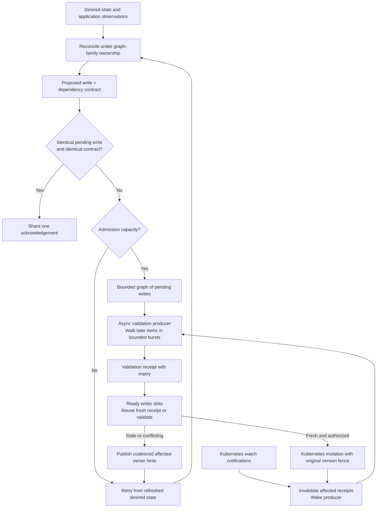
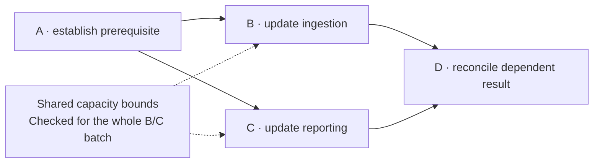

# Kubernetes write pipeline

Polyad queues decisions with their observed dependencies, validates them ahead of
dispatch, and returns stale decisions to reconciliation. A request is not a durable
instruction to replay an old patch until it succeeds. Desired state and the existing
shared reconciliation streams remain the source of recoverable work.

## Table of contents

- [From decisions to writes](#from-decisions-to-writes)
- [Dependency contracts](#dependency-contracts)
- [Validation producer and dispatcher](#validation-producer-and-dispatcher)
- [Kubernetes watch notifications](#kubernetes-watch-notifications)
- [Duplicates and revised decisions](#duplicates-and-revised-decisions)
- [Dependencies and ordering](#dependencies-and-ordering)
- [Configuration](#configuration)
- [Failure and cancellation](#failure-and-cancellation)
- [Scope and consistency limits](#scope-and-consistency-limits)

## From decisions to writes



Reconciliation, validation and dispatch run as bounded async worker roles on the
existing operator event loop. Blocking Kubernetes calls use the existing thread
executor. Validation performs reads; writers send mutations. No extra Flask
application or queue service is introduced.

## Dependency contracts

Graph reconciliation captures the resources and collections it reads across its
local and remote Kubernetes adapters. Each pending write receives an independent
snapshot of that read set. The contract retains private hashes, resource keys and
affected graph-owner keys. It retains no resource bodies or Secret values and is
not stored in Dragonfly or PostgreSQL.

The hashes include UID, specification, readiness/status, ownership, deletion state,
annotations and other observed content. They exclude `resourceVersion` and
`managedFields` bookkeeping; the mutation's separate original resource-version
fence remains mandatory for a queued update. This distinguishes a replaced object
from the same object and avoids interpreting version-only bookkeeping as semantic
dependency drift. Status changes are conservatively relevant.

A collection contract includes member names and each member's hash. It detects
new or missing children and rules, regardless of list ordering. A named GET that
returned 404 records **expected absence**, so a later creation can also invalidate
the decision. Captured TTL grants and throughput samples also carry their earliest
expiry, which can invalidate a receipt without any resource change.
Paginated, incomplete collections fail closed; a contract is limited
to 16,384 retained named observations across its reads.

The first observation establishes the expectation. A later read cannot silently
replace it. Only acknowledged effects of the same reconciliation advance its own
contract, including changes to observed collection members. Deletion receipts and
unsupported collection selectors require another refreshed pass before further
effects; a DELETE acknowledgement does not prove garbage collection completed.

Root pool management and the Dragonfly scaling loop also capture decision inputs.
Python extensions making decisions directly through `API` can use
`polyad.operator.coordination.contracts.capture_decision(api, graph_key)` around
their reads and writes. Calls outside a captured decision still receive bounded
admission, pending-conflict checks and queued target-version checks, but the adapter
cannot infer dependencies the caller never supplied or read through it.

## Validation producer and dispatcher

With an active first write, the validator can check the second, third, fourth and
later pending items. Each pass prioritizes invalidated or expired receipts, then
uses the configured burst and available window for later items. It revisits the
queue periodically and wakes on relevant notifications. A receipt expires from
the **start** of validation, including time spent reading Kubernetes.

The dispatcher reuses a receipt only while it is fresh and has not been invalidated.
Otherwise it joins an ongoing validation or performs a new one. Slow validation
that exhausts the entire window cannot authorize dispatch. The ownership check is
always performed immediately before transport, even when dependency validation
was already completed by the producer.

Starting and finishing a known write invalidates receipts that depend on its target
or a collection containing that kind and namespace. An unrelated write does not
invalidate a named dependency. A receipt cannot authorize another mutation while
a relevant known write is still in flight, including across captured adapters.
An operation whose target cannot be identified before transport, such as a
`generateName` creation, conservatively invalidates all receipts using that adapter.

Invalidated candidates retain their original contracts. Refreshing validation
does not revise their intent: if observations differ, the candidate must return to
reconciliation. The producer stops and joins its outstanding reads when the last
pending candidate leaves.

## Kubernetes watch notifications

Kopf resource-watch notifications invalidate affected validations and wake the
producer. Watches include graph resources, definitions and native graph children;
optional mesh and capacity kinds follow their capability flags. Native-resource
events publish their graph-owner keys, not requests for Polyad to reconcile the
native resource independently. Chart RBAC includes the necessary watch permissions.

These are Kubernetes API resource-watch notifications, rather than Kubernetes
`Event` objects. They are hints to reread authoritative state; an event payload
never grants mutation authority. Repeated hints are coalesced by the existing
shared reconciliation streams. They do not bypass reserved-graph filtering in
downstream application event streams.

Registered remote inventory scans also invalidate affected receipts. Remote
dependencies and changes missed during watch disconnects remain covered by
periodic validation and dispatch-time expiry checks. The root continues to route
remote recovery through that cluster's root-coordinated work stream.

## Duplicates and revised decisions

Before capacity admission, Polyad checks for an identical pending write. Equality
requires the same target, method, subresource, parameters, payload and captured
dependency contract, including its source/recovery scopes and any planner admission.
Identical calls share
one queue entry and one result; callers receive separate response copies.

Matching the resource name is insufficient. A change based on different graph
assumptions is a different decision, even if it happens to produce the same patch.
Differing pending writes to one object invalidate both candidates and require
reconciliation. They are not summed or merged by field.

New observations can change the required action. For example, a queued change from
three to four replicas may no longer be appropriate after demand falls. The old
contract becomes stale; reconciliation computes and submits the newly appropriate
target. This replacement is a **new validated decision**, rather than an edit to
an old queued payload. Arrival order alone does not override local scaling consent,
root authority, GraphRules or competing policies.

## Dependencies and ordering

[Mutation plans](mutations.md#ordering-and-evidence) establish ordering from declared
effects, preconditions, explicit `after` dependencies and shared budgets. Concrete
writes enter a bounded NetworkX directed acyclic graph. Its edges order dependent
work; ready independent vertices may occupy separate writer slots.

The decomposition concerns **planned changes**, including their shared constraints,
not merely disconnected parts of the application's network. Even a connected work
graph can expose independent branches:



B and C can run together after A only if their complete effects do not conflict
and their shared budgets hold for every completion order. D waits for both. In
this diagram, declared effects and completion preconditions must describe the
actual resources and readiness requirements; drawing separate boxes is not proof.

`execute_mutations` carries its freshly checked batch approval into each concrete
write. Parallel transport additionally requires declared scopes covering each
whole Kubernetes target object, separate mutation identities, and no overlap with
captured resource or collection dependencies. Field-only declarations cannot
bypass object-level resource-version conflicts. Separate plan invocations,
unmodeled effects and ordinary API calls retain conservative ordering. Existing
whole-topology rewrites retain their incomplete effect declaration and execute
serially; increasing worker limits does not change that declaration.

Independent ready writes can bypass a waiting sibling whose predecessors are
unfinished. The compiler handles explicit ordering before transport admission;
the dispatcher does not infer precedence from patch bodies or reorder a stale
patch to make its old assumptions appear valid. Planner callbacks still own their
graph-family coordination and shared-budget boundary; an approval is not a lease.

If A changes state that B depends on, B needs renewed reasoning against A's result.
The subsequent plan may order A before a revised B. Creation followed by readiness,
capacity release followed by consumption, and child deletion before parent cleanup
require their own declared completion conditions. Independent changes may share a
planner batch only when their combined constraints permit it. Cyclic declared
dependencies are rejected by the planner; invalidated work returns for a new pass,
which may itself remain blocked while external state continues to change.

## Configuration

```yaml
operator:
  writeQueue:
    maxInFlight: 1
    maxPending: 1
    validationIntervalSeconds: 1
    validationWindowSeconds: 5
    validationBurst: 8
    validationWorkers: 1
    reconciliationWorkers: 1
```

| Setting | Bounds | Meaning |
| --- | --- | --- |
| `maxInFlight` | Integer 1–32 | Writer slots per adapter; higher limits only overlap independent approved mutations |
| `maxPending` | Integer 0–128 | Extra admission capacity beyond writer slots; dependent items can still wait even with spare slots |
| `validationIntervalSeconds` | Number 0.01–60, at most the window | Maximum pause between producer passes; notifications wake it sooner |
| `validationWindowSeconds` | Number 0.01–60 | Maximum reusable receipt age; shorter windows add reads and reduce tolerated unobserved drift |
| `validationBurst` | Integer 1–128 | Candidates examined per background pass; does not increase mutation concurrency |
| `validationWorkers` | Integer 1–32 | Concurrent candidate validations per adapter, shared by producer and dispatch checks |
| `reconciliationWorkers` | Integer 1–32 | Local refresh workers and remote deliveries per cluster; same-key follow-ups and graph-family duties remain ordered |

Defaults permit one active operation plus one waiter per adapter. Raising
`maxPending` allows bounded bursts; overflow returns retryable `429` without
retaining another payload. Duplicate calls can join an existing entry even when
capacity is full. Total concrete admission is bounded by `maxInFlight + maxPending`.
Queue gauges include active validation until transport starts, so `queued` can
reach that total while `inFlight` is zero. Limits apply per adapter, not as a
cluster-wide cap; additional operator replicas and remote adapters add capacity.

These are Python runtime settings; Helm is an optional way to configure them when
deploying the operator. Helm projects them as `POLYAD_WRITE_MAX_IN_FLIGHT`,
`POLYAD_WRITE_QUEUE_MAX_PENDING`, `POLYAD_WRITE_VALIDATION_WORKERS`,
`POLYAD_RECONCILIATION_WORKERS`,
`POLYAD_WRITE_VALIDATION_INTERVAL_SECONDS`, `POLYAD_WRITE_VALIDATION_WINDOW_SECONDS`
and `POLYAD_WRITE_VALIDATION_BURST`. The settings apply to local and remote adapters
in that process and are inherited by root-managed operator worker templates. See
the typed [tuning reference](../../charts/polyad/values-tuning.reference.yaml).
Deployments without Helm can set the same environment variables directly.

Reconciliation workers prepare decisions and invoke the mutation planner as part
of each attempt; the planner is not another independent writer. Validation workers
check immutable contracts in bounded batches and writers consume their receipts.
Raising one limit does not implicitly raise the others. Same-key notifications
received during reconciliation coalesce into a later pass rather than overlapping
that resource's current attempt.

## Failure and cancellation

| Situation | Behavior |
| --- | --- |
| Missing queued PATCH/PUT target | Refuse dispatch with a retryable conflict and refresh affected graph owners |
| Target disappears after validation and PATCH/PUT returns 404 | Convert the failed write into a retryable conflict; never treat it as successful deletion |
| Target version changed or Kubernetes returns 409 | Discard the stale decision; retain the original version fence |
| Missing DELETE target | Preserve idempotent deletion; no resurrection or recreation |
| Dependency drift, unavailable reads or expired validation | Stop the candidate and publish coalesced affected-resource/owner hints |
| Queue full | Reject excess work with 429; retry from current desired state |
| Duplicate waiter cancelled | Other callers and the admitted change continue |
| Original admitted caller cancelled | Join any active transport; duplicate waiters receive a retryable conflict |

Recovery publishes keys for the initiating graph and reconcilable observed
resources/owners. It does not recursively reconcile another graph while holding
the write slot. The original failed shared-stream delivery remains unacknowledged
and retryable, including if publishing additional hints fails. Periodic producers
retry on their next pass.

Cancelling a coroutine cannot undo a request already sent to Kubernetes. The
adapter retains its write slot until that transport finishes, including repeated
cancellation. There is no automatic rollback or replay of an uncertain payload.

## Scope and consistency limits

Validation receipts are local, bounded freshness evidence, not multi-resource
transactions. An external change may arrive after validation but before its watch
notification. The configurable window explicitly limits reuse; original
server-side target preconditions and existing graph-family leases still apply.
Cross-operator coordination continues through those leases and Kubernetes fences,
not a shared cache of validation receipts.

Decision hashes cover observed Kubernetes state. They cannot establish arbitrary
application side effects or prove future readiness. Known temporary-connection
and throughput-sample deadlines are enforced; other external measurements need an
explicit dependency or expiry supplied by their decision adapter. The validator does not recompute a new topology or choose a new policy
inside the transport queue; that work belongs to refreshed reconciliation.

[Decision logs](../operations/tracing.md#decision-and-conflict-logs) distinguish
`write_coalesced`, `write_deferred`, dependency drift and capacity rejection without
logging bodies or private digests. [Write gauges](../operations/metrics.md) continue
to report actual admitted work rather than duplicate callers.
