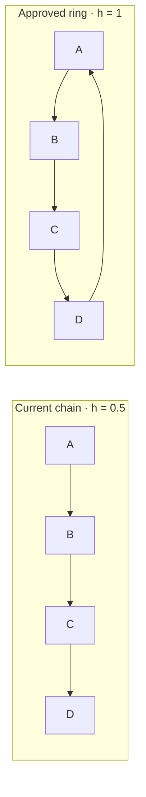
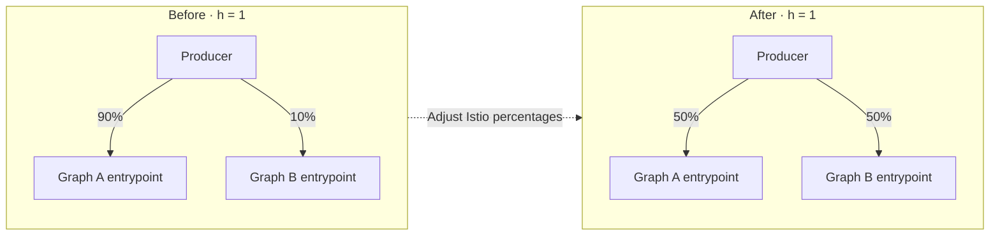
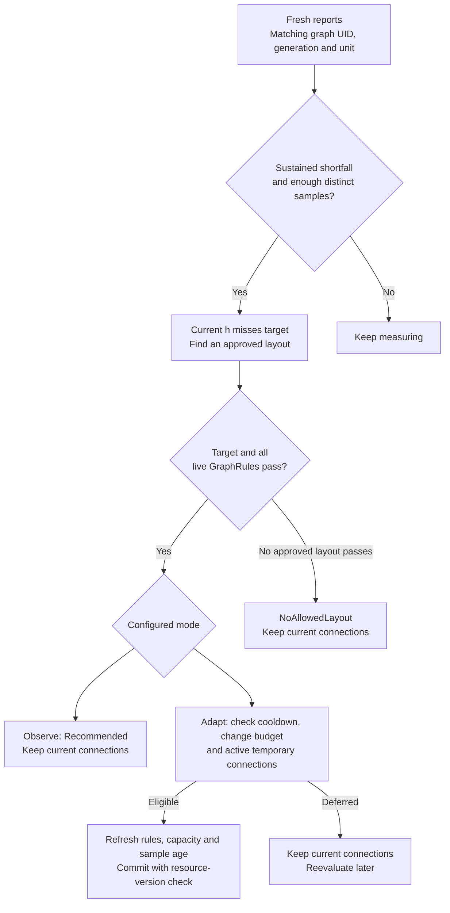
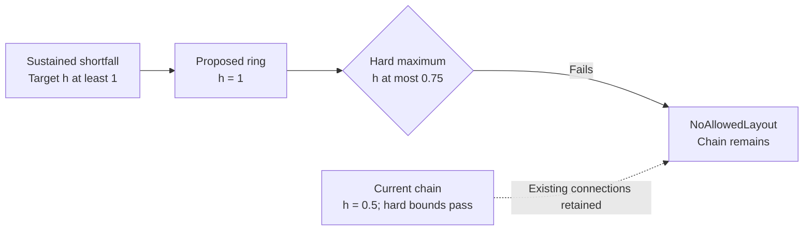
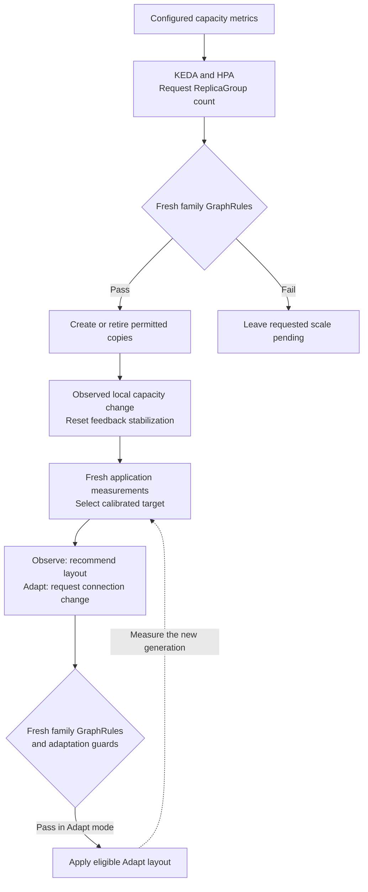
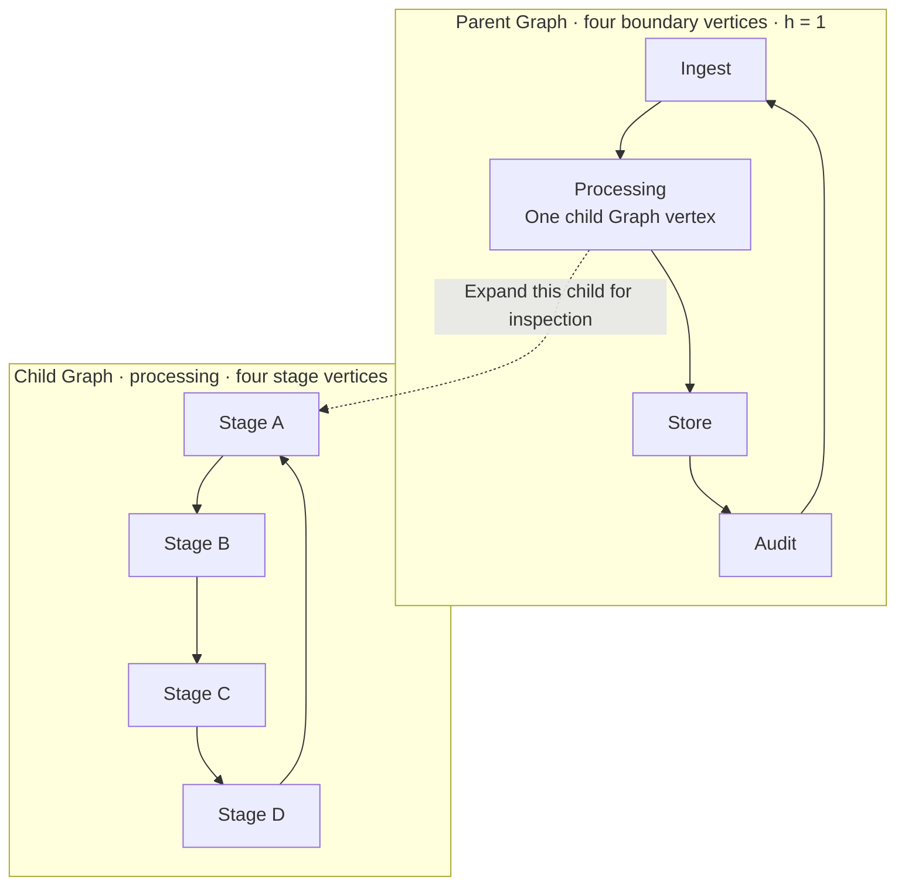
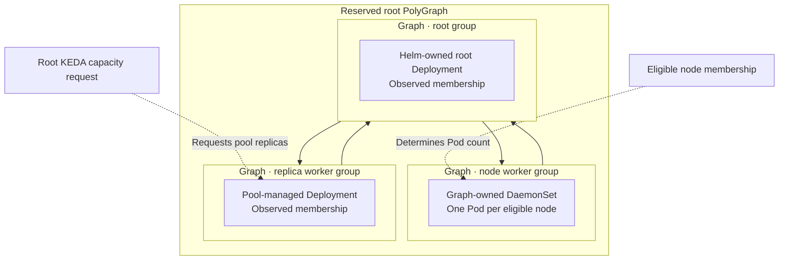

# Comparing Cheeger bounds and throughput targets

Polyad uses the same structural Cheeger measurement for two different policies:
**GraphRules define permitted topology**, while **throughput policies select a
desired topology in response to measured application demand**.
[Soul searching](soul-searching.md), Polyad's bounded topology optimizer,
implements the second policy with `Observe` and `Adapt` modes.

Polyad tracks application-reported `offeredPerSecond` and `completedPerSecond`
alongside `currentCheeger` and the selected `target` in `status.throughput`.
The selected demand signal (offered rate by default) selects an administrator-calibrated Cheeger target; a sustained
completion shortfall can trigger a recommendation or an admitted layout change.
The target remains a structural range, while the reported rates measure
application throughput. Meeting that range does not guarantee a completion rate.
Soul searching can also rebalance [traffic percentages](traffic-balancing.md)
within the same bounds, including Headroom adjustments before an aggregate shortfall.
With [`trigger: Demand`](load-profiles.md), approved profiles can change connections,
traffic and capacity lookahead under sustained positive demand while completed
throughput keeps up. Hard rules and replica-scaling ownership remain independent.

## Table of contents

- [One metric, two responsibilities](#one-metric-two-responsibilities)
- [The same graph, different decisions](#the-same-graph-different-decisions)
- [Rebalancing traffic without changing Cheeger](#rebalancing-traffic-without-changing-cheeger)
- [Observe, Adapt and conflicting bounds](#observe-adapt-and-conflicting-bounds)
- [Coordinating topology with replica scaling](#coordinating-topology-with-replica-scaling)
- [Nested Graphs and subgraph replication](#nested-graphs-and-subgraph-replication)
  - [What each boundary measures](#what-each-boundary-measures)
  - [Replicating the whole child](#replicating-the-whole-child)
  - [When both levels use Soul searching](#when-both-levels-use-soul-searching)
- [Hierarchy and reserved operator graphs](#hierarchy-and-reserved-operator-graphs)
- [Configuration and observations](#configuration-and-observations)

## One metric, two responsibilities

For a simple undirected graph, Polyad measures edge expansion:

```text
h(G) = min |edges crossing the cut| / min(|S|, |V minus S|)
       over nonempty proper vertex subsets S
```

A small value indicates a sparse connection between relatively large parts of
the graph. This measurement counts edges and vertices; it does not account for
bandwidth, message sizes, CPU capacity, processing costs or edge direction.

| Question | Hard GraphRule bounds | Application throughput targets |
| --- | --- | --- |
| Where configured? | `GraphRule.spec.cheeger.minimum` / `maximum` | `Graph.spec.throughput.tiers[].cheeger` or the equivalent PolyGraph field |
| What sets the bounds? | Administrator policy | Administrator-calibrated demand tiers; input defaults to `offeredPerSecond` or an explicitly configured signal |
| Which relation is measured? | The rule's selected relation; use `relation: connections` for these comparisons | The boundary's logical `connections` relation |
| When evaluated? | During admission and before graph-managed changes, including scaling | After sustained shortfall, positive demand with `trigger: Demand`, or Headroom imbalance under positive demand |
| What does it orchestrate? | Permits or blocks an otherwise requested change | Recommends approved connection layouts or bounded traffic splits, or applies them in Adapt mode |
| Can it change replicas? | Constrains scaling through Polyad's admission path | No; it changes connections or routing percentages |
| How does it apply through a hierarchy? | Referenced/inherited rules and namespace rules govern applicable boundaries | Each Graph or PolyGraph configures its own feedback policy |
| What if the application misses its throughput goal? | The hard bounds still apply | An eligible approved layout may be considered; the hard bounds still apply |

For the **same boundary and projection**, an adapted layout must satisfy the
intersection of the ranges. Hard bounds `[0.5, 1.5]` and a selected target
`[1, 2]` permit values in `[1, 1.5]`.

This interval comparison is only part of admission. A GraphRule may measure a
different relation, inherited rules may constrain other boundaries, and live
activation instances expand the structural projection. Every applicable rule
must pass its own fresh evaluation.

## The same graph, different decisions

Consider four service vertices. The chain has `h = 0.5`: splitting `{A, B}` from
`{C, D}` crosses one edge for two vertices on the smaller side. The ring has
`h = 1`: its sparsest balanced cut crosses two edges.



Arrows show declared data flow; the Cheeger calculation uses their undirected
projection. The application must support both approved layouts and update its
routing when it receives topology events.

Suppose the hard range is `[0.5, 1.5]`. Both layouts are structurally allowed.
GraphRules alone will not replace the chain because traffic increased.

Now suppose the application reports **200 records/s offered and 120 records/s
completed**. A calibrated tier starting at 100 records/s selects a target of
`[1, 1.5]`. With `shortfallRatio: 0.9`, the completed rate is below the required
180 records/s. Once fresh, distinct samples establish the configured duration
and sample count, feedback can consider the ring.

| Policy in use | Result for this example |
| --- | --- |
| Hard bounds alone | Chain remains allowed; no automatic connection change |
| Hard bounds plus `Observe` | Ring is recommended; chain remains in place |
| Hard bounds plus `Adapt` | Ring may replace the chain after all admission and timing checks pass |

The example does **not** predict the ring's resulting records/s. Its target and
layout should come from application load tests, and fresh measurements are needed
after the change to determine whether it helped.

## Rebalancing traffic without changing Cheeger

The same connections can carry different shares of application work. Here, a
producer and two downstream Graph nodes form a three-vertex boundary with
Cheeger `1` in both configurations:



`trafficMode: Tiers` selects an administrator-calibrated split after sustained
shortfall by default; `trigger: Demand` also allows changes while throughput keeps up.
`Headroom` uses each destination's completed throughput plus reported
spare capacity and can rebalance before aggregate throughput falls. Both keep
the selected Cheeger target, hard rules, destination bounds, stabilization and
shared change budget. Neither changes the number of replicas.

Routing percentages are separate from the unweighted structural measurement;
even a zero-percent target keeps its declared edge until that connection is
removed. The same routing mechanism supports Workload, Daemon, Graph, PolyGraph
and nested ReplicaGroup entrypoints. See [traffic balancing](traffic-balancing.md)
for local Service requirements, configuration and reporting examples.

## Observe, Adapt and conflicting bounds

Observe and Adapt share sample validation, stabilization, target selection and
candidate rule checks. Their difference is whether an approved recommendation can
be committed. This diagram follows a connection-layout change; percentage
adjustments use the same admission and timing guards with their selected routing mode.



If the current graph already meets the selected Cheeger target but application
throughput remains low, feedback reports `ThroughputShortfall` without adding
connections. Processing capacity or another application bottleneck may need
attention. Below the first demand tier, or when completed work meets the configured
ratio, feedback does not restructure. It also does not automatically remove edges
just because traffic falls.

For a conflict example, tighten the hard maximum to `0.75` while keeping the
application target minimum at `1`:



The conflicting target cannot authorize the ring in either mode. A hard upper
bound can deliberately limit connectivity even when an application target favors
more edges. Administrators must resolve the policy conflict or supply a different
feasible target/layout; the operator does not weaken GraphRules automatically.
`NoAllowedLayout` also covers cases where the ranges overlap but none of the
approved layouts satisfies all constraints.

## Coordinating topology with replica scaling

KEDA/HPA determines requested capacity from its configured metrics. Throughput
feedback determines whether to change approved connections. These operations have
separate triggers and must coordinate through fresh state.



For example, a four-copy ReplicaGroup Ring has `h = 1`; a six-copy Ring has
`h = 2/3`. A hard minimum of `1` blocks the six-copy topology even if KEDA requests
more capacity. Throughput feedback on an enclosing Graph does not rewrite the
ReplicaGroup's `connectivity.mode` to get around that rule. Feedback policies are
configured on Graphs and PolyGraphs; ReplicaGroups retain their declared
connection modes and scaling constraints.

To use graph admission for Pod scaling, target a ReplicaGroup whose Daemon
definition has `replicas: 1`. Direct HPA/KEDA writes to a generated Deployment or
StatefulSet bypass this admission path. See
[constraints before scaling](replication.md#constraints-before-scaling).

Configure adaptation to allow capacity changes and new measurements to settle.
The controller resets stabilization when it observes changes in its local
execution subtree, including native replica intent and DaemonSet node eligibility.
Cooldowns and rolling change budgets also limit repeated connection changes.

## Nested Graphs and subgraph replication

A child Graph is **one vertex in its parent**, even when the child contains many
workloads or replicas. The parent and child each have a Cheeger measurement of
their own declared connections. Polyad does not flatten their vertices into one
graph, add their Cheeger values, or use a good value at one level to compensate
for a failing value at another.

### What each boundary measures

In this example, the parent sees four vertices: `ingest`, `processing`, `store`
and `audit`. Opening the `processing` vertex reveals a separate four-stage Graph.
Both boundaries happen to form rings with Cheeger `1`; their values are computed
independently. The dashed arrow only expands the illustration, not the topology.



| Change | Parent Cheeger | Child Cheeger |
| --- | --- | --- |
| Increase the native Pod replicas of a Daemon inside the child | Unchanged | Unchanged: the Daemon is still one vertex |
| Scale a ReplicaGroup contained inside the child | Unchanged | Unchanged if that group remains one child vertex; the group's own measurement may change |
| Replace the child's four-stage ring with a chain | Still `1` | Falls from `1` to `0.5` |
| Change the parent's ring to a chain | Falls from `1` to `0.5` | Still `1` |

These examples use the `connections` relation and ordinary persistent nodes.
[Pulse activations](../workloads/activation.md) are different: their live execution
instances expand the structural projection at the containing boundary, so they
can change its Cheeger measurement.

An unchanged parent Cheeger does not mean a change is automatically allowed.
The parent can also impose a recursive `expandedNodes` budget, and inherited or
namespace GraphRules can constrain the child. Every applicable check must pass.
`scope: Boundary` applies a referenced rule only at its selected boundary;
`scope: Subtree` also applies it independently within local descendants. See
[rule selection and measurement](graph-rules.md#selection-and-measurement).

### Replicating the whole child

A Graph reference does not have its own replica count. To replicate `processing`
as a complete unit, reference a ReplicaGroup whose template is the processing
Graph, as in the [Graph replica example](replication.md#example-graph-replicas).
The parent now contains that group as one vertex. This introduces a **third
boundary**, with a separate Cheeger measurement for connections between copies:

```text
Parent Graph                     sees one processing-group vertex
└── Processing ReplicaGroup      sees Graph copies 0, 1, 2, ...
    └── Each processing Graph    sees its own stages A, B, C, D
```

Suppose the group connects its copies in a Ring, and every copy contains the
four-stage ring above. KEDA requests a change from four copies to six:

| Measurement | Four copies | Six copies |
| --- | --- | --- |
| Parent Graph Cheeger | `1` | `1`: still the same four parent vertices |
| ReplicaGroup Cheeger | `1` | `2/3`: a balanced split crosses two edges for three copies |
| Cheeger inside each child Graph | `1` | `1`: each copy retains its own four stages |
| Parent `expandedNodes` | `24` = 4 parent + 4 copy + 16 stage vertices | `34` = 4 parent + 6 copy + 24 stage vertices |

A group bound of `cheeger.minimum: 0.75` blocks six copies, even though the parent
and every child pass their own Cheeger bounds. Independently, a parent budget of
`limits.expandedNodes: 30` also blocks that request. If the only Cheeger constraints
are on the parent and child Graphs, they do not implicitly impose a minimum on
the ReplicaGroup's copy connections; configure or inherit a rule for that boundary.

Polyad refreshes the local family, including ancestors, sibling instances,
replica sources and rules, before creating or retiring copies. A rejected request
can remain recorded as desired replicas while the existing execution stays in
place. It does not weaken another boundary's bound to make the count fit. See
[constraints before scaling](replication.md#constraints-before-scaling).

### When both levels use Soul searching

Each Graph may also have its own application throughput policy. Reports identify
one Graph instance by name, UID and generation; a parent report does not become
a child report. Calibrate each policy against that boundary's actual workload.
Passing every structural bound still does not guarantee application throughput.

Parent `Adapt` can replace connections between the parent's vertices. Child
`Adapt` can replace connections between the child's stages. Neither changes
replica counts, the other Graph's connections, or a ReplicaGroup's connectivity
mode. `Observe` only recommends changes at its own boundary.

Local parent and child mutations share the root graph family's lease and execute
in sequence. Before applying a proposal, Polyad refreshes the family and checks
all applicable hard rules. An observed child topology or capacity change resets
the parent's feedback stabilization, so it needs fresh, sustained measurements
before another adaptation. Separate cooldowns and change budgets still apply
at each Graph. The two application targets are not combined into one optimizer
or one global throughput promise.

For remote children placed through a PolyGraph, the destination enforces its
local graph family independently; these checks are not one cross-cluster atomic
transaction. See [cross-cluster rule scope](../deployment/multicluster.md#graphrules-cheeger-bounds-and-scaling).

## Hierarchy and reserved operator graphs

Each boundary has its own vertices. In a Graph they may represent services or
subgraphs; in a PolyGraph they may represent Graphs or further compositions.
Increasing replicas *inside* a child does not automatically change its parent's
Cheeger constant. The parent continues to see that child as one vertex.

Calibrate targets independently at each layer. Fresh local family checks enforce
the applicable rules; remote clusters retain their local rule enforcement. A
cross-cluster PolyGraph does not turn local measurements into one atomic,
cluster-wide throughput guarantee. Exact Cheeger evaluation defaults to
20 vertices per measured boundary; [budgets and search priorities are configurable](cheeger-tuning.md).

One reserved PolyGraph contains a Graph for each operator group, including the root:



DaemonSet worker pools follow eligible nodes and require `replicas: 1`; they
cannot be scaled by choosing a Pod replica count. Deployment worker pools retain
replica-based scaling through the root. These are capacity mechanisms, distinct
from the application feedback policy's connection and traffic changes.

The reserved hierarchy does not automatically opt the operator into application
throughput adaptation. `/v1/throughput` rejects reserved/internal targets, and
workload-facing event streams exclude the operator tree. See
[reserved graphs for node workers](../deployment/root-control-plane.md#reserved-graphs-for-node-workers).

## Configuration and observations

These excerpts show the two settings used in the chain/ring example. They belong
to separate resources; the Graph must reference the rule and declare its approved
layouts.

```yaml
# GraphRule.spec
enforcement: Referenced
scope: Boundary
relation: connections
cheeger:
  minimum: 0.5
  maximum: 1.5
```

```yaml
# Graph.spec, alongside nodes, connections and rules
throughput:
  mode: Observe # Adapt permits the approved layouts to be applied.
  unit: records
  tiers:
    - threshold: 100
      cheeger: {minimum: 1, maximum: 1.5}
  # Configure layouts before choosing Adapt; see the complete example below.
```

Use `status.structuralRules` for structural verdicts and
`status.throughput` for the selected target, current value, recommendation and
feedback phase, including `currentTraffic`, `targetTraffic` and `proposedTraffic`
when routing is configured. Check freshness and generation: stored status does not authorize
a future mutation. Successful adaptation increments generation, so the reporter
must refresh the graph identity before submitting its next measurement window.

For a complete manifest, reporting examples and all timing controls, see
[Soul searching policy configuration](soul-searching.md#configure-a-bounded-policy).
For rule scope, admission and every available structural constraint, see
[GraphRules](graph-rules.md).
