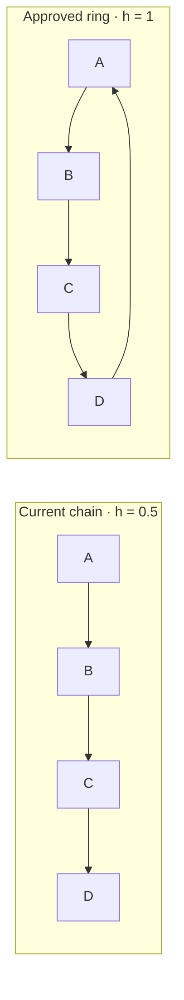
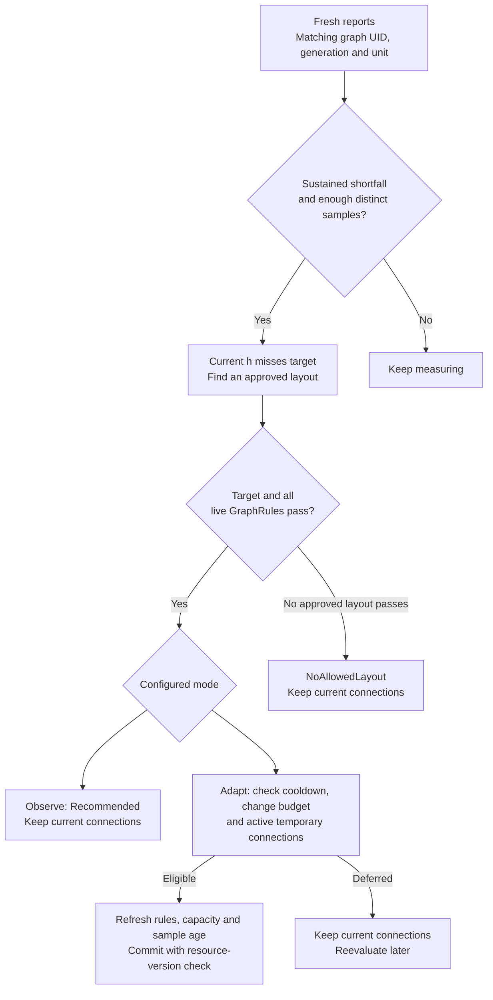
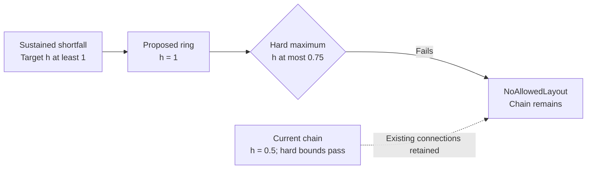
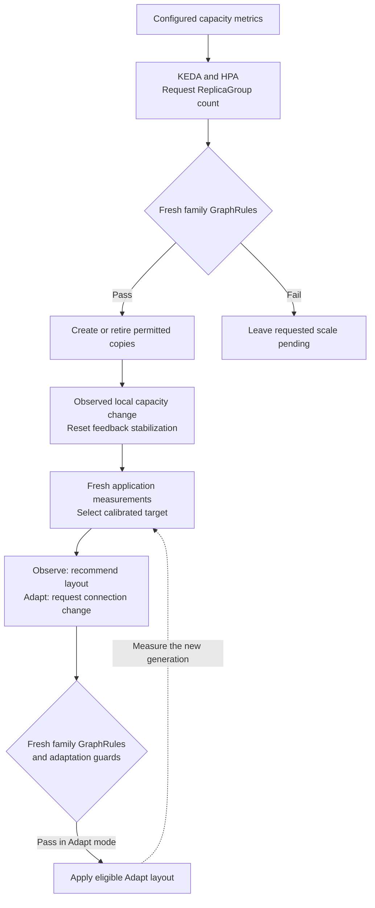
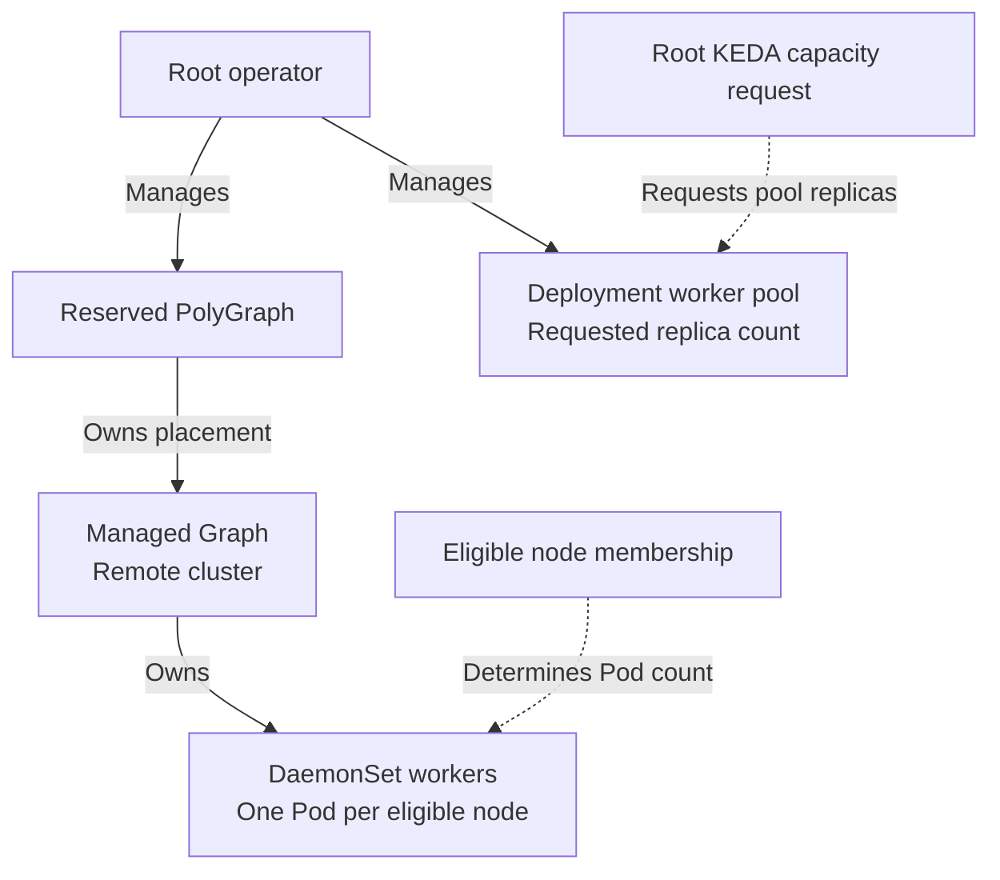

# Comparing Cheeger bounds and throughput targets

Polyad uses the same structural Cheeger measurement for two different policies:
**GraphRules define permitted topology**, while **throughput policies select a
desired topology in response to measured application demand**.
[Soul searching](throughput-feedback.md), Polyad's bounded topology optimizer,
implements the second policy with `Observe` and `Adapt` modes. Neither policy
computes a new Cheeger constant in records per second.

## Table of contents

- [One metric, two responsibilities](#one-metric-two-responsibilities)
- [The same graph, different decisions](#the-same-graph-different-decisions)
- [Observe, Adapt and conflicting bounds](#observe-adapt-and-conflicting-bounds)
- [Coordinating topology with replica scaling](#coordinating-topology-with-replica-scaling)
- [Hierarchy and reserved operator graphs](#hierarchy-and-reserved-operator-graphs)
- [Configuration and observations](#configuration-and-observations)

## One metric, two responsibilities

For a simple undirected graph, Polyad measures edge expansion:

```text
h(G) = min |edges crossing the cut| / min(|S|, |V minus S|)
       over nonempty proper vertex subsets S
```

A small value indicates a sparse connection between relatively large parts of
the graph. This measurement counts edges and vertices; it does not account for
bandwidth, message sizes, CPU capacity, processing costs or edge direction.

| Question | Hard GraphRule bounds | Application throughput targets |
| --- | --- | --- |
| Where configured? | `GraphRule.spec.cheeger.minimum` / `maximum` | `Graph.spec.throughput.tiers[].cheeger` or the equivalent PolyGraph field |
| What sets the bounds? | Administrator policy | Administrator-calibrated demand tiers, selected using reported `offeredPerSecond` |
| Which relation is measured? | The rule's selected relation; use `relation: connections` for these comparisons | The boundary's logical `connections` relation |
| When evaluated? | During admission and before graph-managed changes, including scaling | After fresh reports demonstrate a sustained application shortfall |
| What does it orchestrate? | Permits or blocks an otherwise requested change | Recommends an approved connection layout, or applies it in Adapt mode |
| Can it change replicas? | Constrains scaling through Polyad's admission path | No; it replaces boundary connections |
| How does it apply through a hierarchy? | Referenced/inherited rules and namespace rules govern applicable boundaries | Each Graph or PolyGraph configures its own feedback policy |
| What if the application misses its throughput goal? | The hard bounds still apply | An eligible approved layout may be considered; the hard bounds still apply |

For the **same boundary and projection**, an adapted layout must satisfy the
intersection of the ranges. Hard bounds `[0.5, 1.5]` and a selected target
`[1, 2]` permit values in `[1, 1.5]`.

This interval comparison is only part of admission. A GraphRule may measure a
different relation, inherited rules may constrain other boundaries, and live
activation instances expand the structural projection. Every applicable rule
must pass its own fresh evaluation.

## The same graph, different decisions

Consider four service vertices. The chain has `h = 0.5`: splitting `{A, B}` from
`{C, D}` crosses one edge for two vertices on the smaller side. The ring has
`h = 1`: its sparsest balanced cut crosses two edges.



Arrows show declared data flow; the Cheeger calculation uses their undirected
projection. The application must support both approved layouts and update its
routing when it receives topology events.

Suppose the hard range is `[0.5, 1.5]`. Both layouts are structurally allowed.
GraphRules alone will not replace the chain because traffic increased.

Now suppose the application reports **200 records/s offered and 120 records/s
completed**. A calibrated tier starting at 100 records/s selects a target of
`[1, 1.5]`. With `shortfallRatio: 0.9`, the completed rate is below the required
180 records/s. Once fresh, distinct samples establish the configured duration
and sample count, feedback can consider the ring.

| Policy in use | Result for this example |
| --- | --- |
| Hard bounds alone | Chain remains allowed; no automatic connection change |
| Hard bounds plus `Observe` | Ring is recommended; chain remains in place |
| Hard bounds plus `Adapt` | Ring may replace the chain after all admission and timing checks pass |

The example does **not** predict the ring's resulting records/s. Its target and
layout should come from application load tests, and fresh measurements are needed
after the change to determine whether it helped.

## Observe, Adapt and conflicting bounds

Observe and Adapt share sample validation, stabilization, target selection and
candidate rule checks. Their difference is whether an approved recommendation can
be committed.



If the current graph already meets the selected Cheeger target but application
throughput remains low, feedback reports `ThroughputShortfall` without adding
connections. Processing capacity or another application bottleneck may need
attention. Below the first demand tier, or when completed work meets the configured
ratio, feedback does not restructure. It also does not automatically remove edges
just because traffic falls.

For a conflict example, tighten the hard maximum to `0.75` while keeping the
application target minimum at `1`:



The conflicting target cannot authorize the ring in either mode. A hard upper
bound can deliberately limit connectivity even when an application target favors
more edges. Administrators must resolve the policy conflict or supply a different
feasible target/layout; the operator does not weaken GraphRules automatically.
`NoAllowedLayout` also covers cases where the ranges overlap but none of the
approved layouts satisfies all constraints.

## Coordinating topology with replica scaling

KEDA/HPA determines requested capacity from its configured metrics. Throughput
feedback determines whether to change approved connections. These operations have
separate triggers and must coordinate through fresh state.



For example, a four-copy ReplicaGroup Ring has `h = 1`; a six-copy Ring has
`h = 2/3`. A hard minimum of `1` blocks the six-copy topology even if KEDA requests
more capacity. Throughput feedback on an enclosing Graph does not rewrite the
ReplicaGroup's `connectivity.mode` to get around that rule. Feedback policies are
configured on Graphs and PolyGraphs; ReplicaGroups retain their declared
connection modes and scaling constraints.

To use graph admission for Pod scaling, target a ReplicaGroup whose Daemon
definition has `replicas: 1`. Direct HPA/KEDA writes to a generated Deployment or
StatefulSet bypass this admission path. See
[constraints before scaling](replication.md#constraints-before-scaling).

Configure adaptation to allow capacity changes and new measurements to settle.
The controller resets stabilization when it observes changes in its local
execution subtree, including native replica intent and DaemonSet node eligibility.
Cooldowns and rolling change budgets also limit repeated connection changes.

## Hierarchy and reserved operator graphs

Each boundary has its own vertices. In a Graph they may represent services or
subgraphs; in a PolyGraph they may represent Graphs or further compositions.
Increasing replicas *inside* a child does not automatically change its parent's
Cheeger constant. The parent continues to see that child as one vertex.

Calibrate targets independently at each layer. Fresh local family checks enforce
the applicable rules; remote clusters retain their local rule enforcement. A
cross-cluster PolyGraph does not turn local measurements into one atomic,
cluster-wide throughput guarantee. Exact Cheeger evaluation is capped at
20 vertices per measured boundary.

The reserved worker topology uses these composition mechanisms for ownership:



DaemonSet worker pools follow eligible nodes and require `replicas: 1`; they
cannot be scaled by choosing a Pod replica count. Deployment worker pools retain
replica-based scaling through the root. These are capacity mechanisms, distinct
from the application feedback policy's connection changes.

The reserved hierarchy does not automatically opt the operator into application
throughput adaptation. `/v1/throughput` rejects reserved/internal targets, and
workload-facing event streams exclude the operator tree. See
[reserved graphs for node workers](../deployment/root-control-plane.md#reserved-graphs-for-node-workers).

## Configuration and observations

These excerpts show the two settings used in the chain/ring example. They belong
to separate resources; the Graph must reference the rule and declare its approved
layouts.

```yaml
# GraphRule.spec
enforcement: Referenced
scope: Boundary
relation: connections
cheeger:
  minimum: 0.5
  maximum: 1.5
```

```yaml
# Graph.spec, alongside nodes, connections and rules
throughput:
  mode: Observe # Adapt permits the approved layouts to be applied.
  unit: records
  tiers:
    - offeredPerSecond: 100
      cheeger: {minimum: 1, maximum: 1.5}
  # Configure layouts before choosing Adapt; see the complete example below.
```

Use `status.structuralRules` for structural verdicts and
`status.throughput` for the selected target, current value, recommendation and
feedback phase. Check freshness and generation: stored status does not authorize
a future mutation. Successful adaptation increments generation, so the reporter
must refresh the graph identity before submitting its next measurement window.

For a complete manifest, reporting examples and all timing controls, see
[application throughput feedback](throughput-feedback.md#configure-a-bounded-policy).
For rule scope, admission and every available structural constraint, see
[GraphRules](graph-rules.md).
