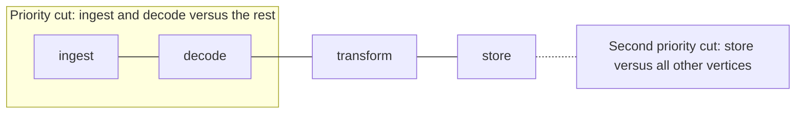
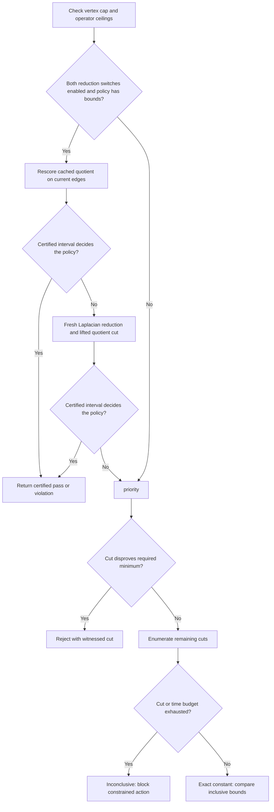

# Practical Cheeger tuning

Configure **hard structural bounds** through GraphRules and **application-driven
targets** through each Graph or PolyGraph's throughput policy. Both use the same
exact, unweighted edge-expansion calculation. Start with `Observe`, calibrate
targets against application measurements, then enable bounded `Adapt` changes
when the proposed layouts are useful.

## Table of contents

- [Choose who controls each setting](#choose-who-controls-each-setting)
- [Set useful structural bounds](#set-useful-structural-bounds)
- [Tune application feedback](#tune-application-feedback)
- [Try the configuration reference](#try-the-configuration-reference)
- [Tune the operator component graph](#tune-the-operator-component-graph)
- [Prioritize important cuts](#prioritize-important-cuts)
- [Understand computation and scale](#understand-computation-and-scale)

## Choose who controls each setting

| Surface | Who configures it | Effect |
| --- | --- | --- |
| `GraphRule.spec` | A policy administrator with Kubernetes rule-write permissions | Defines structural limits that admitted changes must respect |
| `Graph.spec.rules`, `PolyGraph.spec.rules`, `ReplicaGroup.spec.rules` | Application owners | Selects rules with `enforcement: Referenced`; namespace rules still apply |
| `Graph.spec.throughput`, `PolyGraph.spec.throughput` | Application owners through manifests or composition requests | Configures demand tiers, approved layouts, traffic adjustment and response timing |
| Helm `operator.cheeger` | Operator administrators | Sets deployment-wide vertex, cut-count and time ceilings and gates the optional reduction tiers; local policies may only narrow them |
| Helm `architecture.cheegerMinimum` / `cheegerMaximum` | Operator administrators | Constrains the optional distributed operator component Graph |

The composition API cannot create GraphRules. Throughput targets never relax
administrator rules. See [rule selection](graph-rules.md#selection-and-measurement)
and [composition requests](../apis/composition-requests.md).

## Set useful structural bounds

| Field under `GraphRule.spec` | Choice and consequence |
| --- | --- |
| `cheeger.minimum` | Nonnegative inclusive lower bound; raise it to reject sparse bottlenecks. Omit for no lower bound. |
| `cheeger.maximum` | Nonnegative inclusive upper bound on edge expansion; requires some sufficiently sparse cut. Omit for no upper bound. |
| `cheeger: {}` | Measure and report expansion without imposing a threshold; the computation cap still applies. |
| Omit `cheeger` | Disable this rule's Cheeger calculation. Other selected rules and throughput policies may still compute it. |
| `relation: connections` | Measure declared communication links; matches the throughput policy's projection. |
| `relation: admission` | Measure dependency links; the default when omitted. |
| `scope: Boundary` | Evaluate only the selected boundary when using a referenced rule. Useful when different layers need different bounds. |
| `scope: Subtree` | Also propagate to descendant boundaries; the default. A namespace rule independently selects every boundary regardless of scope. |
| `limits.nodes`, `limits.edges`, `limits.expandedNodes` | Bound local size, directed connections and recursive resource breadth separately from edge expansion. |

For four vertices, a chain has `h = 0.5`, a ring `h = 1`, and a full mesh `h = 2`.
A minimum of `0.75` admits the ring and rejects the chain. Adding a maximum of
`1.5` also rejects the mesh. Choose bounds that admit your initial topology;
otherwise the operator cannot start that graph. Bounds are finite numbers, not
percentages, and `minimum` must not exceed `maximum`.

A disconnected graph has `h = 0`; so do empty and one-vertex boundaries under
Polyad's convention. Inheriting a positive minimum onto an Independent
ReplicaGroup can therefore block scaling. Use the desired
[replica connectivity mode](replication.md#connections-between-copies) and
[evaluate each boundary separately](cheeger-orchestration.md#nested-graphs-and-subgraph-replication).

## Tune application feedback

These settings live under `spec.throughput` on Graphs and PolyGraphs:

| Setting | Default | How to choose it |
| --- | --- | --- |
| `mode` | `Observe` | Observe reports recommendations; Adapt may apply an approved layout, bounded traffic split or capacity profile. Omit the whole policy to disable feedback. |
| `trigger` | `Shortfall` | Choose `Demand` to prepare under sustained positive demand before completed throughput falls behind. |
| `demand` | Offered work per second | Select an exact application signal `name` and `unit`, such as queueDepth/jobs; see [defining demand](load-profiles.md#define-demand). |
| `tiers[].capacity` / `capacityCeiling` | Omitted | [Approved forecast depth and Pod budgets](load-profiles.md) within fixed graph and operator ceilings. |
| `unit` | Required | Use the same work unit for offered and completed rates, such as records or requests. |
| `tiers[].threshold` | Required | Calibrate increasing thresholds in the selected demand unit; the highest matching threshold selects its target. Below the first tier, no target applies. |
| `tiers[].cheeger.minimum` / `maximum` | At least one required | Select structural ranges whose approved layouts helped at that demand. Keep feasible overlap with hard bounds. |
| `layouts` | Empty | List complete, application-supported connection layouts in preference order. Required for automatic connection changes; Adapt can also operate on traffic splits alone. Node identities and admission dependencies stay fixed. |
| `trafficMode` | `Tiers` | Use calibrated tier percentages, or choose `Headroom` to use each destination's completed rate plus reported spare capacity. Headroom requires reports for every configured destination. |
| `tiers[].trafficWeights` | Empty | Set approved percentages for each configured route in Tiers mode; omit in Headroom mode. |
| `maxWeightStep` | `10` | Limit each destination's adjustment to 1–100 percentage points per action. Smaller steps redistribute traffic more gradually. |
| `shortfallRatio` | `0.9` | A completed/offered ratio below this threshold is a shortfall. Higher values react to smaller deficits; lower values tolerate more backlog. Valid range: greater than zero through one. |
| `sampleMaxAgeSeconds` | `60` | Set above the normal report interval plus expected delivery jitter. Also limits gaps in a continuous sequence. Range: 1–3,600. |
| `sustainedSeconds` | `60` | Lengthen to ignore bursts; shorten to respond sooner to sustained deficits. Range: 1–86,400. |
| `minSamples` | `3` | Require enough distinct observations to support the decision. Both sample count and duration must pass. Range: 2–1,000. |
| `cooldownSeconds` | `300` | Allow routing and workload capacity to settle before another successful topology change. Range: 1–86,400. |
| `maxChangesPerHour` | `2` | Bound successful connection, traffic and capacity changes together in a rolling hour independently of cooldown. Range: 1–60. |

For example, with reports every 30 seconds, `sustainedSeconds: 120` and
`minSamples: 4`, a fresh continuous sequence still needs to span two minutes.
Four reports alone do not authorize a change. Keep topology adaptation slower
than ordinary workload autoscaling; capacity changes reset stabilization.

If the current graph meets the selected target but completed throughput remains
low, [traffic balancing](traffic-balancing.md) can still redistribute requests.
With no remaining approved connection or traffic adjustment, the controller
reports `ThroughputShortfall`. It does not increase replicas. Investigate
processing capacity, routing and downstream services using the actual application
measurements. Low demand alone does not automatically remove connections. See
[Soul searching bounds and guards](soul-searching.md#bounds-observations-and-scalability).

## Try the configuration reference

[`examples/cheeger-tuning.yaml`](../../examples/cheeger-tuning.yaml) supplies a
four-stage graph, a referenced rule and two demand tiers. It begins with a chain
and can recommend a ring or mesh while respecting the hard interval `[0.5, 2]`.

```bash
kubectl -n workloads apply -f examples/cheeger-tuning.yaml
```

Use the namespace watched by your operator. Creating the example's GraphRule
requires policy-administrator access. The included workers serve health responses;
replace them with your application and
[report its measured rates to Soul searching](soul-searching.md#report-measurements).
Calibrate these example thresholds against the workers' measured capacity.
Connections describe data flow; applications must implement the approved routing.

Inspect `status.structuralRules[].measurements.cheeger` for hard-rule measurements
and `status.throughput` for offered/completed rates, the selected target,
recommendation and decision phase. Start in Observe. Enable Adapt only after
checking recommendations against actual completion rates and latency under load.

## Tune the operator component graph

The [distributed component chart](../deployment/components.md) exposes both bounds:

```yaml
architecture:
  cheegerMinimum: 1
  cheegerMaximum: 1
```

The minimum defaults to `1` and accepts values from `0` through `1`. The optional
maximum defaults to `null`, meaning no upper bound. When set, it must be at least
`1` to admit the chart's initial three-component chain. A maximum of `1` excludes
a fully connected three-component graph, whose expansion is `2`. The separate
connected-shape rule still applies if the minimum is lowered to zero.

These settings affect the component boundary in Distributed mode. They do not
set defaults for application GraphRules, child ReplicaGroups or throughput tiers.
Component KEDA demand and `architecture.expandedNodes` control capacity separately.
Use the typed [component reference values](../../charts/polyad/references/values-components.reference.yaml)
with the installation prerequisites in the component guide.

## Prioritize important cuts

A **cut** divides the boundary's vertices into two sets. If a particular handoff
is latency-sensitive, carries high application demand, or has bottlenecked before,
put its vertices in `priorityCuts`. List one side; Polyad derives the other.
The declaration order is the priority order. Complementary and repeated cuts are
only evaluated once.

```yaml
# Under GraphRule.spec, alongside cheeger; or under Graph/PolyGraph.spec.throughput.
cheegerComputation:
  priorityCuts:
    - [ingest, decode] # Check this stage boundary first.
    - [store]          # Then check the storage service's connections.
  maxVertices: 20
  maxCuts: 524287
  timeoutSeconds: 5
```



These preferences direct **exact-search effort**. They do not assign weights to edges,
ignore other parts of the graph, or change the Cheeger definition. After preferred
cuts, exhaustive search covers every remaining partition. A cut with a ratio
below the hard minimum proves rejection immediately; successful minimum checks
still require exact verification. Partial search can identify a likely bottleneck
but cannot certify that there is no worse cut elsewhere.

At most 64 preferred subsets are allowed, each with distinct, nonempty vertex
names. Use the names in the measured boundary; for a parent Graph this means its
subgraph node names, not workloads hidden inside them. A subset whose names are
absent, or which contains the whole boundary, is skipped and counted in
`skippedPriorityCuts`. This lets inherited rules visit differently named children
without silently treating a partially matching subset as the requested cut.

## Understand computation and scale

The default ceiling is **20 vertices per measured boundary**; it is configurable.
Exhaustive enumeration takes `2^(n-1)-1` distinct cuts for a connected graph:
524,287 at 20 vertices and 536,870,911 at 30. Disconnected graphs are recognized
without enumeration. Priority cuts can make rejection much faster, but do not
reduce the worst-case cost of proving the exact constant.

Operator administrators set deployment-wide ceilings in Helm. Existing behavior
remains exact-only unless the administrator and an individual policy both opt in:

```yaml
operator:
  cheeger:
    maxVertices: 22
    maxCuts: 2097151
    timeoutSeconds: 15
    reduction:
      enabled: true
      maxVertices: 256
      components: 4
      supernodes: 8
      cache: true
      cacheEntries: 128
      maxEdgeChurn: 0.1
```

The cluster switch grants permission and establishes ceilings; it does not change
any GraphRule or throughput policy by itself. A policy author then requests the
feature below `cheegerComputation`:

```yaml
cheegerComputation:
  reduction:
    enabled: true
    maxVertices: 128
    components: 3
    supernodes: 6
    cache: true
    cacheEntries: 64
    maxEdgeChurn: 0.05
```

Every requested value must fit the operator ceiling. This separation lets a
cluster administrator enable the implementation without silently changing
application admission behavior, while colleagues can opt individual graph
boundaries into it after studying their error and cost profiles.

This permits a complete 22-vertex enumeration if it also finishes within the time
budget. Raising the vertex cap alone does not raise the cut or time budgets.
Benchmark representative boundaries before increasing these ceilings. They are
per calculation: multiple rules, descendants and up to eight candidate layouts
each consume work during reconciliation. Time checks are cooperative, between
priority cuts and every 256 exhaustive steps; preprocessing and scheduler delays
can extend the elapsed time beyond the configured budget.

Run the packaged microbenchmark on the same architecture and Python build used by
the operator before changing a ceiling:

```sh
python scripts/testing/benchmark_cheeger.py --sizes 12 16 18 20 --repeats 5
```

It verifies the exact path-graph answer and expected cut count on every repetition,
then reports minimum, median and maximum duration plus median cuts per second as
JSON. `--maximum-seconds N` provides an optional environment-specific regression
gate. Keep that threshold in deployment CI rather than treating one developer
machine's timing as portable across CPU architectures and shared runners.

The default distribution intentionally avoids a project-owned native extension:
the 20-vertex search fits its existing budget, while compiled wheels would add a
platform matrix for CPython, macOS, glibc, musl and ARM. Consider a native kernel
behind the same result contract only when repeated production
`durationSeconds` measurements or this benchmark show material reconciliation
CPU, or when a supported boundary must exceed 20 vertices. Keep the Python path
as the semantic oracle and source-install fallback.

The [deprecated PCA-guided reduction study](../../studies/cheeger-reduction-deprecated/README.md)
keeps PCA as a comparative heuristic. Production uses Laplacian spectral
coarsening instead: clusters define a quotient search, every candidate cut is
lifted and rescored on the original graph to certify an upper bound, and
`lambda_2 / 2` supplies a conservative lower bound. Cached entries contain only
cluster membership. Polyad always rescores them on current edges, reuses the
cached lower bound only when the edge set is identical, and starts a fresh
reduction when edge churn exceeds `maxEdgeChurn`.

The [strategy selection study](../../studies/cheeger-strategies/README.md) compares
these runtime tiers against exact references across churn, policy thresholds,
dimensions, quotient size, density, cache capacity and work budgets. It also
graphs an event sequence with service joins and departures. Its budget probes
count reduction work separately: current quotient loops are additional to the
exact-search `maxCuts` allowance, and cooperative timeouts do not preempt spectral
preprocessing. Benchmark these costs before increasing quotient size.

The selector follows three cost tiers. It first tries a cached quotient, then a
fresh spectral reduction, then exact enumeration. Given a policy interval and a
certificate `[L, U]`, `U < minimum` proves a lower-bound violation,
`L > maximum` proves an upper-bound violation, and `L >= minimum` together with
`U <= maximum` proves satisfaction. Every other result is uncertain and spends
more computation on the next tier. GraphRules can therefore admit or reject on
a certificate without pretending an approximation is an exact constant.
Throughput planning still obtains exact numeric constants because it compares
and publishes concrete current and proposed values; enabling reduction there
does not replace those values with an estimate.

| `cheegerComputation` field | Default | Allowed values and choice |
| --- | --- | --- |
| `maxVertices` | Inherit operator ceiling, normally `20` | Integer 2–4,096. Limits the boundary size before preprocessing. |
| `maxCuts` | Inherit operator ceiling, normally `524287` | Integer 1–2,147,483,647. Bounds distinct partitions evaluated, including preferred cuts. |
| `timeoutSeconds` | Inherit operator ceiling, normally `5` | Number 0.001–300. Bounds cooperative runtime, excluding queue wait. |
| `priorityCuts` | Empty list | Ordered subsets; up to 64, each containing 1–4,096 distinct names. |
| `reduction.enabled` | `false` | Requires the Helm administrator gate too; enables cached quotient, fresh spectral and exact fallback tiers. |
| `reduction.maxVertices` | `256` | Dense spectral safety cap, no greater than the operator value. Larger boundaries skip reduction and retain normal exact-budget behavior. |
| `reduction.components` | `4` | Nontrivial Laplacian eigenvectors retained, 1–64 and no greater than the operator value. |
| `reduction.supernodes` | `8` | Quotient vertices searched, 2–64 and no greater than the operator value. Quotient work is `2^(k-1)-1`. |
| `reduction.cache` | `true` | Reuse only cluster membership when the operator permits it; measurements are recomputed. |
| `reduction.cacheEntries` | `128` | Process-local LRU bound, 1–4,096 and no greater than the operator value. |
| `reduction.maxEdgeChurn` | `0.1` | Largest symmetric changed-edge fraction accepted for cached membership reuse, 0–1 and no greater than the operator value. |

Omit a top-level local numeric field, or set it to `null`, to inherit its operator
ceiling. Reduction fields use the defaults in the table and must all fit the
administrator's configured ceilings; attempting to exceed one blocks evaluation.
The fields are available on `GraphRule.spec.cheegerComputation` and
`Graph/PolyGraph.spec.throughput.cheegerComputation`. Hard-rule search and feedback
search have separate local preferences, under the same deployment ceilings.
For the Python API, pass `CheegerComputation(...)` as the second argument to
`graph_cheeger`; no Helm or environment settings are read by that library helper.



Non-exact computations never populate `measurements.cheeger` with an estimate.
Rule diagnostics include `cheegerComputation.exact`, `lowerBound`, `upperBound`,
`stage`, the witnessed `cut`, `evaluatedCuts` and a `reason`; rejection messages
distinguish budget exhaustion from a proven violation. Existing successful status may describe an
older observation: check phase and observed generation. Feedback reports
`status.throughput.phase: ComputationLimited` with diagnostics in `computation`,
and does not apply an uncertified layout. The Python helper raises
`CheegerIncomplete` instead of returning an approximate float.

Keep boundaries small and use nested compositions for larger applications.
`limits.nodes` can impose a separate structural size limit. Unweighted undirected
projection and inclusive tolerance `1e-9 × max(1, |measured|, |bound|)` are unchanged.
Direction, duplicate edges, self-loops and edge weights do not alter this
measurement. Each nested layer has its own measurement; values are not added
together or converted into a records-per-second guarantee.
