# Graph policies

<!-- toc:start -->
**Table of contents**

- [Configuration reference](#configuration-reference)
- [Selection and measurement](#selection-and-measurement)
  - [Enforcement](#enforcement)
  - [Scope](#scope)
  - [Relation](#relation)
- [Structural limits](#structural-limits)
  - [Nodes](#nodes)
  - [Edges](#edges)
  - [Depth](#depth)
  - [Breadth](#breadth)
  - [Fan-in](#fan-in)
  - [Fan-out](#fan-out)
  - [Cycle rank](#cycle-rank)
  - [Strong components](#strong-components)
  - [Expanded nodes](#expanded-nodes)
  - [Nesting depth](#nesting-depth)
- [Required shapes](#required-shapes)
  - [Acyclic](#acyclic)
  - [Connected](#connected)
  - [Tree](#tree)
  - [Planar](#planar)
- [Spectral bounds](#spectral-bounds)
  - [Maximum radius](#maximum-radius)
  - [Minimum connectivity](#minimum-connectivity)
  - [Maximum Laplacian](#maximum-laplacian)
- [Cheeger bottleneck bounds](#cheeger-bottleneck-bounds)
  - [Minimum Cheeger constant](#minimum-cheeger-constant)
  - [Maximum Cheeger constant](#maximum-cheeger-constant)
  - [Cheeger computation budgets and priorities](#cheeger-computation-budgets-and-priorities)
- [Network contracts](#network-contracts)
  - [Network scope](#network-scope)
  - [Directional isolation](#directional-isolation)
  - [Traffic within the graph](#traffic-within-the-graph)
  - [DNS access](#dns-access)
  - [Ingress and egress exceptions](#ingress-and-egress-exceptions)
  - [Peer selection](#peer-selection)
  - [Mesh identity and HTTP constraints](#mesh-identity-and-http-constraints)
  - [Combining network contracts](#combining-network-contracts)
- [Complete policy examples](#complete-policy-examples)
- [PolyGraphs and autoscaling](#polygraphs-and-autoscaling)
- [Admission, reporting and computation limits](#admission-reporting-and-computation-limits)
- [Application throughput targets](#application-throughput-targets)
<!-- toc:end -->

`GraphPolicy` defines which graphs Polyad may admit and which traffic their workloads
may exchange. Administrators create policies in the operator namespace; end-users
select optional policies through a graph's `spec.policies`, including in
[composition requests](../apis/composition-requests.md). Namespace policies apply automatically.
Every selected structural constraint must pass before new work is admitted or
a replica scaling action is dispatched. `PolyGraph` supports `spec.policies` exactly
as `Graph` and `ReplicaGroup` do.

Only policy administrators should have write access to `graphpolicies`. The operator's
Role grants read access, and the composition HTTP API cannot create or modify policies.
The operator enforces these policies during graph admission and when compiling
workload networking resources. Cluster admission controllers govern direct Pod
requests from other clients.

## Configuration reference

All fields below are under `spec`. Omitted bounds impose no constraint. Defaults
are applied by the operator even where the CRD does not persist a default value.

| Field | Default | Configuration |
| --- | --- | --- |
| [`enforcement`](#enforcement) | `Namespace` | `Namespace` or `Referenced`: how a policy is selected |
| [`scope`](#scope) | `Subtree` | `Boundary` or `Subtree`: whether a selected reference propagates |
| [`relation`](#relation) | `admission` | `admission` dependencies or `connections` for structural measurements |
| [`limits`](#structural-limits) | `{}` | Ten independent inclusive nonnegative integer maxima |
| [`shapes`](#required-shapes) | `[]` | Any combination of `acyclic`, `connected`, `tree`, `planar`; all must hold |
| [`spectrum`](#spectral-bounds) | Omitted | `maxRadius`, `minConnectivity`, `maxLaplacian`; optional nonnegative finite bounds |
| [`cheeger`](#cheeger-bottleneck-bounds) | Omitted | `minimum`, `maximum`; optional nonnegative finite edge-expansion bounds |
| [`cheegerComputation`](#cheeger-computation-budgets-and-priorities) | Inherit operator ceilings | `maxVertices`, `maxCuts`, `timeoutSeconds`, ordered `priorityCuts`; preferences never weaken bounds |
| [`network`](#network-contracts) | Omitted | Scope, isolation, peer, port and optional Istio restrictions |

The [GraphPolicy CRD](../../charts/polyad-crds/crds/graphpolicies.yaml) defines the Kubernetes
schema. Structural integer limits and spectral thresholds have a CRD maximum of
1,000,000. The Python types are `StructuralPolicy`, `Spectrum`, `Cheeger` and
`NetworkAccess`, exported from `polyad.graph`.

Diagrams below label passing and failing examples explicitly. Directed arrows
represent the selected relation unless a diagram describes policy selection or
network traffic. Undirected lines represent the simple projection.

## Selection and measurement

### Enforcement

`enforcement: Namespace` selects the policy independently at every executable
boundary in the namespace. `enforcement: Referenced` selects it when a graph names
it in `policies`, or inherits that reference from an ancestor. Missing policy references
block admission. A composition cannot opt out of namespace policies.

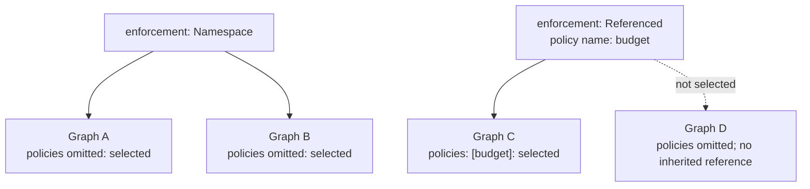

### Scope

`scope: Boundary` keeps a referenced policy local; `scope: Subtree` propagates it to
nested boundaries. Each boundary is measured separately. A namespace policy remains
mandatory with either scope because it is independently selected at every
boundary. Recursive measurements such as `expandedNodes` still include descendants
when the policy has `scope: Boundary`.

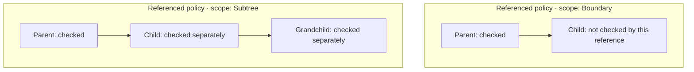

### Relation

`relation: admission` measures `requires` dependencies. `relation: connections`
measures declared data-flow connections, including those with no network ports.
The two relations are independent. Choosing a structural relation does not create
or restrict network traffic; `network` configures that separately.

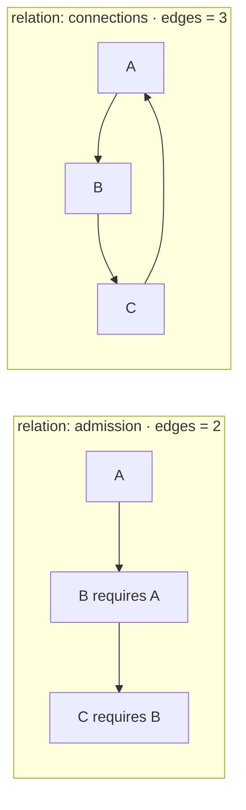

All vertices count, including isolated ones. Repeated edges collapse to one edge.
Directed edge and degree counts include self-loops. Admission is already acyclic;
cycles can arise in `connections`. For undirected measurements Polyad drops
self-loops, merges opposite edges and ignores weights. In particular, two opposite
directed edges become one undirected edge.

## Structural limits

With optional [cross-cluster PolyGraphs](../deployment/multicluster.md), a remote boundary is
one vertex in its parent's cluster. Recursive expansion and inherited policies stop
there. Its destination operator enforces that cluster's policies against local
descendants. Cheeger values describe each evaluated boundary's declared
structure; they do not measure network throughput across clusters.

Each `limits` field is an independent inclusive maximum: equality passes, and a
larger measured value fails. An SCC (strongly connected component) groups vertices
that can reach one another. Collapsing SCCs gives a condensation DAG, used for
`depth` and `breadth`. A nonempty DAG has one SCC per vertex.

| Field | Measurement | Diagram |
| --- | --- | --- |
| `nodes` | Vertices in the immediate boundary | [Nodes](#nodes) |
| `edges` | Distinct directed edges of the selected relation | [Edges](#edges) |
| `depth` | Number of earliest topological layers in the condensation DAG | [Depth](#depth) |
| `breadth` | Largest number of SCCs in an earliest topological layer | [Breadth](#breadth) |
| `fanIn` | Largest directed in-degree | [Fan-in](#fan-in) |
| `fanOut` | Largest directed out-degree | [Fan-out](#fan-out) |
| `cycleRank` | `m - n + c` on the simple undirected projection; `c` is component count | [Cycle rank](#cycle-rank) |
| `strongComponent` | Largest SCC's vertex count | [Strong components](#strong-components) |
| `expandedNodes` | Recursive vertex occurrences, including graph vertices and repeated instances | [Expanded nodes](#expanded-nodes) |
| `nestingDepth` | Boundary levels, counting the current boundary as level one | [Nesting depth](#nesting-depth) |

Empty boundaries have zero for these local counts and maxima; `nestingDepth` is
still one. These measurements describe structure, not CPU usage, execution time
or guaranteed concurrent capacity.

### Nodes

With `limits.nodes: 2`, the third vertex exceeds the budget even when isolated.

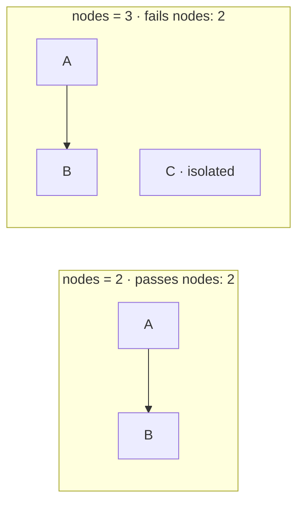

### Edges

With `limits.edges: 2`, a third distinct directed edge exceeds the budget.
Opposite directions count separately here; parallel declarations do not.

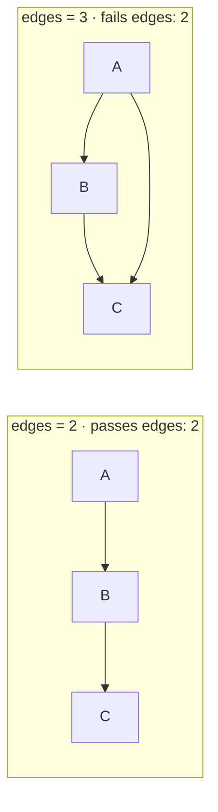

### Depth

With `limits.depth: 2`, a three-stage chain fails. An SCC collapses to one vertex
before layering, so a directed cycle alone has depth one. Use `strongComponent`
or `acyclic` to constrain cycles.

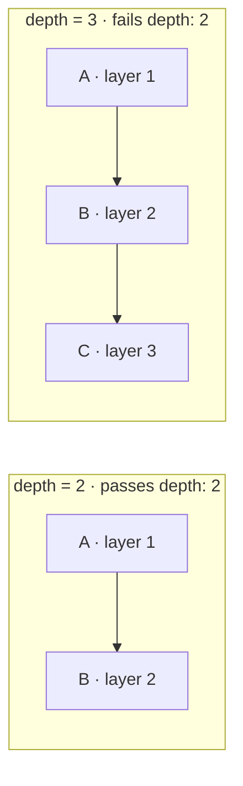

### Breadth

With `limits.breadth: 2`, three SCCs in the same earliest layer fail. Each vertex
below is its own SCC. Breadth counts SCCs assigned to the same earliest layer;
execution concurrency is governed by admission and capacity settings.

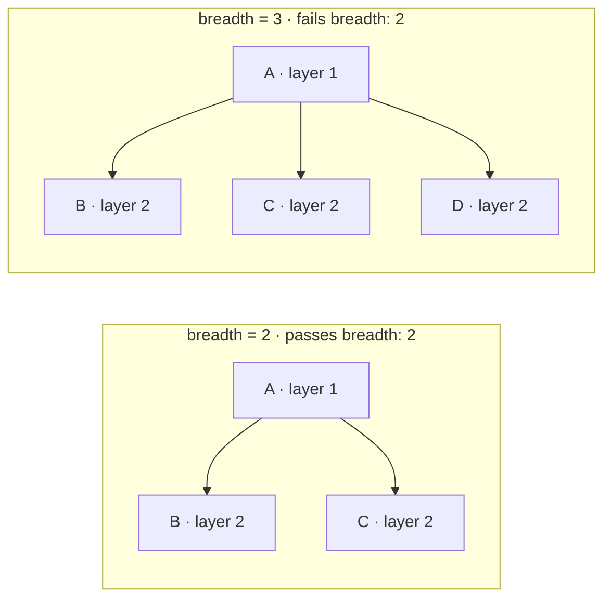

### Fan-in

`limits.fanIn: 2` permits two incoming edges at a vertex, but rejects three.
For admission dependencies, this bounds the largest number of direct prerequisites.

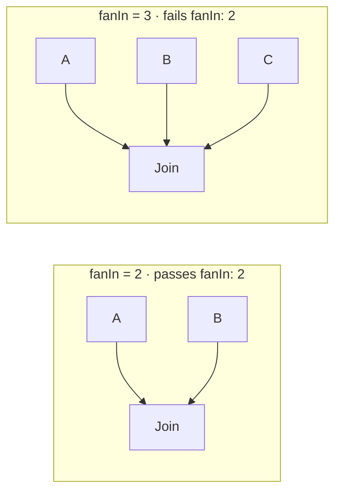

### Fan-out

`limits.fanOut: 2` permits two outgoing edges at a vertex, but rejects three.
This limits direct branching, independently of the total layer breadth.

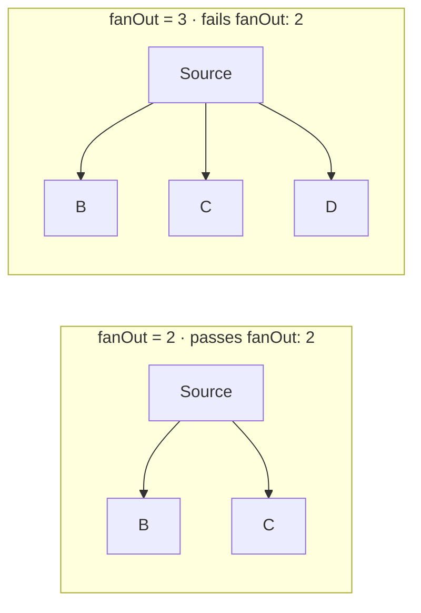

### Cycle rank

`limits.cycleRank: 0` requires the undirected projection to be a forest; it may
have several connected components. A triangle has one independent cycle and
fails. A directed two-vertex cycle projects to one edge and has cycle rank zero.

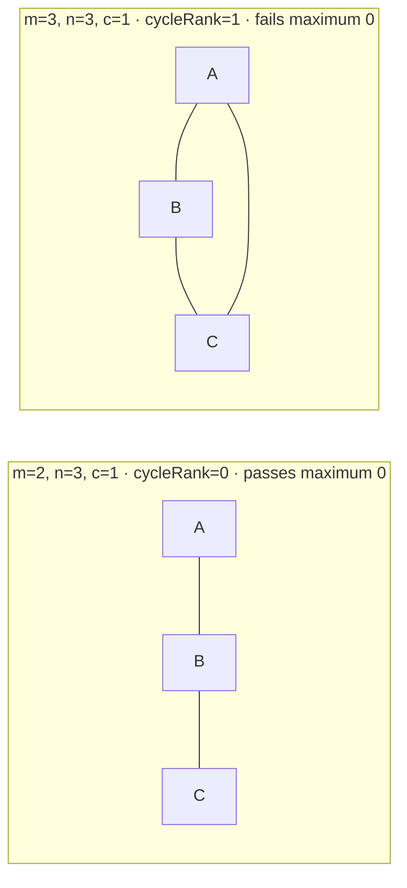

### Strong components

`limits.strongComponent: 2` rejects a three-vertex directed cycle. A directed
acyclic graph has maximum SCC size one when nonempty, regardless of chain length.

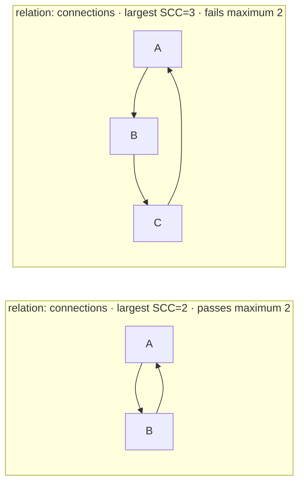

### Expanded nodes

At the root below, `nodes = 2` and `expandedNodes = 6`: two graph vertices plus
two workload vertices in each child instance. Reusing a definition does not
reduce the occurrence count. `limits.expandedNodes: 6` passes; `5` fails.

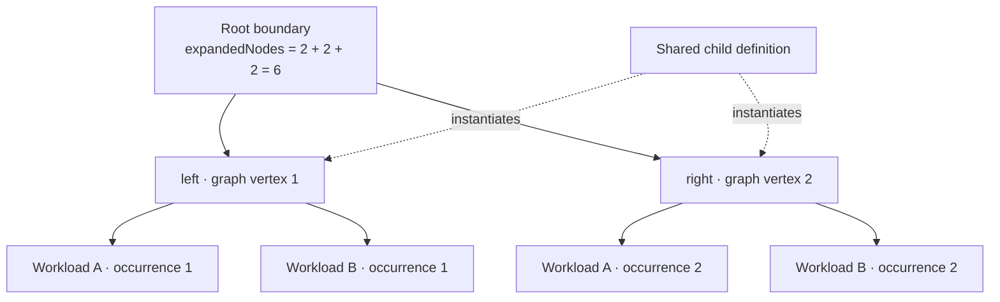

### Nesting depth

`limits.nestingDepth: 2` permits a root and child boundary, but rejects a
grandchild boundary. Workload leaves do not add a boundary level.

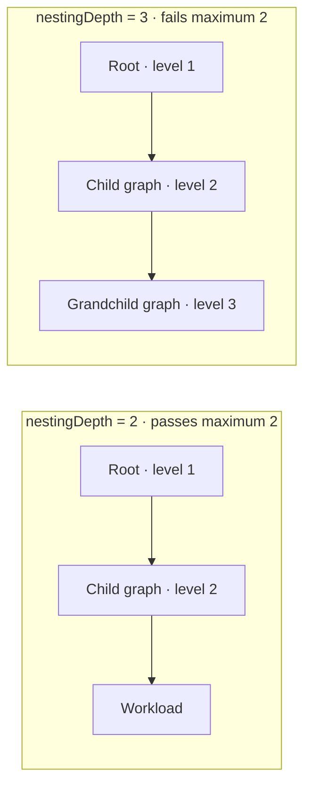

## Required shapes

`shapes` is a set of up to four requirements. `acyclic` tests the directed relation;
`connected`, `tree` and `planar` test the simple undirected projection. An empty
graph passes `acyclic` and `planar`, but fails `connected` and `tree`. A singleton
passes all four when it has no self-loop.

### Acyclic

`shapes: [acyclic]` forbids any directed cycle, including a self-loop. This is
already required of admission dependencies; use it on `connections` to restrict
data-flow cycles.

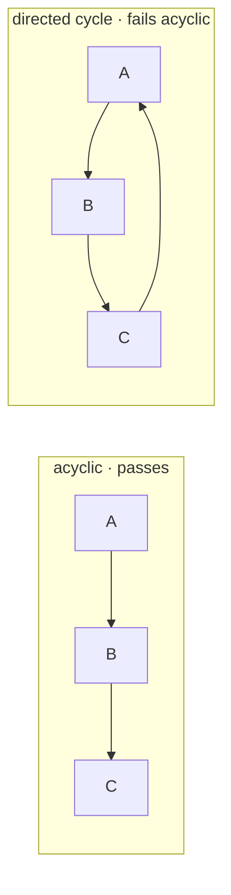

### Connected

`shapes: [connected]` requires an undirected route between every pair of vertices.
It does not require strong connectivity in the original directed relation.

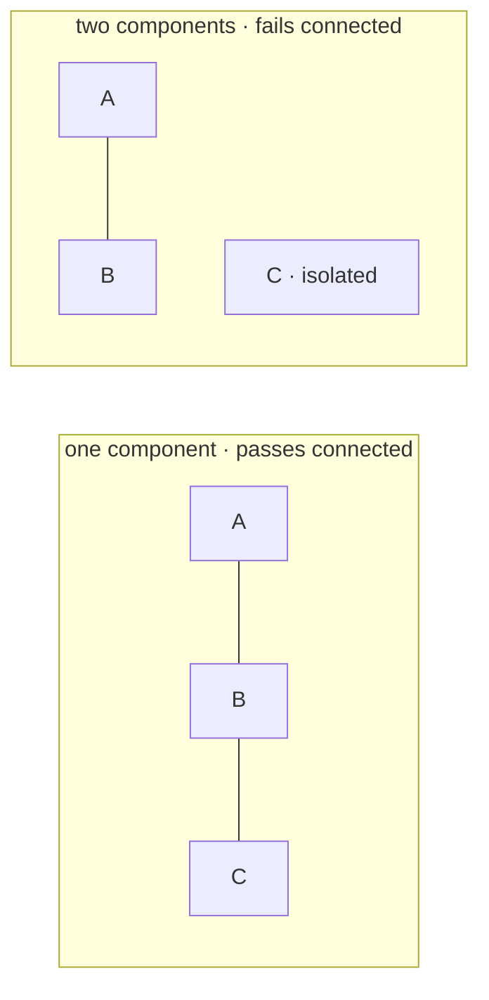

### Tree

`shapes: [tree]` requires a nonempty connected projection with no undirected
cycles. It combines connectivity with cycle rank zero. It does not forbid a
cycle that disappears during projection; add `acyclic` for that requirement.

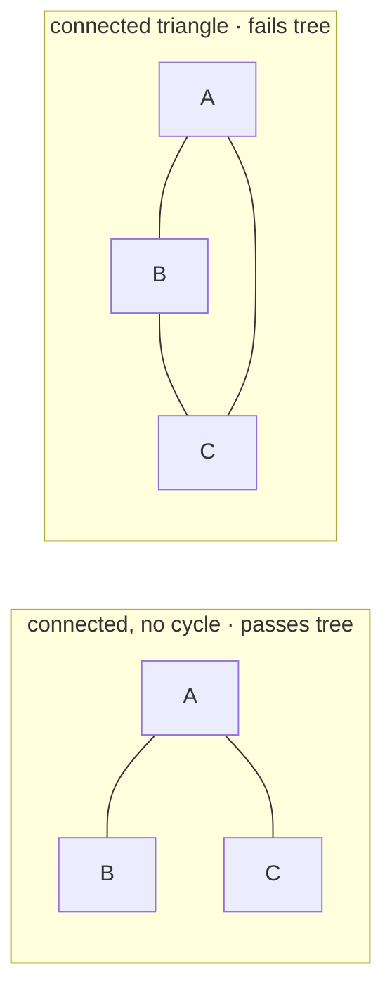

### Planar

`shapes: [planar]` requires that the projection can be drawn without crossing
edges. It does not test whether the particular Mermaid layout has crossings.
The complete bipartite graph `K3,3` fails regardless of its layout.

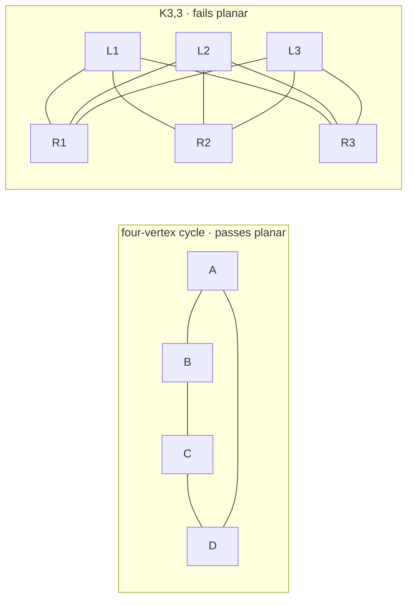

## Spectral bounds

Spectral policies use the simple undirected, unweighted projection. For adjacency
matrix `A` and degree matrix `D`, the combinatorial Laplacian is `L = D - A`.
A directed DAG's adjacency eigenvalues alone are all zero; using its undirected
projection makes the measurements informative about graph shape.

| Field under `spectrum` | Inclusive bound | Status measurement |
| --- | --- | --- |
| `maxRadius` | Maximum absolute adjacency eigenvalue | `spectrum.radius` |
| `minConnectivity` | Minimum second-smallest eigenvalue of `L` | `spectrum.connectivity` |
| `maxLaplacian` | Maximum eigenvalue of `L` | `spectrum.largestLaplacian` |

A spectral policy supports at most **256 vertices per boundary**, even with
`spectrum: {}`. Omit `spectrum` to avoid computation and its size restriction.
Connectivity is zero for fewer than two vertices or a disconnected projection;
an empty graph's other spectral measurements are also zero. See the NetworkX
[graph matrix definitions](https://networkx.org/documentation/stable/reference/linalg.html).
Polyad uses NumPy's symmetric
[`eigvalsh`](https://numpy.org/doc/stable/reference/generated/numpy.linalg.eigvalsh.html).

### Maximum radius

`spectrum.maxRadius: 1.5` accepts a three-vertex path with radius `sqrt(2)`,
but rejects a triangle with radius `2`.

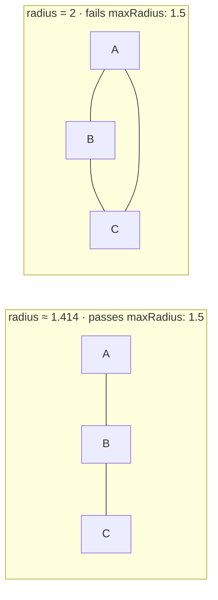

### Minimum connectivity

`spectrum.minConnectivity: 1` accepts a three-vertex path with algebraic
connectivity `1`; adding an isolated vertex makes connectivity zero and fails.
This is a Laplacian eigenvalue, distinct from the exact Cheeger constant.

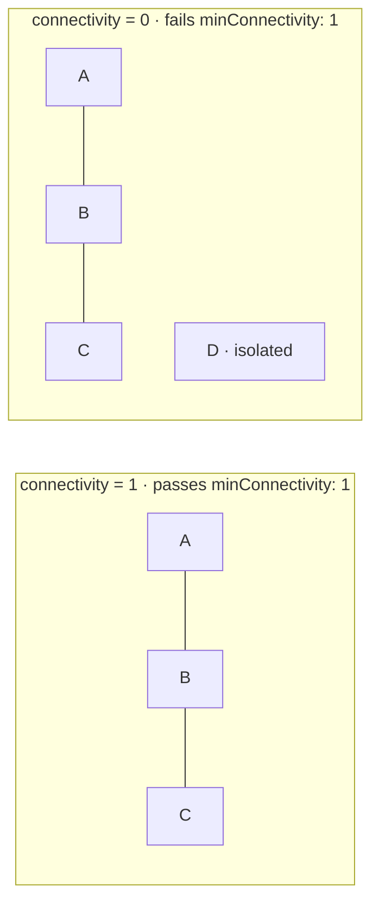

### Maximum Laplacian

`spectrum.maxLaplacian: 3` accepts a three-vertex path, whose largest Laplacian
eigenvalue is `3`, but rejects a four-vertex star, whose largest is `4`.

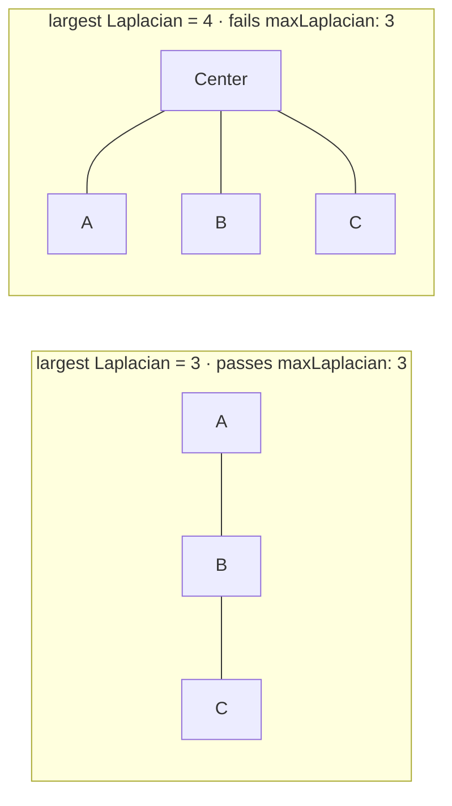

## Cheeger bottleneck bounds

Cheeger policies compute exact **unnormalized edge expansion** on the simple
undirected projection:

`h(G) = min |cut(S)| / min(|S|, |V−S|)` over nonempty proper vertex subsets.

A cut splits vertices into two groups. Its ratio counts crossing edges per vertex
in the smaller group. A low ratio means relatively few edges connect a substantial
part of the graph to the rest: a structural bottleneck. The Cheeger constant is
the lowest ratio over **all** splits. This uses vertex counts, not degree volumes
([edge-expansion definition](https://math.mit.edu/~fox/MAT307-lecture22.pdf)).

| Field under `cheeger` | Meaning for bottlenecks |
| --- | --- |
| `minimum: a` | Every split must have at least `a × smaller-group size` crossing edges. Raising this bound rejects more severe bottlenecks. |
| `maximum: b` | At least one split must have at most `b × smaller-group size` crossing edges. Lowering this bound requires a relatively sparse split; it does not protect against bottlenecks. |
| Both | The sparsest split must fall within the inclusive interval; `minimum` must not exceed `maximum`. |

Use a minimum alone to prevent severe bottlenecks. Disconnected graphs have value
zero; Polyad also assigns zero to graphs with fewer than two vertices, so a
positive minimum rejects them. Bounds must be finite and nonnegative.

### Minimum Cheeger constant

A four-vertex path has `h = 0.5`: cutting the middle edge separates two vertices
from two vertices, giving `1 / 2`. A four-vertex cycle has `h = 1`: splitting it
into two adjacent pairs cuts two edges, giving `2 / 2`.
`cheeger.minimum: 0.75` rejects the path and accepts the cycle.

```mermaid
flowchart LR
    subgraph fail["h = 0.5 · fails minimum: 0.75"]
        a["A · side 1"] --- b["B · side 1"]
        b ---|"cut edge"| c["C · side 2"]
        c --- d["D · side 2"]
    end
    subgraph pass["h = 1 · passes minimum: 0.75"]
        e["A · side 1"] --- f["B · side 1"]
        f ---|"cut edge"| g["C · side 2"]
        g --- h["D · side 2"]
        h ---|"cut edge"| e
    end
```

### Maximum Cheeger constant

`cheeger.maximum: 1` accepts the same cycle but rejects a complete four-vertex
graph with `h = 2`. In the complete graph, splitting two vertices from two
vertices cuts four edges, giving `4 / 2`. A bound on the minimum cut ratio does
not bound every cut or the total edge count. Adding `minimum: 0.75` selects the
cycle while rejecting both the path above and the complete graph below.

```mermaid
flowchart LR
    subgraph pass["cycle · h = 1 · passes maximum: 1"]
        a["A"] --- b["B"] --- c["C"] --- d["D"] --- a
    end
    subgraph fail["complete graph · h = 2 · fails maximum: 1"]
        e["A"] --- f["B"] --- g["C"] --- h["D"] --- e
        e --- g
        f --- h
    end
```

For a larger example, a ten-vertex path has `h = 0.2`, a ten-vertex cycle has
`h = 0.4`, and a complete ten-vertex graph has `h = 5`. Bounds are not percentages
and the constant can exceed one.

### Cheeger computation budgets and priorities

The default computation ceiling is **20 vertices per boundary**, including when
`cheeger: {}` requests measurement without bounds. Administrators can change
Helm `operator.cheeger.maxVertices`, `maxCuts` and `timeoutSeconds`. Policies may
lower those ceilings with `spec.cheegerComputation`, or inherit them by omission.
Its `priorityCuts` lists important vertex subsets to inspect first. The rest of
the search space remains subject to exactly the same bounds.

```mermaid
flowchart TD
    size["maxVertices: bound boundary size"] --> priority["priorityCuts: ordered subsets first"]
    priority --> rest["Search all remaining partitions"]
    rest --> count["maxCuts: bound distinct cut evaluations"]
    count --> time["timeoutSeconds: bound cooperative computation time"]
    time --> exact{"Exact result or witnessed minimum violation?"}
    exact -->|Yes| compare["Enforce the original hard bounds"]
    exact -->|No| stop["Inconclusive: block the action"]
```

A witnessed cut below the minimum can reject early. Exhausted budgets cannot
approve an unverified graph. Exact measurements appear in
`status.structuralPolicies[].measurements.cheeger`; partial-search diagnostics keep
an `upperBound` separately. Omitting `cheeger` avoids this computation entirely.
See [practical tuning](cheeger-tuning.md) for every field's range, application
feedback tradeoffs and [cut-priority examples](cheeger-tuning.md#prioritize-important-cuts).

The projection ignores direction, bandwidth, task duration and resource demand.
Measure throughput and execution bottlenecks separately at runtime.
`relation: connections` measures declared communication links;
`relation: admission` measures dependency links. Nested boundaries are measured
separately at their configured scopes.

## Network contracts

`spec.network` attaches a traffic contract to a selected policy. Omit it to impose
no network contract from that policy; `network: {}` activates the defaults below.
These settings generate workload policies; they do not choose the structural
`relation` or change the graph's measured edges.

| Field under `network` | Default | Configuration |
| --- | --- | --- |
| [`scope`](#network-scope) | `Subtree` | `Boundary` selects direct workloads; `Subtree` includes descendants |
| [`isolateIngress`](#directional-isolation) | `true` | Restrict inbound traffic to allowed terms |
| [`isolateEgress`](#directional-isolation) | `true` | Restrict outbound traffic to allowed terms |
| [`allowWithin`](#traffic-within-the-graph) | `true` | Add an allowance for all transport traffic between workloads in the declaring graph |
| [`allowDNS`](#dns-access) | `true` | Add egress to `kube-system`, label `k8s-app=kube-dns`, on TCP and UDP 53 |
| [`ingress`](#ingress-and-egress-exceptions) | `[]` | Up to 32 additional inbound exceptions |
| [`egress`](#ingress-and-egress-exceptions) | `[]` | Up to 32 additional outbound exceptions |
| [`mesh`](#mesh-identity-and-http-constraints) | `false` | Require Istio injection, strict mTLS and inbound authorization |

### Network scope

`network.scope` decides which workloads a contract selects. This is separate from
`spec.scope`, which propagates the selected policy reference. For an ancestor's
referenced network policy to reach descendants, both must be `Subtree`. A
`PolyGraph` has no direct workload nodes, so `network.scope: Boundary` on it
selects no pods. Namespace policies are still independently selected at each child.

```mermaid
flowchart TB
    policy["Referenced GraphPolicy<br/>spec.scope: Subtree"] --> root["Selecting graph"]
    root --> direct["Direct workload<br/>selected with either network.scope"]
    root --> child["Nested graph"]
    child --> leaf["Descendant workload<br/>selected with network.scope: Subtree<br/>not selected with network.scope: Boundary"]
```

### Directional isolation

Each direction is independent. `isolateIngress: true` restricts arrivals;
`isolateEgress: true` restricts departures. Setting either to `false` removes
that direction's restriction from this contract, but cannot remove restrictions
from another applicable contract. Empty exception arrays still retain allowances
from `allowWithin`, `allowDNS` and connections that declare ports.

```mermaid
flowchart LR
    source["External sender"] --> inbound{"isolateIngress?"}
    inbound -->|"true: require inbound allowance"| pod["Workload"]
    inbound -->|"false: no inbound restriction here"| pod
    pod --> outbound{"isolateEgress?"}
    outbound -->|"true: require outbound allowance"| destination["External destination"]
    outbound -->|"false: no outbound restriction here"| destination
```

### Traffic within the graph

`allowWithin: true` adds all-port allowances for peers in the declaring graph,
including its descendants. `false` removes this automatic allowance; use
`connections` with ports or explicit exceptions for required traffic. A
connection without ports contributes to structural measurements but creates no
network allowance. Every other applicable isolated contract must permit the
traffic too.

```mermaid
flowchart LR
    subgraph automatic["allowWithin: true"]
        a["Workload A"] <-->|"all transport ports allowed by this contract"| b["Workload B"]
    end
    subgraph explicit["allowWithin: false"]
        c["Workload A"] -->|"connection declares TCP 8080: allowed"| d["Workload B"]
        c -. "TCP 9000: denied without another allowance" .-> d
    end
```

### DNS access

`allowDNS: true` adds the egress allowance shown below. Set it to `false` and
supply an explicit egress exception if DNS uses a different namespace or labels.
Disabling it removes this allowance; it does not override a separate allowance
that also happens to permit DNS. This option matters when egress is isolated.

```mermaid
flowchart LR
    a["allowDNS: true<br/>isolated workload"] -->|"TCP 53 and UDP 53"| dns["namespace: kube-system<br/>podLabels: k8s-app=kube-dns"]
    b["allowDNS: false<br/>isolated workload"] -. "no automatic DNS allowance" .-> dns
```

### Ingress and egress exceptions

Each entry in `ingress` or `egress` uses the fields below. `peer` is required.
Values within a list are alternatives; constraints across fields apply together.
Exceptions add allowances within one contract. The receiver needs ingress
permission and an isolated sender also needs egress permission.

| Field in an exception | Default | Meaning and validation |
| --- | --- | --- |
| `node` | Omitted | Local node subtree receiving ingress or sending egress; omitted selects all local nodes |
| `peer` | Required | Peer namespace, graph, node and pod-label selectors; see [peer selection](#peer-selection) |
| `ports` | `[]` | Destination ports; empty permits all transport ports |
| `ports[].port` | Required | Integer from 1 through 65535 |
| `ports[].protocol` | `TCP` | `TCP`, `UDP` or `SCTP` |
| `principals` | `[]` | Exact nonempty source identities; no wildcards; ingress with `mesh: true` only |
| `methods` | `[]` | Uppercase HTTP method names; empty means unconstrained; ingress with `mesh: true` only |
| `paths` | `[]` | Exact absolute paths starting with `/`; no `*`, `{` or `}`; empty means unconstrained; ingress with `mesh: true` only |

The `node` in an exception is local; `peer.node` selects the remote peer. These
are separate selectors even when both endpoints belong to the same boundary.

```mermaid
flowchart LR
    caller["Ingress peer"] -->|"ingress: node=api, ports=[TCP 8080]"| api["Local node: api"]
    api -->|"egress: node=api, ports=[UDP 5353]"| resolver["Egress peer: resolver"]
    worker["Local node: worker"] -->|"egress: node=worker, ports=[SCTP 9000]"| service["Egress peer: service"]
    other["Other local nodes"] -. "not selected by these node filters" .-> service
    any["Exception without node<br/>selects all local nodes"] --> empty["ports: []<br/>all destination transport ports"]
```

### Peer selection

A peer selects pods in one namespace; an empty `peer: {}` selects all pods in the
declaring graph's namespace. It never implicitly selects every namespace.
Explicit selectors combine with AND.

| Field under `peer` | Default | Meaning and validation |
| --- | --- | --- |
| `namespace` | Declaring graph's namespace | Exact namespace; a DNS label |
| `graph` | Omitted | Persisted graph instance name, not reusable definition name; a DNS label |
| `kind` | `Graph` | Kind of a named graph instance: `Graph`, `PolyGraph`, `ReplicaGroup` |
| `node` | Omitted | Selected graph's node and its descendants; without `graph`, selects a node in the declaring boundary; a DNS label |
| `podLabels` | `{}` | Additional exact key/value matches, combined with namespace and graph selection |
| `cluster` | Omitted | Registered remote transport; requires mesh and explicit TCP ports; cannot combine with local selectors |

An explicit `namespace` together with `node` requires an explicit `graph`, even
if the namespace is the current one. Without `graph` or `node`, only namespace
and pod-label filters apply. `kind` qualifies `graph`; when only `node` is given,
the declaring boundary supplies the graph identity and kind.

```mermaid
flowchart TB
    peer["peer selector"] --> ns["namespace: consumers"]
    ns --> instance["kind: Graph<br/>graph: reporting<br/>persisted instance"]
    instance --> node["peer.node: reader<br/>reader and descendants"]
    node --> labels["podLabels: role=client"]
    labels --> match["Only pods matching ALL selectors"]
    empty["peer: {}"] --> same["All pods in declaring namespace"]
```

### Mesh identity and HTTP constraints

For `peer.cluster`, remote ingress additionally requires exact source principals.
Gateway-mode egress permits only TCP on the registered peer's `gatewayPort`
(default 15443); destination ingress uses the real service ports. Direct mode
uses registered remote Pod CIDRs and service ports. Every inherited local
contract must permit the remote peer. Cluster
registration does not authenticate a cluster identity; use distinct workload
principals when clusters share a trust domain. See
[remote traffic configuration](../deployment/multicluster.md#remote-traffic-rules).

```mermaid
flowchart TB
    peer["peer.cluster: west"] --> mesh["network.mesh: true<br/>Explicit TCP ports required"]
    peer --> selectors["namespace, graph, node, podLabels<br/>cannot accompany a remote peer"]
    mesh --> ingress["Ingress<br/>Exact source principals required<br/>Destination service ports"]
    mesh --> gateway["Gateway egress<br/>TCP gatewayPort to registered gateway CIDRs"]
    mesh --> direct["Direct egress<br/>Declared ports to registered Pod CIDRs"]
    ingress --> inherited["Every applicable local contract<br/>must allow this connection"]
    gateway --> inherited
    direct --> inherited
```

`network.mesh: true` requires the operator's mesh integration and Istio. It
requests native sidecar injection, strict mutual TLS and inbound authorization.
`mesh: false` is the default and does not permit identity, method or path filters.
Mesh contracts require `isolateIngress: true`. Identity and HTTP filters are
valid only on ingress at the destination, and any listed ports must use TCP.

```mermaid
flowchart LR
    source["Client workload"] --> l4{"peer selectors<br/>and ports: TCP 8080"}
    l4 -->|match| mesh{"mesh: true<br/>strict mTLS"}
    mesh --> identity{"principals:<br/>cluster.local/ns/consumers/sa/reader"}
    identity --> method{"methods: [GET]"}
    method --> path{"paths: [/status]"}
    path -->|"all match"| target["Local node: api<br/>request allowed"]
    path -. "other path: denied" .-> deny["Denied by this exception"]
    plain["mesh: false"] --> transport["Transport policies only<br/>principals, methods, paths rejected"]
```

For this example, a caller with the wrong identity or method also fails the
exception. Principals use identities such as
`cluster.local/ns/consumers/sa/reader`, without the `spiffe://` prefix. Set the
client Pod's `serviceAccountName` to select its identity. Pod-label selection and
mTLS identity are independent checks. Other matching ingress allowances can
permit a request: set `allowWithin: false` and avoid unrestricted ingress grants
when every caller must satisfy the filters.

### Combining network contracts

Allowances within a contract are alternatives; applicable isolated contracts
intersect. A child can narrow a parent's allowances, but cannot opt out of them.
The same intersection applies to multiple selected GraphPolicies and a graph's own
network contract. Per direction, expansion is capped at 1,024 candidate pairs
and 256 effective terms.

```mermaid
flowchart LR
    parent["Ancestor allows<br/>TCP 8080 and TCP 9090"] --> intersection{"Both must allow"}
    child["Child allows<br/>TCP 8080 only"] --> intersection
    intersection --> allowed["TCP 8080 permitted"]
    intersection -. "TCP 9090 rejected" .-> denied["Parent allowance alone is insufficient"]
```

NetworkPolicy needs an enforcing CNI. Istio checks need an installed, enabled mesh.
Cross-namespace peer selection does not create resources in the peer namespace.
For generated policies, membership, pod security requirements and update behavior,
see [network enforcement and lifecycle](../deployment/networking.md#enforcement-and-lifecycle).
Other administrators' additive Kubernetes policies can widen allowances, so
GraphPolicies assume trusted management of that enforcement infrastructure.

## Complete policy examples

The first policy applies a structural budget namespace-wide. The second is selected
by end-users and combines bottleneck bounds with explicit traffic permissions.
The second policy's `scope: Boundary` keeps its node-specific contract on the
selecting boundary, which must contain a workload node named `api`.

```yaml
apiVersion: polyad.astrivant.com/v1alpha1
kind: GraphPolicy
metadata:
  name: namespace-budget
spec:
  enforcement: Namespace
  scope: Subtree
  relation: admission
  limits:
    nodes: 64
    edges: 128
    depth: 12
    breadth: 16
    fanIn: 8
    fanOut: 8
    cycleRank: 16
    strongComponent: 1
    expandedNodes: 256
    nestingDepth: 8
  shapes: [acyclic, planar]
  spectrum:
    maxRadius: 8
    minConnectivity: 0
    maxLaplacian: 16
---
apiVersion: polyad.astrivant.com/v1alpha1
kind: GraphPolicy
metadata:
  name: bounded-flow
spec:
  enforcement: Referenced
  scope: Boundary
  relation: connections
  limits:
    nodes: 20
  shapes: [connected]
  cheeger:
    minimum: 0.25
    maximum: 2
  network:
    scope: Boundary
    isolateIngress: true
    isolateEgress: true
    allowWithin: false
    allowDNS: true
    mesh: true
    ingress:
      - node: api
        peer:
          namespace: consumers
          graph: reporting
          kind: Graph
          node: reader
          podLabels:
            role: client
        ports:
          - port: 8080
            protocol: TCP
        principals: [cluster.local/ns/consumers/sa/reader]
        methods: [GET]
        paths: [/status]
    egress:
      - node: api
        peer:
          namespace: storage
          podLabels:
            app: database
        ports:
          - port: 5432
            protocol: TCP
```

End-users set `spec.policies: [bounded-flow]` on their graph, or `policies` inside a
composition graph object's `spec`. Namespace policies still apply. An isolated caller in `consumers`
also needs egress permission to the API, and the database needs any applicable
ingress permission.

Python callers can evaluate the same constraints directly:

```python
from polyad.graph import Cheeger, StructuralPolicy, evaluate_policy, graph_cheeger

policy = StructuralPolicy(relation="connections", cheeger=Cheeger(minimum=0.25, maximum=2))
report = evaluate_policy(policy, topology, expanded_nodes=6, nesting_depth=2)
# topology is a validated polyad.graph.Topology supplied by the caller.
# graph_cheeger(networkx_graph) also computes the constant directly.
```

`graph_spectrum` additionally returns the full sorted adjacency and Laplacian
spectra; status reports keep compact summaries.

## PolyGraphs and autoscaling

A PolyGraph is itself a graph boundary. Its immediate vertices are child graphs;
its `nodes`, shape, spectral and Cheeger measurements describe connections between
those child graphs. `expandedNodes` and `nestingDepth` include descendants. For
example, two ReplicaGroup children with two Daemon copies each contribute
`expandedNodes = 2 + 2 + 2 = 6` at the PolyGraph.

```yaml
apiVersion: polyad.astrivant.com/v1alpha1
kind: GraphPolicy
metadata:
  name: application-budget
spec:
  enforcement: Referenced
  scope: Boundary
  relation: connections
  limits:
    expandedNodes: 6
  cheeger:
    minimum: 1
---
apiVersion: polyad.astrivant.com/v1alpha1
kind: PolyGraph
metadata:
  name: application
spec:
  mode: persistent
  policies: [application-budget]
  nodes:
    - name: producers
      kind: ReplicaGroup
      ref: producer-copies
    - name: consumers
      kind: ReplicaGroup
      ref: consumer-copies
  connections:
    - source: producers
      target: consumers
```

The referenced ReplicaGroup definitions must already exist with
`templateOnly: true`. With two Daemon copies per group, this PolyGraph has
`h = 1` and meets its recursive budget. Growing either group to three would make
`expandedNodes = 7` and is blocked, even though `scope: Boundary` does not copy
this policy to the children. Removing the connection would make `h = 0`, so a
subsequent scaling action is blocked by the recomputed parent Cheeger bound.

```mermaid
flowchart TB
    policy["PolyGraph policy<br/>expandedNodes ≤ 6; Cheeger ≥ 1"] -. checks .-> parent["Application · h = 1"]
    parent --> left["Producers · 2 copies"]
    parent --> right["Consumers · 2 copies"]
    left ---|"declared connection"| right
    keda["KEDA requests producers: 3"] --> evaluate{"Fresh family evaluation"}
    parent --> evaluate
    evaluate --> rejected["Proposed expandedNodes = 7<br/>Keep existing copies; block creation"]
```

Before each replica creation or scale-in deletion, Polyad reloads the owning
family, resolves shared replica sources, and recomputes all selected structural,
spectral and Cheeger constraints at their respective boundaries. Independent
sibling counts and every inheriting use of a shared source in that family count
toward ancestor budgets. Retiring siblings continue to consume capacity until
their execution resources disappear. Active pulse instances also count as
separate vertices in the structural projection.

The requested target topology must pass before its scaling mutations proceed.
Inputs are checked again after computation; changed identities, specifications,
children or policies defer the action for a fresh reconciliation. Graph status
measurements and KEDA demand metrics are not reused as admission verdicts.
Scale-out and scale-in use the same policy checks; a connectivity or lower-bound
constraint can prohibit scaling to zero. A violating request stays requested but
is not applied, and failed or deferred reconciliation sets `scaleCurrent: false`.
Later reconciliations retry when intent or policy changes. Explicit deletion,
suspension and shutdown retain their drain behavior.

ReplicaGroup defaults to `connectivity.mode: Independent`, with no inter-copy
edges and Cheeger constant zero. Users can select Chain, Ring, Star, FullMesh,
or Custom connections, with optional reverse edges and transport ports; see
[connection modes and diagrams](replication.md#connections-between-copies).
Policies with `relation: connections` evaluate the chosen pattern, rebuilt using
the effective count before scaling actions. A four-copy Ring has `h = 1`, while
a six-copy Ring has `h = 2/3`: a minimum of 1 permits the former and blocks scaling
to the latter. Custom edges only participate while both named ordinals exist.

A positive Cheeger minimum inherited onto an Independent group rejects it. Use
`scope: Boundary` for a policy intended only for a PolyGraph's connections, and
separate subtree policies for recursive budgets or other applicable constraints.
The parent's Cheeger constant does not change merely because a child has more
copies; the graphs are not flattened, and internal Pod replicas do not become
extra graph vertices.

KEDA must target the `ReplicaGroup` scale subresource to use this admission path.
For individual Pod scaling, replicate a `Daemon` definition with `replicas: 1`;
each group ordinal creates one Deployment or StatefulSet with one desired Pod. Larger native
Daemon replica counts stay internal to each graph vertex. Direct HPA/KEDA writes
to generated Deployments or StatefulSets bypass Polyad's graph scheduler; these checks do not
intercept those writes. See [KEDA and constraint enforcement](replication.md#constraints-before-scaling).

## Admission, reporting and computation limits

Policies and nested definitions are refreshed before admission, including rewrite
targets. A violation reports phase `Invalid` with the policy and explanation.
Successful observations include `status.structuralPolicies` with policy names, UIDs,
generations, measured limits, optional Cheeger measurements and compact spectra.
Live checks annotate the reconciling boundary's verdicts with `boundary.kind`,
`boundary.name`, `boundary.uid` and an occurrence `boundary.path`. All family
constraints are evaluated, but each graph stores its own verdicts to keep status
size bounded. An ancestor or sibling violation still blocks the action and names
the failing policy and boundary in the error.
Check phase and observed generation for current validity; the stored successful
report may describe an earlier observation.

Spectral and Cheeger comparisons allow
`1e-9 * max(1, |measured|, |bound|)` numerical tolerance. Their calculations run
outside the operator's event loop. Independent preflight caps are 4,096 expanded
node occurrences, 256 boundaries, 32 nesting levels and 32 GraphPolicies per namespace.
User bounds cannot raise these caps or the 256-vertex spectral cap. Cheeger
computation ceilings are separately [configurable](cheeger-tuning.md#understand-computation-and-scale). Recursive counts describe the current composition; they do not
bound lifetime work submitted through repeated activation requests.

Structural policy updates block further admission on subsequent reconciliations;
they do not evict running workloads. Network contract updates have their own
[enforcement lifecycle](../deployment/networking.md#enforcement-and-lifecycle). Kubernetes reads
across objects can observe different moments during a concurrent update.

## Application throughput targets

See [comparing Cheeger policies](cheeger-orchestration.md) for diagrams showing
how hard admission bounds, Observe/Adapt feedback and replica scaling interact.

GraphPolicy Cheeger bounds remain hard structural constraints. Optional
[Soul searching](soul-searching.md) maintains a **separate**
Cheeger target range derived from administrator-calibrated demand tiers. Observe
mode reports recommendations; Adapt may apply an approved connection layout or
bounded [traffic adjustment](traffic-balancing.md) only after fresh family checks
pass both policies. Soul searching
cannot relax a GraphPolicy. Disjoint bounds block adaptation and report
`NoAllowedLayout`; neither metric is a guarantee of an application data rate.
