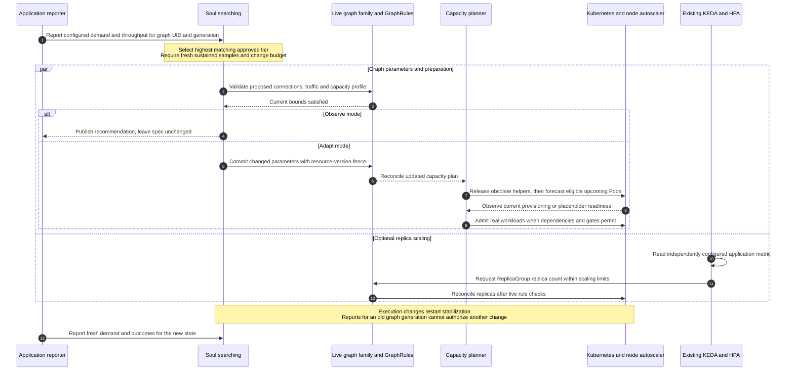

# Soul searching: approved load profiles and preparation

Soul searching can prepare for sustained incoming demand before completed
throughput falls behind. An administrator defines demand tiers containing a
Cheeger target, optional traffic percentages and optional capacity lookahead.
Polyad selects among those approved profiles; hard GraphRules and resource
ceilings remain fixed.

## Table of contents

- [Separate control loops](#separate-control-loops)
- [Define demand](#define-demand)
- [From incoming demand to prepared capacity](#from-incoming-demand-to-prepared-capacity)
- [Configure approved profiles](#configure-approved-profiles)
- [Limits and failure behavior](#limits-and-failure-behavior)
- [Report demand and inspect decisions](#report-demand-and-inspect-decisions)

## Separate control loops

| Controller | Owns | Does not select |
| --- | --- | --- |
| Soul searching | Approved connection layouts, bounded traffic splits and forecast depth/budget | Replica counts, hard rules or workload CPU/memory requests |
| KEDA and its HPA | Replica counts for their configured scaling target | Cheeger targets, connections or lookahead |
| Polyad capacity planner | Forecast helpers and handoff to admitted workloads | Node-pool size |
| Cluster/node autoscaler | Provisioning machines for scheduling demand | Application topology or graph admission |

Soul searching works without KEDA. Existing KEDA/HPA scaling remains independent;
both controllers can use measurements of the same application demand. KEDA
normally supplies metrics to its managed HPA; its scaling target is a resource's
replica count. See [KEDA's scaling model](https://keda.sh/docs/2.20/concepts/scaling-deployments/)
and [Polyad's ReplicaGroup integration](replication.md#connect-keda).

For example, KEDA might request more processing replicas while Soul searching
selects a wider connection layout and looks three stages ahead. ReplicaGroup
reconciliation checks live GraphRules before changing execution. An observed
replica or descendant topology change restarts Soul searching's stabilization;
the next profile decision needs fresh measurements of that execution state.
Do not assign two replica controllers to the same target.

These controls do not create a new conversion from Cheeger values to requests
per second. Load tests establish useful thresholds, layouts and forecast budgets
for the application. [Cheeger remains a structural measurement](cheeger-orchestration.md).

## Define demand

Administrators choose the signal, its unit and the thresholds at each boundary.
Omitting `throughput.demand` uses the report's `offeredPerSecond` value, measured
in `throughput.unit` per second. To use another signal, declare its exact identity:

```yaml
throughput:
  unit: records # The unit of offered/completed throughput reports stays separate.
  trigger: Demand
  demand:
    name: queueDepth
    unit: jobs
  tiers:
    - threshold: 1 # Queued jobs, not records per second.
      cheeger: {minimum: 0.5, maximum: 1}
    - threshold: 1000
      cheeger: {minimum: 1, maximum: 1}
```

`tiers[].threshold` is an inclusive minimum in the **selected demand unit**.
Thresholds must be nonnegative and strictly increasing; the highest matching
tier wins. This field replaces the earlier rate-specific tier name
`offeredPerSecond`; the report's `offeredPerSecond` field remains unchanged.

Examples include `queueDepth` / `jobs`, `activeSessions` / `sessions`, or
`ingressBytes` / `bytes-per-second`. The authorized aggregate reporter computes
the metric using the application's measurement contract and includes:

```python
from polyad_types import DemandSample

# Additional keyword on the existing ThroughputSample:
demand = DemandSample(name="queueDepth", unit="jobs", value=1200)
```

Pass it as `ThroughputSample(..., demand=demand)` alongside the actual offered
and completed rates. The operator does not sum unrelated per-replica reports.
For a composite metric, the reporter must calculate one agreed scalar with a
meaningful unit; configure its thresholds from load tests. A signal name alone
does not make Polyad query a queue, metrics endpoint or Prometheus server.

Intake rejects an undeclared signal, the wrong name/unit, a missing configured
signal or a nonfinite/negative/nonnumeric value. The signal shares the enclosing
report's graph UID, generation, timestamp, permissions and freshness budget.
During reconciliation, an unusable signal produces `WaitingForDemandSignal` and
resets stabilization. It never silently substitutes offered throughput.

`trigger: Demand` reacts to sustained **positive selected demand**. It can prepare
for queued jobs even when current arrivals are zero. `trigger: Shortfall` still
requires a completed/offered throughput deficit as well as positive selected
demand; a queue measurement is not used as either side of that ratio. Existing
`sampleMaxAgeSeconds`, `sustainedSeconds` and `minSamples` control freshness and
reaction time, while cooldown and hourly budgets limit changes.

## From incoming demand to prepared capacity

This sequence diagram shows the two control loops and the capacity handoff.
The reporter supplies offered and completed work measured over the same window,
plus the administrator-selected demand signal when one is configured.
The KEDA branch is optional and uses its own configured metric source.



The loops can run in either order; the diagram does not promise atomic scaling
and profile application. Existing leases, dependency contracts and API revision
checks coordinate writes. A rejected or stale decision is reevaluated.

Lookahead prepares **known, not-yet-created execution nodes** in the dependency
frontier. It does not invent workload counts from a rate, reserve arbitrary
uninstantiated descendant graphs, open activation gates or add warm Pods to an
already fully deployed service. Deeper preparation is useful only where upcoming
work exists. See [advance capacity planning](capacity.md) for inheritance,
supported workloads, scheduling requests and backend limitations.

Preparation is predictive only in the operational sense: offered demand provides
lead time before downstream work arrives. Sampling, stabilization, scheduling and
machine startup still take time. Sudden bursts can arrive faster than this loop;
retain suitable baseline capacity and buffers.

Operator replica changes can separately move long-lived subscriptions through
[paced copulses and reconnection](../operations/event-rebalancing.md#scale-out-and-subscription-migration).
That sequence handles connection redistribution, not application profile selection.

## Configure approved profiles

Use the typed [Helm reference overlay](../../charts/polyad/values-soul-searching.reference.yaml)
to enable capacity preparation. Demand profiles belong on individual Graphs or
PolyGraphs, where administrators can calibrate them for each boundary.
The [complete example](../../examples/load-profiles.yaml) includes definitions,
a hard rule, admission dependencies and two approved layouts.

```yaml
# Within Graph.spec or PolyGraph.spec:
capacity:
  backend: Auto
  lookaheadStages: 1
  maxPods: 4
  timeoutSeconds: 900
throughput:
  mode: Observe # Inspect recommendations before opting into Adapt.
  trigger: Demand
  unit: records
  capacityCeiling: {lookaheadStages: 3, maxPods: 16}
  tiers:
    - threshold: 1
      cheeger: {minimum: 0.5, maximum: 1}
      capacity: {lookaheadStages: 1, maxPods: 4}
    - threshold: 1000
      cheeger: {minimum: 1, maximum: 1}
      capacity: {lookaheadStages: 3, maxPods: 16}
  # Add approved layouts if the current connections cannot meet both tiers.
  sustainedSeconds: 30
  minSamples: 3
  sampleMaxAgeSeconds: 30
  cooldownSeconds: 300
  maxChangesPerHour: 4
```

| Setting | Choices and meaning |
| --- | --- |
| `mode` | `Observe` recommends; `Adapt` applies approved changes |
| `trigger` | `Shortfall` (default) preserves the completed/offered deficit trigger; `Demand` reacts to sustained positive selected demand even while completed throughput keeps up |
| `demand` | Omitted uses `offeredPerSecond`; an explicit `name` and `unit` select another application-reported signal |
| `tiers[].threshold` | Inclusive nonnegative demand threshold in that source's unit; strictly increasing across tiers |
| `tiers[].capacity.lookaheadStages` | Integer 1–32: how many missing dependency layers to prepare |
| `tiers[].capacity.maxPods` | Integer 1–1,024: the active boundary's outstanding forecast Pod budget |
| `capacityCeiling` | Fixed maximum forecast depth and Pod budget, required when any tier has capacity settings |
| `tiers[].trafficWeights` | Optional approved percentages for [Tiers routing](traffic-balancing.md#choose-an-automatic-balancing-mode) |
| `trafficMode: Headroom` | Derive bounded percentages from current per-replica reports instead of supplying tier percentages |

The highest matching threshold supplies the profile. Omitted capacity fields at
the **tier** level retain the current plan; a supplied capacity object must contain
both integers. Set an explicit smaller capacity profile at a lower positive demand
tier to reduce future reservations. Zero demand or demand below the first tier
does not select an implicit reset. An already-suitable connection layout remains
in place, even if another approved layout also meets the target.

Capacity profiles require an explicit `spec.capacity` plan within the fixed
ceiling. A profile changes only its depth and Pod budget: backend, timeout,
provisioning class, provider parameters and retry token remain administrator-owned.
Setting a capacity ceiling without enabling a forecast plan is invalid.

## Limits and failure behavior

- Every adaptation must meet the selected application Cheeger target and live
  GraphRules. Computation budgets and important-cut priorities remain fixed.
- A capacity profile must fit `capacityCeiling` and the operator's Helm
  `capacity.maxPods`; `capacity.enabled` must be true. Otherwise
  `CapacityUnavailable` prevents the entire proposed change.
- Selected connection, traffic and capacity changes share one atomic graph-spec
  patch and one cooldown/hourly change budget. Traffic still moves by at most
  `maxWeightStep` per destination per adjustment.
- Fresh UID/generation-matched reports, distinct samples, sustained duration,
  live-family checks and mutation dependency validation remain required.
  Active temporary connections defer profile application.
- A smaller forecast budget replaces obsolete helpers before new ones are
  prepared. It does not remove running application workloads or immediately
  remove machines. Backend failures and expired plans remain visible through
  `status.capacity`; a profile is not permission to bypass admission.

Hard GraphRules, KEDA replica ceilings, node-pool limits and workload resource
requests are never rewritten by this controller. Capacity ceilings apply per
boundary; planning total cluster headroom must account for concurrent boundaries.

## Report demand and inspect decisions

Use the existing client [throughput report API](soul-searching.md#report-measurements).
One aggregate reporter should submit the application's offered and completed rates,
using the graph's current UID, generation and configured work unit. KEDA and
Prometheus ingestion do not need to be enabled for those reports. An automatic
Prometheus-to-profile ingestion adapter is not supplied by this feature; it can
be added later against the same validated report contract.

`status.throughput` exposes `currentCapacity`, `targetCapacity` and
`proposedCapacity` alongside its existing Cheeger and traffic observations.
`demandSignal`, `demandUnit` and `demandValue` identify the input used for selection.
`Applied` means the profile was committed, not that machines are ready.
Follow `status.capacity` for preparation and handoff. Authorized graph events
and structured decision logs expose these decisions through the existing paths.
