# Replication and KEDA

<!-- toc:start -->
**Table of contents**

- [Declare a scalable abstraction](#declare-a-scalable-abstraction)
- [Examples at each scaling level](#examples-at-each-scaling-level)
  - [Example: Daemon replicas](#example-daemon-replicas)
  - [Example: Graph replicas](#example-graph-replicas)
  - [Example: PolyGraph replicas](#example-polygraph-replicas)
  - [Example: nested ReplicaGroups](#example-nested-replicagroups)
- [Connections between copies](#connections-between-copies)
  - [Graph and PolyGraph connections](#graph-and-polygraph-connections)
  - [Reading the networking diagrams](#reading-the-networking-diagrams)
  - [Independent](#independent)
  - [Chain](#chain)
  - [Ring](#ring)
  - [Star](#star)
  - [FullMesh](#fullmesh)
  - [Custom](#custom)
  - [Bidirectional connections](#bidirectional-connections)
  - [Scaling and topology changes](#scaling-and-topology-changes)
- [Independent instances and all uses of a definition](#independent-instances-and-all-uses-of-a-definition)
- [Connect KEDA](#connect-keda)
- [Metric scopes and freshness](#metric-scopes-and-freshness)
- [Constraints before scaling](#constraints-before-scaling)
- [Scheduling and cleanup](#scheduling-and-cleanup)
<!-- toc:end -->

ReplicaGroups can also replicate PolyGraph templates that place child Graphs in
remote clusters. Each copy owns its complete composition, while destination
operators enforce cluster-local rules. See
[cross-cluster placement and scaling](../deployment/multicluster.md#graphrules-cheeger-bounds-and-scaling).

A **ReplicaGroup** is a scalable family of copies. Its template can reference a
`Workload`, `Daemon`, `Resource`, `Graph`, `PolyGraph`, or another `ReplicaGroup`.
Replicating a graph copies its
whole service composition, including dependencies, gates and resource definitions.
Each copy has a stable ordinal, separate owned resources and a status that rolls
up to the group and its ancestors.

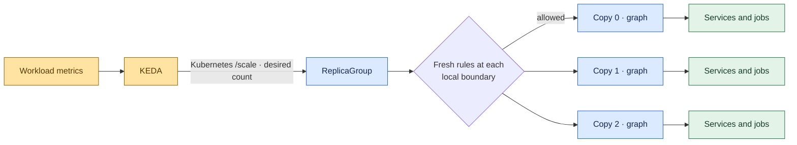

This diagram shows one cluster. The
[multicluster scaling diagram](../deployment/multicluster.md#graphrules-cheeger-bounds-and-scaling)
extends it to PolyGraph copies that own remote Graphs, with separate destination
operators and local rule checks.

## Declare a scalable abstraction

```yaml
apiVersion: polyad.astrivant.com/v1alpha1
kind: ReplicaGroup
metadata:
  name: processors
  namespace: polyad
spec:
  replicas: 2
  minReplicas: 0
  maxReplicas: 20
  template:
    kind: Graph
    ref: processing-pipeline
```

`processing-pipeline` is an existing graph definition with `templateOnly: true`.
To scale individual services, reference a `Daemon` instead. To scale a collection
of jobs, reference a finite `Graph`. `Resource` can replicate supported Services,
ConfigMaps and PVCs. Gates, rules and shutdown policies are reusable control
configuration: include them in a graph to apply them to every copy.

The group exposes the Kubernetes scale subresource:

- `.spec.replicas`: desired copies, bounded by `minReplicas` and `maxReplicas`.
- `.status.replicas`: observed copies, including those still terminating.
- `.status.labelSelector`: an incarnation-specific selector for descendant Pods.
- `.status.readyReplicas`: copies observed ready or successfully completed.

A group stays alive at zero copies. Completed finite copies remain completed;
replica count controls the number of copies. Use [activation pulses](../workloads/activation.md)
when work must repeat. Replicating a Daemon copies its selected
Deployment or StatefulSet controller; each copy retains that definition's own replica setting. Bounds count copies of
the selected abstraction, not the total Pods in their descendant graphs.

For a Graph nested inside another Graph, see
[nested Cheeger measurements and subgraph replication](cheeger-orchestration.md#nested-graphs-and-subgraph-replication).
It explains why the parent can retain the same Cheeger value while the group's
copy connections or an ancestor's recursive size budget block scaling.

## Examples at each scaling level

These examples use namespace `polyad`, with Polyad's CRDs and operator already
installed. Graph and group templates use `templateOnly: true` so defining them
does not start an extra standalone execution. The examples share the Daemon
definition below; the PolyGraph example also uses the Graph definition from the
Graph example. Each top-level ReplicaGroup is a separate scaling target.

### Example: Daemon replicas

This group requests two independent Deployments, each with one desired Pod.
Increasing `services.spec.replicas` from 2 to 3 adds one Deployment and one desired
Pod. It does not resize the existing Deployments.

```yaml
apiVersion: polyad.astrivant.com/v1alpha1
kind: Daemon
metadata:
  name: replicated-server
  namespace: polyad
spec:
  controller: Deployment
  replicas: 1
  template:
    spec:
      containers:
        - name: server
          image: busybox:1.37
          command: [sh, -c, 'mkdir -p /www; echo ready > /www/index.html; exec httpd -f -p 8080 -h /www']
          startupProbe:
            httpGet: {path: /, port: 8080}
            periodSeconds: 2
            failureThreshold: 30
          readinessProbe:
            httpGet: {path: /, port: 8080}
          livenessProbe:
            httpGet: {path: /, port: 8080}
---
apiVersion: polyad.astrivant.com/v1alpha1
kind: ReplicaGroup
metadata:
  name: services
  namespace: polyad
spec:
  replicas: 2
  minReplicas: 0
  maxReplicas: 20
  template:
    kind: Daemon
    ref: replicated-server
```

For StatefulSet copies, select `controller: StatefulSet` on the Daemon and supply
its `statefulSet` configuration, including the governing Service. Keep the
Daemon's `replicas: 1` for one desired Pod per group copy. See the
[StatefulSet and storage example](../workloads/workload-storage.md#statefulset-configuration).
KEDA targets `ReplicaGroup/services`, using the [ScaledObject below](#connect-keda).

### Example: Graph replicas

Define this persistent service graph and use the `processors` ReplicaGroup from
[Declare a scalable abstraction](#declare-a-scalable-abstraction). It references
this exact definition by `template.kind: Graph` and `template.ref: processing-pipeline`.

```yaml
apiVersion: polyad.astrivant.com/v1alpha1
kind: Graph
metadata:
  name: processing-pipeline
  namespace: polyad
spec:
  templateOnly: true
  mode: persistent
  nodes:
    - name: ingress
      kind: Daemon
      ref: replicated-server
    - name: processor
      kind: Daemon
      ref: replicated-server
      requires:
        - node: ingress
          condition: ready
  connections:
    - source: ingress
      target: processor
      ports:
        - port: 8080
          protocol: TCP
```

At `processors.spec.replicas: 2`, there are two Graph instances, each with its own
ingress and processor Deployments: four desired Pods in total. Scaling to 3 adds
one whole Graph, including both Daemons, their readiness dependency and their
declared connection. Any Resource nodes added to the template would also be
instantiated separately in each copy.

The HTTP servers make execution and readiness observable; the declared edge
does not implement application forwarding. See [graph networking](../deployment/networking.md)
for transport grants. KEDA targets `ReplicaGroup/processors`, exactly as shown in
the [ScaledObject below](#connect-keda). Finite Graphs can be replicated too;
completed copies require [activation pulses](../workloads/activation.md) to run again.

### Example: PolyGraph replicas

This reusable PolyGraph contains two instances of `processing-pipeline` from the
Graph example. The outer group copies the entire composition.

```yaml
apiVersion: polyad.astrivant.com/v1alpha1
kind: PolyGraph
metadata:
  name: processing-application
  namespace: polyad
spec:
  templateOnly: true
  mode: persistent
  nodes:
    - name: primary
      kind: Graph
      ref: processing-pipeline
    - name: secondary
      kind: Graph
      ref: processing-pipeline
---
apiVersion: polyad.astrivant.com/v1alpha1
kind: ReplicaGroup
metadata:
  name: applications
  namespace: polyad
spec:
  replicas: 2
  minReplicas: 0
  maxReplicas: 20
  template:
    kind: PolyGraph
    ref: processing-application
```

Two application copies contain four Graph instances and eight desired Daemon
Pods. Scaling `applications` from 2 to 3 adds one PolyGraph, two Graphs and four
desired Pods. These counts belong to `applications`; the separately declared
`processors` group is not part of this composition. KEDA targets
`ReplicaGroup/applications`, using the [ScaledObject below](#connect-keda).

### Example: nested ReplicaGroups

An outer group can replicate a reusable group directly. Here, each pool contains
three copies of the `replicated-server` Daemon from the first example.

```yaml
apiVersion: polyad.astrivant.com/v1alpha1
kind: ReplicaGroup
metadata:
  name: worker-pool
  namespace: polyad
spec:
  templateOnly: true
  replicas: 3
  minReplicas: 0
  maxReplicas: 20
  template:
    kind: Daemon
    ref: replicated-server
---
apiVersion: polyad.astrivant.com/v1alpha1
kind: ReplicaGroup
metadata:
  name: worker-pools
  namespace: polyad
spec:
  replicas: 2
  minReplicas: 0
  maxReplicas: 20
  template:
    kind: ReplicaGroup
    ref: worker-pool
```

Initially, two pool instances each request three one-Pod Daemons: six desired
Pods. Scaling `worker-pools` from 2 to 3 adds a whole pool, producing nine desired
Pods. Instead, keeping two pools and scaling the shared `worker-pool` definition
from 3 to 4 updates both inheriting pools, producing eight desired Pods.

Use separate ScaledObjects targeting `ReplicaGroup/worker-pools` for pool count
and `ReplicaGroup/worker-pool` for copies per inheriting pool. To scale just one
generated pool independently, first set its `inheritReplicas: false` and target
that instance's generated name; see [instance and shared scaling](#independent-instances-and-all-uses-of-a-definition).

For each example, adapt the [KEDA ScaledObject](#connect-keda) by setting both its
`metadata.name` and `spec.scaleTargetRef.name` to the target named above. All these
groups have bounds 0–20, matching that example. Choose an actual demand metric
for the layer being scaled; the sample metric URL is not created by these
manifests. Counts describe desired steady state after admission. Applicable
[GraphRules are checked before creating or retiring copies](#constraints-before-scaling)
throughout the hierarchy, and can block an otherwise in-bounds request.

## Connections between copies

`spec.connectivity` selects the data-flow connections between copies in a
ReplicaGroup. Each **replica vertex** is one complete copy of the selected
template, named `replica-0`, `replica-1`, and so on:

| `spec.template.kind` | What one replica vertex represents |
| --- | --- |
| `Daemon` | One Daemon execution, backed by its Deployment or StatefulSet. |
| `Graph` | One Graph instance, including its workload and resource nodes and internal connections. |
| `PolyGraph` | One PolyGraph instance, including all of its nested graphs, workloads, resources and connections. |
| `ReplicaGroup` | One nested group instance, with its own copies and connectivity mode. |

The selected mode connects these copies at the enclosing ReplicaGroup boundary.
Omitting it keeps the default `Independent` mode. Connections do not add
`requires` dependencies: copies remain independently admissible, including when
the data-flow pattern contains cycles.

```yaml
spec:
  replicas: 4
  maxReplicas: 20
  template:
    kind: Daemon
    ref: processor
  connectivity:
    mode: Ring
    bidirectional: true
    ports:
      - port: 8080
        protocol: TCP
  network:
    allowWithin: false
  rules: [replica-bottlenecks]
```

| Field | Default | Meaning and constraints |
| --- | --- | --- |
| `mode` | `Independent` | [Independent](#independent), [Chain](#chain), [Ring](#ring), [Star](#star), [FullMesh](#fullmesh), or [Custom](#custom); case sensitive |
| `bidirectional` | `false` | Add the reverse of each edge, with the same port grants; invalid with `Independent` |
| `ports` | `[]` | Destination ports for built-in connected modes; each port is 1–65535 with protocol `TCP` (default), `UDP`, or `SCTP`; invalid with `Independent` or `Custom` |
| `edges` | `[]` | At most 4096 custom edges with unique directed source/target pairs; nonempty only with `Custom` |

### Graph and PolyGraph connections

For example, set `replicas: 3` and `connectivity.mode: Ring` on the
[`processors` group](#example-graph-replicas). Its three vertices are whole
`processing-pipeline` Graph instances. The group declares
`replica-0 → replica-1 → replica-2 → replica-0`, while each copy keeps its own
`ingress → processor` connection and readiness dependency. The Ring does not
change the internal shape of those Graphs or pair up equally named workloads
across copies.

With `template.kind: PolyGraph`, the same Ring connects entire compositions.
For the [`applications` example](#example-polygraph-replicas), each vertex contains
both the `primary` and `secondary` Graph instances and their Daemons. Connections
inside each Graph, connections between those Graphs inside a PolyGraph, and
connections between PolyGraph copies belong to separate boundaries. Configure
each boundary's connections independently. Likewise, an outer group's mode does
not replace a nested ReplicaGroup's own mode.

**Network access covers the connected subtrees.** When the ReplicaGroup has an
applicable network contract with `network.scope: Subtree` (the default), an edge
`replica-0 → replica-1` with TCP port 8080 contributes an egress allowance for
descendant Pods in copy 0 and a matching ingress allowance for descendant Pods
in copy 1. At this boundary, any source Pod in copy 0 can reach any destination
Pod in copy 1 on that port, subject to every other applicable contract. For a
PolyGraph copy, this includes Pods throughout its nested graphs. The edge does
not select a particular entry-point workload. A boundary-only network contract
on a group of Graphs or PolyGraphs does not reach their descendant Pods.

These grants are intersected with ancestor and child restrictions. A child's
internal connection cannot override a restrictive group contract; the group
contract must also allow the traffic needed inside each copy. For narrower
access, omit broad inter-copy port grants and declare explicit
[network peers and selectors](../deployment/networking.md#cross-namespace-peers-and-http-authorization),
or enforce narrower child contracts. Adding a narrower peer to the same contract
does not restrict an existing broad allowance. `Custom` connectivity endpoints are
still replica ordinals, such as `replica-1`; they cannot be descendant paths such
as `replica-1/processor`.

Ports without an applicable network contract do not install network policies,
and edges without ports do not grant transport access. `Independent` therefore
means no declared connections between copies; it does not itself isolate their
Pods. Connections also do not create Services, DNS names, forwarding, or load
balancing. Applications provide their addressing and communication behavior;
see [graph networking](../deployment/networking.md#isolating-a-subgraph).

GraphRules with `relation: connections` evaluate these same boundaries. A rule
evaluated at a three-copy ReplicaGroup sees three vertices and the selected
inter-copy edges for its Cheeger calculation. Rules evaluated inside a Graph or
PolyGraph copy see that copy's own nodes and edges. The outer calculation does
not flatten all descendant Pods into one graph; recursive size limits remain
separate from this boundary's connectivity measures.

### Reading the networking diagrams

Each mode below has three views: [Daemon](#example-daemon-replicas),
[Graph](#example-graph-replicas), and [PolyGraph](#example-polygraph-replicas)
replicas. Expand the Graph and PolyGraph examples to see their descendant
workloads. All views use three live copies; Custom also shows a fourth,
uncreated copy to explain dormant edges.

Green boxes represent Pods. Daemon examples set the Daemon's own `replicas: 1`;
Graph examples show two workload Pods per copy. PolyGraph examples show two
child Graphs per copy, with one representative Pod in each; those Graphs can
contain more workloads. These are schematic templates, with internal edges
declared separately from `spec.connectivity`.

An arrow between copy boundaries represents the declared connection and its
destination port grant across their Pod subtrees. Double arrows grant both
directions. Thin arrows labeled **internal** show connections within a copy
(TCP 8080 in these examples); they remain present even in Independent mode.
Dotted arrows to an amber **Not created** box are dormant declarations, with no
live destination Pod or active grant.

The diagrams assume a subtree network contract and that all applicable contracts
allow the depicted traffic, including traffic inside each copy. They show the
grants associated with the selected mode; other configured allowances can permit
additional traffic. The [scope and intersection rules above](#graph-and-polygraph-connections)
still apply.

### Independent

Creates no connections between copies.

<details open>
<summary>Daemon replicas: one desired Pod per copy</summary>

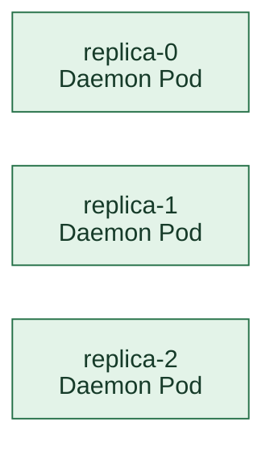

</details>

<details>
<summary>Graph replicas: two workloads inside each copy</summary>

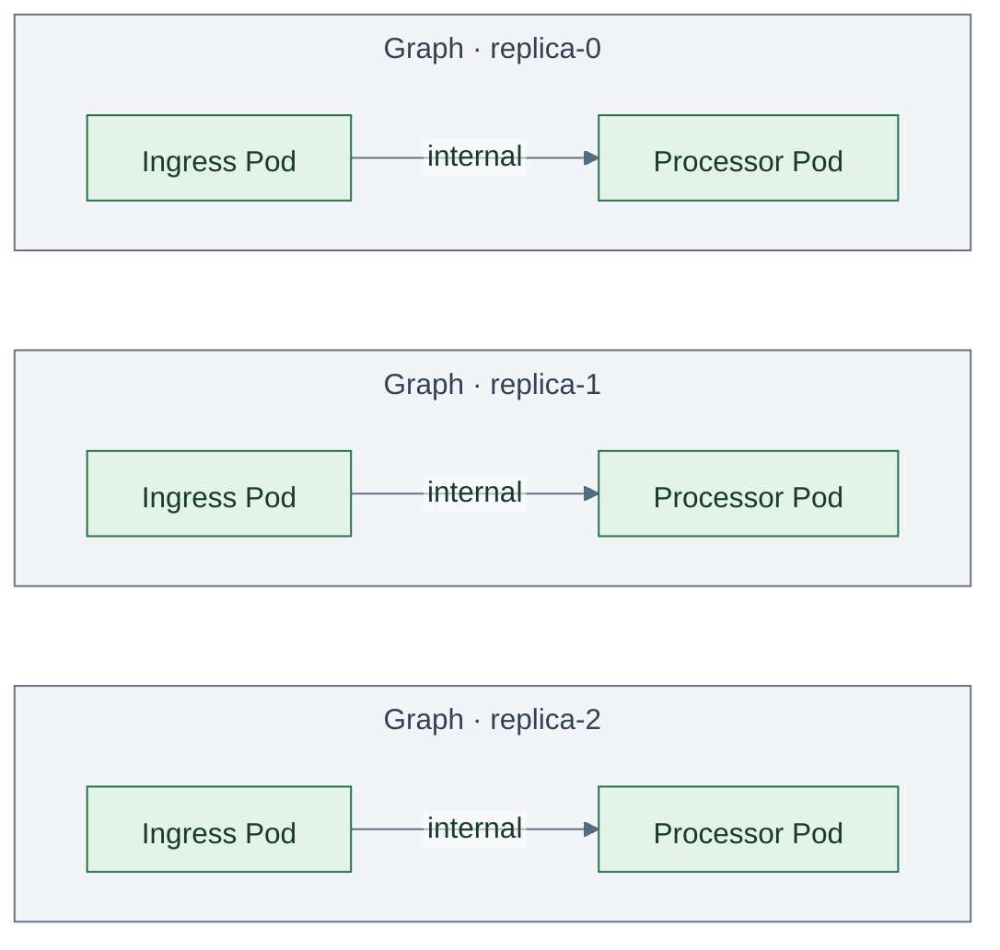

</details>

<details>
<summary>PolyGraph replicas: two child graphs inside each copy</summary>

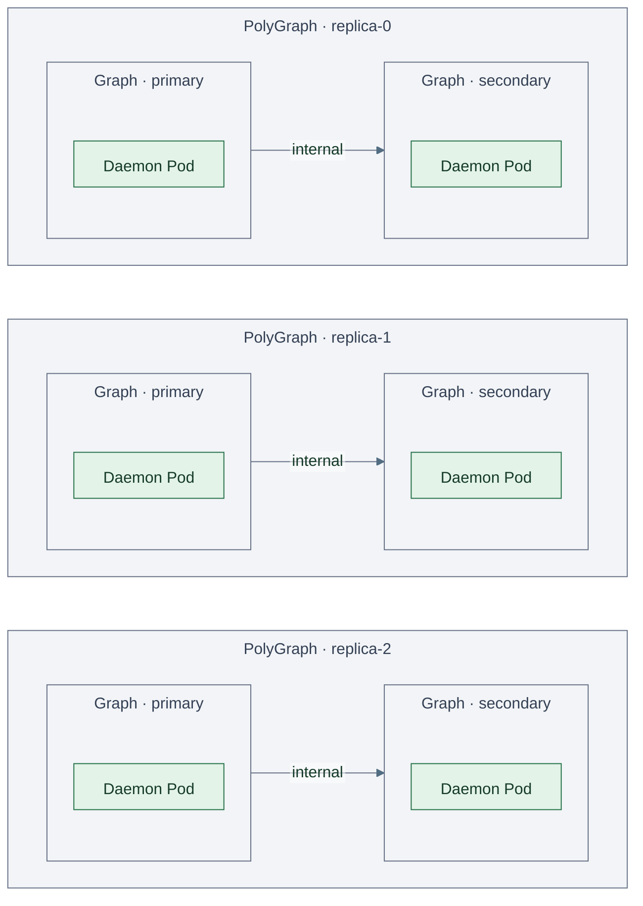

</details>

### Chain

Connects each ordinal to the next one, in ascending order.

<details open>
<summary>Daemon replicas: one desired Pod per copy</summary>

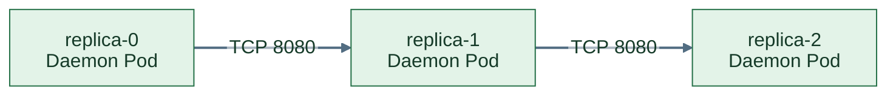

</details>

<details>
<summary>Graph replicas: two workloads inside each copy</summary>

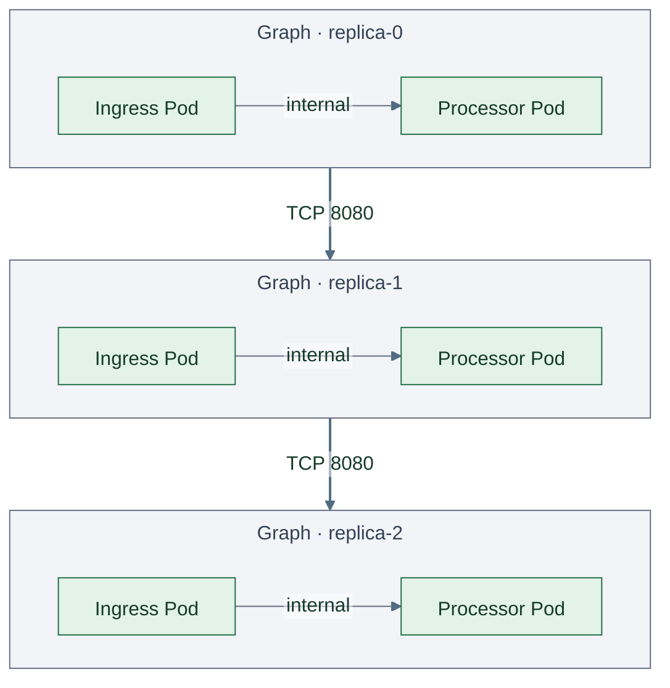

</details>

<details>
<summary>PolyGraph replicas: two child graphs inside each copy</summary>

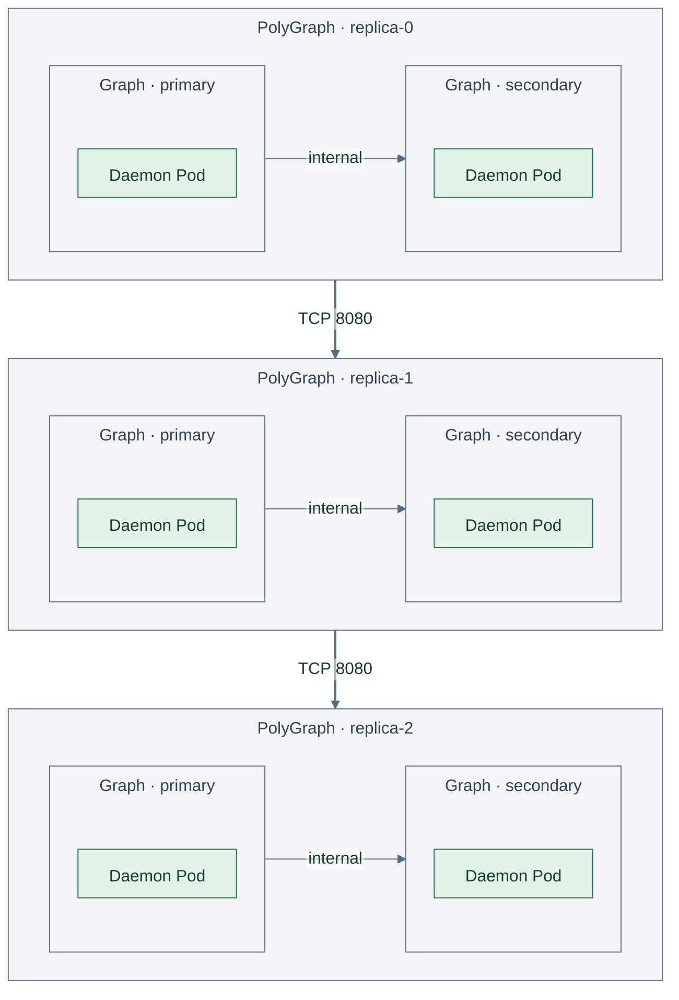

</details>

### Ring

Connects each ordinal to the next and adds an edge from the last back to the first.

<details open>
<summary>Daemon replicas: one desired Pod per copy</summary>

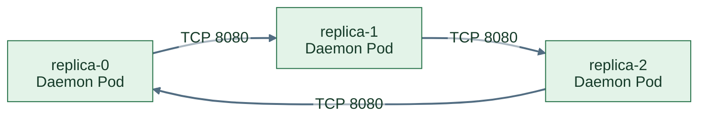

</details>

<details>
<summary>Graph replicas: two workloads inside each copy</summary>


</details>

<details>
<summary>PolyGraph replicas: two child graphs inside each copy</summary>

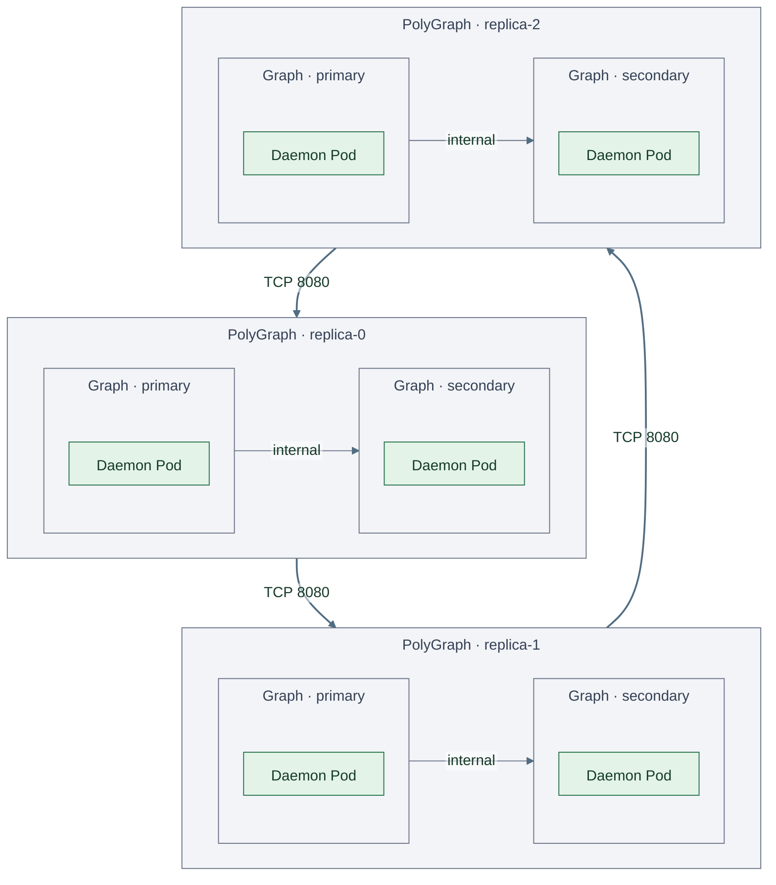

</details>

### Star

Sends from `replica-0` to every other copy.

<details open>
<summary>Daemon replicas: one desired Pod per copy</summary>

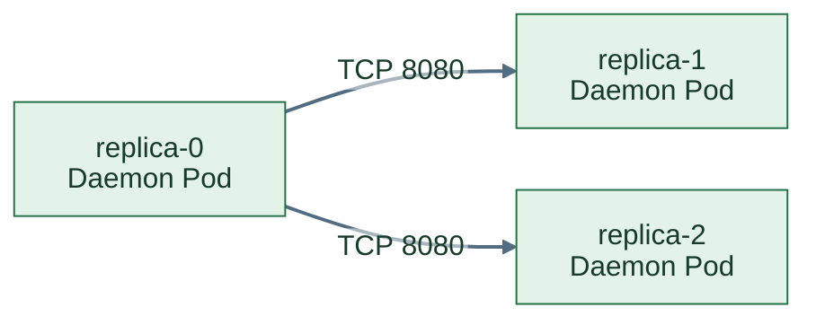

</details>

<details>
<summary>Graph replicas: two workloads inside each copy</summary>

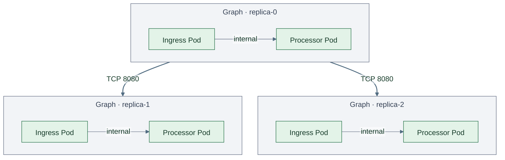

</details>

<details>
<summary>PolyGraph replicas: two child graphs inside each copy</summary>

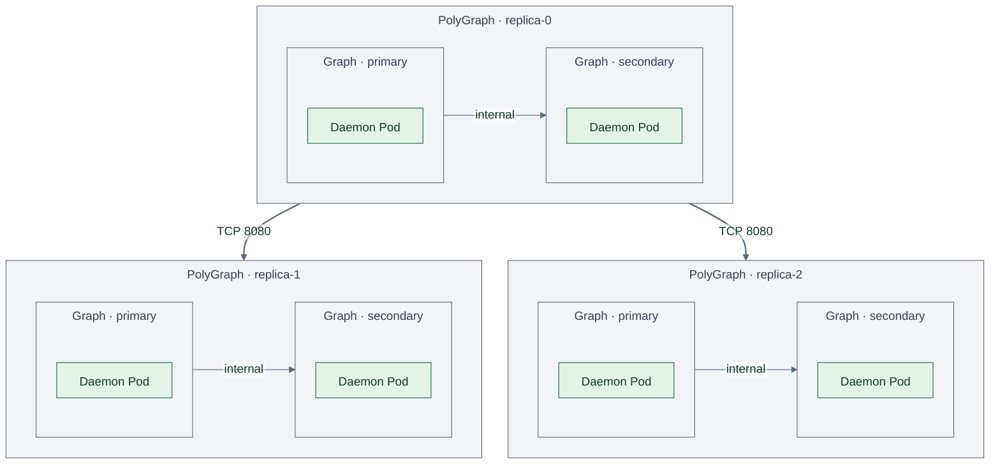

</details>

### FullMesh

Connects every distinct pair in both directions, even when
`bidirectional` is false.

<details open>
<summary>Daemon replicas: one desired Pod per copy</summary>

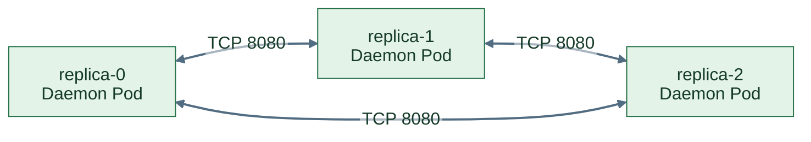

</details>

<details>
<summary>Graph replicas: two workloads inside each copy</summary>

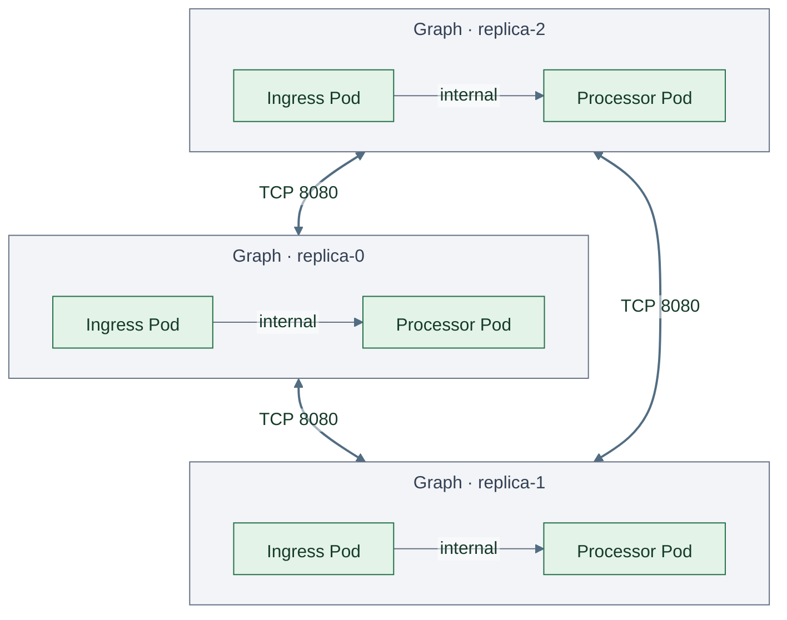

</details>

<details>
<summary>PolyGraph replicas: two child graphs inside each copy</summary>

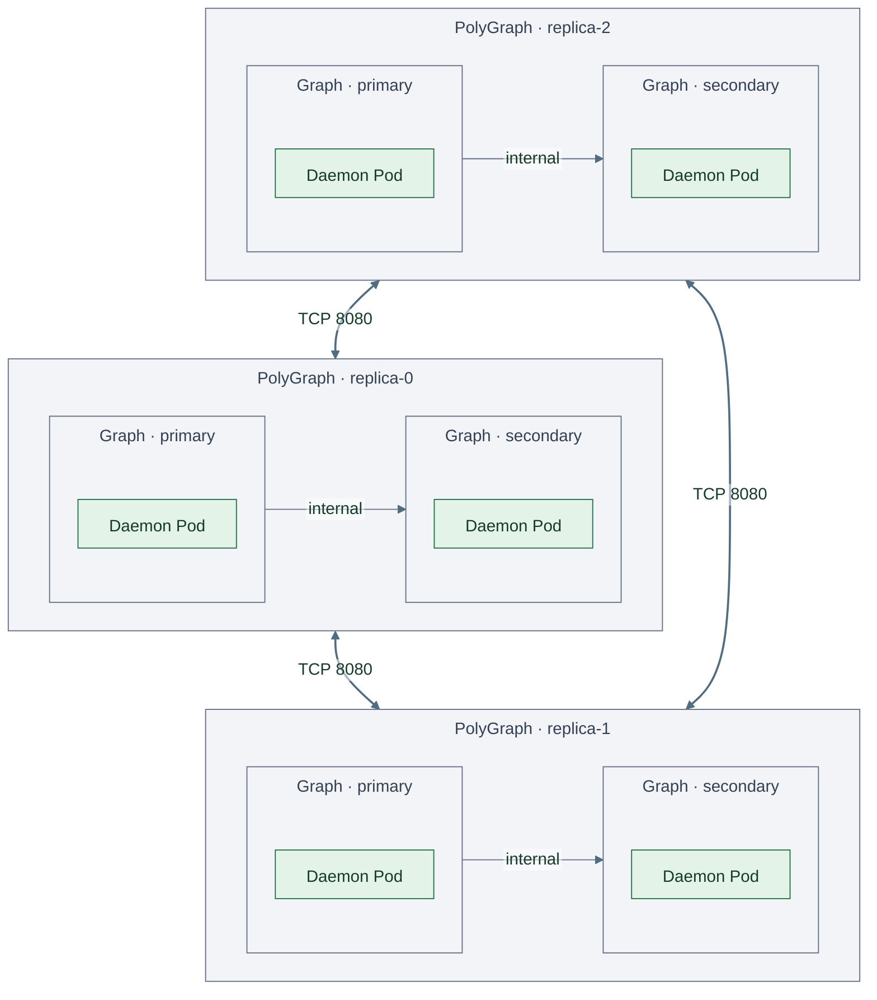

</details>

### Custom

Uses explicit ordinal names and per-edge ports. Endpoints must be
canonical names such as `replica-0`, with indices below `maxReplicas`; leading
zeros and self connections are rejected. Edges whose endpoints are not both
within the requested count remain dormant. This lets a declaration describe
future scale-out connections without creating extra copies.

```yaml
connectivity:
  mode: Custom
  edges:
    - source: replica-0
      target: replica-2
      ports:
        - port: 8080
    - source: replica-1
      target: replica-2
      ports:
        - port: 9090
    - source: replica-2
      target: replica-3
      ports:
        - port: 8080
```

With `replicas: 3` and `maxReplicas: 4`:

<details open>
<summary>Daemon replicas: one desired Pod per copy</summary>

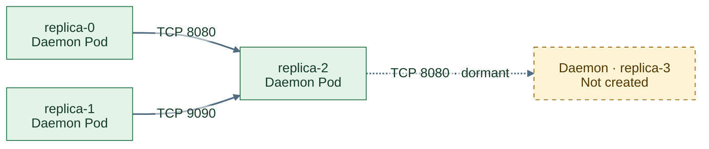

</details>

<details>
<summary>Graph replicas: two workloads inside each copy</summary>

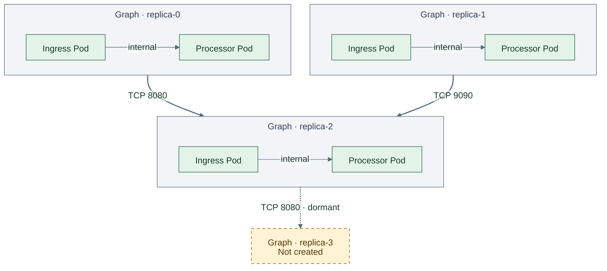

</details>

<details>
<summary>PolyGraph replicas: two child graphs inside each copy</summary>

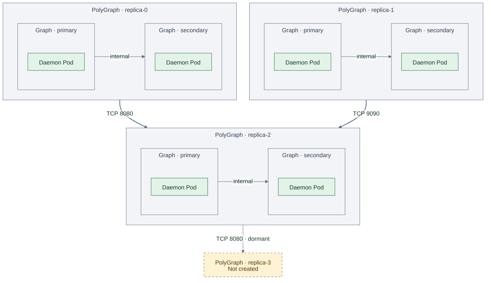

</details>

### Bidirectional connections

Setting `bidirectional: true` on Chain, Ring, Star, or Custom adds reverse edges.
Each reverse edge grants the same ports at its new destination. Identical
connections are deduplicated; distinct port grants are retained.

<details open>
<summary>Daemon replicas: one desired Pod per copy</summary>

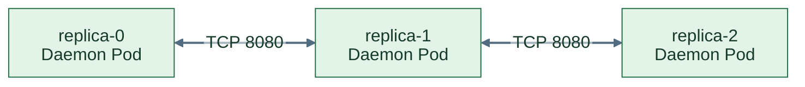

</details>

<details>
<summary>Graph replicas: two workloads inside each copy</summary>

```mermaid
---
config:
  theme: base
  htmlLabels: false
  themeVariables:
    primaryTextColor: "#163b29"
    tertiaryTextColor: "#344054"
    clusterBkg: "#f2f4f7"
    clusterBorder: "#667085"
    edgeLabelBackground: "#ffffff"
    lineColor: "#667085"
  flowchart:
    nodeSpacing: 35
    rankSpacing: 55
    subGraphTitleMargin:
      top: 8
      bottom: 20
---
flowchart TB
    subgraph r0["Graph · replica-0"]
        direction LR
        a0["Ingress Pod"] -->|"internal"| b0["Processor Pod"]
    end
    subgraph r1["Graph · replica-1"]
        direction LR
        a1["Ingress Pod"] -->|"internal"| b1["Processor Pod"]
    end
    subgraph r2["Graph · replica-2"]
        direction LR
        a2["Ingress Pod"] -->|"internal"| b2["Processor Pod"]
    end
    r0 <-->|"TCP 8080"| r1
    r1 <-->|"TCP 8080"| r2
    classDef workload fill:#e3f3e8,stroke:#247047,color:#163b29
    class a0,b0,a1,b1,a2,b2 workload
    linkStyle default stroke:#526d82,stroke-width:2px
    linkStyle 0,1,2 stroke:#667085,stroke-width:1px
```

</details>

<details>
<summary>PolyGraph replicas: two child graphs inside each copy</summary>

```mermaid
---
config:
  theme: base
  htmlLabels: false
  themeVariables:
    primaryTextColor: "#163b29"
    tertiaryTextColor: "#344054"
    clusterBkg: "#f2f4f7"
    clusterBorder: "#667085"
    edgeLabelBackground: "#ffffff"
    lineColor: "#667085"
  flowchart:
    nodeSpacing: 35
    rankSpacing: 55
    subGraphTitleMargin:
      top: 8
      bottom: 20
---
flowchart TB
    subgraph r0["PolyGraph · replica-0"]
        direction LR
        subgraph p0["Graph · primary"]
            a0["Daemon Pod"]
        end
        subgraph s0["Graph · secondary"]
            b0["Daemon Pod"]
        end
        p0 -->|"internal"| s0
    end
    subgraph r1["PolyGraph · replica-1"]
        direction LR
        subgraph p1["Graph · primary"]
            a1["Daemon Pod"]
        end
        subgraph s1["Graph · secondary"]
            b1["Daemon Pod"]
        end
        p1 -->|"internal"| s1
    end
    subgraph r2["PolyGraph · replica-2"]
        direction LR
        subgraph p2["Graph · primary"]
            a2["Daemon Pod"]
        end
        subgraph s2["Graph · secondary"]
            b2["Daemon Pod"]
        end
        p2 -->|"internal"| s2
    end
    r0 <-->|"TCP 8080"| r1
    r1 <-->|"TCP 8080"| r2
    classDef workload fill:#e3f3e8,stroke:#247047,color:#163b29
    class a0,b0,a1,b1,a2,b2 workload
    linkStyle default stroke:#526d82,stroke-width:2px
    linkStyle 0,1,2 stroke:#667085,stroke-width:1px
```

</details>

### Scaling and topology changes

All built-in modes have no edges at zero or one copy. A two-copy Ring has two
opposing edges. On scaling, built-in patterns are rebuilt over the new ordinals;
for example, a Ring's closing edge moves to its new last copy. Custom edges are
activated or removed as endpoints enter or leave the count. Rules check this
resulting topology before an execution is created or retired. When checking a
sibling with pending removals, its still-live ordinals remain in the projection
and its pattern is rebuilt over that set, in numeric order.

Workloads can follow these changes through [topology events and neighbor snapshots](../workloads/workload-events.md).
Replica count changes notify subscribers even in Independent mode. Snapshots
distinguish requested copies from executions that have actually been created,
and show retiring copies until their resources disappear.

These are declared data-flow connections, not application wiring or service
discovery. Ports become transport grants only when a network policy is selected
on the boundary, directly or through a GraphRule. Omitted ports grant no traffic.
Use `network.allowWithin: false` to restrict traffic to explicit grants; ancestor
policies can narrow them further. See [graph networking](../deployment/networking.md).

Select `relation: connections` on a GraphRule to measure these edges. For four
copies, the exact Cheeger constants are 0 (Independent), 0.5 (Chain), 1 (Ring),
1 (Star), and 2 (FullMesh). Directions and ports do not weight the Cheeger
calculation. A minimum limits bottlenecks; a maximum limits how highly connected
the weakest cut can be. For example, a Ring with four or five copies satisfies
`cheeger.minimum: 1`, while six copies have `h = 2/3` and fail:

```yaml
apiVersion: polyad.astrivant.com/v1alpha1
kind: GraphRule
metadata:
  name: replica-bottlenecks
spec:
  enforcement: Referenced
  scope: Boundary
  relation: connections
  cheeger:
    minimum: 1
```

Exact Cheeger evaluation defaults to 20 vertices per evaluated boundary, with
[configurable budgets and priority cuts](cheeger-tuning.md#understand-computation-and-scale).
Other computation limits still apply: a FullMesh produces `n × (n − 1)` directed
edges and exceeds the 16,384-edge expansion limit above 128 copies. Custom edges
can leave replicas isolated; positive connectivity or Cheeger constraints can
therefore block counts that fall within `minReplicas` and `maxReplicas`.

## Independent instances and all uses of a definition

A standalone ReplicaGroup is independently scalable. To share a replication
policy, set `templateOnly: true` on a ReplicaGroup definition and reference it as
a `ReplicaGroup` node in persistent graphs or PolyGraphs. Each generated instance
inherits the reusable group's requested count. Scaling that definition scales
**all inheriting uses**, without replacing their existing copies.

Each instance retains its own connectivity configuration. Shared count changes
regenerate that instance's edges using its effective count. Editing other fields
of a reusable definition, including connectivity, follows the normal definition
replacement lifecycle. Replica-count edits use the scaling path.

The generated `spec.replicaSource` pins the reusable group's name and UID. The
operator rejects a missing or recreated source. On a generated instance, set
`inheritReplicas: false` before attaching a separate KEDA ScaledObject to it.
The scale subresource rejects individual count changes while inheritance is on.
For a shared definition, status reports the maximum observed per-instance count,
plus `instanceCount` and `totalReplicas`; requested replicas remain **per use**.

Existing references directly to a Workload or Graph continue their normal
semantics. To replicate those uses together, route them through the shared
ReplicaGroup definition. The group's explicit membership determines which uses
receive the replica intent.

## Connect KEDA

For a [root-managed control plane](../deployment/root-control-plane.md), install KEDA at the root.
Use `RemoteScale` for a ReplicaGroup in another cluster and `OperatorPool` for
remote operator capacity; the [root KEDA examples](../deployment/root-control-plane.md#keda-from-the-root)
show both, including the destination's explicit approval. Remote scaling defaults
to disabled: `spec.remoteScaling` must identify the approved request's root cluster,
namespace, name and UID. Its immutable target generation makes local spec edits
take precedence. Competing request identities are rejected, and the remote intent
never overwrites the locally declared `spec.replicas`. The direct ReplicaGroup example below applies to a target in KEDA's
own cluster.


Enable `metrics.enabled`, `metrics.authentication.enabled` and
`keda.authentication.enabled` in the Helm chart, and supply the metrics Secret
as described in [authentication and ESO setup](../operations/authentication.md).
Use an existing KEDA installation or the [optional chart dependency](../deployment/local-services.md#install-keda-with-the-chart), and give its
operator and HPA controllers permission to read/update `replicagroups/scale` in
the target namespace. KEDA supports custom resources through this standard
[scale subresource](https://keda.sh/docs/2.20/concepts/scaling-deployments/).
Do not attach two autoscalers to the same group.

```yaml
apiVersion: keda.sh/v1alpha1
kind: ScaledObject
metadata:
  name: processors
  namespace: polyad
spec:
  scaleTargetRef:
    apiVersion: polyad.astrivant.com/v1alpha1
    kind: ReplicaGroup
    name: processors
  minReplicaCount: 0
  maxReplicaCount: 20
  pollingInterval: 10
  cooldownPeriod: 60
  advanced:
    horizontalPodAutoscalerConfig:
      behavior:
        scaleUp:
          stabilizationWindowSeconds: 0
        scaleDown:
          stabilizationWindowSeconds: 300
  triggers:
    - type: metrics-api
      metricType: AverageValue
      metadata:
        url: http://polyad-polyad-metrics.polyad.svc.cluster.local:8092/v1/workloads/Graph/intake/pendingActivations?node=process
        format: json
        valueLocation: value
        targetValue: '5'
        activationTargetValue: '0'
        authMode: bearer
      authenticationRef:
        name: polyad-polyad-metrics
```

Replace the metric URL with the actual source of demand. The metric source and
scale target can be different objects. KEDA's
[Metrics API scaler](https://keda.sh/docs/2.20/scalers/metrics-api/) reads the
numeric `value` field. Match KEDA's bounds to the group's bounds. For shared
definitions, thresholds must account for the number of inheriting instances:
the same requested count is applied to every instance.

The example assumes release `polyad` in namespace `polyad`. The generated
TriggerAuthentication is namespaced and reusable by ScaledObjects there.
Use the configured `keda.authentication.name` when overriding its default name.
Tune stabilization and scaling rates independently of polling and cooldown;
see [performance tuning](../operations/performance.md#keda-managed-targets).

The example reads pending activation demand; scaling processors does not itself
consume activation receipts owned by another graph. Applications must connect
the replicated consumers to their actual queue or upstream service. KEDA can
also use its other scalers, including Prometheus and application queue backends,
with the same ReplicaGroup target.

Allow KEDA through `networkPolicy.metricsPeers` and, with Istio,
`mesh.operator.metricsPrincipals`. `/v1/workloads/*` is covered by the metrics
listener's authorization policy. Each operator replica observes namespace-wide
demand: use the Service address, or **max**, to count each observation once.
No application secrets or arbitrary Pod labels are exposed by the metrics API.

## Metric scopes and freshness

`GET /v1/workloads/{kind}/{name}/{metric}` returns one scalar. Add `?node=NAME`
to select one logical node of a graph. For a reusable Workload or Daemon
definition, the endpoint aggregates its observed uses by UID.
ReplicaGroup-specific signals are `replicas`, `desiredReplicas`, `readyReplicas`,
`totalReplicas` and `instanceCount`. Node signals include:

| Signal | Meaning |
| --- | --- |
| `executions` | Observed execution resources |
| `readyExecutions`, `completedExecutions`, `failedExecutions` | Lifecycle counts |
| `pendingActivations`, `activeActivations` | Pending and selected/running pulse counts |
| `overdue` | Number of targets past their activation deadline |
| `replicas`, `readyReplicas` | Native replica observations where supplied by Kubernetes |

Graph boundaries also expose current execution and recursive
rollup counters such as `pendingNodes`, `activeLeafNodes`, `readyLeafNodes`,
`graphCount` and `resourceCount`. Incomplete descendant observations return 503.

These are scheduler and Kubernetes status signals, not application CPU, memory
or custom queue measurements. Use KEDA's application scalers for those.

Missing objects or signals return 404. Stale inventory, stale controller
observations or mismatched inherited source generations return 503. Observations
expire after thirty seconds; missing demand is never synthesized as zero.
`/openapi.json` describes the endpoint. `/v1/metrics` includes the same observations,
and `metrics.graphLabels: true` enables `polyad_workload_signal` Prometheus series
with `kind`, `name`, `node` and `signal` labels.

## Constraints before scaling

KEDA supplies a requested count through `/scale`; Polyad decides whether the
resulting execution topology satisfies [GraphRules](graph-rules.md#polygraphs-and-autoscaling).
The rule check runs again before each execution creation and scale-in deletion,
using fresh graph specifications and owned children. PolyGraph rules participate
in these checks, including a parent's
recursive limits declared with `scope: Boundary`.

```mermaid
flowchart LR
    demand["KEDA / HPA<br/>requested replicas"] --> inputs["Refresh owning family<br/>rules, sources, siblings, children"]
    inputs --> compute["Recompute size, shape,<br/>spectrum and Cheeger bounds"]
    compute --> valid{"All selected rules pass<br/>and input revisions still match?"}
    valid -->|yes| action["Create or retire a replica"]
    valid -->|no| blocked["Preserve existing execution<br/>retry after intent or policy changes"]
    action -. "before the next mutation" .-> inputs
```

A shared source's count is resolved for every inheriting instance in the family;
independent instance overrides are retained. Pending sibling removals do not
release an ancestor's budget until those resources disappear. A rejected scale-in
request does not begin deletion; lower bounds and required shapes can prevent
scaling to zero. Rejections leave `spec.replicas` as requested so the desired and
observed counts can differ. `scaleCurrent: false` marks a failed or deferred
reconciliation; group scalar metrics return 503 while this observation is not
current. Successful `structuralRules` reports include the boundary identity for
each evaluated rule.

ReplicaGroup edges follow its [connectivity mode](#connections-between-copies).
The default Independent mode has Cheeger constant zero; connected modes and
Custom edges can satisfy positive bounds. Select `relation: connections` to
evaluate them. The enclosing PolyGraph's Cheeger value still describes its
declared inter-graph connections at that boundary.
Place a Cheeger bound on the intended boundary with `scope: Boundary` when it
should not propagate to the replica groups. Other subtree and namespace rules
continue to apply.

A `Daemon` selects a Deployment (default) or StatefulSet using
`spec.controller`; it does not produce a Kubernetes DaemonSet. Use a ReplicaGroup
of Daemons with `replicas: 1` when each KEDA replica should mean one desired Pod.
Point KEDA at the group: native Deployment or StatefulSet scaling does not pass
through graph admission checks. Rules count graph vertices and recursive
occurrences, not internal native replica totals. StatefulSet group scale-in
deletes whole sets, so `persistentVolumeClaimRetentionPolicy.whenDeleted` governs
their PVCs. See [workload controllers and storage](../workloads/workload-storage.md).

The owning-family lease serializes operator actions, and inputs are refreshed and
checked after computation. Kubernetes offers no atomic read across all these
objects, so an external writer can still race the final dispatch. A shared source
used by independent root families is checked separately in each family; it is not
a cross-family transaction. Rule rejection can leave some families scaled and
others waiting. Explicit suspension, shutdown and deletion remain available to
drain workloads.

## Scheduling and cleanup

ReplicaGroup uses the graph's existing ordered mutation queue and root-family
shard. Copies inherit placement, network isolation, capacity planning and
structural rules. Nested replication is evaluated against the graph family's
size and nesting limits before admission. Each group supports at most 256 copies;
its default upper bound is 32. All instances in one graph family remain serialized.
Use independent root groups to distribute duties across operator shards.

Scale-out retains existing ordinal identities. Scale-in waits for active Jobs
and finite Graph/PolyGraph copies to complete before deleting them. Daemons and
persistent graphs drain through normal termination and finalizers. Suspension,
explicit graph deletion and definition revision changes follow their existing
cleanup contracts. Storage and application state must support the chosen number
of concurrent copies; replication does not clone or checkpoint application state.

Upgrade the chart's CRDs, including `ReplicaGroup`, before the operator. Helm does
not automatically upgrade existing CRDs. Application ReplicaGroups need an
explicit ScaledObject; creating a group does not enable autoscaling. The chart
can separately install KEDA with `keda.install` and creates ScaledObjects for its
enabled component, cache and database autoscaling integrations.
