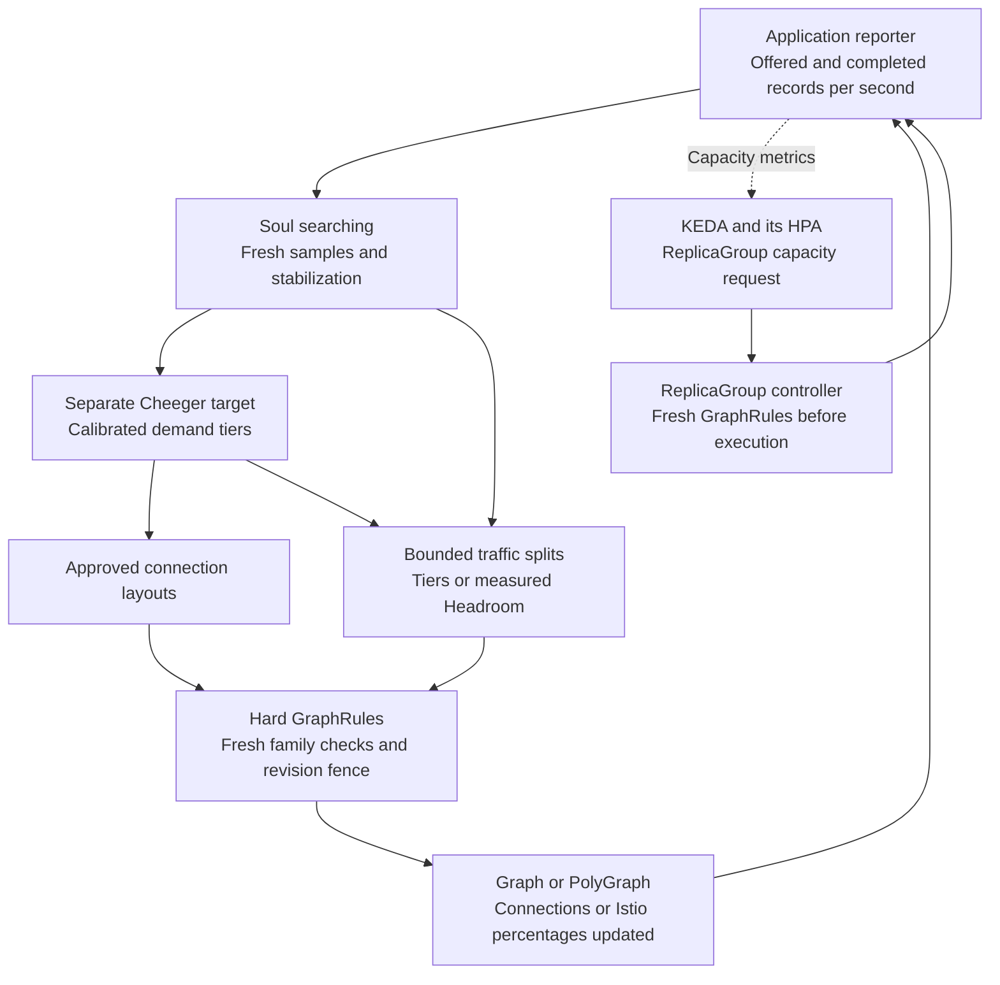

# Soul searching: application throughput and graph structure

**Soul searching** is Polyad's bounded topology optimizer. It uses application
throughput reports to recommend or apply administrator-approved connection layouts
and optional [traffic percentages between workload and graph replicas](traffic-balancing.md).
Approved [load profiles](load-profiles.md) can also adjust capacity lookahead before
completed throughput falls behind, independently of KEDA/HPA replica scaling.

Polyad keeps **hard structural Cheeger bounds** in GraphRules and a separate
**application-driven Cheeger target** in `Graph.spec.throughput` or
`PolyGraph.spec.throughput`. Configure `mode: Observe` (the default) to report
recommendations, or `mode: Adapt` to let the operator apply approved connection
layouts, bounded traffic adjustments and capacity profiles. Omitting `throughput` disables this
feedback controller; configured static traffic splits can still operate.

For side-by-side graph examples and orchestration diagrams, see
[comparing Cheeger bounds and throughput targets](cheeger-orchestration.md).
For policies active in both a parent and child, see
[nested Graphs and subgraph replication](cheeger-orchestration.md#nested-graphs-and-subgraph-replication).

## Table of contents

- [How the controls fit together](#how-the-controls-fit-together)
- [Calibrate the relationship](#calibrate-the-relationship)
- [Configure a bounded policy](#configure-a-bounded-policy)
- [Automatic traffic-weight adjustments](#automatic-traffic-weight-adjustments)
- [Report measurements](#report-measurements)
- [Bounds, observations and scalability](#bounds-observations-and-scalability)

## How the controls fit together

| Control | Responsibility | Changes |
| --- | --- | --- |
| GraphRule `cheeger.minimum` / `maximum` | Hard limits on permitted topology | Administrator-managed rules |
| Throughput policy `tiers[].cheeger` | Empirically calibrated target range for a demand tier | Constrains recommended or applied connection and traffic changes |
| KEDA / HPA | Workload or ReplicaGroup capacity | Replica counts through the selected scaling target |
| Optional Istio percentage routing | Divide incoming work among approved downstream targets | Bounded percentages from demand tiers or per-replica throughput/headroom |
| Throughput tier `capacity` | Prepare known upcoming workload stages | Approved forecast depth and Pod budget within fixed ceilings |

The topology controller never changes replica counts or rewrites GraphRules.
An adaptation must satisfy **both** its application target and every applicable
hard rule. For example, a static range `[0.5, 1.5]` and an application target
`[1, 2]` permit an adapted layout only within `[1, 1.5]`. Disjoint ranges produce
`NoAllowedLayout`; the operator does not relax policy to meet demand.

These controls complement each other. Replica scaling adds processing capacity;
topology adaptation changes which stages or graph instances can communicate;
traffic balancing redistributes requests among connected replicas. Changing
percentages alone does not change the unweighted Cheeger measurement.
Keep adaptation slower than workload autoscaling and allow measurements to settle
after a change. KEDA generally supplies metrics to its managed HPA; do not attach
a competing HPA to the same target. For graph-enforced scaling, target a
[ReplicaGroup](replication.md#connect-keda), which refreshes applicable
GraphRules before changing execution. Directly scaling a generated native
Deployment or StatefulSet bypasses that admission path.



## Calibrate the relationship

Cheeger is an unweighted structural measurement of the simple undirected
connections projection. It ignores edge direction, bandwidth, processing cost,
latency and hardware capacity. Measure records per second and the coordination
overhead of added edges through load tests. Use those measurements to choose
targets and layouts for your application's routing and partitioning contracts.

Report **offered demand and successfully completed work over the same measurement
window**, in the configured unit. Use one aggregate reporter per graph to combine
replica measurements into a complete sample. With the default `trigger: Shortfall`,
the controller considers connection changes and Tiers routing when offered demand is positive
and completed work is below
`offeredPerSecond * shortfallRatio` for the required duration and sample count.

The highest tier whose `threshold` is met supplies the target. Demand defaults
to `offeredPerSecond`; administrators can [select a named signal and unit](load-profiles.md#define-demand)
such as queued jobs or active sessions instead.
Below the first tier, no target applies. Connection layout changes respond to
sustained shortfall by default. Set `trigger: Demand` to select approved profiles
under sustained positive demand while throughput still keeps up; a lower tier can
select a smaller forecast or a sparser layout if its target requires one. See
[approved profiles and preparation](load-profiles.md#configure-approved-profiles).
When Cheeger already meets the target, configured traffic balancing can still
redistribute work among its connected destinations. Without a remaining approved
connection or traffic adjustment, `ThroughputShortfall` reports the unresolved problem.
Headroom routing can also rebalance under positive demand before aggregate
throughput falls; see its [mode and reporting guide](traffic-balancing.md#choose-an-automatic-balancing-mode).

## Configure a bounded policy

This four-stage example starts as a chain, with Cheeger `0.5`. Its approved ring
has Cheeger `1`. Supply persistent Daemon definitions named `a`, `b`, `c` and `d`
in the same namespace.

```yaml
apiVersion: polyad.astrivant.com/v1alpha1
kind: GraphRule
metadata:
  name: pipeline-envelope
spec:
  enforcement: Referenced
  scope: Boundary
  relation: connections
  cheeger: {minimum: 0.5, maximum: 1.5}
---
apiVersion: polyad.astrivant.com/v1alpha1
kind: Graph
metadata:
  name: pipeline
spec:
  mode: persistent
  rules: [pipeline-envelope]
  nodes:
    - {name: a, kind: Daemon, ref: a}
    - {name: b, kind: Daemon, ref: b}
    - {name: c, kind: Daemon, ref: c}
    - {name: d, kind: Daemon, ref: d}
  connections:
    - {source: a, target: b}
    - {source: b, target: c}
    - {source: c, target: d}
  throughput:
    mode: Observe # Choose Adapt to permit the approved replacement.
    unit: records
    tiers:
      - threshold: 100
        cheeger: {minimum: 1, maximum: 1.5}
    layouts:
      - name: ring
        connections:
          - {source: a, target: b}
          - {source: b, target: c}
          - {source: c, target: d}
          - {source: d, target: a}
    shortfallRatio: 0.9
    sampleMaxAgeSeconds: 60
    sustainedSeconds: 60
    minSamples: 3
    cooldownSeconds: 300
    maxChangesPerHour: 2
```

Layouts replace `connections` completely; they cannot add nodes, change admission
dependencies, change placement or grant new API permissions. Transport grants
require explicit `ports` and the graph's [network policy](../deployment/networking.md).
Applications consume [topology events](../workloads/workload-events.md) to update their own
neighbors and routing.

For PolyGraphs, these connections join child graph boundaries; their Cheeger
measurement describes those boundary vertices. Each child Graph may configure
its own independently calibrated feedback policy and measures throughput at its
own boundary.

To configure percentage routing instead of, or alongside, connection layouts,
see [fixed splits and automatic Tiers or Headroom balancing](traffic-balancing.md#choose-an-automatic-balancing-mode).
Those routes can target Workload, Daemon, Graph, PolyGraph and nested ReplicaGroup
copies through their local service entrypoints.

## Automatic traffic-weight adjustments

**`mode: Adapt` automatically updates live traffic weights.** `trafficMode`
determines how Soul searching chooses the target split:

- **`Tiers`:** the selected demand tier supplies administrator-defined percentages
  in `tiers[].trafficWeights`. Polyad moves the route's current
  `spec.traffic[].destinations[].weight` values toward that target and reconciles
  the resulting Istio routing. The tier's configured target percentages remain unchanged.
- **`Headroom`:** Polyad calculates the target percentages from each configured
  destination's completed throughput and reported spare capacity, then applies
  bounded steps toward that split. Omit tier `trafficWeights` in this mode.

For the [80/20 tier example](traffic-balancing.md#choose-an-automatic-balancing-mode),
a route starting at 60/40 can move automatically through **70/30 → 80/20**.
`maxWeightStep: 10` limits each destination's change to ten percentage points per
action. Each step requires fresh qualifying reports: at least three samples over
60 seconds, a 300-second cooldown between successful changes, and room within the
shared budget of two changes per rolling hour. The proposed state must satisfy
the tier's Cheeger target, live GraphRules and destination weight limits.

With the default `trigger: Shortfall`, offered demand must reach the tier's
threshold (100 records per second here) and completed work must remain below 90%
of offered work. Reaching the threshold alone does not trigger a change. If the
shortfall resolves at 70/30, the controller need not continue to 80/20. Choose
[`trigger: Demand`](load-profiles.md) to allow tier-based adjustments under sustained
positive demand even while throughput keeps up. `mode: Observe` only recommends
these changes; it leaves live weights as configured.

## Report measurements

Enable the composition API and grant the reporting key `endpoints: [throughput]`
plus access to the target in `graphs`. The route is `POST /v1/throughput` on that
listener, with bearer authentication and the key's shared rate/concurrency lane.
The listener fixes the destination namespace. Reserved operator graphs are not
application reporting targets.

```python
from datetime import datetime, timezone
from polyad_client import Client
from polyad_types import ThroughputSample

client = Client("http://polyad-api:8090", token)
client.report_throughput(ThroughputSample(
    graph="pipeline",
    graphUid=observed_graph_uid,
    generation=observed_graph_generation,
    observedAt=datetime.now(timezone.utc).isoformat(),
    unit="records",
    offeredPerSecond=200,
    completedPerSecond=120,
))
```

Obtain UID and generation from the graph's current Kubernetes observation. Samples
must advance in time; identical retries are idempotent. Wrong generations, reused
timestamps with different rates, stale observations and future timestamps are
rejected. A layout change increments generation, so the reporter must refresh it
and begin a new measurement window. Graph deletion or recreation invalidates old
samples.

Headroom balancing additionally requires current throughput and spare-capacity
reports for every configured destination. See
[per-replica measurements](traffic-balancing.md#report-per-replica-measurements)
for the `ThroughputSample.traffic` fields and execution identity checks.

## Bounds, observations and scalability

| Setting | Default | Permitted values |
| --- | --- | --- |
| `mode` | `Observe` | `Observe`, `Adapt`; Adapt requires layouts, tier traffic weights, Headroom balancing or capacity profiles |
| `trigger` | `Shortfall` | `Shortfall` requires a completed/offered deficit; `Demand` also allows preparation under sustained positive demand |
| `demand` | Omitted | Optional exact signal `name` and `unit`; otherwise uses reported offered work per second |
| `tiers[].threshold` | Required | Inclusive nonnegative minimum in the selected demand unit |
| `unit` | Required | Nonempty string, at most 64 characters |
| `tiers` | Required | 1–16 strictly increasing demand thresholds, with at least one Cheeger bound each |
| `layouts` | Empty | At most 8 uniquely named layouts, at most 380 connections each |
| `trafficMode` | `Tiers` | `Tiers` selects calibrated percentages; `Headroom` uses per-replica completed throughput and spare capacity |
| `tiers[].trafficWeights` | Empty | Approved route percentages for Tiers mode; not accepted in Headroom mode |
| `tiers[].capacity` | Omitted | Optional approved `lookaheadStages` (1–32) and `maxPods` (1–1,024); both integers required when present |
| `capacityCeiling` | Omitted | Required fixed ceiling for capacity profiles; current `spec.capacity` must also fit |
| `maxWeightStep` | 10 | 1–100 percentage points per destination per adjustment |
| `sampleMaxAgeSeconds` | 60 | 1–3,600; also the maximum gap in a sustained sample sequence |
| `sustainedSeconds` | 60 | 1–86,400 |
| `minSamples` | 3 | 2–1,000 distinct observations |
| `shortfallRatio` | 0.9 | Greater than 0 and at most 1 |
| `cooldownSeconds` | 300 | 1–86,400 |
| `maxChangesPerHour` | 2 | 1–60 successful changes in a rolling hour, shared by connection, traffic and capacity adjustments |
| `cheegerComputation` | Inherit operator ceilings | [Vertex/cut/time budgets and ordered priority cuts](cheeger-tuning.md#understand-computation-and-scale) |

Exact Cheeger computation defaults to **20 vertices per boundary**, with
[configurable computation budgets and priority cuts](cheeger-tuning.md#understand-computation-and-scale). Decompose
larger applications into local Graphs and PolyGraphs and calibrate each layer;
do not interpret measurements of different projections as interchangeable.
Reconciliation offloads cut enumeration from the asynchronous operator loop.

Observe and Adapt both publish `status.throughput`, including the measured
Cheeger value, target, recommendation and decision phase. Those observations
also appear in authorized graph event streams and optional PostgreSQL history.
The latest report and rolling change budget persist in Kubernetes annotations,
so HA failover does not reset the cooldown. Repeated reconciliations do not count
as additional samples. Changes to local execution membership, nested graph
revisions, replica intent or DaemonSet node eligibility reset stabilization; fresh
measurements must follow the observed capacity change.

With traffic routing, `currentTraffic`, `targetTraffic` and `proposedTraffic`
show the current, desired and next bounded splits. See
[traffic bounds and stabilization](traffic-balancing.md#bounds-and-stabilization)
for destination limits and how direction changes affect Headroom stabilization.

With capacity profiles, `currentCapacity`, `targetCapacity` and `proposedCapacity`
show forecast depth and budget. `CapacityUnavailable` blocks changes when the
operator has disabled preparation or its Pod ceiling is too small.

Before applying a profile change, Polyad refreshes the complete local graph family,
definitions and GraphRules, then uses a resource-version fence. Concurrent changes
require another pass. Active temporary connections defer application, and expired
measurements cannot authorize it. `CoolingDown`, `Stabilizing`, `StaleSample`,
`TemporaryConnectionsActive` and `NoAllowedLayout` explain why a change was withheld.
