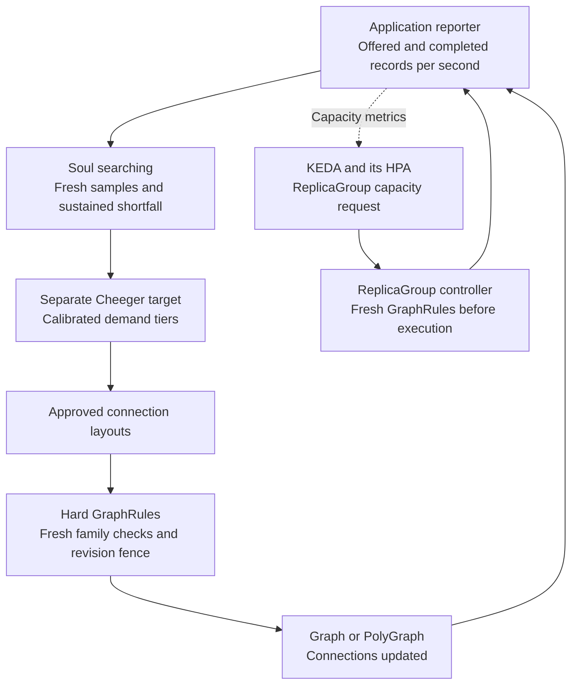

# Soul searching: application throughput and graph structure

**Soul searching** is Polyad's bounded topology optimizer. It uses application
throughput reports to recommend or apply administrator-approved connection layouts.

Polyad keeps **hard structural Cheeger bounds** in GraphRules and a separate
**application-driven Cheeger target** in `Graph.spec.throughput` or
`PolyGraph.spec.throughput`. Configure `mode: Observe` (the default) to report
recommendations, or `mode: Adapt` to let the operator apply approved connection
layouts. Omitting `throughput` disables this feedback controller.

For side-by-side graph examples and orchestration diagrams, see
[comparing Cheeger bounds and throughput targets](cheeger-orchestration.md).
For policies active in both a parent and child, see
[nested Graphs and subgraph replication](cheeger-orchestration.md#nested-graphs-and-subgraph-replication).

| Control | Responsibility | Changes |
| --- | --- | --- |
| GraphRule `cheeger.minimum` / `maximum` | Hard limits on permitted topology | Administrator-managed rules |
| Throughput policy `tiers[].cheeger` | Empirically calibrated target range for a demand tier | Recommendations, or approved connections in Adapt mode |
| KEDA / HPA | Workload or ReplicaGroup capacity | Replica counts through the selected scaling target |

The topology controller never changes replica counts or rewrites GraphRules.
An adaptation must satisfy **both** its application target and every applicable
hard rule. For example, a static range `[0.5, 1.5]` and an application target
`[1, 2]` permit an adapted layout only within `[1, 1.5]`. Disjoint ranges produce
`NoAllowedLayout`; the operator does not relax policy to meet demand.

These controls complement each other. Replica scaling adds processing capacity;
topology adaptation changes which stages or graph instances can communicate.
Keep adaptation slower than workload autoscaling and allow measurements to settle
after a change. KEDA generally supplies metrics to its managed HPA; do not attach
a competing HPA to the same target. For graph-enforced scaling, target a
[ReplicaGroup](replication.md#connect-keda), which refreshes applicable
GraphRules before changing execution. Directly scaling a generated native
Deployment or StatefulSet bypasses that admission path.



## Table of contents

- [Calibrate the relationship](#calibrate-the-relationship)
- [Configure a bounded policy](#configure-a-bounded-policy)
- [Report measurements](#report-measurements)
- [Bounds, observations and scalability](#bounds-observations-and-scalability)

## Calibrate the relationship

Cheeger is an unweighted structural measurement of the simple undirected
connections projection. It ignores edge direction, bandwidth, processing cost,
latency and hardware capacity. A high value does not guarantee records per second,
and adding edges can increase coordination overhead. Use load tests to choose
targets and layouts for your application's routing and partitioning contracts.

Report **offered demand and successfully completed work over the same measurement
window**, in the configured unit. Use one aggregate reporter per graph rather than
letting individual replicas overwrite one another's partial measurements. Low
traffic alone is not a throughput shortfall. The controller considers a change
only when offered demand is positive and completed work is below
`offeredPerSecond * shortfallRatio` for the required duration and sample count.

The highest tier whose `offeredPerSecond` threshold is met supplies the target.
Below the first tier, no target applies. This implementation adapts in response to
sustained shortfall; it does not automatically remove connections when demand falls.
When Cheeger already meets the target but application throughput remains low,
`ThroughputShortfall` reports the unresolved problem without adding more edges.

## Configure a bounded policy

This four-stage example starts as a chain, with Cheeger `0.5`. Its approved ring
has Cheeger `1`. Supply persistent Daemon definitions named `a`, `b`, `c` and `d`
in the same namespace.

```yaml
apiVersion: polyad.astrivant.com/v1alpha1
kind: GraphRule
metadata:
  name: pipeline-envelope
spec:
  enforcement: Referenced
  scope: Boundary
  relation: connections
  cheeger: {minimum: 0.5, maximum: 1.5}
---
apiVersion: polyad.astrivant.com/v1alpha1
kind: Graph
metadata:
  name: pipeline
spec:
  mode: persistent
  rules: [pipeline-envelope]
  nodes:
    - {name: a, kind: Daemon, ref: a}
    - {name: b, kind: Daemon, ref: b}
    - {name: c, kind: Daemon, ref: c}
    - {name: d, kind: Daemon, ref: d}
  connections:
    - {source: a, target: b}
    - {source: b, target: c}
    - {source: c, target: d}
  throughput:
    mode: Observe # Choose Adapt to permit the approved replacement.
    unit: records
    tiers:
      - offeredPerSecond: 100
        cheeger: {minimum: 1, maximum: 1.5}
    layouts:
      - name: ring
        connections:
          - {source: a, target: b}
          - {source: b, target: c}
          - {source: c, target: d}
          - {source: d, target: a}
    shortfallRatio: 0.9
    sampleMaxAgeSeconds: 60
    sustainedSeconds: 60
    minSamples: 3
    cooldownSeconds: 300
    maxChangesPerHour: 2
```

Layouts replace `connections` completely; they cannot add nodes, change admission
dependencies, change placement or grant new API permissions. Transport grants
require explicit `ports` and the graph's [network policy](../deployment/networking.md).
Applications consume [topology events](../workloads/workload-events.md) to update their own
neighbors and routing.

For PolyGraphs, these connections join child graph boundaries; their Cheeger
measurement describes those boundary vertices. Each child Graph may configure
its own independently calibrated feedback policy. This is not a single global
throughput guarantee across clusters.

## Report measurements

Enable the composition API and grant the reporting key `endpoints: [throughput]`
plus access to the target in `graphs`. The route is `POST /v1/throughput` on that
listener, with bearer authentication and the key's shared rate/concurrency lane.
The listener fixes the destination namespace. Reserved operator graphs are not
application reporting targets.

```python
from datetime import datetime, timezone
from polyad_client import Client
from polyad_types import ThroughputSample

client = Client("http://polyad-api:8090", token)
client.report_throughput(ThroughputSample(
    graph="pipeline",
    graphUid=observed_graph_uid,
    generation=observed_graph_generation,
    observedAt=datetime.now(timezone.utc).isoformat(),
    unit="records",
    offeredPerSecond=200,
    completedPerSecond=120,
))
```

Obtain UID and generation from the graph's current Kubernetes observation. Samples
must advance in time; identical retries are idempotent. Wrong generations, reused
timestamps with different rates, stale observations and future timestamps are
rejected. A layout change increments generation, so the reporter must refresh it
and begin a new measurement window. Graph deletion or recreation invalidates old
samples.

## Bounds, observations and scalability

| Setting | Default | Permitted values |
| --- | --- | --- |
| `mode` | `Observe` | `Observe`, `Adapt`; Adapt requires layouts |
| `unit` | Required | Nonempty string, at most 64 characters |
| `tiers` | Required | 1–16 strictly increasing demand thresholds, with at least one Cheeger bound each |
| `layouts` | Empty | At most 8 uniquely named layouts, at most 380 connections each |
| `sampleMaxAgeSeconds` | 60 | 1–3,600; also the maximum gap in a sustained sample sequence |
| `sustainedSeconds` | 60 | 1–86,400 |
| `minSamples` | 3 | 2–1,000 distinct observations |
| `shortfallRatio` | 0.9 | Greater than 0 and at most 1 |
| `cooldownSeconds` | 300 | 1–86,400 |
| `maxChangesPerHour` | 2 | 1–60 successful changes in a rolling hour |

Exact Cheeger computation is limited to **20 vertices per boundary**. Decompose
larger applications into local Graphs and PolyGraphs and calibrate each layer;
do not interpret measurements of different projections as interchangeable.
Reconciliation offloads cut enumeration from the asynchronous operator loop.

Observe and Adapt both publish `status.throughput`, including the measured
Cheeger value, target, recommendation and decision phase. Those observations
also appear in authorized graph event streams and optional PostgreSQL history.
The latest report and rolling change budget persist in Kubernetes annotations,
so HA failover does not reset the cooldown. Repeated reconciliations do not count
as additional samples. Changes to local execution membership, nested graph
revisions, replica intent or DaemonSet node eligibility reset stabilization; fresh
measurements must follow the observed capacity change.

Before applying a layout, Polyad refreshes the complete local graph family,
definitions and GraphRules, then uses a resource-version fence. Concurrent changes
require another pass. Active temporary connections defer application, and expired
measurements cannot authorize it. `CoolingDown`, `Stabilizing`, `StaleSample`,
`TemporaryConnectionsActive` and `NoAllowedLayout` explain why a change was withheld.
