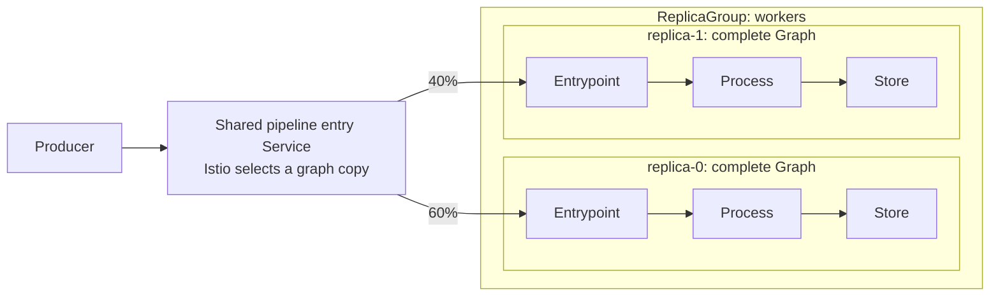
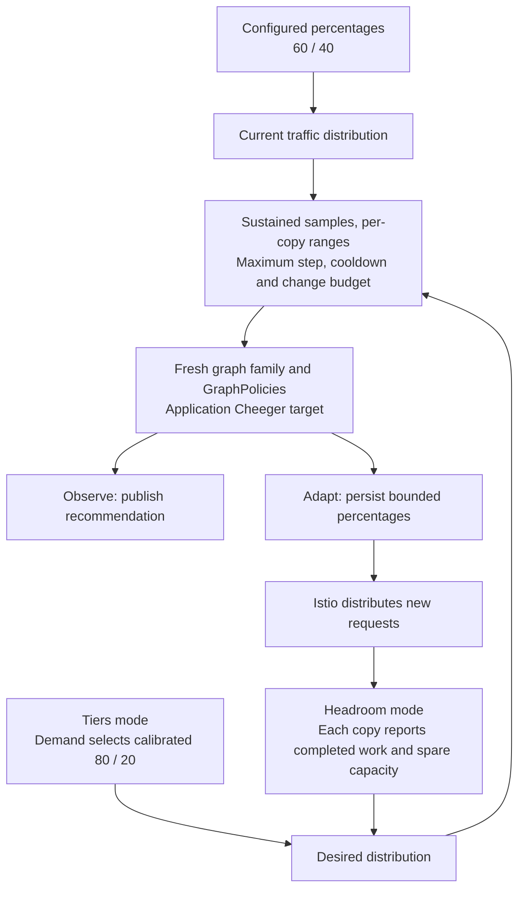

# Balance traffic between workload and graph replicas

<!-- toc:start -->
**Table of contents**

- [Connections, percentages and replicas](#connections-percentages-and-replicas)
- [Configure a fixed split](#configure-a-fixed-split)
- [Choose an automatic balancing mode](#choose-an-automatic-balancing-mode)
- [Report per-replica measurements](#report-per-replica-measurements)
- [Bounds and stabilization](#bounds-and-stabilization)
- [Scaling, ownership and limitations](#scaling-ownership-and-limitations)
<!-- toc:end -->

Polyad can optionally ask Istio to divide incoming requests among downstream
**Workload, Daemon, Graph or PolyGraph replicas**, through each replica's service entrypoint.
For example, send 60% of incoming pipeline work to `workers/replica-0` and 40% to
`workers/replica-1`. Each copy then runs its own internal graph.

This uses Istio's ordinary [weighted traffic routing](https://istio.io/latest/docs/tasks/traffic-management/traffic-shifting/).
It does not require an A/B experiment. Enable the chart's `mesh.enabled` integration,
provide an Istio sidecar mesh, and opt the application graph into `spec.traffic`.
Omitting `traffic` leaves routing to the application and its existing infrastructure.
Optional per-route circuit breaking, endpoint ejection, retries and timeouts are
described in [advanced Istio integration](../deployment/istio-features.md#graph-route-resilience).

## Connections, percentages and replicas

The routing mechanism is the same for every executable ReplicaGroup template:

| Replica kind | What receives each share |
| --- | --- |
| Workload | A Job copy serving an HTTP-compatible entrypoint for its active lifetime |
| Daemon | A service copy backed by its Deployment, StatefulSet or DaemonSet |
| Graph | The entrypoint workloads of one complete graph copy |
| PolyGraph | The entrypoint workloads inside one complete composition copy |
| Nested ReplicaGroup | Eligible entrypoints in one nested group, or a deeper explicitly selected copy |

A replica is an execution or composition, not necessarily one Pod. Istio can
balance among the eligible pods **within** each selected replica after choosing
that replica's share. A finite Workload without a request-serving endpoint cannot
receive HTTP traffic; this feature does not assign queue messages or launch Jobs.

These are three separate controls:

| Control | What it changes |
| --- | --- |
| Graph connections and [Cheeger bounds](cheeger-orchestration.md) | Which nodes may exchange work and the structural expansion required at each boundary |
| `traffic` and optional [Soul searching](soul-searching.md) feedback | The percentage of incoming requests assigned to each configured downstream target |
| [ReplicaGroup scaling](replication.md#connect-keda) | How many copies of a workload or complete graph exist |



The enclosing graph declares `producer → workers`. Its traffic route selects
individual paths **inside** that downstream node, such as `workers/replica-0`.
The shared Service selects only entrypoint pods, so processing and storage pods
inside each copy do not receive entry traffic. Use a deeper path such as
`workers/replica-0/entry` to narrow the subset to a particular node as well.
ReplicaGroup `connectivity` independently defines connections **between** copies;
copies can remain `Independent` while incoming work is balanced between them.

Current Cheeger calculations remain unweighted. A 90/10 and a 50/50 split have
the same structural value when their declared connections are identical. Even a
zero-percent destination retains its declared edge. Traffic weights are not
bandwidth measurements or a throughput guarantee; the application measurements
and calibrated Cheeger targets retain their separate meanings.

## Configure a fixed split

Start with the [runnable graph-replica example](../../examples/traffic-balancing.yaml).
It creates two copies of an entrypoint Graph, a producer and a shared Service.
The example retains fixed replica counts so it can be tried without KEDA.

```yaml
# Relevant fields of the enclosing Graph.spec:
network:
  mesh: true
  scope: Subtree
connections:
  - source: producer
    target: workers
    ports: [{port: 8080}]
traffic:
  - name: pipeline
    source: producer
    service: pipeline-entry
    port: 8080
    destinations:
      - target: workers/replica-0
        weight: 60
        minWeight: 10
        maxWeight: 90
      - target: workers/replica-1
        weight: 40
        minWeight: 10
        maxWeight: 90
```

The Service must exist in the same namespace and select the destination pods.
Its port must explicitly identify HTTP, HTTP/2 or gRPC through its name or
`appProtocol`. Here it uses port and target port 8080. If those ports differ,
the graph's transport grants must permit the **destination Pod port**.
Applications send requests to `pipeline-entry`, not directly to an individual
replica's Pod IP. All selected targets must accept the same request contract.

Polyad generates a `VirtualService` selecting the producer's mesh pods and a
`DestinationRule` whose subsets select each target subtree using operator-assigned
membership labels. These are restricted to the graph namespace. A target can be
a Workload, Daemon, Graph, PolyGraph, or nested ReplicaGroup path; sibling target subtrees
must not overlap. Each target's first path component needs a declared connection
from the source. This applies to local nodes in both Graphs and PolyGraphs.

Without `throughput`, percentages stay as configured. With
`throughput.mode: Observe`, those configured percentages still take effect, but
feedback produces recommendations only.

## Choose an automatic balancing mode

Both configurations use the existing `throughput` controller and report endpoint.
Keep `mode: Observe` while calibrating, then choose `Adapt` to permit bounded writes.

| `throughput.trafficMode` | How a split is chosen | When adjustment is considered |
| --- | --- | --- |
| `Tiers` (default) | An administrator supplies `tiers[].trafficWeights` for each demand range | Sustained aggregate throughput shortfall, or sustained positive demand with [`trigger: Demand`](load-profiles.md) |
| `Headroom` | Each destination's completed rate plus reported additional sustainable capacity determines its share | Sustained imbalance under positive demand, even before an aggregate shortfall |

Both require a matching demand tier and a proposed topology satisfying that
tier's Cheeger target and the live GraphPolicies. Neither changes replicas or
relaxes network authorization. `Headroom` does not accept tier `trafficWeights`;
choose one source of routing targets for each graph's feedback policy.

For calibrated demand tiers:

```yaml
throughput:
  mode: Adapt
  trafficMode: Tiers
  unit: records
  maxWeightStep: 10
  sustainedSeconds: 60
  minSamples: 3
  cooldownSeconds: 300
  maxChangesPerHour: 2
  tiers:
    - threshold: 100
      cheeger: {minimum: 1}
      trafficWeights:
        - route: pipeline
          weights:
            workers/replica-0: 80
            workers/replica-1: 20
```

Here `Adapt` automatically moves the live route toward the selected tier's 80/20
target. From the earlier 60/40 split, eligible adjustments can produce 70/30 and
then 80/20, subject to stabilization, cooldown and the shared change budget.
The tier target remains administrator-defined. Because `trigger` defaults to
`Shortfall`, demand reaching 100 records per second alone is insufficient: a
sustained throughput deficit is also required. See
[automatic traffic-weight adjustments](soul-searching.md#automatic-traffic-weight-adjustments)
for the precise behavior and the `Demand` alternative.

For measured capacity, use `trafficMode: Headroom` and omit `trafficWeights`:

```yaml
throughput:
  mode: Adapt
  trafficMode: Headroom
  unit: records
  maxWeightStep: 10
  sustainedSeconds: 60
  minSamples: 3
  cooldownSeconds: 300
  maxChangesPerHour: 2
  tiers:
    - threshold: 100
      cheeger: {minimum: 1}
```



## Report per-replica measurements

Use one application reporter to assemble measurements over the same window and
unit. The [Python SDK](../../pkg/polyad-sdk/README.md) submits these through the
existing [Soul searching throughput endpoint](soul-searching.md#report-measurements).

```python
from polyad_types import ThroughputSample, TrafficSample

sample = ThroughputSample(
    graph="balanced-pipeline",
    graphUid=root_uid,
    generation=root_generation,
    observedAt=window_end.isoformat(),
    unit="records",
    offeredPerSecond=1000,
    completedPerSecond=800,
    traffic=(
        TrafficSample("pipeline", "workers/replica-0", copy0_uid, copy0_generation,
                      completedPerSecond=400, headroomPerSecond=100),
        TrafficSample("pipeline", "workers/replica-1", copy1_uid, copy1_generation,
                      completedPerSecond=400, headroomPerSecond=600),
    ),
)
client.report_throughput(sample)
```

The UID and generation identify the **execution at the target path**, such as the
actual child Graph for `workers/replica-0`, not its reusable template. Obtain
execution identities through [topology snapshots](../workloads/workload-events.md)
and current resource observations. A deeper path ending at a Daemon identifies
its generated Deployment, StatefulSet or DaemonSet instead.

In this example the capacities are 500 and 1,000 records/second. The desired
allocation is approximately 33/67, subject to minimums and maximums. Polyad
apportions exactly 100 integer percentage points using highest averages, starting
at each destination's minimum and respecting its maximum. It then takes at most
`maxWeightStep` points per destination toward that allocation. A zero-capacity
destination receives only its configured minimum in the target; insufficient
usable capacity leaves the distribution unchanged.

Headroom is the application's estimate of **additional sustainable work per
second**, not CPU percentage or memory bytes. Use completed work and headroom for
the entire pipeline copy when balancing complete graphs. The shared entrypoint
Service then delivers that copy's share to its ready entrypoint pods.
The [application reporting contract](../workloads/adaptive-microservices.md#report-useful-work-and-headroom)
explains how to measure useful completion and account for shared downstream limits.

Missing destination reports, replaced execution UIDs, changed generations and
unusable capacity produce `WaitingForTrafficSample`. They do not fall back to
invented equal shares or a tier split. The aggregate sample's timestamp and
generation fences apply to every enclosed measurement.
Reports support at most 256 distinct route/target measurements and 64 KiB of JSON.

## Bounds and stabilization

| Setting | Default / constraint | Meaning |
| --- | --- | --- |
| `traffic` | Omitted; at most 16 routes | Optional routing configuration |
| `traffic[].destinations` | 2–16 distinct nonoverlapping targets | Each receives an integer percentage; total must be 100 |
| `weight` | Required, 0–100 | Current configured percentage |
| `minWeight` / `maxWeight` | 0 / 100 | Inclusive permitted range, also checked for tier targets |
| `maxWeightStep` | 10, range 1–100 | Maximum change in percentage points per target per action |
| `sampleMaxAgeSeconds` | 60 | Maximum sample age and acceptable report gap |
| `sustainedSeconds` / `minSamples` | 60 / 3 | Required continuous evidence and distinct reports |
| `cooldownSeconds` / `maxChangesPerHour` | 300 / 2 | Shared budget for connection and percentage changes |

For Headroom mode, reversing the proposed adjustment direction restarts
stabilization. Scaling, workload revision changes and membership changes require
fresh measurements after the new capacity settles. Keep this controller slower
than workload autoscaling. Active temporary connections defer automatic changes.
See [throughput tuning](cheeger-tuning.md) for the remaining computation and timing limits.

The operator exposes `status.throughput.currentTraffic`, `targetTraffic` and
`proposedTraffic` alongside the existing Cheeger values and decision phase. These
observations flow through the existing graph event stream, with its graph-tree
access rules. Structured decision logs describe accepted changes and conflicts;
Istio supplies the actual request-distribution telemetry.

## Scaling, ownership and limitations

Routing percentages follow explicit target paths. Newly created ReplicaGroup
copies receive no share until added to the route and its configured tier targets,
or to its Headroom reports. This keeps the set of eligible destinations under
administrator control. Headroom mode redistributes among those configured copies;
it does not discover and add arbitrary destinations.

A positive assignment blocks removal of its destination during graph-enforced
scale-in. First permit and set that destination's weight to zero, redistribute
the remaining 100%, and wait for the zero weight to be persisted to Istio's
VirtualService. Then remove the copy. Zero-weight paths can remain declared
through scale-in in Tiers/static mode. In Headroom mode, update the route and
report inventory together so every configured destination has a current report.
Scaling workloads directly through native Kubernetes APIs bypasses Polyad's
graph admission checks, as it does for other GraphPolicies.

Policies are graph-owned auxiliary resources and update in place; changing a
percentage does not roll application pods. Polyad refuses to adopt another
controller's resources or configure a host already claimed by another local
mesh route/destination policy. Administrators should also avoid overlapping
policies exported from other namespaces. Removing a route removes its forwarding
policy before its destination subsets. Turning off the integration should follow
removing the graph's traffic configuration while mesh access is still enabled.

This implementation handles **local sidecar HTTP, HTTP/2 and gRPC request routing**
through Services using the `cluster.local` cluster domain. It does not implement
raw TCP percentage routing, ambient waypoint policy, or remote-cluster subsets.
Cross-cluster transport remains the separate [multicluster configuration](../deployment/multicluster.md).

Percentages describe expected request shares over time, not exact quotas, work
cost, connection counts, or bytes. Existing streaming RPCs and in-flight work are
not migrated when weights change. An empty or unhealthy subset may fail requests;
Polyad does not silently override its weights for failover. Istio's propagation
is asynchronous: proxies adopt a persisted policy over time.
Drain existing work and allow that propagation before removing a replica.
See the [VirtualService](https://istio.io/latest/docs/reference/config/networking/virtual-service/)
and [DestinationRule](https://istio.io/latest/docs/reference/config/networking/destination-rule/)
references for source selection, subsets and weighted routing.
