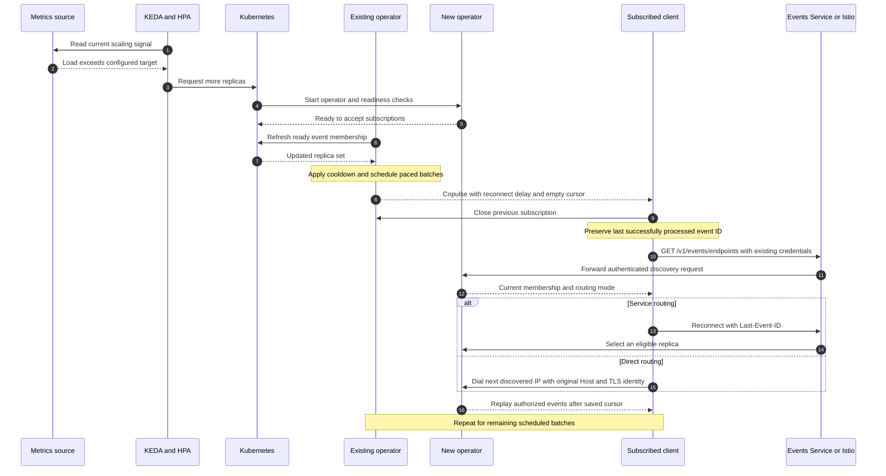
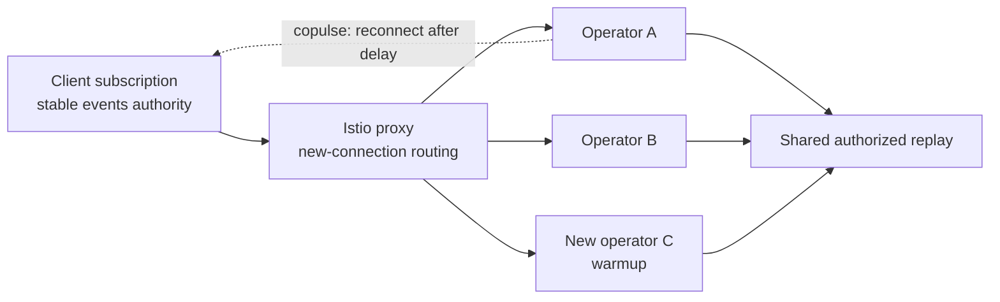
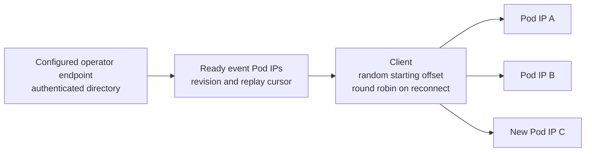
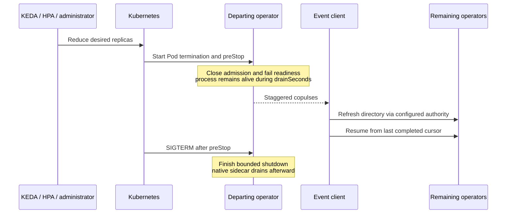

# Event connection rebalancing and copulses

A WebSocket or SSE subscription stays attached to the operator replica that
accepted it. Adding replicas gives new subscriptions more capacity; existing
subscriptions need to reconnect to use that capacity. A **copulse** is an
operator instruction to reconnect an event stream, keeping the last completed
application checkpoint.

## Table of contents

- [Enable and tune](#enable-and-tune)
- [Scale-out and subscription migration](#scale-out-and-subscription-migration)
- [Istio and Service routing](#istio-and-service-routing)
- [Direct client routing](#direct-client-routing)
- [Client recovery](#client-recovery)
- [Administrator-triggered rolls](#administrator-triggered-rolls)
- [Scale-down and shutdown](#scale-down-and-shutdown)
- [Scope and failure behavior](#scope-and-failure-behavior)

## Enable and tune

Use [values-event-rebalancing.reference.yaml](../../charts/polyad/values-event-rebalancing.reference.yaml)
as an overlay on your credentials, network permissions and Istio configuration.
The feature defaults off. It works for both transports and for dense operators
or the gateway group in a [split deployment](../deployment/components.md).

| Helm setting under `events.rebalance` | Default | Effect |
| --- | --- | --- |
| `enabled` | `false` | Enable the endpoint directory, copulses and preStop hook |
| `routing` | `Service` | Delegate new connections to the Service/mesh; `Direct` enables client Pod-IP selection |
| `refreshSeconds` | `5` | Refresh ready membership; reject discovery older than three intervals |
| `automatic` | `true` | Roll existing subscriptions after membership changes |
| `batchPercent` | `10` | Percentage of initial local subscribers scheduled per batch, rounded up to one |
| `intervalSeconds` | `2` | Separate batches and jitter reconnects |
| `cooldownSeconds` | `60` | Coalesce subsequent ordinary triggers |
| `drainSeconds` | `20` | Keep a terminating process alive to move subscribers |
| `maxConnectionSeconds` | `0` | Optional age-triggered rotation; zero disables it |

An ordinary roll schedules the subscriptions present when it starts. Connections
opened afterward stay out of that roll. Repeated membership or administrative
changes coalesce behind the cooldown and the already scheduled batches. An age
limit starts a paced roll of eligible connections according to the configured budgets.
These budgets apply **per operator replica**, with jitter to spread simultaneous
rolls across the group. Termination takes precedence over ordinary cooldowns.

## Scale-out and subscription migration

This **sequence diagram** reads from top to bottom: each vertical line is a
participant, and horizontal arrows show requests and responses in order. KEDA
supplies scaling metrics to its HPA. Once Kubernetes makes another replica ready,
Polyad can move existing subscriptions onto the enlarged group.



Routing may choose any eligible replica. Each subscription refreshes its
endpoint list independently, and membership changes arriving during a roll are
coalesced. The [scale-down sequence](#scale-down-and-shutdown) describes evacuation
of a departing replica before process exit.

For the separate loop that selects graph parameters and prepares upcoming workload
capacity, see the [Soul searching sequence diagram](../graphs/load-profiles.md#from-incoming-demand-to-prepared-capacity).

## Istio and Service routing

Set `events.istio.enabled: true`, `mesh.operator.enabled: true` and
`events.rebalance.routing: Service`. Polyad creates a DestinationRule for the
events Service. Its `loadBalancer` defaults to `LEAST_REQUEST`; `ROUND_ROBIN` is
also available. `warmupSeconds` defaults to 30 and gradually admits traffic to
new endpoints. Configure the workload or ingress identity in
`mesh.operator.eventPrincipals` and allow it through the NetworkPolicy.



Istio selects upstream endpoints for new requests and provides mesh identity and
transport security. Polyad schedules reconnects and the client resumes application
delivery. An established stream does not migrate when the proxy's endpoint list
changes. The chart also configures the native sidecar's termination drain duration.
See Istio's [load balancing and warmup reference](https://istio.io/latest/docs/reference/config/networking/destination-rule/#LoadBalancerSettings)
and [proxy shutdown configuration](https://istio.io/latest/docs/reference/config/istio.mesh.v1alpha1/#ProxyConfig).

Service routing is also usable without Istio, through the existing Kubernetes
Service. External clients should retain their reachable gateway authority.

## Direct client routing

For clients with connectivity to the operator Pod network, choose `routing: Direct`
and leave `events.istio.enabled: false`. The authenticated
`GET /v1/events/endpoints` route returns ready, nonterminating Pod IPs from this
operator's events Service selector, a membership revision and an initial replay
cursor. The directory is bounded to 256 replicas and requires the same `events`
permission and operator access mode as the subscription.



The client refreshes the directory before every reconnection, then rotates through
the current IP set. It changes only the socket destination: the configured Host
header, TLS server name and certificate verification remain intact. Discovery and
credentials stay pinned to the configured operator authority; copulses contain no
URL. Redirects are disabled, and discovered loopback, link-local, multicast and
unspecified addresses are rejected. Direct connections bypass environment HTTP
proxies, so they need actual Pod-network reachability.

Use Service routing when an Istio proxy is responsible for upstream selection:
HTTP authority-based routing can select a different endpoint than the socket's
original IP. For TLS-terminating ingress installations, direct dialing works only
if the Pod listener itself supports TLS for the configured authority. Mesh clients
can use their HTTP Service authority with sidecar mTLS.

## Client recovery

```python
import os
from polyad_sdk import Client

client = Client(os.environ["POLYAD_EVENTS_URL"], os.environ["POLYAD_EVENTS_TOKEN"])
subscription = client.subscribe(
    transport="websocket",  # SSE supports the same policy.
    rebalance=True,
    cursor=last_completed_cursor,  # Restore the application's durable checkpoint.
)
subscription.on(lambda event: event.event == "topology", refresh_neighbors)
subscription.run()
```

With `rebalance=True`, `run()` continues until stopped or an error needs application
recovery. Call `subscription.stop()` from the application's shutdown path; it
interrupts reconnect delays, and active reads check it on heartbeats. The finite
client timeout bounds an unresponsive transport. Ordinary subscriptions retain
their existing explicit retry behavior and raise `StreamInterrupted` on a copulse.

The managed subscription closes the previous connection, waits for the copulse's
bounded delay, refreshes discovery and resumes from its last completed cursor.
It starts from the directory's cursor when no checkpoint was supplied. Transient
transport errors, EOF and HTTP 429/502/503/504 use jittered exponential backoff
capped at 30 seconds. Callback failures, authorization failures, certificate
verification failures and expired replay require explicit recovery. An expired
cursor still needs a [fresh topology snapshot](../workloads/workload-events.md#read-current-neighbors).

Delivery remains at least once. Callbacks must handle replay, and applications
should persist their completed checkpoints. Copulses have an empty event ID and
never advance that checkpoint. Their [importable AST](../apis/event-contract.md)
is `CopulseEvent`, with `reason`, `revision` and `retryAfterSeconds` fields.

## Administrator-triggered rolls

Set a new opaque value on the events Service:

```bash
kubectl annotate service RELEASE-polyad-events -n NAMESPACE \
  polyad.astrivant.com/event-copulse="$(date +%s)" --overwrite
```

Kubernetes RBAC controls this operation; a subscriber token cannot trigger it.
Each existing replica observes the changed value and schedules its current
subscriptions subject to cooldown. Newly starting replicas initialize from the
current annotation and do not replay an old trigger. Set `automatic: false` to
keep ordinary rolls administrator-triggered. Termination drains remain enabled.

## Scale-down and shutdown



The hook starts before process shutdown, after Kubernetes chooses the departing
Pod. It does not intercept KEDA/HPA's desired replica count. The operator stops
accepting new subscriptions and schedules every existing subscription for reset;
large batches are compressed to fit the drain window. The regular membership poll
excludes terminating Pods from discovery and also triggers rebalancing on survivors.

Allow at least `drainSeconds + 35` seconds in
`operator.terminationGracePeriodSeconds`. With the native Istio sidecar, allow
`2 * drainSeconds + 35`; the reference overlay uses 90 seconds. Keep the event
polling interval comfortably below the drain window. Slow consumers and abrupt
node failures can still interrupt delivery before a control reaches the client;
EOF/error recovery uses the same checkpoint. Preserve sufficient replay retention
and remaining subscriber capacity for the move. A zero-replica group cannot accept
subscriptions until capacity returns.

## Scope and failure behavior

Copulses manage **event subscriptions**. They neither delete temporary connection
grants nor change graph edges, activation state or Cheeger measurements. They are
direct transport controls, not retained graph observations; reserved operator
Graphs and the atlas stay filtered from application event streams.

Each operator event group advertises its own replicas. Root-held remote streams
retain their `cluster` selection and graph grants while moving between root
replicas. There is no credential forwarding to unrelated child operators or
automatic switching between independent replay stores.

The coordinator adds one asynchronous membership task to the existing HTTP
runtime and a bounded local schedule, capped by `events.maxConnections`. It does
not start another API server or a per-subscription thread. Decision logs report
the reason, number of subscriptions and batch size through the existing
[OpenTelemetry logging path](tracing.md). Shared replay state and existing
[API-key lanes](api-keys.md) continue to enforce authorization and HA-wide limits.
