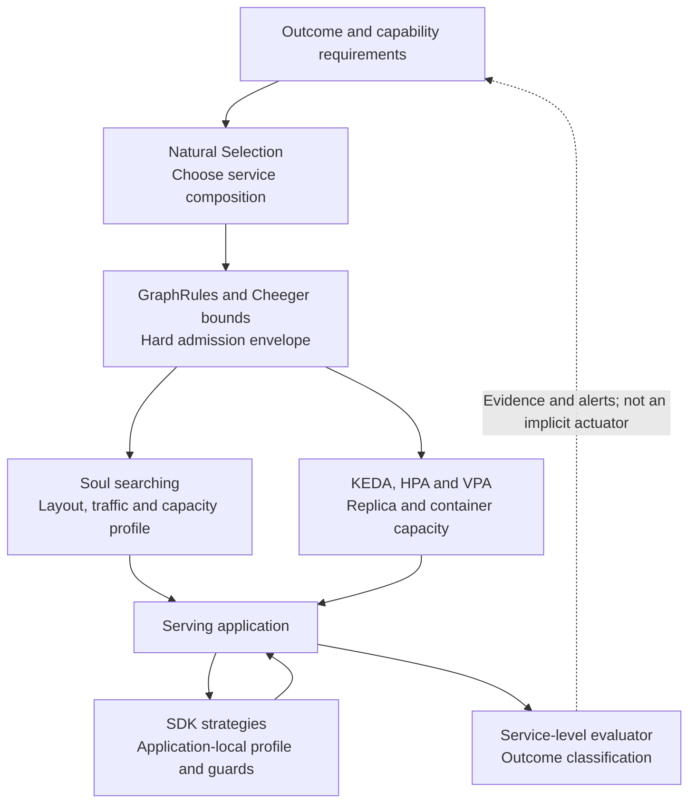

# Resilience control loops: interactions and tradeoffs

<!-- toc:start -->
**Table of contents**

- [The control hierarchy](#the-control-hierarchy)
- [What each mechanism controls](#what-each-mechanism-controls)
- [Cheeger is a constraint, not an SLA](#cheeger-is-a-constraint-not-an-sla)
- [Soul searching and the SLA loop](#soul-searching-and-the-sla-loop)
- [Natural Selection and Soul searching](#natural-selection-and-soul-searching)
- [SDK strategies, VPA and in-place resize](#sdk-strategies-vpa-and-in-place-resize)
- [Common conflicts and safeguards](#common-conflicts-and-safeguards)
- [Safe operating pattern](#safe-operating-pattern)
- [Tradeoff summary](#tradeoff-summary)
<!-- toc:end -->

Polyad's resilience comes from composing several bounded mechanisms, not from a
single score. Cheeger rules constrain structure, Soul searching responds to
measured graph demand, Natural Selection chooses capability compositions, SDK
strategies adapt inside applications, Kubernetes controllers supply capacity,
and service-level evaluation measures the customer-visible result.

This guide explains where those algorithms reinforce one another, where they can
fight, and how to assign authority safely.

## The control hierarchy



The diagram is a hierarchy of responsibility, not a mandatory synchronous call
chain. In the production operator, Natural Selection is currently demonstrated
by the finite local `nature.py` planner and described as a broader Copolyad
direction. Do not assume that a production Graph is being recomposed merely
because Soul searching or an SDK strategy is enabled.

## What each mechanism controls

| Mechanism | Reads | May change | Strength | Main limitation |
| --- | --- | --- | --- | --- |
| GraphRule Cheeger bounds | Projected graph relation | Nothing directly; admits or blocks proposed state | Hard structural invariant | Structure is not service quality |
| Soul searching | Fresh demand, completion, headroom and current graph | Approved connections, traffic percentages and capacity profiles in `Adapt` | Bounded graph feedback controller | Delayed/noisy feedback can oscillate |
| Natural Selection | Required outcome, capability contracts, costs and exact structural floor | Selected services, routes and incarnations in the local study | Composition planner | Bounded enumeration and model/catalog quality |
| SDK adaptation strategies | Projected deltas, metrics, topology and local state | Application intent, routing candidates or worker profile | Fast, application-aware response | Correct admission, idempotency and draining remain application duties |
| VPA | Resource policy and workload observations | Container requests/limits, sometimes through eviction | Vertical resource controller | Resize timing and disruption are not capability guarantees |
| KEDA/HPA | Scaling metrics | Replica count of one selected target | Horizontal resource controller | Cannot repair an unsuitable topology or implementation |
| SLA evaluator | Application outcome reports and adaptation lifecycle | Status and metrics only | Customer-visible outcome evidence | Accuracy depends on reporting semantics and freshness |

Istio routing, locality, retry and outlier policies are execution mechanisms
used by admitted graph decisions. They can improve delivery, but must not hide
application failures through unbounded retries or make proxy success a substitute
for end-to-end completion.

## Cheeger is a constraint, not an SLA

For the simple undirected projection used by Polyad:

```text
h(G) = min |edges crossing (S, V-S)| / min(|S|, |V-S|)
       over every nonempty proper subset S
```

Directions, weights, bandwidth, message size, CPU, latency and processing cost
are ignored. A larger value can remove a sparse structural cut, but it can also
add coordination or fan-out overhead. A graph can have an excellent Cheeger
value and a broken service; a sparse graph can satisfy its SLO under light load.

Polyad tests configured priority cuts first and then enumerates complementary
cuts once with a Gray-code traversal. Python's arbitrary-width integer bitsets
keep the traversal exact, while `int.bit_count()` performs population counts in
native code. A complete search produces the exact value. Exhausting vertex, cut
or time budgets produces an explicit incomplete result, never an exact label.
When checking a hard minimum, a witnessed cut below that minimum is already a
sufficient certificate to reject the state.

Use GraphRule bounds as an outer safety envelope. Soul searching's tier target
is an empirically calibrated desired range inside that envelope. Their
intersection must be nonempty; the throughput controller never relaxes a rule.

## Soul searching and the SLA loop

Soul searching asks, “Would one of the approved graph configurations respond
better to this sustained demand?” The service-level evaluator asks, “Did the
customer-visible outcome meet its contract?” They may consume related throughput
evidence, but they have different populations, windows and authority.

- Soul samples compare offered and completed work in one unit and require
  freshness, sustained evidence, minimum sample counts, cooldown and a change
  budget. `Observe` recommends; `Adapt` can actuate approved state.
- SLA samples account successful and eligible requests, the current p99 and
  current completion rate. They classify status but do not mutate the graph.
- A Soul layout change increments graph generation, fencing old throughput
  samples. A Daemon generation similarly fences service-level and adaptation data.

Do not wire every SLA breach directly back into Soul adaptation. That creates a
positive feedback path in which transition latency triggers another transition.
If SLO evidence is used as a future trigger, require a specific violation,
sustained fresh samples, a candidate expected to affect that violation, and the
same cooldown/change budgets as other actuators.

## Natural Selection and Soul searching

Natural Selection and Soul searching act at different boundaries:

- Natural Selection chooses a composition that can produce a required semantic
  outcome through compatible capabilities, within cost, process and exact
  Cheeger constraints.
- Soul searching adapts worker profiles inside a selected service and, in the
  operator, chooses approved graph layouts, traffic or capacity profiles without
  inventing capabilities.

In the local study, a service mutation changes its implementation and service
PID. A surviving service can retain its PID while Soul changes its worker pool.
Replacement services become ready before route commit; removed services drain
after the revision is adopted. Revision fences reject stale jobs and decisions.

The advantage is layered adaptation: composition can change when the required
kind of service changes, while cheaper local adjustments handle ordinary load.
The risk is duplicated authority. Soul must not restore a service that Natural
Selection retired, route through an old revision, or select a worker profile that
breaks the capability contract. Composition requirements are the outer boundary.

## SDK strategies, VPA and in-place resize

SDK strategies are application-local observers and guards. They can select a
low-memory worker profile, propose a high-throughput batch profile, change local
routing, or block new work until capacity and peers are safe. A strategy proposal
does not mean the application admitted or completed it: the supervisor must
recheck constraints, reserve rolling overlap, await readiness, commit, and drain.

VPA owns container resource mutation. Polyad projects VPA `minAllowed` and
`maxAllowed` values into generated Pods, while the SDK exposes those policy
bounds and live cgroup assignments/usage. An application can therefore follow an
in-place resize: re-read live cgroup values, clamp a desired local profile to the
VPA interval, and report the resulting strategy lifecycle and service outcomes.

Keep these responsibilities separate:

1. VPA decides the container allocation within its policy.
2. The SDK strategy decides what the application can safely do with the current
   allocation.
3. The SLA report records whether customers still received the contracted service.

Do not let both HPA and VPA control the same resource signal, and do not derive a
safe application worker count from startup environment variables after an
in-place resize. Those variables are snapshots; the cgroup sample is live.

## Common conflicts and safeguards

| Interaction | Failure mode | Safeguard |
| --- | --- | --- |
| Soul target vs GraphRule | Desired tier has no legal layout | Validate range intersection; expose `NoAllowedLayout`; never relax the rule |
| Soul and SDK strategy | Both respond to the same shortfall and overcorrect | Give graph routing/topology to Soul and local concurrency/profile to the application; stagger their clocks |
| Soul and KEDA/HPA | Topology and replica count change before either settles | Let autoscaling settle faster; use longer Soul stabilization and cooldown |
| VPA and SDK profile | Profile starts before resized capacity exists | Read live cgroups, reserve overlap, wait for readiness, then commit |
| VPA and HPA | Controllers chase the same CPU or memory signal | Assign each resource dimension to one controller |
| Natural Selection and Soul | Local optimizer violates the selected capability or revision | Treat composition and revision as immutable inputs to the local optimizer |
| Retry policy and SLA | Retries inflate latency/load while masking first-attempt failure | Bound retries and report end-to-end outcomes from one declared population |
| Multiple SLA reporters | Requests are double-counted or gaps disappear | Use one aggregate reporter per `graphUid/node` population |
| Stale `Compliant` status | Reporting stops while last state remains green | Alert on `sample_fresh == 0` independently of state |
| Nested graph policies | Parent and child loops adapt simultaneously | Calibrate each boundary independently and serialize or stagger changes |

## Safe operating pattern

Use the following precedence when mechanisms disagree:

1. Identity, generation, permissions and capability compatibility reject stale
   or unauthorized actions.
2. Resource ceilings and GraphRules reject unsafe candidate states.
3. Readiness, local constraints and overlap reservations govern execution.
4. Soul/Natural Selection ranking chooses among the candidates that remain.
5. SLA state judges the observed customer result; it does not legalize a state
   rejected above.

Assign exactly one actuator to each variable: one replica owner, one vertical
resource owner, one graph-layout owner and one local-profile supervisor. Begin
Soul searching in `Observe`, compare its recommendations with load tests and SLA
reports, then enable `Adapt` with conservative cooldown and change budgets.
Choose time scales deliberately: local admission guards may react immediately,
autoscaling should settle next, and structural/composition changes should be
slower and rarer.

During every transition, preserve the minimum capability, use readiness-before-
commit and drain-after-cutover, and report adaptation lifecycle independently
from service quality. A healthy design allows `Progressing` and `Compliant` at
the same time; it also makes a `Degraded` or `Unavailable` result override the
comfort of seeing progress.

## Tradeoff summary

| Technique | Benefit | Cost or pitfall | Best use |
| --- | --- | --- | --- |
| Higher Cheeger floor | Rejects sparse structural bottlenecks | More edges and coordination; exponential exact search | Small, meaningful graph boundaries with known critical cuts |
| Soul `Adapt` | Closed-loop response using approved choices | Oscillation and delayed attribution | Calibrated layouts with stabilization and rollback evidence |
| Natural Selection | Changes service composition to preserve an outcome | Search cost, catalog/model drift and replacement overlap | Infrequent semantic or capability changes |
| SDK strategy | Fast application-aware behavior | Application must implement safe commit and replay | Local workers, queues, routing and resource-aware profiles |
| VPA | Rightsizes each container and can support in-place growth | May evict; availability does not follow automatically | Resource envelopes paired with live application guards |
| Horizontal scaling | Adds parallel capacity | Stateful ownership and topology may limit benefit | Partitionable work with one scaling owner |
| SLA evaluation | Separates customer outcome from infrastructure motion | Reporter bias, fixed-window semantics and stale evidence | Alerting, release evaluation and bounded policy input |

Resilience is therefore conditional, not absolute: the system remains adaptable
only while at least one admitted candidate preserves capabilities, resource
bounds and the service contract. When no such candidate exists, explicit
`Degraded`, `Unavailable`, `NoAllowedLayout` or blocked-admission evidence is
safer than continuous mutation.

Continue with the [service-level computation reference](../workloads/service-level-computations.md),
[Cheeger orchestration](../graphs/cheeger-orchestration.md),
[Soul searching](../graphs/soul-searching.md),
[Natural Selection walkthrough](../workloads/local-natural-selection.md),
[adaptation strategies](../workloads/adaptation-strategies.md), and
[VPA compatibility](../deployment/vpa.md).
