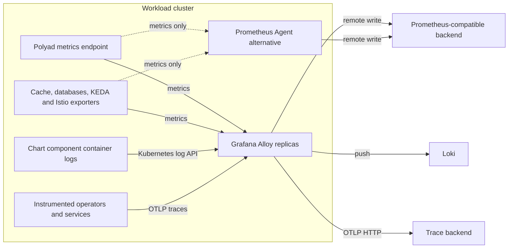

# Collect metrics, logs and traces

The operator chart can install **Grafana Alloy** for all three signals, or
**Prometheus Agent** for metrics only. Both discover changing Pod endpoints and
remote-write samples to an existing Prometheus-compatible backend. Collection is
disabled by default and does not add another Python API server.

## Table of contents

- [Choose a collector](#choose-a-collector)
- [What gets collected](#what-gets-collected)
- [Credentials and network access](#credentials-and-network-access)
- [Replicas and storage](#replicas-and-storage)
- [Benchmark deployment](#benchmark-deployment)
- [Additional targets and clusters](#additional-targets-and-clusters)
- [References](#references)

## Choose a collector

Start with the typed [Alloy reference](../../charts/polyad/references/values-telemetry.reference.yaml).
Set the remote-write URL, Loki push URL and OTLP/HTTP destination for your stack.
The chart supplies collectors; it does not install those backends.

```yaml
telemetry:
  enabled: true
  mode: Alloy
  replicas: 2
  remoteWrite:
    url: http://prometheus.monitoring.svc:9090/api/v1/write
  logs:
    enabled: true
    url: http://loki-gateway.monitoring.svc/loki/api/v1/push
  traces:
    enabled: true
    endpoint: http://tempo.monitoring.svc:4318
    routeOperator: true
tracing:
  enabled: true
```

`routeOperator` sends Helm-installed operators and observers through this release's
`RELEASE-telemetry-otlp` Service. Other instrumented services can export OTLP/gRPC
to port `4317`, or OTLP/HTTP traces to port `4318` at `/v1/traces`. Trace sampling
remains an application setting; see [OpenTelemetry tracing](tracing.md).

For metrics only, use the
[Prometheus Agent reference](../../charts/polyad/references/values-prometheus-agent.reference.yaml).
Select `PrometheusAgent`, one replica, and disable `logs.enabled` and
`traces.enabled`. Helm rejects a mixed configuration. Metrics collection enables
the operator's existing metrics listener except in downstream worker mode, where
observations continue flowing to the root.



## What gets collected

Discovery uses the enabled chart components' actual selectors, including
dependency name overrides. It does not scrape every Service port or collect
every workload in the namespace.

| Component | Metrics | Logs / traces |
| --- | --- | --- |
| Dense Polyad or distributed telemetry component | Existing `/metrics` on 8092; other component observations are aggregated here | Alloy tails all component containers; instrumented operators can export traces |
| API, events, connections and observer roles | Their supported observations appear through root telemetry; their API ports are not treated as exporters | Container logs; existing OpenTelemetry instrumentation |
| Bundled Dragonfly cache | Dedicated admin `/metrics` on 9999, for every replica | Container logs |
| Dragonfly operator | Its metrics proxy on 8443, or plain 8080 if the proxy is disabled | Container logs |
| Managed state and authentication PostgreSQL clusters | CloudNativePG's per-instance exporter on 9187 | Container logs |
| Bundled KEDA | Operator, metrics adapter and enabled admission webhook exporters | Container logs |
| Bundled Istio | istiod on 15014, gateways on 15090; operator sidecar statistics when enabled | Selected Pod containers, including sidecars |
| Collector itself | Alloy on 12345 or Prometheus Agent on 9090 | Alloy container logs |

KEDA exporters are enabled in the chart defaults; their individual
`kedaOperator.prometheus.*.enabled` settings can disable collection. Components
that are disabled or installed separately are not silently assumed to exist.
The collector cannot manufacture traces from uninstrumented third-party services.
The collector StatefulSet and discovery Services join the reserved Atlas inventory
when that hierarchy is enabled; its internal events retain their existing filters.

## Credentials and network access

Each backend has `credentials.secretName`, `secretKey` and `username`:
an empty username selects bearer authentication; a nonempty username selects
basic authentication with the Secret value as the password. Secrets must exist
in the release namespace. They are mounted read-only, without `subPath`; token
contents are never rendered into collector ConfigMaps or stored in Dragonfly.
Use HTTPS backend endpoints when sending credentials across untrusted networks.

Operator metric scrapes inherit `metrics.authentication`. Named API keys require
an explicit `telemetry.operatorMetricsSecret` referencing a key with metrics
permission. Collectors receive namespace-scoped read discovery permissions and,
for Alloy logs, `pods/log` read access. They receive no API permission to read
Secrets and require no privileged host log mounts. Namespace-scoped Pod-log RBAC
can read any Pod log in those namespaces; the configuration filters what is sent.

The pinned Dragonfly operator's metrics proxy uses a self-signed certificate.
Its scrape uses the collector ServiceAccount token and skips certificate
verification for that target only. A narrowly scoped `GET /metrics` ClusterRole
allows the proxy's authorization check. Backend TLS verification stays enabled.

With `networkPolicy.enabled`, the chart adds collector access to already isolated
Polyad/cache exporters and allows local operator/observer trace egress. It does not
newly isolate PostgreSQL, KEDA or Istio Pods: that would block their normal service
ports. Administrator policies must allow their exporter traffic, Kubernetes API
discovery, DNS and backend egress. OTLP ingress permits the release namespace plus
`telemetry.traceNamespaces`. HTTP health and collector listeners bind to Pod IPs.

An injected Alloy/Prometheus Agent can scrape the operator through its existing
Istio mTLS policy. The generated metrics permission uses
`istiod.meshConfig.trustDomain`, defaulting to `cluster.local`; set it to match an
externally installed mesh too.

## Replicas and storage

Alloy clustering distributes metric scrapes and log targets among replicas.
Membership changes can briefly overlap ownership and produce duplicate samples.
Prometheus Agent is restricted to one replica because this
chart does not configure Prometheus sharding or a backend deduplication scheme.
Do not run a separate ServiceMonitor over the same targets at the same time.

Both modes use a StatefulSet and a per-replica PVC for their metric WAL. Set
`storage.enabled: false` only when losing buffered samples after a restart is
acceptable. The PVC persists the metric WAL. Trace queues and container logs
require their own retention and delivery configuration.
Retain or explicitly retire scaled-down PVCs after exported data is verified.

Tune `replicas`, `resources`, `scrapeIntervalSeconds`, `scrapeTimeoutSeconds`,
`sampleLimit` and storage size together. Scrape timeouts cannot exceed the
interval. `nodeSelector` and `tolerations` default to the operator's placement,
so the GKE study collector stays on the dedicated `polyad` pool.

## Benchmark deployment

Keep selecting an experiment through the benchmark chart's
[test profiles](../../charts/polyad-benchmarks/README.md#test-profiles).
Layer [values-agent-metrics.yaml](../../charts/polyad-benchmarks/values-agent-metrics.yaml)
onto that benchmark release to enable its private Prometheus remote-write
receiver and disable the duplicate operator ServiceMonitor. The dashboard remains.

Layer [operator-agents-values.yaml](../../studies/load/fixtures/operator-agents-values.yaml)
onto the **operator** release to send all available component metrics and traces
to the study backends. The study stack has no Loki installation, so this particular
overlay disables logs. Supply an existing Loki URL and enable logs to collect all
three signals. Existing namespace policies and authentication must still permit
collector-to-backend traffic.

## Additional targets and clusters

Use `extraTargets` for an existing controller or application exporter:

```yaml
telemetry:
  extraTargets:
    - name: external-controller
      namespace: infrastructure
      podSelector:
        app.kubernetes.io/name: example-controller
      port: 8080
      path: /metrics
      logs: true
```

This creates a selector Service and read-only discovery RBAC in that namespace.
These additional targets currently support HTTP exporters; keep protected HTTPS
exporters behind their separately configured monitoring integration.

Install collectors in each workload cluster; a root collector does not discover
remote cluster Pods. Give each release a distinct `clusterName` or configure
`global.multiCluster.clusterName`, then send data to shared backends. For
root-provisioned remote workers, keep `routeOperator: false` and use a shared,
reachable `tracing.endpoint` that resolves from every worker cluster.
Helm-installed workers may use their own local collector.

## References

- [Alloy clustering](https://grafana.com/docs/alloy/latest/configure/clustering/)
- [Kubernetes log collection](https://grafana.com/docs/alloy/latest/reference/components/loki/loki.source.kubernetes/)
- [Prometheus Agent flags](https://prometheus.io/docs/prometheus/latest/command-line/prometheus/)
- [Dragonfly metrics and admin ports](https://www.dragonflydb.io/blog/monitoring-in-memory-datastores)
- [CloudNativePG instance exporters](https://cloudnative-pg.io/docs/1.29/operator_capability_levels/)
