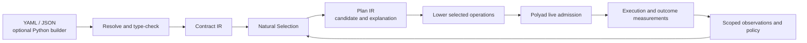

# Copolyad contracts and the Natural Selection IR

**Status: design proposal, not implemented.** This document makes the
[Copolyad proposal](copolyad.md) concrete with an authoring language and
intermediate representations (IRs): typed data structures that compilers and
planners exchange. All syntax, types and version strings below are illustrative;
these documents cannot be submitted to today's Polyad APIs or installed as CRDs.

The proposed language describes **what is needed**, **what each capability can
provide** and **which choices are permitted**. Natural Selection searches those
contracts and produces a candidate plan. Polyad retains admission and execution.

## Table of contents

- [Language and compilation boundaries](#language-and-compilation-boundaries)
- [Typed ports and semantic contracts](#typed-ports-and-semantic-contracts)
- [Example outcome request](#example-outcome-request)
- [Example capability declaration](#example-capability-declaration)
- [Contract IR and composition search](#contract-ir-and-composition-search)
- [Expressions and evidence](#expressions-and-evidence)
- [Plan IR and Polyad lowering](#plan-ir-and-polyad-lowering)
- [Validation and implementation stages](#validation-and-implementation-stages)
- [References](#references)

## Language and compilation boundaries

Start with a declarative domain-specific language serialized as YAML or JSON.
A later Python builder could produce the same documents in a user's build
environment. Submissions would contain data and checked expressions; the
operator would not execute the author's Python.

| Representation | Contents | Consumer |
| --- | --- | --- |
| Authoring documents | Named outcomes, capabilities, typed ports, requirements, effects, limits and preferences | Contract compiler |
| Contract IR | Resolved types, semantic prerequisites, approved implementations, policy references and source locations | Natural Selection |
| Plan IR | Selected capability instances, port bindings, placement, controlled boundaries, delegated settings, evidence, state dependencies and plan revision | Plan reviewer and Polyad lowering adapter |
| Polyad artifacts | Supported composition resources and requests, plus separately checked connection or mutation requests where needed | Polyad admission and execution |



The IR should be versioned independently of its YAML formatting and authoring
library. Prefer shared typed models and generated JSON Schemas, following
Polyad's [existing schema pipeline](../apis/json-schemas.md). The initial
location could be a dedicated Copolyad submodule in `polyad-types` and
`polyad-schemas`; package ownership remains a design choice. Generate Python,
client-validation and Helm artifacts from one canonical schema definition.

## Typed ports and semantic contracts

A **port** is a named input or output. It has a transport shape, a versioned
payload type and, where appropriate, semantic facts attached to that payload.
Three initial port shapes would be sufficient:

| Port shape | Meaning | Example |
| --- | --- | --- |
| `Stream[T]` | A sequence of items conforming to type `T` | Incoming records |
| `Value[T]` | One bounded configuration value or result | A batch manifest |
| `Resource[T]` | An authorized handle to a service or resource | Index storage |

Type names such as `example.EnrichedRecord@1` would resolve through an approved
registry to a schema and immutable revision. Initially, require exact type
identity or an explicitly registered adapter. Schema conversions, unit
conversions and semantic mappings require explicit definitions.

Semantic facts express meaning beyond payload shape. In this example,
`example.enriched@1` means the required enrichment fields have been produced;
`example.searchable@1` means query visibility has been verified. These facts
are registered contracts whose definitions specify the subject, behavior and
verification method. Equal JSON schemas alone do not establish either fact.

Facts must be bound to a specific input lineage. “Some records are searchable”
does not satisfy “the records in this request are searchable.” The examples use
`recordId` within the request's dataset as their correlation key. Intermediate
stages must preserve that identity or declare an approved lineage mapping.

Contracts specify required behavior. Conformance tests and runtime observations
provide evidence that an implementation fulfills its contract; administrator
approval determines whether the planner may use it.

## Example outcome request

The following is a proposed authoring document. Example type, fact, metric and
policy references assume corresponding entries in an authorized registry.

```yaml
language: copolyad.contract/v0
kind: Outcome
id: searchable-records
revision: 7
inputs:
  source:
    shape: Stream
    type: example.RawRecord@1
    key: recordId
result:
  shape: Stream
  type: example.SearchReceipt@1
  facts: [example.searchable@1]
  forInput: source
  coverage: EveryAcceptedItem
constraints:
  regions: [us-central1]
  resources:
    cpu: {maximum: 8, unit: cores}
    memory: {maximum: 16, unit: GiB}
  graphRules: [pipeline-policy]
objectives:
  latency:
    metric: example.ingress-to-query-visibility@1
    statistic: p95
    window: {value: 5, unit: min}
    maximum: {value: 2, unit: s}
  completedRate:
    metric: example.unique-queryable-records@1
    statistic: rate
    window: {value: 5, unit: min}
    minimum: {value: 1000, unit: records/s}
preferences:
  - minimize: allocatedCpu
planningPolicy: reviewed-pipelines@1
```

This request describes the desired result without naming normalization,
enrichment or indexing stages. `constraints` are hard admission conditions.
`objectives` are fixed, measured acceptance criteria. `preferences` rank plans
that satisfy the constraints and objectives; their list order defines priority.

`coverage: EveryAcceptedItem` requires each accepted input to have a correlated
result or an explicit failure, which counts against outcome acceptance.
Duplicate receipts do not increase completed throughput. The metric definitions
must state how errors, timeouts and missing results affect the latency and
coverage verdict. A window with insufficient offered work cannot demonstrate
capacity for 1,000 records per second; its throughput-capacity verdict remains
unverified. Evidence must include workload conditions and sample counts.

`planningPolicy` would define authorized scope, freshness requirements, search
limits, transitions and review policy. It cannot widen permissions inherited
from the parent operator or waive namespace GraphRules. Resource totals include
all resources charged to this plan under the policy, including replica counts
and dependencies; sharing rules must be explicit to avoid undercounting.

## Example capability declaration

```yaml
language: copolyad.contract/v0
kind: Capability
id: index-records
revision: 3
inputs:
  records:
    shape: Stream
    type: example.EnrichedRecord@1
    facts: [example.enriched@1]
    key: recordId
  storage:
    shape: Resource
    type: example.IndexStore@1
outputs:
  receipts:
    shape: Stream
    type: example.SearchReceipt@1
    facts: [example.searchable@1]
    forInput: records
    coverage: EveryAcceptedItem
effects:
  - operation: upsert
    target: storage
    key: recordId
retry:
  mode: IdempotentByKey
  key: recordId
placement:
  regions: [us-central1]
implementation:
  template: example.indexer-daemon@3
evidence:
  profile: example.indexer-benchmark@4
```

All inputs are required together: this capability needs both a matching record
stream and an authorized storage binding. `template` must resolve to an approved
workload definition and port-to-service binding information. `evidence.profile`
references observed behavior with its input distribution, resource allocation,
timestamp and provenance. Performance assessments must account for those
measurement conditions.

`IdempotentByKey` is an implementation contract. Here, the storage binding must
scope `recordId` to the dataset and the upsert operation must preserve the
declared semantics on retry. Implementation conformance tests must verify that
retry behavior.
Two writers to the same storage and keys are potentially conflicting even when
their data-flow paths have no edge between them.

The catalog would also declare `normalize-records` and `enrich-records`
capabilities with equivalent explicit inputs and outputs. The planner must
resolve their prerequisites, such as lookup access, before accepting a plan.

## Contract IR and composition search

The compiler would expand defaults, resolve registry references to immutable
revisions, normalize quantities with explicit conversion rules, check
expressions and preserve source locations. It would reject unknown fields,
ambiguous references, incompatible units and unauthorized implementations.

A compact notation for the proposed typed IR is:

```text
PortType   := Stream(TypeRef) | Value(TypeRef) | Resource(TypeRef)
Requirement := Port(PortType, Subject)
             | Fact(PredicateRef, Subject)
             | AllOf(Requirement...)
             | AnyOf(Requirement...)

Capability := (Id, Revision, Inputs, Requires, Outputs, Provides,
               Effects, RetryContract, ImplementationRef, EvidenceRefs)
Outcome    := (Id, Revision, SuppliedPorts, RequiredResult,
               HardLimits, MeasuredObjectives, RankedPreferences, PolicyRef)
```

`Subject` identifies the relevant dataset or resource and its lineage.
`Requires` is an `AllOf` of the capability's input ports and required facts.
`Provides` binds output ports and their declared facts back to those inputs.
An `AnyOf` represents alternatives for satisfying one obligation; it never
allows the planner to discard a different required input. These are bounded
typed nodes, not arbitrary executable expressions or unrestricted logical
quantifiers.

Natural Selection would work backward through this representation:

1. Find capabilities whose outputs can satisfy the required result's type,
   semantic facts and lineage.
2. Expand each candidate's inputs into further obligations. Every input of a
   chosen capability must be satisfied; alternative providers form branches.
3. Bind supplied inputs and permitted resources, preserving identity across
   each binding. Reject candidates with missing dependencies or contradictions.
4. Apply hard policy limits and evaluate sufficiently fresh evidence. Rank
   feasible candidates by the declared preferences and stable tie breakers.
5. Return a candidate with explanations, an incomplete search result, or a
   proven failure within an explicitly exhaustive bounded search domain.

Several inputs may jointly enable one output. Representing each capability as
an operation node connected to all of its required ports makes that joint
requirement explicit. The planning graph can therefore differ from the
eventual service graph; data dependencies, placement constraints and write
conflicts must remain distinguishable.

Initial search should use a finite catalog and bound expanded obligations,
candidate count, depth and elapsed time. Detect repeated obligations and
reject unsupported dependency cycles. An existing service loop is not
automatically an admissible recursive proof of its own prerequisites. Bounded
recurrence could later have its own explicit contract.

## Expressions and evidence

Use structured fields for types, dependencies, effects, units and budgets.
Use [CEL](https://cel.dev/overview/cel-overview) for optional conditions over
typed, already bound facts. CEL supplies expression parsing, checking and
evaluation against an application-defined environment. The composition search
would remain Natural Selection's responsibility.

For example, a policy could filter a bound candidate with this proposed CEL
expression:

```cel
request.region in candidate.regions &&
evidence.availableRecordsPerSecond >= request.requiredRecordsPerSecond
```

The host would declare `region` as a string, `regions` as a list of strings and
the two rate fields as numbers already normalized to the same unit. It would
also supply the evidence's timestamp, subject, provenance and workload profile
outside the expression for freshness and applicability checks. Evaluating this
condition determines whether the supplied snapshot passes the filter.
Performance verification uses the declared measurement contract; implication
between policies requires a separate proof method.

Follow the [decision-gate expression boundaries](decision-gates.md#language-and-compiler-direction):
compile and type-check per pinned policy revision; bound input and evaluation
cost; exclude network calls, secret reads and arbitrary Python functions.
Missing or stale required observations yield `Unknown`; evaluation errors
yield a diagnostic and block use of that result. Neither is a successful
admission. No CEL implementation or runtime dependency is selected here.

Keep three different verdicts in the plan: **contract compatibility**,
**evidence sufficiency**, and **live admission**. A contract match with missing
measurements may be useful for review, but automatic adoption must require
adequate evidence or an explicitly authorized, bounded evaluation run.

## Plan IR and Polyad lowering

The Plan IR would contain selected operation instances, named port bindings,
proposed placement, effects, objective verdicts, authority scope and the complete state on
which the decision depends. This abbreviated view illustrates a selected
chain; `$...` values denote bindings and subplans to resolve before execution:

```yaml
ir: copolyad.plan/v0
intent: {id: searchable-records, revision: 7}
selectionRevision: 12
catalogRevision: catalog-42
steps:
  normalize: {capability: normalize-records@2}
  enrich: {capability: enrich-records@5}
  index: {capability: index-records@3}
bindings:
  - {from: $source, to: normalize.records}
  - {from: normalize.records, to: enrich.records}
  - {from: $authorizedLookup, to: enrich.lookup}
  - {from: enrich.records, to: index.records}
  - {from: $indexStorage, to: index.storage}
result: index.receipts
verdicts:
  contracts: Compatible
  performance: Unverified
  admission: Pending
```

`selectionRevision` orders Natural Selection's plans for one outcome, including
replanning under the same outcome revision. The complete IR identifies each
controlled graph boundary and the settings delegated to Soul searching.
Natural Selection has [precedence over conflicting adaptations](copolyad.md#natural-selection-takes-precedence).
Every subordinate mutation carries the expected selection revision; admitting
a replacement invalidates conflicting pending decisions. The dispatcher settles
in-flight writes and refreshes state before applying the replacement. Soul
searching then resumes within the new delegation.

An executable revision would replace every placeholder with a supplied input,
authorized existing binding or fully resolved provisioning step. It would also
pin capability and schema digests, implementation templates, policy revisions,
evidence snapshots and the UID/resource-version read set for affected live
resources. Each obligation would retain its source location and the binding or
evidence used to satisfy it. Pending or unverified verdicts cannot silently
become guarantees during compilation.

A canonical plan digest should identify resolved intent, selections and policy
inputs under a specified serialization/version contract. Fresh validation
receipts would separately record observations and their expiry. Submission
identities must also include the outcome revision and distinguish a new intent
from a retry of the same plan; hashing alone is not authorization or deduplication.

Lowering would translate approved implementation templates and bindings into
supported [composition requests](../apis/composition-requests.md). Existing
resources, temporary connections, state migrations and changes to an admitted
graph may require separate operations and approval flows. They are not made
atomic by placing them in the same Plan IR. The adapter must expose unsupported
operations before submission and preserve existing mutation fencing and
connection consent.

[GraphRules](../graphs/graph-rules.md) still constrain the resulting graph, and
Polyad still checks live state before writes. The planner may use benchmark
estimates to rank candidates, but per-stage percentile latencies cannot simply
be added to establish an end-to-end percentile guarantee. The declared outcome
must be measured at its own boundary.

## Validation and implementation stages

| Stage | Required checks |
| --- | --- |
| Parse | Version, field types, required fields, size/depth limits and rejection of unknown fields |
| Resolve | Authorized registry scope, immutable references, approved templates and explicit schema/semantic adapters |
| Type-check | Port shapes, payload types, fact subjects, lineage, unit compatibility and Boolean policy results |
| Search | All prerequisites satisfied, permitted alternatives, cycle handling, effects and bounded resource/search costs |
| Review | Distinguish declarations, measurements and assumptions; explain missing evidence and rejected alternatives |
| Admit | Fresh state, ownership, GraphRules, quotas, consent and mutation dependency validation |
| Observe | Correlated outcomes, coverage, end-to-end objectives and bounded replanning |

Start by defining shared Contract IR and Plan IR models and generating their
schemas. Then build an offline parser, resolver, checker and explainer over a
small catalog. A Python builder should follow the same model and emit identical
IR for equivalent inputs. Only then add authorized Polyad lowering and feedback.

Acceptance tests should include same-shaped data with incompatible meaning,
matching facts from the wrong dataset, a missing second input, stale capacity
evidence, conflicting storage effects, an unsupported cycle and a changed
resource between selection and admission. Verify that an admitted Natural
Selection revision supersedes conflicting pending Soul searching decisions
and fences stale adaptations during handoff. A valid example should demonstrate
the full normalization/enrichment/indexing chain, including lookup and storage
bindings. These tests validate planning semantics across compilation, selection
and admission.

## References

- [CEL overview and embedding model](https://cel.dev/overview/cel-overview)
  describes expression environments and the parse/check/evaluate boundary used
  by the proposed policy layer.
- [JSON Schema object validation](https://json-schema.org/understanding-json-schema/reference/object)
  describes property, required-field and additional-property checks for the
  serialized contract envelopes. Domain semantics still belong to the compiler.
