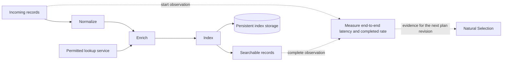
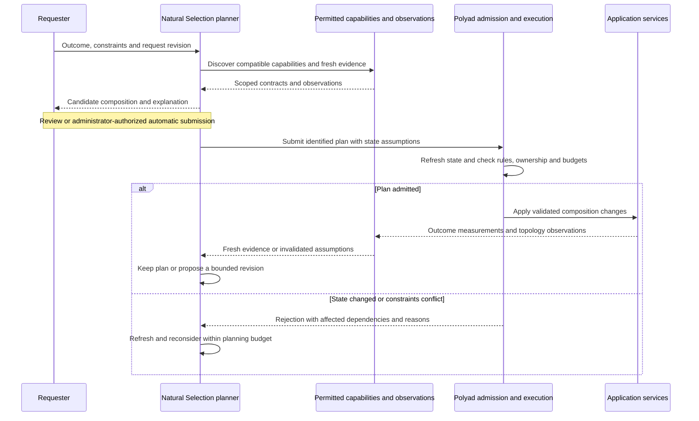

# Copolyad: deriving graphs from desired outcomes

**Status: design proposal, not implemented.** Copolyad would plan application
compositions from desired outcomes and service capability contracts, then submit
those compositions to Polyad for admission and execution. The contracts and
planning behavior below are proposed additions, not available APIs or CRDs.

**Natural Selection** is the name of Copolyad's proposed composition-planning
algorithm. It derives and selects candidate graphs from desired outcomes,
capability contracts and administrator-defined constraints. Copolyad names the
proposal and project concept; Natural Selection names the algorithm.

Polyad starts with an application graph and its rules, then coordinates how it
is deployed, connected and adapted. Copolyad would start with the result an
application needs and work backward to discover which graph could produce it.
This is an architectural inversion of inputs and outputs, rather than a claim
of a formal mathematical dual of Polyad.

## Table of contents

- [What changes when the starting point is an outcome](#what-changes-when-the-starting-point-is-an-outcome)
- [Relationship to existing Polyad capabilities](#relationship-to-existing-polyad-capabilities)
- [Example: make incoming records searchable](#example-make-incoming-records-searchable)
- [Outcome requests and capability contracts](#outcome-requests-and-capability-contracts)
- [Natural Selection, admission and feedback](#natural-selection-admission-and-feedback)
- [Authority, concurrency and recovery](#authority-concurrency-and-recovery)
- [Cheeger bounds and application guarantees](#cheeger-bounds-and-application-guarantees)
- [Delivery stages and acceptance criteria](#delivery-stages-and-acceptance-criteria)
- [Open design questions](#open-design-questions)

## What changes when the starting point is an outcome

Polyad asks: “Given this application graph and its rules, how should we deploy,
connect and adapt it?” Copolyad would ask: “Given this desired result, available
capabilities and constraints, what application graph should exist?”

| Dimension | Polyad today | Proposed Copolyad responsibility |
| --- | --- | --- |
| Starting point | Declared workloads, relationships and rules | Desired outcomes and acceptable tradeoffs |
| Composition | Deploy and adapt an approved composition | Find capabilities that can fulfill an outcome |
| Dependencies | Follow dependencies expressed in the graph | Derive dependencies from each capability's requirements |
| Feedback | Adjust topology, routing and preparation | Reconsider which services and stages belong in the composition |
| Main output | An enforced, operating application graph | An inspectable proposal for that graph and its supporting evidence |

```mermaid
flowchart TB
    subgraph polyad["Polyad: operate a declared graph"]
        declared["Declared graph and rules"] --> execution["Deployment and execution"]
        execution --> measurements["Measured behavior"]
        measurements --> adaptation["Bounded graph adaptation"]
        adaptation --> execution
    end
    subgraph copolyad["Copolyad: derive graphs with Natural Selection"]
        outcome["Desired outcome"] --> requirements["Required capabilities"]
        requirements --> discovery["Discover and compose services"]
        discovery --> proposal["Proposed graph"]
        proposal --> admission["Polyad admission and execution"]
        admission --> verification["Verify the outcome"]
        verification --> requirements
    end
```

Working backward concerns planning dependencies. Application records still
flow in the direction required by the selected services. Reversing every edge
of an existing graph would not supply the missing capability contracts or
explain whether the resulting graph could perform useful work.

## Relationship to existing Polyad capabilities

[Soul searching](../graphs/soul-searching.md) already uses application demand to
recommend or apply approved connection layouts and traffic changes.
[Load profiles](../graphs/load-profiles.md) add bounded preparation for known
upcoming work. The [composition API](../apis/composition-requests.md) lets callers
submit new compositions, and [atlas discovery](../apis/discovery.md) and
[temporary connections](../apis/temporary-connections.md) let permitted services
find and connect to one another.

Natural Selection would derive a composition from requirements and explicit
capability descriptions. Discovery provides permitted identities and
locations; the proposed capability catalog would describe what those services
can do and what they require. Soul searching could then adapt an admitted
composition within its approved settings.

The recommended boundary is a planner above Polyad. Copolyad would submit
proposals through authorized Polyad interfaces. Polyad would retain graph
ownership, admission, mutation ordering and execution. Existing KEDA/HPA
controllers would retain their configured replica targets and authority.

The separate [decision-gate proposal](decision-gates.md) could eventually select
between approved plans or request human review. Copolyad's initial planning
mode should work without that proposed extension.

## Example: make incoming records searchable

An outcome request could say:

> Make incoming records searchable within two seconds at the 95th percentile,
> sustain 1,000 records per second, keep processing in the permitted regions,
> and stay within the administrator's resource budget.

The requester would specify where timing starts and ends, how throughput is
counted, the measurement window and the permitted error rate. Without those
definitions, the planner cannot compare alternatives or verify the outcome.

Suppose the authorized capability catalog contains these entries:

| Capability | Requires | Produces |
| --- | --- | --- |
| Normalize | Records in the source schema | Records in the canonical schema |
| Enrich | Canonical records and access to a permitted lookup service | Enriched records |
| Index enriched records | Enriched records and persistent index storage | Searchable records with required enrichment fields |

Starting from searchable records, Natural Selection would discover the indexer's input
requirements, then the enrichment and normalization stages needed to satisfy
them. It would resolve storage, placement and service permissions as part of
the same plan. Each selected stage must declare compatible behavior as well as
compatible data types.

Several implementations might satisfy the same requirements. An administrator
could prefer lower resource cost, lower latency or greater resilience. The
planner would explain its choice and distinguish measured evidence from
estimates. If no candidate fits, it would report which obligations remain
unsatisfied rather than relax a region restriction or silently omit enrichment.

## Outcome requests and capability contracts

The following are proposed contract contents, not finalized field names.
Versioned, importable types and schemas should precede executable configuration.

| Contract | Required information |
| --- | --- |
| Outcome request | Request identity and revision, desired result, input/output schemas, measurement definitions, permitted scope, deadline and resource ceilings |
| Capability | Stable identity and version, semantic operation, accepted and produced schemas, prerequisites, side effects, retry behavior and storage requirements |
| Capacity evidence | Signal name and unit, observed capacity and latency, timestamp, measurement window, workload conditions and evidence source |
| Planning policy | Allowed implementations and transformations, ranked objectives, candidate/time budgets, freshness requirements and approval mode |
| Plan receipt | Outcome revision, pinned capability versions, dependency snapshot, proposed resources and connections, assumptions, rejected alternatives and admission result |

Matching schemas is necessary but insufficient: two services can accept the
same JSON shape while interpreting its fields differently. Initial composition
should therefore use administrator-approved semantic operations and explicit
transformations. It should not infer arbitrary service behavior from names,
documentation or observed traffic.

Capability advertisements would be scoped and authenticated through the
operator tree. A service's self-reported capacity would be evidence with an
identified source and expiry, not a reservation or an execution guarantee.
Plans would reference authorized credential bindings without copying secret
values into the capability catalog or receipts.

## Natural Selection, admission and feedback

1. Validate the outcome request and resolve the caller's permitted graph trees,
   regions, resources and planning policy.
2. Work backward from the result through a bounded catalog of approved
   capabilities. Track unresolved prerequisites and reject incompatible paths.
3. Compare candidates within explicit search budgets. Record the observations,
   resource versions and assumptions that support each proposed composition.
4. Present a plan for review, or submit it automatically only under an explicit
   administrator policy authorizing those changes.
5. Let Polyad refresh affected state and evaluate live GraphRules, ownership,
   permissions and capacity before admitting mutations.
6. Observe the complete outcome. Replan after sustained deviations or invalidated
   assumptions, subject to cooldowns, change budgets and safe migration rules.

Budget exhaustion should produce an explicit incomplete search result. A
candidate can be feasible without being globally optimal; a search that found
no candidate within its budget has not proved that none exists.

## Authority, concurrency and recovery

The planner must use the existing [mutation planning](../development/mutations.md)
and [write pipeline](../development/write-pipeline.md) boundaries. A plan is a
proposal against a particular state snapshot. Admission rejection, downstream
deletion or changed evidence requires refreshed planning, not blind replay of
the old writes.

Retries of one submission should reuse its idempotency identity. A changed
composition should carry a new revision linked to the request it supersedes.
Revisions must account for already admitted work and pending mutations; two
planners cannot independently allocate the same apparent spare capacity.
Any future capacity reservation mechanism would need an authoritative owner,
expiry and recovery semantics before the planner could rely on it.

Local operator authority and inherited access restrictions remain binding.
Cross-cluster planning must obey the [root control plane](../deployment/root-control-plane.md)
and each destination's configured permissions. Proposed temporary connections
still require the existing consent and admission flow. An unavailable cluster
or an expired observation cannot be treated as permission to act.

Replacing a stage can require draining work, migrating state or preserving
compatible endpoints. Initial automatic operation should be restricted to
explicitly approved transitions with declared recovery behavior. Application
side effects cannot be assumed reversible or exactly once.

Decision records should correlate outcome request, plan revision, composition
request and execution identities through [logs and traces](../operations/tracing.md).
They should explain rejected capabilities, stale evidence, admission conflicts
and why a revision was selected. Observability must preserve graph-tree access
boundaries.

## Cheeger bounds and application guarantees

[GraphRules](../graphs/graph-rules.md) would constrain every proposed composition
at the configured graph boundaries. [Structural Cheeger bounds and
throughput-derived targets](../graphs/cheeger-orchestration.md) would keep their
existing meanings: structural bounds constrain connectivity, and application
signals guide separate targets within those hard limits.

Natural Selection could compare the connectivity of candidate compositions and use
benchmarked capacity evidence to rank them. A Cheeger value alone does not
prove an end-to-end throughput or latency objective. Resource capacity, service
semantics, contention and the input workload still matter. Unknown evidence
must remain visible in the plan rather than becoming an assumed guarantee.

The initial goal should be a feasible, explainable composition from a bounded
catalog. More ambitious search methods, reductions and performance models can
be developed through repeatable [benchmark studies](../../studies/README.md).

## Delivery stages and acceptance criteria

| Stage | Deliverable | Acceptance criteria |
| --- | --- | --- |
| Contract modeling | Versioned outcome, capability and receipt schemas | Reject ambiguous units, incompatible schemas and missing semantic prerequisites; preserve provenance |
| Offline planning | Deterministic planning over a small approved catalog | Produce inspectable candidates; explain unresolved requirements; distinguish infeasibility from exhausted search budgets |
| Polyad integration | Authorized proposal submission and outcome correlation | Enforce live rules and local authority; preserve idempotency; reject stale plans and recover through targeted replanning |
| Bounded feedback | Administrator-approved revisions after measured deviations | Respect cooldowns and search/change budgets; avoid oscillation, duplicate work and competing capacity assignments |

An initial study could compare a manually declared pipeline, that pipeline with
Soul searching enabled, and a composition chosen by Natural Selection under the same
resource ceilings and demand. Record completed rate, end-to-end latency,
resource use, planning time, admission conflicts and composition churn. This
would test whether choosing the composition adds value beyond adapting it.

## Open design questions

- Should capabilities come from a curated registry, service advertisements or
  both, and who approves semantic compatibility claims?
- Which outcome obligations can be checked statically, and which require
  measurements or an explicit experiment before adoption?
- How should plans express state transfer, traffic migration and shared
  services without claiming ownership of existing unrelated workloads?
- Which capacity commitments require reservations, and how should those
  commitments expire across operator and cluster failures?
- Should the planner ship as a standalone project, a client library or an
  optional service? Its authority boundary should remain the same in each case.
