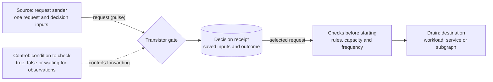
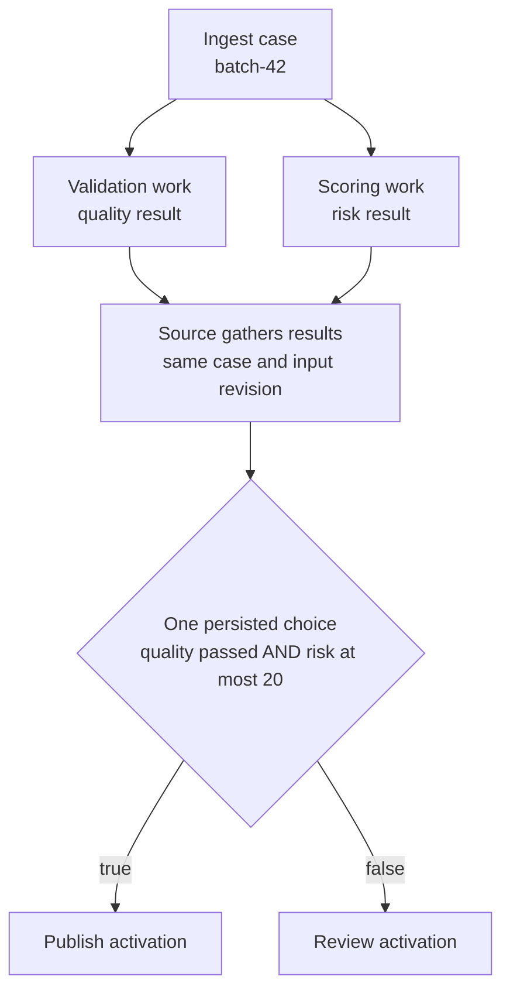
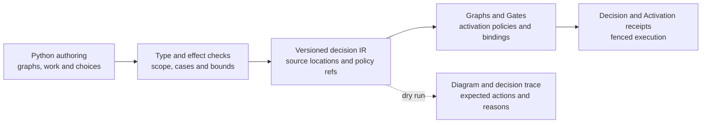
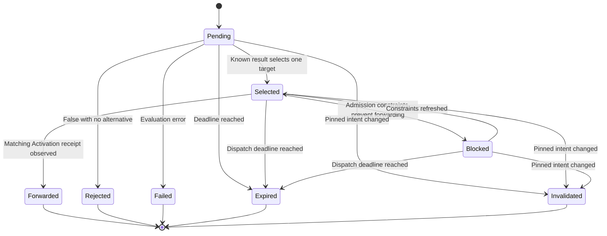

# Transistor gates and decision programs

**Status: design proposal, not implemented.** The Gate variant, decision bindings,
receipts, endpoints and authoring syntax below are proposed extensions. Existing
Boolean gates and activation policies retain their current behavior.

Polyad could coordinate the work needed to make a decision, evaluate the result,
and check whether the selected next step can start. A validation graph might check a
batch, compute its risk and choose between publishing it and requesting review.
The same building blocks could select a recovery workflow or wait for several
services to agree before starting another stage.

The proposed **transistor gate** decides whether a request should start work.
For example, an ingestion service could request publication of a batch. The gate
checks whether that batch passed validation and has an acceptable
[risk score](#risk-scores-and-how-to-compute-them).
If the condition is true, it forwards the request to the publication task, which
still has to pass Polyad's [checks before work starts](../introduction/concepts.md#conditions-and-admission).
If the condition is false, it records a rejection or selects a configured
alternative, such as a review task. A true condition alone does not start work:
there must also be a request.

The transistor analogy names three parts of that interaction:

| Term | Meaning in Polyad | Publication example |
| --- | --- | --- |
| **Source** | The node sending a [pulse](../workloads/activation.md#terms-used-in-this-guide): one identified request to start work. | The ingestion service requests publication of batch 42. |
| **Control** | A [predicate](../introduction/concepts.md#conditions-and-admission): a condition evaluated as true or false. The gate waits for fresh observations before evaluating the condition. | “Did this batch pass validation, and is its risk score at most 20?” |
| **Drain** | The [activation target](../workloads/activation.md#terms-used-in-this-guide): the workload, service or subgraph that the request asks Polyad to start. The configuration calls this `target`. | The publication task. |

These are roles in deciding what runs next. Application data, such as the batch
contents, still travels over the configured network or storage. The operator
handles the request and the small set of values needed to make the decision.

The recommended language direction is a **Python authoring library with
[Common Expression Language (CEL)](#language-and-compiler-direction) conditions**,
compiled into a decision plan whose input types are checked, alongside Polyad resources. This
gives users a programming interface without requiring a new general-purpose
language or executing their Python inside the operator.

## Table of contents

- [Existing building blocks and the addition](#existing-building-blocks-and-the-addition)
- [Three ports and one durable decision](#three-ports-and-one-durable-decision)
- [Risk scores and how to compute them](#risk-scores-and-how-to-compute-them)
  - [A starting calculation](#a-starting-calculation)
  - [Evidence, calibration and replay](#evidence-calibration-and-replay)
- [Proposed configuration](#proposed-configuration)
- [Requests, facts and provenance](#requests-facts-and-provenance)
- [Composing decisions into a program](#composing-decisions-into-a-program)
- [Language and compiler direction](#language-and-compiler-direction)
- [Admission, durability and recovery](#admission-durability-and-recovery)
- [Graph constraints, federation and scaling](#graph-constraints-federation-and-scaling)
- [Decision events and observability](#decision-events-and-observability)
- [Delivery stages and acceptance criteria](#delivery-stages-and-acceptance-criteria)

## Existing building blocks and the addition

| Building block | Available today | Proposed addition |
| --- | --- | --- |
| Boolean Gate | `signal`, `and`, `or`, `not`, `xor`, `nxor` over node lifecycle observations | Reuse these expressions as switch controls |
| Delay Gate | Persist a deadline after prerequisites become eligible | Combine with downstream admission; delay and switching remain separate operations |
| [Activation](../workloads/activation.md) | Stored requests, execution identities, queue policies and frequency bounds | A selected decision creates an Activation with a deterministic request ID |
| [Graph and PolyGraph](../introduction/concepts.md) | Workloads, dependencies, composition, placement and rules | Named decision bindings between source and target nodes |
| Composition and mutations | Validated resources and fenced changes | A compiler emits an inspectable decision plan alongside those resources |
| Application facts | Applications maintain their own results | Bounded, typed facts attached to an immutable decision request |

See the [current Gate implementation](../../pkg/polyad/graph/gates.py),
[activation contract](../workloads/activation.md), [composition requests](../apis/composition-requests.md)
and [mutation plans](../development/mutations.md). A reusable Gate definition currently has
exactly one of `expression` or `delaySeconds`. The proposal adds a third variant,
`transistor`, within the existing Gate resource kind.

## Three ports and one durable decision



| Source | Control | Outcome |
| --- | --- | --- |
| No pulse | Any value | No decision or execution is created |
| New pulse | `true` | Select the drain; dispatch still requires admission |
| New pulse | `false` | Reject the pulse, or select an explicitly configured alternative |
| New pulse | Unknown | Wait for observations until the request deadline |
| Duplicate pulse | Any value | Return the existing receipt; do not create a second activation |
| New pulse | Evaluation error | Record `Failed`; do not select either branch |

The saved outcome is called a **decision receipt**. The proposal uses it to
remember which request was evaluated and which branch was selected, so retrying
the same request does not select another branch. The resulting execution has
its own [Activation receipt](../workloads/activation.md#terms-used-in-this-guide).

Each decision starts with a request. A predicate becoming true does not repeat a
previous request. A later false observation does not terminate already admitted
work. Stopping work remains an explicit operation. A future level-triggered
mode would need separate cancellation and rearming semantics.

Unknown is distinct from false. Existing Boolean expressions preserve unknown
under NOT and XOR; AND can resolve false from one false input, and OR can resolve
true from one true input. Missing or stale observations must never make
`NOT(ready)` authorize work by default. Evaluation errors remain separate from
missing observations.

## Risk scores and how to compute them

`riskScore` summarizes the application's assessment of **taking a particular
action on a particular case**. Here it answers: “How concerning would it be to
publish this batch?” Higher scores represent greater concern about incorrect
results, the reach of a mistake, recovery effort or incomplete evidence. The
example uses integer **policy points from 0 to 100**: zero means no concern
detected by the selected policy, and 100 is its highest score. A threshold of
`20` permits at most twenty policy points. Compare scores under the same
scoring policy and revision.

The application owner defines that policy. A scoring Workload, service or
subgraph computes the score from evidence for the same batch, input revision
and intended action. In the proposed first version, the source gathers that
result and supplies `facts.riskScore`. The transistor evaluates that supplied
integer against the configured threshold. See
[requests, facts and provenance](#requests-facts-and-provenance) for who may
submit those facts and how they are pinned to a decision.

### A starting calculation

Use a deterministic weighted score as the initial policy:

1. **Separate mandatory checks.** Schema violations, missing required approvals
   and other conditions that must block publication belong in explicit Boolean
   checks, such as `qualityPassed`. A low score cannot compensate for a failed
   mandatory check. Authorization and GraphRules remain additional admission
   requirements.
2. **Measure soft concerns.** Choose signals with declared units, scope,
   observation windows and minimum evidence requirements. Examples include
   unusual records that still pass validation, affected consumers and estimated
   time to undo publication.
3. **Normalize each signal.** For a signal where larger values mean more concern,
   define `low` as the zero-point reference and `high` as the hundred-point
   reference, with `high > low`. Compute
   `component = ceil(100 × clamp((value - low) / (high - low), 0, 1))`.
   Here `clamp` limits a value to the stated interval. Signals with the opposite
   direction need an explicitly inverted mapping. An unacceptable raw value
   can also have a mandatory cutoff before scoring.
4. **Combine the components.** Assign nonnegative integer percentage weights
   that sum to 100, then compute
   `riskScore = ceil(sum(weight × component) / 100)`.
   Rounding upward keeps fractional points from making a borderline case pass.
   Pin the mappings, weights and rounding rule to a scoring-policy revision.
   Use fixed-point or rational arithmetic so implementations reproduce the same
   rounding at threshold boundaries.

For example, the following illustrative publication policy produces the `12`
used in the request below. Its reference points and weights are choices for
this example; the application owner calibrates them for their pipeline.

| Component | Batch observation | Zero-point to hundred-point reference | Component points | Weight | Weighted points |
| --- | --- | --- | ---: | ---: | ---: |
| Unusual valid records | 0.2% of records flagged by the anomaly check | 0% to 1% flagged | 20 | 40% | 8 |
| Reach of publication | 2% of consumers in the policy's declared population affected | 0% to 20% affected | 10 | 20% | 2 |
| Recovery effort | Estimated rollback or replay takes 6 minutes | 0 to 60 minutes | 10 | 20% | 2 |
| Residual evidence gaps | All policy-defined optional checks supplied | 0% to 100% of optional checks missing | 0 | 20% | 0 |

The total is `ceil(8 + 2 + 2 + 0) = 12`. With `qualityPassed: true`, the
predicate `facts.qualityPassed && facts.riskScore <= 20` selects publication.
A score of `21` selects the configured review alternative. With
`qualityPassed: false`, even a score of `0` selects review. A critical concern
therefore needs an explicit mandatory check when it must always block
publication; the weighted average alone allows tradeoffs between components.

### Evidence, calibration and replay

Define required evidence separately from the optional gaps scored above.
If a required observation is missing, stale, invalid or below its minimum
sample size, the scorer must report the result as unavailable and the source
must wait or follow its own failure policy. It must not substitute zero or
drop that component and redistribute its weight. In the first-version request
contract, missing required facts reject submission. Unknown operator lifecycle
observations can instead leave an accepted decision Pending until its deadline.

Start with weights that express the application's priorities, then replay
historical cases with known outcomes. Measure how often each candidate
threshold would permit a harmful publication and how much unnecessary review
it would create. Select the threshold against an explicit tolerance for those
outcomes, and evaluate it on held-out cases before using it to authorize work.
Run a new policy alongside the active one to compare choices without dispatching
extra activations. Review its behavior as data and downstream consumers change.
The example threshold of `20` is an initial policy choice to evaluate this way.

Keep the raw evidence references, component scores, weights, scoring-policy
revision, input revision and computation time in the application's result
record so a decision can be reproduced. Sensitive evidence stays in application
storage. If a gate must enforce a specific scoring-policy revision, declare
that identifier as an input and check it in the predicate; undeclared fact
fields are rejected. The first version trusts the authorized source's score
and measures fact age from root receipt, so the source must enforce evidence
freshness before submission. A corrected score requires a new request ID;
retrying an existing request retains its saved facts and branch.

## Proposed configuration

All YAML in this section is illustrative and cannot be applied to the current
CRDs. A reusable gate declares the types of application facts it accepts and
exactly one control form: the existing Boolean `expression`, or a Boolean CEL
predicate.

```yaml
apiVersion: polyad.astrivant.com/v1alpha1
kind: Gate
metadata:
  name: publish-eligible
spec:
  transistor:
    inputs:
      qualityPassed: {type: boolean}
      riskScore: {type: integer, minimum: 0, maximum: 100}
    control:
      cel: "facts.qualityPassed && facts.riskScore <= 20"
    maxPending: 64
    decisionTimeoutSeconds: 120
    maxInputAgeSeconds: 300
```

The proposed defaults are 64 pending requests per binding instance, a 120-second
deadline from root acceptance to dispatch, and a 300-second maximum input age.
All three values are positive integers. A false result is terminal when no
alternative is configured. Unknown waits within the same deadline; it never
falls through to the alternative. Queue exhaustion rejects new distinct
requests before accepting their metadata.

```yaml
# Proposed fragment of a persistent Graph definition.
# Referenced Daemon/Workload definitions must be supplied separately.
spec:
  mode: persistent
  nodes:
    - name: ingest
      kind: Daemon
      ref: ingestion-service
    - name: publish
      kind: Workload
      ref: publish-batch
    - name: review
      kind: Workload
      ref: review-batch
  decisions:
    publish-batch:
      gate: publish-eligible
      source: ingest
      target: publish
      otherwise: review
```

Both target definitions must have an existing activation policy, for example
`activation: {mode: Queue, maxPending: 32, minIntervalSeconds: 5}`. Their ordinary
dependencies, node gates and capacity checks still apply. A transistor binding
uses `spec.decisions`; it is not also assigned through `nodes[].gate`, which
continues to represent ordinary admission conditions.

`source`, `target` and optional `otherwise` name nodes in the same boundary.
The two targets must differ. The compiler rejects unknown nodes, incompatible
input types, non-Boolean predicates, unsupported activation targets and control
cycles. Version one requires a persistent containing graph and permits Workload,
Daemon, Graph or PolyGraph activation targets. A ReplicaGroup can contain copies
of a graph with bindings; direct ReplicaGroup pulse targets remain outside this
proposal's first version.

A PolyGraph can bind its child Graphs or PolyGraphs in the same way. A child
exports a declared result through its boundary; parents cannot select arbitrary
descendant Pods or bypass the child's rules. Remote result export and forwarding
require the federation work described below before these bindings can execute
across clusters.

## Requests, facts and provenance

Propose `POST /v1/decisions` and `GET /v1/decisions/{requestId}` on the existing
composition service, plus a namespaced `Decision` receipt resource. A request
names the graph kind, name and UID, binding, request ID, case ID and application
facts. Admission pins the graph generation, gate UID/generation, binding, target
definitions and source execution identity. Request IDs are namespace-wide like
Activation IDs; include graph, case and binding identity when generating them.

```json
{
  "requestId": "batch-42-publish",
  "caseId": "batch-42",
  "graph": "ingestion",
  "graphUid": "GRAPH_INSTANCE_UID",
  "kind": "Graph",
  "binding": "publish-batch",
  "facts": {"qualityPassed": true, "riskScore": 12}
}
```

For the first version, the source application gathers its results and submits
one complete, immutable fact snapshot. It may call existing validation and
scoring services over separately declared connections. Facts are assertions by
that authorized source, not independently established truths about Kubernetes
or application data. Missing required facts or invalid types reject the request.
Corrections require a new request ID. Multi-producer joins need a later result
reporting contract with a separate authorized writer for each input slot.
The [risk-scoring policy](#risk-scores-and-how-to-compute-them) above explains
how the source obtains the example's `riskScore: 12`.

The operator supplies lifecycle observations itself. They identify the graph,
node, selected activation or replica UIDs, revisions and observation time. A
source cannot impersonate these observations by placing values in `facts`.
Repeated executions require case-specific identities; aggregate `NODE.completed`
must not accidentally supply evidence from a different batch.

The initial fact vocabulary is Boolean, bounded integer, bounded string and enum;
reject undeclared fields. Limit a request to 64 fields and 16 KiB of encoded
facts. Large or sensitive results stay in application storage. Opaque result
references do not cause the operator to fetch URLs, execute code or read Secrets.
The first version measures fact age from root receipt time and labels it as such;
it cannot prove when a producer actually computed a value. Any later trusted
production timestamp needs an explicit clock and provenance contract.

Bindings require authorization for that graph instance, source and binding.
Possessing a services API key alone must not authorize facts for every source.
Reuse [key groups and request lanes](../operations/api-keys.md), with additional decision scopes
and source bindings, or verified workload identity. Direct activation and
composition access must also be restricted for targets intended to be reachable
only through decisions. Every mutation path reaching those targets must enforce
the same authorization policy.

## Composing decisions into a program

Series switches implement conjunction; parallel predicates implement disjunction.
NOT, NAND and NOR can compose existing expressions. XOR means odd parity, so
three true inputs produce true; an exactly-one choice needs a distinct check.
This Boolean expressiveness alone does not provide memory, iteration or reliable
distributed execution.



In the first version, the source application implements the gather step. A later
language runtime can orchestrate the preparation activations and collect typed
results for the same case. The diagram shows control and result dependencies;
it does not declare network grants.

An if/else must commit one branch in one Decision receipt. Two independent
transistors evaluating a predicate and its negation at different times can
activate both branches. The proposed `otherwise` binding avoids that race by
selecting one target from one snapshot. A changing observation cannot replace
that committed choice during retry.

For a single activation, OR is one predicate and one forwarding operation.
Intentional fan-out uses explicit targets and distinct child identities. A join
must name its required inputs and case; it cannot combine the latest unrelated
result from each producer. Future compiler-managed joins must specify timeout,
failure and cancellation behavior before they are supported.

Stateful decisions, such as hysteresis or an approval latch, need declared initial
state, reset authority and durable transitions. Iteration needs an explicit next
case or bounded iteration identity, a limit and a termination condition. Reject
implicit feedback cycles in the first release. Neither feature requires bringing
back a FeedbackGraph or EphemeralGraph kind.

## Language and compiler direction

CEL is an expression language with side-effect-free evaluation and optional
type checking, making it a candidate for the control predicate. It does not
orchestrate Jobs or persist decisions by itself. Its embedding environment
defines the available variables and functions. See the [CEL language
definition](https://github.com/cel-expr/cel-spec/blob/master/doc/langdef.md) and
[embedding overview](https://cel.dev/overview/cel-overview).

Use a Python library for authoring graphs, work dependencies, typed results and
choices. Authoring runs in the user's build or CI environment; the submitted
artifact contains declarative resources and a versioned intermediate
representation (IR). The operator accepts that artifact, never Python callbacks
or serialized executable code. Keep shared IR types in `pkg/polyad-types` and
client submission support in `pkg/polyad-sdk`; an authoring package must not require
installing the operator.

Proposed Python syntax for the later authoring layer:

```python
program = DecisionProgram("batch-release")
case = program.input("batch", schema=BatchReference)
quality = program.work("validate", graph="validation", input=case)
risk = program.work("score", graph="risk-scoring", input=case)

program.choose(
    "release",
    inputs={"quality": quality.result, "risk": risk.result},
    when=cel("quality.passed && risk.score <= 20"),
    then=program.activate("publish"),
    otherwise=program.activate("review"),
)

artifact = program.compile()  # Resources, typed decision plan and source map.
```

The compiler lowers the example to preparation activations, a case-specific
result join and one transistor binding with an alternative target. The result
join and typed work outputs are later additions, so today's Graph and Gate CRDs
alone cannot execute this program. Reusable functions can expand into subgraphs;
bounded authoring loops can expand a fixed graph. Dynamic work remains explicit
runtime state with declared bounds.



Compile and type-check CEL once per pinned policy revision. Initially require all
declared CEL observations to be fresh before evaluation; otherwise return
Unknown without invoking CEL. This conservative rule differs from the existing
Boolean AST's decisive AND/OR handling. Missing map keys, arithmetic failures,
cost exhaustion and evaluator exceptions are errors, never false decisions.
Reject non-Boolean output and unsupported functions. Supply no network, file,
Secret, random or implicit wall-clock functions. Bound expression size, nesting,
input size and evaluation cost even though CEL expressions terminate.

Choose and pin a CEL implementation only after conformance, unknown/error
behavior, cost enforcement and Python 3.11–3.14 compatibility tests. No evaluator
dependency is selected by this proposal. Keep the IR independent of the Python
surface so a textual language or visual editor could target the same contract
later. A new language syntax should follow proven runtime semantics.

## Admission, durability and recovery

The graph family's current lease holder evaluates requests. It refreshes the
relevant observations and constraints, then persists the input revision vector,
predicate revision, selected branch and deterministic Activation request ID in
the Decision receipt before forwarding. Kubernetes conditional writes protect
the choice. Creating the Activation and updating the Decision are separate API
writes, so recovery must find the same activation by its durable identity after
a lost acknowledgement. Derive that ID from the Decision UID and selected
binding, never from a mutable predicate value.



Unknown remains Pending with a reason. `Forwarded` confirms the Activation
receipt exists; its own lifecycle reports selection, execution, rejection and
completion. A queued Activation may start after the decision's dispatch deadline;
applications needing an execution deadline need a separate activation contract.
Repeated admission failures must not reevaluate a Selected receipt into a
different branch. Input expiry before forwarding makes the decision Expired;
changed pinned intent makes it Invalidated. Recovery checks for an already
created Activation before declaring either outcome.

Persist a dispatch attempt before enqueueing the write and fence queued work
against the decision's current authority and deadline. An unresolved attempt
must remain reconcilable: a single read showing no Activation is insufficient
to expire a request while its creation might still be in flight. Settle or
recover that attempt before reporting a terminal outcome. Deadline expiry does
not undo an activation that was already created.

Store authoritative receipts in Kubernetes. [PostgreSQL](../deployment/postgresql.md) remains
optional for state and observation persistence. Dragonfly can carry wakeups and
serve event history; losing a cache entry cannot authorize another execution.
No new message broker is required. Deduplication lasts as long as the receipt or
a retained tombstone exists: garbage collection must define a replay window and
reject requests older than it. Pending limits do not bound terminal history;
require separate retention and namespace quotas.

Retries provide at-least-once reconciliation, not exactly-once application side
effects. Workers receive the decision/case identity through a proposed extension
of [activation context](../workloads/workload-environment.md) and use it for application
idempotency. This context propagation must be implemented before the language
runtime can correlate results automatically.

## Graph constraints, federation and scaling

A decision creates control intent. It adds neither a data-flow connection nor a
network grant. Gate definitions and receipt records are not workload vertices
and must not inflate GraphRules counts or Cheeger measurements. The compiler
must validate the decision dependency relation for cycles separately from
`requires`; existing `relation: admission` measurements still mean `requires`.

Every forwarded activation passes the same live graph-family checks as an
ordinary pulse: dependencies, placement, storage, slots, activation frequency,
replica bounds and applicable [GraphRules](../graphs/graph-rules.md). Recompute structural
Cheeger bounds before resulting mutations. A true predicate cannot override an
ancestor constraint. Declared connections remain subject to networking rules;
a future branch that changes topology would require explicit rewrite admission.

Expose bounded decision backlog, evaluation latency, oldest pending age and
blocked reasons through the operator metrics endpoints. KEDA continues scraping
the operator and scaling its supported targets. Distinguish runnable decision
backlog from requests waiting for observations, external approval or policy, so
blocked decisions do not cause unbounded scale-out. Preserve existing memory
metrics and replica bounds. More operator replicas help independent graph
families; they do not remove serialization within one family. Cheeger describes
structural bottlenecks, not guaranteed decision or application throughput.

For a federated PolyGraph, decision authority and durable receipts live at the
root. Remote execution replicas report case-scoped results and execute admitted
activations. The root records a vector of cluster/object revisions; Kubernetes
resource versions from different clusters cannot establish a total order or an
atomic distributed snapshot. Each execution boundary refreshes local rules and
checks the root's current authority before acting. Root disconnection pauses
new mutations while existing work continues. The first implementation should be
local; federation requires these result and forwarding protocols explicitly.

## Decision events and observability

Propose a `decision` SSE event alongside graph and topology events. Emit on
meaningful transitions: `DecisionPending`, `DecisionSelected`, `DecisionBlocked`,
`DecisionForwarded`, `DecisionRejected`, `DecisionExpired`, `DecisionInvalidated`
and `DecisionFailed`. Reconciliation ticks and unchanged unknown values emit no
new event. Resulting replica or edge changes produce their existing topology
notifications.

Include stable transition and decision IDs, graph identity, binding, case ID,
phase, reason, policy/input revision references, selected target and activation
reference. Do not include fact values, result payloads or credentials in the
event stream. Treat case IDs as opaque nonsecret identifiers. Detailed authorized
receipt reads provide the explanation and pinned nonsensitive facts needed to
reproduce evaluation.

Persist transitions with state changes and publish via a bounded durable outbox.
Delivery is at least once; clients deduplicate transition IDs and use receipt
snapshots after stream reset. Apply the existing namespace and
[application stream boundary](../workloads/workload-events.md#application-stream-boundary):
decisions from the reserved operator Graph and its descendants stay out of
downstream application streams. Events report decisions; they do not themselves
authorize another action or become an unbounded feedback loop.

## Delivery stages and acceptance criteria

1. **Local switching:** shared types, the Gate variant, graph bindings, Decision
   CRD and schema, source authorization, bounded inputs, fenced forwarding,
   receipt reads and events. Start with one source snapshot and existing Boolean
   controls; add CEL only with its conformance and resource limits verified.
2. **Decision-producing work:** typed output declarations, authorized per-input
   result reports, case propagation, joins and explicit timeout/cancellation
   rules. Keep application payloads outside receipts.
3. **Federation:** root-held decisions, remote result provenance, branch dispatch
   recovery and local admission across registered clusters.
4. **Authoring:** Python builders, a versioned IR, source maps, dry-run traces,
   generated diagrams and inspectable deployment artifacts. Stateful gates and
   bounded runtime iteration follow as separately specified extensions.

Verification must cover truth/unknown/error behavior, parity versus exactly-one,
no-pulse behavior, input schema and size limits, stale observations, contradictory
reports, duplicate IDs with changed content, namespace/source isolation and
attempts to bypass decisions through direct activation. A duplicate ID with
different content must be rejected, not return a misleading successful replay.

Exercise crashes before and after branch persistence and Activation creation,
HA handoff, deadline/expiry races, definition and graph replacement, queue
exhaustion, receipt retention, event replay and reserved-graph isolation. Verify
that every branch obeys inherited rules under concurrent KEDA changes, and that
partitions cannot let remote workers choose a different branch. Language tests
must compare compiled and interpreted decisions for the same pinned inputs and
show useful source locations for failed checks. No runtime or installable
language package is introduced by this documentation change.
