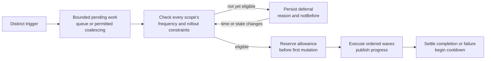

# Rollout sparsity and events

<!-- toc:start -->
**Table of contents**

- [Configure frequency limits](#configure-frequency-limits)
- [Inheritance and durable accounting](#inheritance-and-durable-accounting)
- [Repeated triggers and deadlines](#repeated-triggers-and-deadlines)
- [Events for decisions and execution](#events-for-decisions-and-execution)
- [Required implementation and verification](#required-implementation-and-verification)
<!-- toc:end -->

**Status: design proposal, not implemented configuration.** This extends the
[graph rollout and rotation proposal](rotations.md). Sparsity controls how often
new rollout operations may begin. It is independent of graph edge density,
Cheeger bounds, batch concurrency and ordinary reconciliation frequency.

## Configure frequency limits

Propose one configuration shape in two places:

- `RolloutPolicy.spec.sparsity` supplies limits for that named rollout policy.
- `spec.rolloutSparsity` on Graph, PolyGraph, ReplicaGroup, Daemon and Workload
  supplies limits across all rollout policies affecting that instance or subtree.

A reusable Daemon or Workload definition supplies local limits for its generated
executions. Each execution has its own history. A parent ReplicaGroup or graph
supplies a shared budget across copies; editing the definition must not reset
that history. Finite Workloads remain Jobs: these settings do not implicitly
rerun completed work. An explicit rerun must also satisfy the existing
[activation frequency bounds](../workloads/activation.md#frequency-bounds).

Illustrative graph or workload spec fragment:

```yaml
spec:
  rolloutSparsity:
    minIntervalSeconds: 900
    cooldownSeconds: 300
    debounceSeconds: 30
    maxDebounceSeconds: 120
    rateLimit:
      maxStarts: 3
      windowSeconds: 3600
    pending: Queue
    maxPending: 64
```

| Field | Proposed meaning |
| --- | --- |
| `minIntervalSeconds` | Minimum time between distinct rollout starts in this scope |
| `cooldownSeconds` | Minimum time after a started rollout settles and becomes terminal before another starts |
| `debounceSeconds` | Wait for a quiet period after distinct compatible triggers before scheduling pending work |
| `maxDebounceSeconds` | Maximum debounce delay from the first pending trigger; required and at least the quiet period when debounce is enabled |
| `rateLimit.maxStarts` / `windowSeconds` | Maximum distinct starts in a sliding time window, preventing boundary-aligned bursts |
| `pending` | `Queue` preserves request order; `CoalesceLatest` supersedes compatible pending requests when skipping their revisions is explicitly safe |
| `maxPending` | Bound retained pending work per scope; excess requests are rejected with a reason |

Omitted interval, cooldown and debounce limits add no time restriction. Omitted
`rateLimit` adds no rate bound. Pending behavior defaults to `Queue`, with a limit
of 64. Time values are nonnegative integer seconds; rate-limit values and
`maxPending` must be positive integers. Enabled debounce requires a finite
maximum so continuous updates cannot defer it forever. That maximum does not
override cooldown, rate limits, readiness or graph admission.

This example permits no more than three starts in any hour, with at least fifteen
minutes between starts and five minutes after the previous rollout settles. Ten
compatible updates arriving close together can become one rollout when
`CoalesceLatest` is explicitly selected and permitted by every applicable scope.
An ancestor requiring `Queue` prevents descendants from discarding its requests.

## Inheritance and durable accounting

Every applicable scope must admit the operation: the selected policy, target
workload, enclosing ReplicaGroups, Graphs and PolyGraphs. A child cannot weaken
an ancestor's budget. Parent limits aggregate starts across descendants and
binding names, so switching from `release` to `restart` cannot bypass protection.
Rate limits with different windows remain separate checks; they cannot be merged
by simply choosing the smallest numeric count.

A rollout consumes each affected scope's allowance once, just before its first
mutating operation in that scope. Graph-wide waves do not charge that ancestor
again for each child. A leaf's allowance is reserved before its own first step.
A resumed step, retry or worker handoff with the same operation identity does
not consume another allowance or restart the target again.

Persist reservations and timestamps before dispatch. A crash between reservation
and acknowledgement keeps the allowance charged until the operation is resolved;
an uncertain write must not create a free retry. Provider hooks that mutate state
also count as starts. A failed or cancelled rollout that started still consumes
its allowance; rejected, deduplicated or superseded requests that never started
do not. Cooldown begins only after in-flight work settles and the started request
is terminal. Paused work retains its reservation.

Store history in root Kubernetes records, using per-scope version checks and
durable reservations shared by HA replicas. PostgreSQL remains optional.
Restarting an operator, scaling an execution pool or deleting a completed request
must not erase frequency history. Use graph instance UIDs and logical workload
and replica identities so replacing a native Deployment cannot reset its limit.
A recreated graph is a new scope; surviving ancestor budgets still apply.
Bound history by active reservations, pending work and the supported lookback.
A policy cannot lengthen its lookback beyond retained evidence without
conservatively waiting or rebuilding that evidence.

Compute each scope's earliest time allowed by its interval, settled cooldown,
debounce and sliding-window quota, then take the latest of those times. Expose
it as `notBefore`, the earliest eligible admission time. An active
conflict, readiness or GraphRules may still block it. Unresolved cooldowns have
no known deadline; report the condition that blocks them.
Eligibility uses the root's time authority, never a remote worker's independent
clock. Uncertain clock or history observations block admission.

Recheck limits and reserve allowances under the root coordination contract.
Deferred requests must not hold worker leases or pause KEDA while merely waiting
for a time window. Actual execution still uses its scaling and membership policy.
Native crash recovery, observations and replica count changes are not new
rollouts and do not consume these allowances. Their existing admission and
topology events remain intact.

## Repeated triggers and deadlines

Distinguish a trigger from an admitted immutable Rollout request:

1. Deduplicate repeated delivery of the same trigger identity. A heartbeat or
   unchanged desired revision must not restart the debounce timer.
2. Apply the pending policy. With `CoalesceLatest`, retain the newest explicitly
   supersedable desired revision and record which requests it replaced. Never
   rewrite an admitted request's pinned revision.
3. When eligible, refresh topology, revisions and policies, then admit the plan
   and durably reserve its allowances before the first mutation.
4. Advance using the plan's order and readiness barriers. New triggers during
   execution become separate pending work.

Coalescing requires the same targets, policy binding and compatible change type.
Restart requests can merge only when their caller contract permits it; image and
configuration revisions require an adapter that confirms intermediate versions
may be skipped. Credential preparation, revocation, migrations and required
intermediate steps are not automatically supersedable. Reject an incompatible
`CoalesceLatest` setting with an explanation of the required intermediate steps. Queue mode uses a
fixed debounce batch bounded by `maxDebounceSeconds`; unrelated requests cannot
extend that batch or delay its head indefinitely.



If credential expiry or a rollout deadline precedes eligibility, report
`DeadlineBeforeEligibility`; do not silently override limits or treat indefinite
deferral as acceptable credential freshness. Manual requests obey the same
limits. A future emergency override requires explicit authorization and records
its actor, reason and scope. It bypasses only selected frequency limits, never
revision validation, graph constraints or availability.

## Events for decisions and execution

Propose a distinct SSE event type, `rollout`, on the existing events service.
Rotation and throttling alone are not topology changes. Existing topology events
still occur independently if a rollout changes observed execution identity or
graph structure.

| Reason | When to emit |
| --- | --- |
| `RolloutQueued` | A distinct request enters the bounded pending set |
| `RolloutDeferred` | Admission delays a request; include limiting scopes and `notBefore` when known |
| `RolloutCoalesced` | Compatible pending requests are superseded; identify the surviving request |
| `RolloutSuppressed` | A distinct trigger requires no change because its revision is already adopted |
| `RolloutRejected` | Invalid settings, unsafe coalescing or a full pending queue prevent acceptance |
| `RolloutAdmitted` / `RolloutStarted` | Allowances and plan are committed / the first operation is dispatched |
| `RolloutWaveStarted` / `RolloutWaveCompleted` | A wave begins / every selected target meets its adoption barrier |
| `RolloutTargetStarted` / `RolloutTargetReady` | A workload begins adoption / reaches its revision and stability threshold |
| `RolloutPaused` / `RolloutResumed` | Execution stops or resumes at a recorded barrier |
| `RolloutCompleted` / `RolloutFailed` / `RolloutCancelled` | A request reaches its terminal state after in-flight work settles |
| `RolloutDeadlineAtRisk` | The earliest eligible time exceeds the deadline; include `DeadlineBeforeEligibility` and limiting scopes |
| `RolloutDeadlineExceeded` | The deadline passes before required adoption or completion |
| `RolloutSparsityOverridden` | An authorized override changes the applied frequency constraints |

Payloads include a schema version, stable transition ID and sequence, request
identity, binding and policy revision, graph identity, optional logical workload
and native UID, cluster, namespace, observed time, reason, opaque change revision,
limiting scopes and `notBefore`. Supersession and cancellation identify related
requests when applicable. Large target sets use a count and snapshot reference.
Never include Secret values, environment contents or credential-derived hashes.

Persist transitions with state changes, then publish through a durable outbox to
the bounded stream when events are enabled. HA retries may republish transitions;
delivery is at least once. Clients deduplicate by transition ID and persist the
SSE cursor after handling it. A cache outage must not lose authoritative
transitions or require PostgreSQL. Bound the outbox, compact acknowledged records
and block new admission if unpublished transitions cannot be durably retained.

Emit on decision changes, not every reconciliation tick. Duplicate watch
notifications do not each generate suppression events. Aggregate counts for
rapidly coalesced triggers and publish bounded updates. Advancing the clock alone
must not rewrite `notBefore` and flood the stream.

Workloads filter by graph and logical node identity; root consumers correlate
across clusters by request UID. Publish only each namespace's authorized view
and a management-scope summary. Subscribing does not grant existing credentials
new cross-namespace access.

On cursor expiry, use the reset flow and fetch a current rollout snapshot from
the proposed read API. Include its cursor, phase, effective limits, blocking
reasons and pending revision. Events are observations, not commands or readiness
acknowledgements. Durable status remains available when event serving is disabled.
Optional Kubernetes Events can mirror reasons for `kubectl describe`; they are
not the history used to enforce sparsity.

## Required implementation and verification

Add the shared sparsity type, schemas, durable admission histories, pending queue
semantics and transition outbox together with the rollout engine. Extend event
serialization, SSE routing, OpenAPI and client documentation; the current
listener emits graph and topology events and has no rollout snapshot route.

Verify interval and window boundaries, sibling and ancestor budgets, debounce
starvation, bounded queues, unsafe coalescing, multi-phase retries, leader
failover after reservation, clock uncertainty, failed-start accounting, native
workload replacement, policy changes and credential deadlines. Event checks
must cover duplicate delivery, lost publish acknowledgements, namespace
isolation, cursor expiry and unchanged deferrals producing no notification flood.
