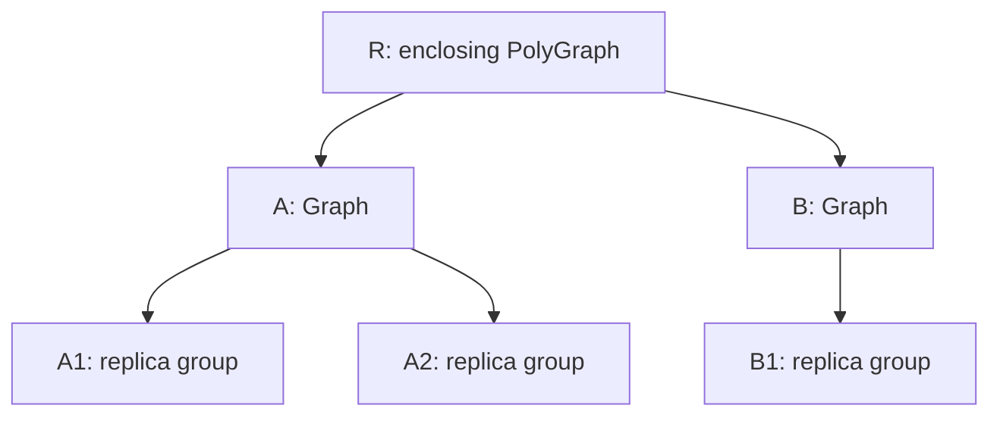
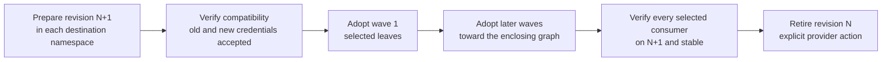
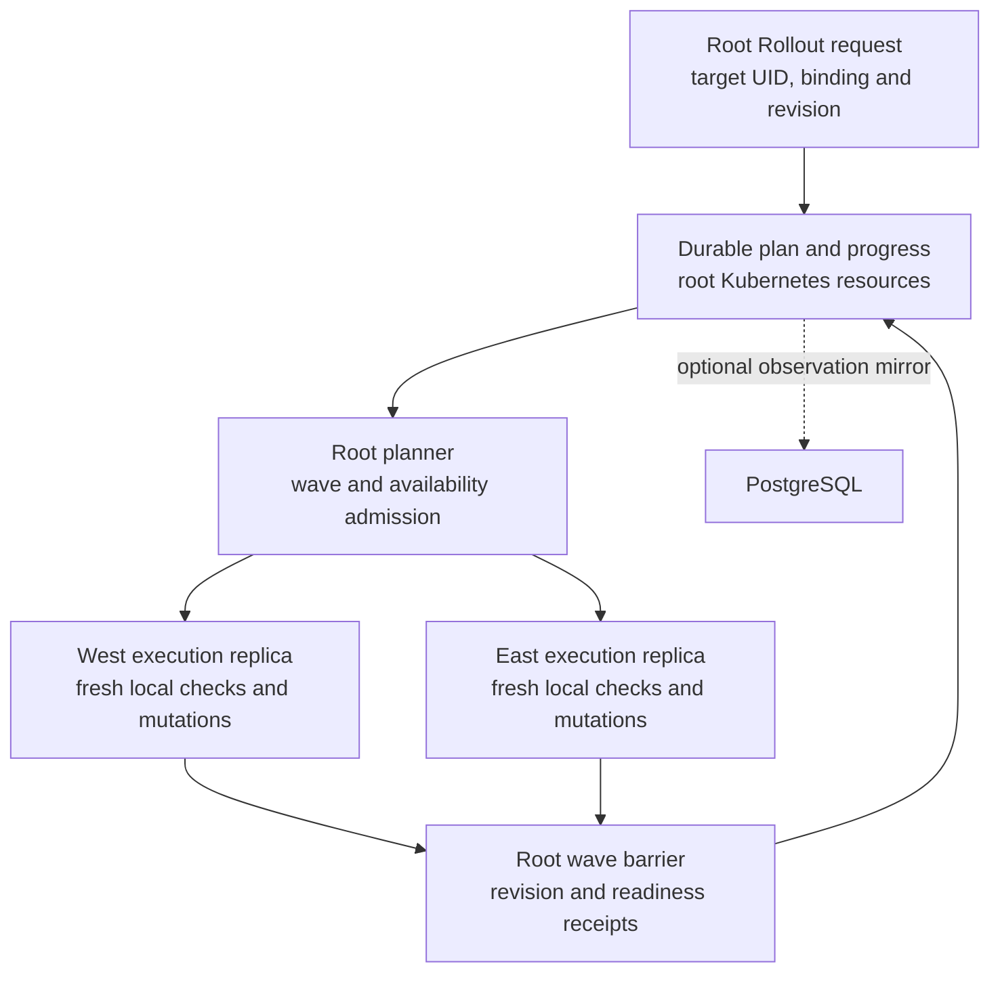

# Graph-scoped rollouts and rotations

**Status: design proposal.** The `RolloutPolicy`, `Rollout` and graph bindings
below are proposed APIs, not installed CRDs or supported configuration yet.
Current [Secret reloads](../operations/authentication.md#restart-consumers-after-rotation) act
independently; they do not provide ordered graph-wide rollout waves.

The root operator should coordinate a durable rollout over a Graph, PolyGraph
or ReplicaGroup. A rollout selects a named policy, pins a change revision and
advances through bounded waves. Remote execution replicas perform admitted
steps and report completion to the root. The same model works in a single
cluster, with either Dense or Distributed operator deployments.

The initial scope should adopt already provisioned credential revisions.
Creating and revoking credentials in an external provider requires a separate,
explicit integration; synchronizing a Kubernetes Secret is not equivalent to
changing a database password or revoking a certificate.

## Table of contents

- [Policies paired with graphs](#policies-paired-with-graphs)
- [Sparsity and event notifications](#sparsity-and-event-notifications)
- [Direction and traversal are separate choices](#direction-and-traversal-are-separate-choices)
- [Secret rotation has preparation, adoption and retirement](#secret-rotation-has-preparation-adoption-and-retirement)
- [Admission, KEDA and graph constraints](#admission-keda-and-graph-constraints)
- [Root coordination, recovery and overlap](#root-coordination-recovery-and-overlap)
- [Rolling the operator itself](#rolling-the-operator-itself)
- [Implementation boundaries](#implementation-boundaries)

## Policies paired with graphs

Use two new resources, with several named policy bindings per graph:

| Proposed API | Responsibility |
| --- | --- |
| `RolloutPolicy` | Reusable traversal, concurrency, sparsity, readiness, availability and failure behavior; allowed change types |
| Graph, PolyGraph or ReplicaGroup `spec.rolloutPolicies` | Bind purpose names such as `credentials`, `release` and `restart` to policies |
| `Rollout` | One immutable request targeting a graph instance and one binding; records pinned inputs, its plan and progress |

A request targets an instance by cluster, namespace, kind, name and UID. It does
not silently roll every instance of a reusable definition. The root resolves
policy bindings in its configured management scope, including bindings retained
on remotely instantiated graphs; it does not discover arbitrary policies in
unregistered clusters.

Different requests can select different policies on the same graph. For example:

| Binding | Change | Example order |
| --- | --- | --- |
| `credentials` | Adopt a versioned Secret after compatibility preparation | Leaves first, breadth first |
| `release` | Adopt image digests and versioned configuration | Dependency predecessors first, breadth first |
| `restart` | Restart existing revisions | One branch at a time, depth first |
| `trust` | Expand trust, switch identities, then retire old trust | Separate ordered phases, each with its own traversal |

These are selectable policies, not universally safe deployment orders. A client
and server protocol determines which component must accept a revision first.
Child policies may tighten inherited limits. They cannot skip a parent's wave
barrier, widen its target scope or relax its availability budget. Conflicting
constraints block planning with an explanation rather than silently choosing one.

The following YAML illustrates the proposed policy and binding syntax only:

```yaml
apiVersion: polyad.astrivant.com/v1alpha1
kind: RolloutPolicy
metadata:
  name: credentials-leaves-first
spec:
  changes: [SecretRevision]
  traversal:
    relation: Hierarchy
    direction: Reverse
    order: BreadthFirst
  concurrency:
    maxInFlight: 1
    maxClusters: 1
  sparsity:
    minIntervalSeconds: 900
    cooldownSeconds: 300
  availability:
    maxUnavailablePods: 1
    minReadyPerReplicaGroup: 1
  readiness:
    stableSeconds: 30
    timeoutSeconds: 600
  autoscaling: HoldMembership
  failurePolicy: Pause
```

```yaml
# Proposed fragment of an existing Graph, PolyGraph or ReplicaGroup spec.
spec:
  rolloutPolicies:
    credentials: credentials-leaves-first
    release: releases-dependencies-first
    restart: restarts-one-branch
```

A root request names that binding and the desired revision. Secret substitutions
must identify each destination cluster and namespace, old and new Secret names,
and the selected consumers. Local Secret UIDs and resource versions fence those
inputs. Kubernetes resource versions are not compared across clusters; the
request's opaque revision identifies the overall change. Payloads and raw
credential-derived hashes never belong in rollout status or events.

## Sparsity and event notifications

Policies should also bound rollout frequency. Graphs, PolyGraphs, ReplicaGroups,
Daemons and Workloads can add `spec.rolloutSparsity` limits across their rollout
bindings. Every ancestor's limits still apply. Minimum intervals, cooldowns,
bounded debounce and sliding-window quotas prevent repeated triggers from
causing repeated replacements; they do not slow ordinary reconciliation or
native crash recovery.

The root should persist deferral and execution transitions and emit `rollout`
events, including the limiting scope and earliest eligible time. Workloads can
observe queued, coalesced, deferred, started and completed changes independently
of topology notifications. See [rollout sparsity and events](rollout-sparsity.md)
for the proposed fields, inheritance, durable accounting and event contract.
These settings and event types are part of the proposal, not current APIs.

## Direction and traversal are separate choices

First choose the relation that determines order:

| Relation | Forward | Reverse |
| --- | --- | --- |
| `Hierarchy` | Enclosing graph before descendants: root to leaves | Descendants before enclosing graph: leaves to root |
| `Dependencies` | Prerequisite before dependent, using `requires` | Dependent before prerequisite |
| `Connections` | Source before destination along declared data-flow edges | Destination before source |

Then choose `BreadthFirst` or `DepthFirst`. Breadth first completes a whole wave
before advancing to the next; concurrency limits can divide a wave into smaller
batches. Depth first completes one ordered branch before moving to a sibling.
The plan fixes sibling ordering so retries and leader changes cannot reorder it.

For this hierarchy, every letter is a rollout boundary:



| Traversal | Boundary order |
| --- | --- |
| Forward breadth first | `R` → `{A, B}` → `{A1, A2, B1}` |
| Reverse breadth first | `{A1, A2, B1}` → `{A, B}` → `R` |
| Forward depth first | `R` → `A` → `A1` → `A2` → `B` → `B1` |
| Reverse depth first | `A1` → `A2` → `A` → `B1` → `B` → `R` |

Reverse breadth first reverses the forward depth levels; it is not a global
reverse of a depth-first walk. In an uneven tree, a shallow leaf can therefore
share a later wave with an internal boundary. Dependency waves use topological
levels instead of shortest-path distance, so a longer dependency path cannot be
skipped by a shortcut edge.

Graphs themselves have no Pod to restart. A boundary step applies to explicitly
selected, directly owned workloads or an explicit boundary hook. It never
recursively restarts its whole subtree; that would defeat ordering. A boundary
with no direct action is an ordering barrier. ReplicaGroup copies expand into
their individual runtime targets. A workload referenced through several paths
appears once, retaining all ordering constraints from those paths.

An enclosing boundary's step cannot require every descendant to have adopted the
new revision in forward mode: those descendants have not had their turn yet.
Its completion checks only its direct actions and the required existing health;
the final rollout barrier verifies adoption across the entire selected subtree.

Data-flow connections may contain cycles, including Ring and FullMesh layouts.
A proposed `Connections` policy must reject cycles by default and explain the
cycle. An explicit override can treat each strongly connected component as one
ordering group, then order its members with a separate bounded strategy. Grouping
a cycle is not proof that simultaneous replacement is safe. Cross-boundary
connection ordering also needs explicit endpoint mappings; it must not infer
workload dependencies from containment or mesh reachability.

## Secret rotation has preparation, adoption and retirement

Updating a shared Secret in place cannot enforce adoption waves: Kubernetes can
project updated values into existing Pods asynchronously, before Polyad selects
those consumers. Environment variables and `subPath` mounts have different
refresh behavior. Use distinct immutable Secret revisions and switch consumer
references in the admitted wave. See [Kubernetes Secret behavior](https://kubernetes.io/docs/concepts/configuration/secret/).



Preparation can use ESO with pinned provider versions and separate immutable
targets. ESO's refresh controls govern Secret synchronization; they do not
provide application adoption barriers or provider revocation. See [ExternalSecret
refresh and target configuration](https://external-secrets.io/latest/api/externalsecret/).

The proposed execution phases are:

1. **Prepare:** verify the new revision exists in every destination and pin its
   identity. Provider adapters or explicitly referenced finite Graphs can perform
   preparation work, with operation IDs and durable completion receipts.
2. **Establish compatibility:** where supported, make servers or verifiers accept
   both revisions. For certificate rotation this may mean expanding trust before
   switching identities. This phase may need the opposite traversal to adoption.
3. **Adopt:** update references and roll selected Deployment or StatefulSet
   consumers in bounded waves. Wait for the requested revision and stable
   readiness, plus configured application checks.
4. **Verify:** confirm all selected consumers have adopted the revision, including
   every selected replica and namespace. Report excluded consumers explicitly.
5. **Retire:** revoke or remove the old revision only through an explicit adapter
   or hook, after a configured overlap period and verification of all consumers
   in its revocation scope. Out-of-scope or unknown consumers block automatic
   revocation. Kubernetes Secret deletion alone does not revoke a credential.

Hooks are references to typed operations or finite Graphs with an explicit
completion contract, not arbitrary callbacks submitted to the operator. A
readiness probe alone does not prove a remote dependency accepts a new credential.
Such rotations need an application check or revision acknowledgement. Systems
that cannot accept overlapping credentials need a declared disruption window;
changing traversal cannot make that switch seamless.

Ordered consumers must have one rollout owner. Admission must reject conflicting
Reloader participation, automatic Pod-template checksums or other update writers
unless their effects are explicitly coordinated. Polyad's existing projected
operator credential watcher also restarts processes independently; coordinated
operator rotations require changing which versioned Secret is mounted at the
planned step. Independent reload behavior remains available for other consumers.

## Admission, KEDA and graph constraints

Before every mutation, re-read target identity, desired revision, current
readiness, ancestor constraints and selected GraphRules under the existing
mutation fence. Recompute graph metrics, including Cheeger where required.
Structural validity and availability are separate checks: the current Cheeger
calculation does not establish the capacity or connectivity of only healthy
Pods, and it does not guarantee application throughput during a rollout.

Rollout admission must additionally account for the proposed step's worst-case
unavailability, surge, live replicas, quorum and required ready instances at each
affected boundary. An optional healthy-topology rule would require its own
explicit projection and evaluation; it cannot reuse a structural verdict as
evidence that unavailable vertices preserve service connectivity.

Breadth-first traversal is bounded concurrency, not permission to restart every
sibling at once. Existing Daemon Deployments use `Recreate`, so admitting a
controller restart must account for all its Pods becoming unavailable.
StatefulSet `OnDelete` and partitions can leave old revisions running; an ordered
rollout must either handle them explicitly or remain blocked. Ordinary current
readiness is insufficient to declare complete revision adoption.

The default `HoldMembership` behavior should hold scale changes affecting the
selected rollout membership while allowing KEDA to continue scraping metrics.
KEDA may submit new desired counts, but applying them must pass the same root
admission fence as rollout mutations. Existing invalid or stale metrics must
remain unavailable, not become zero demand. Optionally allow scale-out only when
new replicas join the pinned revision and the root recomputes all budgets.

Direct native autoscalers can bypass graph admission. Targets with an independent
HPA or KEDA ScaledObject must either participate in a supported hold protocol or
be rejected during planning. KEDA exposes a [pause annotation](https://keda.sh/docs/2.20/concepts/scaling-deployments/#pausing-autoscaling);
using it requires recording prior state, waiting for the pause to take effect,
checking for in-flight changes, and conditionally restoring only state owned by
this rollout. A blanket pause across the whole control plane is unnecessary.

## Root coordination, recovery and overlap



The root owns planning; workers execute only admitted steps while their root
authority is valid. Loss of root contact pauses new steps and leaves existing
workloads running. Kubernetes controllers may finish a step already dispatched.
Queues carry wake-up hints; neither queue delivery nor optional PostgreSQL is
the source of execution authority.

Persist the request, resolved policy revision, target UIDs, plan revision, current
wave, operation IDs and per-target receipts in Kubernetes. Large plans need
bounded child records rather than an unbounded status field on one object.
PostgreSQL, when enabled, may mirror nonsensitive rollout observations. An HA
handoff resumes from fresh Kubernetes observations and receipts instead of
repeating already adopted changes. Retries provide idempotent reconciliation,
not exactly-once external side effects; hooks need the same operation identity.

Reserve conflicting targets, ancestor availability budgets and shared credential
revision scopes before dispatch. Use the existing graph-family leases for local
writes and durable root reservations for multi-family orchestration. A planner
must not hold several worker shard leases while waiting for remote readiness.
Acquire reservations in a deterministic order, and release them through recorded
completion or cancellation so overlapping requests cannot deadlock.

Disjoint rollouts can advance concurrently if they share no constrained budget
or credential lifetime. Overlapping requests queue, including image and Secret
changes targeting the same consumers. Topology changes, UID replacements and
policy changes stop dispatch until the request is explicitly replanned; the
operator must not silently broaden a running rollout's membership. Expired
temporary edges require a fresh order and constraint evaluation as well.

A failed step pauses subsequent waves and records the blocked condition. Cancel
stops future dispatch and observes in-flight work before releasing reservations.
It does not undo adopted revisions. Rollback is a new admitted plan and is only
possible while the old revision and application compatibility remain available;
revocation and data migrations may not be reversible.

## Rolling the operator itself

Triggering an application rollout from the root does not implicitly roll the
root Deployment. Operator rotation is a separate opt-in scope encompassing
execution pools, component workloads and the Helm-owned bootstrap Deployment.
That bootstrap is outside the [operator's own Graph](../deployment/components.md), so it needs
an explicit coordination adapter and must not be mistaken for a graph child.

A leaves-first operator upgrade can update remote execution replicas, then
selected root components, then bootstrap replicas. Protocol compatibility can
instead require a root-first preparation phase before any worker update.
Versioned control-plane credentials must remain accepted by both sides during
handoff; the current single-token listeners do not yet implement that overlap.

Keep a ready root coordinator and its required API/cache connectivity throughout
the handoff. Journal progress before restarting the coordinator and require the
replacement to reclaim authority and verify the prior step before proceeding.
Rolling all bootstrap replicas at once cannot satisfy this contract. Cache and
database server upgrades remain with their owning operators; a coordinated plan
can wait for their health but must not take over their internal update strategy.

## Implementation boundaries

The existing [mutation planner](../development/mutations.md) supplies effect declarations,
preconditions and bounded batches. It can underpin step execution, but HTTP
write completion is not a rollout barrier. Adoption receipts and refreshed
readiness must gate subsequent waves across reconciliation turns.

Implementation needs public types in `polyad_types`, CRDs and status schemas,
root planning and reservations, local fenced execution adapters, and integration
with ordinary reconciliation so it preserves committed revision selections.
Persist those selections beyond the lifetime of the request; deleting a completed
receipt must not revert consumers to a stale reusable definition. Graph-generated
children must not be patched by a separate path that normal reconciliation can
immediately overwrite. Helm/GitOps ownership of bootstrap updates needs an
equivalent explicit contract.

Verification should cover both traversal directions and orders, uneven trees,
dependency diamonds, cycles, shared targets, nested policies, concurrent KEDA
intent, Secret replacement mid-wave, current-revision readiness, HA handoff,
remote partitions and interruption during provider preparation or revocation.
Live tests must also establish Secret projection and native controller behavior;
an in-memory plan alone cannot demonstrate those guarantees.
