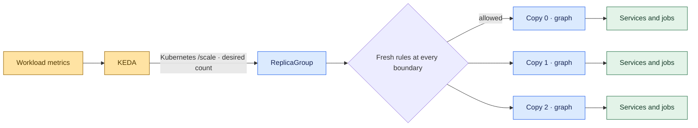
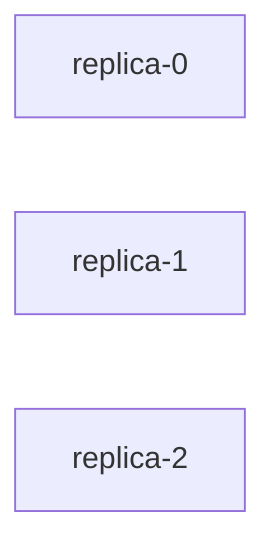
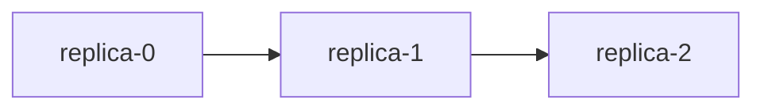
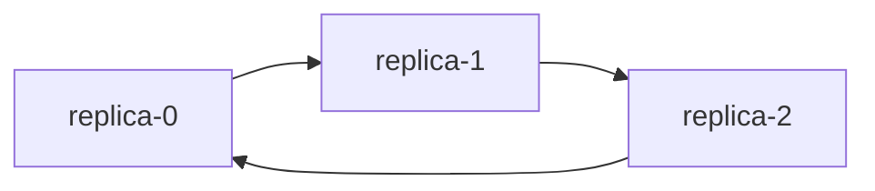
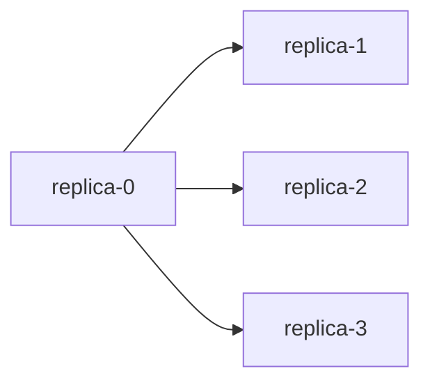
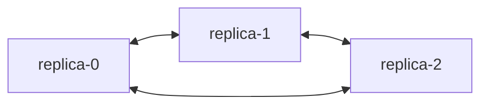
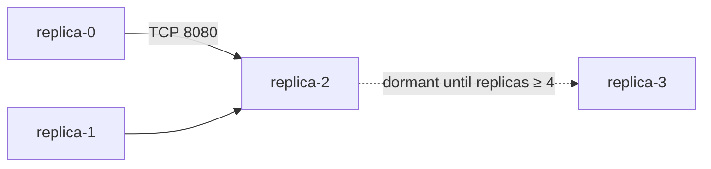
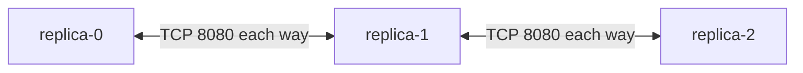
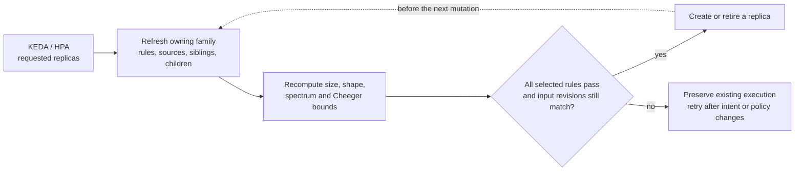

# Replication and KEDA

A **ReplicaGroup** is a scalable family of copies. Its template can reference a
`Workload`, `Daemon`, `Ephemeral`, `Resource`, `Graph`,
`PolyGraph`, or another `ReplicaGroup`. Replicating a graph copies its
whole service composition, including dependencies, gates and resource definitions.
Each copy has a stable ordinal, separate owned resources and a status that rolls
up to the group and its ancestors.



## Declare a scalable abstraction

```yaml
apiVersion: polyad.astrivant.com/v1alpha1
kind: ReplicaGroup
metadata:
  name: processors
  namespace: polyad
spec:
  replicas: 2
  minReplicas: 0
  maxReplicas: 20
  template:
    kind: Graph
    ref: processing-pipeline
```

`processing-pipeline` is an existing graph definition with `templateOnly: true`.
To scale individual services, reference a `Daemon` instead. To scale a collection
of jobs, reference a finite `Graph`. `Resource` can replicate supported Services,
ConfigMaps and PVCs. Gates, rules and shutdown policies are reusable control
configuration: include them in a graph to apply them to every copy.

The group exposes the Kubernetes scale subresource:

- `.spec.replicas`: desired copies, bounded by `minReplicas` and `maxReplicas`.
- `.status.replicas`: observed copies, including those still terminating.
- `.status.labelSelector`: an incarnation-specific selector for descendant Pods.
- `.status.readyReplicas`: copies observed ready or successfully completed.

A group stays alive at zero copies. Completed finite copies remain completed;
replica count is not a repeated-job trigger. Use [activation pulses](activation.md)
when work must repeat. Replicating a Daemon copies its selected
Deployment or StatefulSet controller; each copy retains that definition's own replica setting. Bounds count copies of
the selected abstraction, not the total Pods in their descendant graphs.

## Connections between copies

`spec.connectivity` selects the data-flow connections between replica vertices.
Omitting it keeps the default `Independent` mode. Connections do not add
`requires` dependencies: copies remain independently admissible, including when
the data-flow pattern contains cycles.

```yaml
spec:
  replicas: 4
  maxReplicas: 20
  template:
    kind: Daemon
    ref: processor
  connectivity:
    mode: Ring
    bidirectional: true
    ports:
      - port: 8080
        protocol: TCP
  network:
    allowWithin: false
  rules: [replica-bottlenecks]
```

| Field | Default | Meaning and constraints |
| --- | --- | --- |
| `mode` | `Independent` | `Independent`, `Chain`, `Ring`, `Star`, `FullMesh`, or `Custom`; case sensitive |
| `bidirectional` | `false` | Add the reverse of each edge, with the same port grants; invalid with `Independent` |
| `ports` | `[]` | Destination ports for built-in connected modes; each port is 1–65535 with protocol `TCP` (default), `UDP`, or `SCTP`; invalid with `Independent` or `Custom` |
| `edges` | `[]` | At most 4096 custom edges with unique directed source/target pairs; nonempty only with `Custom` |

### Independent

Creates no connections between copies.



### Chain

Connects each ordinal to the next one, in ascending order.



### Ring

Connects each ordinal to the next and adds an edge from the last back to the first.



### Star

Sends from `replica-0` to every other copy.



### FullMesh

Connects every distinct pair in both directions, even when
`bidirectional` is false.



### Custom

Uses explicit ordinal names and per-edge ports. Endpoints must be
canonical names such as `replica-0`, with indices below `maxReplicas`; leading
zeros and self connections are rejected. Edges whose endpoints are not both
within the requested count remain dormant. This lets a declaration describe
future scale-out connections without creating extra copies.

```yaml
connectivity:
  mode: Custom
  edges:
    - source: replica-0
      target: replica-2
      ports:
        - port: 8080
    - source: replica-1
      target: replica-2
    - source: replica-2
      target: replica-3
```

With `replicas: 3` and `maxReplicas: 4`:



### Bidirectional connections

Setting `bidirectional: true` on Chain, Ring, Star, or Custom adds reverse edges.
Each reverse edge grants the same ports at its new destination. Identical
connections are deduplicated; distinct port grants are retained.



### Scaling and topology changes

All built-in modes have no edges at zero or one copy. A two-copy Ring has two
opposing edges. On scaling, built-in patterns are rebuilt over the new ordinals;
for example, a Ring's closing edge moves to its new last copy. Custom edges are
activated or removed as endpoints enter or leave the count. Rules check this
resulting topology before an execution is created or retired. When checking a
sibling with pending removals, its still-live ordinals remain in the projection
and its pattern is rebuilt over that set, in numeric order.

Workloads can follow these changes through [topology events and neighbor snapshots](workload-events.md).
Replica count changes notify subscribers even in Independent mode. Snapshots
distinguish requested copies from executions that have actually been created,
and show retiring copies until their resources disappear.

These are declared data-flow connections, not application wiring or service
discovery. Ports become transport grants only when a network policy is selected
on the boundary, directly or through a GraphRule. Omitted ports grant no traffic.
Use `network.allowWithin: false` to restrict traffic to explicit grants; ancestor
policies can narrow them further. See [graph networking](networking.md).

Select `relation: connections` on a GraphRule to measure these edges. For four
copies, the exact Cheeger constants are 0 (Independent), 0.5 (Chain), 1 (Ring),
1 (Star), and 2 (FullMesh). Directions and ports do not weight the Cheeger
calculation. A minimum limits bottlenecks; a maximum limits how highly connected
the weakest cut can be. For example, a Ring with four or five copies satisfies
`cheeger.minimum: 1`, while six copies have `h = 2/3` and fail:

```yaml
apiVersion: polyad.astrivant.com/v1alpha1
kind: GraphRule
metadata:
  name: replica-bottlenecks
spec:
  enforcement: Referenced
  scope: Boundary
  relation: connections
  cheeger:
    minimum: 1
```

Exact Cheeger evaluation remains limited to 20 vertices per evaluated boundary.
Other computation limits still apply: a FullMesh produces `n × (n − 1)` directed
edges and exceeds the 16,384-edge expansion limit above 128 copies. Custom edges
can leave replicas isolated; positive connectivity or Cheeger constraints can
therefore block counts that fall within `minReplicas` and `maxReplicas`.

## Independent instances and all uses of a definition

A standalone ReplicaGroup is independently scalable. To share a replication
policy, set `templateOnly: true` on a ReplicaGroup definition and reference it as
a `ReplicaGroup` node in persistent graphs or PolyGraphs. Each generated instance
inherits the reusable group's requested count. Scaling that definition scales
**all inheriting uses**, without replacing their existing copies.

Each instance retains its own connectivity configuration. Shared count changes
regenerate that instance's edges using its effective count. Editing other fields
of a reusable definition, including connectivity, follows the normal definition
replacement lifecycle rather than the count-only scaling path.

The generated `spec.replicaSource` pins the reusable group's name and UID. The
operator rejects a missing or recreated source. On a generated instance, set
`inheritReplicas: false` before attaching a separate KEDA ScaledObject to it.
The scale subresource rejects individual count changes while inheritance is on.
For a shared definition, status reports the maximum observed per-instance count,
plus `instanceCount` and `totalReplicas`; requested replicas remain **per use**.

Existing references directly to a Workload or Graph continue their normal
semantics. To replicate those uses together, route them through the shared
ReplicaGroup definition. Replication is explicit rather than a namespace-wide
mutation of every reference to a library object.

## Connect KEDA

Enable `metrics.enabled`, `metrics.authentication.enabled` and
`keda.authentication.enabled` in the Helm chart, and supply the metrics Secret
as described in [authentication and ESO setup](authentication.md). Install KEDA separately and give its
operator and HPA controllers permission to read/update `replicagroups/scale` in
the target namespace. KEDA supports custom resources through this standard
[scale subresource](https://keda.sh/docs/2.20/concepts/scaling-deployments/).
Do not attach two autoscalers to the same group.

```yaml
apiVersion: keda.sh/v1alpha1
kind: ScaledObject
metadata:
  name: processors
  namespace: polyad
spec:
  scaleTargetRef:
    apiVersion: polyad.astrivant.com/v1alpha1
    kind: ReplicaGroup
    name: processors
  minReplicaCount: 0
  maxReplicaCount: 20
  pollingInterval: 10
  cooldownPeriod: 60
  advanced:
    horizontalPodAutoscalerConfig:
      behavior:
        scaleUp:
          stabilizationWindowSeconds: 0
        scaleDown:
          stabilizationWindowSeconds: 300
  triggers:
    - type: metrics-api
      metricType: AverageValue
      metadata:
        url: http://polyad-polyad-metrics.polyad.svc.cluster.local:8092/v1/workloads/Graph/intake/pendingActivations?node=process
        format: json
        valueLocation: value
        targetValue: '5'
        activationTargetValue: '0'
        authMode: bearer
      authenticationRef:
        name: polyad-polyad-metrics
```

Replace the metric URL with the actual source of demand. The metric source and
scale target can be different objects. KEDA's
[Metrics API scaler](https://keda.sh/docs/2.20/scalers/metrics-api/) reads the
numeric `value` field. Match KEDA's bounds to the group's bounds. For shared
definitions, thresholds must account for the number of inheriting instances:
the same requested count is applied to every instance.

The example assumes release `polyad` in namespace `polyad`. The generated
TriggerAuthentication is namespaced and reusable by ScaledObjects there.
Use the configured `keda.authentication.name` when overriding its default name.
Tune stabilization and scaling rates independently of polling and cooldown;
see [performance tuning](performance.md#keda-managed-targets).

The example reads pending activation demand; scaling processors does not itself
consume activation receipts owned by another graph. Applications must connect
the replicated consumers to their actual queue or upstream service. KEDA can
also use its other scalers, including Prometheus and application queue backends,
with the same ReplicaGroup target.

Allow KEDA through `networkPolicy.metricsPeers` and, with Istio,
`mesh.operator.metricsPrincipals`. `/v1/workloads/*` is covered by the metrics
listener's authorization policy. Each operator replica observes namespace-wide
demand: use the Service address, or **max**, rather than summing replica samples.
No application secrets or arbitrary Pod labels are exposed by the metrics API.

## Metric scopes and freshness

`GET /v1/workloads/{kind}/{name}/{metric}` returns one scalar. Add `?node=NAME`
to select one logical node of a graph. For a reusable Workload, Daemon or
Ephemeral definition, the endpoint aggregates its observed uses by UID.
ReplicaGroup-specific signals are `replicas`, `desiredReplicas`, `readyReplicas`,
`totalReplicas` and `instanceCount`. Node signals include:

| Signal | Meaning |
| --- | --- |
| `executions` | Observed execution resources |
| `readyExecutions`, `completedExecutions`, `failedExecutions` | Lifecycle counts |
| `pendingActivations`, `activeActivations` | Pending and selected/running pulse counts |
| `overdue` | Number of targets past their activation deadline |
| `replicas`, `readyReplicas` | Native replica observations where supplied by Kubernetes |

Graph boundaries also expose current execution and recursive
rollup counters such as `pendingNodes`, `activeLeafNodes`, `readyLeafNodes`,
`graphCount` and `resourceCount`. Incomplete descendant observations return 503.

These are scheduler and Kubernetes status signals, not application CPU, memory
or custom queue measurements. Use KEDA's application scalers for those.

Missing objects or signals return 404. Stale inventory, stale controller
observations or mismatched inherited source generations return 503. Observations
expire after thirty seconds; missing demand is never synthesized as zero.
`/openapi.json` describes the endpoint. `/v1/metrics` includes the same observations,
and `metrics.graphLabels: true` enables `polyad_workload_signal` Prometheus series
with `kind`, `name`, `node` and `signal` labels.

## Constraints before scaling

KEDA supplies a requested count through `/scale`; Polyad decides whether the
resulting execution topology satisfies [GraphRules](graph-rules.md#polygraphs-and-autoscaling).
The rule check runs again before each execution creation and scale-in deletion,
using fresh graph specifications and owned children, rather than cached status
measurements. PolyGraph rules participate in these checks, including a parent's
recursive limits declared with `scope: Boundary`.



A shared source's count is resolved for every inheriting instance in the family;
independent instance overrides are retained. Pending sibling removals do not
release an ancestor's budget until those resources disappear. A rejected scale-in
request does not begin deletion; lower bounds and required shapes can prevent
scaling to zero. Rejections leave `spec.replicas` as requested so the desired and
observed counts can differ. `scaleCurrent: false` marks a failed or deferred
reconciliation; group scalar metrics return 503 while this observation is not
current. Successful `structuralRules` reports include the boundary identity for
each evaluated rule.

ReplicaGroup edges follow its [connectivity mode](#connections-between-copies).
The default Independent mode has Cheeger constant zero; connected modes and
Custom edges can satisfy positive bounds. Select `relation: connections` to
evaluate them. The enclosing PolyGraph's Cheeger value still describes its
declared inter-graph connections, not a flattened Pod network.
Place a Cheeger bound on the intended boundary with `scope: Boundary` when it
should not propagate to the replica groups. Other subtree and namespace rules
continue to apply.

A `Daemon` selects a Deployment (default) or StatefulSet using
`spec.controller`; it does not produce a Kubernetes DaemonSet. Use a ReplicaGroup
of Daemons with `replicas: 1` when each KEDA replica should mean one desired Pod.
Point KEDA at the group: native Deployment or StatefulSet scaling does not pass
through graph admission checks. Rules count graph vertices and recursive
occurrences, not internal native replica totals. StatefulSet group scale-in
deletes whole sets, so `persistentVolumeClaimRetentionPolicy.whenDeleted` governs
their PVCs. See [workload controllers and storage](workload-storage.md).

The owning-family lease serializes operator actions, and inputs are refreshed and
checked after computation. Kubernetes offers no atomic read across all these
objects, so an external writer can still race the final dispatch. A shared source
used by independent root families is checked separately in each family; it is not
a cross-family transaction. Rule rejection can leave some families scaled and
others waiting. Explicit suspension, shutdown and deletion remain available to
drain workloads.

## Scheduling and cleanup

ReplicaGroup uses the graph's existing ordered mutation queue and root-family
shard. Copies inherit placement, network isolation, capacity planning and
structural rules. Nested replication is evaluated against the graph family's
size and nesting limits before admission. Each group supports at most 256 copies;
its default upper bound is 32. All instances in one graph family remain serialized.
Use independent root groups to distribute duties across operator shards.

Scale-out retains existing ordinal identities. Scale-in waits for active Jobs
and finite Graph/PolyGraph copies to complete before deleting them. Daemons and
persistent graphs drain through normal termination and finalizers. Suspension,
explicit graph deletion and definition revision changes follow their existing
cleanup contracts. Storage and application state must support the chosen number
of concurrent copies; replication does not clone or checkpoint application state.

Upgrade the chart's CRDs, including `ReplicaGroup`, before the operator. Helm does
not automatically upgrade existing CRDs. No KEDA installation or ScaledObject is
created implicitly by Polyad.
