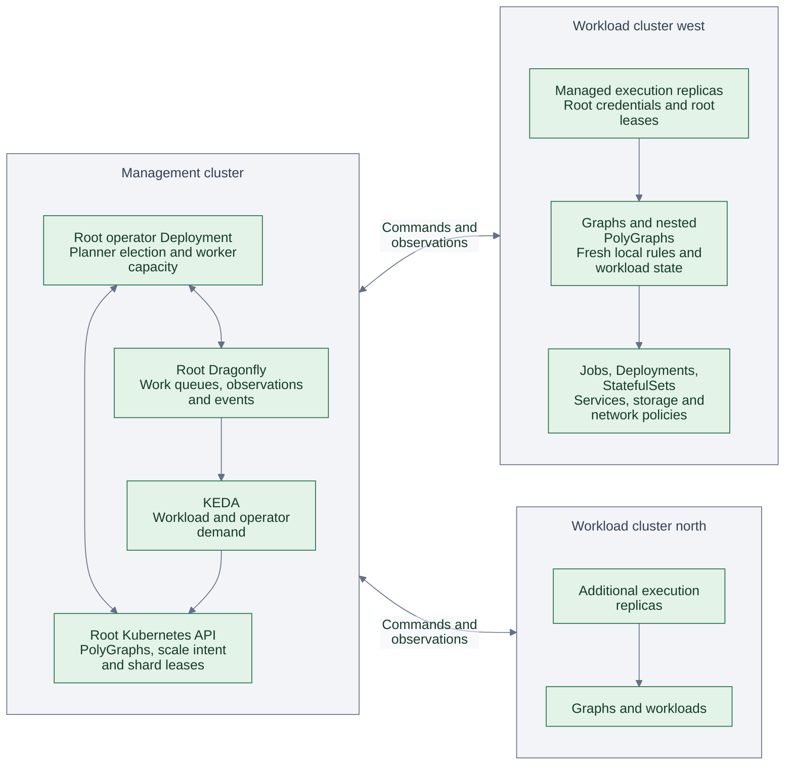
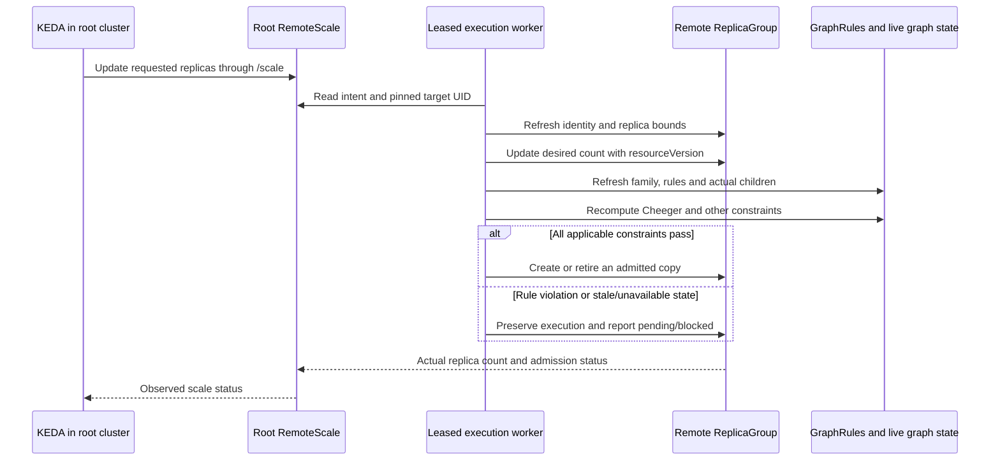

# Root control plane

Enable `rootControlPlane.enabled` to run one logical operator across registered
clusters. Its Deployment can live in a dedicated management cluster containing
no application Pods. Remote `OperatorPool` Deployments add execution capacity;
they share the root's queues and leases and cannot elect their own planner.
The root installs and upgrades these workers, including their Polyad CRDs and
projected credentials. This is optional; an ordinary single-cluster install
continues to work without remote credentials.

All graph observations, topology events, queue demand and scaling intent converge
at the root. Application payloads travel over the graphs' configured networking;
they do not pass through the operator. Read-only observers remain optional readers,
separate from these execution workers.

## Authority and execution



Workers can reconcile any registered cluster. A pool's `spec.cluster` chooses
where its operator Pods run; it does not assign that cluster's graphs exclusively
to those Pods. The root Deployment also executes duties, so reducing every remote
pool to zero leaves a working controller. There are 32 shared logical shards
across the entire control plane. A graph family remains serialized; extra replicas
help independent families, with useful concurrency capped by shard count and API
capacity. Every replica currently rescans registered namespaces, so monitor API
read load as well as queued writes when choosing replica counts.

Graph intent and native workload state remain authoritative in their destination
Kubernetes API. The root holds the cluster registry, coordination, queues, cached
reports and management intent. It refreshes remote state before acting. Equal
namespace, graph and replica names in different clusters have separate queues,
shard identities and observation streams.

## Install and register clusters

The runnable configuration lives in
[`examples/root-control-plane`](../examples/root-control-plane/values.yaml):

1. Apply [`access.yaml`](../examples/root-control-plane/access.yaml) in each
   workload cluster. This establishes the namespace and bootstrap identity.
   Prepare administrator-managed, embedded kubeconfigs with verified HTTPS for
   that identity; use short-lived credentials and your existing rotation process.
2. In the management namespace, create `west-access` with key `config`,
   containing that remote kubeconfig. Create `root-access` with key `config`,
   containing a root kubeconfig with the permissions of the chart's operator Role.
   Its Kubernetes API address must be reachable from remote worker Pods.
3. Provide `root-cache` with key `url`: a credentialed Dragonfly URL reachable
   from the root and every remote worker. Use the same endpoint for all replicas,
   with TLS when crossing untrusted networks. The root chart requires an existing
   Secret rather than implicitly advertising a cluster-local cache address.
4. Supply the endpoint credentials named in
   [`values.yaml`](../examples/root-control-plane/values.yaml), or use the chart's
   existing [ESO configuration](authentication.md). Replace `polyad.example.com`
   with reachable root API routes. Configure firewalls and NetworkPolicies for
   the root cache and every registered Kubernetes API.
5. Install the chart in the root cluster, then apply
   [`pool.yaml`](../examples/root-control-plane/pool.yaml) **in the root namespace**:

```bash
helm upgrade --install polyad charts/polyad \
  --kube-context management --namespace polyad --create-namespace \
  --values examples/root-control-plane/values.yaml
kubectl --context management apply -f examples/root-control-plane/pool.yaml
```

Once the pool has installed the remote CRDs, apply the reusable definitions and
then the root application:

```bash
kubectl --context west apply -f examples/root-control-plane/workloads.yaml
kubectl --context management apply -f examples/root-control-plane/application.yaml
```

[`application.yaml`](../examples/root-control-plane/application.yaml) is a root
PolyGraph that creates a Graph from the remote `services` definition. Its Daemon
replicas run entirely in the workload cluster. The `consumers` definition is the
UID-pinned KEDA target used below.

The root creates the remote worker Deployment, copies its required credential
Secrets and installs/upgrades the image's bundled Polyad CRDs. Remote workers
use an explicit root kubeconfig and do not mount a local ServiceAccount token.
Only root Deployment processes participate in planner election. Workers are
trusted components with control-plane credentials, not workload-facing agents.
Changes to the root image, managed Pod settings or credential Secret versions
roll the workers automatically. Use immutable image tags: planner assignments
exclude workers running an older image, and older workers cannot apply their
CRD bundle over the desired version. Root and remote namespaces must already exist;
namespace ownership stays with administrators.

The root does not install Istio, KEDA, ESO, Reloader, CSI drivers or application
source definitions into workload clusters. Install the optional dependencies
needed by those workloads and place their reusable definitions in each registered
namespace. The root owns execution of the resulting Graph instances. Install KEDA
in the root cluster for this mode; do not run independent Polyad operators or
competing local autoscalers for the same managed graph families.

`federation.clusters` remains the bounded cluster registry (up to 32 remote
clusters, one namespace per registration). Keep registrations and credentials
until their remote graphs and operator pools have drained. Nested PolyGraphs use
this same root registry, so every additional destination is registered at the root.

## Configuration

| Field | Meaning |
| --- | --- |
| `rootControlPlane.enabled` | Opt in to central reconciliation, reports and worker management; default `false`. Requires federation and metrics. |
| `rootControlPlane.kubeconfigSecret` | Root namespace Secret holding root credentials under `config`; required in root mode. |
| `rootControlPlane.endpoints.api` | Reachable root composition URL advertised to workloads. |
| `rootControlPlane.endpoints.events` | Reachable root events URL advertised to workloads. |
| `rootControlPlane.endpoints.metrics` | Reachable root metrics URL advertised to workloads. |
| `rootControlPlane.meshPeers` | Complete registry of workload-cluster mesh peers using the [existing peer fields](multicluster.md#remote-traffic-rules). Each controller excludes its own execution cluster. |
| `OperatorPool.spec.cluster` | Immutable registered cluster in which worker Pods run. |
| `OperatorPool.spec.replicas` | Requested worker count, 0–32; exposed through `/scale`. |
| `OperatorPool.spec.resources` | Optional native container requests and limits, overriding the root container's resources. |
| `OperatorPool.spec.nodeSelector` | Optional native node selector, overriding root Pod placement. |
| `OperatorPool.spec.tolerations` | Optional native tolerations, overriding root Pod placement. |
| `RemoteScale.spec.cluster` | Immutable registered destination. |
| `RemoteScale.spec.target` | Immutable ReplicaGroup `{name, uid}` in the destination's registered namespace. |
| `RemoteScale.spec.replicas` | Requested graph replica count, 0–256; additionally bounded by the target ReplicaGroup. |

Mesh peer registration describes application traffic. Install the
[Istio transport](multicluster.md#mesh-prerequisites) separately in participating
workload clusters. Worker Pods use Kubernetes HTTPS and the root cache; they opt
out of automatic sidecar injection. Workload mesh, capacity and ESO restart
settings currently share the root's configuration, so participating clusters must
supply compatible controllers and namespace-level dependencies.

## KEDA from the root

KEDA can target custom resources that expose Kubernetes `/scale`.
[Official KEDA scaling documentation](https://keda.sh/docs/2.20/concepts/scaling-deployments/)

| What changes | KEDA target in the root cluster | What the root changes |
| --- | --- | --- |
| Root operator capacity | Root Deployment | Native Deployment replicas; keep at least one and disable the chart CPU HPA when KEDA owns this target. |
| Remote execution capacity | `OperatorPool` | The pool's remote Deployment, preserving root coordination and draining leases. |
| Remote application topology | `RemoteScale` | The pinned remote ReplicaGroup's desired count; its normal rule admission then creates or retires copies. |
| Root-local graph topology | `ReplicaGroup` | Existing graph-family admission and reconciliation. |

Use [`keda.yaml`](../examples/root-control-plane/keda.yaml) to scale the example
worker pool from root-held backlog metrics. Install/configure Prometheus scraping
and authentication separately. Shared queue counts must be deduplicated across
root replicas before summing. Keep `ignoreNullValues: "false"`; missing or stale
reports must not become zero demand. Coordinate the pools' maximum counts with
the root's count: more than 32 workers cannot increase shard concurrency.

To scale remote application workloads, first create a UID-pinned target at the root:

```bash
TARGET_UID=$(kubectl --context west -n workloads get replicagroup consumers -o jsonpath='{.metadata.uid}')
cat <<EOF | kubectl --context management apply -f -
apiVersion: polyad.astrivant.com/v1alpha1
kind: RemoteScale
metadata:
  name: west-consumers
  namespace: polyad
spec:
  cluster: west
  target:
    name: consumers
    uid: ${TARGET_UID}
  replicas: 2
EOF
```

Then use this `scaleTargetRef` in the existing
[workload ScaledObject example](replication.md#connect-keda), in namespace `polyad`:

```yaml
scaleTargetRef:
  apiVersion: polyad.astrivant.com/v1alpha1
  kind: RemoteScale
  name: west-consumers
```

For root-provided workload metrics, add `?cluster=west` to the selected root metrics
URL, for example `/v1/workloads/ReplicaGroup/consumers/replicas?cluster=west`.
Choose a demand signal appropriate to the application; replica count itself is
an observation, not a throughput target. External KEDA scalers can also supply
demand. Remote targets have no root-local Pods, so use external metrics with
`metricType: AverageValue`, not root-cluster CPU or memory Pod metrics. Their
scale status supplies a unique, nonempty root-local selector as required by
[the Kubernetes HPA controller](https://github.com/kubernetes/kubernetes/blob/master/pkg/controller/podautoscaler/horizontal.go);
that selector does not represent remote Pods. Match KEDA's bounds to the remote group's
bounds and avoid attaching another scaler to that group or its native workloads.



The target UID and cluster are immutable. Recreating a remote ReplicaGroup requires
a new `RemoteScale`; an old request cannot scale the replacement accidentally.
Multiple `RemoteScale` objects naming the same target are blocked. A generated
group must opt out of source inheritance before it can receive independent
counts. Removing a `RemoteScale` stops forwarding requests and leaves the last
requested count intact; it does not delete the workload.

Cheeger and other structural rules still apply at their declared graph boundaries.
Central authority does not turn cluster-local rules into a flattened, atomic
cross-cluster rule transaction. Every execution mutation reuses the
[fresh-state admission path](replication.md#constraints-before-scaling).
Operator replicas are scheduler capacity, not vertices in application graphs;
scaling a worker pool does not change a graph's Cheeger constant.

## Reports, disconnection and deletion

Root `/v1/metrics` includes `clusters` and `workers` maps. Worker reports carry
shard ownership and API write pressure, with 15-second expiry. Root Prometheus
metrics also expose `polyad_worker_sample_fresh` and `polyad_worker_writes_queued`. Root Prometheus metrics include
`polyad_cluster_inventory_sample_fresh`, `polyad_cluster_inbound_updates` and,
with graph labels enabled, `polyad_cluster_workload_signal`. Names are qualified
by cluster. Incomplete scans and expired reports are unavailable, never zero.
Remote reports expire from the shared cache after at most 15 seconds; workload
signals also retain their existing generation and observation-age checks.

Root events and topology routes accept `?cluster=west`. The Python client exposes
`Client.topology(..., cluster="west")` and `Client.events(cluster="west")`.
Keep cursors per cluster stream. Workloads receive `POLYAD_CLUSTER_NAME` along
with their existing graph identity. Composition intake remains rooted in the
management namespace; submitted PolyGraphs can place children remotely. Temporary
connection caller authentication remains cluster-scoped; remote workload tokens
are not accepted by the root's connection API, and that endpoint is not advertised
to remote workloads.

Before every execution mutation, a worker checks root cache connectivity and
refreshes its root shard lease. Remote workers also require a progressing root
planner heartbeat. An unreachable root API/cache prevents new dispatches; if only
the root Deployment disappears while its API and cache remain reachable, workers
pause when the heartbeat becomes overdue (55 seconds after its last locally
observed revision). Requests already dispatched may finish within the bounded
transport timeout. This is lease-based fencing, not an instantaneous distributed
transaction or a wall-clock-synchronized failure detector.

Existing workloads keep running during disconnection. Native Kubernetes
controllers can replace failed Pods to maintain their existing desired count;
Polyad pauses new deployment, graph changes, scaling and cleanup. KEDA may continue
writing desired counts at the root, but workers cannot apply them without root
authority. On reconnect they reread intent, refresh live rules and resume; they
never blindly replay an old admission verdict.

Deleting an `OperatorPool` removes only its owned worker Deployment and copied
Secrets. The pool finalizer waits for remote deletion observations. Application
workloads, namespaces, storage and shared CRDs remain. An unreachable cluster
keeps cleanup pending rather than forgetting potentially live replicas.
