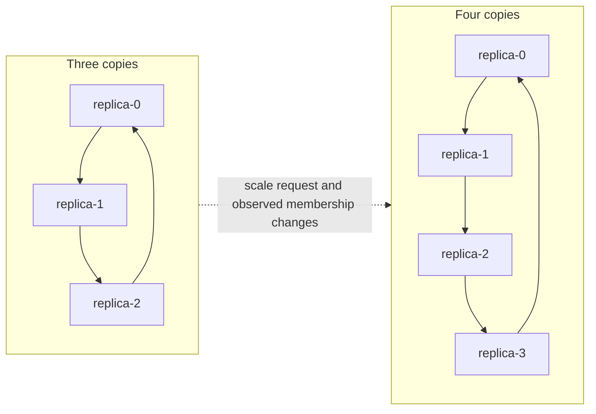
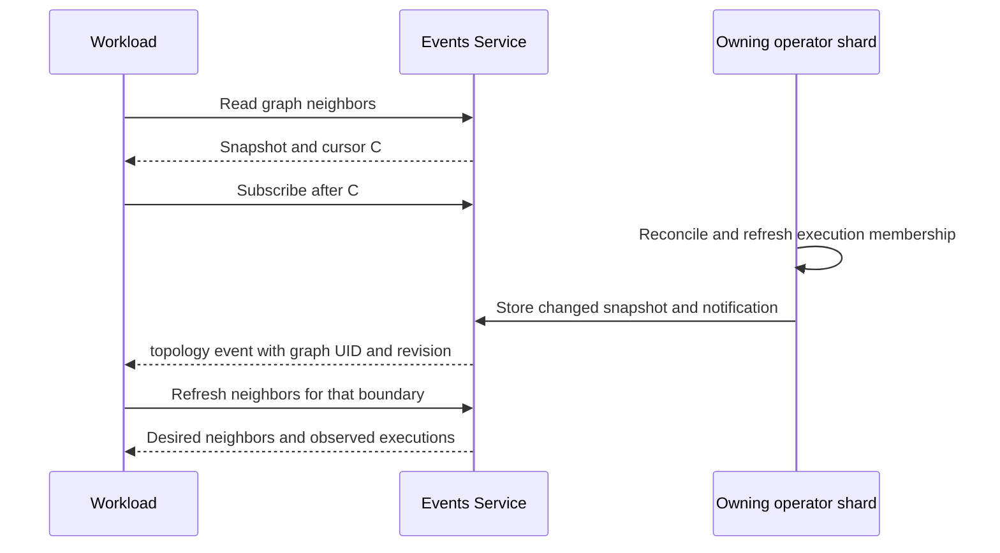

# Workload topology events

Workloads can discover graph neighbors and receive notifications when structure
or execution membership changes. **ReplicaGroup scaling counts as a topology
change**: it adds or removes vertices, and connected replication modes can change
existing copies' neighbors. Independent mode also changes its vertex set.

Enable `events.enabled`, provide the events bearer token through the workload's
own Secret, and permit traffic with the applicable NetworkPolicy and mesh rules.
`POLYAD_EVENTS_URL` is injected when the listener is enabled. Subscribers do not
need Kubernetes API credentials. See [event service setup](networking.md#event-subscriptions).

## Changes that notify workloads

An SSE `topology` event is published when the boundary's structural revision
changes. This includes:

- Adding or removing nodes, changing referenced definitions or lifecycle
  dependencies, and editing connections or their ports.
- Changing effective ReplicaGroup counts, including inherited shared-source
  counts, and connections generated by the selected connectivity mode.
- Executions appearing, starting termination, disappearing, or being replaced
  with a different UID. Activation executions retain their logical node and
  identify their separate runtime nodes.
- Changing a native Deployment or StatefulSet's requested replica count. This
  updates membership inside a vertex; individual Pods do not become graph vertices.
- Graph deletion beginning, graph incarnation replacement, or desired topology
  becoming invalid or unavailable.

Status heartbeats, resource-version increments, readiness changes and reordered
equivalent declarations do not change the structural revision. Ordinary `graph`
events continue to report lifecycle observations.

Scaling a directed Ring from three copies to four changes `replica-2`'s outgoing
neighbor from `replica-0` to `replica-3`:



Notifications follow owning-shard reconciliation and periodic rescans. They are
observations, not a synchronous barrier or a complete log of every intermediate
Kubernetes change. Several changes can be coalesced before an observation.
GraphRules control admission independently of event delivery.

## Proposed rollout events

The [rollout sparsity and events proposal](rollout-sparsity.md) adds a separate
`rollout` event type for queued, coalesced, deferred and executing changes, down
to individual workloads. Deferrals would report the limiting graph or workload
scope and earliest eligible time. These events and frequency settings are not
implemented yet. A delayed or suppressed rollout would not itself emit a topology
change; actual structural or execution-identity changes retain the behavior above.

## Read current neighbors

Use the events Service on port 8091:

```text
GET /v1/graphs/{kind}/{name}/topology
GET /v1/graphs/{kind}/{name}/topology?uid={graph-uid}&node={logical-node}
```

`kind` is Graph, PolyGraph or ReplicaGroup. Reads use the Service's namespace.
Pass the expected graph UID to detect object replacement. Omit `node` to read the
whole boundary, or pass `POLYAD_NODE_NAME` for the calling workload's local neighbors.

Every response includes:

| Field | Meaning |
| --- | --- |
| `graph` | Boundary kind, namespace, name and UID |
| `revision` | Digest of identity, declared structure and observed execution membership |
| `observedAt` | Publication time as Unix seconds |
| `cursor` | Stream position read atomically with the snapshot; use as `Last-Event-ID` |
| `valid` | Whether requested topology could be resolved and represented |
| `templateOnly` | Whether this is a reusable definition rather than an executable instance |
| `terminating` | Whether graph deletion has started |

Full snapshots contain `nodes` and `connections`. Nodes include their logical
`name`, declared `kind` and `ref` when present, `requires`, `desired`, and
`executions`. Execution entries contain resource kind, name, UID, runtime node and
`terminating`; Deployment and StatefulSet entries also include their requested
native `replicas` count. Workload templates, environment values, Pod specs and
credentials are excluded.

With `node`, the response contains `node`, `incoming`, `outgoing`, `dependencies`
and `dependents`. Directional neighbor entries include the peer node description
and destination port grants. Dependencies include the lifecycle `condition`.

Connections describe **desired** data flow. Execution lists describe resources
that actually exist, including retiring resources. A requested replica can have
`desired: true` and an empty execution list when admission is pending or blocked
by GraphRules. A removed vertex can remain `desired: false` until its execution
disappears. Neither presence nor a port declaration guarantees readiness or
reachability. Addresses and service discovery remain the application's
responsibility; snapshots do not expose Pod IPs or EndpointSlices.

## Subscribe from a workload

Configure the [Python client](../pkg/client/README.md) for the events Service:

```python
import os
from polyad_client import Client

events = Client(os.environ["POLYAD_EVENTS_URL"], os.environ["POLYAD_EVENTS_TOKEN"], timeout=60)
identity = {
    "kind": os.environ["POLYAD_GRAPH_KIND"],
    "graph": os.environ["POLYAD_GRAPH_NAME"],
    "graph_uid": os.environ["POLYAD_GRAPH_UID"],
    "node": os.environ["POLYAD_NODE_NAME"],
}
view = events.topology(**identity)
if not view["valid"]:
    raise RuntimeError("Graph topology is unavailable")
print("Current outgoing neighbors:", view["outgoing"])
cursor = view["cursor"]

for event in events.events(last_event_id=cursor):
    if event.event in {"reset", "unavailable"}:
        break  # Recover as described below before opening another stream.
    if event.event == "topology" and event.data["uid"] == identity["graph_uid"]:
        view = events.topology(**identity)
        if not view["valid"]:
            raise RuntimeError("Graph topology became unavailable")
        print("Updated outgoing neighbors:", view["outgoing"])
    cursor = event.id  # Persist after processing, including unrelated namespace events.
```

Read a snapshot first, then subscribe from its cursor. Snapshot updates and their
notifications are stored atomically, so changes between the read and subscription
remain replayable. A notification contains graph identity, `revision`, node and
connection counts, `valid`, and the snapshot path. Read the snapshot to obtain
neighbors; it may already contain a later revision than the notification being
processed. Notifications stay small even for dense graphs.

Filter the namespace stream by graph UID. Do not deduplicate topology events using
resource versions: inherited counts and execution membership can change before
the containing graph receives another resource version. Process events in stream
order and persist the SSE ID after handling each event. Compare the latest
snapshot revision with the revision last applied by the application; the same
structure can recur after intervening changes.

After a disconnect, timeout or `unavailable`, reconnect using the last processed
cursor. On `reset` or HTTP 410, obtain a fresh snapshot and its cursor. HTTP 409
means the graph UID changed. HTTP 404 means the snapshot or selected node is
absent; check a removed node through a full boundary snapshot. HTTP 503 means the
cache or observation is unavailable, or the selection is too large. Retry without
substituting an empty neighbor set. Observations expire after 30 seconds without
refresh. Cache failover or bounded snapshot eviction can require waiting for the
owning shard to republish.

Snapshots and selections are limited to 4 MiB. An oversized full snapshot is
published with `valid: false` and an `error`, rather than partial neighbors. An
oversized node selection returns HTTP 503. No subscription automatically changes
application connections or restarts containers.

## Nested graphs

Each Graph, PolyGraph and ReplicaGroup publishes its own boundary. Internal
changes notify that boundary; the containing PolyGraph's vertices remain child
graph instances. The API does not flatten every descendant into a single graph.

Use `POLYAD_GRAPH_ANCESTRY` to watch ancestors whose relationships matter to the
application. In an ancestor's full snapshot, find the node whose `executions`
contains the next descendant graph UID in that ancestry list. Pass that branch's
name as `node` to read the ancestor's neighbors. Those peers are graph instances
with their own snapshot endpoints.


