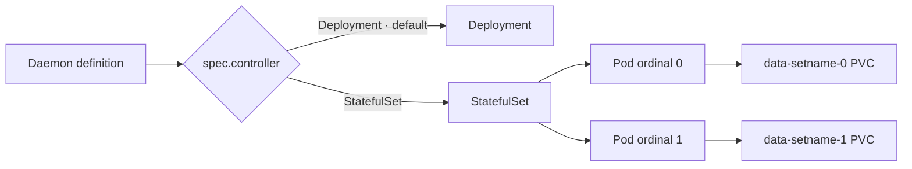

# Workload controllers and storage

A `Daemon` can execute as a Kubernetes Deployment or StatefulSet. Choose
`spec.controller: StatefulSet` when its Pods need stable identities and separate
persistent claims. Deployment remains the default. Finite `Workload` definitions
execute as Jobs and can mount persistent storage too.



## StatefulSet configuration

```yaml
apiVersion: polyad.astrivant.com/v1alpha1
kind: Daemon
metadata:
  name: database
spec:
  controller: StatefulSet
  replicas: 2
  statefulSet:
    serviceName: database-peers
    podManagementPolicy: OrderedReady
    persistentVolumeClaimRetentionPolicy:
      whenDeleted: Retain
      whenScaled: Retain
    volumeClaimTemplates:
      - metadata:
          name: data
        spec:
          storageClassName: durable-ssd
          accessModes: [ReadWriteOnce]
          resources:
            requests:
              storage: 10Gi
  template:
    metadata:
      labels:
        app: database
    spec:
      containers:
        - name: database
          image: your-database-image
          volumeMounts:
            - name: data
              mountPath: /var/lib/database
          startupProbe:
            tcpSocket: {port: 5432}
            failureThreshold: 30
            periodSeconds: 10
          readinessProbe:
            tcpSocket: {port: 5432}
          livenessProbe:
            tcpSocket: {port: 5432}
```

Define a governing headless Service with a selector matching application labels
on `spec.template.metadata.labels`. Polyad does not create that Service
implicitly. A graph-owned Service can be a `Resource` node; set
`statefulSet.serviceName: "${nodes.discovery.name}"` and make the Daemon depend
on that node's `started` or `ready` condition. An existing Service name also
works. The [complete example](../examples/stateful-service.yaml) connects these
resources and writes a startup record to each replica's volume.

| Field under `Daemon.spec` | Contract |
| --- | --- |
| `controller` | `Deployment` (default) or `StatefulSet` |
| `replicas` | Positive native Pod count per execution; default `1`. Use a ReplicaGroup for graph-aware autoscaling. |
| `template` | Native Pod template; containers require startup, readiness and liveness probes |
| `statefulSet.serviceName` | Required with StatefulSet; resolved name must be a DNS label |
| `statefulSet.volumeClaimTemplates` | Native PVC template array, default empty; each item has `metadata.name` and `spec`. Names must be unique and cannot shadow explicit Pod volumes. |
| `statefulSet.podManagementPolicy` | `OrderedReady` (default) or `Parallel` |
| `statefulSet.updateStrategy` | Native `RollingUpdate` (default) or `OnDelete`; rolling settings support a nonnegative `partition` and native `maxUnavailable` |
| `statefulSet.persistentVolumeClaimRetentionPolicy` | `whenDeleted` and `whenScaled`, each `Retain` (default) or `Delete` |
| `statefulSet.minReadySeconds` | Nonnegative minimum availability interval; default `0` |
| `statefulSet.revisionHistoryLimit` | Nonnegative controller revision limit; default `10` |
| `statefulSet.ordinals.start` | Optional nonnegative first Pod ordinal; Kubernetes defaults to `0` |

`statefulSet` options require `controller: StatefulSet`. Polyad owns the native
controller's name, selector, owner references and Pod identity labels. The
compiler carries claim metadata and PVC specifications through, including
`storageClassName`, `accessModes`, requested capacity, `volumeMode`, selectors,
and snapshot or PVC data sources. Kubernetes validates native field support and
storage provisioner capabilities; optional rollout fields require support in
your cluster. StorageClasses and data sources must already exist.

Readiness waits for current-generation status, the desired replica count and
ready Pods. With `minReadySeconds`, available replicas must also reach the desired
count. Rolling updates must reach the required updated count, accounting for the
partition; `OnDelete` permits ready Pods from the previous revision. These
observations feed dependency admission, graph status and ReplicaGroup readiness.

## Three storage paths

| Configuration | Appropriate use | Claim lifecycle |
| --- | --- | --- |
| `spec.persistence` on Workload or Daemon | Mount one existing PVC into all application and init containers | External claim remains outside graph cleanup |
| `spec.template.spec.volumes`, container `volumeMounts` / `volumeDevices` | Native configuration for multiple PVCs, transient volumes, secrets or block devices | Determined by each volume source; externally supplied PVCs are not adopted |
| `spec.statefulSet.volumeClaimTemplates` | Provision separate PVCs for each StatefulSet Pod | Native StatefulSet retention policy |

The existing PVC convenience configuration is:

```yaml
spec:
  persistence:
    enabled: true
    storageClass: durable-ssd
    claimName: application-data
    mountPath: /var/lib/application
```

Polyad checks the named claim in the same namespace, verifies its StorageClass,
and injects a `polyad-persistence` volume and mount. Missing claims defer
admission; class mismatches fail validation. This convenience path works with
Jobs, Deployments and StatefulSets. It can coexist with differently named native
volumes and claim templates. Its claim is shared by all replicas, so its access
modes and topology must support that usage.

With native Pod volumes, supply the matching mounts or block devices yourself.
Polyad preserves those fields; Kubernetes performs their storage validation and
binding. A graph-owned PVC `Resource` can be referenced with
`claimName: "${nodes.storage.name}"`. For `WaitForFirstConsumer`, depend on
`started` so the consuming Pod can cause binding. An owned PVC is deleted during
graph cleanup; use an external PVC for data that must outlive that graph.

Graphs and PolyGraphs leave storage policy to users, including when
placement selects interruptible nodes. Storage persists files; the application still needs to flush
and restore its own state.

## Retention and revisions

Kubernetes names each generated claim `<template>-<statefulset>-<ordinal>`.
The default `Retain` policy preserves these claims after deleting the set or
reducing native replicas. Explicit `Delete` selects Kubernetes' corresponding
claim cleanup behavior. A retained claim with the same name can be reused when
the set is recreated. See [Kubernetes StatefulSet storage and retention](https://kubernetes.io/docs/concepts/workloads/controllers/statefulset/).

Polyad's existing revision handling drains and replaces changed execution
resources; it does not patch a changed Daemon definition into an existing native
controller. `updateStrategy` is passed to the native set but does not change
that graph replacement behavior. Choose retention with this in mind:
`whenDeleted: Delete` can delete data during suspension, graph cleanup or
replacement, even if `whenScaled` is `Retain`. Retained claims keep their
previous configuration; changing a claim template is not a PVC resize or data
migration operation.

Within the same graph UID and node name, generated controller names remain
stable. A new graph incarnation or activation receipt creates a different
execution identity and therefore different claim names. Retained claims from
those older executions need an explicit application or administrator retention
and recovery process.

## Replication, rules and capacity

A ReplicaGroup of StatefulSet Daemons creates one set per group ordinal. Each
set retains its own Pod replica count and claim templates. Scaling the group
in deletes whole sets, so `whenDeleted` controls their claim retention.
`whenScaled` applies to reductions inside a native set. Activation pulses also
create separate sets with disjoint selectors and claim identities;
`replicasPerActivation` determines each pulse's Pod count.

Point KEDA at the ReplicaGroup scale subresource. StatefulSet execution follows
the same live ancestor GraphRule checks, including Cheeger bounds, as Deployment
execution. Rules count graph vertices and expanded occurrences; native Pod and
PVC counts inside one vertex do not add graph vertices. Direct autoscaling of
the generated native controller bypasses those graph checks. See
[constraints before scaling](replication.md#constraints-before-scaling).

Advance capacity planning supports StatefulSets with explicit Pod volumes,
subject to the selected [backend limitations](capacity.md). It
currently rejects a graph capacity plan combined with per-replica
`volumeClaimTemplates`: one shared forecast Pod template cannot represent each
ordinal's distinct claim. Use ordinary Kubernetes scheduling for that combination
by omitting `spec.capacity` on the executing boundary.

Composition requests carry this same Daemon `spec` unchanged. Native StatefulSets
and their Pod templates include the usual request, definition and node audit
metadata, and graph resource counts include `StatefulSet`.
