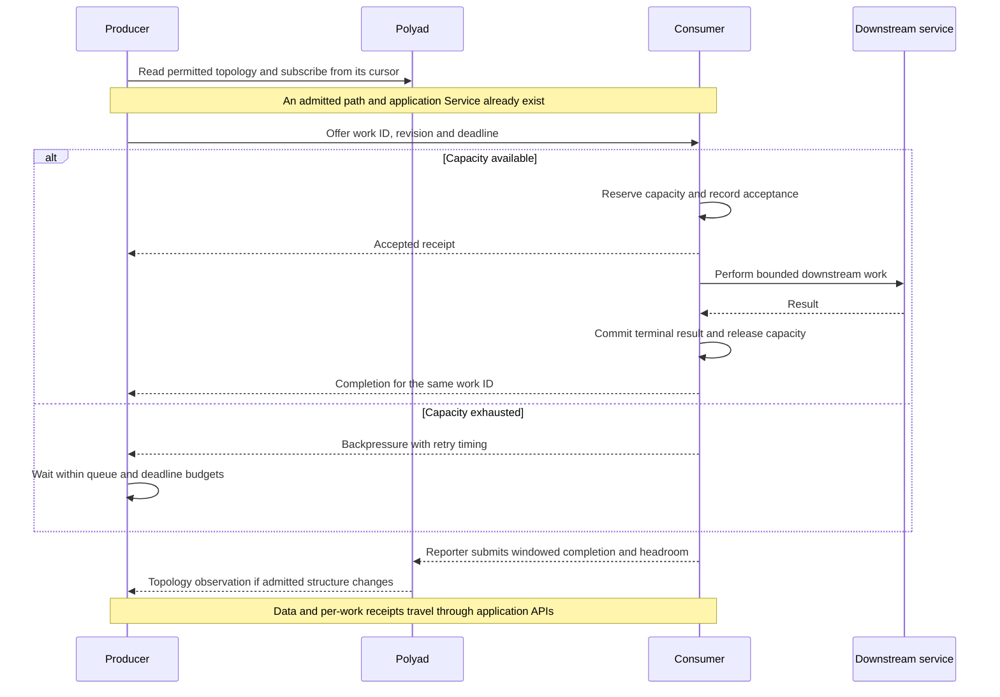
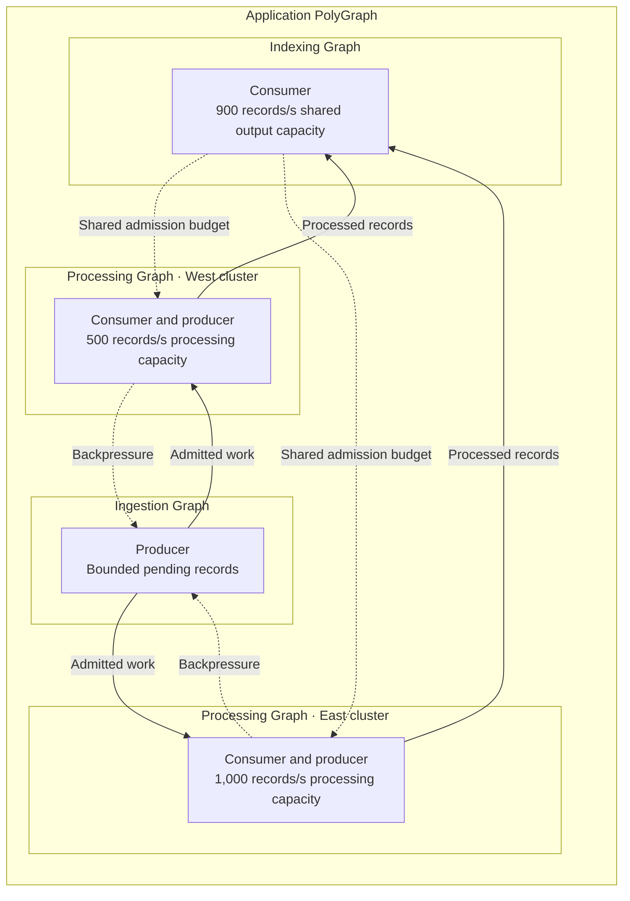

# Service Symbiosis: writing adaptive microservices

**Service Symbiosis** is Polyad's approach to building microservices that discover
compatible peers and adapt their relationships and work together within Graphs
and PolyGraphs. Services can perform different jobs: an ingester, an enrichment
service and an indexer cooperate through compatible work contracts, shared
capacity information and backpressure.

A participating service discovers permitted neighbors, reacts to connection and
capacity deltas, admits work within its budget and reports useful completion.
When a needed relationship is absent, it can request a temporary connection and
negotiate consent with its peer. This is how an additional graph connection
becomes a usable processing path.

For application engineers, **filling available capacity** means directing work
toward compatible, authorized consumers that can process it while meeting the
application's latency, correctness and resource budgets. A free CPU, a new Pod
or a newly declared edge is one observation; usable capacity also depends on
readiness, data ownership and downstream services. Keep enough headroom for
bursts, recovery and changes in the cost of individual requests.

The two interacting roles are **producers**, which offer work, and **consumers**,
which accept and complete it. A service can perform both roles: an enrichment
service consumes raw records and produces enriched records for an indexer.

The [Python SDK](../../pkg/polyad-sdk/README.md) supplies a delta-first
`AdaptiveService` abstract base class alongside discovery, subscriptions, connection
negotiation and throughput reporting. The SDK exposes Service Symbiosis to
application code; [Soul searching](../graphs/soul-searching.md) uses the reported
demand to adapt permitted graph structure and traffic. Polyad checks current
GraphRules and permissions before admitting changes. This guide defines the
application contract and [shows how to connect it to the SDK](#use-the-python-sdk).

## Table of contents

- [Who controls what](#who-controls-what)
- [Producers and consumers](#producers-and-consumers)
- [Cooperate across Graphs and PolyGraphs](#cooperate-across-graphs-and-polygraphs)
- [Define the work contract](#define-the-work-contract)
- [Define the adaptation envelope](#define-the-adaptation-envelope)
- [Discover neighbors and react to change](#discover-neighbors-and-react-to-change)
- [Distribute work within available capacity](#distribute-work-within-available-capacity)
- [Report useful work and headroom](#report-useful-work-and-headroom)
- [Negotiate connections and drain work](#negotiate-connections-and-drain-work)
- [Use the Python SDK](#use-the-python-sdk)
- [Run a local process tree](#run-a-local-process-tree)
- [Exercise the contract under load](#exercise-the-contract-under-load)

## Who controls what

| Participant | Responsibility |
| --- | --- |
| Administrator and GraphRules | Permitted graph structure, network relationships, credentials and resource ceilings |
| Soul searching | Select approved layouts, traffic splits and capacity preparation from measured demand |
| KEDA/HPA | Request replica counts for their configured scaling targets |
| Polyad reconciliation | Check current rules and identities before admitting graph-managed changes |
| Istio, when configured | Route requests through the application's declared Service using approved percentages |
| Application producer | Offer identifiable work, respect receiver admission and choose among eligible targets when it owns routing |
| Application consumer | Enforce local admission, preserve work semantics and report completion and sustainable spare capacity |

Services operate inside the topology and budgets they are given. A service can
request a [temporary connection](../apis/temporary-connections.md), but admission
and peer consent determine whether that path becomes available. Event filters
select observations already permitted by the application's credentials.

## Producers and consumers

The interaction needs agreement about both **work** and **capacity**:

| Situation | Producer behavior | Consumer behavior |
| --- | --- | --- |
| Work becomes available | Assign a stable work identity, input revision and deadline; choose an eligible consumer or wait in a bounded queue | Advertise its supported work contract and enforce current admission limits |
| Consumer accepts | Record who accepted the work; retain enough information to recover an uncertain response | For asynchronous work, acknowledge acceptance after durably recording responsibility for it |
| Consumer is full | Respect backpressure and retry timing; use another permitted destination only when work semantics and routing ownership allow it | Refuse new work with a bounded retry hint, or reduce pulls from the producer |
| Processing succeeds | Observe the agreed terminal result; release retained delivery state | Commit the result before acknowledging completion; count the work once |
| A reply is lost | Query or retry the same work identity with the same content | Return the existing receipt/result or continue the existing execution according to the idempotency contract |
| Topology changes | Refresh eligibility for future assignments; retain ownership of already accepted work | Stop new admission when draining and settle accepted work within its deadline |

For synchronous requests, a successful response can acknowledge completion
without a separate acceptance response. For asynchronous work, acceptance and
completion are separate milestones. A published batch has completed only when
its application-defined outcome is durable, such as records becoming queryable.
Merely putting it in another queue does not complete that outcome.

Producers can push bounded requests, or consumers can pull when they have room.
An application may also define **credits**, where one credit reserves permission
to submit a specified amount of work. Credits are an application data protocol;
Polyad's existing APIs do not exchange them. Define their unit, consumer
execution identity, expiry and consumption rules. Reserve them atomically across
all producers so two callers cannot each spend the same free capacity. Expired,
unspent credits can be reclaimed; capacity occupied by accepted work stays
accounted for until that work finishes or is safely handed off.



An intermediate service must apply both sides of this contract. If enrichment
runs at 2,000 records/s but indexing can sustain only 800, enrichment bounds its
output queue and reduces upstream admission. An additional enrichment replica
helps only when it can use additional downstream capacity or a different
approved path.

## Cooperate across Graphs and PolyGraphs

Treat each graph boundary as a service contract. A Graph consumes work through
its declared entrypoints, coordinates its internal stages and produces an
agreed outcome. A PolyGraph composes those contracts across child graphs and
clusters. A service needs the permitted identities and contracts of its peers;
it does not need visibility into every implementation detail of their children.

For example, an ingestion Graph produces records for two processing Graphs in
different clusters. Both processing Graphs produce results for a shared indexing
Graph. All four belong to one application PolyGraph:



Solid arrows show application work over configured, admitted paths; dotted
arrows show application capacity coordination. They describe separate work and
capacity messages, not additional Polyad connections. The contracts must permit
the needed response traffic. Cross-cluster discovery and transport require the
[registered peers, access modes and mesh configuration](../apis/discovery.md#negotiate-across-graph-and-cluster-boundaries).

Assuming one input produces one indexed output and the same workload mix, the
processing pair can handle 1,500 records/s but the shared output limits completed
work to at most 900 records/s. The two processors must share that 900-record
budget. Each must not advertise it as exclusively available to itself. At an
offered rate of 1,200 records/s, ingestion slows admission, retains a bounded
backlog or rejects excess work according to its contract. More processing
replicas become useful when indexing capacity also grows or an approved
alternative output becomes available.

Write cooperation at three levels:

| Boundary | What cooperating services exchange | What the application measures |
| --- | --- | --- |
| Inside a Graph | Work identities, receipts, deadlines, partition ownership and immediate backpressure between adjacent stages | Stage queues and latency for diagnosis; entry-to-outcome rates for that Graph's report |
| Between child Graphs in a PolyGraph | Compatible entrypoint contracts, graph-level admission budgets and durable completion/handoff receipts | Useful completed work and sustainable capacity for each whole child pipeline |
| Across nested PolyGraphs | The same boundary contract, with explicit units and input-to-output conversion when work changes shape | Parent-level outcomes and shared constraints, assembled by its authorized reporter |

Capacities of independent parallel branches can add. Serial stages and shared
dependencies constrain the whole path. If one input expands into ten outputs,
convert units before comparing their rates or propagating an admission budget.
Cheeger values are computed separately at the configured boundaries; these
application capacity calculations do not combine child Cheeger values into a
parent Cheeger value. See [nested graph computations](../graphs/cheeger-orchestration.md).

Use the [Python SDK](../../pkg/polyad-sdk/README.md#adaptive-services-and-deltas)
to implement the Service Symbiosis loop:

| Step | SDK capability | Application responsibility |
| --- | --- | --- |
| Find eligible peers | `Client.discover()` or bounded `Client.services()` traversal; `AdaptiveService.view` for observed neighbors | Match work contracts, resolve declared entrypoints and keep selection inside active permissions |
| React to observations | Compose [adaptation strategies](adaptation-strategies.md) for constraints; implement `AdaptiveService.adapt()` and add filtered observers with `on_change()` | Refresh routing, wake a scheduler or begin a drain; keep business work off the event callback thread |
| Ask for a missing path | `AdaptiveService.connect()`; the peer calls `respond()` | Check compatibility and policy, wait for Active, then verify usable transport |
| Exchange work and capacity | The application's HTTP, RPC or queue transport | Enforce shared admission, acknowledgements, idempotency and backpressure |
| Inform graph adaptation | An authorized reporter calls `report_throughput()` | Aggregate comparable measurements and report sustainable whole-path headroom |

Use separate credentials and clients for the API, events and connections
Services as described in the [SDK guide](../../pkg/polyad-sdk/README.md). Each
service subscribes only to its permitted graph trees; peers exchange required
business receipts through their application protocol. A parent reporter obtains
aggregate measurements through an explicitly authorized application path. Event
subscriptions do not broadcast application payloads or grant access to siblings.

Keep immediate admission local and fast. Feed sustained observations into Soul
searching's configured sample windows and cooldowns. Do not propose a topology
change for every refused request. Carry the original work identity, remaining
deadline and retry budget through downstream calls so one retry does not create
an independent retry storm at every stage. During a partition, bounded admission
and durable recovery remain the responsibility of each participating service.

## Define the work contract

Specify these application fields before changing routing or replica counts:

- **Identity and revision:** the work ID, immutable input version and meaning of
  a duplicate. Changed input is a new version, with an explicit new identity.
- **Compatibility:** operation name, payload/result schema versions and supported
  capabilities. Define these in the application API; the current discovery
  directory supplies graph identities, not a capability-negotiation protocol.
- **Partitioning and ordering:** whether work can run anywhere, must retain key
  affinity, or depends on a preceding result. Stateful ownership changes require
  a fenced handoff or checkpoint before another consumer takes over.
- **Completion and durability:** the commit point, receipt lookup and recovery
  behavior after crashes. Retries use stable identities; durable deduplication
belongs with the application's side effects.
- **Budgets:** deadlines, payload/queue byte limits, queue length, concurrency,
  request rate, maximum attempts and drain time. Bound both work count and bytes
  when requests can differ greatly in size.

Increasing connectivity gives independent work more routing options. It cannot
make ordered writes independent or turn a required processing stage into an
optional one. A connection to a Graph or PolyGraph targets that composition's
application entrypoint; its children still own their processing and state.

A timeout leaves acceptance uncertain. Before moving that work to another
consumer, resolve its receipt or use a shared deduplication/ownership protocol
that fences the first execution. A receipt store local to one consumer does not
prevent a different consumer from repeating the same external side effect.

## Define the adaptation envelope

An **adaptation envelope** is the range of operating conditions an application
can accommodate, starting from a specified state, within a specified time and
without violating its hard constraints. It describes the combined capability of
the services, their SDK strategies and Polyad to keep the application useful as
demand, available peers and requirements change.

The envelope belongs to the boundary being measured: one service, a Graph or a
PolyGraph. Measure the required outcome at that boundary. Two services that each
adapt successfully can still overload a shared database or fail to complete the
parent graph's work. See [cooperation across graph boundaries](#cooperate-across-graphs-and-polygraphs).

The [work contract](#define-the-work-contract) defines what accepting and
completing a job means. An **operating contract** adds the conditions under which
the application must deliver those results. For example:

> Starting with a healthy application serving 3,000 records per second, handle
> an increase to 12,000 records per second within 20 seconds. After that deadline,
> sustain that completion rate and p95 latency below 250 ms for five minutes.
> Throughout the transition, lose no accepted records and use at most 16 CPUs,
> including replacement processes. Keep queues bounded and obey the configured
> GraphRules and permissions.

Record the workload mix, record sizes, burst duration, initial queues and ready
capacity as part of the scenario. Specify how the application handles work
during those first 20 seconds, including permitted backpressure, rejection and
queue limits. Hard constraints apply throughout; a recovery deadline applies
only to the objectives the contract explicitly allows time to regain.

**A transition is part of the capability.** An old composition and its replacement
may each fit within 16 CPUs while their rollout overlap exceeds that limit.
Readiness, connection consent, state transfer and draining also take time and
resources. Test sequences such as a burst followed by a consumer failure and
recovery: the state left by one adjustment affects which changes are possible
next. Remaining inside the envelope requires an allowed path to the next useful
state as well as enough steady-state capacity there.

Measure the envelope with a versioned set of scenarios:

| Measure | What to record |
| --- | --- |
| Contract coverage | Which combinations of demand, required results, failures and budgets the application satisfies |
| Adaptation time | Time from the scenario change through observation, planning, admission, execution and stable recovery |
| Transition cost | Extra CPU and memory, backlog, retries and permitted service degradation while changing |
| Stability | Whether the application sustains the required behavior or repeatedly reverses its adjustments |
| Remaining headroom | Additional demand it can accommodate while continuing to satisfy the contract |

A study can summarize coverage at a deadline `T` as:

```text
A(T) = sum(weight[i] * success[i, T]) / sum(weight[i])
```

Use a nonempty scenario set with positive weights that express operational
importance. `success[i, T]` is `1` when scenario `i` reaches its required behavior
within both `T` and its contract's deadline, sustains that behavior for the
specified duration and respects every hard constraint throughout the run;
otherwise it is `0`. Publish the individual failures alongside the score,
including cases where no allowed composition fits the budget. Evaluate several
values of `T` to show how coverage grows with available preparation or recovery
time. Keep starting states, resource budgets, scenario versions and weights
fixed when comparing implementations. Repeat runs to expose timing variability.
This coverage score is a study definition; the operator does not currently export
it. The [reachability guide](reachability.md) defines viability and constrained
reachability alongside the envelope, and supplies SDK queue models and a runtime
guard. The [local studies](../../studies/README.md) measure interaction effects,
state-variable choices and actual producer-consumer rerouting.

Timing also guides preparation. If measured adaptation takes 20 seconds but the
current workload is expected to exhaust usable headroom in 12 seconds, that
adjustment cannot complete in time from the current state. Start preparation
earlier when a demand signal permits it, retain more ready capacity, or invoke
the contract's permitted backpressure or admission response. Use measured timing
variation and forecast uncertainty when choosing that margin. The
[load-profile guide](../graphs/load-profiles.md) describes existing bounded
preparation controls.

In the proposed [Natural Selection planner](../proposals/copolyad.md), operating
contracts would guide composition selection. Natural Selection owns the admitted
composition and can replace conflicting Soul searching choices; Soul searching
and application strategies adapt within that plan's delegated choices. Polyad
continues enforcing administrator limits and permissions. The current
[`nature.py` example](local-natural-selection.md) selects capabilities against
predefined requirements and exercises them with synthetic traffic. Generating
new scenarios from observations or forecasts would extend that foundation.
Keep a stable evaluation suite alongside generated scenarios so an improved score
means greater capability under the same requirements.

Cheeger bounds describe structural requirements within the operating contract.
Completion, latency and resource measurements establish whether the application
uses those paths successfully. Adding a connection enlarges the measured
adaptation envelope only when it enables the application to satisfy an additional
condition or transition within the declared limits. See
[Soul searching and the two Cheeger bounds](../graphs/soul-searching.md) and
[the load experiments below](#exercise-the-contract-under-load).

## Discover neighbors and react to change

Use the injected [workload identity](workload-environment.md), an authorized
credential for the events Service and the
[topology snapshot and replay contract](workload-events.md#read-current-neighbors):

A **snapshot** records the known state of this service's surroundings when that
view is built. Use it to choose candidate consumers and compare later changes.
The [SDK snapshot guide](../../pkg/polyad-sdk/README.md#snapshots-and-permission-to-act)
explains its contents, freshness and the permissions and readiness checks needed
before acting.

1. Read the current snapshot for the expected graph UID and logical node.
2. Establish which outgoing paths have existing executions and are eligible for
   this work contract. Resolve actual addresses through application configuration
   or declared Kubernetes Services, and verify readiness using the application's
   protocol. Topology snapshots do not provide Pod IPs or prove readiness.
3. Subscribe from the snapshot's cursor. On relevant topology events, refresh
   the snapshot and atomically replace the routing view after validation.
4. Persist the stream checkpoint after successful handling. Recover a reset or
   expired cursor by obtaining a new snapshot and cursor; a changed graph UID
   requires rebinding to the intended graph incarnation.

The existing client can drive the observation hook:

```python
import os

from polyad_sdk import Client
from polyad_sdk.events.filters import event_type, field


def watch_neighbors(app):
    events = Client(
        os.environ["POLYAD_EVENTS_URL"],
        os.environ["POLYAD_EVENTS_TOKEN"],
        timeout=60,
    )
    identity = {
        "kind": os.environ["POLYAD_GRAPH_KIND"],
        "graph": os.environ["POLYAD_GRAPH_NAME"],
        "graph_uid": os.environ["POLYAD_GRAPH_UID"],
        "node": os.environ["POLYAD_NODE_NAME"],
    }

    def refresh(_event=None):
        view = events.topology(**identity)
        if not view["valid"] or view["terminating"]:
            raise RuntimeError("Graph cannot admit new routing assignments")
        app.install_topology(view)
        return view

    view = refresh()
    subscription = events.subscribe(cursor=view["cursor"])
    subscription.on(
        event_type("topology") & field("uid", equals=identity["graph_uid"]),
        refresh,
    )
    subscription.run()
```

Here `app.install_topology` is an application-owned callback. It installs the
validated metadata view and removes ineligible destinations from new
assignments. Supervise `watch_neighbors` in the application's chosen thread,
make callbacks short, and implement durable checkpointing and recovery as
specified in the [subscription guide](../apis/discovery.md#subscribe-with-filters-and-hooks).
This fragment demonstrates the hook; it leaves those application lifecycle
operations to its caller. WebSocket transport and optional subscription
rebalancing use the same event contract.

Treat observations as inputs to eligibility. `desired: true` with no execution
means capacity is still pending. A retiring execution can remain visible while
it drains. Fresh graph lifecycle observations or application probes are needed
for readiness changes, which do not themselves produce topology revisions.
A traffic-percentage adjustment also keeps the same neighbors; Istio can apply
it while the application retains its existing Service address.

On lost observations, bound the lifetime of the cached view and stop assigning
new work to unverifiable destinations. Preserve already accepted work and its
receipts. An unavailable directory is not evidence that every peer was deleted.
See [atlas discovery](../apis/discovery.md) for permitted traversal across graph
and cluster boundaries and separate cursors for remote streams.

## Distribute work within available capacity

Keep three independent limits visible: how much work can wait, how much can
execute concurrently, and how quickly new work may be admitted. All must fit
local resources and the budgets of downstream dependencies. Advertised capacity
is a planning input; the consumer still checks each acceptance atomically.

Define fairness when producers compete: per-tenant quotas, priorities or reserved
shares of a common budget. Randomize bounded retry timing and reserve capacity
before treating it as owned; otherwise every producer can rush toward the same
apparently idle consumer after one observation. Release unused reservations and
carry accepted work in the accounting until its ownership is settled.

For example, two consumers have calibrated sustainable capacities of 500 and
1,000 records/s. At 1,200 incoming records/s, an approximately 33/67 split sends
about 400 and 800 records/s to them. A 50/50 split would overload the first
consumer even though the pair has enough total capacity. Backpressure bounds
the immediate overload while a routing change takes effect.

Assign one owner to each routing decision:

| Routing arrangement | Application behavior |
| --- | --- |
| Polyad-managed Istio percentages | Producer calls the declared shared Service. Soul searching adjusts approved destination weights; the application honors those routes and receiver backpressure. |
| Application-managed peer selection | Producer selects from admitted, ready, compatible peers using its declared scheduling policy, such as available credits or partition affinity. Any SDK router follows those application rules. |
| Consumer pull | Consumers request more work only as admission slots become available; the producer retains its own bounded backlog and ownership records. |

Direct peer selection must not bypass a mesh-managed percentage policy by
sending requests to arbitrary Pod IPs. Application data routing is also separate
from the client's [operator event-endpoint rebalancing](../operations/event-rebalancing.md).
Both can exist in one service, with different destinations and ownership.

## Report useful work and headroom

[Soul searching](../graphs/soul-searching.md) relates application demand to
approved Cheeger targets, layouts and traffic distributions. It needs comparable
measurements from the application:

| Measurement | Application contract |
| --- | --- |
| `offeredPerSecond` | Unique work offered at the measured graph's entry boundary, including demand it could not immediately accept |
| `completedPerSecond` | Unique successful outcomes completed at that graph's output boundary during the same window |
| Named demand signal | Exact configured name and unit, such as `queueDepth` in `jobs`; use the backlog of the declared boundary |
| Per-target `TrafficSample` | Completion rate and additional sustainable `headroomPerSecond` for the configured route target's execution UID and generation |

Count attempts, retries and intermediate handoffs separately from useful
completion. A five-stage pipeline does not complete five records each time one
record passes through all stages. During backlog recovery, completion can exceed
newly offered work; preserve the actual rates. Use one authoritative aggregate
reporter per Graph or PolyGraph and synchronize measurement windows across its
destinations. Per-Pod reporters supply that aggregator rather than overwriting
one another's graph report.

Estimate headroom from load-tested capacity while retaining the application's
latency/error budget and capacity to drain existing queues. Consider processing,
I/O and shared downstream limits. Idle CPU alone is insufficient evidence of
spare end-to-end throughput. A whole graph replica reports the capacity of its
pipeline, including its tightest required stage. When a destination's capacity
cannot be measured reliably, withhold that destination's traffic measurement
and expose the failure in application telemetry. An incomplete traffic sample
blocks Headroom adaptation with `WaitingForTrafficSample`; there is no
unavailable flag to place in a numeric field. Zero headroom means a known absence
of spare capacity.

In [Headroom mode](../graphs/traffic-balancing.md#report-per-replica-measurements),
Polyad uses completed rate plus headroom to select bounded percentages. For
example, completion/headroom pairs of `400/100` and `400/600` imply capacities
of 500 and 1,000 records/s. New UID/generation observations, warm-up and workload
mix changes require fresh evidence. Keep measurements attached to the actual
execution, and begin a new window after a relevant revision changes.

Larger Cheeger values can supply useful alternative paths, while the application
must demonstrate the resulting throughput. If capacity is already sufficient,
routing may improve results with the same edges and Cheeger value. Adding edges
cannot enlarge a shared database's write capacity. Benchmark the proposed
layout with the real partitioning and completion contract before enabling Adapt.

## Negotiate connections and drain work

When the needed path is absent, discover the exact peer identities, subscribe
to the relevant event streams and request an explicitly scoped temporary
connection. The verified requester supplies consent for its own endpoint; the
other endpoint makes an explicit application decision. A third-party request
needs both endpoints' consent. Wait for an Active receipt and usable application
transport before assigning work over the new path.

A connection approval permits communication for its scope and lifetime. Each
consumer still enforces its work-admission budget. Check operation compatibility,
identity, tenant policy and capacity in the application's consent handler;
keep operator discovery grants and application-data credentials distinct.
Cross-cluster requests must satisfy the ceilings of both operator paths. See
[connection negotiation](../apis/discovery.md#negotiate-across-graph-and-cluster-boundaries).

On scale-down, removal or approaching expiry, stop new assignments to that
endpoint, stop admission when draining, finish or explicitly checkpoint accepted
work, and release application connections. Apply a drain deadline; unresolved
work remains in the durable recovery contract. If work needs longer, request a
new connection early enough for consent and admission before the old grant
expires. Replaying the old request ID does not extend its original deadline.
A socket that remains open is not permission to continue after a grant expires.

## Use the Python SDK

Install `polyad-sdk` independently of the operator. It contains both `Client` for
API calls and the `AdaptiveService` ABC for an immutable application view with
deltas. Subclasses implement `adapt(change)`; injected strategies run first,
followed by that method, optional hooks and checkpointing. See the [SDK guide](../../pkg/polyad-sdk/README.md#adaptive-services-and-deltas)
for installation, credentials, tuning and recovery.

**Deltas tell applications what to adjust.** An added consumer invites readiness
and compatibility checks before offering it work. A removed consumer stops new
assignments while accepted work drains or recovers. Reduced replica capacity can
reduce a producer's outstanding work budget; a traffic-weight change tells it to
observe the new mesh distribution. Measurements and decisions arrive with their
previous values, current values and numeric differences where meaningful.

The first observation is a baseline. Unknown throughput is not zero throughput;
missing observations and a replay gap require fresh context. An SDK change always
includes `before` and `after` views so handlers can interpret a delta against the
current graph, unit, decision phase and resource incarnation.

This factory binds the application's routing and admission functions to a
concrete SDK subclass:

```python
from collections.abc import Callable

from polyad_sdk import AdaptiveService, Change, Environment, ObserveStrategy, Settings


def cooperative_service(
    update_candidates: Callable[[Environment], None],
    pause_assignments: Callable[[], None],
) -> AdaptiveService:
    class CooperativeService(AdaptiveService):
        def adapt(self, change: Change) -> None:
            current = self.view  # Recheck freshness when acting, including retries.
            if not current.available:
                pause_assignments()
                return
            if change.baseline or change.matching("topology") or change.matching("available"):
                update_candidates(current)

    return CooperativeService.from_environment(
        strategies=[ObserveStrategy()],
        settings=Settings(refresh_seconds=10, max_age_seconds=60),
        timeout=45,
    )


# Pass the application's routing/admission functions to cooperative_service().
# Run the returned instance through its existing supervisor; stop() ends its stream.
```

The subclass must implement `adapt()`. It runs automatically for a baseline or
meaningful delta after any injected strategies; optional `on_change()` hooks run afterward. A failed adaptation
keeps the change pending without advancing its cursor. Successful adaptation is
not repeated when a later hook or checkpoint fails within the same instance.
The [SDK subclass contract](../../pkg/polyad-sdk/README.md#subclass-contract)
defines the full delivery and retry order.

Declare a nonempty `strategies=[...]` set before constructing the service. Each
service chooses its categories. `require_strategies=False` explicitly permits
an empty set with undefined adaptation behavior for uncovered cases. The SDK provides independent
constraints for observation freshness, usable peers, connection permission,
resource headroom and operator decisions, plus threshold-based profile proposals.
The [adaptation catalog](adaptation-strategies.md#choose-an-application-adaptation)
defines backpressure, rerouting, concurrency changes, local worker scaling,
rolling replacement and recovery, with guidance on when to implement each.
Its [strategy catalog](adaptation-strategies.md#choose-an-sdk-strategy) explains
which SDK components to choose and how to combine guards so each blocker
remains effective until its own condition recovers.
The [SDK runtime guide](sdk-runtime.md) shows how to turn these policies into
approved subprocess plans with readiness, draining, trace propagation and metrics.

`update_candidates` resolves the exposed execution identities, validates the
work protocol and considers ready consumers within their admission budgets.
A consumer can use the same hook to adjust its allowed producer set. Both keep
accepted work in application-owned durable storage. Runtime exceptions go to the
supervisor, which pauses new assignments when observations are unavailable and
handles retry or an explicit baseline reset.

Use `change.matching("decision.sample")` to react to measured demand or throughput
changes and `change.matching("decision.currentTraffic")` for observed traffic
configuration changes. Preserve the distinction between a recommendation and an
applied decision. If Istio owns percentages, send to its configured route and let
the new weights take effect there. A new edge or declared replica alone does not
establish readiness or work compatibility.

Connection deltas appear under `connections.<receipt-uid>`. Applications inspect
the proposal and explicitly call `service.respond(uid, "Approve")` or `"Reject"`
through a separately authorized connections client. `service.connect(...)`
requests a relationship with a discovered `ServiceEndpoint`; the operator admits
it only after the required consent and current rules pass. Receipt expiry removes
it from `service.view.connections`, including during idle heartbeat processing.
A consumer's connection consent and its per-request work admission are separate
decisions.

The graph's designated reporter can use `service.report_throughput(sample)` with
application-measured values. Local counters, sustainable capacity estimation,
aggregation and business delivery semantics belong to the application. The SDK
provides the observation and control interface through the existing event/API
Services, with bounded caches, configurable freshness and explicit lifecycle.

## Run a local process tree

Run [`python soul.py`](../../soul.py) from the repository root to exercise Service
Symbiosis with three service processes and a separate load generator. Each
service rolls between interactive and batch child workers; the services' actual
TCP topology changes from a chain to a triangle and back. The new connection
carries queued producer jobs to a peer with spare capacity through a
`TopologyStrategy` specialization and `PeerAvailabilityStrategy` guard.
The example compares measured completion time, latency and backlog against a
fixed chain under the same limits, checks Cheeger bounds at both boundaries,
verifies every result and shuts down its tree.
See the [local example guide](local-soul-searching.md) for diagrams, controls and
lifecycle evidence.

Run [`python nature.py`](../../nature.py) for the
[parent Natural Selection example](local-natural-selection.md). It derives
compatible service routes from a required outcome, mutates one capability,
retains useful service identities and drains excluded processes. Soul searching
continues adapting workers inside each selected capability.

Automatic capability placement and composition selection would extend this
foundation toward the proposed [Natural Selection planner](../proposals/copolyad.md#from-local-capabilities-to-natural-selection).
It would select which implementations should run where and how they compose to
meet an outcome; applications supply the capability contracts and lifecycle
behavior needed to enact an admitted plan.

## Exercise the contract under load

Use the [load studies](../../studies/load/README.md) to evaluate the same work
contract across layouts, replica counts and consumer speeds. Use the
[adaptation envelope](#define-the-adaptation-envelope) to specify initial states,
recovery deadlines and constraints that must hold during each transition. Track useful
completion, queue depth and bytes, oldest work age, latency, rejections, retries,
per-consumer headroom, topology observation age and drain progress.

| Experiment | Required behavior |
| --- | --- |
| Add a consumer during load | Refresh membership, verify eligibility, then move compatible new work into its capacity within routing policy |
| Slow one consumer or its database | Bound admission and queues; reduce offered assignments or propagate backpressure without claiming completion |
| Remove a consumer with accepted work | Stop new assignments and settle or recover existing work with its stable identity |
| Replay events or lose an acceptance reply | Avoid duplicate side effects; resume from durable state and handle repeated observations |
| Lose the events endpoint | Bound stale routing decisions while preserving accepted work and recovery receipts |
| Expire a temporary connection | Stop new work on that grant and respect its deadline even if cached topology or sockets remain |
| Change partition ownership or graph generation | Fence stale owners/reports and collect fresh measurements before a new adaptation |

Compare results at the same offered load, workload mix and latency/error budget.
Evaluate Service Symbiosis through completed work and resource cost
within those constraints, together with bounded recovery when the available
capacity or permitted relationships change.
