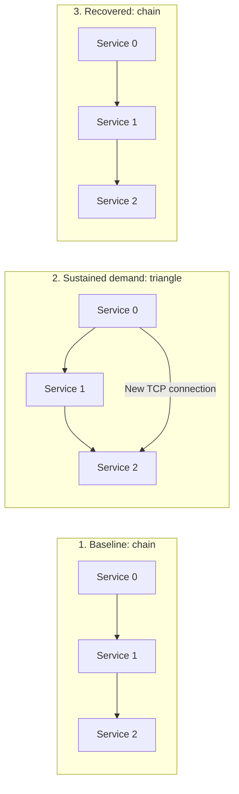

# Local Soul searching: processes and network topology

[`soul.py`](../../soul.py) is a standalone, standard-library Python example under
500 lines. Three service processes own adaptive child-worker pools. A separate
producer loads all three, while a root supervisor admits changes to the TCP
connections between the services. Each service runs the observe, propose, admit,
roll and drain cycle locally.

## Table of contents

- [Run the example](#run-the-example)
- [Three processes change their topology](#three-processes-change-their-topology)
- [Each service changes its processing tree](#each-service-changes-its-processing-tree)
- [Cheeger bounds at two boundaries](#cheeger-bounds-at-two-boundaries)
- [Controls and evidence](#controls-and-evidence)
- [From approved profiles to Natural Selection](#from-approved-profiles-to-natural-selection)

## Run the example

From the repository root, with Python 3.13 or 3.14:

```sh
python soul.py
```

No package installation, Kubernetes cluster or external service is required.
The services listen on ephemeral `127.0.0.1` TCP ports. The producer supplies
96 jobs per service by default, for 288 verified load results. Opening a peer
connection also sends a separate square-computation job to its destination,
which executes it in a child worker and returns the verified result.

To change the load and timing:

```sh
python soul.py --jobs 128 --work-seconds 0.02 --tick 0.02
python soul.py --help
```

The operation computes an integer square. Both worker representations simulate
one I/O overhead per dispatch using `sleep`; the batch representation amortizes
that overhead over up to four jobs. The controlled delay makes capacity changes
repeatable. This example measures completion of those jobs; calibrate production
profiles against the application's own work and latency budgets.

## Three processes change their topology

The initial service graph is a directed chain. Sustained backlog activates batch
profiles. Once at least two services report that change, the root admits a
triangle by adding a direct connection from service 0 to service 2. After all
three services complete their work and restore their original worker profile,
the root removes the shortcut and restores the chain.



These arrows are real, persistent TCP peer connections. A newly opened connection
carries a job and its result before the service acknowledges its topology epoch.
The root logs `topology_committed` only after all three services acknowledge that
epoch. The shortcut is closed after its accepted job completes. The original
chain connections remain open until final shutdown.

The independent load producer uses IPC pipes to feed each service's bounded
queue. That traffic drives worker adaptation; TCP peer jobs exercise the admitted
connections. Worker commands and results also use private IPC pipes. The
ownership tree, worker-routing graph and service peer graph each describe a
different relationship.

## Each service changes its processing tree

Each service has the same two approved representations of its capability:

| Profile | Worker processes | Jobs per dispatch | Trigger |
| --- | --- | --- | --- |
| `interactive` | 1 | 1 | Initial state and recovery after a quiet interval |
| `batch` | 3 | Up to 4 per worker | Sustained backlog above the configured high-water mark |

The transition starts replacement workers and waits for their readiness
acknowledgements. Until the replacement set is ready, the current generation
continues accepting dispatches. The service then commits the new generation,
stops assigning new jobs to retiring workers, collects their accepted results,
asks them to exit and joins them.

The four-worker ceiling includes both generations. Scaling up therefore holds
one old interactive worker plus three batch replacements; recovery holds three
old batch workers plus one interactive replacement. A new PID represents the
restored interactive worker. Each service owns its decision independently.

The processing queue holds at most 64 pending jobs, plus one bounded batch per
worker. The script checks result identity and value, rejects duplicate
completion and verifies that every accepted job finishes. After all services
restore baseline and the peer graph returns to its chain, the root requests
shutdown and joins the producer and service processes. Each service joins its
own children. Failures and interruption enter bounded cleanup and exit without
a success record.

## Cheeger bounds at two boundaries

`cheeger()` enumerates every distinct cut of these small graphs. It computes
unweighted edge expansion with directions ignored, using Polyad's
[structural definition](../graphs/graph-rules.md#cheeger-bottleneck-bounds).

| Boundary | Baseline | Loaded profile | Exact Cheeger values |
| --- | --- | --- | --- |
| Three service processes | Chain with two TCP edges | Triangle with three TCP edges | `1 → 2 → 1` |
| One service's dispatch/collect components and workers | One worker between dispatch and collect | Three parallel workers between dispatch and collect | `1 → 1.5 → 1` |

At the worker boundary, dispatch and collect are logical components inside the
service process. They connect to each eligible worker through its command/result
pipe. Retiring workers finish previously accepted work and leave the graph used
to admit new dispatches.

A fixed `hard_minimum` remains authoritative. Approved demand profiles select
separate Cheeger targets: `1.5` for batch worker routing and `2` for the service
triangle. The script checks those targets and the hard floor before admitting
a change. It also checks live child counts and a four-change budget per service.
The two boundaries compute expansion independently. Job completion and backlog
are measured separately from these structural values.

## Controls and evidence

All settings are declared together in `Settings` and exposed as CLI options:

| Option | Default | Purpose |
| --- | --- | --- |
| `--jobs` | `96` | Load jobs per service, including three warmup jobs; range 24–2000 |
| `--work-seconds` | `0.05` | Simulated overhead per worker dispatch |
| `--tick` | `0.05` | Service observation and supervision interval |
| `--high-water` | `8` | Outstanding jobs needed to count a high-demand observation |
| `--sustained` | `3` | Consecutive high-demand observations before selecting batch workers |
| `--cooldown` | `0.3` | Minimum seconds between committed worker profiles |
| `--idle-seconds` | `0.6` | Quiet interval before returning to interactive workers |
| `--worker-limit` | `4` | Live children per service, including rolling overlap; maximum 6 |
| `--hard-minimum` | `1.0` | Fixed structural floor; the initial graphs must satisfy it |
| `--timeout` | `20` | Experiment deadline in seconds |

A limit can prevent the requested demonstration. For example,
`--worker-limit 2` rejects the batch replacement instead of exceeding the ceiling.
A run only reports success after both adaptation and restoration occur; an
insufficient burst or infeasible timing configuration fails explicitly.

JSON output includes service identity, PID and monotonic time:

- `observed`: backlog, backlog delta, completed jobs and completion delta.
- `admitted` and `committed`: the worker role, generation and Cheeger evidence.
- `worker_spawned`, `worker_ready`, `worker_joined`: actual process lifecycles.
- `topology_admitted`, `edge_opened`, `peer_work_completed`, `edge_closed` and
  `topology_committed`: proposed changes and evidence of actual TCP execution.
- `baseline_restored`: a service has returned to one worker with all its jobs complete.
- `success`: all 288 default load results are verified and the process tree is joined.

The [integration tests](../../pkg/tests/test_local_soul.py) run real subprocesses
and sockets, verify readiness before role changes, exact topology transitions,
result counts, process ceilings, interruption cleanup and the 500-line limit:

```sh
poetry run pytest pkg/tests/test_local_soul.py
```

## From approved profiles to Natural Selection

This example selects among explicit worker and connection profiles. Application
engineers supply their capability implementations, work contracts and resource
budgets. The [Service Symbiosis SDK](../../pkg/polyad-sdk/README.md) supplies the
observation and control interface for applications deployed through Polyad;
`soul.py` implements its local process supervision directly.

**Automatic capability placement and composition selection extend this
foundation toward Natural Selection.** A planner would match the required outcome
to available implementations, decide which components run in each eligible
process or deployment, and choose how their inputs and outputs connect. It would
also plan readiness, state transfer and draining when those assignments change.

The [Copolyad proposal](../proposals/copolyad.md#from-local-capabilities-to-natural-selection)
defines that planning boundary. An admitted Natural Selection plan owns its
composition and overrides conflicting Soul searching choices. Soul searching
continues adapting the profile settings delegated by that plan, subject to
GraphRules, permissions and resource limits.
