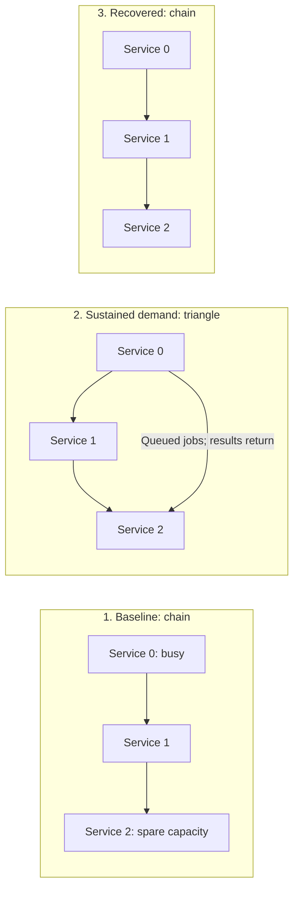

# Local Soul searching: processes and network topology

<!-- toc:start -->
**Table of contents**

- [Run the example](#run-the-example)
- [Read the experiment from the root](#read-the-experiment-from-the-root)
- [Three processes change their topology](#three-processes-change-their-topology)
- [Work sharing through SDK strategies](#work-sharing-through-sdk-strategies)
- [Compare useful work under the same limits](#compare-useful-work-under-the-same-limits)
- [Each service changes its processing tree](#each-service-changes-its-processing-tree)
- [Writing an adaptive application](#writing-an-adaptive-application)
- [Cheeger bounds at two boundaries](#cheeger-bounds-at-two-boundaries)
- [Controls and evidence](#controls-and-evidence)
- [From approved profiles to Natural Selection](#from-approved-profiles-to-natural-selection)
<!-- toc:end -->

[`soul.py`](../../demo/soul.py) is a local Python example built on the SDK's
[`AdaptiveService` ABC](../../pkg/polyad-sdk/README.md#subclass-contract). Three
services compute integer squares in child processes. An uneven load leaves
service 0 busy and spare capacity at service 2. Opening a direct TCP connection
lets service 0 delegate its queued jobs to service 2 while retaining
responsibility for their results.

The default run compares a fixed chain with the adaptive topology under the same
load, worker profiles and process limits. Each service can also replace its
interactive worker with batch workers, then return to one worker after the load
finishes. The script's opening documentation includes ASCII diagrams and a
reading guide.

## Run the example

From the repository root, with Python 3.13 or 3.14:

```sh
python -m pip install ./pkg/polyad-types ./pkg/polyad-sdk
python demo/soul.py
```

`poetry install` also installs the local SDK. No Kubernetes cluster or external
service is required. Services listen on ephemeral `127.0.0.1` TCP ports.

The default producer sends 384 jobs to service 0, 128 to service 1 and 32 to
service 2. Each trial verifies 544 unique jobs. Both trials shut down before the
comparison is printed. Every job computes `(ID + 1)**2` and keeps its original ID
when delegated over TCP. Its owner verifies the final result.

```sh
python demo/soul.py --jobs 768 --work-seconds 0.05 --tick 0.02
python demo/soul.py --mode adaptive  # Only the changing topology
python demo/soul.py --mode chain     # Only the fixed topology
python demo/soul.py --help
```

Each worker dispatch simulates an I/O overhead using `sleep`. Interactive
workers accept one job per dispatch; batch workers accept up to four. Batching
amortizes that delay, while peer work sharing can use spare workers elsewhere.
Both trials use the same simulation and worker limits.

## Read the experiment from the root

Start with `main()` at the bottom of [soul.py](../../demo/soul.py). It reads settings
and runs each trial within a `try/finally` cleanup boundary. The adaptive trial
runs these phases:

```text
start services -> wait for ready -> form chain -> start uneven load
    -> wait for S0 batch pressure -> add S0-to-S2 shortcut
    -> wait for all owned results -> quiesce new assignments
    -> restore interactive workers -> restore chain
    -> stop services -> verify every process exited -> report measurements
```

The fixed-chain trial follows the same lifecycle without changing its topology.
`wait_for()` continues receiving service reports and checking child health.
`connect_services()` checks Cheeger bounds, sends a topology revision and waits
for capability handshakes on new links or completed drains on removed links.

| Entry point | What it explains |
| --- | --- |
| `main()` | Trial selection, comparison and unconditional cleanup |
| `SoulExperiment.run()` | Experiment phases and the evidence needed to advance |
| `AdaptiveService.run()` | Receiving work, SDK strategies, local workers, delegation and draining |

Every helper has a Google-style docstring describing its arguments, results and
failure conditions. The [Nature example](local-natural-selection.md#read-the-supervisors)
uses the same reading order for changing requirements and capabilities.

## Three processes change their topology

Each service can delegate its own queued jobs to a connected peer with spare
capacity. Once sustained backlog makes service 0 select batch workers, the
adaptive trial adds `service-0 -> service-2`. This gives the busiest service
another place to send its actual work.



Arrows are persistent TCP connections carrying jobs forward and results back.
Imported jobs execute at their destination and are never forwarded again, so
service 1 does not relay service 0's jobs to service 2 in the chain. It can send
its own jobs to service 2. This one-hop policy keeps ownership explicit.

The producer supplies original jobs through IPC pipes; workers use separate
command/result pipes. TCP carries a subset of those same producer jobs. The
process ownership tree and the work-routing graph describe different relations.

After all three owners verify their jobs, the root quiesces new assignments,
waits for worker recovery and removes the shortcut. Removing a link immediately
stops new sends. Outstanding jobs stay in the source ledger until checked results
arrive. The sender requests a drain acknowledgement and closes only after the
receiver confirms completion. This protocol also supports removal during
outstanding work, which the tests exercise. The original chain links drain at
final shutdown.

## Work sharing through SDK strategies

This is the [neighbor routing and work distribution adaptation](adaptation-strategies.md#choose-an-application-adaptation).
The demo defines `WorkSharingStrategy` as a specialization of the SDK's
`TopologyStrategy`, supplied to `AdaptiveService` with two guards:

| Component | Responsibility |
| --- | --- |
| `WorkSharingStrategy(TopologyStrategy)` | React to SDK topology baselines and deltas, saving eligible service peers and withdrawing them when the view is unavailable. Local child workers remain separate candidates. |
| `PeerAvailabilityStrategy` | Check root-approved membership, TCP and capability readiness, advertised free slots and drain state. Reevaluate against `service.view` before delegation. |
| `FreshnessStrategy` | Require a fresh, usable view before considering local worker changes. |
| Application queue and transport code | Retain one local batch per worker, delegate surplus jobs, enforce receiver admission, track results and drain removed links. |

The receiver advertises free slots after accounting for local work and its shared
peer-job budget. Two senders can see the same advertisement, so the receiver
checks again when a batch arrives. It accepts the whole batch or rejects it
before execution. Only an explicit rejection permits the source to requeue the
same job IDs, retaining their original timestamps.

Each link has at most one batch awaiting results. Incoming peer jobs share one
`--peer-window` limit per receiving service. Read/write buffers are bounded and
partial TCP messages cannot block the local worker loop. An unexpected disconnect
with unfinished work fails the trial and enters cleanup; it never blindly retries
work whose execution outcome is unknown.

## Compare useful work under the same limits

`python demo/soul.py` starts two fresh process trees sequentially. Both use identical
job IDs, input values, warmup timing, worker policies, process ceilings and peer
budgets. The chain trial shares work on its two existing links. The adaptive
trial can also open `service-0 -> service-2` under demand.

The `comparison` JSON record contains both measured results:

| Measurement | Meaning |
| --- | --- |
| `completed` | Original jobs verified once by their owners. Default: 544 per trial. |
| `elapsed_seconds`, `jobs_per_second` | Producer launch to the last verified owned result, and jobs divided by that duration. Service startup and final shutdown are excluded. |
| `mean_latency_seconds`, `p95_latency_seconds` | Producer timestamp to verified result at the original owner. Timestamps precede pipe writes, including producer backpressure. |
| `source_backlog_seconds` | Area under service 0's observed unfinished-job count, including delegated work. Lower values mean less accumulated waiting after admission. |
| `source_peak_backlog` | Largest observed owned backlog at service 0. A bounded queue can have the same peak while draining sooner. |
| `shortcut_jobs`, `peer_jobs` | Producer jobs completed through the added edge and through all peer edges, excluding rejected batches. |
| `speedup` | Chain completion time divided by adaptive completion time. Values above 1 indicate an improvement in this run. |

Work in the producer pipe is included in latency but not service backlog area.
The worker budget stays fixed at four live children per service, including
replacement overlap. Utilization can change: the shortcut lets idle workers do
useful work. Cheeger describes the added structural path; job completion shows
whether it helps.

Machine load and process scheduling affect the measured gain. The script reports
the actual ratio, including regressions, without treating speedup as a correctness
condition. It requires the adaptive shortcut to complete real producer jobs.
Repeat the comparison with representative load when tuning.

## Each service changes its processing tree

| Profile | Workers | Jobs per dispatch | Trigger |
| --- | --- | --- | --- |
| `interactive` | 1 | 1 | Initial state, then recovery after quiesce and a quiet interval |
| `batch` | 3 | Up to 4 per worker | Sustained backlog above the configured threshold |

New workers must report ready before receiving jobs. Old workers finish accepted
batches, stop and are joined. The four-worker ceiling includes the overlap:
scaling up needs one old interactive worker plus three replacements; recovery
needs three old batch workers plus one replacement. Each service makes its own
profile decision through the SDK observation loop.

Batch services remain available for peer work until the root confirms every
owner's jobs are complete. A subsequent quiet interval permits recovery. A lightly
loaded service can keep its original worker; the default load makes at least
service 0 and service 1 roll their workers.

The application holds at most 64 queued-or-delegated jobs, plus one bounded batch
per local worker. Delegation retains source ownership until verified completion.
The root joins services and producers, and each service joins its children.
Errors and interruption enter cleanup without reporting success.

## Writing an adaptive application

`service()` owns signals and a `try/finally` boundary around the service loop:

```text
receive root commands, peer frames and producer work
    -> collect results and observe pressure/progress
    -> SDK refresh / dispatch -> update routes and propose worker profile
    -> check limits -> commit ready workers
    -> dispatch locally -> delegate surplus -> maintain/drain TCP links
    -> report owned completion, worker recovery or shutdown
```

| Responsibility | Code to read | Property to preserve |
| --- | --- | --- |
| Application computation | `worker()` | Worker profiles compute the same function |
| Input and backpressure | `receive_producer_work()`, `admit_peer_batch()` | Unique IDs, correct values, bounded admission and explicit rejections |
| SDK routing | `WorkSharingStrategy`, `neighborhood()`, `publish_observation()` | Meaningful worker and peer deltas, with current freshness checks |
| Delegation | `share_work()`, `complete_peer_job()`, `requeue_rejected()` | Live SDK guard, compatible capacity, retained ownership and verified results |
| TCP lifecycle | `Peer`, `poll_peers()`, `maintain_links()` | Bounded framing, partial reads, capability readiness and acknowledged drains |
| Worker adaptation | `adapt()`, `search_soul()`, `admit_profile()`, `commit_profile()` | Sustained demand, cooldown, process overlap and readiness |
| Final verification | `report_completion()`, `report_recovery()`, `results()` | Every configured job completed once and measured at its original owner |
| Cleanup | `close()` | Every process and connection remains owned through failure |

`WorkSharingStrategy` demonstrates the existing SDK category in application code;
it is not an additional SDK package export. The SDK supplies strategy dispatch,
immutable snapshots and deltas, and current-view checks. The demo owns transport,
queue accounting and worker processes. `LocalObservations` provides worker and
peer snapshots without an operator or HTTP server. See the [strategy guide](adaptation-strategies.md).

To change the application, update computation, input checks, capability handshake
and result validation together. `worker()` accepts a computation function, as
used by [nature.py](../../demo/nature.py). Preserve readiness, ownership, capacity and
draining checks around it. For a long-lived service, replace the finite trial's
completion assertions with application health and lifecycle reporting.

## Cheeger bounds at two boundaries

`cheeger()` computes exact unweighted edge expansion for these small graphs,
ignoring direction as in Polyad's [structural definition](../graphs/graph-rules.md#cheeger-bottleneck-bounds).

| Boundary | Baseline | Under load | Values |
| --- | --- | --- | --- |
| Three services | Two TCP edges in a chain | Third edge completes a triangle | `1 → 2 → 1` in the adaptive trial |
| Dispatch, workers and collection inside a service | One worker | Three parallel workers | `1 → 1.5 → 1` for a service that adapts |

The fixed `hard_minimum` applies at both boundaries. Separate demand targets are
1.5 for batch workers and 2 for the triangle. Process limits include retiring
workers, and a four-change budget bounds worker churn. Completed jobs, latency
and backlog are measured independently of these structural values.

## Controls and evidence

Numeric controls live in `Settings`; `--mode` selects the trials:

| Option | Default | Purpose |
| --- | --- | --- |
| `--mode` | `compare` | Both trials, only `chain`, or only `adaptive` |
| `--jobs` | `384` | S0 jobs; S1 gets one third, S2 one twelfth with a minimum of three. Range 96–2000 |
| `--work-seconds` | `0.05` | Simulated delay per worker dispatch |
| `--tick` | `0.02` | Observation and supervision interval |
| `--high-water` | `8` | Outstanding jobs defining high demand |
| `--sustained` | `3` | Consecutive high-demand observations before selecting batch workers |
| `--cooldown` | `0.3` | Minimum time between worker-profile changes |
| `--idle-seconds` | `0.6` | Quiet interval before returning to one worker after quiesce |
| `--worker-limit` | `4` | Live children per service, including overlap; maximum 6 |
| `--hard-minimum` | `1.0` | Structural floor; the initial graphs must satisfy it |
| `--timeout` | `20` | Seconds per trial, including startup and shutdown |
| `--peer-window` | `12` | Shared unfinished peer-job ceiling at a receiver and maximum batch size; maximum 64 |

Infeasible limits fail explicitly: `--worker-limit 2` blocks the batch replacement.
An insufficient load or timing configuration can also prevent demonstrating the
shortcut's benefit. The script reports failure if the adaptive link carries no
producer jobs; a measured slowdown remains a valid experimental result.

JSON records include PID, service identity and monotonic time. `work_delegated`,
`peer_batch_accepted`, `peer_backpressure`, `peer_work_completed` and
`delegated_work_completed` trace the same original job IDs. `edge_closed` confirms
zero outstanding work. `baseline_restored` confirms one worker with all work done.
`trial_verified` and `comparison` report measurements. `success` confirms 1,088
verified default results across both trials and complete process cleanup.

The [tests](../../pkg/tests/test_local_soul.py) cover SDK strategy dispatch, stale
views, capacity races, result validation, partial TCP frames, removal during
outstanding work, process limits and interruption cleanup:

```sh
poetry run pytest pkg/tests/test_local_soul.py pkg/tests/test_local_nature.py
```

## From approved profiles to Natural Selection

Run [`python demo/nature.py`](../../demo/nature.py) to put a parent Natural Selection
planner above the same worker and policy machinery. The
[local Natural Selection guide](local-natural-selection.md) shows how a new
required outcome selects capabilities and routes, replaces a service, keeps
useful service PIDs alive and retires an excluded process.

This example selects among explicit worker and connection profiles. Application
engineers supply their capability implementations, work contracts and resource
budgets. The [Service Symbiosis SDK](../../pkg/polyad-sdk/README.md) supplies the
observation and control interface for applications deployed through Polyad;
`soul.py` implements its local process supervision directly.

**Automatic capability placement and composition selection extend this
foundation toward Natural Selection.** A planner would match the required outcome
to available implementations, decide which components run in each eligible
process or deployment, and choose how their inputs and outputs connect. It would
also plan readiness, state transfer and draining when those assignments change.

The [Copolyad proposal](../proposals/copolyad.md#from-local-capabilities-to-natural-selection)
defines that planning boundary. An admitted Natural Selection plan owns its
composition and overrides conflicting Soul searching choices. Soul searching
continues adapting the profile settings delegated by that plan, subject to
GraphRules, permissions and resource limits.
