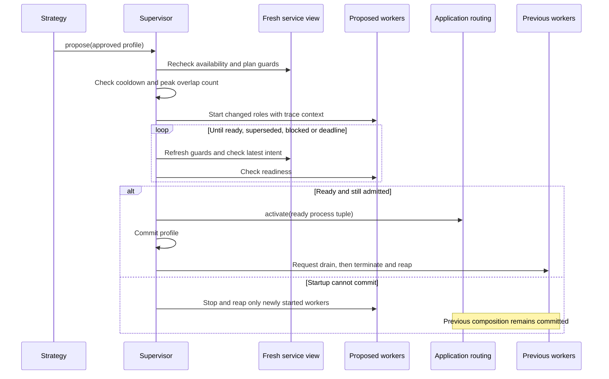

# SDK telemetry and subprocess plans

<!-- toc:start -->
**Table of contents**

- [Runtime components](#runtime-components)
- [Trace operations and collect metrics](#trace-operations-and-collect-metrics)
  - [Built-in signals](#built-in-signals)
  - [Distinguish service instances and retry attempts](#distinguish-service-instances-and-retry-attempts)
  - [Carry trace context into workers](#carry-trace-context-into-workers)
  - [Export configuration](#export-configuration)
- [Construct workers and approved plans](#construct-workers-and-approved-plans)
- [Connect strategies to the supervisor](#connect-strategies-to-the-supervisor)
- [Readiness, commit and draining](#readiness-commit-and-draining)
- [Concurrency, recovery and shutdown](#concurrency-recovery-and-shutdown)
- [Run the example](#run-the-example)
<!-- toc:end -->

The SDK supplies OpenTelemetry instrumentation and a process supervisor for
turning adaptation decisions into local worker compositions. Engineers define
approved plans, readiness and draining protocols, then let their strategies
propose a plan by name. The same telemetry instance connects observation,
adaptation and worker lifecycle records.

## Runtime components

Import these interfaces from `polyad_sdk`, or from `polyad_sdk.observability`
and `polyad_sdk.processes`:

| Interface | Role |
| --- | --- |
| `Telemetry` | Shares a tracer and meter, instruments SDK operations, and optionally owns OTLP exporters. |
| `ProcessSpec` | Immutable argument vector, environment overrides, working directory, readiness check and drain handshake for one worker. |
| `ProcessPlan` | Names an approved set of worker roles and the constraints that must permit its activation. |
| `ManagedProcess` | Exposes the specification, concrete PID and return code to application lifecycle callbacks. |
| `ProcessSupervisor` | Coalesces desired profiles, admits replacements, waits for readiness, switches routing and drains old workers. |
| `PlanResult` | Reports the attempted profile and `Idle`, `Unchanged`, `Applied`, `Blocked`, `Superseded` or `Failed` outcome. |

Construction of a service, specification, plan or supervisor starts no worker or
background thread. `propose()` records intent. The application calls `reconcile()`
on its supervisor thread to perform the work. See the
[adaptation catalog](adaptation-strategies.md#choose-an-application-adaptation)
for choosing which behavior to implement.

## Trace operations and collect metrics

OpenTelemetry API, SDK and OTLP HTTP exporter dependencies are included in
`polyad-sdk`. The API layer loads with the package; exporter implementations load
only when explicitly configured. `Telemetry()` uses the application's installed
providers. Without providers, instrumentation remains inactive. The SDK starts
no metrics server and does not replace the application's global providers.

```python
from collections.abc import Callable, Sequence

from polyad_sdk import Telemetry, WorkloadContext

telemetry = Telemetry.otlp(
    service_name="pipeline-consumer",
    context=WorkloadContext.from_environment(),
    traces=True,
    collect_metrics=True,
)
completed = telemetry.meter.create_counter("application.jobs.completed", unit="{job}")
latency = telemetry.meter.create_histogram("application.job.duration", unit="s")


def complete_batch(
    process_batch: Callable[[Sequence[bytes]], tuple[int, float]],
    batch: Sequence[bytes],
) -> None:
    with telemetry.operation("application.batch"):
        count, elapsed_seconds = process_batch(batch)
        completed.add(count)
        latency.record(elapsed_seconds)
```

Here each job is a `bytes` payload. `process_batch` returns the completed job
count and elapsed seconds; substitute your application's job type when needed.

Pass `telemetry=` to `AdaptiveService`, `Client` and `ProcessSupervisor` to share
instrumentation. `AdaptiveService.from_environment(telemetry=telemetry, ...)`
also passes it to the API clients it creates. Applications can inject explicit
`tracer_provider=` and `meter_provider=` instead of using OTLP; this supports
their existing instrumentation and in-memory testing.

Use the meter's counters for completed work, histograms for latency, and gauges
or observable gauges for queue depth and measured resource use. Application
samplers retain the measurements used by local strategies. Exporting a metric
does not submit a throughput report to the operator; use
[`report_throughput()`](../../pkg/polyad-sdk/README.md#report-throughput-to-soul-searching)
for authorized graph-level feedback.

### Built-in signals

| Instrument | Unit and dimensions | Meaning |
| --- | --- | --- |
| `polyad.sdk.operations` | Counter; operation, outcome, and applicable strategy/profile/role | Completed operation attempts, including failures. |
| `polyad.sdk.operation.duration` | Histogram in seconds; same dimensions | Time spent in each operation attempt. |
| `polyad.sdk.processes` | Up/down counter in processes | Workers owned by the supervisor, including startup, draining and pending cleanup. Exits are reflected when reconciliation reaps ownership. |
| `polyad.sdk.plan.results` | Counter; approved profile and result state | Reconciliation outcomes, including blocked and superseded proposals. |

Spans cover `api.request`, `adaptation.delivery`, `adaptation.strategy`, `adaptation.apply`,
`adaptation.hook`, `adaptation.checkpoint`, `plan.reconcile`, `process.start`
and `process.stop`. HTTP request spans cover opening the response, including
authentication and connection failures; stream consumption has its own application
lifetime. Failed adaptation stages remain pending under the SDK's existing retry
contract, and telemetry counts each attempt actually executed.

Built-in telemetry includes stable operation names and exception types. It omits
request bodies, bearer tokens, child command arguments, environment values and
exception messages. Keep application-added attributes bounded and non-sensitive.
Pod, node and graph identities belong to the shared resource attributes supplied
through `WorkloadContext`.

### Distinguish service instances and retry attempts

Every `AdaptiveService` construction, including `from_environment()`, allocates a
read-only `service.instance_id` UUID. This identifies an SDK runtime actor, not a
new workload, Pod, or authorization principal. Multiple instances may share the
same workload identity and telemetry providers without sharing reporting IDs.
The SDK does not overwrite the application's OpenTelemetry resource identity.

Each new observation delivery also allocates a UUID, exposed as
`service.delivery_id` during callbacks and while a failed delivery is pending.
It becomes `None` after successful completion. Strategy invocation IDs are derived
from the service instance, delivery and strategy registration position, including
when one strategy object is registered twice.

| Trace attribute | Meaning |
| --- | --- |
| `polyad.sdk.service.instance.id` | The SDK instance's lifetime UUID, also available as `service.instance_id`. |
| `polyad.sdk.adaptation.delivery.id` | The baseline or change being delivered; stable while retrying that delivery. |
| `polyad.sdk.adaptation.invocation.id` | One strategy registration's call within the delivery; matches `AdaptationReport.invocationId`. |
| `polyad.sdk.strategy.index` | Zero-based registration position in the instance's strategy list. |

Delivery, application-adaptation, hook and checkpoint spans carry the instance and
delivery IDs. Strategy spans and SDK operations nested inside them, including
API reports, also carry the invocation ID and strategy index. Separate deliveries
remain distinct even when ordinary refreshes preserve the same stream cursor.
Retries retain their reporting identity but produce new attempt spans; already
completed components are skipped. A new instance or process restart starts new
runtime identities. Durable business idempotency remains application-owned.

Correlation uses execution-local context, not mutable labels on the shared
`Telemetry` or client. Nested services replace actor correlation while preserving
the caller's causal parent span. Independent deliveries normally start distinct
traces; deliveries under a shared application parent intentionally share that
trace, with distinct spans and correlation IDs. No service-wide long-lived root
span is required.

The UUIDs are **trace-only attributes**, not metric dimensions, to avoid creating
a metric time series per observation. They are not exported as W3C baggage or
automatically added to every application log. Include `service.instance_id` and
`service.delivery_id` explicitly in application logs when useful. SDK operation
counts and duration metrics retain their existing bounded dimensions.

For application work outside a delivery, use
`service.telemetry.scope({"polyad.sdk.service.instance.id": service.instance_id})`
around SDK operations to associate them with an actor. A scope replaces inherited
correlation, creates no span, and restores the previous context on exit, including
failure. Add operation-specific trace fields with
`telemetry.operation("application.work", trace_attributes={"job.id": job_id})`;
they merge with scoped fields and follow nested SDK operations without becoming
metric labels. Keep all attributes non-sensitive. Spans created directly through
`telemetry.tracer` still require explicit attributes; their normal trace parentage
is unchanged.

### Carry trace context into workers

The supervisor carries the proposing strategy's trace context into reconciliation,
including its SDK correlation attributes when it runs later on another thread.
Arbitrary application-created threads need explicitly captured context; thread
creation alone does not carry it. The client sends W3C trace context
with HTTP requests. Constructed subprocesses
receive `TRACEPARENT` and, when present, `TRACESTATE`; stale inherited carriers are
replaced. Correlation UUIDs stay in the originating spans rather than being copied
into child environments or HTTP headers. A child explicitly extracts its parent:

```python
from polyad_sdk import Telemetry

child_telemetry = Telemetry()
with child_telemetry.tracer.start_as_current_span(
    "worker.start", context=child_telemetry.parent_context()
):
    pass  # Initialize the worker using its own configured providers.
```

### Export configuration

`Telemetry.otlp(...)` explicitly starts private providers with batched traces
and periodic metrics over HTTP/protobuf. Configure the standard variables before
construction:

| Setting | Purpose |
| --- | --- |
| `OTEL_EXPORTER_OTLP_ENDPOINT` | Shared collector base address, such as `http://alloy:4318`. |
| `OTEL_EXPORTER_OTLP_TRACES_ENDPOINT`, `OTEL_EXPORTER_OTLP_METRICS_ENDPOINT` | Optional complete signal endpoints overriding the shared address. |
| `OTEL_EXPORTER_OTLP_HEADERS` and signal-specific variants | Collector authentication managed by the application deployment. |
| `OTEL_RESOURCE_ATTRIBUTES` | Additional deployment resource identity. |
| `OTEL_TRACES_SAMPLER`, `OTEL_TRACES_SAMPLER_ARG` | Trace sampling policy. |
| `OTEL_BSP_*` | Trace batching and queue limits. |
| `OTEL_METRIC_EXPORT_INTERVAL`, `OTEL_METRIC_EXPORT_TIMEOUT` | Periodic collection/export timing in milliseconds. |
| `OTEL_SDK_DISABLED=true` | Suppress both exporters created by `Telemetry.otlp`. |

The exporter configuration reads the process's standard OTEL environment.
`service_name=` supplies the resource's explicit service name. Signals can be
disabled independently with `traces=False` or `collect_metrics=False`.
Unsupported exporter protocols fail before startup. Stop application workers
before `telemetry.close()` flushes and closes the providers it owns. Injected and
global providers retain their application's lifecycle.

See the [OpenTelemetry Python instrumentation](https://opentelemetry.io/docs/languages/python/instrumentation/)
and [exporter configuration](https://opentelemetry.io/docs/languages/python/exporters/)
for application instruments and collector integration.

## Construct workers and approved plans

Each worker requires application readiness and draining checks. Both callbacks
receive a `ManagedProcess` and must return promptly. They inspect application
state or initiate an asynchronous handshake; they do not wait indefinitely.

```python
from collections.abc import Callable

from polyad_sdk import ConstraintStrategy, ManagedProcess, ProcessPlan, ProcessSpec


def worker_plans(
    readiness: Callable[[ManagedProcess], bool],
    request_drain: Callable[[ManagedProcess], bool],
    memory_guard: ConstraintStrategy,
) -> tuple[ProcessPlan, ...]:
    worker = ProcessSpec.python(
        "primary", "my_service.worker", "--batch-size", "16",
        ready=readiness, drain=request_drain,
        environment={"APPLICATION_ROLE": "consumer"},
    )
    helper = ProcessSpec.python(
        "helper", "my_service.worker", "--batch-size", "64",
        ready=readiness, drain=request_drain,
    )
    return (
        ProcessPlan("idle", (worker,), guards=(memory_guard,)),
        ProcessPlan("busy", (worker, helper), guards=(memory_guard,)),
        ProcessPlan("stopped", ()),
    )
```

`ProcessSpec.python()` runs the module using the parent's Python interpreter.
`ProcessSpec(name, argv, ready, drain, ...)` supports other executables. Arguments
are passed directly without a shell. Children inherit stdout/stderr for the
workload's normal log collection; stdin is closed. `cwd=` selects a working
directory. The supervisor copies the SDK's import-time [`env`](workload-environment.md#sdk-defaults)
as its default child environment. `environ=` supplies a different base and each
specification can override fields. Environment values are excluded from reprs
and built-in telemetry.

Identical live specifications with the same role name are reused across plans.
Changing a role's command, environment or callbacks makes it a replacement. In
this example the primary remains alive while the helper joins and later drains.
An empty plan explicitly retires every active worker.

## Connect strategies to the supervisor

A strategy proposes names from the supervisor's approved plan set. Repeated
proposals for the same name coalesce; a newer target replaces pending intent.
There is one pending target, rather than an accumulating queue of worker changes.

```python
from collections.abc import Callable, Mapping, Sequence
from typing import Any

from polyad_sdk import (
    AdaptiveService, Change, Environment, ManagedProcess, ObserveStrategy, ProcessPlan, ProcessSupervisor,
    ResourceStrategy, Telemetry,
)


def build_service(
    plans: Sequence[ProcessPlan],
    activate_ready_workers: Callable[[tuple[ManagedProcess, ...]], None],
    select_profile: Callable[[Mapping[str, Any]], str | None],
    telemetry: Telemetry,
) -> tuple[AdaptiveService, ProcessSupervisor]:
    supervisor: ProcessSupervisor

    def decide(change: Change, current: Environment) -> None:
        if current.available and current.resources is not None:
            profile = select_profile(current.resources)
            if profile is not None:
                supervisor.propose(profile)

    class Consumer(AdaptiveService):
        def adapt(self, change: Change) -> None:
            pass  # Strategies have stored intent; the supervisor loop applies it.

    service = Consumer.from_environment(
        strategies=(ObserveStrategy(), ResourceStrategy(decide)),
        telemetry=telemetry,
    )
    supervisor = ProcessSupervisor(
        plans, view=lambda: service.view, activate=activate_ready_workers,
        max_processes=4, cooldown_seconds=30, telemetry=telemetry,
    )
    return service, supervisor
```

Run `service.run()` through the application's existing observation thread and
call `supervisor.reconcile()` from its worker-supervision loop. `reconcile()` may
wait for startup and draining, so keep it outside strategy and event callbacks.

For a two-profile resource policy, use `ThresholdStrategy` with
`active=lambda: supervisor.profile or "idle"`. Its `propose` callback accepts the
profile, triggering change and current environment; return `None` after recording
the requested profile:

```python
from collections.abc import Callable

from polyad_sdk import Change, Environment, ProcessSupervisor


def proposal_callback(
    supervisor: ProcessSupervisor,
) -> Callable[[str, Change, Environment], None]:
    def propose(profile: str, change: Change, current: Environment) -> None:
        supervisor.propose(profile)
    return propose
```

Request the initial profile explicitly. The committed profile changes only after
readiness and activation succeed. For application throughput or local queue demand,
use a custom strategy or the [appropriate callback selector](adaptation-strategies.md#observation-and-callback-strategies).

## Readiness, commit and draining



`activate(processes)` performs an atomic application routing switch to the ready
composition. If it raises, it must leave prior routes intact. The supervisor then
rolls back newly started workers. After successful activation, it records the new
profile and asks removed workers to drain. This order allows accepted old work to
finish while new assignments use the replacement.

| Control | Meaning |
| --- | --- |
| `max_processes` | Required peak number of owned direct children, including startup and retirement overlap. |
| `ProcessPlan.guards` | All named constraints must be satisfied against the freshly evaluated service view. Unknown blocks admission. |
| `cooldown_seconds` | Minimum interval between committed profile changes; crash repair within the committed profile remains eligible. |
| `startup_timeout` | Total window for the proposed composition to become ready; expiry rolls back new workers. |
| `drain_timeout` | Shared window for retired workers to acknowledge draining before termination. |
| `stop_timeout` | Termination grace per child before forced cleanup. |
| `poll_interval` | Interval between readiness and drain checks. |

Combine process-count limits with `ContainerBudgetStrategy` or application guards
for memory, CPU, queue space and external quotas. The maximum count covers direct
children owned by this supervisor. Children that create descendants must account
for them in the application's resource and draining contracts.

## Concurrency, recovery and shutdown

`propose()` is thread-safe. One reconciliation runs at a time; concurrent calls
raise. The supervisor rechecks freshness and guards during startup and just before
activation. Superseded attempts clean up their newly started workers. A proposal
arriving during an already committed transition is handled on the next pass.
Per-supervisor ownership bounds prevent two local plans spending the same child
slots; shared external budgets still need application reservations.

Call reconciliation repeatedly to repair an unexpectedly exited worker in the
committed profile. Repairs remain subject to fresh admission and overlap limits.
The SDK starts no watchdog thread. Inspect each `PlanResult` and `supervisor.profile`:
a failure before commit retains the previous profile; a failure during retirement
can leave the new profile committed while cleanup still requires attention.
Failed cleanup retains ownership and continues to count toward the limit.

At shutdown, stop the observation loop, then call `supervisor.close()` outside
lifecycle callbacks. It invalidates pending startup, withdraws routing with
`activate(())`, requests draining, terminates remaining workers and reaps them.
On POSIX, each worker owns a new process group so shutdown signals include its
descendants. Other platforms terminate the direct child. Children must keep their
descendants in the owned group to participate in group cleanup.

Termination escalates after the configured grace. Preserve accepted work through
the application's durable queue, checkpoints or handoff protocol before acknowledging
drain. Shutdown time includes the drain window and per-child termination grace;
configure the Pod's termination grace and application deadline accordingly.
Close the shared telemetry instance after all supervised work finishes.

## Run the example

```bash
poetry run python examples/sdk-process-plans.py
```

The [example](../../examples/sdk-process-plans.py) uses real subprocesses and an
explicit local observation adapter. Illustrative Pod-count values select
`idle -> busy -> idle`; the original worker stays alive while a helper starts,
becomes ready and drains. It also demonstrates a custom metric, operation spans
and child trace propagation. `--otlp` enables collector export in each process.
Use measured application signals and workload-specific thresholds in a real policy.
