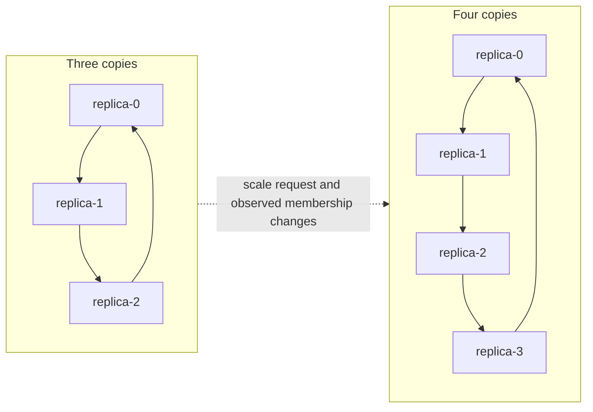
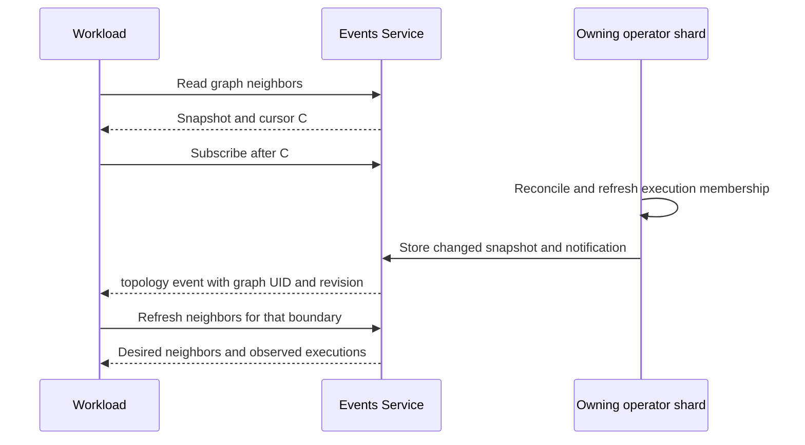

# Workload topology events

<!-- toc:start -->
**Table of contents**

- [Application stream boundary](#application-stream-boundary)
- [Changes that notify workloads](#changes-that-notify-workloads)
- [Connection consent events](#connection-consent-events)
- [Proposed rollout events](#proposed-rollout-events)
- [Read current neighbors](#read-current-neighbors)
- [Subscribe from a workload](#subscribe-from-a-workload)
- [WebSocket subscriptions](#websocket-subscriptions)
- [Rebalancing subscriptions](#rebalancing-subscriptions)
- [Nested graphs](#nested-graphs)
<!-- toc:end -->

Workloads can discover graph neighbors and receive notifications when structure
or execution membership changes. **ReplicaGroup scaling counts as a topology
change**: it adds or removes vertices, and connected replication modes can change
existing copies' neighbors. Independent mode also changes its vertex set.

Enable `events.enabled`, provide the events bearer token through the workload's
own Secret, and permit traffic with the applicable NetworkPolicy and mesh rules.
Use a named key with `home` for the default `GraphTree` discovery mode; a namespace
bearer token requires explicit `Cluster` or `Atlas` mode.
`POLYAD_EVENTS_URL` is injected when the listener is enabled. Subscribers do not
need Kubernetes API credentials. See [event service setup](../deployment/networking.md#event-subscriptions).

The [event contract](../apis/event-contract.md) documents importable ASTs and
JSON Schemas for these observations, plus Helm byte/batch/polling limits and
client receive budgets. `Event.typed()` validates and decodes an observation into
its matching typed payload tree.

Use these observations to maintain eligibility and drain retiring peers as
described in [Service Symbiosis: writing adaptive microservices](adaptive-microservices.md).
That guide connects event hooks to producer/consumer cooperation and backpressure.

Named API keys additionally need `events` or `topology` capabilities and explicit
[graph-tree grants](../operations/api-keys.md#graph-access-and-workload-assignments)
and an administrator-assigned `home` graph. The parent operator's
[discovery mode](../apis/discovery.md#access-modes-and-inherited-ceilings) bounds those grants. A key sees
only its assigned trees, including verified descendants when enabled. Remote
operator PolyGraphs and their descendants remain private.

## Application stream boundary

The workload events Service exposes application observations within its namespace.
The operator's reserved root PolyGraph, its root and remote group Graphs,
component definitions, operator Deployments and owned descendants are excluded
from both lifecycle and topology events. Rewrite,
activation and temporary-connection requests targeting that family are excluded
as well. Internal topology snapshots are unavailable through this Service.

The chart marks control-plane definitions as internal, and generated children
inherit that marker. Publication also checks current, UID-matched graph ancestry
and the configured reserved Graph identity. Unresolved or replaced ancestry
withholds publication until it can be verified. Deletion does not remove this
boundary. Application families sharing the operator's namespace or scheduling
shard continue to receive their events.

Root-held remote streams apply the same internal-resource and ancestry checks
in their destination cluster. An application Graph with the same name as the
root's reserved Graph in another cluster remains an application graph. Operator
metrics and KEDA demand retain their existing control-plane observations.

Public observations and topology snapshots use a separate cache namespace from
the former unfiltered stream. Retained internal events are therefore unavailable
to replay after upgrading. Reconnect using a fresh application topology snapshot
and its cursor; an expired old cursor requires the usual snapshot refresh.

## Changes that notify workloads

A `topology` event is published when the boundary's structural revision
changes. This includes:

- Adding or removing nodes, changing referenced definitions or lifecycle
  dependencies, and editing connections or their ports.
- Changing effective ReplicaGroup counts, including inherited shared-source
  counts, and connections generated by the selected connectivity mode.
- Admitting, expiring or revoking [temporary connections](../apis/temporary-connections.md#deadline-retries-and-cleanup)
  when their grants change the effective edge set. Cleanup after endpoint removal
  follows the same rules; overlapping grants need not produce another topology change.
- Executions appearing, starting termination, disappearing, or being replaced
  with a different UID. Activation executions retain their logical node and
  identify their separate runtime nodes.
- Changing a native Deployment or StatefulSet's requested replica count. This
  updates membership inside a vertex; individual Pods do not become graph vertices.
- Graph deletion beginning, graph incarnation replacement, or desired topology
  becoming invalid or unavailable.

Status heartbeats, resource-version increments, readiness changes and reordered
equivalent declarations do not change the structural revision. Ordinary `graph`
events continue to report lifecycle observations.

[Traffic percentage adjustments](../graphs/traffic-balancing.md) alone retain the
same neighbors and do not change the structural revision. Automatic routing
recommendations and changes appear in ordinary graph observations through
`status.throughput`.

Scaling a directed Ring from three copies to four changes `replica-2`'s outgoing
neighbor from `replica-0` to `replica-3`:



Notifications follow owning-shard reconciliation and periodic rescans. They are
observations of state at reconciliation time. Several Kubernetes changes can be
coalesced before an observation.
GraphPolicies control admission independently of event delivery.

## Connection consent events

Temporary-connection proposals and response/status changes emit `event: connection`.
`data.graph` identifies the enclosing boundary; `data.connection` contains the
receipt name, UID, endpoints, deadline, consent summary and current status.
The same graph-tree visibility, reserved-family isolation and bounded replay
rules apply. Enable both events and connections and subscribe before proposing
an edge. Keep the stream cursor so a reconnect can replay pending proposals.

The request already supplies consent for its verified endpoint. The peer must
respond using its own Pod-bound projected token and graph-specific `approve`
permission; event access alone grants neither. A third-party request needs both
endpoints' responses. Applications inspect the proposed connection and choose
whether to approve. No response means Pending until expiry, without network access.
See [service consent](../apis/temporary-connections.md#service-consent) for payloads,
RBAC, client calls and the separate [pulse budgets](../apis/temporary-connections.md#administrator-pulse-limits).

## Proposed rollout events

The [rollout sparsity and events proposal](../proposals/rollout-sparsity.md) adds a separate
`rollout` event type for queued, coalesced, deferred and executing changes, down
to individual workloads. Deferrals would report the limiting graph or workload
scope and earliest eligible time. These events and frequency settings are not
implemented yet. A delayed or suppressed rollout would not itself emit a topology
change; actual structural or execution-identity changes retain the behavior above.

## Read current neighbors

A **topology snapshot** is the operator's published description of a graph's
nodes, connections and observed workloads. Reading it gives your service a
starting point for choosing possible destinations and tracking later changes.
The read uses your observation permissions; sending work or requesting graph
changes still requires the relevant connection and API permissions.

The SDK combines this topology with received metrics, decisions and connection
records into its own read-only `Environment` snapshot. See
[snapshots and permission to act](../../pkg/polyad-sdk/README.md#snapshots-and-permission-to-act)
for how applications use that information before assigning work. The SDK reference
documents every [snapshot field](../../pkg/polyad-sdk/README.md#environment-fields),
its nested records, and the [Change and Delta fields](../../pkg/polyad-sdk/README.md#change-and-delta-fields)
delivered to application callbacks.

Use the events Service on port 8091:

```text
GET /v1/graphs/{kind}/{name}/topology
GET /v1/graphs/{kind}/{name}/topology?uid={graph-uid}&node={logical-node}
```

`kind` is Graph, PolyGraph or ReplicaGroup. Reads use the Service's namespace.
Pass the expected graph UID to detect object replacement. Omit `node` to read the
whole boundary, or pass `POLYAD_NODE_NAME` for the calling workload's local neighbors.

Every response includes:

| Field | Meaning |
| --- | --- |
| `graph` | Boundary kind, namespace, name and UID |
| `revision` | Digest of identity, declared structure and observed execution membership |
| `observedAt` | Publication time as Unix seconds |
| `cursor` | Stream position read atomically with the snapshot; use as `Last-Event-ID` |
| `valid` | Whether requested topology could be resolved and represented |
| `templateOnly` | True for a reusable definition; false for an executable instance |
| `terminating` | Whether graph deletion has started |

Full snapshots contain `nodes` and `connections`. Nodes include their logical
`name`, declared `kind` and `ref` when present, `requires`, `desired`, and
`executions`. Execution entries contain resource kind, name, UID, runtime node and
`terminating`; Deployment and StatefulSet entries also include their requested
native `replicas` count. Workload templates, environment values, Pod specs and
credentials are excluded.

With `node`, the response contains `node`, `incoming`, `outgoing`, `dependencies`
and `dependents`. Directional neighbor entries include the peer node description
and destination port grants. Dependencies include the lifecycle `condition`.

Connections describe **desired** data flow. Execution lists describe resources
that actually exist, including retiring resources. A requested replica can have
`desired: true` and an empty execution list when admission is pending or blocked
by GraphPolicies. A removed vertex can remain `desired: false` until its execution
disappears. Neither presence nor a port declaration guarantees readiness or
reachability. Addresses and service discovery remain the application's
responsibility; snapshots do not expose Pod IPs or EndpointSlices.

## Subscribe from a workload

Configure the [Python SDK](../../pkg/polyad-sdk/README.md) for the events Service:

```python
import os
from polyad_sdk import Client

events = Client(os.environ["POLYAD_EVENTS_URL"], os.environ["POLYAD_EVENTS_TOKEN"], timeout=60)
identity = {
    "kind": os.environ["POLYAD_GRAPH_KIND"],
    "graph": os.environ["POLYAD_GRAPH_NAME"],
    "graph_uid": os.environ["POLYAD_GRAPH_UID"],
    "node": os.environ["POLYAD_NODE_NAME"],
}
view = events.topology(**identity)
if not view["valid"]:
    raise RuntimeError("Graph topology is unavailable")
print("Current outgoing neighbors:", view["outgoing"])
cursor = view["cursor"]

for event in events.events(last_event_id=cursor):
    if event.event in {"reset", "unavailable"}:
        break  # Recover as described below before opening another stream.
    if event.event == "topology" and event.data["uid"] == identity["graph_uid"]:
        view = events.topology(**identity)
        if not view["valid"]:
            raise RuntimeError("Graph topology became unavailable")
        print("Updated outgoing neighbors:", view["outgoing"])
    cursor = event.id  # Persist after processing, including unrelated namespace events.
```

Read a snapshot first, then subscribe from its cursor. Snapshot updates and their
notifications are stored atomically, so changes between the read and subscription
remain replayable. A notification contains graph identity, `revision`, node and
connection counts, `valid`, and the snapshot path. Read the snapshot to obtain
neighbors; it may already contain a later revision than the notification being
processed. Notifications stay small even for dense graphs.

Filter the namespace stream by graph UID. Do not deduplicate topology events using
resource versions: inherited counts and execution membership can change before
the containing graph receives another resource version. Process events in stream
order and persist the SSE ID after handling each event. Compare the latest
snapshot revision with the revision last applied by the application; the same
structure can recur after intervening changes.

After a disconnect, timeout or `unavailable`, reconnect using the last processed
cursor. On `reset` or HTTP 410, obtain a fresh snapshot and its cursor. HTTP 409
means the graph UID changed. HTTP 404 means the snapshot or selected node is
absent; check a removed node through a full boundary snapshot. HTTP 503 means the
cache or observation is unavailable, or the selection is too large. Retry without
substituting an empty neighbor set. Observations expire after 30 seconds without
refresh. Cache failover or bounded snapshot eviction can require waiting for the
owning shard to republish.

Snapshots and selections are limited to 4 MiB. An oversized full snapshot is
published with `valid: false` and an `error`. An
oversized node selection returns HTTP 503. No subscription automatically changes
application connections or restarts containers.

## WebSocket subscriptions

SSE is the default. Administrators can also enable WebSockets on the **same events
Service and port**, using the typed
[WebSocket reference values](../../charts/polyad/references/values-websockets.reference.yaml):

```yaml
events:
  enabled: true
  websockets:
    enabled: true
```

The [SDK](../../pkg/polyad-sdk/README.md#websocket-subscriptions) includes the
`websockets` dependency. Choose transport per subscription:

```python
for event in events.events(transport="websocket", last_event_id=cursor):
    handle(event)
    cursor = event.id  # Persist after successful handling.

# Existing filters and hooks also work:
subscription = events.subscribe(transport="websocket", cursor=cursor)
```

Keep the HTTP(S) events URL in `Client`; it derives WS(S) automatically. A direct
protocol client upgrades `GET /v1/events/ws` with the usual `Authorization: Bearer`
and optional `Last-Event-ID` headers. `?cluster=...` selects a registered remote
stream just as it does for SSE. A cursor belongs to that selected stream and can
be reused when switching transports.

Each server text frame contains one JSON object:

```json
{"id":"1750000000000-0","event":"topology","data":{"kind":"Graph","name":"pipeline","uid":"graph-uid"}}
```

`graph`, `topology` and `connection` messages carry observations. `heartbeat`
frames have empty IDs. The SDK's adaptive interface uses them to refresh
topology and expire observations; raw subscriptions can filter them with
`event_type(...)`. `reset` and
`unavailable` frames require the same recovery as SSE; the callback subscription
raises `StreamInterrupted` without advancing its checkpoint. Authentication,
permission, expired-cursor and capacity errors remain HTTP responses during the
handshake. Normal HTTP requests to the enabled upgrade route receive HTTP 426;
the route is unavailable when the feature is disabled.

Both transports use the same graph-tree permissions, inherited access modes,
reserved-operator isolation, replay stream and `events.maxConnections` ceiling.
Named API-key concurrency permits remain held for the subscription's lifetime,
and changing or revoking a key ends its stream. Active streams count toward the
operator's existing HTTP in-flight metrics. Delivery applies backpressure, and
the client bounds buffered frames and each complete event to 1 MiB by default.
Set `Client(..., max_event_bytes=...)` when selecting a different receive budget;
see [size limits and recovery](../apis/event-contract.md#client-receive-limits).

This is a read-only service subscription. Client data frames close the connection
with code 1008; requests, approvals and other mutations use their existing HTTP
APIs and permissions. Service clients authenticate with headers; browser `Origin`
requests are rejected, and tokens are never accepted in the URL. Use HTTPS/WSS
through the configured gateway for TLS. The chart includes the upgrade route in
its Istio gateway and authorization policy when enabled.

## Rebalancing subscriptions

Administrators can enable [event copulses and endpoint discovery](../operations/event-rebalancing.md)
to spread subscriptions after operator membership changes. Use
`client.subscribe(transport="websocket", rebalance=True)` for automatic discovery,
reconnection and checkpoint preservation; SSE supports the same option.
Istio can select the new upstream replica, or reachable clients can round-robin
the operator's advertised Pod IPs. Scale-down uses a bounded preStop drain.
These controls move subscriptions without changing application graph structure.

## Nested graphs

Each Graph, PolyGraph and ReplicaGroup publishes its own boundary. Internal
changes notify that boundary; the containing PolyGraph's vertices remain child
graph instances. The API does not flatten every descendant into a single graph.

Use `POLYAD_GRAPH_ANCESTRY` to watch ancestors whose relationships matter to the
application. In an ancestor's full snapshot, find the node whose `executions`
contains the next descendant graph UID in that ancestry list. Pass that branch's
name as `node` to read the ancestor's neighbors. Those peers are graph instances
with their own snapshot endpoints.


